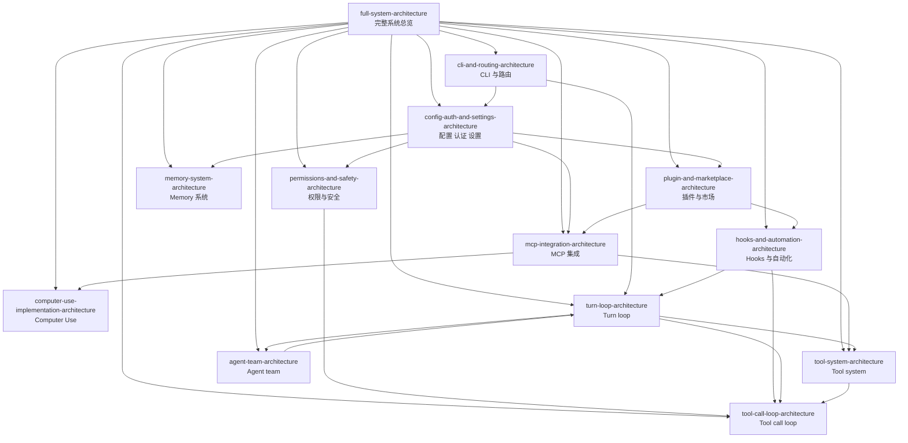

# Claude Code Lesson 架构索引

本索引页把当前 `Lesson/` 目录中的 13 篇架构文档按模块关系重新组织，方便从完整系统图跳转到专题图。

## 1. 模块导航关系图

## 2. 阅读顺序建议

如果想按“从外到内”的方式理解 Claude Code，推荐顺序：

1. `full-system-architecture.md`
2. `cli-and-routing-architecture.md`
3. `config-auth-and-settings-architecture.md`
4. `permissions-and-safety-architecture.md`
5. `hooks-and-automation-architecture.md`
6. `plugin-and-marketplace-architecture.md`
7. `mcp-integration-architecture.md`
8. `computer-use-implementation-architecture.md`
9. `memory-system-architecture.md`
10. `turn-loop-architecture.md`
11. `tool-system-architecture.md`
12. `tool-call-loop-architecture.md`
13. `agent-team-architecture.md`

如果想按“运行时执行路径”理解，推荐顺序：

1. `cli-and-routing-architecture.md`
2. `config-auth-and-settings-architecture.md`
3. `turn-loop-architecture.md`
4. `tool-system-architecture.md`
5. `tool-call-loop-architecture.md`
6. `permissions-and-safety-architecture.md`
7. `hooks-and-automation-architecture.md`
8. `mcp-integration-architecture.md`
9. `computer-use-implementation-architecture.md`
10. `plugin-and-marketplace-architecture.md`
11. `memory-system-architecture.md`
12. `agent-team-architecture.md`
13. `full-system-architecture.md`

## 3. 文档分组

### 3.1 总览层

- [`full-system-architecture.md`](./full-system-architecture.md)
  - 完整系统总图
  - 源码调用链总时序图
  - 产品/模块分层简化总览图

### 3.2 入口与控制平面

- [`cli-and-routing-architecture.md`](./cli-and-routing-architecture.md)
  - CLI 入口
  - 参数解析
  - interactive / subcommand / special mode 路由

- [`config-auth-and-settings-architecture.md`](./config-auth-and-settings-architecture.md)
  - settings 合并
  - 认证与 OAuth 配置
  - 持久化配置与 transcript 策略

- [`permissions-and-safety-architecture.md`](./permissions-and-safety-architecture.md)
  - permission modes
  - allow / deny / ask / bypass
  - permission request / response

- [`hooks-and-automation-architecture.md`](./hooks-and-automation-architecture.md)
  - hook types
  - hook events
  - hook matcher 与 registry
  - 自动化执行链路

### 3.3 扩展与集成层

- [`plugin-and-marketplace-architecture.md`](./plugin-and-marketplace-architecture.md)
  - marketplace
  - plugin manifest
  - hooks / skills / agents / MCP / LSP 扩展面

- [`mcp-integration-architecture.md`](./mcp-integration-architecture.md)
  - MCP server schema
  - transport types
  - MCPTool 适配层
  - `claude mcp` 管理面

- [`computer-use-implementation-architecture.md`](./computer-use-implementation-architecture.md)
  - `Claude in Chrome` browser automation
  - `computer` / `read_page` / `tabs_context_mcp`
  - bridge / socket / tab routing
  - permission request / result normalization

- [`memory-system-architecture.md`](./memory-system-architecture.md)
  - auto memory
  - team memory
  - memory path 与安全校验
  - prompt 注入路径

### 3.4 运行时执行层

- [`turn-loop-architecture.md`](./turn-loop-architecture.md)
  - `Sk(...)` 主循环
  - compact
  - usage
  - tool_use 分支

- [`tool-system-architecture.md`](./tool-system-architecture.md)
  - built-in tools
  - deferred tools
  - MCP tools
  - Tool interface

- [`tool-call-loop-architecture.md`](./tool-call-loop-architecture.md)
  - 查找工具
  - schema 校验
  - 并发与队列
  - permission / hooks / tool_result 回写

- [`agent-team-architecture.md`](./agent-team-architecture.md)
  - TeamCreate
  - teammate runner
  - mailbox
  - shared task list
  - TeamDelete

## 4. 如何使用这套文档

- 想看**系统全貌**：先看 `full-system-architecture.md`
- 想看**CLI 如何把请求送入运行时**：看 `cli-and-routing-architecture.md`
- 想看**配置、认证、session persistence**：看 `config-auth-and-settings-architecture.md`
- 想看**工具执行安全门**：看 `permissions-and-safety-architecture.md`
- 想看**自动化切入点**：看 `hooks-and-automation-architecture.md`
- 想看**插件如何扩展系统**：看 `plugin-and-marketplace-architecture.md`
- 想看**MCP 如何接进工具系统**：看 `mcp-integration-architecture.md`
- 想看**浏览器版 computer use 如何落地**：看 `computer-use-implementation-architecture.md`
- 想看**memory 如何进入 prompt**：看 `memory-system-architecture.md`
- 想看**主循环和工具执行内环**：看 `turn-loop-architecture.md` + `tool-call-loop-architecture.md`
- 想看**多代理协作**：看 `agent-team-architecture.md`

## 5. 当前覆盖范围说明

当前 Lesson 已经基本把 `full-system-architecture.md` 中的主要模块群拆完。后续如果继续细分，比较自然的方向会是：

- telemetry / observability 专题
- remote session / bridge 专题
- transcript persistence 专题
- worktree / tmux runtime 专题

但在当前阶段，这些内容仍更适合作为现有专题的子章节，而不是单独拆新文档。
