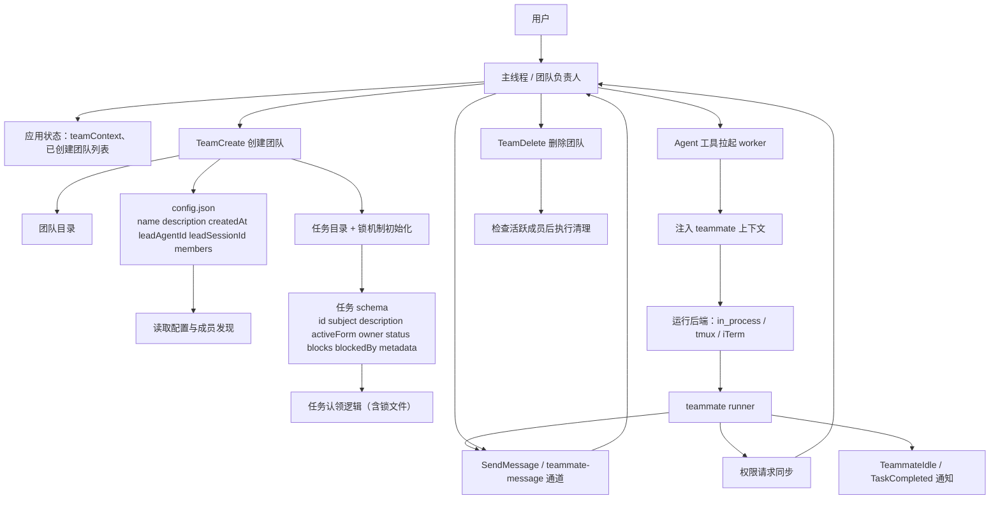
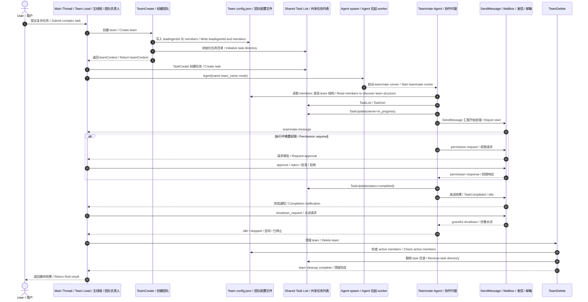

# Claude Code Agent Team 架构图

基于 `outputs/claude-cli-clean.js` 中与 `TeamCreate`、`Agent`、`SendMessage`、`TaskCreate/TaskUpdate/TaskList`、`TeamDelete` 相关实现整理。

## 1. 架构图

## 2. 架构图详细说明

### 2.1 顶层角色

- **User**：外部发起请求的人。
- **Main Thread / Team Lead**：主会话对应的领导代理，负责理解用户目标、创建 team、派发任务、接收 teammate 的反馈，并最终向用户汇报结果。
- **Teammate Agent**：由主线程通过 `Agent` 工具创建的协作代理，负责执行具体子任务。

从实现上看，主线程保存 team 相关上下文，teammate 以 `agentType: "teammate"` 的身份运行，且拥有专门的 teammate context。对应实现见：`outputs/claude-cli-clean.js:156488-156497`。

### 2.2 TeamCreate 做了什么

`TeamCreate` 并不只是“起一个名字”，而是一次完整的 team 初始化：

1. 规范化 team 名称。
2. 生成 `leadAgentId`。
3. 创建 team 配置文件 `config.json`。
4. 创建共享任务目录。
5. 把当前主线程写入 `teamContext`。
6. 把 leader 自己也登记到 `members[]` 中。

这部分核心逻辑在：`outputs/claude-cli-clean.js:199699-199774`。

其中 `config.json` 里至少包含这些关键字段：
- `name`
- `description`
- `createdAt`
- `leadAgentId`
- `leadSessionId`
- `members[]`

而 leader 成员项包含：
- `agentId`
- `name`
- `agentType`
- `model`
- `joinedAt`
- `tmuxPaneId`
- `cwd`
- `subscriptions`

### 2.3 Team config file 的作用

team 配置文件是 team 的“成员注册表 + 基础状态文件”。

它的职责主要有三个：

1. **记录 leader 与成员身份**
   - 谁是 `leadAgentId`
   - 当前有哪些 `members`

2. **支撑 teammate 发现彼此**
   - teammate 可以通过读取 `config.json` 来知道 team 内还有谁
   - 官方说明文字也明确写了这一点

3. **承载运行时信息**
   - 比如 `mode`
   - `isActive`
   - `tmuxPaneId`
   - 隐藏 pane 等状态

读写逻辑可见：`outputs/claude-cli-clean.js:158227-158277`。

### 2.4 Shared Task List 的作用

Task 系统是整个 team 协作的核心，不是附属能力。

共享任务目录下维护任务对象，任务字段至少包含：
- `id`
- `subject`
- `description`
- `activeForm`
- `owner`
- `status`
- `blocks`
- `blockedBy`
- `metadata`

对应定义可见：`outputs/claude-cli-clean.js:153667-153678`。

主线程和 teammate 都可以访问同一套任务：
- `TaskCreate`
- `TaskGet`
- `TaskList`
- `TaskUpdate`

它们共同构成一个共享工作队列。teammate 不是直接“听 leader 口头命令”工作，而是通过任务系统领取、推进和完成任务。

### 2.5 owner / blockedBy / blocks 的含义

这是任务协作里最关键的三个关系：

- **owner**：任务当前归谁处理。
- **blockedBy**：这个任务被哪些前置任务阻塞。
- **blocks**：当前任务完成前，会阻塞哪些后续任务。

claim 任务时会检查：
- 是否已被别人占有
- 是否已经完成
- 是否仍被未完成任务阻塞

对应逻辑在：`outputs/claude-cli-clean.js:153504-153545` 与 `outputs/claude-cli-clean.js:153558-153609`。

也就是说，team 的协作模型本质上是：
**共享任务图 + 所有权分配 + 阻塞关系管理**。

### 2.6 Agent spawn 到 teammate runner 的链路

当 leader 通过 `Agent` 工具创建 teammate 后，系统会启动 teammate runner，并注入 teammate context。这个 context 里包含：
- `agentId`
- `parentSessionId`
- `agentName`
- `teamName`
- `agentColor`
- `planModeRequired`
- `isTeamLead: false`
- `agentType: "teammate"`

对应逻辑：`outputs/claude-cli-clean.js:156468-156529`。

另外，runner 会给 teammate 附加 team 协作相关工具，至少包括：
- `SendMessage`
- `TeamCreate`
- `TeamDelete`
- `TaskCreate`
- `TaskGet`
- `TaskList`
- `TaskUpdate`

这说明 teammate 在运行时是被明确增强为“team worker”的，而不是普通的独立子代理。

### 2.7 SendMessage / Mailbox 的作用

`SendMessage` 是 team 内部通信总线的入口。

teammate 不能靠普通文本回复和其他代理通信，必须通过 `SendMessage`。消息在内部会以 `teammate-message` 相关标签或邮箱形式流转。常量定义可见：`outputs/claude-cli-clean.js:29291`。

在行为上，它承担几类通信：
- leader 给 teammate 派指令
- teammate 给 leader 汇报结果
- teammate 与 teammate 间协作
- 权限审批请求与回应
- shutdown 请求

所以图中的 `Mailbox / teammate-message channel` 代表的是**内部异步消息传输层**。

### 2.8 Permission request sync

当 teammate 执行工具需要权限时，不一定直接面向用户，而是可能先同步到 leader，由 leader 统一批准或拒绝，再把结果回传给 worker。

从实现上看：
- worker 发送 permission request 到 leader mailbox：`outputs/claude-cli-clean.js:155831-155859`
- leader 把 permission response 发回 worker：`outputs/claude-cli-clean.js:155861-155887`

这意味着 team 模式下，leader 不只是调度者，还是**权限协调中心**。

### 2.9 Runtime Backend 的含义

teammate 并不只有一种运行承载方式。实现里可以看到至少有：
- `in_process_teammate`
- `tmux` pane backend
- `iTerm` pane backend

相关代码可见：
- `outputs/claude-cli-clean.js:156496`
- `outputs/claude-cli-clean.js:157263`
- `outputs/claude-cli-clean.js:157713`
- `outputs/claude-cli-clean.js:157903`

所以架构上可以理解为：
**Agent/Team 是逻辑协作层，tmux/iTerm/in-process 是执行承载层**。

### 2.10 shutdown 与 idle 通知

team 协作不是 fire-and-forget。teammate 在完成一轮工作后会进入 idle，并通知 leader；leader 也可以通过 `shutdown_request` 要求其优雅退出。

相关事件和通知在代码中多处出现，例如：
- `TeammateIdle`
- `TaskCompleted`
- shutdown/unassign 逻辑

当 teammate 退出时，系统还会把它名下未完成任务重新设为未分配状态，方便 leader 再次调度。逻辑可见：`outputs/claude-cli-clean.js:153623-153645`。

### 2.11 TeamDelete 的作用

`TeamDelete` 是收尾动作，不只是删除一个目录。

它会：
1. 检查当前 team 是否仍有活跃成员。
2. 如果还有活跃 teammate，则拒绝清理。
3. 如果可以清理，则移除 team 目录与 task 目录。
4. 清空当前会话里的 team context。

实现见：`outputs/claude-cli-clean.js:199893-199918`。

所以它是一个**受保护的 team 生命周期终止操作**。

### 2.12 整体工作模型总结

综合来看，Claude Code 的 agent team 不是简单的“主 agent + 若干子 agent”，而是一个更明确的协作系统：

- **TeamCreate** 建立 team 身份与共享状态
- **Agent** 负责生成 worker
- **Task 系统** 负责工作分配与依赖管理
- **SendMessage / mailbox** 负责成员间通信
- **Permission sync** 负责权限统一协调
- **Runtime backend** 负责实际执行载体
- **TeamDelete** 负责有约束的生命周期结束

如果用一句话概括：

**它本质上是一个带共享任务队列、成员注册表、消息总线和权限回流机制的多代理协作框架。**

## 3. sequenceDiagram 时序图版

## 3.1 sequenceDiagram 详细说明

### 3.1.1 用户请求进入 leader

时序从 `User -> Lead` 开始，表示用户面对的始终是主线程。即使后面会生成多个 teammate，真正承担“对外协调”职责的还是 leader。

这和架构图中的角色划分一致：
- 用户只和主线程对话
- 主线程再把复杂工作拆给 team

### 3.1.2 TeamCreate 建立协作上下文

`Lead -> TeamCreate` 之后，系统会创建 team 的基础设施：
- 生成 team 标识
- 创建 `config.json`
- 创建共享任务目录
- 把 leader 写入 `members`
- 将 `teamContext` 回填到当前会话状态

因此时序图里 `TeamCreate -> Config` 和 `TeamCreate -> Tasks` 表示的是**team 元数据层**与**任务协作层**同时建立。

对应实现：`outputs/claude-cli-clean.js:199699-199774`。

### 3.1.3 leader 创建任务并启动 worker

在 team 建好后，leader 先通过 `TaskCreate` 把工作结构化，再调用 `Agent` 创建 teammate。

这一步说明两个事实：

1. **任务与 worker 是分离的**
   - 不是“先有 agent 再随口派活”
   - 而是先把工作写入共享任务系统，再让 worker 去消费

2. **Agent spawn 本质是 worker 启动动作**
   - runner 启动后，worker 才真正开始执行

对应实现：
- 任务工具集合：`outputs/claude-cli-clean.js:117500-117504`
- teammate runner：`outputs/claude-cli-clean.js:156468-156529`

### 3.1.4 worker 先读取 team 与任务，再开始执行

worker 启动后并不是立刻执行具体代码，而是先同步协作上下文：

1. 读取 `config.json` 了解 team 成员。
2. 读取 `TaskList` / `TaskGet` 了解有哪些可处理任务。
3. 通过 `TaskUpdate(owner=in_progress)` 抢占或标记任务。

这代表 teammate 是一个**基于共享状态驱动**的 worker，而不是完全靠 leader 单向推送命令。

对应逻辑：
- team file 读取：`outputs/claude-cli-clean.js:158230-158240`
- task claim / blocked 检查：`outputs/claude-cli-clean.js:153504-153545`

### 3.1.5 Mailbox 承担运行中的异步通信

worker 开始工作后，会通过 `SendMessage` 向 leader 汇报，例如：
- 我已经开始处理
- 我需要更多上下文
- 我已完成某一步
- 我需要权限审批

时序图里的：
- `Worker -> Mailbox`
- `Mailbox -> Lead`

表示消息不会直接“穿透式同步调用”，而是进入内部 mailbox / teammate-message 通道，再投递给目标成员。

这也是 team 能支持异步协作和多 worker 并存的关键。

对应常量与消息机制：`outputs/claude-cli-clean.js:29291`, `outputs/claude-cli-clean.js:155847-155853`。

### 3.1.6 alt 权限分支表示审批回流

时序图中的 `alt 执行中需要权限` 很重要，它不是可有可无的边角逻辑，而是 team 模式下的一个核心控制闭环。

流程是：

1. worker 执行到需要授权的工具调用。
2. worker 发出 permission request。
3. mailbox 把请求送到 leader。
4. leader 审批后把结果发回 worker。
5. worker 再决定继续还是中止。

这说明 team 模式里的权限并非每次都直接由用户面对单个 worker 决定，而是可以先通过 leader 聚合和协调。

对应实现：
- request：`outputs/claude-cli-clean.js:155831-155859`
- response：`outputs/claude-cli-clean.js:155861-155887`

### 3.1.7 任务完成与 idle 是两个不同信号

时序图里 worker 完成后做了两类动作：

1. `TaskUpdate(status=completed)`
2. `SendMessage` 发送结果 / `TaskCompleted` / `Idle`

这两者含义不同：

- **Task completed**：共享任务系统中的状态变化，面向调度。
- **Idle / result message**：worker 当前执行轮次结束，面向协作通信。

也就是说，一个 worker 完成任务后，既要更新共享状态，也要把结果通知 leader。只有这样 leader 才能继续做汇总、再分配或结束收尾。

相关逻辑：`outputs/claude-cli-clean.js:153623-153645`。

### 3.1.8 shutdown 是显式的生命周期管理

时序图后半段的 `shutdown_request` 表示 team 的 worker 生命周期是显式管理的，不是主线程结束了就自然“模糊消失”。

leader 会：
- 主动发送 shutdown 请求
- 等待 worker graceful shutdown
- 接收 idle / stopped 状态

这样做的意义是：
- 避免遗留活跃 teammate
- 避免 team 删除失败
- 确保未完成任务能被释放或重分配

### 3.1.9 TeamDelete 是最后的收尾屏障

`Lead -> TeamDelete` 不是普通清理，而是生命周期的最后一道保护步骤。

它会先检查 active members，再决定是否允许删除 team 与 task 目录。因此时序图里专门画出了：
- `TeamDelete -> Config: 检查 active members`
- `TeamDelete -> Tasks: 删除 task 目录`

这表明删除 team 之前，系统需要确认协作网络已经真正停稳。

对应实现：`outputs/claude-cli-clean.js:199893-199918`。

### 3.1.10 整个时序图表达的本质

这张时序图表达的不是单个 API 调用顺序，而是 Claude Code team 模式下的一整套协作闭环：

1. **建队**：TeamCreate 建立共享上下文
2. **派工**：leader 创建任务并启动 worker
3. **协作**：worker 基于 task + mailbox 工作
4. **审批**：必要时经由 leader 完成权限回流
5. **完成**：worker 更新任务并通知 leader
6. **收尾**：leader shutdown worker，并删除 team

所以从时序角度看，这个系统本质上是：

**一个以 leader 为协调中心、以任务系统为状态核心、以 mailbox 为通信总线的多代理执行流水线。**

## 4. 代码依据

- 全局 team/session 状态：`outputs/claude-cli-clean.js:3156`, `outputs/claude-cli-clean.js:3231`
- 任务流与 task polling：`outputs/claude-cli-clean.js:25261`, `outputs/claude-cli-clean.js:25475`
- teammate message tag：`outputs/claude-cli-clean.js:29291`
- TeamCreate 初始化 team config / tasks 目录 / teamContext：`outputs/claude-cli-clean.js:199699-199774`
- teammate runner 上下文与附加工具：`outputs/claude-cli-clean.js:156468-156529`
- task owner / blockedBy / unassign 逻辑：`outputs/claude-cli-clean.js:153514-153645`
- team config.json 读写与成员维护：`outputs/claude-cli-clean.js:158227-158277`
- TeamDelete 清理流程：`outputs/claude-cli-clean.js:199893-199918`
