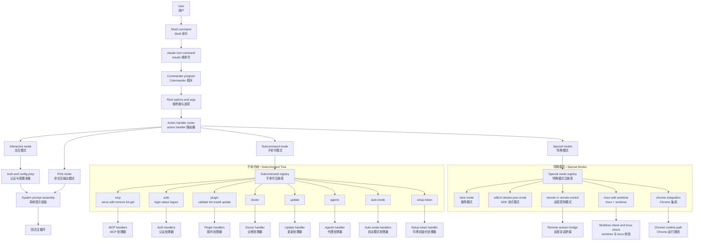

# Claude Code CLI 与路由架构图

基于 `outputs/claude-cli-clean.js` 中与 Commander 根命令、参数解析、interactive/subcommand/special mode 路由、`mcp/auth/plugin/...` 子命令树相关实现整理。

## 1. 架构图



## 2. 架构图详细说明

### 2.1 顶层入口不是直接进入主循环

Claude Code 的入口首先是 `claude` 根命令，而不是直接调用 `Sk(...)`。最上层先由 Commander 程序对象承接：

- 根命令名 `claude`
- 可选位置参数 `[prompt]`
- 大量 root options
- 子命令树注册
- 最终统一收口到根 `.action(...)`

这意味着“进入主循环”只是 CLI 顶层路由的一个分支，不是唯一执行路径。对应：`outputs/claude-cli-clean.js:311149-311189`, `375038-375060`。

### 2.2 根 action handler 才是真正的总路由器

`claude` 根命令的 `.action(...)` 负责把启动参数解释成不同运行模式：

- interactive mode
- print mode
- `sdkUrl` 驱动的 stream-json 模式
- remote / remote-control 模式
- worktree + tmux 模式
- bare mode
- continue / resume / fork-session 模式

同时它还会做大量前置合法性检查，例如：

- `--tmux` 必须配合 `--worktree`
- Windows 不支持 `--tmux`
- `--session-id` 与 `--continue/--resume` 的组合限制
- `--system-prompt` 与 `--system-prompt-file` 互斥
- `--append-system-prompt` 与对应 file 版本互斥
- `--fallback-model` 不能等于主模型

所以 CLI 路由层并不只是“分流命令”，还承担了第一层策略校验。对应：`outputs/claude-cli-clean.js:375061-375269`。

### 2.3 子命令模式是一棵独立命令树

除默认交互模式外，源码还注册了大量子命令：

- `mcp`
- `auth`
- `plugin`
- `doctor`
- `update`
- `agents`
- `auto-mode`
- `setup-token`

这些命令并不会进入同一条交互式 turn loop，而是各自延迟加载对应 handler，再进入专用功能子系统。也就是说，Claude Code 同时是：

- 一个交互式代理 CLI
- 一个配置/认证管理 CLI
- 一个插件和 MCP 管理 CLI
- 一个诊断/升级工具

对应：`outputs/claude-cli-clean.js:376646-376957`。

### 2.4 特殊模式说明它不是单一终端聊天器

根 action 中还有多个特殊运行路径：

- `--bare`：关闭 hooks、plugin sync、auto-memory 等附加能力
- `sdkUrl`：强制切到 `stream-json` 输入/输出
- `--remote` / `--remote-control`
- `--worktree` + `--tmux`
- `--chrome`

这说明 Claude Code 的 CLI 层不是简单包装一个 prompt，而是一个支持多宿主、多上下文、多输出协议的启动器。对应：`outputs/claude-cli-clean.js:375062-375178`。

## 3. 时序图

```mermaid
sequenceDiagram
    autonumber
    actor User as User / 用户
    participant Shell as Shell / 终端
    participant CLI as claude command / claude 命令
    participant Cmd as Commander router / Commander 路由器
    participant Root as Root action handler / 根 action 处理器
    participant Mode as Mode selector / 模式选择器
    participant Prep as Auth and config prep / 认证与配置准备
    participant Loop as Sk turn loop / Sk 主循环
    participant Sub as Subcommand handler / 子命令处理器
    participant Special as Special mode handler / 特殊模式处理器

    User->>Shell: 运行 claude 或 claude subcommand
    Shell->>CLI: 启动进程
    CLI->>Cmd: 注册 root command 与子命令
    Cmd->>Root: 解析参数并进入 action
    Root->>Mode: 校验 flags 与组合关系

    alt interactive or print / 交互或打印模式
        Mode->>Prep: 加载认证 配置 prompt 参数
        Prep->>Loop: 启动主循环
        Loop-->>User: 返回交互会话或输出结果
    else subcommand / 子命令模式
        Mode->>Sub: 分发到 mcp auth plugin 等 handler
        Sub-->>User: 返回子命令执行结果
    else special mode / 特殊模式
        Mode->>Special: 分发到 bare remote tmux chrome 等路径
        Special-->>User: 返回特殊模式结果
    end
```

## 4. 时序图详细说明

这张时序图强调的是“CLI 如何决定后续到底进入哪个系统”。关键不是模型调用，而是：

1. 先注册命令树
2. 再解析参数
3. 再做合法性检查
4. 最后决定进入 interactive、subcommand 还是 special mode

所以 CLI 层本身就是一个完整的控制平面。

## 5. 代码依据

- Commander 导出与程序对象：`outputs/claude-cli-clean.js:311149-311189`
- `claude` 根命令与 root options：`outputs/claude-cli-clean.js:375038-375060`
- 根 action 路由与模式校验：`outputs/claude-cli-clean.js:375061-375279`
- `mcp` 子命令树：`outputs/claude-cli-clean.js:376646-376716`
- `auth` 子命令树：`outputs/claude-cli-clean.js:376717-376754`
- `plugin` 与 marketplace 子命令树：`outputs/claude-cli-clean.js:376755-376847`
- `setup-token` / `agents` / `auto-mode` / 其他命令：`outputs/claude-cli-clean.js:376856-376957`
