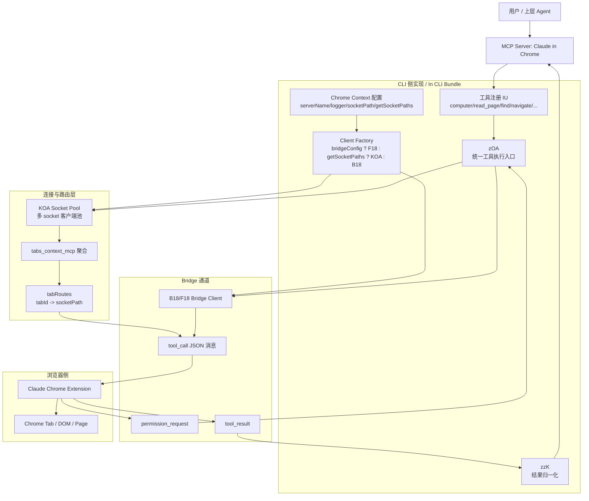
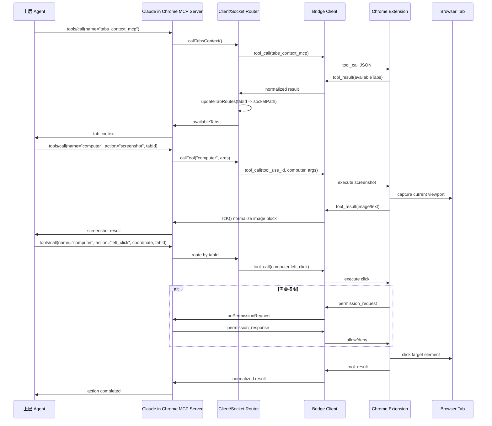

# Claude Code Computer Use 详细实现文档及架构图

基于 `outputs/cli.2.1.81.webcrack.js` 中浏览器自动化相关实现整理。先给结论：这个 bundle 里与 `computer use` 最直接对应的，不是 Anthropic 平台“服务端桌面环境”的完整执行器，而是 **`Claude in Chrome` 这条浏览器自动化实现链**。也就是说，当前文件里落地出来的是一个以 Chrome 扩展、bridge、socket/WS 通道、MCP tool 暴露为核心的 `computer` 工具体系。

换句话说，这里的 `computer use` 更准确地说是：

- 面向浏览器页面，而不是通用桌面
- 通过 Claude Chrome Extension 执行动作，而不是 CLI 直接操纵鼠标键盘
- 通过 MCP server 形态对上层暴露 `computer`、`read_page`、`find`、`navigate` 等工具

相关关键位置包括：

- 工具定义：`outputs/cli.2.1.81.webcrack.js:20917-21366`
- bridge 单客户端调用链：`outputs/cli.2.1.81.webcrack.js:20195-20840`
- 多 socket/多浏览器路由池：`outputs/cli.2.1.81.webcrack.js:35232-35457`
- MCP server 暴露与统一执行入口：`outputs/cli.2.1.81.webcrack.js:35624-35702`
- Chrome 扩展上下文配置：`outputs/cli.2.1.81.webcrack.js:526484-526519`
- 本地 socket 路径生成：`outputs/cli.2.1.81.webcrack.js:294537-294569`

## 1. 一张图看懂整体架构

## 2. 核心结论

### 2.1 这不是“裸电脑控制”，而是“浏览器自动化工具组”

源码里真正暴露给上层的工具不是只有一个 `computer`，而是一整组工具：

- `javascript_tool`
- `read_page`
- `find`
- `form_input`
- `computer`
- `navigate`
- `resize_window`
- `gif_creator`
- `upload_image`
- `get_page_text`
- `tabs_context_mcp`
- `tabs_create_mcp`
- `update_plan`
- `read_console_messages`
- `read_network_requests`
- `shortcuts_list`
- `shortcuts_execute`
- `switch_browser`

定义位置在 `outputs/cli.2.1.81.webcrack.js:20917-21366`。

这说明 `computer` 只是浏览器自动化能力集合中的一个“动作执行工具”，并不单独承担页面理解、元素定位、tab 发现、网络调试等职责。完整的 computer use 能力，是这组工具协同出来的。

### 2.2 `computer` 工具的职责是“动作执行”

`computer` 的 `inputSchema` 明确提供了浏览器交互动作：

- `left_click`
- `right_click`
- `double_click`
- `triple_click`
- `left_click_drag`
- `hover`
- `type`
- `key`
- `scroll`
- `scroll_to`
- `wait`
- `screenshot`
- `zoom`

并且支持的输入参数有：

- `coordinate`
- `start_coordinate`
- `region`
- `text`
- `duration`
- `scroll_direction`
- `scroll_amount`
- `repeat`
- `ref`
- `modifiers`
- `tabId`

对应位置：`outputs/cli.2.1.81.webcrack.js:21008-21089`。

从这里可以看出它的设计思想：

1. `computer` 负责“执行动作”
2. `read_page` / `find` 负责“理解页面与定位元素”
3. `tabs_context_mcp` 负责“会话/tab 上下文”
4. `navigate` / `resize_window` / `read_network_requests` / `read_console_messages` 负责“浏览器环境控制与调试”

因此这套实现本质上是 **感知层、定位层、动作层、调试层分离**。

## 3. 模块拆解

## 3.1 上下文与启动配置层

Chrome 自动化上下文由 `ALq(...)` 组装，关键字段包括：

- `serverName: "Claude in Chrome"`
- `socketPath: Xv8()`
- `getSocketPaths: Zv4`
- `clientTypeId: "claude-code"`
- `onAuthenticationError`
- `onToolCallDisconnected`
- `onExtensionPaired`
- `getPersistedDeviceId`
- 条件注入的 `bridgeConfig`

对应位置：`outputs/cli.2.1.81.webcrack.js:526484-526519`。

这里说明了两件事：

1. 上层并不是直接拿一个浏览器实例，而是先拿到一个“浏览器自动化上下文”
2. 这个上下文同时兼容两种连接模式：
   - 本地 socket 模式
   - 远端 bridge WebSocket 模式

### 3.2 socket 路径与多实例发现

本地连接路径由以下函数负责：

- `Ac6()`：生成浏览器 bridge 根目录
- `Xv8()`：生成当前进程使用的 socket path
- `Zv4()`：枚举可用 socket path

对应位置：`outputs/cli.2.1.81.webcrack.js:294537-294569`。

这层的意义是：

- CLI 不假设只有一个浏览器实例
- 可以扫描多个本地 socket
- 后续的 socket 池可以在多个浏览器扩展连接之间做路由

### 3.3 客户端工厂层

`$i8(A)` 用来决定实际采用哪种客户端：

- 有 `bridgeConfig` 时，走 `F18(A)`
- 有 `getSocketPaths` 时，走 `_OA(A)`，也就是 `KOA` 多客户端池
- 否则走 `B18(A)` 单客户端

对应位置：`outputs/cli.2.1.81.webcrack.js:35655-35662`。

这说明 computer use 的实现不是单一路径，而是做成了 **连接抽象层**：

- 单连接
- 多连接池
- 远端 WebSocket bridge

都被统一成同一个上层调用接口。

## 3.4 工具注册层

`pA8(A, q)` 创建一个 MCP server，并通过两个 request handler 向上暴露能力：

1. `tools/list`
2. `tools/call`

实现要点：

- `tools/list` 返回 `IU`
- 若没有 `bridgeConfig`，则过滤掉 `switch_browser`
- `tools/call` 一律走 `zOA(A, Y, name, arguments)`
- 底层 client 通知会被转发成 MCP notification

对应位置：`outputs/cli.2.1.81.webcrack.js:35664-35702`。

这一层非常关键，因为它说明：

- `computer` 不是 CLI 内部私有函数
- 它被包装成标准 MCP tool
- 上层 Agent 看见的是一个普通工具，但底层实际走的是浏览器桥接执行链

## 4. `computer use` 的执行链路

## 4.1 执行入口：`zOA(...)`

统一工具调用入口是 `zOA(A, q, K, _, Y)`：

- `set_permission_mode` 走 `wzK(...)`
- `switch_browser` 走 `OzK(...)`
- 其他工具先 `ensureConnected()`
- 连接成功后进入 `zzK(...)`
- 若未连接则返回统一的 disconnected 文本
- 非 bridge 错误则返回标准错误文本

对应位置：`outputs/cli.2.1.81.webcrack.js:35624-35650`。

这说明运行时并不把 `computer` 当特殊分支硬编码，而是走统一分发框架。

## 4.2 结果归一化：`zzK(...)`

`zzK(...)` 的职责是把 bridge 返回结构转成上层 MCP 期望的标准内容块：

- 处理 `result` / `error`
- 空结果时回退为 `"Tool execution completed"`
- 出错时标记 `isError`
- 对 `image` 类型做特别转换，把 `source.data` 提取成上层可消费的图片块
- 普通字符串转成 `text` block
- 遇到认证错误时触发 `onAuthenticationError()`

对应位置：`outputs/cli.2.1.81.webcrack.js:35465-35550`。

这一层解释了为什么 `computer` 的 `screenshot` / `zoom` 能自然回到上层模型上下文中：因为 bridge 返回的图片内容在这里被规范化为图片 block。

## 4.3 单客户端 bridge 调用

单客户端的核心调用链在 `callTool(A, q, K)` 中，关键步骤如下：

1. 检查 WebSocket 是否可用
2. 若还没选定浏览器扩展，先做 `discoverAndSelectExtension()`
3. 为本次调用生成 `tool_use_id`
4. 根据是否 `tabs_context_mcp` 选择不同 timeout
5. 将 pending call 存入 `pendingCalls`
6. 组装 `tool_call` JSON：
   - `type: "tool_call"`
   - `tool_use_id`
   - `client_type`
   - `tool`
   - `args`
   - 可选 `target_device_id`
   - 可选 `permission_mode`
   - 可选 `allowed_domains`
   - 可选 `handle_permission_prompts`
7. 通过 WebSocket 发给 bridge

对应位置：`outputs/cli.2.1.81.webcrack.js:20195-20276`。

这条链路可以概括为：

`MCP tool call -> bridge JSON RPC 风格消息 -> Chrome extension 执行`

## 4.4 权限请求与响应

bridge 在执行动作时可以发回 `permission_request`。处理逻辑是：

1. 通过 `tool_use_id` 找到对应 pending call
2. 取出：
   - `request_id`
   - `tool_type`
   - `url`
   - `action_data`
3. 调用上层注册的 `onPermissionRequest`
4. 再通过 `permission_response` 把 `allowed: true/false` 发回 bridge

对应位置：

- `handlePermissionRequest(...)`：`outputs/cli.2.1.81.webcrack.js:20676-20706`
- `sendPermissionResponse(...)`：`outputs/cli.2.1.81.webcrack.js:20707-20718`

这说明 computer use 并不是直接默认放开，它内建了一个 **异步权限门**。

## 4.5 工具结果处理

`handleToolResult(...)` 的职责是：

- 按 `tool_use_id` 命中 pending call
- 计算 duration
- 调用 `normalizeBridgeResponse(...)`
- 区分成功/失败埋点
- `tabs_context_mcp` 在未选定设备时走结果聚合
- 其他工具直接 `resolve`

对应位置：`outputs/cli.2.1.81.webcrack.js:20720-20790`。

这意味着 computer use 不是 fire-and-forget，而是标准的：

- 建立 pending state
- 等待异步结果
- 超时/错误/成功统一收口

## 5. 多浏览器与多 tab 路由

## 5.1 为什么需要 socket 池

`KOA` 不是简单的 client list，它解决的是两个实际问题：

1. 同时有多个浏览器实例接入
2. 同一个 `tabId` 后续动作必须路由回正确 socket

因此它维护：

- `clients`
- `tabRoutes`

对应位置：`outputs/cli.2.1.81.webcrack.js:35232-35457`。

## 5.2 `tabs_context_mcp` 是整个路由系统的关键

`callTabsContext(...)` 在多 socket 模式下会：

1. 对所有 connected client 并发调用 `tabs_context_mcp`
2. 收集结果
3. 清空并重建 `tabRoutes`
4. 合并所有 `availableTabs`
5. 重新包装成统一返回

对应位置：`outputs/cli.2.1.81.webcrack.js:35306-35375`。

所以 `tabs_context_mcp` 不是普通读取工具，而是整套 computer use 路由表的初始化器。

### 5.3 `tabId -> socketPath` 路由表

`updateTabRoutes(...)` 和 `extractTabs(...)` 会从 `tabs_context_mcp` 的文本 JSON 结果里解析出 tab 列表，然后写入：

- `tabRoutes.set(tabId, socketPath)`

对应位置：`outputs/cli.2.1.81.webcrack.js:35376-35418`。

后续 `callTool(...)` 再根据传入的 `tabId` 做精确路由：

- 命中路由就发给对应 client
- 没命中则回退到第一个 connected client

对应位置：`outputs/cli.2.1.81.webcrack.js:35269-35288`。

这是整个架构里最容易被忽略、但最关键的一层。没有它，多浏览器场景下 `computer(left_click, tabId=...)` 很容易发错浏览器。

## 6. 连接、配对与浏览器选择

## 6.1 bridge 连接过程

当存在 `bridgeConfig` 时，客户端会：

1. 获取 user ID / OAuth token
2. 连接 `${bridgeUrl}/chrome/${userId}`
3. 监听 bridge 消息
4. 处理：
   - `peer_connected`
   - `peer_disconnected`
   - `tool_result`
   - `permission_request`
   - 其他状态消息

可见位置主要在：

- `outputs/cli.2.1.81.webcrack.js:20427-20590`
- `outputs/cli.2.1.81.webcrack.js:20604-20674`

### 6.2 浏览器扩展发现与选择

在真正执行工具前，bridge client 会先执行扩展发现：

- `queryBridgeExtensions()`
- `discoverAndSelectExtension()`
- `selectExtension(deviceId)`

逻辑包括：

- 没有扩展时等待 `peer_connected`
- 只有一个扩展时自动选择
- 有历史配对设备时优先恢复
- 多扩展场景下广播配对请求

对应位置：`outputs/cli.2.1.81.webcrack.js:20291-20359`。

这部分说明此实现不是简单的“连上任意浏览器就行”，而是显式支持 **设备选择与持久化配对**。

### 6.3 `switch_browser`

`switch_browser` 是一个专门的控制工具，不属于动作执行本身。它的职责是：

- 在 bridge 模式下切换当前使用的 Chrome 浏览器
- 广播连接请求，让用户在目标浏览器中点击 Connect

对应位置：

- 工具定义：`outputs/cli.2.1.81.webcrack.js:21364-21366`
- 调用逻辑：`outputs/cli.2.1.81.webcrack.js:35574-35594`

说明作者把“browser selection”抽成了独立控制面，而不是塞进 `computer` 工具参数里。

## 7. `computer` 与其他工具的协作关系

## 7.1 推荐执行范式

从工具描述文字可以还原出官方期望的使用模式：

1. 先 `tabs_context_mcp`
2. 必要时 `tabs_create_mcp`
3. 再 `navigate`
4. 用 `read_page` 或 `find` 理解页面结构
5. 需要精确点击时先 `computer(screenshot)` 或 `computer(zoom)`
6. 再执行 `left_click` / `type` / `key` / `scroll`
7. 需要调试时读取 console / network

这套范式的设计意图是：

- 尽量先语义定位，再像素操作
- 截图只在必要时作为补充感知
- 把高风险、低确定性的坐标点击限制在后置步骤

## 7.2 感知与动作分层

这套实现本质上分为四层：

1. **上下文层**
   - `tabs_context_mcp`
   - `tabs_create_mcp`
2. **理解层**
   - `read_page`
   - `find`
   - `get_page_text`
3. **动作层**
   - `computer`
   - `form_input`
   - `navigate`
   - `resize_window`
4. **调试与辅助层**
   - `read_console_messages`
   - `read_network_requests`
   - `gif_creator`
   - `upload_image`
   - `shortcuts_*`

这也是为什么仅研究 `computer` 的 schema 还不足以理解完整 computer use 实现。

## 8. 时序图

## 9. 实现特点总结

### 9.1 优点

- **工具分层清晰**：页面理解、动作执行、调试能力解耦
- **连接抽象完整**：单 client、多 socket 池、远端 bridge 三种模式统一
- **支持多浏览器/多 tab 路由**：不是只支持一个活动页面
- **权限链路内建**：browser action 可被异步批准/拒绝
- **结果格式统一**：文本、图片、错误都能回到 MCP tool_result
- **具备控制平面**：`switch_browser`、`set_permission_mode` 作为控制型工具独立存在

### 9.2 限制

- 这里实现的是 **browser-use**，不是通用 OS 桌面控制
- 真正执行点击/输入的是 Chrome 扩展，CLI 只是调度与封装
- `tabId` 路由高度依赖先调用 `tabs_context_mcp`
- 部分行为受扩展权限、登录态、bridge 可用性影响

## 10. 最终结论

如果严格根据 `outputs/cli.2.1.81.webcrack.js` 来写“computer use 实现文档”，最准确的表述应该是：

1. 该文件中存在完整的 **浏览器级 computer use 实现链**
2. 其核心并非“直接控制桌面”，而是“通过 Claude Chrome Extension 执行浏览器动作”
3. `computer` 工具只是动作层，完整能力依赖 `tabs_context_mcp`、`read_page`、`find`、`navigate` 等周边工具协同
4. 系统架构可以拆成：
   - 工具定义层
   - MCP 暴露层
   - 客户端工厂层
   - socket/bridge 路由层
   - 权限处理层
   - 结果归一化层
   - Chrome 扩展执行层

因此，这份 bundle 中的 `computer use` 本质上是一个 **“MCP + Bridge + Chrome Extension + Tab 路由”的浏览器自动化架构**。
