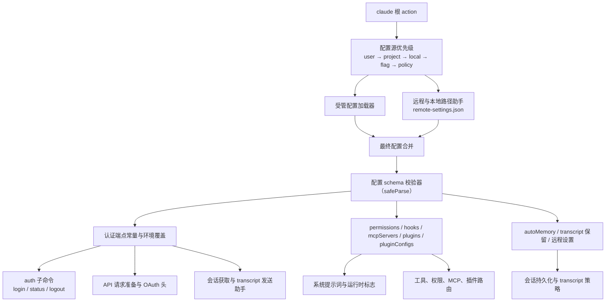
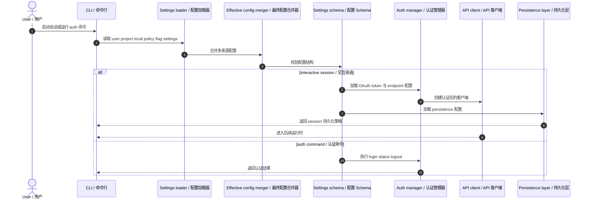

# Claude Code 配置、认证与设置架构图

基于 `outputs/claude-cli-clean.js` 中与 OAuth 配置、auth 命令、settings schema、managed/local/project/user settings、session persistence、transcript retention 相关实现整理。

## 1. 架构图

## 2. 架构图详细说明

### 2.1 配置不是单文件读取，而是多源合并

Claude Code 的配置来源至少包括：

- flag settings
- user settings
- project settings
- local settings
- policy or managed settings

也就是说，系统启动后并不是“读一个 settings.json 就结束”，而是先把多种来源合并成 effective settings，再进入后续认证和运行时准备。对应：`outputs/claude-cli-clean.js:35581-35586`, `37228-37583`。

### 2.2 settings schema 是核心边界

源码里 settings schema 非常大，包含：

- `permissions`
- `hooks`
- `mcpServers`
- `plugins`
- `additionalMarketplaces`
- `pluginConfigs`
- `autoMemoryEnabled`
- `autoMemoryDirectory`
- remote session 相关字段
- 各类 env、status line、SSH、UI 相关字段

因此配置层真正的核心不是某一个字段，而是“统一 schema + 分层来源 + 运行时投影”。对应：`outputs/claude-cli-clean.js:36407-36842`。

### 2.3 认证层与配置层是耦合在一起的

OAuth 配置中包含：

- `CLIENT_ID`
- `TOKEN_URL`
- `API_KEY_URL`
- `ROLES_URL`
- `MCP_PROXY_URL`
- `MCP_CLIENT_METADATA_URL`
- 不同环境下的 base URL 选择
- `CLAUDE_CODE_CUSTOM_OAUTH_URL` 与 `CLAUDE_CODE_OAUTH_CLIENT_ID` 覆盖逻辑

这说明认证不是一个完全独立的模块，而是建立在配置层的环境选择与 endpoint 决策之上。对应：`outputs/claude-cli-clean.js:28610-28724`。

### 2.4 auth 子命令是认证控制面

`auth login`、`auth status`、`auth logout` 构成了 CLI 暴露给用户的认证控制面。它们并不直接出现在主循环里，而是作为独立子命令进入认证处理器。对应：`outputs/claude-cli-clean.js:376717-376754`。

### 2.5 持久化层不仅保存 transcript

配置层还控制会话持久化，例如：

- transcript retention days
- `--no-session-persistence`
- remote session transcript 发送
- session ID 冲突校验
- result files 的写入

所以这部分既是 settings 问题，也是 persistence 问题。对应：`outputs/claude-cli-clean.js:36716`, `76098-76492`, `375053`。

## 3. 时序图

## 4. 时序图详细说明

时序上最重要的一点是：**认证发生在“配置合并与校验之后”**。也就是说，auth 并不是从空气里拿 token，而是依赖：

- 生效 settings
- 环境选择
- endpoint 选择
- remote/local 策略

然后 persistence 设置又会影响 session 是否写盘、写到哪里、保留多久。

## 5. 代码依据

- OAuth 与 endpoint 配置：`outputs/claude-cli-clean.js:28610-28724`
- settings sources 与 schema：`outputs/claude-cli-clean.js:35581-35586`, `36407-36842`
- remote/local/managed settings 路径：`outputs/claude-cli-clean.js:37228-37583`
- transcript retention：`outputs/claude-cli-clean.js:36716`
- remote transcript 与 session persistence：`outputs/claude-cli-clean.js:76098-76492`
- auth 命令：`outputs/claude-cli-clean.js:376717-376754`
