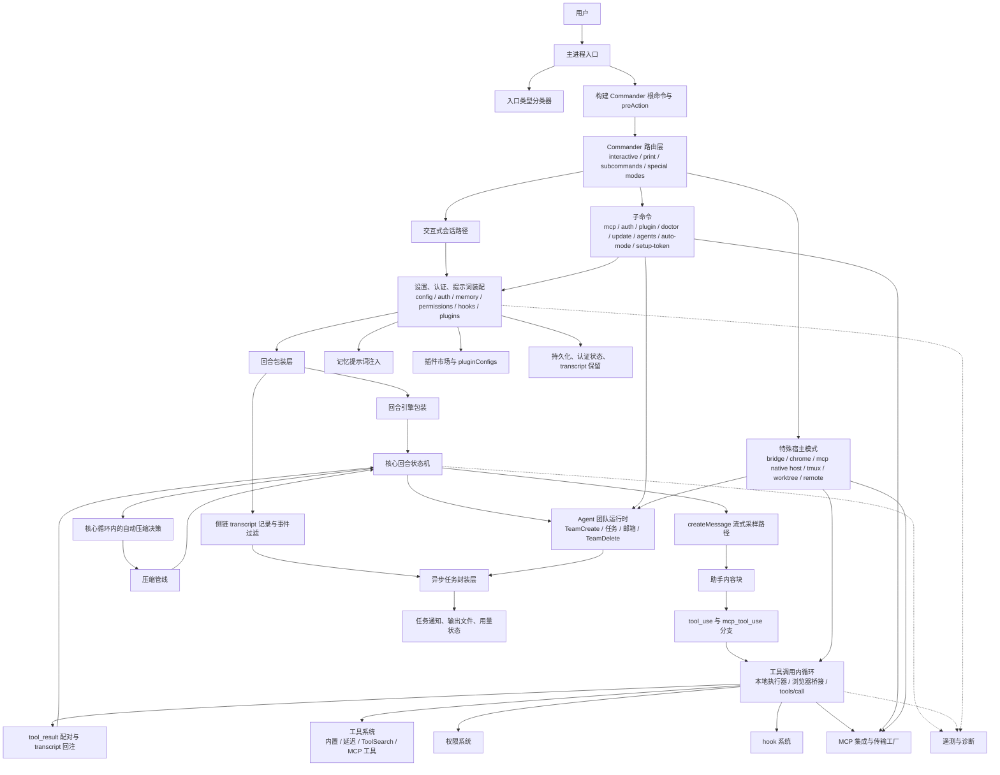
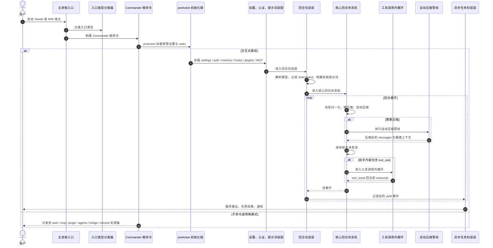
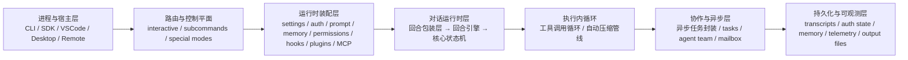

# Claude Code 完整系统架构图

基于 `outputs/claude-cli-clean.js` 中真实可见的 CLI 入口 `VLY()/NLY()/yLY()`、Commander 路由、交互式 turn runtime、tool inner loop、MCP/Chrome bridge、agent team、compact、async wrapper、settings/auth/persistence 与横切基础设施实现整理。

## 1. 完整系统架构图

## 2. 总体说明

这份总图现在按源码真实主链重画，不再把 Claude Code 只当成“CLI + 主循环 + 工具”三层抽象系统。

更准确的结构是：

1. `VLY()` 作为真正的主入口
2. `NLY()` 先决定 entrypoint 类型
3. `yLY()` 构建 Commander 根命令与 preAction 初始化链
4. Router 把请求分成 interactive、subcommand、special modes
5. interactive 路径进入 settings/auth/prompt/runtime 装配
6. `Sk -> OS -> PF_` 构成 turn runtime 主链
7. `tool_use` 进入 tool-call inner loop
8. compact 在 `PF_` 内部作为正式分支存在
9. `RG8(...)` 等外层包装把 turn runtime 收口为后台任务、通知和输出文件

## 3. 模块级详细说明

### 3.1 真正的系统入口是 `VLY()`，不是抽象的 “CLI”

源码里的真实顶层入口是 `VLY()`：`outputs/claude-cli-clean.js:374906-374972`。

它做的事情包括：

- 初始化进程级 handler
- 判断 `print/init-only/sdk-url` 等模式
- 决定是否进入非 TTY / SDK CLI 形态
- 调用 `NLY(...)` 设定 `CLAUDE_CODE_ENTRYPOINT`
- 再调用 `yLY()` 启动 Commander 路由层

因此总图里的第一层应该是 `VLY -> NLY -> yLY`，而不是直接写一个笼统的 `CLI entry`。

### 3.2 `NLY()` 决定 entrypoint 类型，是总路由前的环境分类层

`NLY(A)`：`outputs/claude-cli-clean.js:374890-374904`。

它会根据当前 argv / 环境把 entrypoint 归类为：

- `mcp`
- `claude-code-github-action`
- `sdk-cli`
- `cli`

而 `VLY()` 后面还会继续细分为：

- `sdk-typescript`
- `sdk-python`
- `claude-vscode`
- `local-agent`
- `claude-desktop`
- `remote`

这说明 Claude Code 不是单一 CLI 宿主，而是多宿主入口体系。

### 3.3 `yLY()` 才是 Commander 根命令与 preAction 初始化链

`yLY()`：`outputs/claude-cli-clean.js:374995-375060+`。

这一层做的不是业务执行本身，而是：

- 构建 Commander root command
- 注册 `preAction`
- 在 `preAction` 中加载 managed settings、初始化 sinks、migrations、remote settings、settings sync
- 之后才把请求真正路由到 interactive / subcommands / special handlers

所以源码上的“CLI 层”其实应拆为：

- process entry
- entrypoint kind detection
- commander root + preAction initialization
- concrete route handlers

### 3.4 interactive 路径前还有一整层 settings/auth/runtime 装配

interactive 模式不是 `yLY()` 直接调用 `Sk(...)`。

在进入 turn runtime 前，还要经过：

- settings merge
- auth state / OAuth / API key 决策
- memory prompt 注入
- permission context
- hooks / plugins / MCP tools 装配
- system prompt 构建

这些已经分别在专题文档里展开，但在总图里必须作为 `SETTINGS` 层存在，否则会误以为 main loop 直接裸调模型。

### 3.5 turn runtime 的真实主链是 `Sk -> OS -> PF_`

这一点是当前总图最关键的修正。

源码并不是只有一个 `Sk(...)` 主循环：

- `Sk(...)` 是 wrapper：`outputs/claude-cli-clean.js:177565-177833`
- `OS(...)` 是中层包装
- `PF_(...)` 是更底层的 while-loop state machine：`outputs/claude-cli-clean.js:203992-204488`

因此总图里要把 turn runtime 画成三层，而不是一个单节点。

### 3.6 `PF_` 内部已经包含 sampling、tool branch 和 autocompact

`PF_` 里至少维护这些状态：

- `messages`
- `toolUseContext`
- `autoCompactTracking`
- `turnCount`
- `pendingToolUseSummary`
- recovery flags

并且在每一轮里会做：

- content replacement / normalization
- `microcompact`
- `autocompact`
- create message stream
- tool branch
- transcript reinjection

所以总图里 `PF_` 不是单薄的“chat loop”，而是 Claude Code runtime 的核心状态机。

### 3.7 tool-call inner loop 是完整的执行内环，不是 `PF_` 的一条小箭头

当 assistant content 里出现 `tool_use` 或 `mcp_tool_use` 时，会进入完整 tool inner loop。

这条链至少覆盖：

- 本地执行器 `IM3`
- CLI beta runner `Zx6`
- `ChromeBridgeClient.callTool`
- `tools/call` / `requestStream`
- `tool_result` pairing validator

所以总图里把 `TOOLCALL` 单独抽成主模块是必要的。

### 3.8 compact 不是外围维护逻辑，而是在 core loop 里通过 `autocompact` 触发 `nZ6(...)`

源码里 `autocompact` 决策就在 `PF_` 内：`outputs/claude-cli-clean.js:204056-204083`。

而 `nZ6(...)` 再负责：

- pre_compact hooks
- summarize
- rebuild attachments / readFileState
- boundary marker
- post_compact / session hooks

对应：`outputs/claude-cli-clean.js:135656-135830`。

所以总图里 `AUTOCOMPACT -> nZ6 -> PF_` 这一段必须显式存在。

### 3.9 `Sk(...)` 还承担 event filter 和 sidechain transcript recorder

`Sk(...)` 在 yield 事件前，还会：

- 对事件做过滤
- 调 `tp([a], ...)` 记录 sidechain transcript
- 再把事件往上 yield

代码依据：`outputs/claude-cli-clean.js:177811-177815`。

因此 `Sk` 不是只做参数装配，也承担了 runtime event gateway 的职责。

### 3.10 `RG8(...)` 是后台任务 / agent 的外层壳，不是 turn core

`RG8(...)`：`outputs/claude-cli-clean.js:139625-139733`, `200250-200275`。

它负责：

- 消费 `Sk(...)` 的事件流
- 更新 usage / activity
- 维护 task state
- 生成 output file
- 派发 completion notification

因此总图里应把它放在 `Sk/PF_` 上方的 **outer async wrapper** 位置，而不是和 `PF_` 混成一个循环。

### 3.11 subcommands 和 special modes 会绕过 interactive 主链，直接连接对应子系统

真实架构里：

- `auth` 子命令更直接连 auth/settings
- `mcp` 子命令更直接连 MCP config/factory
- `agents`/`tmux`/`worktree` 更直接连 team/task runtime
- bridge / Chrome host 模式会直接接入 tool / MCP / browser bridge

所以总图中 subcommands 和 special modes 不应全部汇入同一个 main loop。

### 3.12 Chrome / MCP / bridge 不是边缘模块，而是系统级宿主分支

源码里有完整的 `ChromeBridgeClient`、Claude in Chrome MCP server、browser automation tool overrides 等实现。

这说明：

- Chrome bridge
- Chrome MCP
- remote bridge

都不是“插件例子”，而是 Claude Code 的正式运行分支。

## 4. 更偏源码调用链的时序图

## 5. 产品/模块分层简化总览图

## 6. 与专题文档的映射

- CLI 与路由：`Lesson/cli-and-routing-architecture.md`
- 配置认证设置：`Lesson/config-auth-and-settings-architecture.md`
- 权限与安全：`Lesson/permissions-and-safety-architecture.md`
- Hooks：`Lesson/hooks-and-automation-architecture.md`
- 插件：`Lesson/plugin-and-marketplace-architecture.md`
- MCP：`Lesson/mcp-integration-architecture.md`
- Memory：`Lesson/memory-system-architecture.md`
- Turn loop：`Lesson/turn-loop-architecture.md`
- Tool system：`Lesson/tool-system-architecture.md`
- Tool call loop：`Lesson/tool-call-loop-architecture.md`
- Agent team：`Lesson/agent-team-architecture.md`

## 7. 代码依据

- `NLY(...)`：`outputs/claude-cli-clean.js:374890-374904`
- `VLY(...)`：`outputs/claude-cli-clean.js:374906-374972`
- `yLY(...)` 与 Commander root / preAction：`outputs/claude-cli-clean.js:374995-375060+`
- `Sk(...)`：`outputs/claude-cli-clean.js:177565-177833`
- `PF_(...)` core loop：`outputs/claude-cli-clean.js:203992-204488`
- `autocompact` in core loop：`outputs/claude-cli-clean.js:204056-204083`
- `nZ6(...)`：`outputs/claude-cli-clean.js:135656-135830`
- `RG8(...)`：`outputs/claude-cli-clean.js:139625-139733`, `200250-200275`
- `ChromeBridgeClient`：`outputs/claude-cli-clean.js:19063-19703`
- Tool runtime / local executors：`outputs/claude-cli-clean.js:46974-47234`
- MCP integration / factory：`outputs/claude-cli-clean.js:145893-150838`
- Team runtime / `TeamCreate`：`outputs/claude-cli-clean.js:153493-153678`, `199699-199918`
