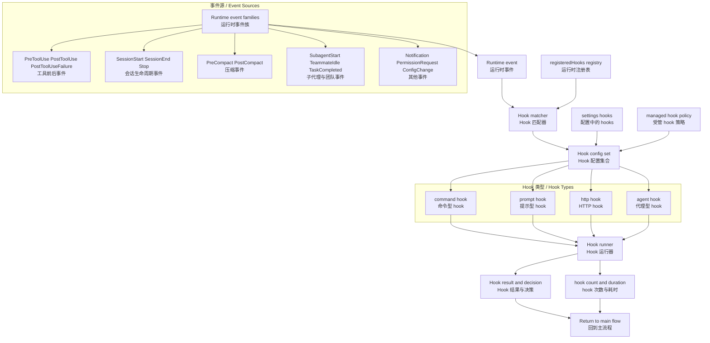
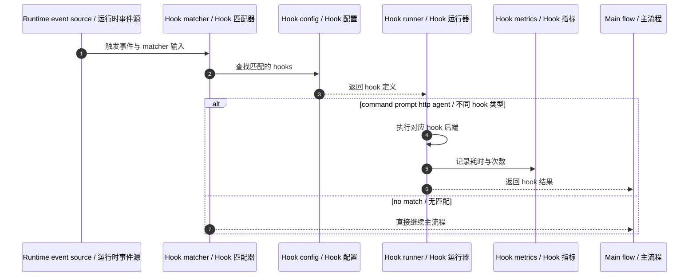

# Claude Code Hooks 与自动化架构图

基于 `outputs/claude-cli-clean.js` 中与 hook event、hook schema、settings hooks、hook registry、hook metrics、hook policy 相关实现整理。

## 1. 架构图

## 2. 架构图详细说明

### 2.1 Hook 系统是事件驱动自动化层

Hook 不是单独的工具，而是一套事件驱动自动化框架。系统先产生事件，再按 matcher 找到要执行的 hooks，然后由 hook runner 调用相应执行体。对应：`outputs/claude-cli-clean.js:36092`, `36161-36165`。

### 2.2 Hook 类型分为四类

源码中明确建模了四种 hook：

- `command`
- `prompt`
- `http`
- `agent`

这四类并不共享同一种执行方式：

- command 走 shell
- prompt 走 LLM prompt
- http 走 POST 请求
- agent 走 agentic verifier

因此 hook 系统本身已经是一个小型多后端执行框架。对应：`outputs/claude-cli-clean.js:36102-36143`。

### 2.3 事件枚举非常宽，说明 hook 贯穿多个子系统

事件不止工具调用，还包括：

- `SessionStart` / `SessionEnd`
- `Stop` / `StopFailure`
- `PreCompact` / `PostCompact`
- `SubagentStart` / `SubagentStop`
- `TeammateIdle`
- `TaskCompleted`
- `PermissionRequest`
- `ConfigChange`
- `WorktreeCreate` / `WorktreeRemove`

这说明 hooks 不只是 tool wrapper，而是贯穿 turn loop、team system、worktree、config 等多个模块。对应：`outputs/claude-cli-clean.js:36092`。

### 2.4 settings 与 managed policy 会共同影响 hook 生效范围

配置层里与 hooks 直接相关的字段包括：

- `hooks`
- `disableAllHooks`
- `allowManagedHooksOnly`
- `allowedHttpHookUrls`
- `httpHookAllowedEnvVars`

因此 hook 系统并不是“写了就会跑”，而是还要经过 policy 和 URL/env allowlist 的治理。对应：`outputs/claude-cli-clean.js:36733-36742`, `108849-108875`。

### 2.5 运行时还维护 hook registry 与统计数据

源码里还暴露：

- `registerHookCallbacks`
- `getRegisteredHooks`
- `getTurnHookDurationMs`
- `getTurnHookCount`
- `clearRegisteredHooks`
- `clearRegisteredPluginHooks`

说明 hooks 在运行时是可注册、可枚举、可统计的，而不是纯静态配置。对应：`outputs/claude-cli-clean.js:2273-2434`, `3119-3151`。

## 3. 时序图

## 4. 时序图详细说明

hook 执行时序可以概括为：

1. 某个模块触发事件
2. matcher 决定是否命中
3. hook runner 按类型执行
4. 结果返回主流程
5. 同时更新 hook 次数与时长统计

因此 hooks 更像一个“横切自动化总线”。

## 5. 代码依据

- hook 事件枚举：`outputs/claude-cli-clean.js:36092`
- hook schema 与 matcher schema：`outputs/claude-cli-clean.js:36102-36166`
- settings 中 hooks 与治理字段：`outputs/claude-cli-clean.js:36733-36742`
- effective hooks 选择逻辑：`outputs/claude-cli-clean.js:108849-108875`
- registry 与 metrics 导出：`outputs/claude-cli-clean.js:2273-2434`, `3119-3151`
