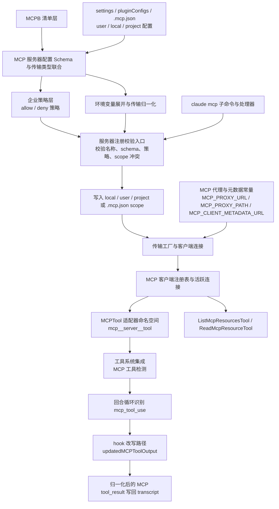
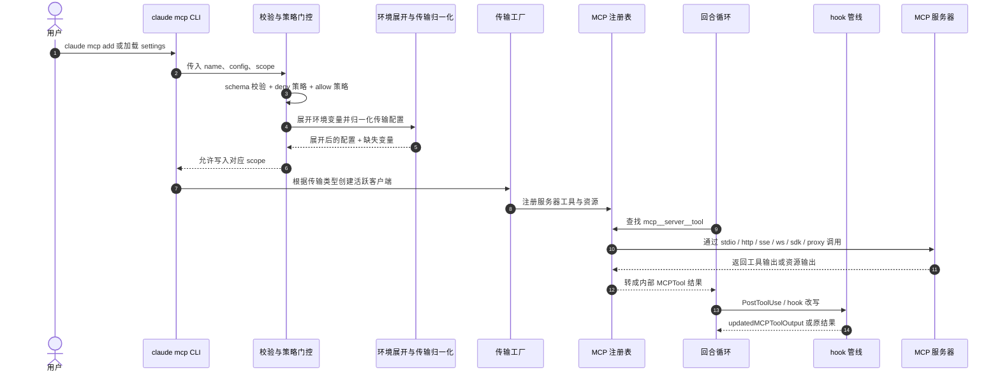

# Claude Code MCP 集成架构图

基于 `outputs/claude-cli-clean.js` 中与 MCPB manifest schema、`McpServerConfigSchema`、enterprise allow/deny policy、transport 归一化、`claude mcp` 子命令、MCPTool 适配层、`mcp_tool_use` 识别与 hook 输出改写相关实现整理。

## 1. 架构图

## 2. 架构图详细说明

### 2.1 MCP 集成不是单一 server schema，而是从 MCPB 到 runtime 的多层链路

当前文档最需要补强的点是：MCP 并不是“settings 里写一个 server，然后注册成工具”这么简单。

源码里至少能分出这些层：

1. **MCPB manifest / bundle schema 层**
2. **runtime MCP server config schema 层**
3. **enterprise policy allow/deny 层**
4. **transport expansion / normalization 层**
5. **connection factory / client wiring 层**
6. **MCPTool / resource tool adapter 层**
7. **turn loop 与 hook 回写层**

只有把这些层拆开，才接近“能还原源码”的粒度。

### 2.2 MCPB bundle 是独立于 runtime config 的上游输入层

源码里有一组 MCPB 相关 schema 与 manifest 处理逻辑：

- `Tv1`
- `Da7`
- `Pa7`
- `WF6`

对应范围：`outputs/claude-cli-clean.js:99755-99852`。

这说明 `.mcpb` / `.dxt` bundle 不是直接等于 runtime server config，而是先经过 manifest schema，再生成或映射到 runtime `mcp_config`。

所以文档里必须把 **MCPB manifest layer** 和 **runtime server config layer** 分开。

### 2.3 runtime server config 支持多种 transport，不止 stdio

MCP runtime config 的 union 覆盖多种 transport：

- `stdio`
- `sse`
- `http`
- `ws`
- `sse-ide`
- `ws-ide`
- `sdk`
- `claudeai-proxy`

对应：`outputs/claude-cli-clean.js:36179-36241`。

这意味着 MCP 在 Claude Code 里本质上是一个 **多 transport 连接抽象层**，而不是某种固定的 stdio 协议桥。

### 2.4 enterprise policy 会在 server 落盘前就做阻断

MCP policy 的关键函数包括：

- `X1_`
- `j1_`
- `J1_`
- `Sv4(...)`
- `_c6(...)`

关键范围：`outputs/claude-cli-clean.js:145790-145892`。

其中：

- `Sv4(...)` 判断 server 是否被 deny policy 明确拦截
- `_c6(...)` 判断 server 是否被 allow policy 放行

而且它不只按名字匹配，还会按：

- server command
- server url
- server name

做不同类型的匹配。

所以企业策略不是“配置完成后运行时再说”，而是在 server 注册阶段就参与决策。

### 2.5 `M1_(...)` 会做 env expansion 和 transport-specific normalization

`M1_(...)` 是 MCP 集成里很关键的一层。

它会按 transport 类型展开配置：

- `stdio`：展开 `command`、`args`、`env`
- `sse/http/ws`：展开 `url`、`headers`
- `sse-ide/ws-ide/sdk/claudeai-proxy`：直接保留结构

代码依据：`outputs/claude-cli-clean.js:145893-145943`。

并且它还会收集 `missingVars`，说明配置展开阶段本身就带有环境变量缺失检查。

因此架构上不能把 MCP config 当成静态 JSON；真实实现里还有一层 **runtime normalization + env interpolation**。

### 2.6 `e66(...)` 才是“add MCP server”真正的入口校验层

`e66(name, config, scope)` 做的事情比文档原先表达的多得多。

它至少会：

1. 校验名字格式
2. 拒绝 reserved name
3. 检查 enterprise exclusive control
4. 用 `du().safeParse(...)` 校验 transport config schema
5. 调用 `Sv4(...)` 检查 deny policy
6. 调用 `_c6(...)` 检查 allow policy
7. 根据 scope 检查是否和现有 server 冲突

代码依据：`outputs/claude-cli-clean.js:145945-145966` 及其后续 scope 分支。

所以如果要还原真实实现，`claude mcp add` 并不是“直接写设置文件”，而是先经过一个完整的 validation/policy gate。

### 2.7 `claude mcp add` 的 CLI handler `epq(...)` 本身就带 transport 解析逻辑

`epq(...)` 是 CLI `claude mcp add` 的关键处理器。

代码依据：`outputs/claude-cli-clean.js:359241-359374`。

从这里可以直接看出：

- 支持 `--scope`
- 支持 `--transport`
- 支持 `-e/--env`
- 支持 `-H/--header`
- 支持 OAuth client id / callback port
- 会根据输入像不像 URL 决定一些处理分支

这说明 CLI 管理面本身也不是薄薄一层，而是已经包含 transport-aware config assembly。

### 2.8 MCP proxy / metadata 是 transport family 的正式一支

源码里有这些常量：

- `MCP_CLIENT_METADATA_URL`
- `MCP_PROXY_URL`
- `MCP_PROXY_PATH`

对应：`outputs/claude-cli-clean.js:28610-28723`。

这说明 Claude Code 的 MCP 集成并不只面向本地/直连 server，也正式支持通过 Anthropic MCP proxy 和 metadata 服务接入。

因此架构上应该把 proxy / metadata 画进 transport factory 上游，而不是把它当成边缘补充信息。

### 2.9 transport factory 才真正把 config 变成 live client

MCP config 通过校验和展开后，还要进入 transport instantiation / client wiring 阶段。

关键范围：`outputs/claude-cli-clean.js:150620-150838`。

这层的职责是：

- 根据 transport type 创建对应 client
- 接好 registry / runtime connection
- 把远端 tools/resources 暴露给上层

也就是说，schema 之后还有一个 **runtime connection factory**，这也是原文档里缺的实现层。

### 2.10 MCP tool 会映射到内部工具命名空间

MCP tool 并不是直接裸暴露。

源码里明确存在：

- `mcp__<server>__<tool>` 命名模式
- `IE(tool)` 用于判断是否为 MCP tool：`outputs/claude-cli-clean.js:146741-146743`

这说明 MCP integration 的核心不是“旁路执行外部 server”，而是 **把远端能力映射进内部工具命名空间**。

### 2.11 turn loop 识别的是 `mcp_tool_use`

在 turn/runtime 里，MCP tool 已经被识别成单独的 tool-use 形态：

- `mcp_tool_use`

对应：`outputs/claude-cli-clean.js:46298-46299`。

这说明 MCP 集成最终并不是停留在 registry 层，而是深入到了 turn loop 的工具执行内环。

### 2.12 MCP hook 可以改写输出，而不是只能旁观

hook schema / runtime 中还专门给 MCP tool 输出预留了：

- `updatedMCPToolOutput`

对应：`outputs/claude-cli-clean.js:109913-109914`, `201403-201406`。

也就是说：

- MCP tool 执行后
- hook 可以返回改写后的 MCP 输出
- 再进入标准化结果回写链路

这使 MCP 不只是“接入工具系统”，还进入了 hook 后处理系统。

### 2.13 整体工作模型总结

如果按源码真实结构概括，Claude Code 的 MCP 集成更像下面这条链：

1. MCPB / settings / CLI 先提供 server config 来源
2. runtime schema 校验 transport shape
3. enterprise policy 做 allow/deny gate
4. `M1_(...)` 做 env expansion 和 transport normalization
5. `e66(...)` 决定是否允许注册并写入对应 scope
6. transport factory 建立 live MCP client
7. registry 把远端能力映射成 `MCPTool` / resource tools
8. turn loop 通过 `mcp_tool_use` 使用这些工具
9. hook 层还能通过 `updatedMCPToolOutput` 改写结果

如果用一句话概括：

**Claude Code 的 MCP 不是一个单独插件点，而是一条从 manifest、policy、transport factory 一直到 turn loop / hook rewrite 的完整集成链。**

## 3. 时序图

## 4. 时序图详细说明

### 4.1 这条时序图把“配置阶段”和“执行阶段”明确拆开

前半段是配置控制面：

- CLI / settings / MCPB
- `e66(...)` 校验与策略
- `M1_(...)` 归一化
- transport factory 建立连接

后半段才是执行面：

- turn loop 找到 MCP tool
- registry 通过 transport 调 MCP server
- hook 层改写结果

这比“Config -> Registry -> Adapter -> ToolLoop”更贴近真实源码结构。

### 4.2 `e66(...)` 是配置面最关键的收口点

它把：

- name validation
- schema validation
- deny/allow policy
- scope collision check

集中到了一个入口函数里，所以在时序图里值得单独作为 gate participant。

### 4.3 MCP server 执行并不直接跳过内部工具系统

即使最终是远端 server 在执行能力，Claude Code 仍然会先把它映射进内部 `MCPTool` / resource tool，然后再由 turn loop 通过 `mcp_tool_use` 触发。

所以 MCP 不是系统外的一条旁路，而是内部工具系统的一种来源。

## 5. 代码依据

- MCP transport schema / union：`outputs/claude-cli-clean.js:36179-36241`
- MCPB manifest schema：`outputs/claude-cli-clean.js:99755-99852`
- enterprise policy helpers `X1_ j1_ J1_ Sv4 _c6`：`outputs/claude-cli-clean.js:145790-145892`
- `M1_(...)` transport normalization：`outputs/claude-cli-clean.js:145893-145943`
- `e66(...)` add-server gate：`outputs/claude-cli-clean.js:145945-145966`
- MCPTool detection `IE(tool)`：`outputs/claude-cli-clean.js:146741-146743`
- MCP tools and resource tools：`outputs/claude-cli-clean.js:147467-147812`
- transport factory / client wiring：`outputs/claude-cli-clean.js:150620-150838`
- MCP proxy / metadata constants：`outputs/claude-cli-clean.js:28610-28723`
- `claude mcp add` handler `epq(...)`：`outputs/claude-cli-clean.js:359241-359374`
- `mcp_tool_use` recognition：`outputs/claude-cli-clean.js:46298-46299`
- hook output rewrite `updatedMCPToolOutput`：`outputs/claude-cli-clean.js:109913-109914`, `201403-201406`
