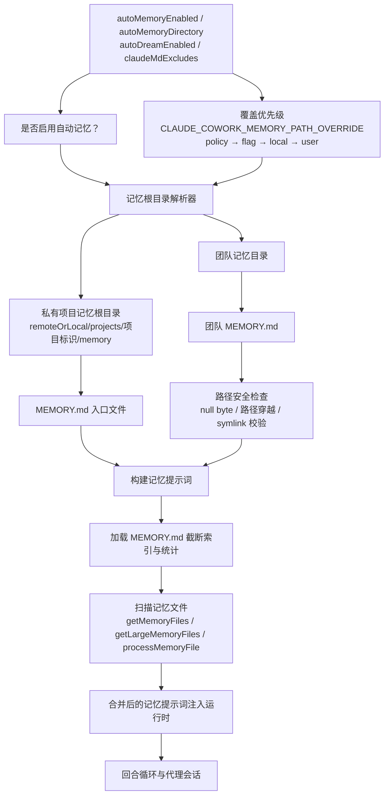

# Claude Code Memory 系统架构图

基于 `outputs/claude-cli-clean.js` 中与 auto-memory、team memory、memory path、安全校验、memory file 扫描与 settings 开关相关实现整理。

## 1. 架构图



## 2. 架构图详细说明

### 2.1 Memory 系统有明显的配置入口

memory 相关 settings 至少包括：

- `autoMemoryEnabled`
- `autoMemoryDirectory`
- `autoDreamEnabled`
- `claudeMdExcludes`

这说明 memory 不是固定写死路径，而是一个受配置控制的上下文子系统。对应：`outputs/claude-cli-clean.js:36817-36820`, `36840`。

### 2.2 记忆目录分为 local、remote、team 三类路径

源码里可以看到：

- 默认 auto-memory 路径
- remote memory dir 切换逻辑
- team memory 目录 `join(aw(), "team")`
- team `MEMORY.md` 入口文件

因此 memory 不只是“单个 MEMORY.md”，而是按运行上下文分层。对应：`outputs/claude-cli-clean.js:38011-38075`, `70331-70335`。

### 2.3 team memory 特别强调路径安全

team memory 的实现里有大量路径校验：

- null byte 检查
- `..` 与 `/` 的 traversal 检查
- URL 编码后的 traversal 检查
- Unicode normalize 后的 traversal 检查
- symlink loop 与 escaping 检查
- 必须 containment 在 team memory 目录下

这说明 memory 在架构上不仅是上下文存储，也被视为一个安全边界。对应：`outputs/claude-cli-clean.js:70300-70405`。

### 2.4 Memory 文件会被扫描并注入 prompt 上下文

memory 相关函数包括：

- `getMemoryFiles`
- `getLargeMemoryFiles`
- `getAllMemoryFilePaths`
- `processMemoryFile`
- `isMemoryFilePath`

这意味着运行时不是简单读取一个文件，而是把 memory 当成一个可扫描、可筛选、可处理的上下文集合。对应：`outputs/claude-cli-clean.js:116229-116607`。

## 3. 时序图

```mermaid
sequenceDiagram
    autonumber
    actor User as User / 用户
    participant Settings as Memory settings / 记忆设置
    participant Resolver as Memory dir resolver / 记忆目录解析器
    participant Files as Memory files / 记忆文件
    participant Guard as Path safety checks / 路径安全检查
    participant Prompt as Prompt builder / Prompt 构建器
    participant Loop as Turn loop / 主循环

    User->>Settings: 启用或使用 memory
    Settings->>Resolver: 决定 local remote team memory 路径
    Resolver->>Files: 找到 MEMORY.md 与相关文件
    Files->>Guard: 校验路径与目录包含关系
    Guard->>Prompt: 提供可用 memory 内容
    Prompt->>Loop: 注入 prompt 上下文
    Loop-->>User: 在后续回合中使用记忆
```

## 4. 时序图详细说明

这条时序的重点是：memory 不是主循环里的临时变量，而是先经过目录解析、文件发现、安全校验，再进入 prompt 组装阶段。

## 5. 代码依据

- memory settings：`outputs/claude-cli-clean.js:36817-36820`, `36840`
- remote/local memory 目录逻辑：`outputs/claude-cli-clean.js:38011-38075`
- team memory API 与路径：`outputs/claude-cli-clean.js:70293-70335`
- team memory 路径安全校验：`outputs/claude-cli-clean.js:70300-70405`
- memory file 扫描与处理：`outputs/claude-cli-clean.js:116229-116607`
