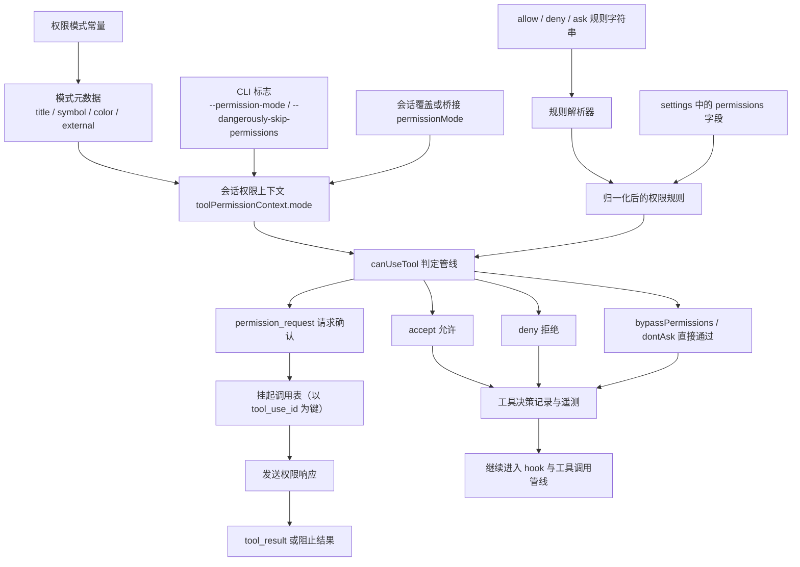
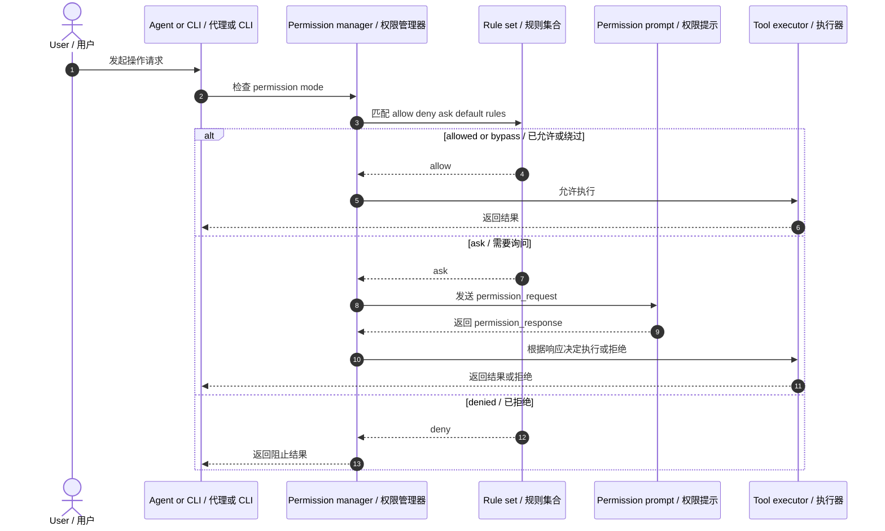

# Claude Code 权限与安全架构图

基于 `outputs/claude-cli-clean.js` 中与 permission modes、permission rules、permission request/response、settings 中 allow/deny/ask/defaultMode、CLI 权限参数等实现整理。

## 1. 架构图

## 2. 架构图详细说明

### 2.1 权限系统的核心不是单个弹窗，而是“模式 + 规则 + 请求链路”

源码里权限系统至少包含三层：

1. permission mode
2. permission rules
3. permission request / response 交互链路

也就是说，Claude Code 的权限控制并不是简单的 yes/no，而是一个完整的策略系统。对应：`outputs/claude-cli-clean.js:35581-35683`, `19004-19156`, `19544-19572`。

### 2.2 permission mode 决定默认行为

源码暴露的模式包括：

- `acceptEdits`
- `bypassPermissions`
- `default`
- `dontAsk`
- `plan`
- 外部模式中的 `auto`

这些模式决定系统遇到潜在危险操作时更偏向：

- 直接放行
- 强制询问
- 使用分类器自动决定
- 计划模式下限制执行

因此权限系统首先是“模式驱动”，再是“规则细化”。对应：`outputs/claude-cli-clean.js:35581-35683`。

### 2.3 规则来源是分层的

权限规则不只来自一个地方，还会受到以下来源影响：

- settings 中的 `allow` / `deny` / `ask`
- `defaultMode`
- `disableBypassPermissionsMode`
- CLI 参数，如 `--permission-mode`
- `--dangerously-skip-permissions`
- session override
- managed policy

这使得权限系统天然具备“全局规则 + 会话覆盖 + 策略管控”的结构。对应：`outputs/claude-cli-clean.js:36622-36624`, `36671-36679`, `375038-375045`。

### 2.4 请求链路是工具执行前的安全门

当某个操作需要显式确认时，系统会走：

- `permission_request`
- 用户或上层回调给出决定
- `permission_response`
- 再决定是否真正执行工具

这意味着权限系统并不是外挂 UI，而是工具运行时的一部分。对应：`outputs/claude-cli-clean.js:19544-19572`。

## 3. 时序图

## 4. 时序图详细说明

这里的关键点是：**执行器不会绕过权限系统直接运行**。权限判定先发生，工具执行后发生。只有 bypass/allow/ask 成功后，操作才进入 Bash、Git、Web 或 MCP 等真正执行层。

## 5. 代码依据

- permission modes 与模式映射：`outputs/claude-cli-clean.js:35581-35683`
- settings 中的 permissions 字段：`outputs/claude-cli-clean.js:36622-36624`, `36671-36679`
- session 权限上下文与 permissionMode：`outputs/claude-cli-clean.js:19004-19156`
- permission request/response：`outputs/claude-cli-clean.js:19544-19572`
- CLI 权限相关参数：`outputs/claude-cli-clean.js:375038-375045`
