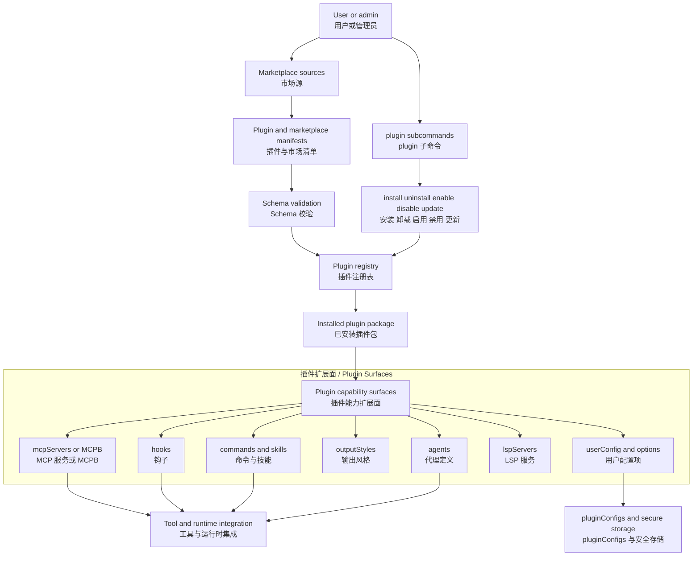
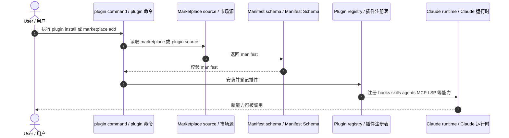

# Claude Code 插件与市场架构图

基于 `outputs/claude-cli-clean.js` 中与 plugin manifest、marketplace schema、plugin CLI、plugin configs、plugin hooks/skills/agents/LSP/MCP 扩展能力相关实现整理。

## 1. 架构图

## 2. 架构图详细说明

### 2.1 插件不是单一命令，而是一组可注册能力

插件 manifest 中不只描述名字和版本，还能携带：

- hooks
- commands
- skills
- agents
- outputStyles
- MCP servers 或 MCPB
- LSP servers
- userConfig

因此插件系统不是“装一个脚本”，而是“把一组可扩展能力注入 Claude Code 运行时”。对应：`outputs/claude-cli-clean.js:36360-36447`。

### 2.2 marketplace 与 installed plugin 是两层结构

源码中同时定义了：

- marketplace source
- installedPlugins
- installedPluginsHistory
- additionalMarketplaces
- strictKnownMarketplaces
- blockedMarketplaces

这说明插件系统在架构上分为：

1. 市场源管理
2. manifest 拉取与校验
3. 本地安装与启停
4. 历史与策略控制

对应：`outputs/claude-cli-clean.js:36333-36603`, `36763-36765`。

### 2.3 plugin CLI 是插件控制面

插件相关 CLI 命令包括：

- `plugin validate`
- `plugin list`
- `plugin marketplace add/list/remove/update`
- `plugin install`
- `plugin uninstall`
- `plugin enable`
- `plugin disable`
- `plugin update`

因此插件系统既有运行时层，也有完整 CLI 控制面。对应：`outputs/claude-cli-clean.js:376755-376847`。

### 2.4 pluginConfigs 把插件运行期配置接回 settings 层

`pluginConfigs` 允许为每个插件保存：

- `mcpServers` 用户配置值
- `options` 非敏感配置值
- 敏感配置转入 secure storage

这意味着插件系统并不是独立文件夹，而是和 settings/persistence 系统深度耦合。对应：`outputs/claude-cli-clean.js:36794-36797`, `36420-36421`。

## 3. 时序图

## 4. 时序图详细说明

这条时序强调两件事：

1. 先有 marketplace 或 plugin source
2. 再经 schema 校验后进入 registry
3. 最后才把 hooks/skills/agents/MCP/LSP 等能力暴露给运行时

所以插件安装本质上是“受控能力注入流程”。

## 5. 代码依据

- 官方市场名与 manifest 规则：`outputs/claude-cli-clean.js:36333-36354`
- plugin manifest 主体：`outputs/claude-cli-clean.js:36360-36447`
- userConfig 与敏感配置：`outputs/claude-cli-clean.js:36420-36421`
- marketplace 与 installed plugin 结构：`outputs/claude-cli-clean.js:36505-36603`
- additionalMarketplaces 与 pluginConfigs：`outputs/claude-cli-clean.js:36763-36797`
- plugin CLI：`outputs/claude-cli-clean.js:376755-376847`
