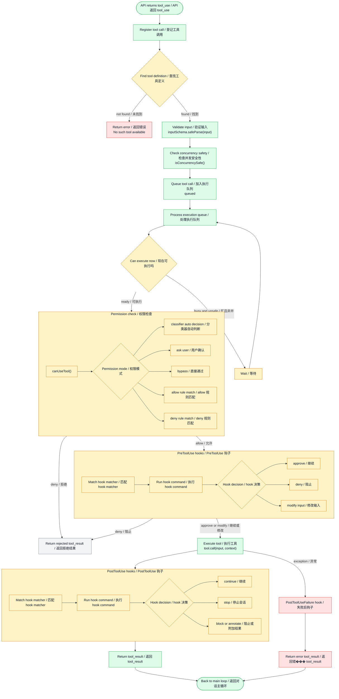
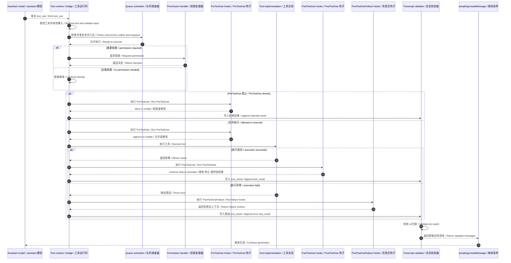

# Claude Code Tool Call Loop 架构图 / Tool Call Loop Architecture

基于 `outputs/claude-cli-clean.js` 中与 `tool_use`、`tool_result`、`tools/call`、权限请求、结果回注、以及流式回合继续执行相关实现整理。

## 1. 架构图 / Architecture Diagram

## 2. 架构图详细说明 / Detailed Explanation

### 2.1 tool call loop 的起点 / Start of the tool call loop

tool call loop 的起点不是用户输入本身，而是模型在 assistant content 中产出 `tool_use` block。

The tool call loop does not start from raw user input itself. It starts when the model emits a `tool_use` block inside assistant content.

这意味着工具调用是 turn loop 的中途分支，而不是完全独立的子系统。

That means tool execution is a mid-turn branch of the larger turn loop, not a completely separate subsystem.

### 2.2 每个工具调用都带有 tool_use_id / Every tool call carries a `tool_use_id`

在 bridge 调用实现中，系统会先生成一个唯一 id：`outputs/claude-cli-clean.js:19078-19086`。

- `let w = crypto.randomUUID()`
- 之后把它写入 `tool_use_id`

这个 id 是整条链路的主键：

- 发起 `tool_call` 时带上它
- 权限请求时用它回溯 pending call
- 返回 `tool_result` 时用它对上原始调用

This id is the primary key of the whole loop:

- attached to the outgoing `tool_call`
- used to find the pending call during permission handling
- used again to match the returning `tool_result`

### 2.3 工具执行主链不止是 permission 和 tool_result / The execution path includes more than permission and tool_result

你指出得对，原图过度强调了 `permission_request -> tool_result -> transcript` 这一段，但少了真正的工具执行主链中间层。

You were right. The previous diagram emphasized the `permission_request -> tool_result -> transcript` slice, but it underrepresented the internal execution pipeline in the middle.

补全后，主链应当包括这些阶段：

1. 查找工具定义 / find tool definition
2. `inputSchema.safeParse(input)` 输入校验
3. `isConcurrencySafe()` 并发安全检查
4. queued / process queue 队列调度
5. `canUseTool()` 权限判定
6. `PreToolUse` hooks
7. `tool.call(input, context)` 实际执行
8. `PostToolUse` hooks
9. 异常时进入 `PostToolUseFailure`
10. 返回 `tool_result` 并回到主对话循环

So the tool call loop is not only a permission bridge. It is a longer execution pipeline with validation, scheduling, hooks, execution, failure handling, and then transcript reintegration.

### 2.4 输入校验与工具查找 / Tool lookup and input validation

在真正执行前，系统首先需要把 `tool_use.name` 映射到具体工具定义，然后用该工具的 schema 校验输入。

Before execution, the system must resolve `tool_use.name` to a concrete tool definition and then validate the input against that tool's schema.

代码依据：

- `inputSchema.safeParse(...)`：`outputs/claude-cli-clean.js:137573-137579`
- 另一处 tool input 校验：`outputs/claude-cli-clean.js:152353-152361`
- 另一处 tool input 校验：`outputs/claude-cli-clean.js:174898-174898`

这一步对应图中的：

- `Find tool definition / 查找工具定义`
- `Validate input / 验证输入`

如果工具不存在或输入不合法，tool call loop 会在真正执行前被截断。

### 2.5 并发安全与队列 / Concurrency safety and queueing

工具并不是一律立刻执行。代码里大量工具实现暴露了 `isConcurrencySafe()`，说明运行时会根据工具是否可并发来调度执行。

Tools are not always executed immediately. Many tool implementations expose `isConcurrencySafe()`, which indicates the runtime schedules execution according to concurrency safety.

代码依据：

- 多处 `isConcurrencySafe()`：例如 `outputs/claude-cli-clean.js:117633`, `121538`, `147472`
- queued message 渲染：`outputs/claude-cli-clean.js:152393-152399`

因此图里补上了：

- `Check concurrency safety / 检查并发安全性`
- `Queue tool call / 加入执行队列`
- `Process execution queue / 处理执行队列`
- `Wait / 等待`

这里表达的是概念性主链：先判断并发属性，再决定立即执行还是排队。

### 2.6 权限检查是执行前闸门 / Permission check is the gate before execution

权限检查层仍然重要，但它位于查找、校验、排队之后、执行之前。

The permission layer is still important, but it sits after lookup/validation/queueing and before the actual tool call.

代码依据：

- tool decision 记录与埋点：`outputs/claude-cli-clean.js:137656-137691`
- `canUseTool()` 相关调用主链：`outputs/claude-cli-clean.js:201346-201346`

因此 flowchart 里把权限层展开成：

- `canUseTool()`
- classifier auto decision
- ask user
- bypass
- allow rule match
- deny rule match

这更符合真实实现的控制分层。

### 2.7 PreToolUse hooks 在真正执行前运行 / `PreToolUse` hooks run before execution

代码里明确存在这些 hook 事件：

- `PreToolUse`
- `PostToolUse`
- `PostToolUseFailure`

对应依据：`outputs/claude-cli-clean.js:36092`, `135304-135306`, `109893-109916`。

此外，工具执行进度渲染里也明确标记了 `PreToolUse`：`outputs/claude-cli-clean.js:152381-152387`。

所以图里补上了 PreHook 子图，表示在真正 `tool.call(...)` 之前，系统还会：

1. 匹配 hook matcher
2. 执行 hook command
3. 根据 hook 决策继续、拒绝或修改输入

### 2.8 真正执行点是 `tool.call(input, context)` / The real execution point is `tool.call(input, context)`

权限与 pre-hook 都通过之后，才进入真正的工具执行点。

Only after permission and pre-hook checks pass does the system reach the actual execution point.

文档中的 `tool.call(input, context)` 是架构层表达，用来表示“进入具体工具实现”。它和上游的 dispatch/permission/hook 是不同层次。

### 2.9 PostToolUse hooks 与失败后钩子 / `PostToolUse` and failure hooks

工具执行成功后，还不会立刻结束，而是会进入 `PostToolUse` hooks。对应代码：`outputs/claude-cli-clean.js:201341-201439`。

当工具执行异常时，会进入 `PostToolUseFailure` hooks。对应代码：`outputs/claude-cli-clean.js:201440-201519`。

这也是你指出原图缺失的重要部分。因为少了这一层，图就看起来像“执行完直接回写结果”，而真实实现中间还有 hook 后处理。

### 2.10 返回 `tool_result` 后才回到主循环 / Return to the main loop only after `tool_result`

无论是正常路径还是异常路径，最终都会落到：

- `Return tool_result / 返回 tool_result`
- `Back to main loop / 返回对话主循环`

也就是把工具执行结果重新并入 transcript，然后交回上层 turn loop 继续采样。

## 3. sequenceDiagram 时序图版 / Sequence Diagram

## 4. 时序图详细说明 / Sequence Explanation

### 4.1 时序图现在覆盖了完整执行流水线 / The sequence diagram now covers the full execution pipeline

更新后的时序图不再只描述 `permission_request -> tool_result -> sampling/createMessage` 这条窄路径，而是补全为：

1. assistant 发出 `tool_use`
2. Runtime 查找工具并校验输入
3. Queue scheduler 按并发安全规则调度
4. Permission handler 做执行前审批
5. `PreToolUse` hooks 在执行前介入
6. Tool implementation 真正执行
7. 成功时进入 `PostToolUse`
8. 失败时进入 `PostToolUseFailure`
9. Transcript validator 校验 `tool_result` 与上一条 `tool_use` 的 id 对应关系
10. Sampler 用更新后的消息继续生成

The updated sequence diagram no longer shows only the narrow `permission_request -> tool_result -> sampling/createMessage` path. It now covers the full execution pipeline from tool emission to reintegration into sampling.

### 4.2 Runtime 负责把“模型意图”变成“真实调用” / Runtime turns model intent into a real invocation

运行时会登记 pending call、设置 timeout、附加权限模式，然后才真正发起调用。

The runtime registers a pending call, sets timeout and permission-related fields, and only then performs the actual invocation.

### 4.3 Permission handler 是执行前闸门 / The permission handler is a gate before execution

如果需要审批，工具不会直接执行，而是先走 `permission_request` / `permission_response`。

If approval is required, execution pauses until the permission loop completes.

### 4.4 Transcript validator 保证消息结构合法 / The transcript validator guarantees structural correctness

系统不允许随意拼接 `tool_result`，而是强制要求它们和上一条 assistant 消息里的 `tool_use` 成对出现且 id 一致。

The system does not allow arbitrary tool-result insertion. It enforces one-to-one structural pairing with the immediately preceding `tool_use` blocks.

### 4.5 Sampler 让回合继续闭环 / The sampler closes the loop and continues the turn

一旦 transcript 合法，系统就会再次请求 `sampling/createMessage`，让模型基于新上下文继续回答。

Once the transcript is valid, the system samples again so the assistant can continue with the tool output now included in context.

## 5. 代码依据 / Code References

- tool call 发起与 `tool_use_id`、`pendingCalls`：`outputs/claude-cli-clean.js:19063-19143`
- 权限请求与响应：`outputs/claude-cli-clean.js:19544-19586`
- tool result 处理与归一化：`outputs/claude-cli-clean.js:19588-19657`
- `requestStream(...)` 任务轮询：`outputs/claude-cli-clean.js:25261-25339`
- `tool_result` 与上一条 `tool_use` 的严格配对校验：`outputs/claude-cli-clean.js:25806-25825`, `outputs/claude-cli-clean.js:26150-26169`
- `tools/call` 请求与能力校验：`outputs/claude-cli-clean.js:25985-26011`, `outputs/claude-cli-clean.js:26092-26096`
