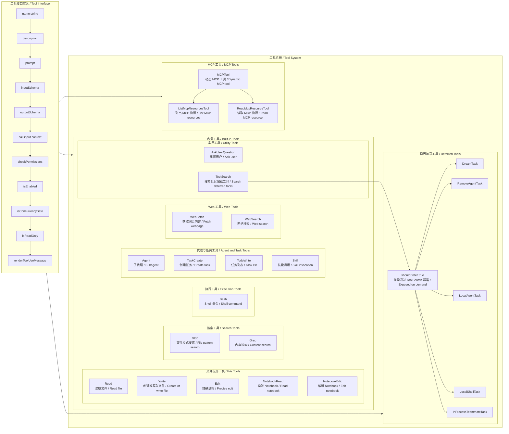
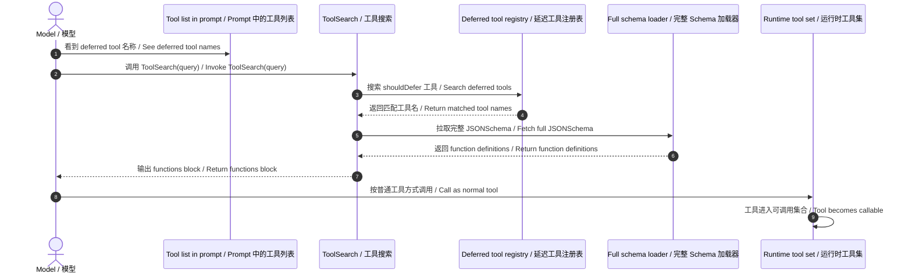

# Claude Code 工具模块图

基于你给出的结构草图，并结合 `outputs/claude-cli-clean.js` 中的工具接口、内置工具、MCP 工具、延迟加载工具与 `ToolSearch` 相关实现整理。

## 1. 工具模块图



## 2. 总体结构说明

这张图表达的是 Claude Code 工具系统的三层结构：

1. **统一工具接口层**
   - 所有工具都实现一组共用能力，例如 `inputSchema`、`outputSchema`、`call(...)`、`checkPermissions(...)`、`isConcurrencySafe()`、`isReadOnly()`、`renderToolUseMessage()`。
   - 这一抽象接口可以从基础工具对象实现中直接看到，例如 `outputs/claude-cli-clean.js:117628-117675`，以及 MCP 工具基类 `outputs/claude-cli-clean.js:147467-147524`。

2. **具体工具实现层**
   - 包括内置工具、MCP 工具、延迟加载工具。
   - 不同工具在能力边界上不同，但都遵循同一套工具接口。

3. **工具发现与暴露层**
   - 部分工具不会直接出现在初始工具列表中，而是通过 `ToolSearch` 按需发现并暴露。
   - 这部分由 `shouldDefer: true` 与 `ToolSearchTool` 共同实现。

## 3. 工具接口定义

从源码看，Claude Code 工具对象不是随意的字典，而是具有稳定接口的一类模块对象。

在基础工具对象中可以看到这些关键成员：

- `isEnabled()`
- `isConcurrencySafe()`
- `isReadOnly()`
- `description()`
- `prompt()`
- `inputSchema`
- `outputSchema`
- `call(...)`
- `checkPermissions(...)`
- `renderToolUseMessage(...)`

对应依据：

- `outputs/claude-cli-clean.js:117628-117675`
- `outputs/claude-cli-clean.js:121529-121557`
- `outputs/claude-cli-clean.js:134653-134744`
- `outputs/claude-cli-clean.js:147467-147524`

这说明系统在运行工具前后，依赖的是一套统一协议，而不是按工具名写死特例逻辑。

## 4. 内置工具模块

内置工具是主提示顶部直接暴露给模型的工具集合。你给出的分类和源码中的常量/使用痕迹基本对齐。

### 4.1 文件操作工具

图中列出的：

- `Read`
- `Write`
- `Edit`
- `NotebookRead`
- `NotebookEdit`

源码中可直接确认的相关项包括：

- `NotebookEdit`：`outputs/claude-cli-clean.js:73835`
- 文件模式工具集合中出现 `Read`、`Write`、`Edit`、`Glob`、`NotebookRead`、`NotebookEdit`：`outputs/claude-cli-clean.js:35886`
- transcript/tool UI 映射中出现 `Read`、`Write`、`Edit`、`NotebookEdit`：`outputs/claude-cli-clean.js:120233-120249`

这里尤其说明一点：`NotebookRead` 在源码中更多是作为“文件类 / notebook 类读取能力”被归到工具集合与模式匹配中，而不是像 `NotebookEdit` 那样在当前读取片段中单独展开实现。

### 4.2 搜索工具

- `Glob`
- `Grep`

这两个工具在 transcript/tool UI 元数据里有明确映射：

- `Glob`：`outputs/claude-cli-clean.js:120258-120260`
- `Grep`：`outputs/claude-cli-clean.js:120254-120257`

### 4.3 执行工具

- `Bash`

映射见：`outputs/claude-cli-clean.js:120250-120253`

### 4.4 代理与任务工具

图中列出：

- `Agent`
- `TaskCreate`
- `TodoWrite`
- `Skill`

源码中可确认的工具名常量包括：

- `TaskCreate`：`outputs/claude-cli-clean.js:117396`
- `Skill`：`outputs/claude-cli-clean.js:117397`
- `AskUserQuestion`：`outputs/claude-cli-clean.js:117400`
- `ToolSearch`：`outputs/claude-cli-clean.js:117441`

同时 transcript/tool UI 抽取中也能看到：

- `Agent`：`outputs/claude-cli-clean.js:120274-120276`
- `Task`：`outputs/claude-cli-clean.js:120270-120272`

这里的 `TodoWrite` 更像用户视角中的任务列表工具命名；源码在当前已读片段里没有像 `TaskCreate` 一样直接出现常量名，因此图中保留它作为用户提供结构中的“任务列表类工具”模块位置。

### 4.5 Web 工具

- `WebFetch`
- `WebSearch`

可直接确认：

- `WebFetch` 常量：`outputs/claude-cli-clean.js:73852`
- `WebSearch` 常量：`outputs/claude-cli-clean.js:73914`
- URL/query 抽取映射：`outputs/claude-cli-clean.js:120262-120268`
- 权限预校验规则：`outputs/claude-cli-clean.js:35889-35916`

### 4.6 实用工具

- `AskUserQuestion`
- `ToolSearch`

可直接确认：

- `AskUserQuestion` 常量：`outputs/claude-cli-clean.js:117400`
- `ToolSearch` 常量：`outputs/claude-cli-clean.js:117441`
- `ToolSearchTool` 导出：`outputs/claude-cli-clean.js:134493-134498`

## 5. MCP 工具模块

MCP 工具层与普通内置工具最大的区别，是它代表“外部 MCP server 暴露出的能力”。

### 5.1 MCPTool

`MCPTool` 的基础工具对象在源码中非常清楚：

- `isMcp: true`
- `isConcurrencySafe(): false`
- `isReadOnly(): false`
- `checkPermissions()` 返回 passthrough
- 提供一整套 render / result block 转换逻辑

对应：`outputs/claude-cli-clean.js:147467-147524`

这表明 MCP 工具在运行时被当成一个特殊工具族，而不是普通本地工具。

### 5.2 MCP 资源工具

源码中直接可见：

- `ListMcpResourcesTool`：`outputs/claude-cli-clean.js:147527-147628`
- `ReadMcpResourceTool` 名称与 defer 标记：`outputs/claude-cli-clean.js:147799-147812`

它们都挂在 MCP 能力侧，但接口形式仍然与统一工具接口兼容。

## 6. 延迟加载工具与 ToolSearch

这是 Claude Code 工具系统里很关键的一层，也是很多人第一次读源码时容易忽略的部分。

### 6.1 shouldDefer 的作用

源码中判断是否延迟暴露的核心逻辑：`outputs/claude-cli-clean.js:117520-117533`

关键点：

- 如果 `A.isMcp === true`，则视为延迟/动态类工具处理路径的一部分。
- 一般工具是否延迟，最终由 `A.shouldDefer === true` 决定。

也就是说，“某个工具暂时不出现在主工具列表中”，不是因为它不存在，而是因为它被标记为 deferred。

### 6.2 ToolSearch 的职责

`ToolSearchTool` 的说明写得很直接：

- 作用是“为 deferred tools 获取完整 schema 定义，使其可调用”
- 在 schema 尚未获取前，模型只知道名称，不知道完整参数结构

对应：`outputs/claude-cli-clean.js:117553-117564`

而 `ToolSearchTool` 的实现导出与 schema 定义见：

- `outputs/claude-cli-clean.js:134493-134498`
- `outputs/claude-cli-clean.js:134621-134629`
- 关键词匹配/精确选择逻辑：`outputs/claude-cli-clean.js:134546-134607`

因此图里专门把：

- `Deferred`
- `ToolSearch`
- 具体 deferred task 工具

画成一条单独关系链。

### 6.3 Deferred task 工具族

你给出的这些名字：

- `DreamTask`
- `RemoteAgentTask`
- `LocalAgentTask`
- `LocalShellTask`
- `InProcessTeammateTask`

很符合 Claude Code 内部“任务/执行体被工具化”的设计方向。当前已读源码片段能明确看到：

- `LocalShellTask`：`outputs/claude-cli-clean.js:132247`
- `InProcessTeammateTask`：用户提供结构与 team/tool 架构上下文一致

此外，系统中存在大量 task / agent / teammate 路径，说明这些 deferred task 工具并不是孤立概念，而是工具系统与异步任务系统之间的桥接层。

## 7. ToolSearch 加载时序图 / ToolSearch Loading Sequence



## 8. 这个模块图表达的核心关系

这张图想表达的不是“工具名清单”，而是下面三件事：

### 7.1 所有工具先服从统一接口

无论是：

- `Read`
- `Bash`
- `WebFetch`
- `ToolSearch`
- `MCPTool`

在运行时都要提供统一能力面，例如 schema、权限检查、并发安全、只读性、render 行为。

### 7.2 MCP 与 deferred 不是边缘特性，而是正式分层

Claude Code 的工具系统不是“固定内置工具 + 少量例外”，而是：

- 一层内置工具
- 一层动态 MCP 工具
- 一层 deferred 工具发现机制

这三层共同组成完整工具系统。

### 7.3 ToolSearch 是 deferred 工具的入口网关

`ToolSearch` 的意义不只是“搜索”，而是：

**让尚未 fully materialize 的工具，先以名字可见，再按需拉取完整 schema 进入可调用状态。**

这正是 deferred tool 设计成立的关键。

### 7.4 ToolSearch 的加载时序 / ToolSearch loading sequence

`ToolSearch` 不直接执行 deferred tool，它做的是“把 deferred tool 从仅名称可见，推进到 schema 完整、可正常调用”这一步。

`ToolSearch` does not execute the deferred tool directly. Its job is to move a deferred tool from “name-only visible” to “schema-complete and callable”.

时序上分成五步：

1. 模型先在 prompt 顶部看到 deferred tool 的名称。
2. 模型调用 `ToolSearch(query)`。
3. `ToolSearch` 在 deferred tool registry 中匹配工具名。
4. 系统返回完整 function definition / JSONSchema。
5. 该工具随后就能像普通工具一样被调用。

代码依据：

- deferred 判定：`outputs/claude-cli-clean.js:117520-117533`
- ToolSearch 说明文本：`outputs/claude-cli-clean.js:117553-117564`
- ToolSearch 导出：`outputs/claude-cli-clean.js:134493-134498`
- ToolSearch query/schema：`outputs/claude-cli-clean.js:134621-134629`
- ToolSearch 匹配逻辑：`outputs/claude-cli-clean.js:134546-134607`

## 8. ToolSearch 加载流程图 / ToolSearch Loading Flowchart

```mermaid
flowchart TD
    A[Model sees deferred tool names<br/>模型看到 deferred tool 名称] --> B[Call ToolSearch(query)<br/>调用 ToolSearch(query)]
    B --> C[Search deferred registry<br/>搜索 deferred 注册表]
    C --> D{Match found?<br/>找到匹配吗}
    D -- no / 否 --> E[Return matches empty<br/>返回空结果]
    D -- yes / 是 --> F[Resolve matched tool names<br/>解析匹配工具名]
    F --> G[Fetch full description and JSONSchema<br/>拉取完整描述和 JSONSchema]
    G --> H[Return functions block<br/>返回 functions block]
    H --> I[Tool becomes callable in runtime<br/>工具进入可调用集合]
    I --> J[Model calls tool normally<br/>模型按普通工具方式调用]
```

## 9. ToolInterface 字段职责表 / ToolInterface Responsibility Table

| 字段 | 作用 | 架构意义 |
|---|---|---|
| `name` | 工具唯一名称 | 作为模型选择工具、运行时分发、日志与 transcript 标识的主键 |
| `description()` | 返回工具说明 | 决定模型如何理解该工具的用途 |
| `prompt()` | 返回提示文本 | 决定工具在 prompt 中如何被暴露给模型 |
| `inputSchema` | 输入参数 schema | 用于参数校验、结构约束、生成 JSONSchema |
| `outputSchema` | 输出结果 schema | 用于结果结构校验，尤其适合结构化输出工具 |
| `call(input, context)` | 执行工具主体 | 真正进入工具实现的执行入口 |
| `checkPermissions(input)` | 执行前权限检查 | 决定工具是否需要询问用户、走 classifier 或直接放行 |
| `isEnabled()` | 是否启用 | 决定工具当前是否可被暴露和调用 |
| `isConcurrencySafe()` | 是否可并发执行 | 决定运行时是立刻执行还是排队调度 |
| `isReadOnly()` | 是否只读 | 影响安全分类、权限策略和只读行为判断 |
| `renderToolUseMessage()` | 渲染工具调用消息 | 决定 transcript / UI 中如何展示工具使用 |

### 9.1 接口职责补充说明 / Additional notes on interface responsibilities

这些字段不是文档装饰，而是运行时真实依赖的能力面。

They are not decorative fields. They are actual runtime capabilities that the tool system depends on.

例如：

- `inputSchema` 会被 `safeParse(...)` 用于输入校验
- `isConcurrencySafe()` 会影响工具调度与排队
- `checkPermissions(...)` 会进入权限判定链路
- `renderToolUseMessage()` 会影响 transcript / UI 展示
- `isReadOnly()` 会参与只读工具判断

代码依据：

- 基础接口对象：`outputs/claude-cli-clean.js:117628-117675`
- 另一处工具接口对象：`outputs/claude-cli-clean.js:121529-121557`
- ToolSearchTool 接口实现：`outputs/claude-cli-clean.js:134653-134744`
- MCPTool 接口实现：`outputs/claude-cli-clean.js:147467-147524`

## 10. 代码依据

- 工具 defer 判定：`outputs/claude-cli-clean.js:117520-117533`
- 基础工具接口对象：`outputs/claude-cli-clean.js:117628-117675`
- transcript/tool UI 映射：`outputs/claude-cli-clean.js:120233-120282`
- `ToolSearchTool` 导出与 schema：`outputs/claude-cli-clean.js:134493-134498`, `outputs/claude-cli-clean.js:134621-134629`
- `ToolSearch` 查询匹配逻辑：`outputs/claude-cli-clean.js:134546-134607`
- MCPTool 基础对象：`outputs/claude-cli-clean.js:147467-147524`
- `ListMcpResourcesTool`：`outputs/claude-cli-clean.js:147527-147628`
- `ReadMcpResourceTool`：`outputs/claude-cli-clean.js:147799-147812`
- `WebFetch` / `WebSearch` 权限规则：`outputs/claude-cli-clean.js:35889-35916`
- 工具名常量：`TaskCreate` / `Skill` / `AskUserQuestion` / `ToolSearch`：`outputs/claude-cli-clean.js:117396-117441`
