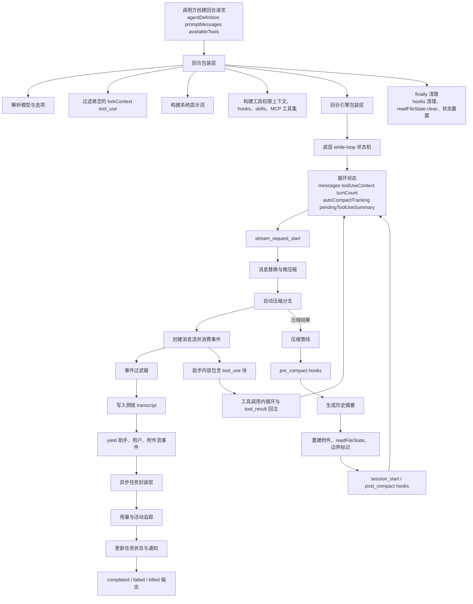
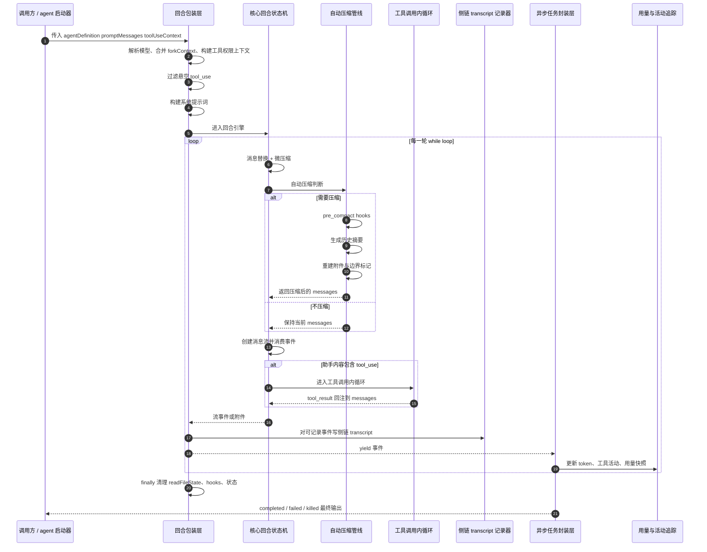

# Claude Code Turn Loop 架构图

基于 `outputs/claude-cli-clean.js` 中与 `Sk(...)`、`OS(...)` / `PF_(...)`、`RG8(...)`、`nZ6(...)`、`qY6()/i66()/xl()/KY6()`、fork context 过滤、system prompt 构建、autocompact 与异步任务封装相关实现整理。

## 1. 架构图

## 2. 架构图详细说明

### 2.1 `Sk(...)` 不是最底层 loop，而是 wrapper

当前文档最需要修正的一点是：`Sk(...)` 不是“唯一主循环本体”。

更准确的分层是：

- `Sk(...)`：上层 wrapper，负责准备执行环境并消费下层事件
- `OS(...)`：turn engine 包装层
- `PF_(...)`：更底层的 while-loop 状态机

关键依据：

- `Sk(...)`：`outputs/claude-cli-clean.js:177565-177833`
- `OS(...)` / `PF_(...)`：`outputs/claude-cli-clean.js:203984-204488`

所以如果要“还原源码”，架构图不能只写一个 `Sk async turn loop` 节点，而必须把 wrapper 层和真正的 core loop 层拆开。

### 2.2 `Sk(...)` 的职责是准备运行时，不只是转发参数

`Sk(...)` 至少负责这些事情：

1. 解析或确定 model
2. 合并 `forkContextMessages`
3. 构建 `toolPermissionContext`
4. 装载 hooks / skills / MCP tools / 可用工具集
5. 构建 system prompt
6. 调用 `OS(...)`
7. 对下层产出的事件做过滤和 sidechain transcript 记录
8. 在 finally 中做清理

因此 `Sk(...)` 更接近 **agent-aware turn wrapper**，而不是“while true 调模型”的最底层实现。

### 2.3 `Ih1(...)` 会先清理 fork context 里的悬空 `tool_use`

这是源码级很重要、但抽象图里很容易漏掉的一层。

`Ih1(...)` 会先扫描 fork context 中已有的 `tool_result.tool_use_id`，然后把没有对应结果的 assistant `tool_use` 过滤掉。

代码依据：`outputs/claude-cli-clean.js:177834-177857`。

这说明 turn loop 在正式进入下层执行前，会先修正 forked transcript 的结构合法性，避免把 dangling `tool_use` 带进下一轮。

### 2.4 `GL_(...)` 负责组装真正送入 loop 的 system prompt

`GL_(...)` 不是简单返回静态提示词，而是调用 agent definition 的 `getSystemPrompt({ toolUseContext })`，再经过统一 prompt 组装逻辑。

代码依据：`outputs/claude-cli-clean.js:177858-177867`。

所以从结构上说，system prompt 也不是 loop 外部已经固定好的输入，而是 turn wrapper 现场生成的运行时产物。

### 2.5 真正的 core state machine 在 `PF_(...)`

`PF_(...)` 一开始就把循环状态打包到一个 `J` 对象中，至少包含：

- `messages`
- `toolUseContext`
- `maxOutputTokensOverride`
- `autoCompactTracking`
- `stopHookActive`
- `maxOutputTokensRecoveryCount`
- `hasAttemptedReactiveCompact`
- `turnCount`
- `pendingToolUseSummary`

代码依据：`outputs/claude-cli-clean.js:204003-204013`。

这说明底层 turn loop 不是无状态地“收一批消息，吐一批消息”，而是一个明确维护多轮状态的 state machine。

### 2.6 `PF_(...)` 每一轮都会先做消息预处理

在真正采样前，`PF_(...)` 会做一串预处理：

- `UYq(P, D)` 之类的状态准备
- 发出 `stream_request_start`
- 计算 `queryTracking`
- 对消息做 `vk(P)` 拷贝
- `L34(...)` 做 content replacement / message normalization
- `microcompact(...)`
- `autocompact(...)`

代码依据：`outputs/claude-cli-clean.js:204029-204064`。

因此“turn loop = 直接 createMessage”也是过度简化。真实路径里，采样前还有规范化、微压缩、自动压缩判断等多个前置层。

### 2.7 compact 决策不是 loop 外的附属逻辑，而是在 core loop 里

另一个必须修正的点是：compact 不只是外部工具。

在 `PF_(...)` 内部，每轮都会调用 `deps.autocompact(...)`，并根据 `compactionResult` 继续更新状态。

代码依据：`outputs/claude-cli-clean.js:204056-204083`。

也就是说：

- compact 决策在 core loop 内部发生
- compact 成功后会影响后续 message set
- 它属于 turn execution 的正式分支

### 2.8 `nZ6(...)` 是完整的 compact pipeline，不只是“生成摘要”

`nZ6(...)` 的真实职责远大于 summarize。

关键步骤包括：

1. 触发 `pre_compact` hooks
2. 调用 `iW4(...)` 生成摘要
3. 处理 `readFileState`
4. 重建附件
5. 生成 compact boundary marker
6. 产出新的 `summaryMessages`
7. 触发 `session_start` / `post_compact` 相关 hooks
8. 返回压缩后的最小继续执行上下文

代码依据：`outputs/claude-cli-clean.js:135656-135830`。

所以源码里的 compact 本质上是：

**把长历史折叠成可继续运行的压缩会话状态。**

### 2.9 `tool_use` 不是顶层 event type，而是 assistant content 内的执行分支

当前很多图会把 `tool_use` 画成与 `assistant`、`user` 平级的 top-level stream event，但源码语义更细。

更准确的说法是：

- loop 产出 assistant message / stream event
- assistant content 中可能包含 `tool_use`
- 下层再进入 tool-call inner loop
- 生成 `tool_result` 后重新注回 messages

所以 `tool_use` 更像 assistant content 里的结构化分支，而不是完全独立于 assistant message 的顶层消息类型。

### 2.10 `Sk(...)` 在 yield 前还会做事件过滤与 sidechain transcript 写入

`Sk(...)` 在消费 `OS(...)` 产出的事件时，不是原样透传。

它会：

- 跳过某些 metrics-only event
- 直接透传 attachment
- 对通过 `ZL_(a)` 的事件，先写入 sidechain transcript：`tp([a], S, i)`
- 再 `yield a`

代码依据：`outputs/claude-cli-clean.js:177789-177815`。

这说明 turn loop 的上层 wrapper 同时承担了 **event gate** 和 **sidechain recorder** 的职责。

### 2.11 finally cleanup 也是 `Sk(...)` 的重要边界职责

`Sk(...)` 结束时会在 finally 中执行：

- `$6()`
- hooks cleanup
- `c.readFileState.clear()`
- `b.length = 0`
- `Up1(S)`
- `T04(...)`

代码依据：`outputs/claude-cli-clean.js:177823-177832`。

这意味着 turn loop 结束并不是“自然返回”就完了，而是明确有一层资源与状态收尾。

### 2.12 `RG8(...)` 是异步 agent/task 的外层封装，不是 turn core

`RG8(...)` 的角色也需要和 `Sk(...)` 区分开。

它做的是：

1. 接收 `makeStream: S => Sk({...})`
2. 用 `for await` 消费流
3. 调用 usage tracker 更新 task/app state
4. 结束后提取 final text
5. 生成 completed / failed / killed 结果
6. 写 output file / worktree result / notification

代码依据：`outputs/claude-cli-clean.js:139625-139733`, `200250-200275`。

所以架构分层应当是：

- `PF_`：真正的 loop 状态机
- `Sk`：面向 agent/runtime 的 wrapper
- `RG8`：面向后台任务与异步 agent 的任务外壳

### 2.13 usage tracking 在 wrapper 外层，而不是 `Sk(...)` 内核里

usage 统计主要由这些函数组成：

- `qY6()`：初始化 tracker
- `i66(...)`：消费 assistant/tool 活动
- `xl(...)`：导出 usage snapshot
- `KY6(...)`：构造 activity 描述

代码依据：`outputs/claude-cli-clean.js:207594-207644`。

而这些统计通常是在 `RG8(...)` 这种外围消费流的封装中更新，而不是 `Sk(...)` 内核自己维护。

这也是当前文档要修正的地方：usage tracking 属于 **stream consumer / task wrapper 层**，不完全属于 turn core。

### 2.14 整体工作模型总结

如果按源码真实结构概括，Claude Code turn loop 更接近下面的分层：

1. 调用方准备 agent request
2. `Sk(...)` 解析 model、构建 prompt、权限上下文、hooks、MCP/tool set
3. `Sk(...)` 调 `OS(...)`
4. `OS(...)` 进入 `PF_(...)` while-loop 状态机
5. `PF_(...)` 每轮做 replacement、microcompact、autocompact、采样、tool 分支处理
6. `Sk(...)` 过滤/记录事件并 yield
7. `RG8(...)` 一类外层封装消费这些事件，更新 usage、任务状态和最终通知

如果用一句话概括：

**Claude Code 的 turn loop 本质上是“`PF_` 状态机 + `Sk` 运行时包装层 + `RG8` 任务封装层”的三层结构。**

## 3. 时序图

## 4. 时序图详细说明

### 4.1 这条时序图表达的是三层嵌套，而不是一个单环

最重要的是分清三层：

- `Sk`：准备与清理
- `PF_`：循环执行
- `RG8`：外围消费与任务收尾

所以它不是传统意义上的单个“main loop sequence”。

### 4.2 compact 分支发生在 core loop 中间

时序图把 compact 画在 `PF_` 循环内部，是因为源码就是这么组织的：每轮都可能在真正采样前触发 `autocompact`。

### 4.3 tools 是 core loop 的内环

assistant content 一旦出现 `tool_use`，core loop 会暂停普通生成流程，进入 tool-call inner loop，等 `tool_result` 写回后再继续。

所以工具调用是 turn loop 的内环，不是并列的独立系统。

### 4.4 `RG8(...)` 只消费事件，不主导 loop 决策

`RG8(...)` 很重要，但它不决定采样、compact 或 tool 流程本身。它的职责是消费 `Sk(...)` 流、更新 usage、维护任务状态并产出最终结果。

## 5. 代码依据

- `Sk(...)` wrapper：`outputs/claude-cli-clean.js:177565-177833`
- `Ih1(...)` 过滤悬空 `tool_use`：`outputs/claude-cli-clean.js:177834-177857`
- `GL_(...)` 构建 system prompt：`outputs/claude-cli-clean.js:177858-177867`
- `OS(...)` / `PF_(...)` core loop：`outputs/claude-cli-clean.js:203984-204488`
- `PF_` 中的 loop state：`outputs/claude-cli-clean.js:204003-204013`
- `L34(...)` / `microcompact(...)` / `autocompact(...)`：`outputs/claude-cli-clean.js:204048-204064`
- `autocompact` 成功路径：`outputs/claude-cli-clean.js:204065-204083`
- `nZ6(...)` compact pipeline：`outputs/claude-cli-clean.js:135656-135830`
- `RG8(...)` async wrapper：`outputs/claude-cli-clean.js:139625-139733`
- `RG8` 调用 `Sk(...)`：`outputs/claude-cli-clean.js:200250-200275`
- usage tracker `qY6()/i66()/xl()/KY6()`：`outputs/claude-cli-clean.js:207594-207644`
