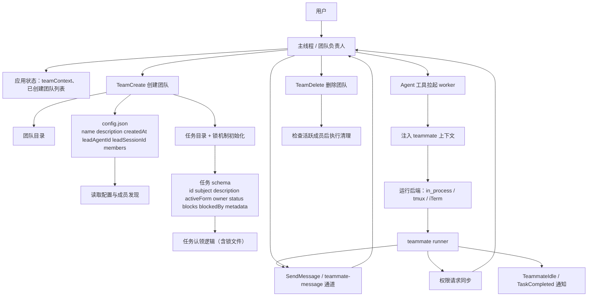

# Claude-Code-Reverse

## 免责声明 / Disclaimer

### 中文

本项目中涉及对 source map（map 文件）的分析、还原、逆向或调试内容，仅用于以下合法目的：

- 安全研究与防御性分析
- 经授权的代码审计、漏洞排查与应急响应
- 教学、学习与技术原理研究
- 对本人或已获得明确授权目标的兼容性、可观测性与调试验证

严禁将本项目中的任何内容用于：

- 未经授权地还原、分析、提取或传播第三方源码
- 规避版权、许可协议、访问控制或其他法律/合同限制
- 对他人系统、网站、前端资源或软件产物实施未授权测试、攻击或数据收集
- 任何侵犯隐私、知识产权、商业秘密或其他合法权益的行为

使用者应自行确保其行为符合所在地法律法规、目标系统的服务条款，以及相关授权与合规要求。因使用本项目内容而导致的任何直接或间接损失、法律责任、争议或后果，均由使用者本人承担；项目作者及贡献者不对任何滥用行为负责。

如果你不确定某项操作是否获得了充分授权，请不要继续操作。

### 删除与联系

如果你是相关权利人，并认为仓库中的内容对你的版权、商标权、商业秘密或其他合法权益造成影响，请联系维护者或提交 issue。维护者在核实后，愿意删除、修改或下线相关内容。

### English

Any content in this project related to analyzing, reconstructing, reversing, or debugging source maps (`.map` files) is provided solely for legitimate purposes, including:

- Security research and defensive analysis
- Authorized code auditing, vulnerability investigation, and incident response
- Education, learning, and technical research
- Compatibility, observability, and debugging validation on assets you own or are explicitly authorized to assess

You must not use any part of this project to:

- Reconstruct, analyze, extract, or distribute third-party source code without authorization
- Bypass copyright, license terms, access controls, or other legal or contractual restrictions
- Perform unauthorized testing, attacks, or data collection against other parties' systems, websites, frontend assets, or software artifacts
- Infringe privacy, intellectual property, trade secrets, or any other lawful rights or interests

You are solely responsible for ensuring that your actions comply with applicable laws, regulations, service terms, and authorization requirements. Any direct or indirect loss, liability, dispute, or consequence arising from use of this project is the sole responsibility of the user. The project authors and contributors disclaim responsibility for any misuse.

If you are not certain that you have proper authorization for a given action, do not proceed.

### Removal and Contact

If you are a relevant rights holder and believe any content in this repository affects your copyright, trademark rights, trade secrets, or other lawful rights or interests, please contact the maintainer or open an issue. After verification, the maintainer is willing to remove, modify, or take down the relevant content.

##  architecture in /note 

computer-use-implementation-architecture.md
tool-system-architecture.md
agent-team-architecture.md
tool-call-loop-architecture.md
turn-loop-architecture.md
full-system-architecture.md
mcp-integration-architecture.md
cli-and-routing-architecture.md
README.md
hooks-and-automation-architecture.md
config-auth-and-settings-architecture.md
permissions-and-safety-architecture.md
plugin-and-marketplace-architecture.md
memory-system-architecture.md

## agent-team-architecture

