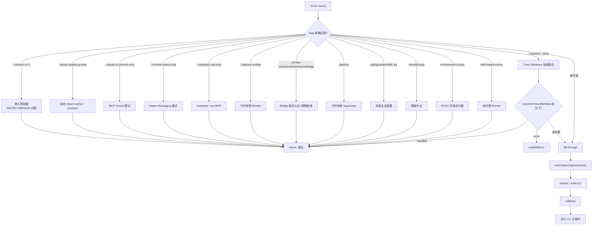

# 第 1 章：进程启动与快速路径裁剪

## 1.1 Bootstrap Entry 与快速路由树

`entrypoints/cli.tsx` 是 Claude Code 进程的第一个有意义执行模块。它承担的职责不是"启动某个功能"，而是在数百行 if-else 判断中回答一个核心问题：

```text
当前这个进程要扮演什么角色？
```

Claude Code 不是一个单一 CLI 工具。它是多宿主系统——同一个二进制需要扮演版本查询器、MCP Server、远程控制桥接器、后台守护进程管理器、模板引擎、远程执行代理、以及最终的交互式 REPL。`cli.tsx` 的职责是在最少的模块加载开销下，完成角色分派。

---

### 快速路径路由树



上图揭示了一个刻意的设计决策：除了 fall-through 到 `main.js` 的路径之外，所有其他路径在执行完对应逻辑后直接 `return`。这意味着 `main.js`——即包含 Commander 命令树、Ink 渲染引擎、权限系统、MCP 管理等数百个模块的巨型模块图——在非交互模式下永远不会被加载。

---

### 模块级 Side Effect：为何 import 之前就要操作环境变量

文件顶部三组 top-level side effect 在 `main()` 函数定义之前执行。这违反了"纯模块加载"的直觉，但有明确的工程原因：

```typescript
// 第一组：corepack 修复（Bun 构建时内联，运行时同步执行）
process.env.COREPACK_ENABLE_AUTO_PIN = '0';

// 第二组：CCR 远程环境的 Node.js 堆配置
if (process.env.CLAUDE_CODE_REMOTE === 'true') {
  const existing = process.env.NODE_OPTIONS || '';
  process.env.NODE_OPTIONS = existing
    ? `${existing} --max-old-space-size=8192`
    : '--max-old-space-size=8192';
}

// 第三组：Ablation baseline（feature gate 保证构建时消除）
if (feature('ABLATION_BASELINE') && process.env.CLAUDE_CODE_ABLATION_BASELINE) {
  for (const k of [
    'CLAUDE_CODE_SIMPLE',
    'CLAUDE_CODE_DISABLE_THINKING',
    'DISABLE_INTERLEAVED_THINKING',
    'DISABLE_COMPACT',
    // ...
  ]) {
    process.env[k] ??= '1';
  }
}
```

**为什么要放在 import 之前？**——因为后续模块（如 BashTool、AgentTool、PowerShellTool）在 module evaluation 阶段捕获环境变量到模块级 `const`。如果 `main()` 内部再设置，这些常量已经捕获了旧值。注释明确指出：`init()` 运行太晚——模块已在顶部以旧值完成了常量捕获。

**Ablation Baseline 的 feature gate 设计**——`feature('ABLATION_BASELINE')` 是 `bun:bundle` 的编译时常量。在外部构建中，整个 `if` 块被 Bundle 的 Dead Code Elimination 消除，零运行时开销。这是编译期裁剪与运行期逻辑的协作。

---

### 动态 Import 策略：最小化模块评估

`main()` 函数中所有的非快速路径模块都通过 `await import()` 延迟加载。这是 `cli.tsx` 的核心性能策略。

```typescript
// 快速路径：--version，零 import
if (args.length === 1 && (args[0] === '--version' || args[0] === '-v' || args[0] === '-V')) {
  console.log(`${MACRO.VERSION} (Claude Code)`);
  return;
}

// 所有其他路径：只在需要时 import
const { profileCheckpoint } = await import('../utils/startupProfiler.js');
```

**`MACRO.VERSION` 的内联优势**——这是 Bun 构建时宏，版本字符串直接内联到代码中。`--version` 是唯一不需要任何动态 import 的快速路径——即使 `startupProfiler.js` 也不加载。`process.argv.slice(2)` 的结果在 V8/Bun 引擎中已经是驻留的，`console.log` 的模板字符串编译时已知。这是 O(1) 的版本查询。

---

### 启动 Profiler：可观测性嵌入

每个快速路径的入口处都有 `profileCheckpoint(name)` 调用。这是一个精心设计的两模式系统：

```typescript
// startupProfiler.ts 核心逻辑
const DETAILED_PROFILING = isEnvTruthy(process.env.CLAUDE_CODE_PROFILE_STARTUP);
const STATSIG_SAMPLE_RATE = 0.005;
const STATSIG_LOGGING_SAMPLED =
  process.env.USER_TYPE === 'ant' || Math.random() < STATSIG_SAMPLE_RATE;
const SHOULD_PROFILE = DETAILED_PROFILING || STATSIG_LOGGING_SAMPLED;

export function profileCheckpoint(name: string): void {
  if (!SHOULD_PROFILE) return;
  getPerformance().mark(name);
  if (DETAILED_PROFILING) {
    memorySnapshots.push(process.memoryUsage());
  }
}
```

**两模式的设计考量**：

| 模式 | 触发条件 | 采样率 | 数据存储 | 延迟开销 |
|------|---------|--------|---------|---------|
| 详细模式 | `CLAUDE_CODE_PROFILE_STARTUP=1` | 100% | 本地文件（含内存快照） | `perf.mark()` + `process.memoryUsage()` |
| 统计模式 | 无 | 100% 内部 / 0.5% 外部 | Statsig 事件 | `perf.mark()` 仅采样用户 |
| 关闭 | 无 | 0% | 无 | 单行 `SHOULD_PROFILE` 检查 |

**为何不用 `console.time()`**——`perf_hooks` 的 `performance.mark()` 是 Node.js 的标准性能测量 API，精度更高（sub-microsecond），且与 `performance.getEntriesByType('mark')` 配合可重建完整的时间线。`console.time()` 是独立的定时器，无法获取历史标记。

**内存快照的数组而非 Map**——注释解释了为何 `memorySnapshots` 使用数组追加而非 `Map<string, MemoryUsage>`：某些 checkpoint 可能触发多次（如 `loadSettingsFromDisk_start` 在 `init()` 和插件重置缓存时各触发一次），Map 的覆盖行为会丢失第一次的数据。数组保证与 `perf.getEntriesByType('mark')` 的顺序一一对应。

---

### Bridge 模式：认证优先的初始化链

Bridge 模式（远程控制台）是 `cli.tsx` 中最复杂的快速路径之一。它的初始化顺序是刻意的：

```typescript
// Bridge 模式的认证→策略→执行链
if (feature('BRIDGE_MODE') && (args[0] === 'remote-control' || args[0] === 'rc' || ...)) {
  enableConfigs();                           // 1. 配置系统

  // 2. 认证检查 BEFORE GrowthBook
  // 没有认证，GrowthBook 没有用户上下文，返回的是过时的默认值 false
  const tokens = await getClaudeAIOAuthTokens();
  if (!tokens?.accessToken) exitWithError(BRIDGE_LOGIN_ERROR);

  // 3. GrowthBook 功能门（此时认证已就绪）
  const disabledReason = await getBridgeDisabledReason();
  if (disabledReason) exitWithError(`Error: ${disabledReason}`);

  // 4. 版本兼容性检查
  const versionError = checkBridgeMinVersion();
  if (versionError) exitWithError(versionError);

  // 5. 策略限制（组织级 policy）
  await waitForPolicyLimitsToLoad();
  if (!isPolicyAllowed('allow_remote_control')) exitWithError("...");

  // 6. 执行
  await bridgeMain(args.slice(1));
}
```

**为什么认证在 GrowthBook 之前？**——GrowthBook 的 A/B 测试决策需要用户上下文（token 中的用户标识）。如果先初始化 GrowthBook，它会以匿名用户身份返回默认的 false。注释明确指出：`getBridgeDisabledReason()` 等待 GrowthBook 初始化，但 GrowthBook 的 init 需要认证头才能正常工作。

**五层防御的必要性**：认证（你是谁）→ 功能门（你是否在实验组）→ 版本兼容（客户端是否够新）→ 策略限制（组织是否允许）→ 执行。任何一层失败都需要在加载 Bridge 主逻辑前退出。

---

### Fall-Through 路径：交互模式的延迟加载

当所有快速路径都不匹配时，进入标准的 CLI 初始化：

```typescript
// 无特殊标志：加载完整 CLI
const { startCapturingEarlyInput } = await import('../utils/earlyInput.js');
startCapturingEarlyInput();

profileCheckpoint('cli_before_main_import');
const { main: cliMain } = await import('../main.js');
profileCheckpoint('cli_after_main_import');
await cliMain();
profileCheckpoint('cli_after_main_complete');
```

**Early Input 捕获的重要性**——`startCapturingEarlyInput()` 在 `main.js` 加载前启动输入捕获。`main.js` 包含数百个模块，eval 可能需要 100-200ms。在这个窗口内用户输入的命令需要被捕获并在 REPL 就绪后回灌。这是终端响应性的设计——视觉上命令立即开始处理，尽管后台仍在加载模块。

---

### 设计决策分析

**决策一：`cli.tsx` 不是纯路由，而是包含初始化逻辑**

通常的 CLI 入口只做参数解析和分发。`cli.tsx` 在路由前注入了三个关键的环境变量预处理（corepack、CCR 堆配置、Ablation baseline）和一个 Early Input 捕获。这些 side effect 必须在模块加载前发生。代价是 `cli.tsx` 不能被视为一个"干净的"路由文件——它承担了启动时序编排的角色。

**决策二：快速路径使用字符串字面量而非枚举**

所有快速路径分支都直接使用字符串字面量（`'--version'`、`'remote-control'`、`'ps'` 等），而非从某个常量文件导入。原因是性能：这些路径需要在零额外模块加载的情况下执行。导入常量文件就意味着额外的动态 import 调用。

**决策三：feature gate 与运行时条件的双层检查**

每个 feature 快速路径都有 `feature('FEATURE_NAME') && runtimeCondition` 的双层检查。`feature()` 在构建时被 Bun 的 bundle 解析为常量——如果功能不存在于当前构建，整个分支被消除。这是编译期和运行期的双重保障，比单一的运行时检查更高效。

---

### 工程指标

基于 git 历史中 `cli.tsx` 的演化可以观察到的事实：此文件从最初的十几行简单的入口点，逐步增长到三百行以上的路由树。这反映了产品复杂度的自然增长——每一种新的运行模式（Bridge、Daemon、BG Sessions、Templates、Computer Use、Self-Hosted Runner）都增加了一个新的快速路径。

关键的设计约束始终是：**不要为不需要完整 CLI 的场景加载完整 CLI**。
