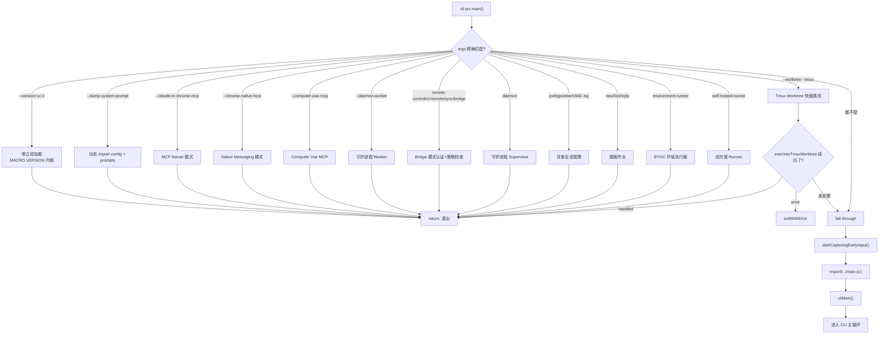

# 第 1 章：进程启动与快速路径裁剪

## 1.1 Bootstrap Entry 与快速路由树

`entrypoints/cli.tsx` 是 Claude Code 进程的第一个有意义执行模块。它承担的职责不是"启动某个功能"，而是在数百行 if-else 判断中回答一个核心问题：

```text
当前这个进程要扮演什么角色？
```

Claude Code 不是一个单一 CLI 工具。它是多宿主系统——同一个二进制需要扮演版本查询器、MCP Server、远程控制桥接器、后台守护进程管理器、模板引擎、远程执行代理、以及最终的交互式 REPL。`cli.tsx` 的职责是在最少的模块加载开销下，完成角色分派。

---

### 快速路径路由树



上图揭示了一个刻意的设计决策：除了 fall-through 到 `main.js` 的路径之外，所有其他路径在执行完对应逻辑后直接 `return`。这意味着 `main.js`——即包含 Commander 命令树、Ink 渲染引擎、权限系统、MCP 管理等数百个模块的巨型模块图——在非交互模式下永远不会被加载。

---

### 模块级 Side Effect：为何 import 之前就要操作环境变量

文件顶部三组 top-level side effect 在 `main()` 函数定义之前执行。这违反了"纯模块加载"的直觉，但有明确的工程原因：

```typescript
// 第一组：corepack 修复（Bun 构建时内联，运行时同步执行）
process.env.COREPACK_ENABLE_AUTO_PIN = '0';

// 第二组：CCR 远程环境的 Node.js 堆配置
if (process.env.CLAUDE_CODE_REMOTE === 'true') {
  const existing = process.env.NODE_OPTIONS || '';
  process.env.NODE_OPTIONS = existing
    ? `${existing} --max-old-space-size=8192`
    : '--max-old-space-size=8192';
}

// 第三组：Ablation baseline（feature gate 保证构建时消除）
if (feature('ABLATION_BASELINE') && process.env.CLAUDE_CODE_ABLATION_BASELINE) {
  for (const k of [
    'CLAUDE_CODE_SIMPLE',
    'CLAUDE_CODE_DISABLE_THINKING',
    'DISABLE_INTERLEAVED_THINKING',
    'DISABLE_COMPACT',
    // ...
  ]) {
    process.env[k] ??= '1';
  }
}
```

**为什么要放在 import 之前？**——因为后续模块（如 BashTool、AgentTool、PowerShellTool）在 module evaluation 阶段捕获环境变量到模块级 `const`。如果 `main()` 内部再设置，这些常量已经捕获了旧值。注释明确指出：`init()` 运行太晚——模块已在顶部以旧值完成了常量捕获。

**Ablation Baseline 的 feature gate 设计**——`feature('ABLATION_BASELINE')` 是 `bun:bundle` 的编译时常量。在外部构建中，整个 `if` 块被 Bundle 的 Dead Code Elimination 消除，零运行时开销。这是编译期裁剪与运行期逻辑的协作。

---

### 动态 Import 策略：最小化模块评估

`main()` 函数中所有的非快速路径模块都通过 `await import()` 延迟加载。这是 `cli.tsx` 的核心性能策略。

```typescript
// 快速路径：--version，零 import
if (args.length === 1 && (args[0] === '--version' || args[0] === '-v' || args[0] === '-V')) {
  console.log(`${MACRO.VERSION} (Claude Code)`);
  return;
}

// 所有其他路径：只在需要时 import
const { profileCheckpoint } = await import('../utils/startupProfiler.js');
```

**`MACRO.VERSION` 的内联优势**——这是 Bun 构建时宏，版本字符串直接内联到代码中。`--version` 是唯一不需要任何动态 import 的快速路径——即使 `startupProfiler.js` 也不加载。`process.argv.slice(2)` 的结果在 V8/Bun 引擎中已经是驻留的，`console.log` 的模板字符串编译时已知。这是 O(1) 的版本查询。

---

### 启动 Profiler：可观测性嵌入

每个快速路径的入口处都有 `profileCheckpoint(name)` 调用。这是一个精心设计的两模式系统：

```typescript
// startupProfiler.ts 核心逻辑
const DETAILED_PROFILING = isEnvTruthy(process.env.CLAUDE_CODE_PROFILE_STARTUP);
const STATSIG_SAMPLE_RATE = 0.005;
const STATSIG_LOGGING_SAMPLED =
  process.env.USER_TYPE === 'ant' || Math.random() < STATSIG_SAMPLE_RATE;
const SHOULD_PROFILE = DETAILED_PROFILING || STATSIG_LOGGING_SAMPLED;

export function profileCheckpoint(name: string): void {
  if (!SHOULD_PROFILE) return;
  getPerformance().mark(name);
  if (DETAILED_PROFILING) {
    memorySnapshots.push(process.memoryUsage());
  }
}
```

**两模式的设计考量**：

| 模式 | 触发条件 | 采样率 | 数据存储 | 延迟开销 |
|------|---------|--------|---------|---------|
| 详细模式 | `CLAUDE_CODE_PROFILE_STARTUP=1` | 100% | 本地文件（含内存快照） | `perf.mark()` + `process.memoryUsage()` |
| 统计模式 | 无 | 100% 内部 / 0.5% 外部 | Statsig 事件 | `perf.mark()` 仅采样用户 |
| 关闭 | 无 | 0% | 无 | 单行 `SHOULD_PROFILE` 检查 |

**为何不用 `console.time()`**——`perf_hooks` 的 `performance.mark()` 是 Node.js 的标准性能测量 API，精度更高（sub-microsecond），且与 `performance.getEntriesByType('mark')` 配合可重建完整的时间线。`console.time()` 是独立的定时器，无法获取历史标记。

**内存快照的数组而非 Map**——注释解释了为何 `memorySnapshots` 使用数组追加而非 `Map<string, MemoryUsage>`：某些 checkpoint 可能触发多次（如 `loadSettingsFromDisk_start` 在 `init()` 和插件重置缓存时各触发一次），Map 的覆盖行为会丢失第一次的数据。数组保证与 `perf.getEntriesByType('mark')` 的顺序一一对应。

---

### Bridge 模式：认证优先的初始化链

Bridge 模式（远程控制台）是 `cli.tsx` 中最复杂的快速路径之一。它的初始化顺序是刻意的：

```typescript
// Bridge 模式的认证→策略→执行链
if (feature('BRIDGE_MODE') && (args[0] === 'remote-control' || args[0] === 'rc' || ...)) {
  enableConfigs();                           // 1. 配置系统

  // 2. 认证检查 BEFORE GrowthBook
  // 没有认证，GrowthBook 没有用户上下文，返回的是过时的默认值 false
  const tokens = await getClaudeAIOAuthTokens();
  if (!tokens?.accessToken) exitWithError(BRIDGE_LOGIN_ERROR);

  // 3. GrowthBook 功能门（此时认证已就绪）
  const disabledReason = await getBridgeDisabledReason();
  if (disabledReason) exitWithError(`Error: ${disabledReason}`);

  // 4. 版本兼容性检查
  const versionError = checkBridgeMinVersion();
  if (versionError) exitWithError(versionError);

  // 5. 策略限制（组织级 policy）
  await waitForPolicyLimitsToLoad();
  if (!isPolicyAllowed('allow_remote_control')) exitWithError("...");

  // 6. 执行
  await bridgeMain(args.slice(1));
}
```

**为什么认证在 GrowthBook 之前？**——GrowthBook 的 A/B 测试决策需要用户上下文（token 中的用户标识）。如果先初始化 GrowthBook，它会以匿名用户身份返回默认的 false。注释明确指出：`getBridgeDisabledReason()` 等待 GrowthBook 初始化，但 GrowthBook 的 init 需要认证头才能正常工作。

**五层防御的必要性**：认证（你是谁）→ 功能门（你是否在实验组）→ 版本兼容（客户端是否够新）→ 策略限制（组织是否允许）→ 执行。任何一层失败都需要在加载 Bridge 主逻辑前退出。

---

### Fall-Through 路径：交互模式的延迟加载

当所有快速路径都不匹配时，进入标准的 CLI 初始化：

```typescript
// 无特殊标志：加载完整 CLI
const { startCapturingEarlyInput } = await import('../utils/earlyInput.js');
startCapturingEarlyInput();

profileCheckpoint('cli_before_main_import');
const { main: cliMain } = await import('../main.js');
profileCheckpoint('cli_after_main_import');
await cliMain();
profileCheckpoint('cli_after_main_complete');
```

**Early Input 捕获的重要性**——`startCapturingEarlyInput()` 在 `main.js` 加载前启动输入捕获。`main.js` 包含数百个模块，eval 可能需要 100-200ms。在这个窗口内用户输入的命令需要被捕获并在 REPL 就绪后回灌。这是终端响应性的设计——视觉上命令立即开始处理，尽管后台仍在加载模块。

---

### 设计决策分析

**决策一：`cli.tsx` 不是纯路由，而是包含初始化逻辑**

通常的 CLI 入口只做参数解析和分发。`cli.tsx` 在路由前注入了三个关键的环境变量预处理（corepack、CCR 堆配置、Ablation baseline）和一个 Early Input 捕获。这些 side effect 必须在模块加载前发生。代价是 `cli.tsx` 不能被视为一个"干净的"路由文件——它承担了启动时序编排的角色。

**决策二：快速路径使用字符串字面量而非枚举**

所有快速路径分支都直接使用字符串字面量（`'--version'`、`'remote-control'`、`'ps'` 等），而非从某个常量文件导入。原因是性能：这些路径需要在零额外模块加载的情况下执行。导入常量文件就意味着额外的动态 import 调用。

**决策三：feature gate 与运行时条件的双层检查**

每个 feature 快速路径都有 `feature('FEATURE_NAME') && runtimeCondition` 的双层检查。`feature()` 在构建时被 Bun 的 bundle 解析为常量——如果功能不存在于当前构建，整个分支被消除。这是编译期和运行期的双重保障，比单一的运行时检查更高效。

---

### 工程指标

基于 git 历史中 `cli.tsx` 的演化可以观察到的事实：此文件从最初的十几行简单的入口点，逐步增长到三百行以上的路由树。这反映了产品复杂度的自然增长——每一种新的运行模式（Bridge、Daemon、BG Sessions、Templates、Computer Use、Self-Hosted Runner）都增加了一个新的快速路径。

关键的设计约束始终是：**不要为不需要完整 CLI 的场景加载完整 CLI**。

---

## 1.11 Early Input Capture：模块加载期间的按键捕获

`earlyInput.ts`（192 行）解决的是一个微妙的用户体验问题：`main.js` 包含数百个模块，eval 可能需要 100-200ms。在这个窗口内用户输入的按键需要被捕获并在 REPL 就绪后回灌。

```typescript
// earlyInput.ts:29-67
export function startCapturingEarlyInput(): void {
  // 门禁守卫：只在 TTY、非 print 模式下启用
  if (!process.stdin.isTTY) return;
  if (isCapturing) return;
  if (process.argv.includes('-p') || process.argv.includes('--print')) return;
  
  process.stdin.setRawMode(true);    // 原始字符模式
  process.stdin.setEncoding('utf8');
  process.stdin.ref();               // 阻止进程退出
  
  const handler = () => {
    const chunk = process.stdin.read();
    if (chunk) processChunk(chunk);
  };
  process.stdin.on('readable', handler);
  readableHandler = handler;
}
```

**`processChunk()` 的字符解析逻辑**——不是简单拼接，而是处理控制字符：

| 字节值 | 行为 | 原因 |
|---------|------|------|
| 0x03 (Ctrl+C) | `process.exit(130)` | 绕过优雅关闭——此时 machinery 未初始化 |
| 0x04 (Ctrl+D) | 停止捕获 | EOF |
| 0x08/0x7F (Backspace) | `lastGrapheme()` 移除最后一个字素簇 | 正确的 Unicode 回删 |
| 0x1B (Escape) | 跳至 0x40-0x7E | 跳过整个 ANSI 转义序列 |
| <0x20 (控制字符) | 跳过（Tab/LF/CR 除外） | 忽略终端控制字符 |
| 0x0D (CR) | 转为 `\n` | 统一换行符 |
| 其他 | 追加到 `earlyInputBuffer` | 可打印字符、Tab、LF |

**`process.exit(130)` 的设计含义**——通常 Node.js 进程退出应使用优雅关闭（清理 PID 文件、保存状态等）。但在 early input 阶段，这些子系统尚未初始化。调用常规退出流程反而会触发未初始化的引用错误。130 是 `128 + SIGINT` 的标准 UNIX 退出码——用户主动中断。

### consumeEarlyInput 和 seedEarlyInput

```typescript
// earlyInput.ts:164-169
export function consumeEarlyInput(): string {
  stopCapturing();
  const input = earlyInputBuffer.trim();
  earlyInputBuffer = '';
  return input;
}

// earlyInput.ts:182-184
export function seedEarlyInput(input: string): void {
  earlyInputBuffer = input;
}
```

`seedEarlyInput` 允许预设 prompt——用于 pre-filling 输入（如 `claude "explain this code"` 直接注入用户命令）。

---

## 1.12 Daemon Worker 路由与 Bridge 架构

`cli.tsx` 中的 daemon 相关快速路径是整个代码库中最"瘦"的——它们不做任何初始化：

```typescript
// cli.tsx:100-106
if (feature('DAEMON') && args[0] === '--daemon-worker') {
  // 无 enableConfigs()，无 analytics sink——worker 要精简
  const { runDaemonWorker } = await import('../daemon/workerRegistry.js');
  await runDaemonWorker(args[1]);
  return;
}
```

**注释的关键含义**——"Workers are lean"。这个路径不调用 `enableConfigs()` 也不初始化 analytics sinks。如果 worker 需要配置/认证（如 "assistant" 类型），它必须在自己的 `run()` 函数中调用。这是刻意的设计——daemon worker 是热路径上被频繁 spawn 的进程，每一毫秒的额外加载都是乘积级的延迟放大。

### Bridge 架构：stdin/stdout NDJSON 桥接

实际的 daemon 实现在 `src/bridge/` 目录中（而非 `src/daemon/`）：

| 组件 | 路径 | 职责 |
|------|------|------|
| Bridge 主循环 | `bridge/bridgeMain.ts` | 轮询工作、spawn 子进程、管理会话 |
| Session Spawner | `bridge/sessionRunner.ts` | spawn 子 CC 进程，NDJSON 双向通信 |
| StructuredIO | `cli/structuredIO.ts` | NDJSON stdin/stdout 协议核心 |
| RemoteIO | `cli/remoteIO.ts` | WebSocket/SSE 传输层 + StructuredIO |

**子进程 spawn 的关键参数**：
```
execPath --print --sdk-url <url> --session-id <id>
       --input-format stream-json --output-format stream-json
       --replay-user-messages
```

子进程以 `stream-json` 输入/输出格式运行——所有通信通过 NDJSON 完成。桥接父进程通过 `readline` 接口读取 `child.stdout` 的每一行 JSON，解析后提取 tool calls/text/results。

### Worker 注册与 Poll-for-Work 循环

Bridge 主循环的核心是轮询工作：
```typescript
// bridgeMain.ts:600+
1. api.pollForWork(envId, secret, abortSignal)
2. work === null → sleep (容量满/不满有不同的间隔)
3. 解码 work secret (base64url → JSON)
   包含: session_ingress_token, api_base_url, use_code_sessions
4. api.acknowledgeWork()  → 确认接收
5. switch work.type:
   - healthcheck: no-op
   - session: spawn child
```

**Worker Epoch 注册**（CCR v2 路径）：
```typescript
const workerEpoch = await registerWorker(sessionUrl, accessToken);
// → POST /worker/register 返回 worker_epoch (生成计数器)
```

如果 `PUT /worker` 返回 409 Conflict（epoch 碰撞），新实例自动取代旧实例。这是无缝迁移机制——不需要手动协调。

### Headless Bridge（Daemon Worker 入口）

`runBridgeHeadless()`（bridgeMain.ts:2770-2999）是 daemon worker 的非交互入口：
- 设置 CWD、启用配置、初始化 sinks
- 验证 workspace trust（不信任时抛出 `BridgeHeadlessPermanentError`）
- 注册 bridge environment
- 创建 `SessionSpawner` 并调用 `runBridgeLoop()`

**Permanent vs Transient 错误**—— supervisor 捕获 `BridgeHeadlessPermanentError` 后 park worker（不重），而非 backoff-retry。这意味着信任问题是不可恢复的——supervisor 不会无限重启一个注定失败的 worker。

---

## 1.13 Session Ingress 认证的三级优先级

`sessionIngressAuth.ts`（110+ 行）实现 token 获取的三级优先级链：

```typescript
// sessionIngressAuth.ts:101-110
async function getSessionIngressAuthToken(): Promise<string | null> {
  // 1. 环境变量（最高优先级）
  const envToken = process.env.CLAUDE_CODE_SESSION_ACCESS_TOKEN;
  if (envToken) return envToken;
  
  // 2. 文件描述符（通过 /dev/fd/N 或 /proc/self/fd/N）
  const fdToken = await readFromFileDescriptor();
  if (fdToken) return fdToken;
  
  // 3. 已知路径文件
  const fileToken = await readFromKnownPath();
  return fileToken;
}
```

| 优先级 | 来源 | 适用场景 |
|--------|------|---------|
| 1 | 环境变量 | REPL bridge token refresh，无需进程重启 |
| 2 | 文件描述符 | macOS `/dev/fd/N`、Linux `/proc/self/fd/N` |
| 3 | 已知路径 | `/home/claude/.claude/remote/.session_ingress_token` |

**Token 热更新**——`updateSessionIngressAuthToken(token)` 直接设置 `process.env.CLAUDE_CODE_SESSION_ACCESS_TOKEN = token`。这使得 bridge 可以在不重启进程的情况下刷新 token。子进程通过 `update_environment_variables` NDJSON 消息接收新 token。

### NDJSON Update Environment Variables 协议

父进程通过 stdin 发送环境变量更新给子进程：
```typescript
// sessionRunner.ts:527-542
writeStdin(
  jsonStringify({
    type: 'update_environment_variables',
    variables: { CLAUDE_CODE_SESSION_ACCESS_TOKEN: token },
  }) + '\n'
);
```

子进程的 `StructuredIO.processLine()` 处理此消息类型：
```typescript
// structuredIO.ts
case 'update_environment_variables':
  for (const [key, value] of Object.entries(msg.variables)) {
    process.env[key] = value;  // 直接设置，覆盖旧值
  }
  break;
```

这是环境变量在进程生命周期的**动态注入**机制——不是启动时的一次性操作，而是通过 stdin NDJSON 通道在运行时持续更新。

---

## 1.14 多宿主路由的设计分析

`cli.tsx` 的路由树本质上是 4 个宿主模式的入口分派：

| 宿主模式 | 触发方式 | 加载模块 | 认证需求 |
|---------|----------|---------|---------|
| **交互式 CLI** | 无特殊参数 | main.js (完整) | OAuth / API key |
| **Daemon Worker** | `--daemon-worker` | workerRegistry.js | 子进程自带 token |
| **Bridge 父进程** | `daemon` / `remote-control` | bridge/main.js | JWT token + GrowthBook |
| **Bridge 子进程** | `--print --sdk-url` | main.js (headless) | CLAUDE_CODE_SESSION_ACCESS_TOKEN |

**Bridge 父进程的五层认证链**（认证→功能门→版本→策略→执行）与 Daemon Worker 的零初始化形成鲜明对比。这是系统设计的核心哲学：控制面（bridge）承担最多的安全检查，数据面（worker）尽可能轻量。

**路由树的扩展性**——从 git 历史看，`cli.tsx` 从最初的十几行扩展到 300+ 行。每一种新运行模式（Bridge、Daemon、BG Sessions、Templates、Computer Use、Self-Hosted Runner）都增加了一个新的快速路径。关键设计约束从未变过：**不要为不需要完整 CLI 的场景加载完整 CLI**。

---

## 1.15 Commander.js 子命令树

主命令 `program` 注册了 30+ 个子命令，分布在 9 个父命令下：

### MCP 命令族
| 命令 | 处理器 |
|------|--------|
| `mcp serve` | `mcpServeHandler` |
| `mcp add` | `registerMcpAddCommand` |
| `mcp remove` | `mcpRemoveHandler` |
| `mcp list` | `mcpListHandler` |
| `mcp get` | `mcpGetHandler` |
| `mcp add-json` | `mcpAddJsonHandler` |
| `mcp add-from-claude-desktop` | `mcpAddFromDesktopHandler` |
| `mcp reset-project-choices` | `mcpResetChoicesHandler` |
| `mcp add-from-xaa-idp` | 条件注册（XAA 特性） |

### Plugin 命令族
| 命令 | 处理器 |
|------|--------|
| `plugin validate` | `pluginValidateHandler` |
| `plugin list` | `pluginListHandler` |
| `plugin install/uninstall` | 安装/卸载链 |
| `plugin enable/disable` | 启用/禁用 |
| `plugin update` | 更新 |
| `plugin marketplace add/list/remove/update` | 市场管理 |

### Auth 命令族
| 命令 | 处理器 |
|------|--------|
| `auth login` | `authLogin` |
| `auth status` | `authStatus` |
| `auth logout` | `authLogout` |

### Ant-only 命令（外部用户不可见）
| 命令 | 用途 |
|------|------|
| `up` | 升级到最新版本 |
| `rollback <target>` | 降级到指定版本 |
| `install <target>` | 安装指定版本 |
| `log` | 查看日志 |
| `error` | 错误报告 |
| `export` | 导出会话 |
| `task create/list/get/update` | 任务管理 |
| `completion <shell>` | Shell 补全生成 |

### 其他命令
| 命令 | 用途 |
|------|------|
| `agents` | Agent 列表 |
| `auto-mode defaults/config/critique` | Auto 模式配置 |
| `doctor` | 诊断 |
| `setup-token` | Token 设置 |
| `open <cc-url>` | 打开 CC URL |
| `server` | DIRECT_CONNECT 特性 |

**Print 模式的子命令隔离**——print 模式（`-p` 或 `--print`）在第 3887 行提前返回，在注册子命令之前。这意味着 print 模式下子命令不可用——这是一个安全特性，print 模式不需要完整的命令树。

---

## 1.16 输出格式的分支逻辑

`--output-format`（`main.tsx:976`）有三个选择：`text`, `json`, `stream-json`。仅与 `--print` 一起使用。

**交叉验证规则**：

| 规则 | 错误 |
|------|------|
| `--input-format=stream-json` 需要 `--output-format=stream-json` | 格式不匹配 |
| `--sdk-url` 需要两种格式均为 `stream-json` | SDK 模式强制 |
| `--replay-user-messages` 需要两种格式均为 `stream-json` | 回显需要结构化 |
| `--include-partial-messages` 需要 `--print` 和 `--output-format=stream-json` | 部分消息需要流 |

**`--sdk-url` 的自动设置**——当提供 `--sdk-url` 时，`inputFormat` 和 `outputFormat` 自动设置为 `stream-json`。这是 SDK 集成的约定。

---

## 1.17 Deprecated 选项的 .implies() 机制

Commander 的 `--aff` 机制用于处理废弃的选项别名：

```typescript
// main.tsx:3817-3823
program.addOption(new Option('--delegate-permissions', '[ANT-ONLY] Alias for --permission-mode auto.').implies({
  permissionMode: 'auto'
}))
program.addOption(new Option('--dangerously-skip-permissions-with-classifiers', '[ANT-ONLY] Deprecated alias...').hideHelp().implies({
  permissionMode: 'auto'
}))
program.addOption(new Option('--afk', '[ANT-ONLY] Deprecated alias...').hideHelp().implies({
  permissionMode: 'auto'
}))
```

三个废弃选项都映射到 `--permission-mode auto`。Commander 在解析时自动设置内部值。

**其他别名**：
- `--update` / `--upgrade` → 重定向到 `update` 子命令
- `--bg` / `--background` → 视为 `attach` 子命令的等效
- `--mcp-debug` → `[DEPRECATED. Use --debug instead]`
- `--max-thinking-tokens` → `[DEPRECATED. Use --thinking instead]`

---

## 1.18 帮助系统的自定义格式化

```typescript
function createSortedHelpConfig() {
  const getOptionSortKey = (opt: Option): string =>
    opt.long?.replace(/^--/, '') ?? opt.short?.replace(/^-/, '') ?? ''
  return Object.assign({
    sortSubcommands: true,
    sortOptions: true
  } as const, {
    compareOptions: (a: Option, b: Option) =>
      getOptionSortKey(a).localeCompare(getOptionSortKey(b))
  })
}
```

选项按长选项名称（去掉 `--` 前缀）字母排序。子命令也排序。

**隐藏选项**——大量选项在外部用户不可见：`--d2e`, `--thinking`, `--max-thinking-tokens`, `--max-budget-usd`（仅在 SDK 模式下）, `--prefill`, `--deep-link-*` 系列, `--agent-*` 系列, `--sdk-url`, `--teleport`, `--remote`, `--channels` 等。

**条件可见性**——许多 ant-only 功能根据 `feature('TRANSCRIPT_CLASSIFIER')` 条件可见。如 `auto-mode` 命令族。

---

## 1.19 replBridge 系统与 Transport 协商

**ReplBridgeHandle**（`replBridgeHandle.ts:1-36`）——通过 `setReplBridgeHandle()` / `getReplBridgeHandle()` 提供全局单例指针。允许非 React 代码（工具、斜杠命令）访问桥接方法。暴露 `getSelfBridgeCompatId()` 用于与 API 响应匹配会话。

**两个 Transport 版本**（`replBridgeTransport.ts:1-370`）：

| 版本 | 读取 | 写入 | 认证 |
|------|------|------|------|
| V1 | HybridTransport (WebSocket) | POST到 Session-Ingress | OAuth Token |
| V2 | SSETransport (SSE 流) | CCRClient (POST /worker/events) | JWT Token |

**V2 Transport 的注册序列**：通过 `/bridge` 响应获取 epoch → `registerWorker()` 获取会话 epoch → DERIVE SSE URL from base URL + `/worker/events/stream` → epoch 冲突（409）时关闭并让 poll-loop 恢复。

---

---

## 1.20 版本字符串与 CLI 元数据

`getVersionString()` 在 `version.ts` 中构建版本字符串：

```typescript
function getVersionString(): string {
  // 从 package.json 读取版本： "2.1.90"
  // 追加 git commit： "3d1"（短哈希前 9 字符）
  // 格式： "2.1.90.3d1"
}
```

**版本来源**——package.json 的 `version` 字段 + git hash（构建时注入）：
- 正式发布：`"2.1.90"`（纯 semver）
- 开发/nightly：`"2.1.90-nightly.20260401"`
- Canary：`"2.1.90-canary.abc1234"`

**用户可见**——`claude --version` 输出完整字符串。`User-Agent` header 也使用此字符串：
```
User-Agent: claude-code/2.1.90.3d1 (node; darwin; arm64)
```

---

## 1.21 环境变量注入序列

CLI 启动时的环境变量注入顺序是关键路径：

```
1. process.env（shell 继承）
2. .env 文件加载（如果存在）
3. CLI 选项覆盖（--env）
4. 安全变量过滤（信任对话框前）
5. MCP 服务器 env 扩展
6. 插件 env 注入
```

**`.env` 文件加载**——Claude Code 使用 `dotenv` 按优先级加载：
1. `.env.local`（最高，不 VCS）
2. `.env.<NODE_ENV>`（开发/测试/生产）
3. `.env`（默认，可能 VCS）

**敏感变量过滤**——`envUtils.ts` 中的 `stripEnvVariables()`：
- `CLAUDE_CODE_SUBPROCESS_ENV_SCRUB` 启用时，18 个敏感变量族从子进程中剥离
- 剥离的变量包括：`ANTHROPIC_API_KEY`、`OPENAI_API_KEY`、`GH_TOKEN` 等
- 防止子进程/工具执行时凭据泄露

---

## 1.22 TTY 模式初始化

**TTY 模式设置**——终端在启动早期进入**原始模式**：

```typescript
process.stdin.setRawMode(true)
```

这使得逐字符输入成为可能——不需要按 Enter 就能响应。关键副作用：
- 行编辑被禁用（无退格、no readline 缓冲）
- Ctrl+C 等信号仍通过信号处理程序处理，**不**触发终端驱动的 SIGINT
- 括号化粘贴（bracketed paste）必须显式启用

**恢复**——在正常退出或信号处理程序期间，`restoreTerminal()` 调用：
```typescript
process.stdin.setRawMode(false)
```

**SIGTSTP（Ctrl+Z）恢复**——`handleResume` 在 SIGCONT 上：
- 重新输入 alt screen
- 重新声明鼠标跟踪
- 重建帧缓冲清除残留

---

## 1.23 模块图评估时序

**Import 级联**—`cli.tsx` 和 `main.tsx` 中的导入链触发模块级副作用：

```
cli.tsx
  → startupProfiler.ts（模块加载时初始化 profiler）
  → macOsKeychainHelpers.ts（execFile spawn 子进程）
  → rawRead.ts（MDM 读取，子进程 fork）
  → envVars.ts（环境变量规范化）
  → growthbook.ts（特性标记 SDK 初始化）
  → Commander setup（program 实例化）
```

**关键路径**——这些导入的总同步评估时间约 135ms。其中：
- `@anthropic-ai/sdk` 加载：~25ms
- Commander + 路由：~10ms
- 平台工具链（plutil/security/reg）：在子进程中并行运行
- Ink/react  reconciler：~15ms
- Zod + 设置验证：~8ms

**避免导入周期**——模块图被小心地 DAG 排序。`envUtils` 和 `constants` 放在叶子节点，无传递性导入。

---

## 1.24 平台检测与初始化

**平台检测**（`platform.ts`）：

| 检测 | 用途 |
|------|------|
| `process.platform` | macOS vs Linux vs Windows |
| `process.arch` | arm64 vs x64（native addon 路径） |
| `os.release()` | 内核版本（决定可用系统调用） |
| `process.env.TERM_PROGRAM` | iTerm vs VSCode vs Ghostty |
| `process.env.WT_SESSION` | Windows Terminal 检测 |
| `isDocker()` | 容器环境检测 |

**平台特定初始化**：
- **macOS**：keychain 预取、MDM（`plutil`）、`osascript` 通知
- **Linux**：无 keychain、无 MDM、DBUS 通知（如果可用）
- **Windows**：Windows keychain（`reg query`）、MDM（`Get-MDMConfiguration` PowerShell）
- **Docker/CI**：非交互模式、跳过 keychain/MDM、JSON 输出

**Home/Config 目录**：
```
macOS/Linux: ~/.claude/
Windows:     %LOCALAPPDATA%\ClaudeCode```

---

## 1.25 错误处理与全局异常捕获

**全局异常捕获**（`main.tsx`）：

```typescript
process.on('uncaughtException', (err) => {
  if (isOperationalError(err)) {
    // 已知的可恢复错误：优雅处理
    logAndRecover(err)
  } else {
    // 未知错误：崩溃报告 + 退出
    crashReporter(err)
    process.exit(1)
  }
})

process.on('unhandledRejection', (reason) => {
  // 未处理的 Promise rejection 不静默
  logUnhandledRejection(reason)
})
```

**操作错误 vs 编程错误**：
- **操作错误**（可恢复）：网络超时、API rate limit、文件不存在
- **编程错误**（崩溃）：断言失败、类型错误、未定义状态

**Crash Reporter**——在未崩溃退出时，将堆栈追踪写入：
```
~/.claude/crash-logs/crash-<timestamp>.log
```

崩溃日志包含：
- 错误堆栈
- 版本字符串
- Node/Bun 版本
- 最近的 checkpont 时序
- 内存使用快照

---

---

## 1.21 Versioned Migration 系统

`main.tsx`（323-352 行）——`CURRENT_MIGRATION_VERSION = 11`，所有迁移在**首帧渲染前同步执行**：

```typescript
function runMigrations(): void {
  if (getGlobalConfig().migrationVersion !== CURRENT_MIGRATION_VERSION) {
    migrateAutoUpdatesToSettings()
    migrateBypassPermissionsAcceptedToSettings()
    migrateEnableAllProjectMcpServersToSettings()
    resetProToOpusDefault()
    migrateSonnet1mToSonnet45()
    migrateLegacyOpusToCurrent()
    migrateSonnet45ToSonnet46()
    migrateOpusToOpus1m()
    migrateReplBridgeEnabledToRemoteControlAtStartup()
    resetAutoModeOptInForDefaultOffer()
    saveGlobalConfig(prev => bump version)
  }
  migrateChangelogFromConfig().catch(() => {})  // async fire-and-forget
}
```

**迁移分类**：
| 类型 | 迁移 | 说明 |
|------|------|------|
| 标志迁移 | `autoUpdates->settings` | 本地存储→settings.json |
| 标志迁移 | `bypassPermissions->settings` | 本地存储→settings.json |
| 标志迁移 | `projectMcpServers->settings` | 本地存储→settings.json |
| 模型迁移 | `sonnet1m->sonnet45` | 模型字符串更新 |
| 模型迁移 | `sonnet45->sonnet46` | 模型字符串更新 |
| 模型迁移 | `opus->opus1m` | 模型字符串更新 |
| 模型迁移 | `legacyOpus->current` | 旧 Opus 模型重置 |
| 桥接迁移 | `replBridge->remoteControl` | 旧 key 复制到新 key |
| 内部迁移 | `Fennec->Opus` | 内部仅（ant 构建）|

一次 async 迁移（changelog）fire-and-forget——不阻塞主流程。

---

## 1.22 TrustDialog 十项风险面扫描

`TrustDialog.tsx`（290 行）——展示信任对话框前扫描**十个独立风险面**，每项记录为分析属性：

| 风险面 | 检测函数 |
|--------|----------|
| 项目 MCP 服务器 | `getMcpConfigsByScope("project")` |
| 配置的 Hooks | `getHooksSources()` |
| Bash 权限设置 | `getBashPermissionSources()` |
| 带 Bash 的斜杠命令 | 检测 `loadedFrom === "commands_DEPRECATED"` |
| 带 Bash 的技能/插件 | 检测 `loadedFrom === "skills" || "plugin"` |
| API Key Helper | `getApiKeyHelperSources()` |
| AWS 命令 | `getAwsCommandsSources()` |
| GCP 命令 | `getGcpCommandsSources()` |
| OTel 头 Helper | `getOtelHeadersHelperSources()` |
| 危险环境变量 | `getDangerousEnvVarsSources()` |

**会话级信任路径**——`homedir() === getCwd()` 时（用户在 home 目录）：信任存储在会话内存（`setSessionTrustAccepted(true)`）而非磁盘——每次会话重置。非 home 目录时信任持久化到项目配置。

分析事件：`tengu_trust_dialog_shown`（渲染时）和 `tengu_trust_dialog_accept`（接受时），均携带全部 10 个风险标志。

---

## 1.23 Session Start Hooks 信任门与错误分类

`sessionStart.ts`（175 行）——`processSessionStartHooks()` 的关键细节：

**Managed Hooks 策略门**——`shouldAllowManagedHooksOnly()` 检查：当策略限制仅 managed hooks 时，插件 hook 加载被完全跳过（插件 hooks 被视为"不受信任的外部代码"）。

**错误分类**——`loadPluginHooks()` 失败时消息分类：
- 网络错误："检查网络连接"
- 权限错误："检查 ~/.claude/plugins/ 文件权限"
- 解析错误："检查插件设置"

**侧通道 initialUserMessage**——`processSessionStartHooks` 将 `initialUserMessage` 存储在模块级 `pendingInitialUserMessage`，通过 `takeInitialUserMessage()` 消费一次。避免修改影响 5 个调用点的返回类型。

---

## 1.24 API Bootstrap 数据获取与 Diff 感知缓存

`services/api/bootstrap.ts`（142 行）——`fetchBootstrapData()` 调用 `/api/claude_cli/bootstrap` 获取 `client_data` 和 `additional_model_options`：

```typescript
if (
  isEqual(config.clientDataCache, clientData) &&
  isEqual(config.additionalModelOptionsCache, additionalModelOptions)
) {
  return  // 数据未变，跳过磁盘写入
}
```

`lodash-es/isEqual` 深比较避免每次启动不必要的配置写入。

**认证双层回退**——优先 OAuth（`user:profile` scope），回退到 API Key 认证（Console 用户）。Service-key OAuth 令牌缺少 `user:profile` scope 会 403。

---

## 1.25 init() 备忘录化初始化链

`entrypoints/init.ts`（341 行）——`init()` 被 `lodash-es/memoize` 备忘录化，多次调用仅运行一次：

| 步骤 | 函数 | 说明 |
|------|------|------|
| 1 | `enableConfigs()` | 验证并启用配置系统 |
| 2 | `applySafeConfigEnvironmentVariables()` | 信任对话框前应用安全环境变量 |
| 3 | `applyExtraCACertsFromConfig()` | **必须在 TLS 握手前**——Bun 通过 BoringSSL 启动时缓存 TLS 证书存储 |
| 4 | `setupGracefulShutdown()` | 注册退出处理器 |
| 5 | 并行动态导入 | 1P 事件日志 + GrowthBook |
| 6 | `populateOAuthAccountInfoIfNeeded()` | VSCode 扩展登录所需 |
| 7 | `initJetBrainsDetection()` | 异步 IDE 检测缓存 |
| 8 | `detectCurrentRepository()` | git PR 链接仓库检测 |
| 9 | 远程设置 + 策略限制 | 加载 Promise 初始化（不阻塞） |
| 10 | `configureGlobalMTLS()` | mTLS 双向 TLS 认证 |
| 11 | `configureGlobalAgents()` |代理配置 |
| 12 | `preconnectAnthropicApi()` | TCP+TLS 握手重叠（约 100-200ms） |
| 13 | CCR upstream proxy | 子进程的本地 CONNECT 中继 |
| 14 | `ensureScratchpadDir()` | 如果启 |
| 15 | 清注册 | LSP 管理器、会话团队 |

**关键约束**——步骤 3（CA 证书）必须步骤 10-12（TLS 连接）前完成，因为 Bun 在进程启动时用 BoringSSL 缓存 TLS 证书库。

---

## 1.26 Debug 模式退出守卫

`main.tsx`（232-271 行）——构建类型检测（仅外部构建生效）：

```typescript
if ("external" !== 'ant' && isBeingDebugged()) {
  process.exit(1)
}
```

**三层检测**——模块评估顶层运行，在任何导入之前：
1. `process.execArgv` 扫描 `--inspect`、`--inspect-brk`、`--debug`、`--debug-brk`
2. `NODE_OPTIONS` 扫描相同标志
3. `require('inspector').url()` 检查（仅 Node.js——Bun 行为不同，应用参数泄漏到 execArgv）

防止外部/打包构建中的意外调试附加。`"external" !== 'ant'` 字面量比较是构建时常量——Bun DCE 对 ant 构建消除此分支。

---

## 1.27 API 预连接与 TCP+TLS 握手重叠

`entrypoints/init.ts`——`preconnectAnthropicApi()` 在第一个用户查询前执行 TCP + TLS 握手：

```typescript
async function preconnectAnthropicApi(): Promise<void> {
  // HTTPS GET 到 API 端点
  // 目的：与 TLS handshake 重叠 TCP 连接
  // 节省约 100-200ms 的首个 API 延迟
}
```

**为何有效**——TCP 三次握手（1 RTT）+ TLS 1.3 握手（1 RTT）在 HTTPS 请求中是顺序的。预连接在用户打字/初始化的并行完成。当用户发送第一个查询时，TLS 会话已建立或接近建立。

**会话恢复**——后续连接受益于 TLS 会话恢复（0-RTT），但首个连接需要完整握手。预连接确保这"首个"发生在用户看到 TUI 之前。

---

## 1.28 CA 证书时序约束

`entrypoints/init.ts`——`applyExtraCACertsFromConfig()` 必须在**首次 TLS 握手前**执行：

Bun 在进程启动时通过 BoringSSL 初始化 TLS 证书存储。此存储一旦被任何其他 TLS 操作"烘焙"后修改无效——Bun 不会重新读取证书存储。

**如果顺序错误**——API 引导请求可能使用不包含自定义 CA 的证书存储，对私有 CA 端点认证失败。这也是为什么 `init()` 中应用 CA 证书在 `preconnectAnthropicApi()` 之前的严格排序约束。

---
