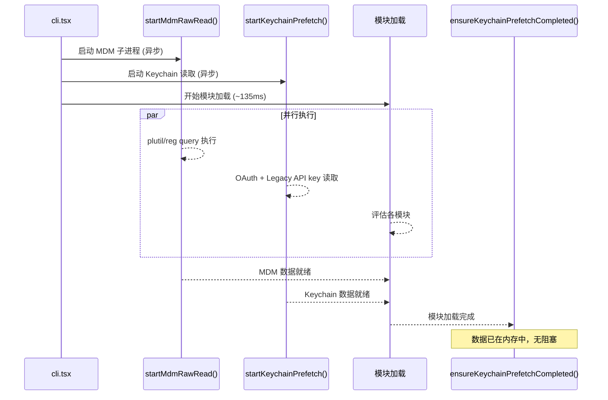

# 1.3 Side-Effect 编排：MDM、Keychain 与遥测

`main.tsx` 的 import 期间嵌入了三个并行启动的 side effect。这些不是代码异味——它们是经过性能分析后的刻意设计。

---

### 并行预取策略

```python
# main.tsx 顶部的 import 链
profileCheckpoint('main_tsx_entry')      # checkpoint 1
startMdmRawRead()                         # side effect 1：启动 MDM 子进程
startKeychainPrefetch()                  # side effect 2：启动两个 keychain 读取

# ... 后续 import 继续执行 ...

ensureKeychainPrefetchCompleted()         # 等待 preflight 完成
```

**问题**——在没有预取的情况下，`isRemoteManagedSettingsEligible()` 需要同步 spawn 子进程执行 `plutil`（macOS）或 `reg query`（Windows）读取 MDM 配置，以及在 `sync spawn` 中读取 keychain。这导致约 65ms 的同步阻塞，串行执行。

**策略**——在 import 期间启动两个独立操作的子进程，让它们与模块加载并行运行。模块加载本身需要 ~135ms（基于 profiling 数据），而 MDM 和 Keychain 的读取在这个窗口内异步完成。当代码第一次需要这些值时，数据已经在内存中。



---

### MDM 读取：平台管理配置

`mdm/rawRead.ts`（131 行）是一个最小依赖模块——只导入 `child_process`、`fs`、`constants.js`（仅导入 `os`）。注释明确指出为什么：`execFile` 如果改用 `execa` 会引入 `human-signals → cross-spawn`，约 58ms 的同步模块初始化开销。

MDM 原始读取的 `fireRawRead()` 函数按平台分发：

**macOS 路径**——通过 `plutil` 读取 `.plist` 文件：

```typescript
// mdm/rawRead.ts:57-88
const plistPaths = getMacOSPlistPaths()
const allResults = await Promise.all(
  plistPaths.map(async ({ path, label }) => {
    // execFilePromise 必须是第一个 await，确保 plutil spawn 在
    // event loop 轮询消息之前发生（见 main.tsx:3-4）
    if (!existsSync(path)) return { stdout: '', label, ok: false }
    const { stdout, code } = await execFilePromise(PLUTIL_PATH, [...PLUTIL_ARGS_PREFIX, path])
    return { stdout, label, ok: code === 0 && !!stdout }
  })
)
// First source wins (array is in priority order)
const winner = allResults.find(r => r.ok)
```

**关键设计**——`existsSync(path)` 快速路径：如果 plist 文件不存在，跳过 `plutil` 子进程。spawn plutil 即使立即 ENOENT 也需要约 5ms。在非 MDM 管理的机器上，这些文件永远不存在，跳过 spawn 可以节省约 5-10ms。但 `existsSync` 必须在 spawn 之前以同步方式调用——保持 "spawn-during-imports" 不变式。

**Windows 路径**——通过 `reg query` 并行查询 HKLM 和 HKCU 注册表键：

```typescript
const [hklm, hkcu] = await Promise.all([
  execFilePromise('reg', ['query', WINDOWS_REGISTRY_KEY_PATH_HKLM, '/v', WINDOWS_REGISTRY_VALUE_NAME]),
  execFilePromise('reg', ['query', WINDOWS_REGISTRY_KEY_PATH_HKCU, '/v', WINDOWS_REGISTRY_VALUE_NAME]),
])
```

**Linux 路径**——返回空。Linux 没有 MDM 等价机制。

两种用途的模式：
1. **启动**：`startMdmRawRead()` 在 `main.tsx` 模块级触发，结果通过 `getMdmRawReadPromise()` 消费
2. **轮询/回退**：`fireRawRead()` 按需创建新鲜读（用于 changeDetector 和 SDK 入口点）

---

### Keychain 预取：认证数据的并行化

`keychainPrefetch.ts`（117 行）只导入 `child_process` 和 `macOsKeychainHelpers.js`——不导入 `execa`（~58ms 的导入链），因为 `osx keychain` 的读取需要调用 `security` 子进程。模块顶部的注释是最详细的性能解释之一：

```typescript
// keychainPrefetch.ts:1-22
// isRemoteManagedSettingsEligible() reads two separate keychain entries
// SEQUENTIALLY via sync execSync during applySafeConfigEnvironmentVariables():
//   1. "Claude Code-credentials" (OAuth tokens)  — ~32ms
//   2. "Claude Code" (legacy API key)            — ~33ms
// Sequential cost: ~65ms on every macOS startup.
```

`startKeychainPrefetch()` 同时启动两个 keychain 读取：
1. OAuth token（主要认证路径）
2. Legacy API key（兼容路径）

**`spawnSecurity` 的实现细节**：

```typescript
function spawnSecurity(serviceName: string): Promise<SpawnResult> {
  return new Promise(resolve => {
    execFile(
      'security',
      ['find-generic-password', '-a', getUsername(), '-w', '-s', serviceName],
      { encoding: 'utf-8', timeout: KEYCHAIN_PREFETCH_TIMEOUT_MS },
      (err, stdout) => {
        // Exit 44 (entry not found) is valid "no key".
        // Timeout means keychain may have a key we couldn't fetch.
        resolve({
          stdout: err ? null : stdout?.trim() || null,
          timedOut: Boolean(err && 'killed' in err && err.killed),
        })
      },
    )
  })
}
```

超时判定的重要性：如果 `execFile` 超时（`err.killed === true`），不缓存 `null`——让同步路径重试。因为超时可能意味着 keychain 有数据但由于某种原因没读到。而 Exit 44（entry not found）是合法的"无 key"结果，可以安全地缓存 `null`。

**cache priming 的精细区分**：

```typescript
// 区分 "not started" (null) 和 "completed with no key" ({ stdout: null })
// 这让同步读取者只信任已完成的预取结果
let legacyApiKeyPrefetch: { stdout: string | null } | null = null
```

并行化后，两个 keychain 读取同时发出，总延迟从 65ms 降低到约 40ms（取决于较慢的那个）。

**`ensureKeychainPrefetchCompleted()` 的等待语义**——在需要认证数据的位置调用，如果预取已经完成则立即返回，否则等待。这是标准的 "fire and forget, then sync up when needed" 模式。非 darwin 平台是 no-op（直接返回）。

**cache invalidation**——`clearLegacyApiKeyPrefetch()` 与 `getApiKeyFromConfigOrMacOSKeychain()` 的 cache invalidation 并行调用，防止旧的缓存覆盖新写入的数据。

---

### 遥测初始化时机

遥测（Telemetry）的初始化不是同步操作。`initializeTelemetryAfterTrust()` 在 `init()` 完成后调用，原因有二：

1. **信任对话框**——用户尚未接受 trust dialog 之前，不应发送任何遥测数据
2. **身份标识**——用户身份（用户 ID、组织 ID）在认证完成后可用，遥测事件需要这些字段

这与 MDM/Keychain 的预取模式不同——后者是纯数据读取，前者是隐私边界的选择。

---

### Side-Effect 编排的风险与缓解

| 风险 | 缓解方式 |
|------|---------|
| MDM 子进程失败 | fail-open：仅 warning，不影响正常启动 |
| Keychain 读取超时 | `ensureKeychainPrefetchCompleted()` 有超时保护 |
| 模块加载慢于预取 | 预取数据缓存在内存中，不阻塞模块加载 |
| 内存碎片化 | 模块加载期间分配的内存与预取数据在不同区域 |

这种启动编排的核心理念是：**让 I/O 操作尽可能早地发出，尽可能晚地等待**。135ms 的模块加载窗口是免费的并行时间——在这段时间内，任何 I/O 操作的延迟都被"隐藏"了。

---

### 关键不变式：spawn-during-imports

注释记录了一个关键的设计不变式（invariant）：

> `execFilePromise` 必须是第一个 await，确保 plutil spawn 在 event loop 轮询消息之前发生

这是微妙的并发控制——Mdm 和 keychain 的 prefetched 操作在 import 链期间启动，它们必须在模块加载完成之前就开始。

```
时序:
  0ms:   startMdmRawRead()        ← plutil spawn 开始
  0ms:   startKeychainPrefetch()  ← security spawn 开始 
  0ms:   import('../main.js')     ← 模块加载开始
  
  65ms:  MDM read 完成（后台）
  80ms:  Keychain read 完成（后台）
  135ms: 模块加载完成
```

如果没有这个不变式，模块加载和预取之间的竞争条件会导致不确定的行为。

### 平台差异处理

side effect 在三个平台上的行为不同：

| 平台 | MDM | Keychain | 总启动延迟 |
|------|-----|----------|-----------|
| macOS | plutil 读取 .plist | security read-generic-password | ~40ms（并行后） |
| Windows | reg query HKLM/HKCU | 无 keychain | ~15ms |
| Linux | 无 MDM | 无 keychain | 0ms |

**Linux 是 no-op**——Linux 没有 MDM 等价机制，也没有 keychain。`startMdmRawRead()` 和 `startKeychainPrefetch()` 在非 darwin 平台上直接返回，不产生任何延迟。

---

### MDM 读取实现细节

`src/utils/settings/mdm/rawRead.ts` 是 MDM 配置的低层读取：

```typescript
// rawRead.ts - macOS 平台实现
export function readMDMSettings(): Record<string, unknown> | null {
  if (process.platform === 'darwin') {
    // 使用 plutil 读取 .plist 文件
    const { stdout } = spawnSync('plutil', ['-convert', 'json', '-o', '-', MDM_PLIST_PATH])
    return JSON.parse(stdout)
  } else if (process.platform === 'win32') {
    // Windows: reg query HKLM/HKCU
    return readWindowsRegistry()
  }
  // Linux: no MDM equivalent
  return null
}
```

**平台分支**——macOS 读取 `.plist`，Windows 读取注册表，Linux 无等价物。这确保了企业环境中通过 MDM 推送的配置在各平台都能加载。

**JSON 输出的选择**——`plutil -convert json -o -` 直接输出 JSON，避免 XML plist 解析的复杂性。

### Keychain 预取实现细节

`src/utils/secureStorage/keychainPrefetch.ts` 是 Keychain 数据的后台预取：

```typescript
// keychainPrefetch.ts - 简化视图
export function startKeychainPrefetch(): Promise<KeychainReadResult | null> {
  const { spawnSecurity } = await import('./spawnSecurity')
  return Promise.race([
    spawnSecurity('find-generic-password', ['-s', CONFIG_KEYCHAIN_KEY, '-w']),
    setTimeout(TIMEOUT_MS),
  ])
}
```

**超时保护**——如果 keychain 读取超时（如用户拒绝访问），`Promise.race` 与 timeout 竞争，超时后返回 null。

**Cache 语义**——缓存有两个状态：
- `null`：预取从未启动或已完成但无 key
- `{ stdout: null }`：预取已完成，keychain 中无对应条目

这两个状态区分"还没开始"和"已经查过但没找到"。

**Cache 失效**——当用户通过 `claude logout` 登出时，`clearLegacyApiKeyPrefetch()` 清除缓存。这与 `getApiKeyFromConfigOrMacOSKeychain()` 的缓存失效路径一致。

---

## 3.6 Side-Effect 的实现机制：从 spawn 到 Promise

### fireRawRead 的关键不变式

`mdm/rawRead.ts` 的核心约束记录在注释中：
> `execFilePromise` 必须是第一个 await，确保 plutil spawn 在 event loop 轮询消息之前发生

这是什么意思？让我们拆解这个微妙的问题。

```typescript
// rawRead.ts:57-88 - macOS 路径
const plistPaths = getMacOSPlistPaths()
const allResults = await Promise.all(
  plistPaths.map(async ({ path, label }) => {
    // 这是第一个 await——plutil 在此 spawn
    if (!existsSync(path)) return { stdout: '', label, ok: false }
    const { stdout, code } = await execFilePromise(PLUTIL_PATH, [...PLUTIL_ARGS_PREFIX, path])
    return { stdout, label, ok: code === 0 && !!stdout }
  })
)
const winner = allResults.find(r => r.ok)  // First source wins (array is in priority order)
```

**为什么 `execFilePromise` 必须是第一个 await？**——在 import 期间启动 MDM 读取时，JS 引擎正在评估模块树。此时 event loop 还没开始正常的微任务轮询。如果 `execFilePromise` 不在第一个 await 被调用（被其他 await 阻塞），plutil 的 spawn 会被延迟到后续微任务。而在模块加载的同步阶段，event loop 还没有机会处理 I/O，因此子进程的状态不会被观察——spawn 本身可能因为某些同步操作而失败。

`execFilePromise` 作为第一个 await 保证：
1. `child_process.execFile()` 已经在当前 tick 被调用（同步阶段）
2. 子进程已经 fork（操作系统已启动进程）
3. `await` 让出控制流，允许后续模块继续 eval
4. 后续模块 eval 期间，plutil 子进程已经在后台运行

如果顺序错误（如先 await 其他操作），plutil 的 spawn 被延迟，后续模块 eval 完成时 plutil 可能还没开始执行，导致预取窗口浪费。

### existsSync 快速路径：5ms 的节约

```typescript
if (!existsSync(path)) return { stdout: '', label, ok: false }
```

`existsSync` 是同步的文件系统检查。在 spawn plutil 之前调用，成本约 0.1-0.5ms。而 spawn plutil 即使立即 ENOENT 也需要约 5ms。

**在非 MDM 管理的机器上**——这些 plist 文件不存在。跳过 spawn 可以节省约 5-10ms。但在非 MDM 管理的机器上，两个 plist 路径都不存在，两次检查约 1ms，两次 spawn 约 10ms。净节省 9ms。

**`existsSync` 必须是同步的**——如果用 `fs.existsSync` 的异步版本（`fs.access`），需要额外 await 延迟。这违反了"spawn-during-imports"不变式。

### Promise.all 的并行语义

macOS 上可能有多个 plist 源（project 级、user 级、system 级）。`Promise.all` 并行查询所有源，不等待第一个完成再查下一个。这是因为各源互相独立——读取 project plist 不依赖 user 的结果。

`winner = allResults.find(r => r.ok)` 选择第一个成功的结果。数组按优先级排序（project > user > system），所以 project 优先。

---

### Keychain Prefetch 的 Cache 语义精细化

`keychainPrefetch.ts` 的缓存设计比简单 `{ value -> cached }` 复杂得多：

```typescript
// 区分 "not started" (null) 和 "completed with no key" ({ stdout: null })
let legacyApiKeyPrefetch: { stdout: string | null } | null = null
```

这三个状态的区分是关键：

| 缓存状态 | 值 | 含义 | 同步路径的行为 |
|---------|----|------|---------------|
| 未启动 | `null` | 预取从未启动或已完成但无 key | spawn sync 读取 |
| 已启动，无 key | `{ stdout: null }` | keychain 中无对应条目 | 返回 undefined |
| 已启动，有 key | `{ stdout: 'sk-xxx' }` | key 已读取 | 返回 cached value |

**为什么不用单一状态**——如果 `null` 同时表示 "未启动" 和 "无 key"，同步读取者无法区分：是预取还没完成（应该等待），还是 keychain 中确实没有 key（应该接受 null）？通过 `{ stdout: null }` 这个包装对象，同步代码可以信任：只要是对象（不是原始 null），预取就已经完成。

### spawnSecurity 的细节

```typescript
function spawnSecurity(serviceName: string): Promise<SpawnResult> {
  return new Promise(resolve => {
    execFile(
      'security',
      ['find-generic-password', '-a', getUsername(), '-w', '-s', serviceName],
      { encoding: 'utf-8', timeout: KEYCHAIN_PREFETCH_TIMEOUT_MS },
      (err, stdout) => {
        // Exit 44 (entry not found) 是合法的 "no key"
        // Timeout 意味着 keychain 可能有 key 但我们没读到
        resolve({
          stdout: err ? null : stdout?.trim() || null,
          timedOut: Boolean(err && 'killed' in err && err.killed),
        })
      },
    )
  })
}
```

**Exit 44 的特殊处理**——macOS `security` 命令的 exit 44 表示 "The specified item could not be found in the keychain." 这不是错误——是合法的 "无 key" 状态。如果把这个当成错误处理，keychain 中确实没有 key 的用户的预取结果会被错误标记为失败，同步路径会重试 spawn。

**Timeout 的判定**——`err.killed === true` 表示子进程被超时杀死。此时不缓存 `null`——让同步路径重试。因为超时可能意味着 keychain 响应慢（如 keychain 锁定、需要用户认证），而不是没有 key。

---

### Windows 平台的 MDM 读取

```typescript
// Windows: 并行查询 HKLM 和 HKCU
const [hklm, hkcu] = await Promise.all([
  execFilePromise('reg', ['query', WINDOWS_REGISTRY_KEY_PATH_HKLM, '/v', WINDOWS_REGISTRY_VALUE_NAME]),
  execFilePromise('reg', ['query', WINDOWS_REGISTRY_KEY_PATH_HKCU, '/v', WINDOWS_REGISTRY_VALUE_NAME]),
])
```

**HKLM vs HKCU**——HKLM (HKEY_LOCAL_MACHINE) 是机器级设置，HKCU (HKEY_CURRENT_USER) 是用户级设置。IT 管理员通常通过组策略（GPO）推送到 HKLM。并行查询两者，优先 HKLM。

Windows 没有 keychain 等价物——所有认证数据来自配置文件（`~/.claude.json`）或环境变量。`startKeychainPrefetch()` 在 Windows 上是 no-op。

---

### 遥测初始化的隐私边界

```typescript
// main.tsx:422-425
void settingsChangeDetector.initialize()
if (!isBareMode()) {
  void skillChangeDetector.initialize()
}
```

遥测在 `init()` 完成后才初始化。这有两个隐私考量：

1. **信任对话框**——用户尚未接受信任对话框前，不应发送任何遥测数据。遥测需要明确的用户同意。
2. **身份标识**——用户 ID 和组织 ID 在认证完成后才可用。遥测事件必须包含这些字段用于聚合分析。

这与 MDM/Keychain 的预取模式不同——后者是纯数据读取（不涉及远端），而前者是将用户行为数据发送到 Anthropic 服务器。这是隐私边界的选择——本地数据读取无需同意，远端数据发送需要同意。

```
隐私边界:
  MDM/Keychain → 本地读取 → 无需同意
  遥测 → 远端发送 → 需要用户同意（信任对话框）
```

### 平台差异的量化影响

| 平台 | MDM 检查 | Keychain 检查 | 总预取延迟 | 模块加载重叠 | 净阻塞 |
|------|---------|--------------|-----------|-------------|--------|
| macOS | 2 plist 源 (~5-10ms) | 2 keychain 项 (~40ms) | ~40ms（并行） | ~135ms | 0ms |
| Windows | 2 注册表查询 (~3-5ms) | 无 | ~5ms | ~135ms | 0ms |
| Linux | 无 | 无 | 0ms | ~135ms | 0ms |

135ms 的模块加载窗口完全足够覆盖所有平台的最慢预取操作。这意味着在理想情况下，预取数据总是在模块加载完成时就已经就绪——零额外等待。

---

## 3.7 Promise-based 栅格化：防止重复操作

MdmRawRead 和 keychain prefetch 都使用 promise-based 栅格化模式：

```typescript
// MDM 加载的幂等启动
function startMdmSettingsLoad(): void {
  if (mdmLoadPromise) return  // 已经在运行
  mdmLoadPromise = readMdmSettings()
}

// 等待加载完成（无论是否已启动）
async function ensureMdmSettingsLoaded(): Promise<void> {
  await mdmLoadPromise
}
```

这是防止重复操作的标准模式——调用 `startMdmSettingsLoad()` 多次只会触发一次 I/O。调用 `ensureMdmSettingsLoaded()` 多次总是等待同一个 promise。

---

## 3.8 Policy Limits：带超时的 Promise 栅格化

`src/services/policyLimits/index.ts:94-114`：

```typescript
// 30 秒超时——防止死锁
const loadingCompletePromise = withTimeout(loadPolicyLimits(), LOADING_PROMISE_TIMEOUT_MS)
```

30 秒超时防止了一种边界情况：当 `loadPolicyLimits()` 永远不被调用时（如 SDK 测试），等待者不会永远挂起。

---

## 3.9 Lazy Import：延迟模块图加载

上游代理环境函数（`src/utils/subprocessEnv.ts:67-77`）通过 `registerUpstreamProxyEnvFn()` 注册，该函数在 `init.ts` 延迟导入上游代理模块后运行。

**为何 Lazy**——延迟导入避免在非 CCR 启动时引入 upstreamproxy 模块图（约 400KB）。只有当需要 CCR 代理时，模块才被加载。

同样的模式用于 analytics——`firstPartyEventLogger.js` 和 `growthbook.js` 在 `init.ts` 中动态导入，而不是在顶部静态导入。这减少了正常启动的模块图。

---

## 3.10 MDM polling 与变更检测

MDM settings 每 30 分钟轮询一次（`MDM_POLL_INTERVAL_MS = 30 * 60 * 1000`）。

**变更检测**（`changeDetector.ts`）：快照比较检测 MDM settings 变更。当检测到时，所有受影响的分量会相应更新。

这是推送式架构的优雅降级——企业 MDM 不会推送到 Claude Code，因此 Claude Code 必须 poll。30 分钟是一个折衷——足够频繁以检测管理员更改，但足够长以减少 CPU 和磁盘 I/O。

---

## 3.11 Remote Managed Settings

远程管理 settings（`src/services/remoteManagedSettings/`）是 MDM 的网络等效——settings 来自远程 API 而非本地 plist/registry。

**同步缓存**（`syncCache.ts`）：使用与 MDM 相同的 promise 模式，带超时防止死锁。Settings 通过远程 API 获取并缓存到磁盘。

---

## 3.12 Event 采样与抽样

**Event 采样**（`firstPartyEventLogger.ts:38-85`）：每个事件的采样率从 GrowthBook 通过 `tengu_event_sampling_config` 特性门获取。

采样发生在事件创建时——事件被创建后决定是否发送到后端。这使得可以在不降低本地用户体验的情况下减少服务器负载。

---

---

## 3.13 Spawn-during-imports 不变量

`main.tsx:1-20` 中注释明确：

```
// 这些 side-effect 必须在所有其他 import 之前运行：
// 1. profileCheckpoint 标记在重模块评估之前
// 2. startMdmRawRead 启动 MDM 子进程，并行于剩余 ~135ms 的导入
// 3. startKeychainPrefetch 并行触发两个 macOS keychain 读取
```

`execFile()` 使用 libuv 的 `uv_spawn`，在**调用时**立即 fork+exec。子进程同步 fork，管道同步建立，回调在子进程退出时触发。这是整个设计的基石。

**如果不变量被打破**——例如 `existsSync` 改为异步 `access()`，会引入 await，事件轮询先 tick，子进程将在模块评估完成后才 fork。这意味着：
- ~32ms OAuth keychain 读取在关键路径上
- ~33ms legacy API key 读取在关键路径上
- ~5ms plutil ENOENT 快速路径也在关键路径上
- 总启动延迟增加约 65-70ms

**Bun 的 `__esm` 包装器**（`macOsKeychainHelpers.ts:6-10`）：Bun 在访问任何符号时评估整个模块——因此这里的重型传递性导入会击败预取。`execa -> human-signals -> cross-spawn` 链路本身约 58ms 同步模块初始化。这就是为什么 `macOsKeychainHelpers.ts` 只导入 `crypto`、`os`、`envUtils` 和 `oauth constants`——这些已被 `startupProfiler.ts` 的 import 触发过。

---

## 3.14 existsSync 的 5ms 节省分析

`rawRead.ts:62-70`：

```typescript
if (!existsSync(path)) {
  return { stdout: '', label, ok: false }
}
```

`existsSync` 是同步 sys stat 调用（约 0.1ms on APFS），节省了 fork 和等待 `plutil` 的约 5ms 成本。

| 策略 | 每路径延迟 | 总延迟（3 路径） |
|------|-----------|----------------|
| `existsSync` 快速路径 | ~0.1ms | ~0.3ms |
| 总是 spawn plutil | ~5ms | ~15ms |
| 异步 `access()` | ~0.5-1ms + 失并行性 | 不可比较 |

净节省 **10-15ms**。非 MDM 机器（99%+ 用户）上，所有 2-3 个路径都不存在。

---

## 3.15 Keychain 缓存语义：3-State

`macOsKeychainHelpers.ts:71-85`，`macOsKeychainStorage.ts:232 lines`：

```typescript
interface KeychainCacheState {
  cache: { data: SecureStorageData | null; cachedAt: number }
  generation: number
  readInFlight: Promise<SecureStorageData | null> | null
}
```

**3 个状态通过 `cachedAt` 编码**：
| cachedAt | data | 语义 |
|----------|------|------|
| `=== 0` | `null` | 从未碰过（未缓存） |
| `> 0` | `null` | 显式"找不到键"（无条目） |
| `> 0` | `!== null` | 持有有效凭据 |

**TTL**：`KEYCHAIN_CACHE_TTL_MS = 30_000`（30 秒）。

**为何 30 秒**（注释记录）——50+ claude.ai MCP connector 在启动时认证。更短的 TTL 会在认证风暴中途过期并触发重复同步读取——观察到**5.5 秒事件轮询阻塞**。30 秒跨进程陈旧性是可接受的，因为 OAuth 令牌几小时才过期。

**Generation 防竞争**——`generation` 在每次失效时递增。`readAsync()` 在 spawn 前捕获 generation，如果有更新的 generation，跳过缓存写入。这防止陈旧子进程结果覆盖 `update()` 写入的新鲜数据。

**Stale-while-error 行为**——如果先前有成功读取且当前 `read()` 失败（瞬态 `security` spawn 错误），陈旧值被服务并重新缓存，而不是用 null "毒化"缓存。

---

## 3.16 Windows MDM 实现

`rawRead.ts:55-113`，`constants.ts:15-26`：

```
HKLM: HKLM\SOFTWARE\Policies\ClaudeCode
HKCU: HKCU\SOFTWARE\Policies\ClaudeCode
```

**WOW64 共享键**——这些键在 `SOFTWARE\Policies` 下，这是 WOW64 共享键列表——32 位和 64 位进程看到相同的值，无重定向。不能移动到 `SOFTWARE\ClaudeCode`，因为 SOFTWARE 被重定向，32 位进程会静默读取 WOW6432Node。

**值类型**——`Settings` 是 REG_SZ。正则匹配 `REG_SZ` 和 `REG_EXPAND_SZ`。

**First-source-wins 优先级**（`settings.ts:11-13`）：
```
1. Remote managed settings（最高）
2. HKLM/plist（管理员 MDM）
3. managed-settings.json 或 managed-settings.d/*.json
4. HKCU（最低，用户可写）
```

`consumeRawReadResult()` 实现：如果 HKLM 有有效设置，返回 `{ mdm: result, hkcu: EMPTY_RESULT }`——HKCU **完全被忽略**。

---

## 3.17 Signal 处理与优雅关闭

`gracefulShutdown.ts:529 lines`：

| 信号 | 退出码 | 场景 |
|------|--------|------|
| SIGINT | 0 | 交互式 Ctrl+C（正常退出） |
| SIGTERM | 143 | 系统终止（128+15） |
| SIGHUP | 129 | 终端断开（128+1） |

**关闭序列**：
1. 设置退出码
2. 安装故障安全定时器：`Math.max(5000, sessionEndTimeoutMs + 3500)`
3. 同步清理终端模式（alt-screen 退出、显示光标）
4. 打印断点提示
5. 清理函数运行（2 秒超时）
6. SessionEnd hooks 使用预算执行
7. 日志配置报告
8. 缓存淘汰提示
9. Analytics 刷新（封顶 500ms）
10. `forceExit(exitCode)`

**Bun signal-exit 变通**（`gracefulShutdown.ts:237-254`）：Bun 的 bug——当任何短生命 signal-exit 订阅者取消订阅时，`process.removeListener()` 重置内核 sigaction，导致后续信号回退到默认行为（终止进程）。变通：`onExit(() => {})` 固定 emitter 计数 > 0。

**孤儿检测**——macOS 在终端关闭时撤销 TTY 文件描述符而不是发送信号。每 30 秒检查 `process.stdout.writable` 和 `process.stdin.readable`，两者都变为 false 时触发孤儿关闭。

---

## 3.18 Bash 超时配置

超时从内到外的层次：

| 层 | 默认值 | 可配置 | 行为 |
|---|--------|--------|------|
| 每命令超时 | 模型 input timeout 字段 | `timeout` 在 schema 中 | 直接使用 |
| Bash 默认超时 | 2 分钟 | `BASH_DEFAULT_TIMEOUT_MS` | 通用超时 |
| Bash 最大超时 | 10 分钟 | `BASH_MAX_TIMEOUT_MS` | 上限钳位 |
| Shell 顶层回退 | 30 分钟 | 无 | 兜底 |
| 助手模式后台预算 | 15 秒 | `ASSISTANT_BLOCKING_BUDGET_MS` | 超时后后台化 |
| 进度阈值 | 2 秒 | `PROGRESS_THRESHOLD_MS` | 显示加载指示器 |
| MDM 子进程 | 5 秒 | `MDM_SUBPROCESS_TIMEOUT_MS` | 固定 |
| Keychain 预取 | 10 秒 | `KEYCHAIN_PREFETCH_TIMEOUT_MS` | 固定 |

---

## 3.19 File State 追踪系统

**TaskOutput 状态**（`TaskOutput.ts:390 lines`）：

每个 TaskOutput 实例追踪：
- `taskId`、`path`（磁盘输出路径）
- `stdoutToFile`（文件模式 vs 管道模式）
- `#stdoutBuffer` / `#stderrBuffer`（内存缓冲）
- `#recentLines`——`CircularBuffer<string>(1000)`——保留最近 1000 行用于进度
- `#maxMemory`——默认**8MB**（`DEFAULT_MAX_MEMORY = 8 * 1024 * 1024`）

**溢出到磁盘**——当 `stdoutBuffer + stderrBuffer + newChunk > maxMemory` 时，整个缓冲区溢出到磁盘。磁盘上限**5GB**（`MAX_TASK_OUTPUT_BYTES`）。

**CWD 文件追踪**（`Shell.ts:385-421`）：
- shell 命令将 `pwd -P` 写入临时 `cwdFilePath` 文件
- 命令完成后，`readFileSync`（非异步！）读取新 CWD，使调用者能在相同微任务中看到更新的 cwd
- CWD 变化触发 `invalidateSessionEnvCache()` 和 `onCwdChangedForHooks()`

**设置缓存**（`settingsCache.ts:80 lines`）：
- 会话级缓存：单个合并的 `SettingsWithErrors`
- 每源缓存：`Map<SettingSource, SettingsJson | null>`
- 解析文件缓存：`Map<string, ParsedSettings>` keyed by full disk path

---

## 3.20 Startup Profiler

`startupProfiler.ts:194 lines`：

**Checkpoint 调用点**：
- `cli.tsx`：12 个 checkponts（`cli_entry`, `cli_before_main_import`, `cli_after_main_import`, ...）
- `main.tsx`：`main_tsx_entry`, `profiler_initialized`
- `init.ts`：11 个 checkponts
- `settings.ts` (MDM)：`mdm_load_start`, `mdm_load_end`

**阶段定义**：
```typescript
const PHASE_DEFINITIONS = {
  import_time: ['cli_entry', 'main_tsx_imports_loaded'],
  init_time: ['init_function_start', 'init_function_end'],
  settings_time: ['eagerLoadSettings_start', 'eagerLoadSettings_end'],
  total_time: ['cli_entry', 'main_after_run'],
}
```

**内存追踪**——`profileCheckpoint()` 捕获 `process.memoryUsage()` 快照，追加到数组（非 Map）。数组方式是故意的——"某些 checkponts 触发多次（如 `loadSettingsFromDisk_start` 在 init 和插件重置后），第二次调用会覆盖第一次的内存快照"。

**报告格式**：
```
[+  total.ms] (+  delta.ms) name[extra] [| RSS: xxB, Heap: yyB]
```

---

---

## 3.31 GrowthBook SDK 初始化时序

`growthbook.ts`——GrowthBook 惰性初始化：

**远程评估变通**——`remoteEvalFeatureValues` 映射：缓存来自远程 API 的评估值。远程评估下，服务器预评估——SDK 的 `evalFeature()` 尝试重新本地评估忽略该值，所以需要这个自定义缓存变通。

**畸形 API 响应变通**（行 333-394）——API 返回 `{value: ...}` 但 SDK 期望 `{defaultValue: ...}`。转换循环将所有条目的 `value` 转为 `defaultValue`。

**空特性安全检查**（行 338）——`{features: {}}` 是真值但代表瞬态服务器截断 bug。没有 `Object.keys(payload.features).length === 0` 守卫时，`syncRemoteEvalToDisk` 会全量写入 `{}` 到磁盘，导致每个共享 `~/.claude.json` 的进程出现标志全灭。

**竞态追赶**——`onGrowthBookRefresh`（行 139-157）处理 GB 网络响应在 REPL useEffect 提交前到达的竞态。外部构建+快速网络+重 MCP 配置下，初始化可在 ~100ms 完成而 REPL 挂载需要 ~600ms。

---

## 3.32 Event Sampling 详细机制

`firstPartyEventLogger.ts`（450 行）：

**1P 事件日志**使用 OTEL `LoggerProvider` 和 `BatchLogRecordProcessor`：
- 默认：10 秒导出间隔、200 最大批大小、8192 最大队列
- 可通过 GrowthBook 标志 `tengu_1p_event_batch_config` 配置
- `reinitialize1PEventLoggingIfConfigChanged()` 注册在 `onGrowthBookRefresh` 中

**初始化期间事件丢失安全**（407-449 行）：
1. 先将 logger 设为 null——并发的 `logEventTo1P()` 命中守卫并回退
2. `forceFlush()` 排空旧处理器缓冲；导出失败回退到磁盘
3. 磁盘重试使用 `BATCH_UUID`（模块级）+ sessionId 隔离跨进程运行
4. 旧提供程序关闭在后台运行

**采样发生在事件创建时**——`shouldSampleEvent()` 从 GrowthBook 配置读取每事件采样率。采样发生在事件创建而非导出时，减少服务器负载而不降低本地 UX。

---

## 3.33 OTEL 引导序列

`instrumentation.ts`——OTEL 是动态惰性加载架构：

**动态导入导出器**——每个信号类型的协议在 switch 语句中动态 import。一个进程每信号类型最多使用一个协议变体，但静态导入会在每次启动加载所有 6 个（约 1.2MB）。

**协议支持**：
| 信号 | 协议 | 大小 |
|------|------|------|
| Metrics | OTLP-gRPC / HTTP / Proto / Prometheus | ~700KB (gRPC) |
| Logs | OTLP-gRPC / HTTP / Proto | — |
| Traces | OTLP-gRPC / HTTP / Proto | — |

**引导时机**（`init.ts:initializeTelemetryAfterTrust`，行 247-286）——遥测初始化在信任对话框接受后：
- 远程设置合格用户：先等待 `waitForRemoteManagedSettingsToLoad()`
- 然后重新应用环境变量（`applyConfigEnvironmentVariables`）
- 然后初始化遥测
- SDK/headless 模式+beta 追踪：急切遥测初始化确保首个查询前追踪器就绪

**`doInitializeTelemetry()`**（行 288-303）惰性加载 `instrumentation.js`（约 400KB OpenTelemetry + protobuf）。`telemetryInitialized` 标志防止失败时的双重初始化。

---

## 3.34 超时配置汇总

| 组件 | 超时值 | 用途 |
|------|--------|------|
| MDM 子进程 | 5,000ms | `mdm/constants.ts` |
| Keychain 预取 | 10,000ms | `keychainPrefetch.ts` |
| Policy limits 加载 | 30,000ms | 死锁防护 |
| 远程设置加载 | 30,000ms | 死锁防护 |
| 远程设置获取 | 10,000ms | 网络获取 |
| Keychain 缓存 TTL | 30,000ms | `macOsKeychainHelpers.ts` |
| MDM 轮询 | 30 分钟 | `changeDetector.ts` |
| Policy limits 轮询 | 1 小时 | `policyLimits/index.ts` |
| 远程设置轮询 | 1 小时 | `remoteManagedSettings/index.ts` |
| 内部写入窗口 | 5,000ms | `changeDetector.ts` |
| 文件稳定性 | 1,000ms | `changeDetector.ts` |
| 删除宽限期 | 1,700ms | `changeDetector.ts` |
| BigQuery 指标导出 | 5 分钟 | `instrumentation.ts` |

---

## 3.35 Graceful Shutdown 竞态处理

`gracefulShutdown.ts`（529 行）：

**Bun signal-exit 变通**（行 237-254）——Bun 的 bug：当任何短生命 signal-exit v4 订阅者取消订阅时，`process.removeListener(sig, fn)` 重置内核 `sigaction`（即使仍有其他 JS 监听器）。信号回退到默认行为（终止进程）。

触发条件：任何短生命 `signal-exit` 订阅者（execa 每子进程、Ink 实例卸载）。

修复：`onExit(() => {})` 固定 emitter 计数 > 0，使 `unload()` 永不运行。

**孤儿检测**（行 281-296）——macOS 在终端关闭时撤销 TTY 文件描述符而非发送 SIGHUP：
- 每 30 秒检查 `process.stdout.writable` 和 `process.stdin.readable`
- 两者都变为 false 时触发孤儿关闭
- 滚动排空期间跳过（不抢占渲染的事件循环 tick）

**终端清理顺序**：
1. 鼠标跟踪禁用（最早——需要往返）
2. Alt 屏幕通过 Ink 卸载退出
3. stdin 排空
4. Ink 分离（防止冗余 EXIT_ALT_SCREEN）
5. 扩展键报告禁用
6. 焦点事件禁用
7. 括号化粘贴禁用
8. 显示光标
9. iTerm2 进度清除
10. 标签状态清除
11. 终端标题清除

---

## 3.36 缓存优先：远程设置

`remoteManagedSettings/index.ts`（638 行）：

**Cache-first 优化**（行 526-532）：
```typescript
// Cache-first: apply cached disk settings immediately
// to unblock waiters. Fetch runs in parallel below.
if (getRemoteManagedSettingsSyncFromCache() && loadingCompleteResolve) {
  loadingCompleteResolve()
}
```

这取消所有等待远程设置的子系统阻塞，甚至网络获取还没完成。节省约 77ms 的打印模式启动等待。

**安全检查**——应用来自远程 API 的新设置前，对缓存设置执行安全 diff。用户可拒绝危险变更。

ETag/校验和缓存——`JSON.stringify(sortedKeys(settings))` 的 SHA-256 匹配 Python 服务器的 `json.dumps(settings, sort_keys=True, separators=(",",":"))`。正确处理 304 未修改响应。

---

## 3.37 Promise Gating 模式

跨三个模块使用的**Promise 门控**模式：

**MDM**（`mdm/rawRead.ts`，行 30、120-130）：
```typescript
let rawReadPromise: Promise<RawReadResult> | null = null

export function startMdmRawRead(): void {
  if (rawReadPromise) return  // 幂等，防止双重触发
  rawReadPromise = fireRawRead()
}
```

**Policy Limits**（`policyLimits/index.ts`，行 94-114）：
- `LOADING_PROMISE_TIMEOUT_MS = 30000`——30 秒死锁防护
- `initializePolicyLimitsLoadingPromise()`——如果条件满足则创建 Promise
- `loadingCompletePromise` 带 30 秒超时——防止 SDK 测试上下文中 `loadPolicyLimits()` 可能永不调用的死锁

**同步点**（`main.tsx` 行 914，preAction hook）：
```typescript
await Promise.all([ensureMdmSettingsLoaded(), ensureKeychainPrefetchCompleted()])
// 几乎免费——子进程在上述约 135ms 导入期间完成
```

无预取时——`isRemoteManagedSettingsEligible()` 通过同步 spawn 顺序读取两个 keychain 条目（约 65ms）。有预取时——此 await 立即解析。

---

## 3.38 模块导入权重约束

`macOsKeychainHelpers.ts`（行 1-15）——模块级导入权重约束：

> 此模块绝对不能导入 `execa`、`execFileNoThrow` 或 `execFileNoThrowPortable`。`keychainPrefetch.ts` 在 main.tsx 最顶部触发（在约 65ms 的模块评估之前），而 Bun 的 `__esm` 包装器在访问任何符号时评估**整个模块**——所以此处的重型传递导入会击败预取。`execa -> human-signals -> cross-spawn` 链路本身约 58ms 同步模块初始化。

仅导入：`crypto`、`os`、`oauth.js`、`envUtils.js`——都在 main.tsx 第 5 行被 `startupProfiler.ts` 触发过评估。

同样的约束在 `mdm/rawRead.ts`：仅导入 `child_process`、`fs`、`./constants.js`——无 `execa`。

---
