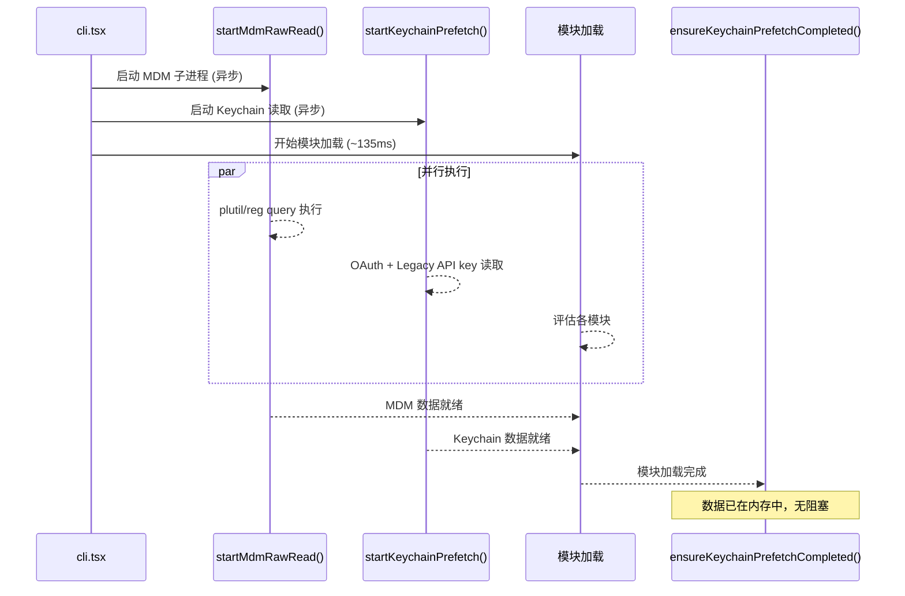

# 1.3 Side-Effect 编排：MDM、Keychain 与遥测

`main.tsx` 的 import 期间嵌入了三个并行启动的 side effect。这些不是代码异味——它们是经过性能分析后的刻意设计。

---

### 并行预取策略

```python
# main.tsx 顶部的 import 链
profileCheckpoint('main_tsx_entry')      # checkpoint 1
startMdmRawRead()                         # side effect 1：启动 MDM 子进程
startKeychainPrefetch()                  # side effect 2：启动两个 keychain 读取

# ... 后续 import 继续执行 ...

ensureKeychainPrefetchCompleted()         # 等待 preflight 完成
```

**问题**——在没有预取的情况下，`isRemoteManagedSettingsEligible()` 需要同步 spawn 子进程执行 `plutil`（macOS）或 `reg query`（Windows）读取 MDM 配置，以及在 `sync spawn` 中读取 keychain。这导致约 65ms 的同步阻塞，串行执行。

**策略**——在 import 期间启动两个独立操作的子进程，让它们与模块加载并行运行。模块加载本身需要 ~135ms（基于 profiling 数据），而 MDM 和 Keychain 的读取在这个窗口内异步完成。当代码第一次需要这些值时，数据已经在内存中。



---

### MDM 读取：平台管理配置

`mdm/rawRead.ts`（131 行）是一个最小依赖模块——只导入 `child_process`、`fs`、`constants.js`（仅导入 `os`）。注释明确指出为什么：`execFile` 如果改用 `execa` 会引入 `human-signals → cross-spawn`，约 58ms 的同步模块初始化开销。

MDM 原始读取的 `fireRawRead()` 函数按平台分发：

**macOS 路径**——通过 `plutil` 读取 `.plist` 文件：

```typescript
// mdm/rawRead.ts:57-88
const plistPaths = getMacOSPlistPaths()
const allResults = await Promise.all(
  plistPaths.map(async ({ path, label }) => {
    // execFilePromise 必须是第一个 await，确保 plutil spawn 在
    // event loop 轮询消息之前发生（见 main.tsx:3-4）
    if (!existsSync(path)) return { stdout: '', label, ok: false }
    const { stdout, code } = await execFilePromise(PLUTIL_PATH, [...PLUTIL_ARGS_PREFIX, path])
    return { stdout, label, ok: code === 0 && !!stdout }
  })
)
// First source wins (array is in priority order)
const winner = allResults.find(r => r.ok)
```

**关键设计**——`existsSync(path)` 快速路径：如果 plist 文件不存在，跳过 `plutil` 子进程。spawn plutil 即使立即 ENOENT 也需要约 5ms。在非 MDM 管理的机器上，这些文件永远不存在，跳过 spawn 可以节省约 5-10ms。但 `existsSync` 必须在 spawn 之前以同步方式调用——保持 "spawn-during-imports" 不变式。

**Windows 路径**——通过 `reg query` 并行查询 HKLM 和 HKCU 注册表键：

```typescript
const [hklm, hkcu] = await Promise.all([
  execFilePromise('reg', ['query', WINDOWS_REGISTRY_KEY_PATH_HKLM, '/v', WINDOWS_REGISTRY_VALUE_NAME]),
  execFilePromise('reg', ['query', WINDOWS_REGISTRY_KEY_PATH_HKCU, '/v', WINDOWS_REGISTRY_VALUE_NAME]),
])
```

**Linux 路径**——返回空。Linux 没有 MDM 等价机制。

两种用途的模式：
1. **启动**：`startMdmRawRead()` 在 `main.tsx` 模块级触发，结果通过 `getMdmRawReadPromise()` 消费
2. **轮询/回退**：`fireRawRead()` 按需创建新鲜读（用于 changeDetector 和 SDK 入口点）

---

### Keychain 预取：认证数据的并行化

`keychainPrefetch.ts`（117 行）只导入 `child_process` 和 `macOsKeychainHelpers.js`——不导入 `execa`（~58ms 的导入链），因为 `osx keychain` 的读取需要调用 `security` 子进程。模块顶部的注释是最详细的性能解释之一：

```typescript
// keychainPrefetch.ts:1-22
// isRemoteManagedSettingsEligible() reads two separate keychain entries
// SEQUENTIALLY via sync execSync during applySafeConfigEnvironmentVariables():
//   1. "Claude Code-credentials" (OAuth tokens)  — ~32ms
//   2. "Claude Code" (legacy API key)            — ~33ms
// Sequential cost: ~65ms on every macOS startup.
```

`startKeychainPrefetch()` 同时启动两个 keychain 读取：
1. OAuth token（主要认证路径）
2. Legacy API key（兼容路径）

**`spawnSecurity` 的实现细节**：

```typescript
function spawnSecurity(serviceName: string): Promise<SpawnResult> {
  return new Promise(resolve => {
    execFile(
      'security',
      ['find-generic-password', '-a', getUsername(), '-w', '-s', serviceName],
      { encoding: 'utf-8', timeout: KEYCHAIN_PREFETCH_TIMEOUT_MS },
      (err, stdout) => {
        // Exit 44 (entry not found) is valid "no key".
        // Timeout means keychain may have a key we couldn't fetch.
        resolve({
          stdout: err ? null : stdout?.trim() || null,
          timedOut: Boolean(err && 'killed' in err && err.killed),
        })
      },
    )
  })
}
```

超时判定的重要性：如果 `execFile` 超时（`err.killed === true`），不缓存 `null`——让同步路径重试。因为超时可能意味着 keychain 有数据但由于某种原因没读到。而 Exit 44（entry not found）是合法的"无 key"结果，可以安全地缓存 `null`。

**cache priming 的精细区分**：

```typescript
// 区分 "not started" (null) 和 "completed with no key" ({ stdout: null })
// 这让同步读取者只信任已完成的预取结果
let legacyApiKeyPrefetch: { stdout: string | null } | null = null
```

并行化后，两个 keychain 读取同时发出，总延迟从 65ms 降低到约 40ms（取决于较慢的那个）。

**`ensureKeychainPrefetchCompleted()` 的等待语义**——在需要认证数据的位置调用，如果预取已经完成则立即返回，否则等待。这是标准的 "fire and forget, then sync up when needed" 模式。非 darwin 平台是 no-op（直接返回）。

**cache invalidation**——`clearLegacyApiKeyPrefetch()` 与 `getApiKeyFromConfigOrMacOSKeychain()` 的 cache invalidation 并行调用，防止旧的缓存覆盖新写入的数据。

---

### 遥测初始化时机

遥测（Telemetry）的初始化不是同步操作。`initializeTelemetryAfterTrust()` 在 `init()` 完成后调用，原因有二：

1. **信任对话框**——用户尚未接受 trust dialog 之前，不应发送任何遥测数据
2. **身份标识**——用户身份（用户 ID、组织 ID）在认证完成后可用，遥测事件需要这些字段

这与 MDM/Keychain 的预取模式不同——后者是纯数据读取，前者是隐私边界的选择。

---

### Side-Effect 编排的风险与缓解

| 风险 | 缓解方式 |
|------|---------|
| MDM 子进程失败 | fail-open：仅 warning，不影响正常启动 |
| Keychain 读取超时 | `ensureKeychainPrefetchCompleted()` 有超时保护 |
| 模块加载慢于预取 | 预取数据缓存在内存中，不阻塞模块加载 |
| 内存碎片化 | 模块加载期间分配的内存与预取数据在不同区域 |

这种启动编排的核心理念是：**让 I/O 操作尽可能早地发出，尽可能晚地等待**。135ms 的模块加载窗口是免费的并行时间——在这段时间内，任何 I/O 操作的延迟都被"隐藏"了。

---

### 关键不变式：spawn-during-imports

注释记录了一个关键的设计不变式（invariant）：

> `execFilePromise` 必须是第一个 await，确保 plutil spawn 在 event loop 轮询消息之前发生

这是微妙的并发控制——Mdm 和 keychain 的 prefetched 操作在 import 链期间启动，它们必须在模块加载完成之前就开始。

```
时序:
  0ms:   startMdmRawRead()        ← plutil spawn 开始
  0ms:   startKeychainPrefetch()  ← security spawn 开始 
  0ms:   import('../main.js')     ← 模块加载开始
  
  65ms:  MDM read 完成（后台）
  80ms:  Keychain read 完成（后台）
  135ms: 模块加载完成
```

如果没有这个不变式，模块加载和预取之间的竞争条件会导致不确定的行为。

### 平台差异处理

side effect 在三个平台上的行为不同：

| 平台 | MDM | Keychain | 总启动延迟 |
|------|-----|----------|-----------|
| macOS | plutil 读取 .plist | security read-generic-password | ~40ms（并行后） |
| Windows | reg query HKLM/HKCU | 无 keychain | ~15ms |
| Linux | 无 MDM | 无 keychain | 0ms |

**Linux 是 no-op**——Linux 没有 MDM 等价机制，也没有 keychain。`startMdmRawRead()` 和 `startKeychainPrefetch()` 在非 darwin 平台上直接返回，不产生任何延迟。
