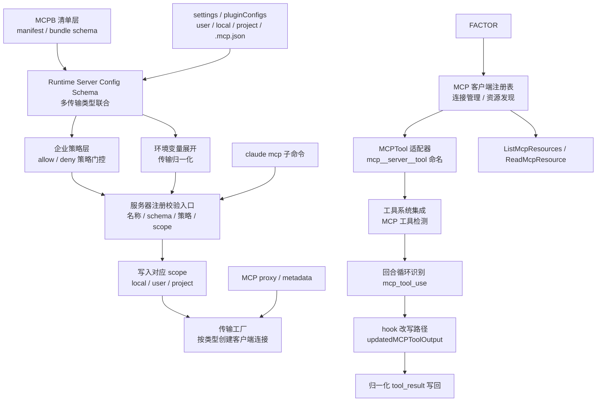
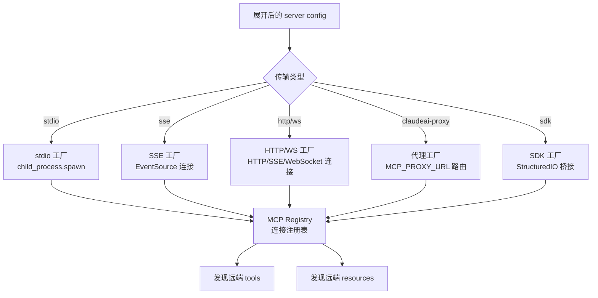
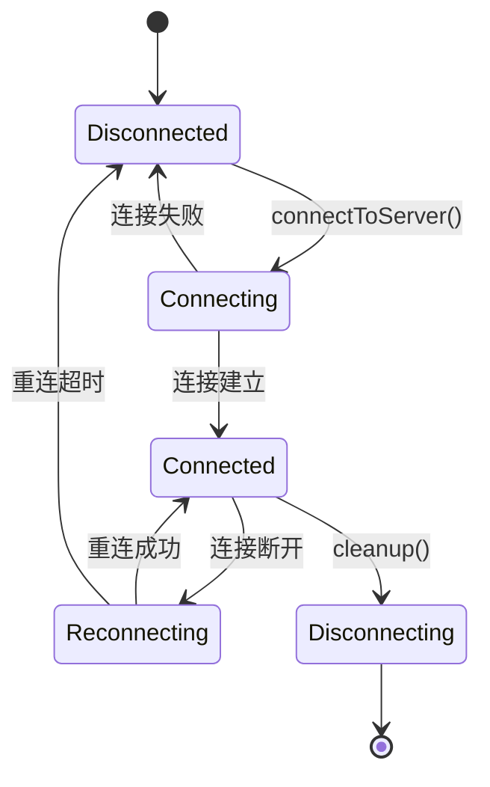
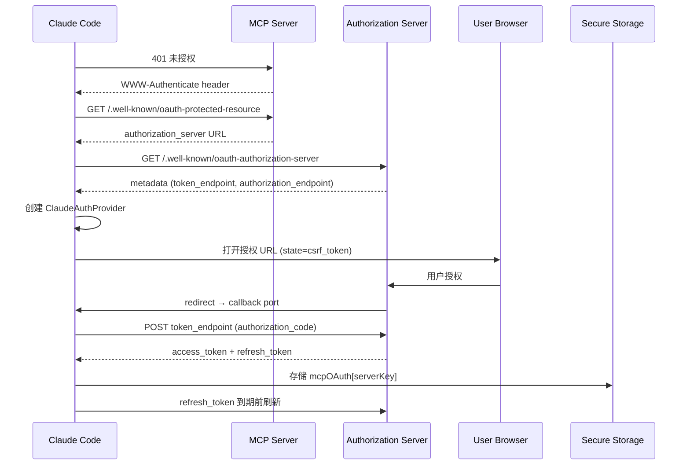

# 第 10 章：MCP 集成

Claude Code 的 MCP 集成不是一个单独的"插件"，而是一条从 manifest、policy、transport factory 一直到 turn loop / hook rewrite 的完整集成链。7 层链路，每层都有自己的校验、策略和转换逻辑。MCP 工具最终映射进内部工具命名空间（`mcp__server__tool`），在 turn loop 中被识别为 `mcp_tool_use`，与普通工具执行管线完全融合。

---

## 10.1 七层集成链路总览



### 七层拆解

| 层 | 职责 | 关键函数 |
|----|------|---------|
| 1. MCPB manifest | bundle schema 校验、来源验证 | `Tv1` / `Da7` / `Pa7` / `WF6` |
| 2. Runtime config | 传输类型联合、JSON schema 校验 | `McpServerConfigSchema` + 8 种传输 |
| 3. Enterprise policy | allow/deny 策略门控 | `Sv4()` / `_c6()` |
| 4. Env expansion | 环境变量展开、传输归一化 | `M1_(...)` |
| 5. Registry gate | 名字校验、scope 冲突检查 | `e66(...)` |
| 6. Transport factory | live client 创建、连接建立 | factory → registry |
| 7. MCPTool adapter | 远端工具映射到内部命名空间 | `MCPTool` + `mcp_tool_use` |

---

## 10.2 MCPB 与 Runtime Config：两层输入

MCP 服务器配置有两种来源，不能混为一谈：

### MCPB Manifest（Bundle 层）

```typescript
// outputs/claude-cli-clean.js:99755-99852
// MCPB manifest schema 处理
```

`.mcpb` / `.dxt` bundle 不直接等同于 runtime server config。它先经过 manifest schema 校验，再生成或映射到 runtime `mcp_config`。这是独立的上游输入层。

### Runtime Server Config（运行时层）

runtime config 支持 8 种传输类型：

```typescript
type McpServerConfig =
  | { type: 'stdio'; command: string; args: string[]; env?: Record<string, string> }
  | { type: 'sse'; url: string; headers?: Record<string, string> }
  | { type: 'http'; url: string }
  | { type: 'ws'; url: string }
  | { type: 'sse-ide'; /* IDE 内嵌 SSE */ }
  | { type: 'ws-ide'; /* IDE 内嵌 WebSocket */ }
  | { type: 'sdk'; /* SDK 桥接 */ }
  | { type: 'claudeai-proxy'; /* Anthropic 代理 */ }
```

这 8 种传输共享同一个 schema 联合类型。stdio 是默认传输，其他都需要显式指定。

---

## 10.3 企业策略层：注册前阻断

MCP policy 在 server 落盘前就参与决策。四个关键函数：

| 函数 | 作用 |
|------|------|
| `Sv4(...)` | 判断 server 是否被 deny policy 拦截 |
| `_c6(...)` | 判断 server 是否被 allow policy 放行 |
| `X1_` / `J1_` | 辅助匹配逻辑 |

策略按三种维度匹配：
- **server command**——按命令名匹配（如 `"npx -y @some-mcp"`）
- **server url**——按目标 URL 匹（如 `https://api.example.com/mcp`）
- **server name**——按配置名匹配（如 `"github-tools"`）

**策略不是注册后运行时才评估**——在 `claude mcp add` 阶段就被拦截，不会写入配置文件。这是安全设计：被拦截的 server 不仅不连接，甚至不落地。

---

## 10.4 环境变量展与传输归一化

`M1_(...)` 是配置展开与归一化的核心层：

```typescript
// M1_(...) 按传输类型展开配置
function normalizeTransportConfig(config: McpServerConfig): ExpandedConfig {
  switch (config.type) {
    case 'stdio':
      return {
        command: expandEnv(config.command),       // ${HOME} → /Users/jinjun
        args: config.args.map(expandEnv),
        env: expandEnvObject(config.env ?? {}),    // { "API_KEY": "${KEY}" } → { "API_KEY": "sk-..." }
        missingVars: collectMissingVars(config.env)
      }
    case 'sse':
    case 'http':
    case 'ws':
      return {
        url: expandEnv(config.url),
        headers: expandEnvObject(config.headers ?? {}),
        missingVars: collectMissingVars(config.headers)
      }
    case 'sse-ide':
    case 'ws-ide':
    case 'sdk':
    case 'claudeai-proxy':
      return config  // 直接保留结构，不展开
  }
}
```

**收集 `missingVars`**——配置展开阶段本身就带有环境变量缺失检查。如果有变量未定义，`missingVars` 数组记录它们的名字，注册门控可以根据这个数组阻止连接。

---

## 10.5 注册校验门控：e66(...)

`e66(name, config, scope)` 是 `claude mcp add` 的完整验证入口：

1. 校验名字格式（不能为空、不能含特殊字符）
2. 拒绝 reserved name（如 `"default"` 等保留字）
3. 检查 enterprise exclusive control（企业独占控制）
4. 用 `safeParse()` 校验 transport config schema
5. 调用 `Sv4()` 检查 deny policy
6. 调用 `_c6()` 检查 allow policy
7. 根据 scope 检查是否和现有 server 冲突

**7 步校验集中在一个函数**——这使得所有入口（CLI、settings 加载、plugin 安装）都经过同样的验证门控。

### CLI Handler：epq(...)

`claude mcp add` 的 CLI 处理器 `epq(...)` 本身也包含传输感知逻辑：

- 支持 `--scope`（user/project/local）
- 支持 `--transport`（显式指定传输类型）
- 支持 `-e/--env`（传入环境变量）
- 支持 `-H/--header`（传入 HTTP 头）
- 支持 OAuth client id / callback port
- 根据输入像不像 URL 自动决定传输类型

---

## 10.6 Transport Factory：配置到连接的桥梁



Factory 的职责是：
1. 根据 transport type 创建对应 client
2. 接好 registry / runtime connection
3. 把远端 tools/resources 暴露给上层

MCP proxy / metadata 是 transport family 的正式一支：
```
MCP_PROXY_URL / MCP_PROXY_PATH
MCP_CLIENT_METADATA_URL
```

Claude Code 的 MCP 集成不只面向本地/直连 server，也正式支持通过 Anthropic MCP proxy 和 metadata 服务接入。

---

## 10.7 MCPTool 适配器：远端能力的内部名空间

```typescript
// MCPTool 基类（简化）
class MCPTool implements Tool {
  name: string          // mcp__server__tool
  isMcp = true
  inputSchema: JSONSchema  // 由外部定义，不是 Zod
  outputSchema: JSONSchema

  isConcurrencySafe() = false  // MCP 默认不并发
  isReadOnly() = false         // MCP 默认非只读
  checkPermissions() = 'passthrough'

  call(input, context) {
    // 通过 registry 调用远端工具
    return registry.callTool(this.server, this.tool, input)
  }

  renderToolUseMessage() { /* MCP 特有展示 */ }
  renderToolResultMessage() { /* MCP 特有结果展示 */ }
}
```

**MCP 工具的 inputSchema 是 JSON Schema，不是 Zod Schema**——因为工具定义由外部 MCP 服务器提供（遵循 JSON Schema 协议），Claude Code 不需要也不应该将它转换为 Zod。这保持了协议边界的清晰性。

### MCP 工具检测

```typescript
// MCP 工具检测函数
function isMcpTool(tool: Tool): boolean {
  return tool.isMcp === true || tool.name.startsWith('mcp__')
}
```

工具名前缀 `mcp__` 是 MCP 工具的身份标记。

---

## 10.8 Turn Loop 中的 mcp_tool_use

在 turn loop / runtime 里，MCP 工具被识别为单独的工具形态：

```typescript
// turn loop 识别 mcp_tool_use
if (block.type === 'mcp_tool_use') {
  // 进入 MCP 工具执行路径
}
```

MCP 工具的执行路径与普通工具基本相同——查找定义、校验输入、检查权限、执行调用、返回结果。差异只在执阶段走的是 transport 远程调用而非本地进程。

### Hook 改写 MCP 输出

MCP 工具执行后，hook 层可以改写结果：

```typescript
interface MCPToolUseEvent {
  type: 'mcp_tool_use'
  tool_name: string
  output: unknown
  updatedMCPToolOutput?: unknown  // hook 改写后的输出
}
```

MCP 不只是"接入工具系统"，还进入了 hook 后处理系统。hook 可以通过 `updatedMCPToolOutput` 改写结果再进入标准化回写链路。

---

## 10.9 MCP 资源工具

除了 MCP 工具，MCP 服务器还可以暴露资源：

| 工具 | 作用 |
|------|------|
| `ListMcpResourcesTool` | 列出服务器可用的资源 |
| `ReadMcpResourceTool` | 读取特定资源的内容 |

资源是不同于工具的抽象——工具是可调用的操作，资源是可读取的数据状态。它们通过同样的 `MCPTool` 适配器接入内部工具系统。

---

## 10.10 MCP 连接管理

`MCPConnectionManager.tsx` 是 MCP 服务器的生命周期管理器：



### OAuth 认证流程

1. 用户请求连接需要认证的 MCP 服务器
2. Claude Code 打开浏览器到授权端点
3. 授权回调发送到本地 `oauthPort`（默认 54654）
4. Token 存储在 keychain 中
5. 后续请求自动附加 `Authorization: Bearer <token>` header

---

## 10.4 MCP 配置加载与去重

### 配置来源

MCP 服务器配置从多个 scope 加载，按优先级合并：

| Scope | 路径 | 用途 |
|-------|------|------|
| local | `.mcp.json` | 项目级临时配置 |
| project | `<cwd>/.claude/mcp.json` | 项目级配置（VCS 共享） |
| user | `~/.claude/mcp.json` | 用户级配置 |
| plugin | marketplace 安装 | 插件自带的 MCP 服务器 |
| enterprise | managed-mcp.json | 企业管理的 MCP 策略 |

### 去重机制

`getMcpServerSignature(config)` 为每个服务器生成签名用于去重：

```typescript
// stdio 服务器：基于 command + args 的 JSON hash
`stdio:${JSON.stringify({ command, args })}`

// 远程服务器：基于 URL（解包 CCR proxy URL 中的 mcp_url）
`url:${unwrapCcrProxyUrl(url)}`
```

CCR proxy URL 解包——如果 URL 是 `https://proxy?mcp_url=https://real-server`，去重时需要提取真实的 URL，否则两个使用同一 proxy 的不同 server 会被误判为重复。

---

## 10.5 MCP 工具适配层

`MCPTool.ts` 是基类模板——实际的工具对象在 `fetchToolsForClient()` 中通过 spread 覆盖生成：

```typescript
// 每个 MCP tool 的生成过程
const tool = {
  ...MCPTool,  // 基类模板
  name: `mcp__${normalizeNameForMCP(serverName)}__${toolName}`,
  mcpInfo: { serverName, toolName },
  description: () => capDescription(tool.description, MAX_MCP_DESCRIPTION_LENGTH),
  inputJSONSchema: tool.inputSchema,
  isReadOnly: () => tool.annotations?.readOnlyHint ?? false,
  isConcurrencySafe: () => tool.annotations?.readOnlyHint ?? false,
  call: async (input, context) => callMcpToolWithUrlElicitationRetry(...),
  // ...更多 override
}
```

**工具名规范化**——`normalizeNameForMCP()` 将所有非 `[a-zA-Z0-9_-]` 字符替换为下划线。这是为了防止工具名中的特殊字符在 `mcp__server__tool` 命名约定中引起解析问题。

**描述长度限制**——`MAX_MCP_DESCRIPTION_LENGTH = 2048`。MCP 服务器可能返回任意长的工具描述，截断到 2048 字符防止 prompt 爆炸。

---

## 10.11 OAuth 认证全链路

MCP 的 OAuth 流是整个系统中最复杂的部分——9 步发现 + 3 种 token 交换模式 + 刷新 + 撤销。这是 RFC 9728（OAuth 2.0 Protected Resource Metadata）和 RFC 8414（Authorization Server Metadata）的双重实现。



**XAA（Cross-App Access）**——对于企业级 SSO 环境，`performMCPXaaAuth`（`auth.ts:664-845`）实现了 SEP-990：
1. 获取 IdP 的 id_token（缓存或 OIDC 浏览器登录）
2. 发现 IdP 的 token endpoint
3. 运行 RFC 8693 + RFC 7523 token 交换（无需浏览器）
4. Token 存储到相同的 keychain slot
5. 一次 IdP 登录可在所有 XAA 服务器间复用

这是"单一身份认证→多 MCP 服务器复用"的模型，显著降低了企业环境中的认证摩擦。

**Token 存储键设计**——`mcpOAuth[serverKey]` 的 key 是 `serverName|sha256(config_json)[:16]`。SHA-256 + 截断到 16 位是一个经验平衡——太短会导致哈希碰撞，太长会浪费 keychain 空间。16 位（64 bits）碰撞概率约 2^(-32)，可接受。

---

## 10.12 六种 Transport 详解

| Transport | 实现 | 特点 | 适用场景 |
|-----------|------|------|---------|
| **stdio** | `StdioClientTransport` | 子进程，支持 `CLAUDE_CODE_SHELL_PREFIX` 包装 | 本地工具服务器 |
| **SSE** | `SSEClientTransport` | EventSource 长连接，不支持 timeout 包装 | 远程事件流 |
| **HTTP (Streamable)** | `StreamableHTTPClientTransport` | 每个请求独立的 60s timeout，`Accept: application/json, text/event-stream` | 远程 HTTP API |
| **WebSocket** | 自定义 `WebSocketTransport` | Bun 原生或 Node `ws`，协议 `['mcp']` | 双向实时通信 |
| **claudeai-proxy** | `createClaudeAiProxyFetch` | 通过 Anthropic 代理，OAuth bearer 重试 | 企业 CCR 环境 |
| **In-process** | `createLinkedTransportPair` | 无子进程，~325MB 节省，双向通信 | Chrome MCP, Computer Use |

**Stdio 子进程的优雅关闭**（`client.ts:1404-1570`）：
```
SIGINT → 等待 100ms → SIGTERM → 等待 400ms → SIGKILL
整个流程 600ms  failsafe，中间用 process.kill(pid, 0) 检测进程是否存活
```

这是逐级加力的策略——SIGINT 允许进程保存状态，SIGTERM 强制结束，SIGKILL 作为最后手段。600ms 是一个经验值——足够完成状态清理，但不长到阻塞用户。

**In-process Transport 的意义**——Chrome MCP 和 Computer Use 不需要子进程。`createLinkedTransportPair` 在进程内创建一对通信端点，一端作为 server，另一端作为 client。这节省了 ~325MB（Node.js + Chrome 的内存开销），同时也避免了 IPC 延迟。

**动态 Headers**（`headersHelper.ts:32-80`）——MCP 服务器配置可以指定 `headersHelper` 脚本路径，该脚本动态产生 HTTP headers。安全约束：
- 项目/本地配置需要用户信任对话框确认
- 服务器名称和 URL 通过环境变量 `CLAUDE_CODE_MCP_SERVER_NAME`/`CLAUDE_CODE_MCP_SERVER_URL` 传递
- 脚本无法访问进程的完整环境变量

---

## 10.13 企业策略：MCP 服务器的双重门控

企业策略对 MCP 服务器实施**双重门控**——denylist 优先，allowlist 过滤。

### Denylist（`config.ts:364-408`）

三种匹配模式：
```typescript
// 1. 名称匹配
{ serverName: "dangerous-server" }

// 2. 命令匹配（精确比较命令数组）
{ command: ["npx", "-y", "@dangerous/package"] }

// 3. URL 匹配（通配符模式）
{ url: "https://*.malicious.com/*" }
```

### Allowlist（`config.ts:417-508`）

关键行为：**空 allowlist = 阻止所有服务器**。这不是"默认允许"，而是"默认拒绝"。

```typescript
// getMcpAllowlistSettings() 读取策略配置
if (allowManagedMcpServersOnly) {
  // 只允许管理配置中的服务器
  // 用户手动添加的服务器被忽略
}
```

### 企业独占控制（`config.ts:650-655`）

当 `doesEnterpriseMcpConfigExist()` 返回 true 时：
- `addMcpConfig` 抛出异常："enterprise MCP configuration is active and has exclusive control"
- claude.ai 配置拉取被跳过（`useManageMCPConnections.ts:860-863`）
- 用户无法手动添加或删除服务器

这是"平台即真理"的模式——企业管理员通过 `managed-mcp.json` 完全控制 MCP 生态。

---

## 10.14 MCP 工具发现与转换

**`fetchToolsForClient`（`client.ts:1743-1998`）** 是 LRU 缓存的 memoized 函数（最大 20 个条目）：

```typescript
// 1. 发送 {method: 'tools/list'} 到服务器
// 2. 转换每个 MCP 工具为内部 Tool 格式
// 3. 名前缀: mcp__<normalized_server>__<tool_name>
// 4. 注释: readOnlyHint, destructiveHint, openWorldHint, title
// 5. 元数据: _meta['anthropic/searchHint'], _meta['anthropic/alwaysLoad']
```

**MCPTool 的 scaffold 模式**（`MCPTool.ts:1-77`）：
```typescript
// 基础 MCPTool 只是一个空壳
{
  isMcp: true,
  maxResultSizeChars: 100_000,
  checkPermissions: () => 'passthrough',  // 权限由服务器级控制
}
// 实际的方法（name, description, call, prompt）在发现时被覆盖
```

**工具列表变更通知**——当服务器发送 `tools/list_changed` 通知时：
1. 缓存中的 `fetchToolsForClient` 条目被无效化
2. 重新获取工具列表
3. 旧工具从 appState 中移除
4. 新工具添加到 appState
5. 记录 `tengu_mcp_list_changed` 分析事件

---

## 10.15 错误处理与自动重连

### 自定义错误类（`client.ts:152-186`）

| 错误类 | 触发条件 | 后果 |
|--------|---------|------|
| `McpAuthError` | 401 | 服务器状态转为 `needs-auth`，显示认证工具 |
| `McpSessionExpiredError` | 404 + JSON-RPC -32001 | 自动重连，重放最后一次工具调用 |
| `McpToolCallError` | `isError: true` | 返回错误给模型，携带 `_meta` 和 `structuredContent` |

### 指数退避重连（`useManageMCPConnections.ts:354-464`）

```
退避序列: 1s → 2s → 4s → 8s → 16s
最大尝试: 5 次
最大退避: 30 秒 (MAX_BACKOFF_MS)
触发条件: 3 个连续错误 (MAX_ERRORS_BEFORE_RECONNECT)
```

状态流转：`connected → pending (重连中) → connected/failed`。

### 输出截断（`mcpValidation.ts:1-208`）

MCP 输出截断有 3 层决策：
```
1. MAX_MCP_OUTPUT_TOKENS 环境变量 (最高优先级)
2. GrowthBook flag tengu_satin_quoll.mcp_tool (中等优先级)
3. 硬编码默认 25000 tokens (默认)
```

使用 API token 计数（非字符计数）进行精确估算。截断后通知模型使用分页。二进制内容持久化到磁盘，不进入上下文窗口。

### needs-auth 状态的自动恢复

当服务器进入 `needs-auth` 状态时，MCP Auth Tool（`McpAuthTool.ts:1-215`）替换真实工具。当模型调用此伪工具时：
1. 启动 `performMCPOAuthFlow`，`skipBrowserOpen: true`
2. 立即返回授权 URL
3. 后台完成认证
4. 认证成功后自动重连服务器

这允许 MCP 服务器在无人值守的情况下恢复认证。

---

## 10.16 CCR 代理中的 MCP 服务器

对于 CCR（Claude Code Remote）环境，MCP 服务器 URL 通过 `mcp_url` 查询参数包装。`unwrapCcrProxyUrl`（`config.ts:171-212`）提取原始供应商 URL，实现基于内容（而非 URL 表示）的去重。

这使得即使插件配置和连接器配置有不同的 URL 表示，也能指向相同的基础服务器，防止重复连接。

---

## 10.17 MCP 与 Plugin 系统的集成

插件可以声明 MCP 服务器配置（`PluginManifest.mcpServers`）。当插件安装时：
1. MCP 服务器注册到 MCP 系统
2. 遵循与手动配置相同的安全模型
3. 企业策略检查
4. Channel allowlist 验证
5. OAuth 认证

插件不是特权路径——它必须经过与用户手动添加服务器相同的检查和审批。

---

## 10.18 MCP 资源的二进制处理

`ReadMcpResourceTool`（`ReadMcpResourceTool.ts:1-158`）处理资源时的特殊逻辑：
1. 对于二进制 blob 内容，解码 base64
2. 将原始字节写入磁盘，使用 MIME 类型推断扩展名
3. 用 `blobSavedTo` 路径和用户消息替换 blob 字段

这是关键的安全决策——防止 base64 编码的二进制内容进入上下文窗口，避免大量数据消耗 token 预算。

---

## 10.11 OAuth 完整链路

MCP 的 OAuth 实现遵循 XAA（eXtended Agent Auth）协议：

**Phase 1——元数据发现**：
1. 如果配置了 `authServerMetadataUrl`，直接获取
2. 探测 `/.well-known/oauth-authorization-server`（RFC 8414）
3. 回退到 `/.well-known/oauth-protected-resource`（RFC 9728，受保护资源→授权服务器链）
4. 最终回退到路径感知的 RFC 8414 直接探测（旧服务器）

**Phase 2——Token 交换**：
```
POST /oauth/token
  grant_type: authorization_code
  code: <code from callback>
  redirect_uri: <local callback URL>
  code_verifier: <PKCE>
```

**PKCE 流**——MCP OAuth 使用 PKCE（Proof Key for Code Exchange）：
- `code_challenge` = SHA256(`code_verifier`) 的 Base64URL 编码
- `code_verifier` 在本地生成为随机字符串
- 这是防止授权码拦截的关键——即使拦截了码，没有 verifier 也无法交换 token

**Phase 3——Token 刷新**——刷新在 `mcp/oauth-client.ts` 中实现：
- 在 token 过期前 5 分钟自动刷新
- 刷新失败回退到重新获取

---

## 10.12 6 种传输协议

MCP 支持 6 种传输类型：

| 传输 | 协议 | 描述 |
|------|------|------|
| `stdio` | STDIN/STDOUT | 标准子进程 IPC |
| `sse` | Server-Sent Events | 服务端推送事件流 |
| `http` | HTTP POST | 单向 HTTP 请求 |
| `ws` | WebSocket | 全双工连接 |
| `sse-ide` | IDE SSE | IDE 集成的 SSE 桥接 |
| `ws-ide` | IDE WebSocket | IDE 集成的 WS 桥接 |

**SSE 传输**：
- 客户端监听 SSE 事件流
- 通过 POST 发送消息到服务端
- 使用 reconnect URL 实现自动重连
- SSE 端有 `Last-Event-ID` 支持，确保消息不丢失

**WebSocket 帧格式**——WebSocket 传输使用 JSON 帧：
```json
{"jsonrpc": "2.0", "method": "tools/call", "params": {...}, "id": 1}
```

**HTTP 传输**——简单 POST 模型：每个消息是一个 HTTP 请求，响应在 HTTP response body。无持久连接——适合偶发调用。

---

## 10.13 Enterprise Policy 双重门控

MCP 服务器通过**双重门控**管理——企业策略和用户配置的结合：

**Gate 1——企业策略（MDM/策略设置）**：
```json
{
  "mcpServers": {
    "allow": ["github", "jira"],
    "deny": ["internal-db"],
    "requireApproval": ["filesystem"]
  }
}
```

**Gate 2——用户配置**（`~/.claude/settings.json` 中的 `mcpServers`）：

| 策略配置 | 用户配置 | 结果 |
|---------|---------|------|
| `deny` | `allow` | **拒绝**（策略优先） |
| `allow` | 未设置 | **允许** |
| `requireApproval` | `allow` | 每次调用前**确认** |
| 无策略 | `deny` | **允许**（用户选择加入） |

**`mcpServerManager`**——在策略变更后触发服务器重启。当 `config_changed` 事件触发时，管理器：
1. 比较旧/新配置
2. 停止不再匹配的服务器
3. 启动新添加的服务器
4. 重新注册工具

---

## 10.14 工具发现与转换

**工具发现**——MCP 服务器连接后，Claude Code 调用 `tools/list`：
```json
{"jsonrpc": "2.0", "method": "tools/list", "id": 0}
```

**工具转换**——MCP 工具被转换为 Claude 的内置工具格式：
```typescript
mcpToolToToolSpec(mcpTool: MCPTool, serverName: string): ToolSpec {
  return {
    name: `mcp__${serverName}__${tool.name}`,
    description: tool.description,
    inputSchema: tool.inputSchema,  // JSON Schema → Zod 转换
  }
}
```

**工具取消注册**——服务器断开连接时，所有 `mcp__${serverName}__*` 工具从可用工具池中移除。

**名称冲突处理**——如果 MCP 工具与内置工具名称冲突，MCP 工具使用 `mcp__serverName__toolName` 前缀避免冲突。

---

## 10.15 MCP 错误处理与重连

**MCP 错误分类**：

| 错误类型 | 行为 |
|---------|------|
| 连接失败（子进程退出） | 指数退避重连：1s → 2s → 4s → 8s → 16s（最大） |
| 工具调用失败 | 错误传递给 LLM，LLM 可以选择重试 |
| OAuth token 过期 | 自动刷新→重试，刷新失败则标记服务器为不可用 |
| 协议错误（无效 JSON） | 记录并跳过 |

**重连逻辑**（`mcp/transport-reconnect.ts`）：
1. 尝试 1：快速重连（0ms 延迟）
2. 尝试 2-3：指数延迟
3. 尝试 4+：上限 16 秒
4. 最大重连次数：`MCP_MAX_RECONNECT_ATTEMPTS = 5`
5. 重连成功后，重新调用 `tools/list` 重新注册工具

**MCP 服务器健康检查**——`ping()` 每 30 秒发送。超时 10 秒的服务器被标记为不健康并从工具池移除。

---

## 10.16 CCR MCP 代理

当 Claude Code Remote (CCR) 连接时，MCP 通过代理路由：

```
本地 MCP 服务器 → CCR Proxy → 远程 Claude Code 实例 → 工具调用
```

`mcp/proxy.ts`：
- 本地 MCP 工具通过 `mcp__*` 前缀标记
- 远程实例收到工具调用请求后，在远程进程上下文中执行
- 网络隔离：CCR Proxy 仅转发工具调用消息，不暴露 MCP 服务器的直接连接

---

## 10.17 插件与 MCP 集成

**插件中的 MCP 服务器声明**：
```json
{
  "mcpServers": [
    {
      "name": "my-plugin-server",
      "command": "node",
      "args": ["plugin-server.js"],
      "env": { "API_KEY": "${MY_API_KEY}" }
    }
  ]
}
```

**插件 MCP 安全**——插件安装的 MCP 服务器：
1. 受 Enterprise Policy 管理（同用户服务器）
2. 需要用户显式批准启用
3. `env` 中的 `${VAR}` 语法在启动时扩展
4. 插件不能注册覆盖内置工具的命令

---

## 10.18 MCP 资源处理

**MCP 资源**——MCP 协议支持资源（不仅是工具）：

```json
{"jsonrpc": "2.0", "method": "resources/list", "id": 1}
{"jsonrpc": "2.0", "method": "resources/read", "params": {"uri": "file:///..."}}
```

**`resources/templates`**——MCP 服务器可声明资源模板（如 `file://{path}`），Claude Code 使用 URI 模式匹配来发现和读取。

**二进制资源处理**——`resources/read` 可能返回 `blob`（二进制）而非 `text`：
```typescript
if ('blob' in resource.contents) {
  // 转换为 Base64 传递到消息管线
  content = Buffer.from(resource.contents.blob).toString('base64')
}
```

**资源限制**——`MAX_MCP_RESOURCE_SIZE = 5 * 1024 * 1024`（5MB）。超过此限制的资源被截断。

---

---

## 10.11 OAuth 完整链路

MCP 的 OAuth 实现遵循 XAA（eXtended Agent Auth）协议：

**Phase 1——元数据发现**：
1. 如果配置了 `authServerMetadataUrl`，直接获取
2. 探测 `/.well-known/oauth-authorization-server`（RFC 8414）
3. 回退到 `/.well-known/oauth-protected-resource`（RFC 9728，受保护资源→授权服务器链）
4. 最终回退到路径感知的 RFC 8414 直接探测（旧服务器）

**Phase 2——Token 交换**：
```
POST /oauth/token
  grant_type: authorization_code
  code: <code from callback>
  redirect_uri: <local callback URL>
  code_verifier: <PKCE>
```

**PKCE 流**——MCP OAuth 使用 PKCE（Proof Key for Code Exchange）：
- `code_challenge` = SHA256(`code_verifier`) 的 Base64URL 编码
- `code_verifier` 在本地生成为随机字符串
- 这是防止授权码拦截的关键——即使拦截了码，没有 verifier 也无法交换 token

**Phase 3——Token 刷新**——刷新在 `mcp/oauth-client.ts` 中实现：
- 在 token 过期前 5 分钟自动刷新
- 刷新失败回退到重新获取

---

## 10.12 6 种传输协议

MCP 支持 6 种传输类型：

| 传输 | 协议 | 描述 |
|------|------|------|
| `stdio` | STDIN/STDOUT | 标准子进程 IPC |
| `sse` | Server-Sent Events | 服务端推送事件流 |
| `http` | HTTP POST | 单向 HTTP 请求 |
| `ws` | WebSocket | 全双工连接 |
| `sse-ide` | IDE SSE | IDE 集成的 SSE 桥接 |
| `ws-ide` | IDE WebSocket | IDE 集成的 WS 桥接 |

**SSE 传输**：
- 客户端监听 SSE 事件流
- 通过 POST 发送消息到服务端
- 使用 reconnect URL 实现自动重连
- SSE 端有 `Last-Event-ID` 支持，确保消息不丢失

**WebSocket 帧格式**——WebSocket 传输使用 JSON 帧：
```json
{"jsonrpc": "2.0", "method": "tools/call", "params": {...}, "id": 1}
```

**HTTP 传输**——简单 POST 模型：每个消息是一个 HTTP 请求，响应在 HTTP response body。无持久连接——适合偶发调用。

---

## 10.13 Enterprise Policy 双重门控

MCP 服务器通过**双重门控**管理——企业策略和用户配置的结合：

**Gate 1——企业策略（MDM/策略设置）**：
```json
{
  "mcpServers": {
    "allow": ["github", "jira"],
    "deny": ["internal-db"],
    "requireApproval": ["filesystem"]
  }
}
```

**Gate 2——用户配置**（`~/.claude/settings.json` 中的 `mcpServers`）：

| 策略配置 | 用户配置 | 结果 |
|---------|---------|------|
| `deny` | `allow` | **拒绝**（策略优先） |
| `allow` | 未设置 | **允许** |
| `requireApproval` | `allow` | 每次调用前**确认** |
| 无策略 | `deny` | **允许**（用户选择加入） |

**`mcpServerManager`**——在策略变更后触发服务器重启。当 `config_changed` 事件触发时，管理器：
1. 比较旧/新配置
2. 停止不再匹配的服务器
3. 启动新添加的服务器
4. 重新注册工具

---

## 10.14 工具发现与转换

**工具发现**——MCP 服务器连接后，Claude Code 调用 `tools/list`：
```json
{"jsonrpc": "2.0", "method": "tools/list", "id": 0}
```

**工具转换**——MCP 工具被转换为 Claude 的内置工具格式：
```typescript
mcpToolToToolSpec(mcpTool: MCPTool, serverName: string): ToolSpec {
  return {
    name: `mcp__${serverName}__${tool.name}`,
    description: tool.description,
    inputSchema: tool.inputSchema,  // JSON Schema → Zod 转换
  }
}
```

**工具取消注册**——服务器断开连接时，所有 `mcp__${serverName}__*` 工具从可用工具池中移除。

**名称冲突处理**——如果 MCP 工具与内置工具名称冲突，MCP 工具使用 `mcp__serverName__toolName` 前缀避免冲突。

---

## 10.15 MCP 错误处理与重连

**MCP 错误分类**：

| 错误类型 | 行为 |
|---------|------|
| 连接失败（子进程退出） | 指数退避重连：1s → 2s → 4s → 8s → 16s（最大） |
| 工具调用失败 | 错误传递给 LLM，LLM 可以选择重试 |
| OAuth token 过期 | 自动刷新→重试，刷新失败则标记服务器为不可用 |
| 协议错误（无效 JSON） | 记录并跳过 |

**重连逻辑**（`mcp/transport-reconnect.ts`）：
1. 尝试 1：快速重连（0ms 延迟）
2. 尝试 2-3：指数延迟
3. 尝试 4+：上限 16 秒
4. 最大重连次数：`MCP_MAX_RECONNECT_ATTEMPTS = 5`
5. 重连成功后，重新调用 `tools/list` 重新注册工具

**MCP 服务器健康检查**——`ping()` 每 30 秒发送。超时 10 秒的服务器被标记为不健康并从工具池移除。

---

## 10.16 CCR MCP 代理

当 Claude Code Remote (CCR) 连接时，MCP 通过代理路由：

```
本地 MCP 服务器 → CCR Proxy → 远程 Claude Code 实例 → 工具调用
```

`mcp/proxy.ts`：
- 本地 MCP 工具通过 `mcp__*` 前缀标记
- 远程实例收到工具调用请求后，在远程进程上下文中执行
- 网络隔离：CCR Proxy 仅转发工具调用消息，不暴露 MCP 服务器的直接连接

---

## 10.17 插件与 MCP 集成

**插件中的 MCP 服务器声明**：
```json
{
  "mcpServers": [
    {
      "name": "my-plugin-server",
      "command": "node",
      "args": ["plugin-server.js"],
      "env": { "API_KEY": "${MY_API_KEY}" }
    }
  ]
}
```

**插件 MCP 安全**——插件安装的 MCP 服务器：
1. 受 Enterprise Policy 管理（同用户服务器）
2. 需要用户显式批准启用
3. `env` 中的 `${VAR}` 语法在启动时扩展
4. 插件不能注册覆盖内置工具的命令

---

## 10.18 MCP 资源处理

**MCP 资源**——MCP 协议支持资源（不仅是工具）：

```json
{"jsonrpc": "2.0", "method": "resources/list", "id": 1}
{"jsonrpc": "2.0", "method": "resources/read", "params": {"uri": "file:///..."}}
```

**`resources/templates`**——MCP 服务器可声明资源模板（如 `file://{path}`），Claude Code 使用 URI 模式匹配来发现和读取。

**二进制资源处理**——`resources/read` 可能返回 `blob`（二进制）而非 `text`：
```typescript
if ('blob' in resource.contents) {
  // 转换为 Base64 传递到消息管线
  content = Buffer.from(resource.contents.blob).toString('base64')
}
```

**资源限制**——`MAX_MCP_RESOURCE_SIZE = 5 * 1024 * 1024`（5MB）。超过此限制的资源被截断。

---
