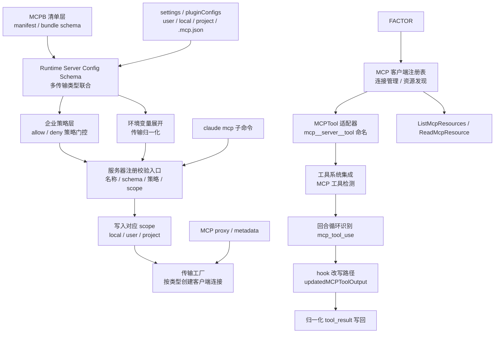
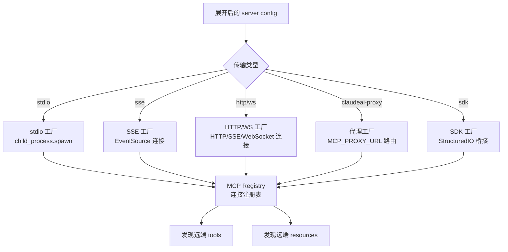
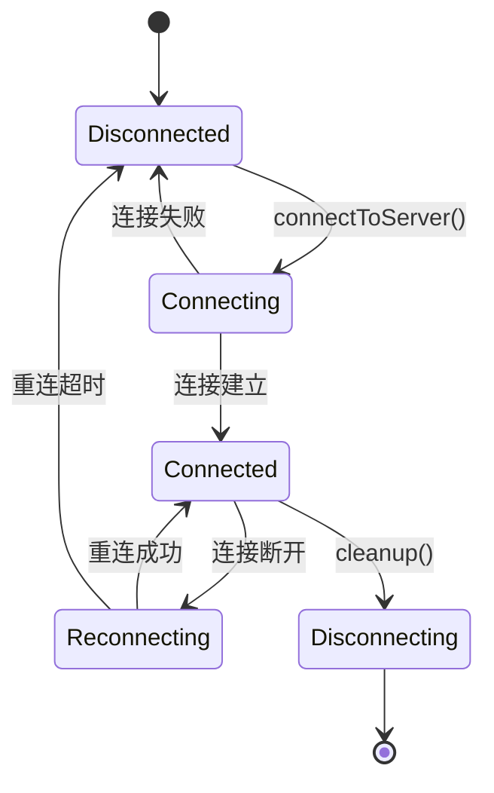

# 第 10 章：MCP 集成

Claude Code 的 MCP 集成不是一个单独的"插件"，而是一条从 manifest、policy、transport factory 一直到 turn loop / hook rewrite 的完整集成链。7 层链路，每层都有自己的校验、策略和转换逻辑。MCP 工具最终映射进内部工具命名空间（`mcp__server__tool`），在 turn loop 中被识别为 `mcp_tool_use`，与普通工具执行管线完全融合。

---

## 10.1 七层集成链路总览



### 七层拆解

| 层 | 职责 | 关键函数 |
|----|------|---------|
| 1. MCPB manifest | bundle schema 校验、来源验证 | `Tv1` / `Da7` / `Pa7` / `WF6` |
| 2. Runtime config | 传输类型联合、JSON schema 校验 | `McpServerConfigSchema` + 8 种传输 |
| 3. Enterprise policy | allow/deny 策略门控 | `Sv4()` / `_c6()` |
| 4. Env expansion | 环境变量展开、传输归一化 | `M1_(...)` |
| 5. Registry gate | 名字校验、scope 冲突检查 | `e66(...)` |
| 6. Transport factory | live client 创建、连接建立 | factory → registry |
| 7. MCPTool adapter | 远端工具映射到内部命名空间 | `MCPTool` + `mcp_tool_use` |

---

## 10.2 MCPB 与 Runtime Config：两层输入

MCP 服务器配置有两种来源，不能混为一谈：

### MCPB Manifest（Bundle 层）

```typescript
// outputs/claude-cli-clean.js:99755-99852
// MCPB manifest schema 处理
```

`.mcpb` / `.dxt` bundle 不直接等同于 runtime server config。它先经过 manifest schema 校验，再生成或映射到 runtime `mcp_config`。这是独立的上游输入层。

### Runtime Server Config（运行时层）

runtime config 支持 8 种传输类型：

```typescript
type McpServerConfig =
  | { type: 'stdio'; command: string; args: string[]; env?: Record<string, string> }
  | { type: 'sse'; url: string; headers?: Record<string, string> }
  | { type: 'http'; url: string }
  | { type: 'ws'; url: string }
  | { type: 'sse-ide'; /* IDE 内嵌 SSE */ }
  | { type: 'ws-ide'; /* IDE 内嵌 WebSocket */ }
  | { type: 'sdk'; /* SDK 桥接 */ }
  | { type: 'claudeai-proxy'; /* Anthropic 代理 */ }
```

这 8 种传输共享同一个 schema 联合类型。stdio 是默认传输，其他都需要显式指定。

---

## 10.3 企业策略层：注册前阻断

MCP policy 在 server 落盘前就参与决策。四个关键函数：

| 函数 | 作用 |
|------|------|
| `Sv4(...)` | 判断 server 是否被 deny policy 拦截 |
| `_c6(...)` | 判断 server 是否被 allow policy 放行 |
| `X1_` / `J1_` | 辅助匹配逻辑 |

策略按三种维度匹配：
- **server command**——按命令名匹配（如 `"npx -y @some-mcp"`）
- **server url**——按目标 URL 匹（如 `https://api.example.com/mcp`）
- **server name**——按配置名匹配（如 `"github-tools"`）

**策略不是注册后运行时才评估**——在 `claude mcp add` 阶段就被拦截，不会写入配置文件。这是安全设计：被拦截的 server 不仅不连接，甚至不落地。

---

## 10.4 环境变量展与传输归一化

`M1_(...)` 是配置展开与归一化的核心层：

```typescript
// M1_(...) 按传输类型展开配置
function normalizeTransportConfig(config: McpServerConfig): ExpandedConfig {
  switch (config.type) {
    case 'stdio':
      return {
        command: expandEnv(config.command),       // ${HOME} → /Users/jinjun
        args: config.args.map(expandEnv),
        env: expandEnvObject(config.env ?? {}),    // { "API_KEY": "${KEY}" } → { "API_KEY": "sk-..." }
        missingVars: collectMissingVars(config.env)
      }
    case 'sse':
    case 'http':
    case 'ws':
      return {
        url: expandEnv(config.url),
        headers: expandEnvObject(config.headers ?? {}),
        missingVars: collectMissingVars(config.headers)
      }
    case 'sse-ide':
    case 'ws-ide':
    case 'sdk':
    case 'claudeai-proxy':
      return config  // 直接保留结构，不展开
  }
}
```

**收集 `missingVars`**——配置展开阶段本身就带有环境变量缺失检查。如果有变量未定义，`missingVars` 数组记录它们的名字，注册门控可以根据这个数组阻止连接。

---

## 10.5 注册校验门控：e66(...)

`e66(name, config, scope)` 是 `claude mcp add` 的完整验证入口：

1. 校验名字格式（不能为空、不能含特殊字符）
2. 拒绝 reserved name（如 `"default"` 等保留字）
3. 检查 enterprise exclusive control（企业独占控制）
4. 用 `safeParse()` 校验 transport config schema
5. 调用 `Sv4()` 检查 deny policy
6. 调用 `_c6()` 检查 allow policy
7. 根据 scope 检查是否和现有 server 冲突

**7 步校验集中在一个函数**——这使得所有入口（CLI、settings 加载、plugin 安装）都经过同样的验证门控。

### CLI Handler：epq(...)

`claude mcp add` 的 CLI 处理器 `epq(...)` 本身也包含传输感知逻辑：

- 支持 `--scope`（user/project/local）
- 支持 `--transport`（显式指定传输类型）
- 支持 `-e/--env`（传入环境变量）
- 支持 `-H/--header`（传入 HTTP 头）
- 支持 OAuth client id / callback port
- 根据输入像不像 URL 自动决定传输类型

---

## 10.6 Transport Factory：配置到连接的桥梁



Factory 的职责是：
1. 根据 transport type 创建对应 client
2. 接好 registry / runtime connection
3. 把远端 tools/resources 暴露给上层

MCP proxy / metadata 是 transport family 的正式一支：
```
MCP_PROXY_URL / MCP_PROXY_PATH
MCP_CLIENT_METADATA_URL
```

Claude Code 的 MCP 集成不只面向本地/直连 server，也正式支持通过 Anthropic MCP proxy 和 metadata 服务接入。

---

## 10.7 MCPTool 适配器：远端能力的内部名空间

```typescript
// MCPTool 基类（简化）
class MCPTool implements Tool {
  name: string          // mcp__server__tool
  isMcp = true
  inputSchema: JSONSchema  // 由外部定义，不是 Zod
  outputSchema: JSONSchema

  isConcurrencySafe() = false  // MCP 默认不并发
  isReadOnly() = false         // MCP 默认非只读
  checkPermissions() = 'passthrough'

  call(input, context) {
    // 通过 registry 调用远端工具
    return registry.callTool(this.server, this.tool, input)
  }

  renderToolUseMessage() { /* MCP 特有展示 */ }
  renderToolResultMessage() { /* MCP 特有结果展示 */ }
}
```

**MCP 工具的 inputSchema 是 JSON Schema，不是 Zod Schema**——因为工具定义由外部 MCP 服务器提供（遵循 JSON Schema 协议），Claude Code 不需要也不应该将它转换为 Zod。这保持了协议边界的清晰性。

### MCP 工具检测

```typescript
// MCP 工具检测函数
function isMcpTool(tool: Tool): boolean {
  return tool.isMcp === true || tool.name.startsWith('mcp__')
}
```

工具名前缀 `mcp__` 是 MCP 工具的身份标记。

---

## 10.8 Turn Loop 中的 mcp_tool_use

在 turn loop / runtime 里，MCP 工具被识别为单独的工具形态：

```typescript
// turn loop 识别 mcp_tool_use
if (block.type === 'mcp_tool_use') {
  // 进入 MCP 工具执行路径
}
```

MCP 工具的执行路径与普通工具基本相同——查找定义、校验输入、检查权限、执行调用、返回结果。差异只在执阶段走的是 transport 远程调用而非本地进程。

### Hook 改写 MCP 输出

MCP 工具执行后，hook 层可以改写结果：

```typescript
interface MCPToolUseEvent {
  type: 'mcp_tool_use'
  tool_name: string
  output: unknown
  updatedMCPToolOutput?: unknown  // hook 改写后的输出
}
```

MCP 不只是"接入工具系统"，还进入了 hook 后处理系统。hook 可以通过 `updatedMCPToolOutput` 改写结果再进入标准化回写链路。

---

## 10.9 MCP 资源工具

除了 MCP 工具，MCP 服务器还可以暴露资源：

| 工具 | 作用 |
|------|------|
| `ListMcpResourcesTool` | 列出服务器可用的资源 |
| `ReadMcpResourceTool` | 读取特定资源的内容 |

资源是不同于工具的抽象——工具是可调用的操作，资源是可读取的数据状态。它们通过同样的 `MCPTool` 适配器接入内部工具系统。

---

## 10.10 MCP 连接管理

`MCPConnectionManager.tsx` 是 MCP 服务器的生命周期管理器：



### OAuth 认证流程

1. 用户请求连接需要认证的 MCP 服务器
2. Claude Code 打开浏览器到授权端点
3. 授权回调发送到本地 `oauthPort`（默认 54654）
4. Token 存储在 keychain 中
5. 后续请求自动附加 `Authorization: Bearer <token>` header

---

## 10.4 MCP 配置加载与去重

### 配置来源

MCP 服务器配置从多个 scope 加载，按优先级合并：

| Scope | 路径 | 用途 |
|-------|------|------|
| local | `.mcp.json` | 项目级临时配置 |
| project | `<cwd>/.claude/mcp.json` | 项目级配置（VCS 共享） |
| user | `~/.claude/mcp.json` | 用户级配置 |
| plugin | marketplace 安装 | 插件自带的 MCP 服务器 |
| enterprise | managed-mcp.json | 企业管理的 MCP 策略 |

### 去重机制

`getMcpServerSignature(config)` 为每个服务器生成签名用于去重：

```typescript
// stdio 服务器：基于 command + args 的 JSON hash
`stdio:${JSON.stringify({ command, args })}`

// 远程服务器：基于 URL（解包 CCR proxy URL 中的 mcp_url）
`url:${unwrapCcrProxyUrl(url)}`
```

CCR proxy URL 解包——如果 URL 是 `https://proxy?mcp_url=https://real-server`，去重时需要提取真实的 URL，否则两个使用同一 proxy 的不同 server 会被误判为重复。

---

## 10.5 MCP 工具适配层

`MCPTool.ts` 是基类模板——实际的工具对象在 `fetchToolsForClient()` 中通过 spread 覆盖生成：

```typescript
// 每个 MCP tool 的生成过程
const tool = {
  ...MCPTool,  // 基类模板
  name: `mcp__${normalizeNameForMCP(serverName)}__${toolName}`,
  mcpInfo: { serverName, toolName },
  description: () => capDescription(tool.description, MAX_MCP_DESCRIPTION_LENGTH),
  inputJSONSchema: tool.inputSchema,
  isReadOnly: () => tool.annotations?.readOnlyHint ?? false,
  isConcurrencySafe: () => tool.annotations?.readOnlyHint ?? false,
  call: async (input, context) => callMcpToolWithUrlElicitationRetry(...),
  // ...更多 override
}
```

**工具名规范化**——`normalizeNameForMCP()` 将所有非 `[a-zA-Z0-9_-]` 字符替换为下划线。这是为了防止工具名中的特殊字符在 `mcp__server__tool` 命名约定中引起解析问题。

**描述长度限制**——`MAX_MCP_DESCRIPTION_LENGTH = 2048`。MCP 服务器可能返回任意长的工具描述，截断到 2048 字符防止 prompt 爆炸。
