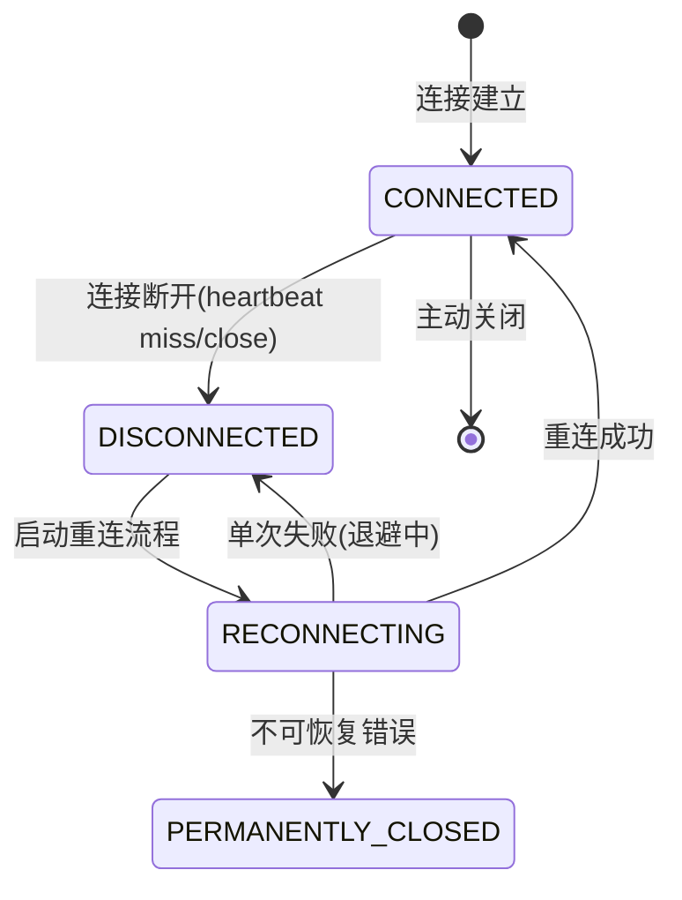
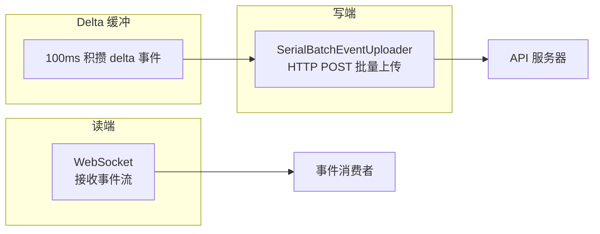

# 第 11 章：Transport 与 SDK 协议

Claude Code 的 Transport 层实现了多种跨进程/跨网络通信协议。核心挑战在于：在不稳定的网络连接下保证消息的顺序性、不丢帧、不浪费 token。WebSocket 重连、HTTP 批量上传、NDJSON 流解析——每种协议都服务于不同的场景。

---

## 11.1 WebSocketTransport 与五态重连机

`webSocketTransport.ts` 实现了 Claude Code Remote（CCR）的 WebSocket 连接。核心是 5 状态重连机：



### 五态定义

| 状态 | 行为 |
|------|------|
| `CONNECTED` | 正常通信，发送和接收消息 |
| `DISCONNECTED` | 检测到断连，准备重连 |
| `RECONNECTING` | 指数退避重连中 |
| `CONNECTED`（重连后） | 重连成功，恢复通信 |
| `PERMANENTLY_CLOSED` | 不可恢复错误，不再尝试重连 |

### 指数退避参数

```
base 延迟:    1 秒
最大延迟:    30 秒
总预算:      600 秒（10 分钟）
睡眠检测:    超过 60 秒不活跃 → 重置退避计数器
```

**睡眠检测的逻辑**——如果用户的机器休眠了 2 小时，醒来后退避计数器应该重置。否则会认为已经耗尽预算而不再重连。60 秒的不活跃阈值是经验值——正常的网络抖动不会超过 60 秒，但休眠可以任意长。

### 睡眠检测算法

```typescript
// 伪代码：睡眠检测逻辑
if (timeSinceLastActivity > SLEEP_DETECTION_THRESHOLD_MS) {
  // 用户机器可能休眠过，重置退避计数器
  backoffMs = BASE_BACKOFF_MS
} else {
  // 正常退避
  backoffMs = Math.min(backoffMs * 2, MAX_BACKOFF_MS)
}
```

### 永久关闭码

```typescript
const PERMANENT_CLOSE_CODES = [1002, 4001, 4003]
```

| 关闭码 | 含义 | 为何不可恢复 |
|--------|------|------------|
| 1002 | Protocol error | 协议级错误，重连也无法修复 |
| 4001 | Authentication failed | 认证失败，重连无济于事 |
| 4003 | Unauthorized | 授权过期，需要重新登录 |

**为何不用 WebSocket 标准码**——标准码 1000/1001/1006 用于一般的 WebSocket 生命周期。CCR 使用自定义码（4001/4003）来传达业务语义（认证/授权失败），而 1002 是标准协议码。

---

## 11.2 HybridTransport：读写分离

`hybridTransport.ts` 实现了读/写分离的传输架构：



### 为什么读写分离

读端用 WebSocket 保证低延迟——不需要轮询，事件到达时立即接收。

写端用 HTTP POST 而非 WebSocket 发送，原因有三：
1. **可靠性**——HTTP POST 有明确的 ack 语义，POST 成功 = 服务器已接收。WebSocket 不保证消息送达（没有 ack）。
2. **批量优化**——可以积攒多个事件一起发送，减少请求数。
3. **反压控制**——HTTP 请求失败时有明确的重试/退避策略，而 WebSocket 的失败处理更复杂。

### SerialBatchEventUploader：序列化保证顺序

```
Event 1 → POST batch [1]    → ack
Event 2 → POST batch [2,3]  → ack  (事件 2,3 一起发送)
Event 4 → POST batch [4]    → ack
```

即使 HTTP POST 可能返回乱序，Serializer 保证事件在应用层按发送顺序被处理。

**工作原理**：
- 发送方为每个 batch 分配序列号
- 服务器按序列号确认接收
- 如果 batch [2,3] 的 ack 先返回而 [1] 的 ack 还没到，发送方不发送 batch [4] 直到 [1] 确认

### 内容 Delta 缓冲

100ms 积攒 delta 事件，避免每个字符都发送一次 HTTP 请求。

**收益分析**——1 秒的流式响应（~10 tokens/秒）如果不积攒会产生 10 次 HTTP 请求。100ms 积攒后，10 个 delta 合并到 10 次请求，减少了 90% 的请求数。

---

## 11.3 StructuredIO SDK 协议

`structuredIO.ts` 是 Claude Code SDK 的 NDJSON（Newline-Delimited JSON）协议层。

### NDJSON 流解析

```json
{"type": "request", "id": 1, "method": "sendPrompt", "params": {"prompt": "分析代码库"}}
{"type": "response", "id": 1, "result": {"text": "..."}}
{"type": "notification", "event": "tool_use", "data": {"name": "Read", "args": {"file": "..."}}}
```

**输入关闭的安全处理**——当输入流关闭时，`read()` 生成器优雅退出。已发送但未收到应答的请求被标记为 pending，不会再发送。

### 三类请求路由

| 方法 | 用途 | 处理方式 |
|------|------|---------|
| `sendRequest` | SDK 发送工具调用等普通请求 | 标准 request/response |
| `handleElicitation` | 用户授权请求 | 特殊处理，可能需要用户交互 |
| `sendMcpMessage` | MCP 协议消息 | 直接转发到 MCP 层 |
| `handleToolCall` | 工具执行请求 | 路由到 tool execution loop |

### 工具 ID 去重

SDK 使用 FIFO 1000 项的有界缓存来去重工具调用 ID：

```typescript
class ToolIdDedupCache {
  private cache = new FifoCache(1000)
  has(id: string): boolean { return this.cache.has(id) }
  add(id: string): void { this.cache.add(id) }
}
```

1000 项是经验上限——太少会误伤（长会话中不同工具调用但巧合地 ID 相同），太多会占用内存。

**为何需要去重**——在某些边界情况下（如重传、重试），SDK 宿主可能重复发送同一工具调用。如果不检测去重，会导致重复执行。

### Outbound Stream：唯一的 stdout writer

```typescript
// outbound stream 是唯一的 stdout 写入者
const outbound = new WritableStream({
  write(chunk) { process.stdout.write(chunk) }
})
```

所有发往 SDK 宿主的消息（NDJSON 格式）必须通过 outbound，保证输出顺序。如果有其他代码路径也写 `process.stdout`，NDJSON 解析器就会收到不合法行——解析失败。

---

## 11.4 消息顺序保障机制

Transport 层不保证网络包的顺序——它通过应用层协议保障消息按发送顺序被处理。

### 序列号与确认机制

每条消息携带递增序列号。接收端通过序列号检测乱序，并按正确顺序重排。

```
收到: [3, 2, 5, 4, 1] → 重排为: [1, 2, 3, 4, 5]
```

### 超时与消息重试

当消息超时未确认时，发送端重传。接收端通过序列号去重——相同序列号的消息只处理一次。

---

## 11.5 Transport 层的可观测性

```typescript
interface TransportMetrics {
  bytesSent: number           // 发送的字节数
  bytesReceived: number       // 接收的字节数
  reconnectionAttempts: number // 重连尝试次数
  lastReconnectTimeMs: number  // 最后重连的耗时（ms）
  messageFailures: number      // 消息发送失败次数
}
```

这些指标通过 OpenTelemetry 导出，支持运行时的网络质量诊断——高重连频率意味着网络不稳定，高消息失败率意味着连接不稳定。

---

## 11.6 SSE Transport (CCR v2)

SSETransport 是 CCR v2 的新传输方式，取代了基于 WebSocket 的 v1 架构。

### SSE vs WebSocket

| 特性 | WebSocket (v1) | SSE (v2) |
|------|---------------|----------|
| 写通道 | 双向 | 单向 (HTTP POST) |
| 读通道 | 二进制/文本帧 | EventSource 流 |
| 连接类型 | 持久连接 | 长轮询/SSE 流 |
| 重连语义 | WebSocket close code | Last-Event-ID + sequence_num |

### StreamClientEvent 封装

```typescript
type StreamClientEvent = {
  event_id: string;
  sequence_num: number;
  event_type: string;
  source: string;
  payload: Record<string, unknown>;
  created_at: string;
}
```

**序列追踪**——每个帧的 `sequence_num` 是序列号。接收端通过 `seenSequenceNums` 集合去重，`lastSequenceNum` 作为高水位标记，在重连时通过 `Last-Event-ID` headers 和 `from_sequence_num` 查询参数发送给服务器。

## 11.7 WorkerStateUploader：Coalescing 写入

```typescript
// PUT /worker - 会话状态和元数据
// Coalescing rules (RFC 7396 merge):
// - 顶层 keys: last-write-wins
// - 嵌套 keys (external_metadata/internal_metadata): deep merge
```

**为何 coalescing**——多个 patch 可能在短时间内到达。coalescing 避免频繁 PUT，把多个 patch 合并为一个写入。

**失败处理**——重试期间如果收到新的 patch，吸收到当前 payload 中再重试。

---

## 11.8 CCRClient：Worker 生命周期协议

`ccrClient.ts` 在 SSETransport 之上编排了完整的 worker 协议：

### API 端点

| 方法 | 路径 | 用途 |
|------|------|------|
| PUT | `/worker` | 注册 worker，报告状态 |
| POST | `/worker/events` | 客户端事件（前端可见） |
| POST | `/worker/internal-events` | 内部事件（transcript, 压缩） |
| POST | `/worker/events/delivery` | 送达状态确认 |
| POST | `/worker/heartbeat` | 活性心跳 |
| GET | `/worker/internal-events` | 读取 transcript |
| GET | `/worker` | 读取 worker 状态 |

### 初始化序列

```typescript
// ccrClient.ts - 初始化
const workerEpoch = process.env.CLAUDE_CODE_WORKER_EPOCH
// 1. PUT /worker - 注册 worker
await putWorker({ worker_status: 'idle', worker_epoch, external_metadata })
// 2. 启动心跳（默认 20 秒）
startHeartbeat()
// 3. 并发 GET /worker - 恢复之前的状态
const prevState = await getWorker()
```

### Epoch 不匹配处理

409 Conflict 响应触发 `onEpochMismatch()`——默认是 `process.exit(1)`。新的实例自动取代旧的实例。

### 文本 delta 合并

`StreamAccumulatorState` 累积 `text_delta` 块，为每个消息 ID 发出完整快照。这使得中途重连时能看到完整的文本。

### 送达追踪

每个 `client_event` 收到后立即通过 delivery uploader 确认为 `"received"`（批量大小 64）。

### Auth 失败阈值

`MAX_CONSECUTIVE_AUTH_FAILURES = 10`。10 次连续 401/403 且有有效的 JWT 触发退出（不是过期——那条路径直接退出）。

---

## 11.9 RemoteIO：Bridge 模式的唯一 Transport

`remoteIO.ts` 是 Bridge 模式下替代 StructuredIO stdin/stdout 的传输实现。它扩展了 StructuredIO，但用 WebSocket/SSE 取代了本地 stdin/stdout：

```typescript
// cli/remoteIO.ts
class RemoteIO extends StructuredIO {
  private transport: WebSocketTransport | SSETransport;
  
  constructor(isBridge: boolean) {
    super();
    this.isBridge = isBridge;
    this.transport = createTransportFromUrl(transportUrl);
    this.transport.setOnData((data) => {
      this.inputStream.write(data);  // 数据直接流入 inputStream
    });
  }
}
```

**Inbound 路径**——远端消息通过 WebSocket/SSE 到达，transport 的 `setOnData` 回调将数据写入 `this.inputStream`（PassThrough 流）。这使得 `structuredInput` 的 `read()` generator 无需关心数据来源——本地 stdin 或远程 WebSocket 对它来说是同一个流。

**Outbound 路径**——`write()` 方法做两件事：
1. 通过 transport 发送到远端
2. 如果是 Bridge 模式，同时 echo 到 stdout

```typescript
// remoteIO.ts:231-242
async write(message: StdoutMessage): Promise<void> {
  this.transport.write(ndjsonSafeStringify(message));
  if (this.isBridge) {
    // Bridge 模式需要 stdout echo——父进程通过 stdout 检测 control_request
    if (message.type === 'control_request' || this.isDebug) {
      writeToStdout(ndjsonSafeStringify(message) + '\n');
    }
  }
}
```

**为何 Bridge 模式需要 stdout echo？**——Bridge 父进程（`sessionRunner.ts`）通过 `child.stdout` 的 readline 接口监听 NDJSON 行。`control_request` 消息（权限请求）需要被父进程捕获并转发到远端用户。如果不 echo 到 stdout，父进程无法检测到它。

### Keep-Alive 机制

```typescript
// remoteIO.ts:184-196 - 仅在 Bridge 模式
if (this.isBridge) {
  const interval = growthbook.getFeatureValue('bridge_keep_alive_interval_ms', 120_000);
  this.keepAliveTimer = setInterval(() => {
    this.transport.write(jsonStringify({ type: 'keep_alive' }));
  }, interval);
}
```

120 秒的默认心跳间隔。这是针对 Envoy 代理的空闲超时——Envoy 默认 60-180 秒 GC 空闲连接。Bridge 模式下的连接可能长时间没有用户输入（用户思考中），如果没有任何帧发送，Envoy 会关闭连接。

**`keep_alive` 的特殊处理**——远端收到 `keep_alive` 后不回复、不转发给用户——静默消耗。这避免了心跳噪音污染用户可见的消息流。

---

## 11.10 StructuredIO 的控制请求/响应模式

StructuredIO 不仅处理单向消息，还支持双向请求/响应：

```typescript
// structuredIO.ts:469-531
async sendRequest(method: string, params: unknown): Promise<unknown> {
  const requestId = crypto.randomUUID();
  const request: StdinMessage = {
    type: 'control_request',
    request_id: requestId,
    method,
    params,
  };
  
  const promise = new Promise((resolve, reject) => {
    this.pendingRequests.set(requestId, { resolve, reject });
  });
  
  this.outbound.push(request);  // enqueue to write stream
  return promise;
}
```

**Pending request 的匹配**——当远端返回 `control_response` 时，通过 `request_id` 匹配：
```typescript
case 'control_response': {
  const pending = this.pendingRequests.get(msg.request_id);
  if (pending) {
    if (msg.error) pending.reject(new Error(msg.error));
    else pending.resolve(msg.result);
    this.pendingRequests.delete(msg.request_id);
  }
}
```

### Bridge 注入的 Permission Response

```typescript
// structuredIO.ts:283-309
injectControlResponse(requestId: string, result: unknown, error?: string): void {
  const pending = this.pendingRequests.get(requestId);
  if (pending) {
    if (error) pending.reject(new Error(error));
    else pending.resolve(result);
    this.pendingRequests.delete(requestId);
  }
  // 同时发送 cancel 通知给 SDK consumer
  this.outbound.push({
    type: 'control_cancel_request',
    request_id: requestId,
  });
}
```

Bridge 通过 `injectControlResponse` 从外部注入权限响应——claude.ai 用户在网页上点击 "Allow" 后，bridge 后端调用此方法。同时发出 `control_cancel_request` 通知 SDK consumer 此请求已被处理。

---

## 11.11 消息顺序保障的深入分析

Transport 层不保证网络包按发送顺序到达——网络层的乱序（TCP retransmission、WebSocket frame reordering）可能在应用层造成乱序。

### Sequence Number 协议

每条消息携带递增序列号：
```
Send:    [seq=1] [seq=2] [seq=3] [seq=4]
Network: [seq=1] [seq=3] [seq=2] [seq=4]  ← 网络乱序
Recv:    buffer 3, emit 1, reorder 2→3, emit 4
```

**乱序检测与重排**——接收端维护一个 `seenSequenceNums` 集合和 `lastSequenceNum` 高水位标记：
```typescript
onReceive(msg: Message): void {
  if (msg.sequence_num <= this.lastSequenceNum) {
    return;  // 重复消息，丢弃
  }
  if (msg.sequence_num !== this.lastSequenceNum + 1) {
    this.buffer.push(msg);  // 乱序，缓冲
  } else {
    this.emit(msg);  // 顺序消息，立即处理
    this.lastSequenceNum = msg.sequence_num;
    this.flushBuffer();  // 尝试刷新缓冲区
  }
}
```

**超时与重传**——当消息未在超时时间内确认时发送端重传。接收端通过序列号去重——相同序列号的消息只处理一次。

### SerialBatchEventUploader 的顺序保证

HTTP POST 可能以不同于发送顺序的方式返回 ack。Serializer 保证应用层的顺序：

```
POST batch[1] → ack 延迟
POST batch[2,3] → ack 先到
→ Serializer 不处理 batch[4] 直到 batch[1] 确认
→ 这防止了应用层的乱序
```

这是**管道级**的顺序保证，而非包级别的。Serializer 维护一个已发送未确认的 batch 列表。如果 batch[1] 的 ack 在 batch[2,3] 之后到达，Serializer 正确地将所有事件按 1→2→3 的顺序提交到应用层。

---

## 11.12 SDK 事件的有界队列

```typescript
// src/utils/sdkEventQueue.ts
class SdkEventQueue {
  private queue: Array<SdkEvent> = [];
  private readonly MAX_EVENTS = 1000;
  
  push(event: SdkEvent): void {
    if (this.queue.length >= this.MAX_EVENTS) {
      this.queue.shift();  // 丢弃最老的事件
    }
    this.queue.push(event);
  }
  
  drain(): SdkEvent[] {
    const events = this.queue.splice(0);
    return events;
  }
}
```

**事件类型**：
- `task_started` — 任务开始
- `task_progress` — 任务进度更新
- `task_notification` — 任务通知
- `session_state_changed` — 会话状态变更

**为什么有界队列？**——如果 headless session 产生大量事件（如工具调用频率极高），无限增的队列会占用过多内存。1000 个事件是一个经验上限——在正常的 session 中，1000 个事件足以覆盖几秒钟的活动。在极端情况下，丢弃最老的事件是合理的（它们可能已经被消费了）。

**`drain()` 的原子性**——`splice(0)` 返回并清空数组。这使得消费者可以批量处理事件，而不需要一个个 pop。

---

## 11.13 WebSocketTransport：帧格式与重连细节

**帧格式**——每条消息序列化为 `jsonStringify(message) + "\n"`。keep-alive 帧是预分配的常量 `{"type":"keep_alive"}\n`，避免每次分配的 GC 压力。

**Dual-runtime WebSocket 支持**：

| 运行时 | 实现 | API |
|--------|------|-----|
| Bun | `globalThis.WebSocket` | `addEventListener`/`removeEventListener` |
| Node.js | `ws` 包 | `.on()`/`.off()` |

`isBunWs` 标志门控监听器管理方式。

**Bun WebSocket 的重连劣势**——Bun 的 WebSocket 不暴露升级响应头。Node WS 可以从 `upgradeReq.headers` 中读取 `X-Last-Request-Id` 避免重播已确认的消息。Bun 总是重播所有缓冲消息，依赖服务器 UUID 去重。

**CircularBuffer 消息缓冲**（`CircularBuffer.ts`）——固定大小的环缓冲区。`add()` 覆盖头部位置，淘汰最旧的。`toArray()` 按从旧到新的顺序返回。WebSocketTransport 使用容量 1000。

---

## 11.14 SerialBatchEventUploader：批量与反压

**批量形成**（`takeBatch`, lines 213-233）：
- 同时尊重 `maxBatchSize`（数量限制）和 `maxBatchBytes`（字节限制）
- 第一个项目总是入批（无论大小）
- 不可序列化的项目（BigInt、循环引用）当场通过 `splice(count, 1)` 丢弃——将它们留在 `pending[0]` 会毒化队列，`flush()` 永远挂起

**反压机制**——当 `pending.length + items.length > maxQueueSize` 时：
1. `enqueue()` 阻塞（await）
2. 将 resolve 函数推入 `backpressureResolvers` 数组
3. 成功发送后 `releaseBackpressure()` 批量释放所有等待者

这是主要的反压机制——当 POST 慢或失败时，enqueue 者等待，暂停上游工作产生。

**指数退避重试**（`SerialBatchEventUploader.ts:156-202`）：
- 失败后 batch 重新排在 pending 队列前面（`batch.concat(this.pending)`，比 `unshift(...batch)` 更高效）
- 失败计数器达到 `maxConsecutiveFailures` 时，batch 被丢弃
- 指数退避 + 抖动（jitter）防止 thundering herd

**RetryableError**——携带可选的 `retryAfterMs`。设置时使用服务器提示的延迟（钳位到 `[baseDelayMs, maxDelayMs]` + 抖动），而非指数退避。这允许服务器显式限流客户端。

---

## 11.15 HybridTransport：读写分离的实现细节

```mermaid
flowchart LR
    write_stream[write(stream_event)] --> buf[100ms buffer]
    write_other[write(other)] --> up[SerialBatchEventUploader]
    buf --> up
    up --> post[postOnce() HTTP POST]
```

**100ms 批量窗口**（`HybridTransport.ts:12`）——`BATCH_FLUSH_INTERVAL_MS = 100`。流事件在 `streamEventBuffer` 中积累 100ms 后才入队。非流事件立即 flush 缓冲区的事件（保持排序），然后入队自身。

**为何串行化**——Bridge 调用方使用 `void transport.write()`（fire-and-forget）。没有序列化，并发 POST 可能导致并发写入同一文档，导致碰撞、重试风暴。

**`postOnce()`**——单次尝试 POST。2xx = 成功。4xx (除 429) = 永久丢弃。429/5xx = 抛出 `RetryableError`，uploader 重新排队并退避。每次尝试的超时为 15s。

**优雅关闭**——`close()` 将 `uploader.flush()` 与 `CLOSE_GRACE_MS = 3000` 竞争。无论谁赢，uploader 之后都会关闭。

---

## 11.16 NDJSON 协议的安全处理

**`ndjsonSafeStringify.ts:16-22`**——转义 `U+2028` 和 `U+2029`（JavaScript 行终止符）为 `\u2028` 和 `\u2029`。没有这个，`JSON.stringify` 会原始输出这些字符（ECMA-404 有效），但按行终止符分割的任何接收方会在字符串中间切断 JSON，静默丢失消息。

**输入关闭的安全处理**——当输入流关闭时，`read()` 生成器优雅退出。已发送但未收到应答的请求被标记为 pending，不会再发送。

**`update_environment_variables` 的特殊处理**——直接设置 `process.env[key] = value`。这是 Bridge 认证刷新的通道。

---

## 11.17 StructuredIO 的控制请求/响应深度分析

**Pending request 的生命周期**：
```
sendRequest()
  → 创建 UUID 作为 requestId
  → 将 Promise 放入 pendingRequests Map
  → 将 {type: 'control_request', request_id, ...} 推入 outbound 队列
  → 返回 Promise（调用方 await）

收到 control_response
  → 按 request_id 查找 pendingRequests
  → 如果没有匹配，检查 resolvedToolUseIds 检测重复
  → resolve/reject Promise
  → 从 Map 中删除条目
```

**ResolvedToolUseId 去重**——追踪最多 `MAX_RESOLVED_TOOL_USE_IDS = 1000` 个 tool_use ID。通过 `Set` 插入顺序迭代 FIFO 淘汰。防止 WebSocket 重连时重复 processing 相同 control_response（会导致重复 assistant 消息，API 400 错误）。

---

## 11.18 CCR Transport 选择逻辑

**`transportUtils.ts:16-45`** 基于环境变量选择 transport：

| 条件 | 选择 |
|------|------|
| `CLAUDE_CODE_USE_CCR_V2` | SSETransport |
| `CLAUDE_CODE_POST_FOR_SESSION_INGRESS_V2` | HybridTransport |
| 默认 | WebSocketTransport |

**SSE URL 推导**（`transportUtils.ts:26-33`）——从 session URL 推导 `/worker/events/stream`，将 `wss://` 转换为 `https://`。

---

## 11.19 CapacityWake：桥接轮询的睡眠控制器

**`capacityWake.ts:28-56`**——双信号合并器。当"满容量"时睡眠，但以下情况会提前唤醒：
1. 外部循环的 AbortSignal 触发（关闭）
2. capacity-wake 控制器的 `wake()` 被调用（有工作可用）

`wake()` 中止当前控制器并创建新的控制器。确保轮询循环立即重新检查新工作。

---

## 11.20 Env-less Remote Bridge (v2)

**`remoteBridgeCore.ts:13-29`**——完全跳过 Environments API 层。直接的 OAuth → /bridge → worker JWT 交换。服务器 PR #293280 使此成为可能。

`initEnvLessBridgeCore()` 大小约 1009 行，是 env-based `initBridgeCore` (~2400 行) 的 1/10。

**JWT 刷新调度器**（`remoteBridgeCore.ts:317-376`）——过期前 5 分钟触发。每次刷新重新调用 /bridge（递增 epoch），然后用新凭据重建 v2 transport，同时保留 SSE 序列号位置。

**`rebuildTransport()`**——关闭旧 transport，创建新 transport 携带 `initialSequenceNum`，重新连接回调，为排队的写入重建 FlushGate。

---

## 11.21 SSETransport 帧解析

**`SSETransport.ts:58-116`**——`parseSSEFrames()` 增量解析器：
1. 按 `\n\n` 分割
2. 处理 SSE 注释行（`:keepalive`）
3. 拼接多个 `data:` 字段
4. 返回帧 + 剩余缓冲区

**活性检测**——`LIVENESS_TIMEOUT_MS = 45000` (45s)。服务器每 15s 发送 keepalive；3 倍余量。

**序列号追踪**——`lastSequenceNum`（高水位标记）+ `seenSequenceNums`（Set 用于去重）。超过 1000 个条目时，移除低于 `lastSequenceNum - 200` 的条目，防止内存泄漏。

---

## 11.22 FlushGate：历史 flush 期间的写入门控

**`flushGate.ts:1-6`**——状态机：`start() → end() → drop() → deactivate()`。

在历史 flush（POST）期间，新写入被排队。flush 完成后，排队项目按顺序排水。

| 方法 | 行为 |
|------|------|
| `drop()` | 丢弃 pending（永久 transport 关闭） |
| `deactivate()` | 清除激活标志但不丢弃（transport 替换） |

---
---

## 11.23 WS Transport 双运行时

`WebSocketTransport.ts`（800 行）支持 Bun 和 Node 双运行时：
- 当 `typeof Bun !== 'undefined'` 时使用 Bun 原生 `WebSocket`
- 否则回退到 `ws` npm 包
- `removeWsListeners()` 在每次断连时显式移除监听器——防止网络不稳定期间的闭包泄漏

**消息缓冲与重放**——`CircularBuffer<StdoutMessage>`（容量 1000）存储带 UUID 的已发消息。重连时，服务器在升级响应中发送 `X-Last-Request-Id` 头。客户端调用 `replayBufferedMessages(serverLastId)`：
- 通过 `findIndex()` 找到最后确认消息的索引
- 驱逐所有已确认消息
- 仅重放未确认的消息

**连接健康监控**：
| 参数 | 值 | 用途 |
|------|----|------|
| Ping 间隔 | 10 秒 | 连接死检测 |
| Keep-alive 帧 | 300 秒 | 代理超时检测 |
| 睡眠检测 | 60 秒 | 笔记本合盖/SIGSTOP |
| 活动追踪 | 每条入站/出站消息 | 诊断代理空闲超时 |

**重连算法**：
- 基础延迟 1000ms，最大 30000ms
- 总预算 600000ms（10 分钟）
- 抖动 +/- 25%
- 永久关闭码：`1002`（协议错误）、`4001`（会话过期）、`4003`（未授权）
- 例外：4003 在 `refreshHeaders()` 返回新 token 时重试

---

## 11.24 流事件延迟缓冲

`HybridTransport` 中的流事件延迟缓冲：
- 流事件（内容增量）在 `streamEventBuffer` 中累积最多 100ms
- `setTimeout` 触发 `flushStreamEvents()`
- 非流写入先 flush 缓冲的流事件（保持消息排序）再入队自身
- `BATCH_FLUSH_INTERVAL_MS = 100`
- `POST_TIMEOUT_MS = 15000`——每次 POST 尝试的超时

---

## 11.25 NDJSON 安全加固

`ndjsonSafeStringify.ts`（33 行）修复关键漏洞：

**漏洞**——`JSON.stringify` 将 U+2028（行分隔符）和 U+2029（段落分隔符）作为原始字节输出。这些在 ECMA-404 JSON 中有效，但在 ECMA-262 Section 11.3 中也是行终止符。任何按行终止符分割 NDJSON 流的接收者会在字符串中间切断，导致截断片段丢失。

**修复**——单个正则交替：`/\u2028|\u2029/g`——每次匹配的回调比两次全字符串扫描更便宜。`\uXXXX` 形式是等效的 JSON（解析为相同字符串）但永远不会被误认为行终止符。

---

## 11.26 StructuredIO：NDJSON 解析器 + 控制协议

`structuredIO.ts`（860 行）：

**NDJSON 输入解析**——`read()` 异步生成器在 `\n` 边界分割输入：
1. 跳过空行
2. 解析 JSON
3. 过滤已知消息类型
4. 处理特殊类型（`keep_alive`、`update_environment_variables`、`control_response`）
5. 解析错误时退出码 1

**控制请求/响应路由**——`PendingRequest<T>` 存储在 `Map<requestId, PendingRequest>`：
- `sendRequest()` 入队到 `this.outbound`（`Stream<StdoutMessage>`）防止 control_request 超过已排队的 stream_events
- 基于信号的 abort 处理
- Abort 时：入队 `control_cancel_request`、立即拒绝 outstanding Promise

**已解决 Tool Use ID 追踪**——`Set<string>` 追踪，驱逐上限 1000。Set 按插入顺序迭代，淘汰最旧条目。防止 WebSocket 重连的重复 `control_response` 重新处理。

**SDK 权限流竞态**——`createCanUseTool()` 并行竞态：
```
hookPromise  = executePermissionRequestHooksForSDK()
sdkPromise   = sendRequest(...)
winner = Promise.race([hookPromise, sdkPromise])
```
如果 hook 赢：abort SDK 请求，返回 hook 决定。如果 SDK 赢：返回 SDK 决定（hook 仍在后台运行但结果被忽略）。

---

## 11.27 FlushGate：历史回放消息门控

`flushGate.ts`（72 行）——在初始历史 flush 期间门控消息写入的简单状态机：

- `start()`——激活门控，`enqueue()` 返回 true 并入队
- `end()`——停用并返回排队的条目用于排出
- `drop()`——丢弃排队条目（永久传输关闭）
- `deactivate()`——清除激活标志不丢弃（用于传输替换，新传输将排出待定条目）

---

## 11.28 Session Ingress 认证

`sessionIngressAuth.ts`（141 行）——认证 token 检索优先级：
1. **环境变量**（`CLAUDE_CODE_SESSION_ACCESS_TOKEN`）——spawn 时设置，通过 `update_environment_variables` stdin 消息进程内更新
2. **文件描述符**（遗留路径）——`CLAUDE_CODE_WEBSOCKET_AUTH_FILE_DESCRIPTOR`，读取一次并缓存。macOS/BSD 使用 `/dev/fd/N`，Linux 使用 `/proc/self/fd/N`
3. **Well-known 文件**——`CLAUDE_SESSION_INGRESS_TOKEN_FILE` 环境变量路径或 `/home/claude/.claude/remote/.session_ingress_token`

**认证头选择**：
- Session 密钥（`sk-ant-sid` 前缀）：基于 Cookie 认证，带 `X-Organization-Uuid` 头
- JWT：Authorization 头中的 Bearer token

---

## 11.29 Remote Session Manager 协议

`RemoteSessionManager.ts`（344 行）：
1. WebSocket 连接到 `wss://api/.../v1/sessions/ws/{sessionId}/subscribe`
2. 升级期间通过 HTTP 头认证（无需连接后认证消息）
3. 通过 SSE/WebSocket 接收 SDKMessage 流

**关闭码处理**：
| 关闭码 | 行为 |
|--------|------|
| `4003`（未授权） | 永久，不重连 |
| `4001`（会话未找到） | 压缩期间瞬态，最多 3 次重试，线性回退 |
| 其他 | 固定 2000ms 延迟，最多 5 次重连 |

Ping 间隔 30 秒。权限流通过 `Map<requestId, SDKControlPermissionRequest>` 追踪。

---

## 11.30 ReplBridge 传输抽象

`replBridgeTransport.ts`（371 行）——`ReplBridgeTransport` 接口在 v1（HybridTransport）和 v2（SSETransport + CCRClient）读写路径上抽象：

**v1**——`createV1ReplTransport(hybrid)`——薄包装，`reportState/Metadata/Delivery` 是 no-op，`flush()` 立即解析。

**v2**——`createV2ReplTransport(opts)`——完整实现：
- 认证：v2 端点验证 JWT 的 `session_id` 和 `worker_role` 声明（非 OAuth）
- 新 CC 实例取代：传输关闭，合成关闭码 4090
- 初始化失败：合成关闭码 4091
- 活跃性超时耗尽：合成关闭码 4092
- 覆盖 CCRClient 构造函数级 `setOnEvent` 布线，同时 ACK `received` **和** `processed` 传递状态（修复守护进程重启时的幽灵提示重排队）

---

## 11.31 RemoteIO：双向 SDK 模式

`remoteIO.ts`（256 行）——SDK/远程会话入口点：
1. 通过 `getTransportForUrl()` 创建适当传输
2. 设置 `refreshHeaders` 用于动态 session token 更新
3. 连接 `transport.setOnData()` 路由入站数据到 NDJSON 解析器
4. 连接 CCR v2 客户端：
   - `setInternalEventWriter`——转录消息为 CCR v2 内部事件
   - `setInternalEventReader`——用于会话恢复
   - `setCommandLifecycleListener`——传递状态追踪
5. Keep-alive 定时器来自 GrowthBook 配置（`tengu_bridge_poll_interval_config`，默认 120s）——仅桥接模式用于防止 Envoy 空闲超时

---
