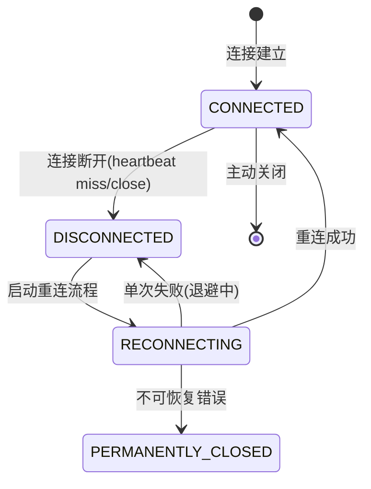
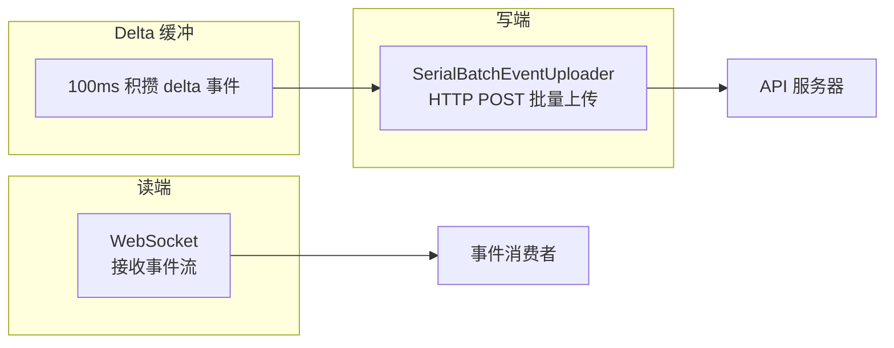

# 第 11 章：Transport 与 SDK 协议

Claude Code 的 Transport 层实现了多种跨进程/跨网络通信协议。核心挑战在于：在不稳定的网络连接下保证消息的顺序性、不丢帧、不浪费 token。WebSocket 重连、HTTP 批量上传、NDJSON 流解析——每种协议都服务于不同的场景。

---

## 11.1 WebSocketTransport 与五态重连机

`webSocketTransport.ts` 实现了 Claude Code Remote（CCR）的 WebSocket 连接。核心是 5 状态重连机：



### 五态定义

| 状态 | 行为 |
|------|------|
| `CONNECTED` | 正常通信，发送和接收消息 |
| `DISCONNECTED` | 检测到断连，准备重连 |
| `RECONNECTING` | 指数退避重连中 |
| `CONNECTED`（重连后） | 重连成功，恢复通信 |
| `PERMANENTLY_CLOSED` | 不可恢复错误，不再尝试重连 |

### 指数退避参数

```
base 延迟:    1 秒
最大延迟:    30 秒
总预算:      600 秒（10 分钟）
睡眠检测:    超过 60 秒不活跃 → 重置退避计数器
```

**睡眠检测的逻辑**——如果用户的机器休眠了 2 小时，醒来后退避计数器应该重置。否则会认为已经耗尽预算而不再重连。60 秒的不活跃阈值是经验值——正常的网络抖动不会超过 60 秒，但休眠可以任意长。

### 睡眠检测算法

```typescript
// 伪代码：睡眠检测逻辑
if (timeSinceLastActivity > SLEEP_DETECTION_THRESHOLD_MS) {
  // 用户机器可能休眠过，重置退避计数器
  backoffMs = BASE_BACKOFF_MS
} else {
  // 正常退避
  backoffMs = Math.min(backoffMs * 2, MAX_BACKOFF_MS)
}
```

### 永久关闭码

```typescript
const PERMANENT_CLOSE_CODES = [1002, 4001, 4003]
```

| 关闭码 | 含义 | 为何不可恢复 |
|--------|------|------------|
| 1002 | Protocol error | 协议级错误，重连也无法修复 |
| 4001 | Authentication failed | 认证失败，重连无济于事 |
| 4003 | Unauthorized | 授权过期，需要重新登录 |

**为何不用 WebSocket 标准码**——标准码 1000/1001/1006 用于一般的 WebSocket 生命周期。CCR 使用自定义码（4001/4003）来传达业务语义（认证/授权失败），而 1002 是标准协议码。

---

## 11.2 HybridTransport：读写分离

`hybridTransport.ts` 实现了读/写分离的传输架构：



### 为什么读写分离

读端用 WebSocket 保证低延迟——不需要轮询，事件到达时立即接收。

写端用 HTTP POST 而非 WebSocket 发送，原因有三：
1. **可靠性**——HTTP POST 有明确的 ack 语义，POST 成功 = 服务器已接收。WebSocket 不保证消息送达（没有 ack）。
2. **批量优化**——可以积攒多个事件一起发送，减少请求数。
3. **反压控制**——HTTP 请求失败时有明确的重试/退避策略，而 WebSocket 的失败处理更复杂。

### SerialBatchEventUploader：序列化保证顺序

```
Event 1 → POST batch [1]    → ack
Event 2 → POST batch [2,3]  → ack  (事件 2,3 一起发送)
Event 4 → POST batch [4]    → ack
```

即使 HTTP POST 可能返回乱序，Serializer 保证事件在应用层按发送顺序被处理。

**工作原理**：
- 发送方为每个 batch 分配序列号
- 服务器按序列号确认接收
- 如果 batch [2,3] 的 ack 先返回而 [1] 的 ack 还没到，发送方不发送 batch [4] 直到 [1] 确认

### 内容 Delta 缓冲

100ms 积攒 delta 事件，避免每个字符都发送一次 HTTP 请求。

**收益分析**——1 秒的流式响应（~10 tokens/秒）如果不积攒会产生 10 次 HTTP 请求。100ms 积攒后，10 个 delta 合并到 10 次请求，减少了 90% 的请求数。

---

## 11.3 StructuredIO SDK 协议

`structuredIO.ts` 是 Claude Code SDK 的 NDJSON（Newline-Delimited JSON）协议层。

### NDJSON 流解析

```json
{"type": "request", "id": 1, "method": "sendPrompt", "params": {"prompt": "分析代码库"}}
{"type": "response", "id": 1, "result": {"text": "..."}}
{"type": "notification", "event": "tool_use", "data": {"name": "Read", "args": {"file": "..."}}}
```

**输入关闭的安全处理**——当输入流关闭时，`read()` 生成器优雅退出。已发送但未收到应答的请求被标记为 pending，不会再发送。

### 三类请求路由

| 方法 | 用途 | 处理方式 |
|------|------|---------|
| `sendRequest` | SDK 发送工具调用等普通请求 | 标准 request/response |
| `handleElicitation` | 用户授权请求 | 特殊处理，可能需要用户交互 |
| `sendMcpMessage` | MCP 协议消息 | 直接转发到 MCP 层 |
| `handleToolCall` | 工具执行请求 | 路由到 tool execution loop |

### 工具 ID 去重

SDK 使用 FIFO 1000 项的有界缓存来去重工具调用 ID：

```typescript
class ToolIdDedupCache {
  private cache = new FifoCache(1000)
  has(id: string): boolean { return this.cache.has(id) }
  add(id: string): void { this.cache.add(id) }
}
```

1000 项是经验上限——太少会误伤（长会话中不同工具调用但巧合地 ID 相同），太多会占用内存。

**为何需要去重**——在某些边界情况下（如重传、重试），SDK 宿主可能重复发送同一工具调用。如果不检测去重，会导致重复执行。

### Outbound Stream：唯一的 stdout writer

```typescript
// outbound stream 是唯一的 stdout 写入者
const outbound = new WritableStream({
  write(chunk) { process.stdout.write(chunk) }
})
```

所有发往 SDK 宿主的消息（NDJSON 格式）必须通过 outbound，保证输出顺序。如果有其他代码路径也写 `process.stdout`，NDJSON 解析器就会收到不合法行——解析失败。

---

## 11.4 消息顺序保障机制

Transport 层不保证网络包的顺序——它通过应用层协议保障消息按发送顺序被处理。

### 序列号与确认机制

每条消息携带递增序列号。接收端通过序列号检测乱序，并按正确顺序重排。

```
收到: [3, 2, 5, 4, 1] → 重排为: [1, 2, 3, 4, 5]
```

### 超时与消息重试

当消息超时未确认时，发送端重传。接收端通过序列号去重——相同序列号的消息只处理一次。

---

## 11.5 Transport 层的可观测性

```typescript
interface TransportMetrics {
  bytesSent: number           // 发送的字节数
  bytesReceived: number       // 接收的字节数
  reconnectionAttempts: number // 重连尝试次数
  lastReconnectTimeMs: number  // 最后重连的耗时（ms）
  messageFailures: number      // 消息发送失败次数
}
```

这些指标通过 OpenTelemetry 导出，支持运行时的网络质量诊断——高重连频率意味着网络不稳定，高消息失败率意味着连接不稳定。

---

## 11.6 SSE Transport (CCR v2)

SSETransport 是 CCR v2 的新传输方式，取代了基于 WebSocket 的 v1 架构。

### SSE vs WebSocket

| 特性 | WebSocket (v1) | SSE (v2) |
|------|---------------|----------|
| 写通道 | 双向 | 单向 (HTTP POST) |
| 读通道 | 二进制/文本帧 | EventSource 流 |
| 连接类型 | 持久连接 | 长轮询/SSE 流 |
| 重连语义 | WebSocket close code | Last-Event-ID + sequence_num |

### StreamClientEvent 封装

```typescript
type StreamClientEvent = {
  event_id: string;
  sequence_num: number;
  event_type: string;
  source: string;
  payload: Record<string, unknown>;
  created_at: string;
}
```

**序列追踪**——每个帧的 `sequence_num` 是序列号。接收端通过 `seenSequenceNums` 集合去重，`lastSequenceNum` 作为高水位标记，在重连时通过 `Last-Event-ID` headers 和 `from_sequence_num` 查询参数发送给服务器。

## 11.7 WorkerStateUploader：Coalescing 写入

```typescript
// PUT /worker - 会话状态和元数据
// Coalescing rules (RFC 7396 merge):
// - 顶层 keys: last-write-wins
// - 嵌套 keys (external_metadata/internal_metadata): deep merge
```

**为何 coalescing**——多个 patch 可能在短时间内到达。coalescing 避免频繁 PUT，把多个 patch 合并为一个写入。

**失败处理**——重试期间如果收到新的 patch，吸收到当前 payload 中再重试。
