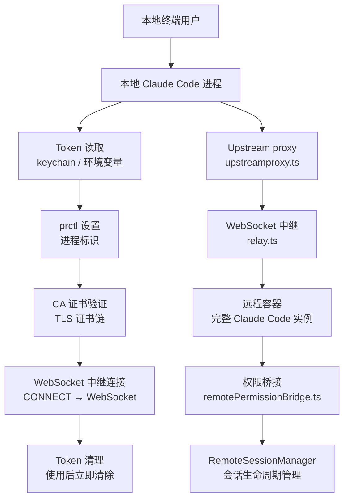
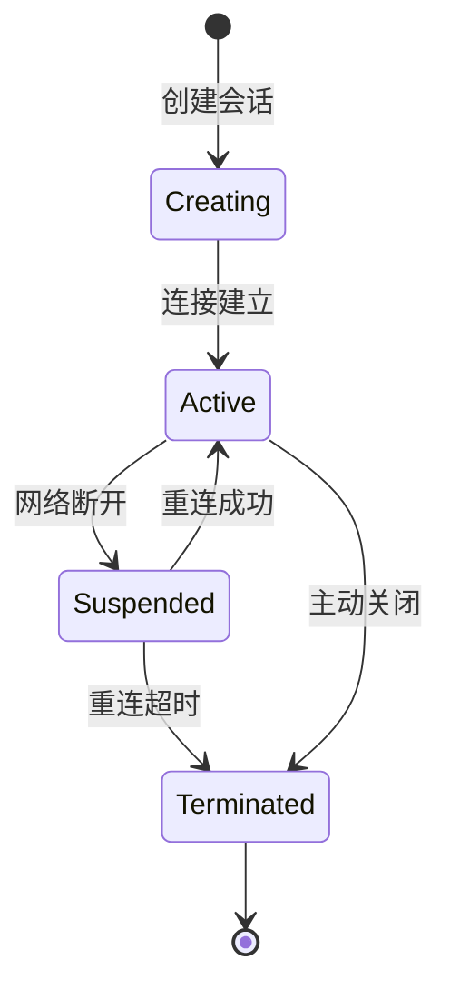

# 第 12 章：远程会话与 CCR

Claude Code Remote（CCR）允许用户在远程容器中运行 Claude Code，通过本地终端控制。它不是"SSH 到一台机器然后运行 CLI"——而是 5 步初始化链、Proto 帧封装、权限本地桥接、Token 即用的完整安全模型。

---

## 12.1 CCR 架构总览



### 5 步初始化链

| 步骤 | 目的 | 实现 |
|------|------|------|
| 1. Token 读取 | 获取认证凭据 | keychain 优先，环境变量降级 |
| 2. prctl 设置 | 标记进程身份 | Linux prctl，标识 CCR worker |
| 3. CA 证书验证 | 确保 TLS 安全 | 验证证书链，防止中间人 |
| 4. WebSocket 中继 | 建立连接通道 | CONNECT 方法升级到 WebSocket |
| 5. Token 清理 | 使用后立即清除 | 防止 token 残留在内存 |

**Token 即用的安全意义**——Token 在连接建立后立即从内存中清除。即使进程被 dump，也无法提取已使用的 token。这是"零残留凭证"的设计原则。

### prctl：进程身份标记

CCR 容器中的进程通过 Linux `prctl` 系统调用标记自己的身份。这使得远程基础设施能够识别进程类型（CCR worker vs 普通进程），并应用不同的策略（资源限制、审计日志、网络隔离）。

---

## 12.2 Proto 帧封装

CCR 使用自定义的 Proto 帧封装消息，而非直接传输 JSON：

```typescript
interface ProtoFrame {
  type: FrameType       // 消息类型标识
  payload: Uint8Array   // NDJSON 序列化后的消息体
  chunkSize: number     // 最大块限制
}
```

**为什么用帧封装**——WebSocket 传输需要保证消息的完整性（单条消息不被拆分为多个帧）和边界识别（接收方知道消息何时结束）。NDJSON 按行分割提供了边界，帧封装在此基础上增加了类型标识和大小控制。

### 最大块限制

最大块限制（通常 1MB）防止单个消息过大导致 WebSocket 帧被拒绝。当消息超过阈值时，发送方将其拆分为多个帧，接收方按序列号重组：

```
Large message (>1MB) → [Frame 1: type=chunk, seq=0] [Frame 2: type=chunk, seq=1] ...
Receiver → accumulate chunks by seq → reassemble complete message
```

### CONNECT → WebSocket 中继

```typescript
// relay.ts - WebSocket 中继实现
async function connectViaRelay(host: string, port: number, token: string) {
  // 1. 建立 TCP 连接到代理
  const socket = net.connect(port, host)
  // 2. 发送 CONNECT 请求升级到 WebSocket
  socket.write(`CONNECT /websocket HTTP/1.1\r\n`)
  socket.write(`Host: ${host}\r\n`)
  socket.write(`Authorization: Bearer ${token}\r\n`)
  socket.write(`\r\n`)
  // 3. 等待 HTTP 101 Switching Protocols
  // 4. 升级为 WebSocket 帧传输
}
```

CONNECT 方法允许通过 HTTP 代理建立隧道。代理不解析 WebSocket 帧内容——它只是透传字节流。

---

## 12.3 远程权限桥接

权限始终在**本地终端**决定——远程容器没有权限判断逻辑：

```
本地终端 [权限决定: 允许/拒绝]
    ↓ WebSocket (Proto 帧)
远程容器 [执行/跳过操作]
```

### Permission Bridge 实现

```typescript
// remotePermissionBridge.ts（简化）
class RemotePermissionBridge {
  async decide(callId: string, approved: boolean) {
    const decision = approved ? 'approved' : 'denied'
    await this.sendToRemote({ type: 'permission_response', callId, decision })
  }

  onPermissionRequest(request: PermissionRequest) {
    localCanUseTool(request).then(decision => this.decide(request.callId, decision))
  }
}
```

远程容器不知道用户是否允许这个操作——它只执行本地桥接层传过来的决定。这是安全设计：即使远程容器被提权，也无法绕过本地权限审批。

### 本地交互的唯一性

CCR 远程容器不支持用户交互——没有 TTY，没有 `AskUserQuestion` 工具。所有用户交互（权限确认、问题回答）都通过网络发送回本地终端，由本地终端处理后再将决定发回远程容器。

---

## 12.4 RemoteSessionManager

`RemoteSessionManager` 是 CCR 的核心会话管理器——它负责创建和维护远程会话的生命周期：

```typescript
class RemoteSessionManager {
  private sessions: Map<string, RemoteSession>

  async createSession(config: SessionConfig): Promise<string> {
    const sessionId = crypto.randomUUID()
    const session = new RemoteSession(sessionId, config)
    this.sessions.set(sessionId, session)
    return sessionId
  }

  async destroySession(sessionId: string) {
    const session = this.sessions.get(sessionId)
    if (session) {
      await session.cleanup()  // 远程资源清理
      this.sessions.delete(sessionId)
    }
  }
}
```

### 会话状态机



**Suspended 状态的意义**——网络断开不等于会话终止。CCR 支持从短暂的连接丢失中恢复。只有当重连超时（如 5 分钟内未能恢复），会话才进入 `Terminated`。

---

## 12.5 Upstream Proxy

`upstreamproxy/` 目录实现上游代理逻辑：

- `upstreamproxy.ts` — 代理配置和 TLS 终止
- `relay.ts` — WebSocket 中继和帧转发

Upstream proxy 的核心职责是将本地 CCR 请求安全地路由到 Anthropic 的 API 基础设施，同时支持企业代理的中间人检测（mTLS）和审计日志。

### TLS 终止与证书链

Upstream proxy 负责验证上游 TLS 证书链。这是防止中间人攻击的关键——如果不验证，任何能拦截流量的代理都可以伪造响应。

---

## 12.6 CCR 中的环境变量预处理

CCR 环境有特殊的环境变量处理——堆大小调整、远程识别标记：

```typescript
if (process.env.CLAUDE_CODE_REMOTE === 'true') {
  const existing = process.env.NODE_OPTIONS || ''
  process.env.NODE_OPTIONS = existing
    ? `${existing} --max-old-space-size=8192`
    : '--max-old-space-size=8192'
}
```

CCR 容器通常有 16GB 内存。Node.js 的默认堆上限约为 4GB，设置为 8GB 确保 V8 有足够的内存处理大上下文窗口。

---

## 12.7 与本地 CCR 的交互模式

CCR 支持两种交互范式：

### 本地 CLI 作为控制面

本地终端通过 `claude remote` 命令连接到远程实例。用户看到完整的 TUI 体验（spinner、消息流、工具输出），但实际上所有的 API 调用、工具执行都在远程容器中。

### SDK 作为控制面

通过 StructuredIO 协议（NDJSON-based），SDK 宿主可以在非终端环境中控制远程 Claude Code。输入和输出都通过结构化 JSON，没有终端渲染。

---

## 12.8 CCR v2：从 WebSocket 到 SSE 的迁移

CCR v2 使用 SSE (Server-Sent Events) 替代 WebSocket 作为主要传输协议。

### 迁移驱动力

| 方面 | v1 (WebSocket) | v2 (SSE) |
|------|---------------|----------|
| 重连 | 手动状态机 | SSE 原生 Last-Event-ID |
| 防火墙 | WebSocket 可能被拦截 | SSE 是标准 HTTP |
| 序列追踪 | 应用层手动实现 | sequence_num 内置 |
| 写通道 | WebSocket 双向 | HTTP POST 批量上传 |

### StreamAccumulatorState

SSE 传输中的 `StreamAccumulatorState` 积累 `text_delta` 事件，为每个消息 ID 发出完整的快照——即使中途重连，也能看到完整的文本状态。

```typescript
// text_delta 累积（每收到一个 delta 更新 accumulated text）
accumulator[messageId] += delta.text
// 发送 "complete-so-far" 快照
emitFullTextSnapshot(messageId)
```

这避免了 v1 中需要重新组装整个消息的问题——v2 直接提供当前的完整快照。

---

## 12.9 Epoch 机制与 Worker 生命周期

CCR v2 使用 `worker_epoch` 作为生成计数器：

```typescript
const workerEpoch = process.env.CLAUDE_CODE_WORKER_EPOCH
```

**Epoch 碰撞**——如果新实例 PUT `/worker` 返回 409 Conflict，意味着已存在更新的实例。默认行为是 `process.exit(1)`——旧的实例自动退出。

这是无缝迁移机制：新实例自动取代旧实例，不需要手动协调。

**Heartbeat**——默认 20 秒心跳。如果 heartbeat 超时，服务器标记 worker 为不活跃。

---

## 12.10 SDK 消息适配

`src/remote/sdkMessageAdapter.ts` 将 SDK 类型映射到 REPL 类型：

| SDK 类型 | REPL 映射 |
|----------|-----------|
| `assistant` | AssistantMessage |
| `stream_event` | StreamEvent（content_block_delta） |
| `result` | SystemMessage (信息) |
| `system (init)` | SystemMessage (initialized) |
| `system (status)` | SystemMessage |
| `system (compact_boundary)` | SystemMessage |
| `tool_progress` | SystemMessage |
| `user` | UserMessage |
| `auth_status` | 忽略（单独处理） |
| `tool_use_summary` | 忽略 |
| `rate_limit_event` | 忽略 |

### 控制协议

同一线路传输控制消息：
- `control_request` → `can_use_tool`（权限提示），`interrupt`（中断）
- `control_response` → 权限提示的 `success`/`error` 响应
- `control_cancel_request` → 服务器取消挂起的权限请求

### SDK 事件队列

`src/utils/sdkEventQueue.ts`：有界队列（最大 1000 个事件）用于 headless/streaming 模式。事件类型：`task_started`、`task_progress`、`task_notification`、`session_state_changed`。

---

## 12.11 Session Spawner：子进程生命周期

`sessionRunner.ts` 是 CCR 中负责 spawn 和管理子 Claude Code 进程的核心组件。

### 子进程启动参数

```typescript
// sessionRunner.ts:287-340
const child = spawn(execPath, [
  '--print',                    // 非交互模式
  '--sdk-url', sdkUrl,          // WebSocket/SSE 连接地址
  '--session-id', sessionId,    // 会话身份
  '--input-format', 'stream-json',   // NDJSON 输入
  '--output-format', 'stream-json',  // NDJSON 输出
  '--replay-user-messages',     // 回显用户消息
], {
  stdio: ['pipe', 'pipe', 'pipe'],  // 三个 pipe
});
```

**环境变量注入**：
```typescript
env: {
  ...process.env,
  CLAUDE_CODE_ENVIRONMENT_KIND: 'bridge',
  CLAUDE_CODE_SESSION_ACCESS_TOKEN: jwtToken,
  CLAUDE_CODE_FORCE_SANDBOX: sandbox ? '1' : undefined,
  CLAUDE_CODE_USE_CCR_V2: '1',           // v2 传输
  CLAUDE_CODE_WORKER_EPOCH: epoch,       // worker 代计数器
}
```

### Stdout 解析：Readline + NDJSON

```typescript
// sessionRunner.ts:369-446
const rl = readline.createInterface({ input: child.stdout });
for await (const line of rl) {
  // Parse NDJSON line
  const event = JSON.parse(line);
  const activities = extractActivities(event);
  
  // 路由不同类型的消息
  if (event.type === 'control_request') {
    onPermissionRequest(event);  // 转发到本地权限桥接
  }
  if (event.type === 'user' && isFirst) {
    onFirstUserMessage();  // 触发首次用户消息回调
  }
}
```

**`extractActivities()`** 从 SDK 事件中提取可观察活动——工具调用、文本块、结果。这使得 Bridge 父进程可以展示子进程的进度，而不需要重新解析完整的 SDK 事件协议。

### 容量控制

```typescript
// Bridge 主循环的容量检查
if (activeSessions.size >= maxCapacity) {
  // 容量满 → sleep at-capacity 间隔后再 poll
  await sleep(AT_CAPACITY_POLL_INTERVAL_MS);
} else {
  // 未满 → sleep normal 间隔
  await sleep(NORMAL_POLL_INTERVAL_MS);
}
```

容量满时的 poll 间隔更长（如 30 秒 vs 5 秒），避免空转。这是 backpressure 机制——当系统负载过高时，减慢工作拉取速度。

### Session 追踪与 PID 文件

```typescript
// concurrentSessions.ts:59-109
function registerSession(kind: SessionKind, sessionId: string): void {
  const pidFile = path.join(STATE.claudeDir, 'sessions', `${process.pid}.json`);
  writeFileSync(pidFile, JSON.stringify({
    pid: process.pid,
    sessionId,
    cwd: process.cwd(),
    startedAt: Date.now(),
    kind,        // 'interactive' | 'bg' | 'daemon' | 'daemon-worker'
    entrypoint,  // 入口点标识
    // 可选：messagingSocketPath, name, logPath, agent
  }));
}
```

PID 文件使得外部工具（如 `claude ps` 命令）可以发现所有活跃的 Claude Code 实例。Session 切换时（`switchSession()` 信号触发），PID 文件更新以反映当前活跃会话。

---

## 12.12 安全模型：零残留凭证

CCR 的 Token 安全遵循"零残留凭证"则：

```
1. 读取 Token（keychain 优先 → 环境变量降级）
2. 建立连接
3. 连接建立后立即从内存中清除 Token
4. 后续通信通过 WebSocket/SSE 帧，不需要 Token
```

这防止了进程被 dump 后的 Token 提取。即使攻击者能获取进程内存快照，也无法提取已使用的 Token。

### Token 热更新的 NDJSON 通道

```typescript
// sessionRunner.ts:527-542
updateAccessToken(token: string): void {
  writeStdin(
    jsonStringify({
      type: 'update_environment_variables',
      variables: { CLAUDE_CODE_SESSION_ACCESS_TOKEN: token },
    }) + '\n'
  );
}
```

Token 刷新不通过进程重启——而是通过 NDJSON stdin 注入新的 Token。子进程的 `StructuredIO.processLine()` 处理此消息并直接设置 `process.env`。这是安全设计——Token 有过期时间，热更新允许在会话期间刷新认证而不断开连接。

CA 证书验证是防止中间人攻击的关键。如果攻击者能拦截 WebSocket 流量，没有有效的 TLS 证书就无法伪造响应。

---

## 12.13 CCR v2 的 Epoch 碰撞处理

Epoch 机制是 CCR 实现无缝实例迁移的核心：

```typescript
// ccrClient.ts
async function putWorker(state: WorkerState): Promise<void> {
  try {
    await api.put('/worker', {
      worker_status: state.status,
      worker_epoch: state.epoch,
      external_metadata: state.metadata,
    });
  } catch (err) {
    if (err.response?.status === 409) {
      // Epoch 碰撞：已存在更新的实例
      onEpochMismatch();  // 默认 process.exit(1)
      throw new EpochMismatchError();
    }
    throw err;
  }
}
```

**Epoch 碰撞的场景**：
1. Worker A 以 epoch=1 运行
2. 基础设施决定升级，spawn Worker B 以 epoch=2
3. Worker B PUT /worker 注册成功
4. Worker A 下次 heartbeat 或 PUT 时，epoch=1 与 epoch=2 碰撞 → 409
5. Worker A 自动退出
6. Worker B 成为唯一存活的实例

这是一个**乐观并发控制**的实现——epoch 作为生成计数器，新实例自动取代旧实例。不需要分布式锁或领导者选举。

**WorkerStateUploader 的 Coalescing**——多个 patch 在短时间内到达时，合并为一个 PUT 写入：
```
Patch 1: { status: 'active' }
Patch 2: { metadata: { userCount: 5 } }
→ Coalesce: { status: 'active', metadata: { userCount: 5 } }
→ 只有一次 PUT
```

合并规则（RFC 7396）：
- 顶层 key：last-write-wins（后者覆盖前者）
- 嵌套 key（external_metadata/internal_metadata）：deep merge

---

## 12.14 Token 热更新的安全模型

CCR 的 Token 热更新通过 `update_environment_variables` NDJSON 通道实现：

```typescript
// sessionRunner.ts:527-542
updateAccessToken(token: string): void {
  writeStdin(
    jsonStringify({
      type: 'update_environment_variables',
      variables: { CLAUDE_CODE_SESSION_ACCESS_TOKEN: token },
    }) + '\n'
  );
}
```

子进程的 `StructuredIO.processLine()` 处理此消息并直接设置 `process.env`。Token 刷新不需要进程重启——这是关键的安全设计，允许在会话期间刷新认证而不断开连接。

**Env-less Bridge v2**——完全跳过 Environments API 层，直接的 OAuth → /bridge → worker JWT 交换。JWT 刷新调度器在过期前 5 分钟触发，重新调用 /bridge（递增 epoch），然后用新凭据重建 v2 transport。

### 环境注入的 Strip 处理

```typescript
// sessionRunner.ts:306-323
env: {
  ...process.env,
  CLAUDE_CODE_OAUTH_TOKEN: undefined,      // 剥离 OAuth token
  CLAUDE_CODE_ENVIRONMENT_KIND: 'bridge',  // 强制桥接模式
  CLAUDE_CODE_FORCE_SANDBOX: sandbox ? '1' : undefined,
  CLAUDE_CODE_SESSION_ACCESS_TOKEN: opts.accessToken,
  CLAUDE_CODE_POST_FOR_SESSION_INGRESS_V2: '1',
  CLAUDE_CODE_USE_CCR_V2: ccrV2 ? '1' : undefined,
  CLAUDE_CODE_WORKER_EPOCH: epoch,
}
```

**OAuth Token 剥离**——子进程不需要父进程的 OAuth 令牌，认证完全通过 `CLAUDE_CODE_SESSION_ACCESS_TOKEN`。这是安全边界——子进程无法获取父进程的身份凭据。

---

## 12.15 环境变量的预处理

CCR 环境有特殊的环境变量处理——堆大小调整、远程识别标记：

```typescript
if (process.env.CLAUDE_CODE_REMOTE === 'true') {
  const existing = process.env.NODE_OPTIONS || ''
  process.env.NODE_OPTIONS = existing
    ? `${existing} --max-old-space-size=8192`
    : '--max-old-space-size=8192'
}
```

CCR 容器通常有 16GB 内存。Node.js 的默认堆上限约为 4GB，设置为 8GB 确保 V8 有足够的内存处理大上下文窗口。

---

## 12.16 Session Runner 的 Kill 语义

```typescript
// sessionRunner.ts:491-518
kill(): void {
  // SIGTERM (Windows 默认信号)
  child.kill()
}

forceKill(): void {
  // SIGKILL
  child.kill('SIGKILL')
  // 单独的 sigkillSent 标志，因为 child.killed 在 kill() 调用时设置
  // 而不是在进程退出后设置
}
```

`sigkillSent` 标志防止双重 SIGKILL——这是边界情况，当 `kill()` 和 `forceKill()` 在关闭序列中都被调用时。

---

## 12.17 PID 文件与会话发现

**PID 锁定**（`pidLock.ts`）：

```json
{
  "pid": number,
  "version": string,
  "execPath": string,
  "acquiredAt": timestamp
}
```

**进程存活检测**——`isProcessRunning(pid)` 使用 `process.kill(pid, 0)`。PID <= 1 总是返回 false（PID 0 = 进程组，PID 1 = init）。

**Claude 进程验证**——`isClaudeProcess(pid, execPath)` 验证进程命令行包含 "claude" 或预期的 execPath。防止 PID 重用的误报。

**回退陈旧超时**——`FALLBACK_STALE_MS = 2 * 60 * 60 * 1000` (2 小时)。比之前基于 mtime 的 30 天超时短得多。

---

## 12.18 BoundedUUIDSet：Echo 去重环缓冲区

**`bridgeMessaging.ts:429-461`**——FIFO 有界集合，使用环形数组 + Set（O(1) 查找）。达到容量时淘汰最旧的。O(capacity) 内存。

默认容量由 `cfg.uuid_dedup_buffer_size`（配置驱动）决定。

**用途**——防止 WebSocket 重连时的重复消息 echo。当 bridge 收到已在缓冲区中的 UUID 的消息时，跳过 echo 到用户。

---

## 12.19 CCR 的三种写入路径

| 路径 | 环境变量 | 协议 | 特点 |
|------|---------|------|------|
| v1 写入 | `CLAUDE_CODE_POST_FOR_SESSION_INGRESS_V2=1` | HybridTransport | WS 读取 + HTTP POST 写入 |
| v2 写入 | `CLAUDE_CODE_USE_CCR_V2=1` | SSETransport | SSE 读取 + HTTP POST 写入 |
| 无 Env | （无特殊变量） | RemoteBridgeCore | 直接 OAuth → JWT 交换 |

**Transport 选择**（`transportUtils.ts:16-45`）：
```
CLAUDE_CODE_USE_CCR_V2 → SSETransport
CLAUDE_CODE_POST_FOR_SESSION_INGRESS_V2 → HybridTransport
默认 → WebSocketTransport
```

---

## 12.20 CCR v2 的事件上传器配置

CCRClient 使用三个独立的 SerialBatchEventUploader 实例：

| 上传器 | maxBatchSize | maxQueueSize | 用途 |
|--------|-------------|--------------|------|
| eventUploader | 100 | 100,000 | 客户端事件（前端可见） |
| internalEventUploader | 100 | 200 | 内部事件（转录、压缩） |
| deliveryUploader | 64 | 64 | 送达确认 |

内部事件和送达确认的队列远更小，因为它们是低容量事件。

---

---

## 12.21 V1 vs V2 双实现

Remote 系统有两套并行实现，由 `tengu_bridge_repl_v2` GrowthBook 标记门控：

**V1（env-based）**——使用 Environments API 分发层。桥接注册为"环境"，使用 poll/ack/stop/heartbeat/deregister 生命周期：
- `bridgeMain.ts`（115KB，约 3000 行）
- `replBridge.ts`（100KB，约 2500 行）
- `initReplBridge.ts`（23KB）

**V2（env-less）**——直接连接到 session-ingress 层（`/v1/code/sessions`），消除整个 Environments API 工作分发层：
- `remoteBridgeCore.ts`（39KB）

**Remote Viewer**（监控远程 CCR 会话）：
- `RemoteSessionManager.ts`
- `SessionsWebSocket.ts`
- `sdkMessageAdapter.ts`
- `remotePermissionBridge.ts`

---

## 12.22 Epoch 防僵尸机制

Epoch 是核心的服务器端保活性 token，防止僵尸工作进程。

**`CCRClient.workerEpoch`**——每个实例存储，从 `CLAUDE_CODE_WORKER_EPOCH` 环境变量读取。

**`CCRClient.initialize(epoch?)`**——从参数或环境变量获取 epoch。缺少则抛出 `CCRInitError('missing_epoch')`。

**每个写入包含 epoch**——每次写入（心跳、事件、状态）在 POST body 中包含 `{ worker_epoch: this.workerEpoch }`：
- 服务器在新 epoch 取代当前时返回 **409 Conflict**
- `CCRClient.handleEpochMismatch()`——调用 `onEpochMismatch()`，默认对 spawn 模式的子进程 `process.exit(1)`。进程内调用者（replBridge）覆盖为优雅关闭而非杀死 REPL
- 每次 `/bridge` 调用在服务器端递增 `worker_epoch`——它**就是**注册（无需单独的 `/worker/register`）

**关键不变量**——仅 JWT 刷新不够。每次 `/bridge` 调用递增 epoch，因此仅 JWT 交换会留下旧的 CCRClient 用过期的 epoch 心跳，导致 20 秒内出现 409（服务器 TTL 为 60 秒，心跳每 20 秒一次）。

---

## 12.23 Proto JSON 帧格式

`StreamClientEvent` 是 proto JSON 帧类型：
```typescript
type StreamClientEvent = {
  event_id: string
  sequence_num: number
  event_type: string
  source: string
  payload: Record<string, unknown>   // 包含实际的 SDK 消息
  created_at: string
}
```

**SSE 帧携带**——SSE 帧携带 `event: client_event`，`data:` 直接包含 `StreamClientEvent` proto JSON。`SSETransport.handleSSEFrame()` 仅接受 `client_event` 类型，丢弃其他事件类型。

**流累积/文本合并**——`accumulateStreamEvents()` 累积 `text_delta` stream_events 为完整快照。每次 flush 为每个触及的块发出**一个**包含从块开头开始的完整累积文本的事件——这样中途重连的客户端接收自包含的快照而非片段。

---

## 12.24 三条写入管线

V2 架构有三条独立的写入管线，均通过 `SerialBatchEventUploader` 序列化：

### 路径 1：客户端事件（SSE 可见）
- `CCRClient.writeEvent(message)`
- 发送到 `POST /sessions/{id}/worker/events`
- 前端客户端通过 SSE 流可见
- `eventUploader`：`maxBatchSize=100`、`maxBatchBytes=10MB`、`maxQueueSize=100,000`
- 流事件在 `STREAM_EVENT_FLUSH_INTERVAL_MS`（100ms）延迟缓冲区中累积
- 非流写入先 flush 缓冲区以保持排序

### 路径 2：内部事件（前端不可见）
- `CCRClient.writeInternalEvent(eventType, payload)`
- 发送到 `POST /sessions/{id}/worker/internal-events`
- 存储工作进程内部状态（转录条目、压缩标记）用于会话恢复
- `internalEventUploader`：`maxBatchSize=100`、`maxBatchBytes=10MB`、`maxQueueSize=200`
- `CCRClient.flushInternalEvents()` 必须在 turn 之间和关闭时调用

### 路径 3：传递追踪
- `CCRClient.reportDelivery(eventId, status)`
- 发送到 `POST /sessions/{id}/worker/events/delivery`
- 状态：`'received' | 'processing' | 'processed'`
- `deliveryUploader`：`maxBatchSize=64`、`maxQueueSize=64`
- 每次 SSE 帧通过 `transport.setOnEvent` 回调自动触发

---

## 12.25 BoundedUUIDSet 回环去重

`BoundedUUIDSet` 是 FIFO 有界集，底层为环形缓冲区：

```typescript
class BoundedUUIDSet {
  private readonly capacity: number
  private readonly ring: (string | undefined)[]
  private readonly set = new Set<string>()
  private writeIdx = 0
}
```

`add()` 时：
1. 如 UUID 已存在，no-op
2. 驱逐当前写位置的条目（如已占用）
3. 写入新 UUID，推进 `writeIdx = (writeIdx + 1) % capacity`

**默认容量 2000**（通过 `uuid_dedup_buffer_size` 可配置）。用于两个目的：
- `recentPostedUUIDs`：检测我们自己消息的回弹
- `recentInboundUUIDs`：重传递入站提示的防御性去重

---

## 12.26 Session Spawner 与 Token 热更新

`SessionSpawner.spawn(opts, dir)` 子进程参数：
```
--print --sdk-url <url> --session-id <id> --input-format stream-json
--output-format stream-json --replay-user-messages
[...--verbose] [--debug-file <path>]
[...--permission-mode <mode>]
```

**环境变量设置**：
- `CLAUDE_CODE_OAUTH_TOKEN: undefined`（剥离，使子进程使用会话 token）
- `CLAUDE_CODE_ENVIRONMENT_KIND: 'bridge'`
- `CLAUDE_CODE_FORCE_SANDBOX: '1'`（沙箱模式）
- `CLAUDE_CODE_SESSION_ACCESS_TOKEN: <token>`
- `CLAUDE_CODE_USE_CCR_V2: '1'` + `CLAUDE_CODE_WORKER_EPOCH: <epoch>`

**Token 热更新**——`SessionHandle.updateAccessToken()` 通过 stdin 写入：
```json
{ "type": "update_environment_variables", "variables": { "CLAUDE_CODE_SESSION_ACCESS_TOKEN": "<new>" } }
```

子进程的 `StructuredIO` 处理 `update_environment_variables` 消息，直接设置 `process.env`。这允许父桥接向运行中的子进程传递新的 session ingress token 而不重启。

---

## 12.27 JWT Token 刷新调度

`createTokenRefreshScheduler()`——主动 token 刷新：
- `schedule(sessionId, token)`：解析 JWT `exp` 声明，在过期前 `refreshBufferMs`（默认 5 分钟）调度刷新
- **Generation 计数器**——每次 `schedule()`/`cancel()` 递增 generation。飞行中的异步 `doRefresh()` 检查 `generations.get(sessionId) === gen` 检测陈旧性并跳过设置后续定时器
- 成功刷新后，为长时间运行的会话调度回退的 30 分钟后续刷新
- `doRefresh()`：调用 `getAccessToken()` 强制刷新 OAuth，然后调用 `onRefresh(sessionId, oauthToken)`
- teardown 时通过 `cancelAll()` 取消所有调度，递增所有 generation 并清除所有定时器

---

## 12.28 权限桥接

**远程权限桥接**（viewer 侧）——`remotePermissionBridge.ts`：
- `createSyntheticAssistantMessage(request, requestId)`：为远程权限请求创建合成 `AssistantMessage`——ToolUseConfirm 类型需要一个，但工具运行在远程 CCR 容器上
- `createToolStub(toolName)`：为本地 CLI 不知道的工具（如仅在 CCR 容器上加载的 MCP 工具）创建最小 `Tool` 存根

**RemoteSessionManager**：
- `viewerOnly` 标志使其成为纯 viewer——Ctrl+C/Escape **不**发送中断，60 秒重连超时被禁用
- `respondToPermissionRequest(requestId, result)`：通过 WebSocket 发送 `control_response`，包含 `behavior: 'allow'|'deny'`
- `cancelSession()`：发送 `control_request`，`subtype: 'interrupt'`

**桥接权限回调**——`BridgePermissionCallbacks`：
```typescript
type BridgePermissionCallbacks = {
  sendRequest(requestId, toolName, input, ...): void
  sendResponse(requestId, BridgePermissionResponse): void
  cancelRequest(requestId): void
  onResponse(requestId, handler): () => void
}
```

---

## 12.29 SDK 消息适配

`SDKMessageAdapter` 将 CCR 的 SDK 消息转换为内部 REPL 格式：

| SDK 类型 | 转换为 |
|---------|--------|
| `SDKAssistantMessage` | `AssistantMessage` |
| `SDKPartialAssistantMessage`（流式） | `StreamEvent` |
| `SDKResultMessage` | `SystemMessage`（仅错误；成功结果被忽略） |
| `SDKSystemMessage`（初始化） | `SystemMessage`（"Remote session initialized"） |
| `SDKStatusMessage` | `SystemMessage`（compacting 等） |
| `SDKCompactBoundaryMessage` | `SystemMessage`（保留 compact_metadata） |

忽略的消息类型：`user`（CCR 模式默认）、`auth_status`、`tool_use_summary`、`rate_limit_event`、未知类型（优雅处理并记录日志）。

## 12.30 SerialBatchEventUploader

所有写入管线都使用 `SerialBatchEventUploader` 序列化原语：
- **最多 1 个 POST 在飞行中**
- 每次 POST 排空最多 `maxBatchSize` 项
- 尊重 `maxBatchBytes` 基于大小分批
- 失败时：指数退避 + 抖动，无限重试（除非设置 `maxConsecutiveFailures` 上限）
- **背压**——当 `maxQueueSize` 达到时，`enqueue()` 阻塞（await）
- `flush()` 阻塞直到待处理为空
- `drop()` 清除待处理，解析所有等待者
- `RetryableError` 带可选 `retryAfterMs` 支持服务器提供的 429 Retry-After 头

---

---

## 12.31 WorkSecret 解码与版本门控

`bridge/workSecret.ts`（128 行）——base64url 编码的 JSON blob，包含后续所有桥接 API 所需的 JWT：

```typescript
export function decodeWorkSecret(secret: string): WorkSecret {
  const json = Buffer.from(secret, 'base64url').toString('utf-8')
  const parsed: unknown = jsonParse(json)
  if (!parsed || typeof parsed !== 'object' || !('version' in parsed) || parsed.version !== 1) {
    throw new Error(`Unsupported work secret version...`)
  }
  // 校验 session_ingress_token 和 api_base_url 为非空字符串
}
```

**版本前向兼容性**——服务器更改 secret 格式时，旧 CLI 客户端立即拒绝而非静默行为异常。硬 `version === 1` 门控确保客户端和服务对协议达成一致。

---

## 12.32 Session ID 标签重标记（CSE Shim）

`bridge/sessionIdCompat.ts`（58 行）——CCR v2 基础使用 `cse_*` 标签，v1 兼容 API 使用 `session_*` 标签。底层编码相同的 UUID，仅前缀不同：

| 函数 | 方向 | 用途 |
|------|------|------|
| `toCompatSessionId(id)` | `cse_` → `session_` | 调用 v1 端点（归档、获取标题） |
| `toInfraSessionId(id)` | `session_` → `cse_` | 调用基础层端点（重连） |

**GrowthBook kill switch**——`_isCseShimEnabled()` 惰性注入桥接初始化代码，避免在 SDK 包中静态导入。

---

## 12.33 CapacityWake：合并 AbortController 信号

`bridge/capacityWake.ts`（57 行）——消除休眠和唤醒竞争条件：

```typescript
export function createCapacityWake(outerSignal: AbortSignal): CapacityWake {
  let wakeController = new AbortController()
  function wake(): void {
    wakeController.abort()
    wakeController = new AbortController()  // 装备下一次唤醒
  }
  function signal(): CapacitySignal {
    const merged = new AbortController()
    outerSignal.addEventListener('abort', abort, { once: true })
    capSig.addEventListener('abort', abort, { once: true })
    return { signal: merged.signal, cleanup: () => { /* 移除两个监听器 */ } }
  }
  return { signal, wake }
}
```

`replBridge` 和 `bridgeMain` 都需要在容量不足时休眠但在（a）外循环中止（关闭）或（b）会话完成（容量释放）时立即唤醒。`cleanup()` 函数防止数千次 poll 迭代中的内存泄漏。

---

## 12.34 PollConfig Schema 校验与零或底线精炼

`bridge/pollConfig.ts`（111 行）——动态调整轮询间隔的 Zod 校验：

**安全精炼**：
| 约束 | 值 | 防护 |
|------|----|------|
| 最小间隔 | 100ms | 防止误设单位为秒（10 变成 10ms 紧循环） |
| 容量不足时活跃要求 | `heartbeat > 0` 或 `poll_at_capacity > 0` | 两者都为零时对 `/poll` 端点的紧循环 |
| 全对象回退 | 任一字段违规 | 部分信任损坏的 JSON 导致回退到 `DEFAULT_POLL_CONFIG` |

**关键字段**：
- `reclaim_older_than_ms`（默认 5000）——回收超过此时长的未确认工作项，匹配服务器的 `DEFAULT_RECLAIM_OLDER_THAN_MS`
- `session_keepalive_interval_v2_ms`（默认 120000）——推送静默 `{type:'keep_alive'}` 帧防止上游代理 GC 空闲会话

---

## 12.35 文本 Delta 合并：Stream Text Accumulator

`transports/ccrClient.ts`（120-203 行）——`accumulateStreamEvents()` 的精确合并算法：

**`scopeToMessage` 映射**——`content_block_delta` 事件不携带消息 ID（仅 `message_start` 有）。映射追踪 `{session_id}:{parent_tool_use_id} -> 活动消息 ID`。

**`touched` 映射**——键为**数组引用**（chunks 数组），而非 UUID。确保同一内容块的后续 delta 重写同一条目而非发出重复事件。**快照复用首个 text_delta 的 UUID**供服务器端幂等使用。

**重连中途处理**——若 `content_block_delta` 到达但无前置 `message_start`，原始传递——累加器无法在无前置 chunks 时生成完整快照。

```typescript
case 'content_block_delta': {
  const messageId = state.scopeToMessage.get(scopeKey(msg))
  const blocks = messageId ? state.byMessage.get(messageId) : undefined
  if (!blocks) { out.push(msg); break }  // 中途重连
  const chunks = (blocks[msg.event.index] ??= [])
  chunks.push(msg.event.delta.text)
  const existing = touched.get(chunks)
  if (existing) {
    existing.event.delta.text = chunks.join('')  // 重写同一条目
    break
  }
  // 发送完整快照
}
```

---

## 12.36 JWT 刷新调度器（代计数器淘汰检测）

`bridge/jwtUtils.ts`（257 行）——`schedule()` 递增代计数器使飞行中的异步 `doRefresh()` 调用失效：

```typescript
gen = (generations.get(sessionId) ?? 0) + 1
generations.set(sessionId, gen)
```

`doRefresh()` 返回时检查 `generations.get(sessionId) !== gen` 则静默退出——防止过时刷新覆盖新值。

**30 分钟定期回退**——单次计划刷新触发后，`doRefresh` 设置 `FALLBACK_REFRESH_INTERVAL_MS = 30min` 定时器使长生命周期会话无限续期无需重新调度。

**连续失败上限**——`MAX_REFRESH_FAILURES = 3`。`getAccessToken()` 连续 3 次返回 undefined 时完全放弃刷新链。

**`scheduleFromExpiresIn()` 30 秒钳制**——`Math.max(expiresInSeconds * 1000 - refreshBufferMs, 30_000)`。若 `refreshBufferMs` 超过 `expires_in`，未钳制值 <=0 导致紧循环。

**`cancel()` 也递增代**——取消会话定时器使已在飞行的 `doRefresh` 失效，防止对已关闭会话的孤立刷新。

---

## 12.37 Trusted Device Token 分阶段 rollout

`bridge/trustedDevice.ts`（211 行）——桥接会话的 `SecurityTier=ELEVATED`，服务器通过 `sessions_elevated_auth_enforcement` 门控 `ConnectBridgeWorker`：

**双标志分阶段 rollout**——CLI 端标志（`tengu_sessions_elevated_auth_enforcement`）控制是否发送 `X-Trusted-Device-Token`，服务器有独立的强制执行标志。允许先翻转 CLI 端（头部开始流动，服务器仍无操作），再独立翻转服务器端。

**注册窗口**——`POST /auth/trusted_devices` 被服务器门控 `account_session.created_at < 10min`，注册必须在 `/login` 期间且永不延迟。

**Memoization + 环境变量覆盖**——`readStoredToken()` memoized（macOS keychain 节省约 40ms 子进程）。环境变量 `CLAUDE_TRUSTED_DEVICE_TOKEN` 优先用于测试/金丝雀。

**每次登录重新注册**——现有 token 可能属于不同账户（无显式登出的账户切换）。跳过注册会将旧账户的 token 发送新账户的桥接调用。

---

## 12.38 上游代理 Protobuf 编码手工构造）

`upstreamproxy/relay.ts`（56-103 行）——手工编码/解码 `UpstreamProxyChunk` protobuf：

```protobuf
message UpstreamProxyChunk { bytes data = 1; }
```

**线格式**——tag 字节 `0x0a`（= 字段 1，线类型 2）+ varint 长度 + 原始字节。对单字段消息避免拉取 `protobufjs` 运行时依赖。

**关键角落情况**——`ConnState.pending` 缓冲区保存 CONNECT 头部之后但 `ws.onopen` 之前到达的字节——因为 TCP 可将 CONNECT + ClientHello 合并为一个数据包。无此缓冲区这些字节被静默丢弃。

---

## 12.39 控制消息键归一化（Swift CodingKeys Shim）

`utils/controlMessageCompat.ts`（33 行）——旧版 iOS 应用因缺失 Swift `CodingKeys` 映射发送驼峰式 `requestId`：

如果不转换：`isSDKControlRequest` 拒绝消息（检查 `'request_id' in value`），`structuredIO.ts` 读取 `message.response.request_id` 为 undefined——两者都静默丢弃消息。

**规则**——若 `request_id` 和 `requestId` 同时存在，snake_case 优先。原地突变并处理嵌套的 `response.requestId`。

---

## 12.40 HybridTransport 关闭与优雅排水竞争

`transports/HybridTransport.ts`（171-195 行）——`close()` 是同步的（立即返回）但通过 `Promise.race` 延迟 `uploader.close()`：

```typescript
void Promise.race([
  uploader.flush(),
  new Promise<void>(r => { graceTimer = setTimeout(r, CLOSE_GRACE_MS) }),
]).finally(() => { clearTimeout(graceTimer); uploader.close() })
```

`CLOSE_GRACE_MS = 3000` 有意超过 `gracefulShutdown` 的 2 秒清理预算——进程存活更久用于 hooks + 分析。`replBridge` 拆解归档后关闭——归档延迟是主要排水窗口，优雅期是最后手段。

---

## 12.41 SSE 序列号去重与剪枝

`transports/SSETransport.ts`（357-378 行）——滑动窗口去重：

```typescript
if (this.seenSequenceNums.size > 1000) {
  for (const s of this.seenSequenceNums) {
    if (s < this.lastSequenceNum - 200) {
      this.seenSequenceNums.delete(s)
    }
  }
}
```

`seenSequenceNums` Set 无剪枝时无限增长。仅接近最高水位标记的序列号对去重有意义。使用迭代删除是安全的，因为 Sets 按插入顺序迭代。

**活跃性定时器**——`LIVENESS_TIMEOUT_MS = 45000`。服务器每 15s 发送 keepalive 注释；45s 无 SSE 帧连接被视为死。

---

## 12.42 WorkerStateUploader RFC 7396 合并与重试吸收

`transports/WorkerStateUploader.ts`（132 行）——`coalescePatches()` 两层合并：

| 层级 | 规则 | 说明 |
|------|------|------|
| 顶层键 | `overlay` 完全替换 `base` | 最后写入赢（spread） |
| 元数据子键 | 一级 RFC 7396 深合并 | null 值保留（服务器解释为字段删除） |

重试时的吸收循环——指数退避睡眠后、重发前，将当前载荷与任何新待定 patches 合并。确保状态报告重试间无竞争：

```typescript
// sendWithRetry 循环内
if (this.pending && !this.closed) {
  current = coalescePatches(current, this.pending)
  this.pending = null
}
```

---

## 12.43 并发会话 PID 文件陈旧扫描与 WSL 守卫

`utils/concurrentSessions.ts`（168-204 行）——`countConcurrentSessions()` 扫描陈旧文件：

**严格文件名守卫**——`/^\d+\.json$/`——无此时 `parseInt` 的宽松前缀解析会将 `2026-03-14_notes.md` 匹配为 PID 2026，错误扫为陈旧。（真实 bug #34210）。

**WSL 异常**——WSL 上**不删除**陈旧 PID 文件。若 `~/.claude/sessions/` 通过符号链接与 Windows 原生 Claude 共享，Windows PID 从 WSL 不可探测，进程会误删活跃会话的文件。

---

## 12.44 出站消息流：排序保护

`structuredIO.ts`（160-162, 486 行）——未在任何章节提到：

```typescript
readonly outbound = new Stream<StdoutMessage>()  // 第 162 行
this.outbound.enqueue(message)                    // 第 486 行
```

`StructuredIO` 的 `outbound` 队列防止 `control_request` 消息超越已排队的 `stream_events`。`sendRequest()` 和 `print.ts` 都入队，`drain` 是唯一写入者。确保流事件仍在缓冲时写入的权限请求不会先发出——维持线上消息排序的关键。

---
