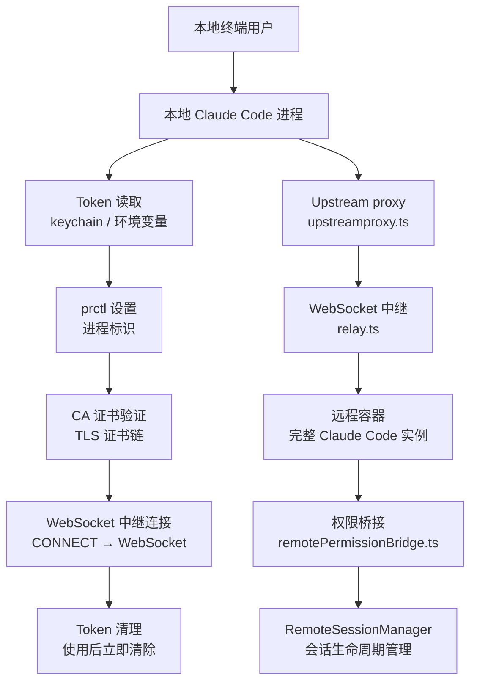
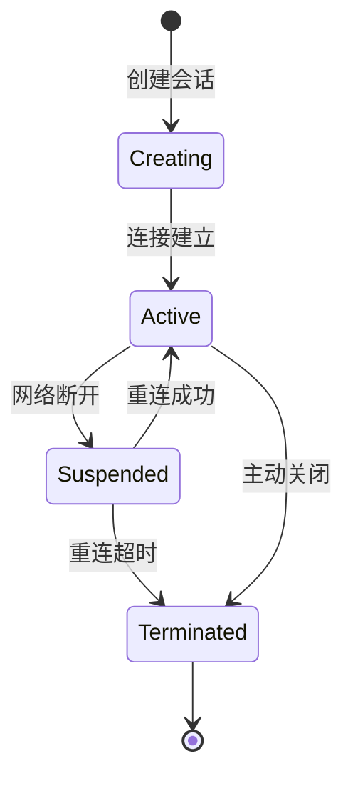

# 第 12 章：远程会话与 CCR

Claude Code Remote（CCR）允许用户在远程容器中运行 Claude Code，通过本地终端控制。它不是"SSH 到一台机器然后运行 CLI"——而是 5 步初始化链、Proto 帧封装、权限本地桥接、Token 即用的完整安全模型。

---

## 12.1 CCR 架构总览



### 5 步初始化链

| 步骤 | 目的 | 实现 |
|------|------|------|
| 1. Token 读取 | 获取认证凭据 | keychain 优先，环境变量降级 |
| 2. prctl 设置 | 标记进程身份 | Linux prctl，标识 CCR worker |
| 3. CA 证书验证 | 确保 TLS 安全 | 验证证书链，防止中间人 |
| 4. WebSocket 中继 | 建立连接通道 | CONNECT 方法升级到 WebSocket |
| 5. Token 清理 | 使用后立即清除 | 防止 token 残留在内存 |

**Token 即用的安全意义**——Token 在连接建立后立即从内存中清除。即使进程被 dump，也无法提取已使用的 token。这是"零残留凭证"的设计原则。

### prctl：进程身份标记

CCR 容器中的进程通过 Linux `prctl` 系统调用标记自己的身份。这使得远程基础设施能够识别进程类型（CCR worker vs 普通进程），并应用不同的策略（资源限制、审计日志、网络隔离）。

---

## 12.2 Proto 帧封装

CCR 使用自定义的 Proto 帧封装消息，而非直接传输 JSON：

```typescript
interface ProtoFrame {
  type: FrameType       // 消息类型标识
  payload: Uint8Array   // NDJSON 序列化后的消息体
  chunkSize: number     // 最大块限制
}
```

**为什么用帧封装**——WebSocket 传输需要保证消息的完整性（单条消息不被拆分为多个帧）和边界识别（接收方知道消息何时结束）。NDJSON 按行分割提供了边界，帧封装在此基础上增加了类型标识和大小控制。

### 最大块限制

最大块限制（通常 1MB）防止单个消息过大导致 WebSocket 帧被拒绝。当消息超过阈值时，发送方将其拆分为多个帧，接收方按序列号重组：

```
Large message (>1MB) → [Frame 1: type=chunk, seq=0] [Frame 2: type=chunk, seq=1] ...
Receiver → accumulate chunks by seq → reassemble complete message
```

### CONNECT → WebSocket 中继

```typescript
// relay.ts - WebSocket 中继实现
async function connectViaRelay(host: string, port: number, token: string) {
  // 1. 建立 TCP 连接到代理
  const socket = net.connect(port, host)
  // 2. 发送 CONNECT 请求升级到 WebSocket
  socket.write(`CONNECT /websocket HTTP/1.1\r\n`)
  socket.write(`Host: ${host}\r\n`)
  socket.write(`Authorization: Bearer ${token}\r\n`)
  socket.write(`\r\n`)
  // 3. 等待 HTTP 101 Switching Protocols
  // 4. 升级为 WebSocket 帧传输
}
```

CONNECT 方法允许通过 HTTP 代理建立隧道。代理不解析 WebSocket 帧内容——它只是透传字节流。

---

## 12.3 远程权限桥接

权限始终在**本地终端**决定——远程容器没有权限判断逻辑：

```
本地终端 [权限决定: 允许/拒绝]
    ↓ WebSocket (Proto 帧)
远程容器 [执行/跳过操作]
```

### Permission Bridge 实现

```typescript
// remotePermissionBridge.ts（简化）
class RemotePermissionBridge {
  async decide(callId: string, approved: boolean) {
    const decision = approved ? 'approved' : 'denied'
    await this.sendToRemote({ type: 'permission_response', callId, decision })
  }

  onPermissionRequest(request: PermissionRequest) {
    localCanUseTool(request).then(decision => this.decide(request.callId, decision))
  }
}
```

远程容器不知道用户是否允许这个操作——它只执行本地桥接层传过来的决定。这是安全设计：即使远程容器被提权，也无法绕过本地权限审批。

### 本地交互的唯一性

CCR 远程容器不支持用户交互——没有 TTY，没有 `AskUserQuestion` 工具。所有用户交互（权限确认、问题回答）都通过网络发送回本地终端，由本地终端处理后再将决定发回远程容器。

---

## 12.4 RemoteSessionManager

`RemoteSessionManager` 是 CCR 的核心会话管理器——它负责创建和维护远程会话的生命周期：

```typescript
class RemoteSessionManager {
  private sessions: Map<string, RemoteSession>

  async createSession(config: SessionConfig): Promise<string> {
    const sessionId = crypto.randomUUID()
    const session = new RemoteSession(sessionId, config)
    this.sessions.set(sessionId, session)
    return sessionId
  }

  async destroySession(sessionId: string) {
    const session = this.sessions.get(sessionId)
    if (session) {
      await session.cleanup()  // 远程资源清理
      this.sessions.delete(sessionId)
    }
  }
}
```

### 会话状态机



**Suspended 状态的意义**——网络断开不等于会话终止。CCR 支持从短暂的连接丢失中恢复。只有当重连超时（如 5 分钟内未能恢复），会话才进入 `Terminated`。

---

## 12.5 Upstream Proxy

`upstreamproxy/` 目录实现上游代理逻辑：

- `upstreamproxy.ts` — 代理配置和 TLS 终止
- `relay.ts` — WebSocket 中继和帧转发

Upstream proxy 的核心职责是将本地 CCR 请求安全地路由到 Anthropic 的 API 基础设施，同时支持企业代理的中间人检测（mTLS）和审计日志。

### TLS 终止与证书链

Upstream proxy 负责验证上游 TLS 证书链。这是防止中间人攻击的关键——如果不验证，任何能拦截流量的代理都可以伪造响应。

---

## 12.6 CCR 中的环境变量预处理

CCR 环境有特殊的环境变量处理——堆大小调整、远程识别标记：

```typescript
if (process.env.CLAUDE_CODE_REMOTE === 'true') {
  const existing = process.env.NODE_OPTIONS || ''
  process.env.NODE_OPTIONS = existing
    ? `${existing} --max-old-space-size=8192`
    : '--max-old-space-size=8192'
}
```

CCR 容器通常有 16GB 内存。Node.js 的默认堆上限约为 4GB，设置为 8GB 确保 V8 有足够的内存处理大上下文窗口。

---

## 12.7 与本地 CCR 的交互模式

CCR 支持两种交互范式：

### 本地 CLI 作为控制面

本地终端通过 `claude remote` 命令连接到远程实例。用户看到完整的 TUI 体验（spinner、消息流、工具输出），但实际上所有的 API 调用、工具执行都在远程容器中。

### SDK 作为控制面

通过 StructuredIO 协议（NDJSON-based），SDK 宿主可以在非终端环境中控制远程 Claude Code。输入和输出都通过结构化 JSON，没有终端渲染。

---

## 12.8 CCR v2：从 WebSocket 到 SSE 的迁移

CCR v2 使用 SSE (Server-Sent Events) 替代 WebSocket 作为主要传输协议。

### 迁移驱动力

| 方面 | v1 (WebSocket) | v2 (SSE) |
|------|---------------|----------|
| 重连 | 手动状态机 | SSE 原生 Last-Event-ID |
| 防火墙 | WebSocket 可能被拦截 | SSE 是标准 HTTP |
| 序列追踪 | 应用层手动实现 | sequence_num 内置 |
| 写通道 | WebSocket 双向 | HTTP POST 批量上传 |

### StreamAccumulatorState

SSE 传输中的 `StreamAccumulatorState` 积累 `text_delta` 事件，为每个消息 ID 发出完整的快照——即使中途重连，也能看到完整的文本状态。

```typescript
// text_delta 累积（每收到一个 delta 更新 accumulated text）
accumulator[messageId] += delta.text
// 发送 "complete-so-far" 快照
emitFullTextSnapshot(messageId)
```

这避免了 v1 中需要重新组装整个消息的问题——v2 直接提供当前的完整快照。

---

## 12.9 Epoch 机制与 Worker 生命周期

CCR v2 使用 `worker_epoch` 作为生成计数器：

```typescript
const workerEpoch = process.env.CLAUDE_CODE_WORKER_EPOCH
```

**Epoch 碰撞**——如果新实例 PUT `/worker` 返回 409 Conflict，意味着已存在更新的实例。默认行为是 `process.exit(1)`——旧的实例自动退出。

这是无缝迁移机制：新实例自动取代旧实例，不需要手动协调。

**Heartbeat**——默认 20 秒心跳。如果 heartbeat 超时，服务器标记 worker 为不活跃。
