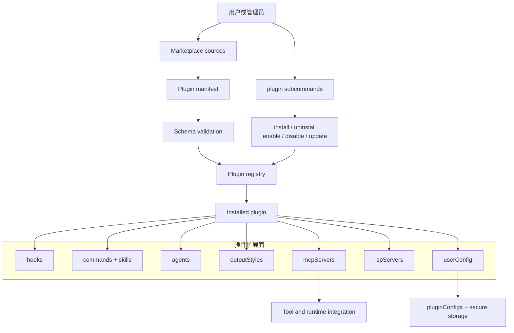
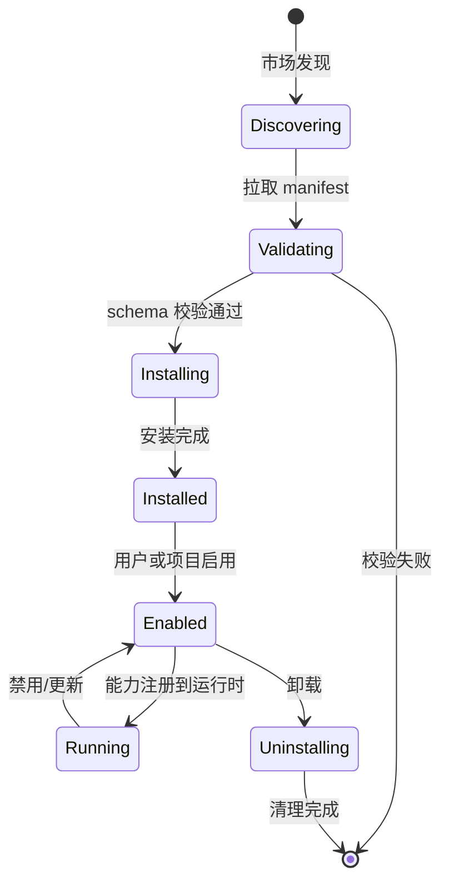

# 第 13 章：插件系统

Claude Code 的插件系统不是"装一个脚本"——它允许一组可扩展能力（hooks、commands、skills、agents、outputStyles、MCP servers、LSP servers、userConfig）同时注入运行时，经过 marketplace schema 校验和安全验证后，能力面被注册到运行时的各个子系统。

---

## 13.1 插件是能力集，不是单一命令



### 七种扩展面

| 扩展面 | 作用 | 示例 |
|--------|------|------|
| hooks | 事件驱动自动化 | PreToolUse 钩子、Stop 钩子 |
| commands + skills | 用户可调用的命令 | `/review-pr` 技能 |
| agents | 子 Agent 定义 | 自定义代码审查 Agent |
| outputStyles | 终端输出风格 | 自定义配色方案 |
| mcpServers | MCP 服务器配置 | GitHub MCP 服务器 |
| lspServers | 语言服务器配置 | TypeScript LSP |
| userConfig | 用户配置项 | API key、选项 |

---

## 13.2 Marketplace 与 Installed Plugin 两层结构

```typescript
interface MarketplaceSource {
  url: string                    // 市场源 URL
  name: string                   // 市场名称
  additional?: boolean           // 是否是附加市场
}

interface InstalledPlugin {
  name: string
  version: string
  scope: 'user' | 'project' | 'local'  // 安装作用域
  enabled: boolean
  config?: PluginConfig          // 运行时配置
}
```

两层结构的关系：
1. **Marketplace source management** — 管理市场源的添加、移除、更新
2. **Manifest fetching & validation** — 从源拉取 manifest 并校验 schema
3. **Local installation & lifecycle** — 本地安装、启用、禁用、更新
4. **History & policy control** — 安装历史与策略控制

### Marketplace 安全模型

```typescript
const strictKnownMarketplaces = [...]  // 严格信任的市场列表
const blockedMarketplaces = [...]      // 被阻止的市场列表
```

第三方插件的信任模型是**最小信任**：
- 只有 marketplace 验证过的插件才能加载
- 未经审核的插件被拒绝安装
- `blockedMarketplaces` 列表阻止已知的恶意市场源

---

## 13.3 Plugin CLI 控制面

插件相关 CLI 命令构成完整的控制面：

| 命令 | 作用 |
|------|------|
| `plugin validate` | 校验插件 manifest 格式 |
| `plugin list` | 列出已安装插件 |
| `plugin marketplace add/list/remove/update` | 管理市场源 |
| `plugin install` | 安装插件 |
| `plugin uninstall` | 卸载插件 |
| `plugin enable` | 启用插件 |
| `plugin disable` | 禁用插件 |
| `plugin update` | 更新插件 |

插件系统既有**运行时层**（自动发现和加载），也有**完整 CLI 控制面**（安装、管理、更新）。

---

## 13.4 pluginConfigs：插件配置与安全存储

```typescript
interface PluginConfig {
  mcpServers?: Record<string, McpServerConfig>  // MCP 服务器配置值
  options?: Record<string, unknown>              // 非敏感配置
  secureValues?: Record<string, string>          // 敏感配置（加密存储）
}
```

`pluginConfigs` 允许为每个插件保存配置：
- **非敏感配置** — 存储在 `settings.json` 中，如 MCP 服务器 URL
- **敏感配置** — 转入 secure storage（keychain），如 API key

**插件系统不是独立存在的** — 它和 settings/persistence 系统深度耦合。插件配置通过 settings 合并管线与用户配置合并。

---

## 13.5 Channel 注册与作用域

### ChannelEntry 类型

```typescript
export type ChannelEntry =
  | { kind: 'plugin'; name: string; marketplace: string; dev?: boolean }
  | { kind: 'server'; name: string; dev?: boolean }
```

### 注册函数

```typescript
// bootstrap/state.ts
export function tryAddPluginChannel(entry: ChannelEntry): boolean {
  const exists = STATE.allowedChannels.some(
    e => e.kind === entry.kind && e.name === entry.name
  )
  if (exists) return false
  STATE.allowedChannels.push(entry)
  channelsChanged.emit()
  return true
}
```

注册是幂等的 — 相同的频道注册两次第二次返回 `false`。这使得上层不需要做 exists-before-add 检查。

### Channel Allowlist Gate

```typescript
// channelAllowlist.ts
// dev-channel gating：检查每个条目的 dev 标志
function isChannelAllowed(channel: ChannelEntry): boolean {
  if (!channel.dev) return true   // 生产频道总是允许
  return isDevChannelEnabled()    // 开发频道需要特殊标志
}
```

GrowthBook 门控的市场 — `tengu_harbor_ledge` 和 `tengu_harbor` 是 GrowthBook feature flags。只有被 flag 允许的市场才加载。

---

## 13.6 插件的生命周期



---

## 13.7 插件与运行时各子系统的交互

插件的能力面注入到运行时的多个子系统：

| 子系统 | 插件注入方式 | 示例 |
|--------|------------|------|
| Hook 系统 | 注册 PreToolUse/PostToolUse 钩子 | 代码验证钩子 |
| 命令系统 | 注册 /command 入口 | `/review-pr` |
| 工具系统 | 注册 MCP 工具定义 | GitHub PR 工具 |
| Agent 系统 | 注册自定义 Agent | 安全审计 Agent |
| 渲染系统 | 注册 output style | 自定义格式 |
| 配置系统 | 注册 userConfig schema | API key 配置 |

---

## 13.8 插件的运行时注册与加载时序

插件在启动流程中被发现和加载：

```typescript
// main.tsx 的启动序列
const pluginDir = thisCommand.getOptionValue('pluginDir')
if (Array.isArray(pluginDir) && pluginDir.length > 0) {
  setInlinePlugins(pluginDir)          // 1. 设置内联插件
  clearPluginCache('preAction: --plugin-dir inline plugins')
}

// Commander preAction hook
program.hook('preAction', async thisCommand => {
  // 2. 加载 marketplace 插件
  await loadPluginSkills(cwd)
  // 3. 注册插件 hooks/MCP/agents 等到运行时
  registerPluginCapabilities()
})
```

**`--plugin-dir` 的优先级**——命令行指定的插件目录优先级高于配置文件。这是在 `preAction` 中处理的，确保了 init 完成前插件已注册。

### 插件缓存与热重载

插件技能通过 `clearPluginCache()` 实现热重载——当插件目录变更或技能文件变更，缓存被清除，下次访问时重新发现。

---

## 13.9 Marketplace 的安全模型详解

Marketplace 安全模型有多层防御：

| 层级 | 机制 | 防御内容 |
|------|------|---------|
| 来源信任 | `strictKnownMarketplaces` | 只信任已知的市场源 |
| 黑名单 | `blockedMarketplaces` | 阻止已知的恶意市场源 |
| Schema 校验 | manifest schema | 拒绝格式不合法的插件 |
| Channel gating | GrowthBook flags | 通过 A/B 测试控制市场可见性 |
| 签名验证 | marketplace signature | 防止中间人篡改 |

**GrowthBook 门控**——`tengu_harbor_ledge` 和 `tengu_harbor` 是 GrowthBook feature flags。只有被 flag 允许的市场才加载。这使得可以灰度发布新的市场源。

---

## 13.10 插件与 MCP 的集成

插件可以声明 MCP 服务器配置。当插件安装时，其 MCP 服务器会被注册到 MCP 系统中：

```typescript
interface PluginManifest {
  mcpServers?: {
    [name: string]: McpServerConfig
  }
}
```

插件的 MCP 服务器遵循与手动配置相同的安全模型——enterprise policy 检查、channel allowlist、OAuth 认证。插件不是特权路径。

---

## 13.11 插件 Manifest Schema

插件 manifest 有严格的 schema 校验：

```typescript
interface PluginManifest {
  name: string
  version: string
  description?: string
  hooks?: HookConfig[]
  commands?: CommandConfig[]
  skills?: SkillConfig[]
  agents?: AgentConfig[]
  outputStyles?: OutputStyleConfig[]
  mcpServers?: Record<string, McpServerConfig>
  lspServers?: LspServerConfig[]
  userConfig?: UserConfigSchema
}
```

每个字段都有类型约束。例如 `mcpServers` 必须符合 `McpServerConfigSchema`，`hooks` 必须符合 `HookConfigSchema`。

### Schema 校验失败处理

```typescript
// validatePluginManifest.ts
const result = PluginManifestSchema.safeParse(manifest)
if (!result.success) {
  throw new PluginValidationError(`Invalid manifest: ${result.error.message}`)
}
```

校验失败阻止插件安装——这防止了格式不正确的插件注入运行时。

---

## 13.12 插件卸载与清理

`plugin uninstall` 不只是删除文件——它触发完整的清理链条：

```typescript
// plugin/uninstall.ts
async function uninstallPlugin(name: string) {
  // 1. 停止插件的 hooks
  unregisterPluginHooks(name)
  // 2. 移除插件注册的命令
  unregisterPluginCommands(name)
  // 3. 关闭插件的 MCP 连接
  disconnectPluginMcpServers(name)
  // 4. 从 installed.json 中删除条目
  removeFromInstalledPlugins(name)
  // 5. 从 STATE.allowedChannels 移除
  tryRemovePluginChannel(name)
  // 6. 删除插件文件
  removePluginDirectory(name)
  // 7. 清除插件缓存
  clearPluginCache('uninstall plugin ${name}')
}
```

**清理顺序的重要性**——先停止 hooks，再移除命令，然后关闭资源。如果顺序相反，hooks 可能在清理完成后仍在执行插件代码。


---

## 13.13 Plugin Manifest: Zod Schema 校验与字段约束

```typescript
// schemas.ts:884-898 - PluginManifestSchema 的组成
const PluginManifestSchema = lazySchema(() =>
  z.object({
    ...PluginManifestMetadataSchema().shape,
    ...PluginManifestHooksSchema().partial().shape,
    ...PluginManifestCommandsSchema().partial().shape,
    ...PluginManifestAgentsSchema().partial().shape,
    ...PluginSkillsSchema().partial().shape,
    ...PluginManifestOutputStylesSchema().partial().shape,
    ...PluginManifestChannelsSchema().partial().shape,
    ...PluginManifestMcpServerSchema().partial().shape,
    ...PluginManifestLspServerSchema().partial().shape,
    ...PluginManifestSettingsSchema().partial().shape,
    ...PluginManifestUserConfigSchema().partial().shape,
  }),
)
```

**唯一必选项: `name`**——其他所有字段（version, description, author, hooks, commands, agents, skills, outputStyles, mcpServers, lspServers, settings, userConfig, channels）都是可选的。这意味着最简插件只需 `{"name": "my-plugin"}`。

### 字段约束

| 字段 | 约束 | 校验 |
|------|------|------|
| `name` | 非空，无空格，kebab-case | `.refine(name => !name.includes(' '))` |
| `version` | 可选，semver 格式 | Zod string |
| `dependencies` | 可选，插件间依赖 | `PluginDependenciesSchema` |
| `hooks` | 路径或内联定义 | `PluginManifestHooksSchema` |
| `commands` | 命令配置数组 | `PluginManifestCommandsSchema` |
| `mcpServers` | MCP 服务器配置 | `PluginManifestMcpServerSchema` |
| `userConfig` | 用户配置 schema | `PluginManifestUserConfigSchema` |

**Zod 的 strip 行为**——未知顶层字段被静默剥离（Zod 默认行为）。这使得插件对未知字段有弹性。但**嵌套配置**（userConfig options, channels, lspServers）仍然严格——内部未知键仍会失败。

### Manifest 位置检测

```typescript
// pluginLoader.ts - Manifest 检测
// 1. plugin-directory/.claude-plugin/plugin.json (首选)
// 2. plugin-directory/plugin.json (遗留回退)
```

如果没有 manifest，`loadPluginManifest` 创建最小默认：
```typescript
return {
  name: pluginName,
  description: `Plugin from ${source}`,
}
```

---

## 13.14 Plugin Install: 四种安装源

插件可以从四种不同源安装：

| 源 | 安装机制 | 特点 |
|----|---------|------|
| npm | `installFromNpm()` | 安装到全局 npm 缓存，然后拷贝到目标 |
| git/github | `gitClone()` | 浅拷贝 (`--depth 1`)，支持特定 commit SHA |
| git-subdir | `installFromGitSubdir()` | 部分克隆 (`--filter=tree:0`) + sparse-checkout |
| 本地路径 | `installFromLocal()` | 直接拷贝 |

### Git 子目录安装（最复杂的路径）

```typescript
// pluginLoader.ts:718-851
// 1. 部分克隆: git clone --filter=tree:0 --no-checkout
// 2. 稀疏检出: git sparse-checkout set <subdir>
// 3. checkout: git checkout <ref>
// 4. 提取子目录内容到目标
```

为何用部分而非完整——monorepo 可能很大。`--filter=tree:0` 只拉取 blob 元数据，不拉取树。`sparse-checkout` 只检出指定子目录。这使得安装一个 monorepo 中单个插件时，不需要下载整个仓库。

### 安装作用域

```typescript
const VALID_INSTALLABLE_SCOPES = ['user', 'project', 'local']
```

| 作用域 | 存储位置 | 共享范围 |
|--------|---------|---------|
| `user` | `~/.claude/settings.json` | 所有项目共享 |
| `project` | `$project/.claude/settings.json` | 团队共享 |
| `local` | `$project/.claude/settings.local.json` | 个人覆盖 |
| `managed` | 只读，企业级 | 平台级 |

---

## 13.15 Plugin Uninstall: 7 步清理链

```typescript
// pluginOperations.ts:427-558
async function uninstallPluginOp(pluginId, scope):
  1. 加载所有插件做反向依赖检查
  2. 通过 marketplace 查找插件标识符
  3. 如果 marketplace 找不到，回退到 installed_plugins_v2.json（已删除的插件）
  4. 验证作用域的安装在请求的范围内
  5. 从 settings 中移除（set enabledPlugins[pluginId] = undefined）
  6. 调用 clearAllCaches()
  7. 从 installed_plugins_v2.json 删除此范围的条目
  8. 如果是最后一个范围被删除:
     - markPluginVersionOrphaned(installPath) → 写入 .orphaned_at 时间戳
     - deletePluginOptions(pluginId) → 清除插件配置和 keychain 密钥
     - deletePluginDataDir(pluginId) → 删除持久数据目录 (~/.claude/plugins/data/{pluginId})
  9. 如果其他启用的插件依赖此插件，发出警告
```

**`.orphaned_at` 时间戳**——这是孤儿版本清理的关键。当插件被卸载时，版本号被标记为孤儿，但不立即删除。后台清理进程在 7 天后删除这些版本。

**7 天孤儿保留的语义**——如果用户卸载后又重新安装，孤儿版本可以避免重新下载。7 天是经验值——太长浪费磁盘空间，太短降低重新安装速度。

---

## 13.16 Plugin Hook 注册管线

插件的 hooks 通过 4 阶段管线注册：

```
阶段 1: Manifest hook 加载 (pluginLoader.ts:1618-1700+)
  - 从 hooks/hooks.json 加载标准 hooks
  - 从 manifest.hooks 加载（可以是 JSON 文件路径或内联 hook 定义）
  - 通过 realpath 检测重复，防止同一 hooks.json 被加载两次

阶段 2: Hook 转换为 Matchers (loadPluginHooks.ts:28-86)
  - 将 plugin.hooksConfig 转换为 matchers
  - 每个 matcher 携带插件上下文: { matcher, hooks, pluginRoot, pluginName, pluginId }

阶段 3: 聚合 (loadPluginHooks:91-157)
  - memoized 函数: 只在第一次调用时加载
  - 遍历所有启用的插件，合并 hooks
  - 原子清-然后-注册交换: clearRegisteredPluginHooks() → registerHookCallbacks()

阶段 4: 全局状态注册 (bootstrap/state.ts:1419-1434)
  - registerHookCallbacks(hooks): 合并（不覆盖）
  - 允许多次调用
```

**支持的 28 种 Hook 事件**：
```
PreToolUse, PostToolUse, PostToolUseFailure, PermissionDenied,
Notification, UserPromptSubmit, SessionStart, SessionEnd,
Stop, StopFailure, SubagentStart, SubagentStop,
PreCompact, PostCompact, PermissionRequest, Setup,
TeammateIdle, TaskCreated, TaskCompleted,
Elicitation, ElicitationResult, ConfigChange,
WorktreeCreate, WorktreeRemove, InstructionsLoaded, CwdChanged, FileChanged
```

### Plugin Hook 热重载

```typescript
// loadPluginHooks.ts:255-287
function setupPluginHookHotReload():
  // 订阅 policySettings 变化
  // 比较 enabledPlugins + extraKnownMarketplaces + strictKnownMarketplaces + blockedMarketplaces 的哈希快照
  // 仅当变化时重新加载 hooks
```

为何用哈希而非深度比较——深度比较需要遍历整个配置结构。哈希（SHA-256 of JSON stringify）是 O(1) 比较。

---

## 13.17 Marketplace 抓取与安全模型

### Marketplace 源的 7 种类型

```typescript
// schemas.ts:906-1043
type MarketplaceSource =
  | { type: 'url'; url: string }              // HTTPS URL
  | { type: 'github'; owner/repo; ref?, path? }  // GitHub 仓库
  | { type: 'git'; url; ref?, path? }         // 任意 Git 仓库
  | { type: 'npm'; package: string }          // NPM 包（未实现）
  | { type: 'file'; path: string }            // 本地文件
  | { type: 'directory'; path: string }       // 本地目录
  | { type: 'settings'; plugins: [...] }      // inline settings.json
```

### Marketplace 抓取流程

```
1. 确定源类型
2. 对 url 类型: 通过 axios 下载 marketplace.json 到临时文件
3. 对 github/git 类型: 克隆仓库到临时目录
   - SSH/HTTPS 回退逻辑（检查是否配置了 SSH）
   - 支持 sparse-checkout
4. 对 file/directory 类型: 直接路径解析（无需抓取）
5. 对 settings 类型: 从内联插件数组合成 marketplace.json
6. 用 PluginMarketplaceSchema 验证
7. 重命名临时缓存到 marketplace 名称（带路径遍历防御）
8. 对官方 marketplace: 先尝试 GCS 镜像，回退到 GitHub
```

### Marketplace 名称校验

Marketplace 名称被严格校验，阻止：
- 包含空格的名称
- 包含路径分隔符或 `..` 的名称
- 模仿官方名称（official/anthropic/claude）
- 保留名称: "inline" 和 "builtin"
- 非 ASCII 字符（防止同形字攻击）

### 官方 Marketplace 的 GCS 镜像

```typescript
// officialMarketplaceGcs.ts
// 官方 marketplace 先尝试 GCS 镜像，再回退到 GitHub
```

为何使用 GCS 镜像——GitHub API 有速率限制（未认证用户每小时 60 次请求）。GCS（Google Cloud Storage）无速率限制且延迟更低。

---

## 13.18 插件缓存机制

### 缓存内容

| 缓存类型 | 存储位置 | 内容 |
|---------|---------|------|
| 插件内容 | `~/.claude/plugins/cache/{marketplace}/{plugin}/{version}/` | 版本化目录 |
| ZIP 缓存 | 同上 + `.zip` 文件 | `isPluginZipCacheEnabled()` 启用时 |
| Marketplace 清单 | `~/.claude/plugins/marketplaces/{name}/.claude-plugin/marketplace.json` | 下载的 JSON |
| Memoized 结果 | `loadAllPlugins()`, `getMarketplace()` | Lodash memoize |

### 种子缓存探测

```typescript
// pluginLoader.ts:195-238
// 在克隆之前，检查 CLAUDE_CODE_PLUGIN_SEED_DIR 目录
// 支持多个seed目录，PATH-like 优先级
// 对 "unknown" 版本，探测任何已填充的版本目录
```

**种子缓存的意义**——在 CI/CD 或构建环境中，插件可以预先缓存到种子目录。安装时优先检查种子目录，命中时跳过网络抓取。

### 孤儿版本清理

```typescript
// cacheUtils.ts:74-116
async function cleanupOrphanedPluginVersionsInBackground():
  // 1. 当版本被卸载或更新时，写入 .orphaned_at 时间戳
  // 2. 两遍清理:
  //    第一遍: 从仍在安装的版本中移除 orphaned_at
  //    第二遍: 删除超过 7 天的孤儿版本
  // 3. ZIP 缓存模式完全跳过
```

---

## 13.19 Plugin Enable/Disable 的运行时行为

```typescript
// pluginOperations.ts:573-747
async function setPluginEnabledOp(pluginId, enabled, scope):
  1. 内建插件: 始终使用 user-scope 设置，绕过 installed_plugins 查找
  2. 解析插件 ID 和作用域: 在可编辑作用域搜索 (local > project > user 优先级)
  3. 策略守卫: 检查 isPluginBlockedByPolicy() — 组织阻止的插件无法启用
  4. 跨作用域提示: 如果给定作用域但插件安装 elsewhere，引导用户到正确作用域
  5. 幂等检查: 如果已在请求状态则跳过
  6. 反向依赖捕获: 禁用前捕获依赖此插件的插件（用于警告）
  7. 写入设置: 更新 enabledPlugins[pluginId] = enabled
  8. 清除缓存: clearAllCaches() 强制下次访问时新鲜加载
```

**Enable vs Disable 的不对称性**——禁用时，插件的 hooks 立即通过 `pruneRemovedPluginHooks()` 移除。启用时，新插件的 hooks **不会立即添加**——需要 `/reload-plugins` 才会加载。

### clearAllCaches() 的级联效应

```typescript
// cacheUtils.ts:44-50
function clearAllCaches():
  - clearAllPluginCaches()          // 插件专用缓存
    - clearPluginCache()            // Memoized 结果 + 设置
    - clearPluginCommandCache()     // 命令定义
    - clearPluginAgentCache()       // Agent 定义
    - clearPluginHookCache()        // Hook 注册
    - pruneRemovedPluginHooks()     // 立即禁用插件的 hooks
    - clearPluginOptionsCache()     // 存储的配置
  - clearCommandsCache()            // 命令解析缓存
  - clearAgentDefinitionsCache()    // Agent 加载缓存
  - clearPromptCache()              // 提示编译缓存
  - resetSentSkillNames()           // 已发送的技能名
```

---

## 13.20 `--plugin-dir` 会话内插件 vs Marketplace 插件

| 方面 | Marketplace 插件 | 内联插件 (--plugin-dir) |
|------|-------------------|-----------------------|
| 来源 | 通过 Marketplace 目录发现 | CLI 直接指定文件系统路径 |
| 安装 | 拷贝到版本化缓存 | 无缓存；从原始路径加载 |
| 持久化 | 保存在 settings.json + installed_plugins_v2.json | 仅会话级，不持久 |
| 启用/禁用 | 可切换和持久 | 始终为本次会话启用 |
| 来源标识 | `name@marketplace` | `name@inline` |
| 发现 | 预加载的 Marketplace 目录 | 显式指定 |

### 合并优先级

```typescript
// pluginLoader.ts:2996-3080+
function mergePluginSources(sessionPlugins, marketplacePlugins, builtinPlugins):
  // 会话插件按名称覆盖 Marketplace 插件
  // 除非 Marketplace 插件被 managed settings 锁定
  // 内建插件最后添加
```

---

## 13.14 Plugin Manifest Schema 深度解析

Plugin manifest 是 Zod v4 校验的核心，由 12 个子 schema 组合：

**PluginManifestMetadataSchema**：
- `name`：非空、无空格、强制 kebab-case
- `version`：可选 semver
- `author`：`{name, email?, url?}`

**MarketplaceNameSchema**——安全敏感校验：
- 最少 1 字符、无空格、无路径分隔符
- `isBlockedOfficialName()` 检查阻止冒名
- 阻止保留名称 `inline` 和 `builtin`
- 阻止非 ASCII 字符（同形异义攻击防护）

**PluginIdSchema**——格式：`/^[a-z0-9][-a-z0-9._]*@[a-z0-9][-a-z0-9._]*$/i`

**PluginSourceSchema**——7 种辨识联合来源类型：
1. 相对路径字符串（`./` 开头）
2. `{source: "npm", package, version?}`
3. `{source: "pip", package, version?}`（尚不支持）
4. `{source: "url", url, ref?}`——git URL
5. `{source: "github", repo, ref?}`
6. `{source: "git-subdir", url, path, ref?}`——monorepo 稀疏克隆
7. TODO: gist、单文件

**DependencyRefSchema**——3 种格式：`"plugin"`、`"plugin@marketplace"`、`{name, marketplace?}` 对象。正则：`/^[a-z0-9][-a-z0-9._]*(@[a-z0-9][-a-z0-9._]*)?(@\^[^@]*)?$/i`。变换剥离尾部 `@^version`（向前兼容）。

---

## 13.15 安装管线详细步骤

`installResolvedPlugin()`（`pluginInstallationHelpers.ts`，348-481 行）：

**步骤 1：策略守卫**——`isPluginBlockedByPolicy(pluginId)` 检查 `managed-settings.json` 中的 `enabledPlugins[pluginId] === false`。

**步骤 2：解析依赖闭包**——`resolveDependencyClosure()` 通过 DFS 带循环检测：
- 跨市场依赖封锁（默认禁止）
- 每市场允许列表
- 播种 `depInfo` 映射含市场查找

**步骤 3：传递依赖策略检查**——闭包中每个成员都经过 `isPluginBlockedByPolicy()` 检查。

**步骤 4：写入设置**——`updateSettingsForSource()` 以原子更新写入所有闭包成员为 `enabledPlugins[id] = true`。

**步骤 5：物化闭包**——每个成员调用 `cacheAndRegisterPlugin()` 到版本化缓存：
- 临时目录获取/克隆
- 计算版本（5 级回退：manifest 版本 > 提供版本 > git SHA > 未知）
- 移至版本化路径：`cache/marketplace/plugin/version/`
- 如启用 zip 缓存：`convertDirectoryToZipInPlace()`

---

## 13.16 卸载管线：7 步骤

`uninstallPluginOp()`（`pluginOperations.ts`，427-558 行）：

| 步骤 | 操作 | 描述 |
|------|------|------|
| 1 | 插件解析 | `loadAllPlugins()` + 市场查找，未找到则回退到 `resolveDelistedPluginId()` |
| 2 | 范围安装验证 | `loadInstalledPluginsV2()` 确认插件在正确范围安装 |
| 3 | 从设置移除 | `enabledPlugins[pluginId] = undefined`（合并 `undefined` 触发删除） |
| 4 | 缓存清除 | `clearAllCaches()`——清除插件、命令、agent、hook 等所有缓存 |
| 5 | 移除 installed_plugins.json | `removePluginInstallation()`，如果是最后一次安装，写入 `.orphaned_at` 时间戳 |
| 6 | 删除插件配置 | `deletePluginOptions()`——清除常规设置和 secureStorage 中的机密 |
| 7 | 删除数据目录 | 条件调用 `deletePluginDataDir()` |

---

## 13.17 市场集成与安全模型

**市场管理器**（`marketplaceManager.ts`）：
- `known_marketplaces.json`——每市场配置含 `source`、`installLocation`、`lastUpdated`、`autoUpdate`
- `marketplaces/` 缓存目录——缓存的市场数据

**市场发现**——`getPluginById()` 支持多市场搜索。`getDeclaredMarketplaces()` 合并隐式声明、`--add-dir` 额外、和 `extraKnownMarketplaces`。

**Reconciler**（`reconciler.ts`）——`diffMarketplaces()` 对比声明意图（设置）与物化状态（JSON），`reconcileMarketplaces()` 安装缺失或更新已变更的市场。

### 五层安全模型

| 层 | 机制 | 保护内容 |
|---|------|---------|
| A | 冒名保护 | 阻止 7 个保留名称、官方名称正则验证、要求仅 `anthropics` 组织来源 |
| B | 企业策略 | `getStrictKnownMarketplaces()` / `getBlockedMarketplaces()`、`isSourceAllowedByPolicy()` 阻止列表优先 |
| C | 插件级策略 | `isPluginBlockedByPolicy()` 检查 `policySettings.enabledPlugins` |
| D | 路径遍历 | `validatePathWithinBase()`——解析路径确保不逃脱基础目录 |
| E | 依赖安全 | 跨市场依赖默认封锁，仅根市场允许列表适用 |

---

## 13.18 插件能力模型

每个插件可提供这些组件：`commands | agents | skills | hooks | output-styles`，以及 `mcpServers`、`lspServers`、`settings`、`channels`。

**命令加载**（`loadPluginCommands.ts`，947 行）：
- 从 `commands/` 目录自动发现
- 命名空间：`pluginName:namespace:name`
- 支持子目录中的 `SKILL.md` 文件
- 内联内容支持（无源文件）
- Frontmatter 解析：model、effort、allowed-tools、arguments、shell
- 变量替换：`${CLAUDE_PLUGIN_ROOT}`、`${CLAUDE_PLUGIN_DATA}`、`${CLAUDE_SKILL_DIR}`、`${CLAUDE_SESSION_ID}`、`${user_config.X}`

**Hook 注入**（`loadPluginHooks.ts`）：
- 从 `hooks/hooks.json` 和 `manifest.hooks` 加载
- 支持 26 种钩子事件
- 转换为带 `pluginRoot`、`pluginName`、`pluginId` 上下文的 `PluginHookMatcher[]`

**MCP 注入**（`mcpPluginIntegration.ts`）：
- 从插件目录加载 `.mcp.json`（最低优先级）
- MCPB 加载：下载、提取、转换 DXT manifest 为 MCP 配置
- 服务器作用域前缀：`plugin:pluginName:serverName`
- `expandEnvVarsInString()` 扩展环境变量

**LSP 注入**（`lspPluginIntegration.ts`）：
- 从 manifest 加载内联或 `.lsp.json` 文件
- 配置含：command、args、extensionToLanguage、transport、env、startupTimeout 等

---

## 13.19 插件热重载

`loadPluginHooks.ts`（19-287 行）：
- `setupPluginHookHotReload()` 订阅 `settingsChangeDetector` 的 `policySettings` 来源
- 快照 4 个字段用于变更检测：`enabledPlugins`、`extraKnownMarketplaces`、`strictKnownMarketplaces`、`blockedMarketplaces`（键排序 JSON 字符串化）
- 变更时：`clearPluginCache()`、`clearPluginHookCache()`、fire-and-forget `loadPluginHooks()`
- `pruneRemovedPluginHooks()`（`clearAllCaches()` 调用）——立即移除已卸载插件的钩子，无需等待 `/reload-plugins`

---

## 13.20 插件隔离与合并

**插件隔离**：
- 每个插件加载到独立的 `LoadedPlugin` 对象，含独立的 `path`、`manifest`、`enabled` 状态
- 会话插件（`--plugin-dir`）按名称覆盖安装，但**永不**覆盖 managed-settings 插件（策略优先）

**`mergePluginSources()`**（3009-3064 行）：
```
会话 > 市场 > 内置，managed 覆盖
```

**版本化缓存路径**——`~/.claude/plugins/cache/{sanitized-marketplace}/{sanitized-plugin}/{sanitized-version}/`

**Zip 缓存模式**——转换目录为 `.zip` 以加速加载，提取至会话临时目录。

**`probeSeedCache()`**——检查只读种子目录（用于 BYOC/CCR 镜像）在克隆前。

---

## 13.21 插件加载生命周期

**入口**——`loadAllPlugins()`（memoized，`pluginLoader.ts`，3096-3108 行）：

```
1. loadPluginsFromMarketplaces({cacheOnly: false})——DFS 并行遍历所有市场
2. loadSessionOnlyPlugins(inlinePlugins)——来自 --plugin-dir
3. getBuiltinPlugins()——CLI 附带的内置插件
4. mergePluginSources()——会话 > 市场 > 内置
5. verifyAndDemote()——固定点依赖检查，禁用有未满足依赖的插件
6. cachePluginSettings()——合并 plugin.settings 到会话设置缓存
```

**`loadPluginsFromMarketplaces()`**（1888-2089 行）：
- 合并 `--add-dir` 插件（最低优先级）与 `settings.enabledPlugins`
- 校验 `PluginIdSchema` 格式
- 一次预加载所有市场目录（非逐插件）
- 应用企业策略检查（`isSourceAllowedByPolicy`）
- 闭合策略：未知来源 + 活跃策略 = 封锁
- 通过 `Promise.allSettled()` 并行加载所有插件

---
