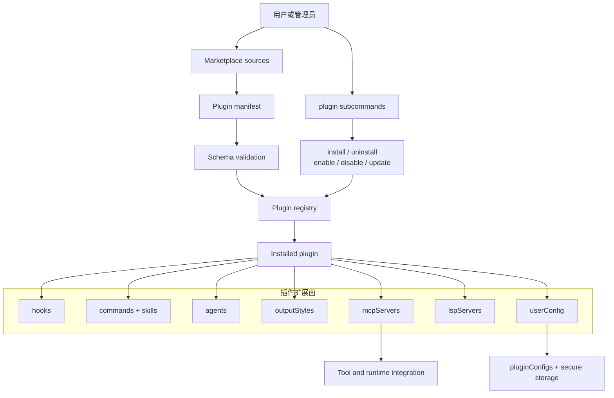
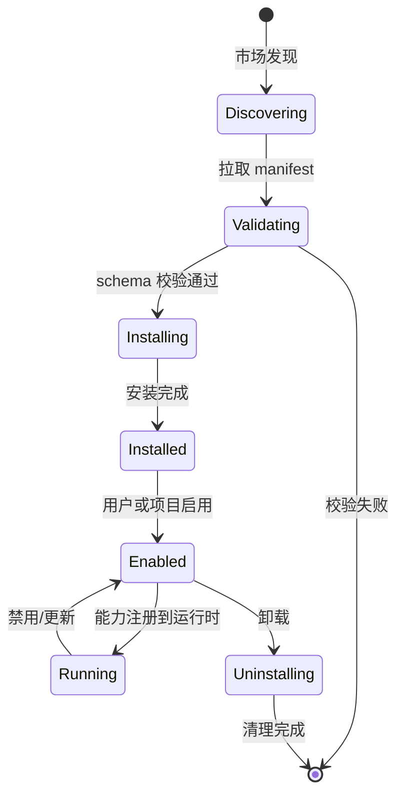

# 第 13 章：插件系统

Claude Code 的插件系统不是"装一个脚本"——它允许一组可扩展能力（hooks、commands、skills、agents、outputStyles、MCP servers、LSP servers、userConfig）同时注入运行时，经过 marketplace schema 校验和安全验证后，能力面被注册到运行时的各个子系统。

---

## 13.1 插件是能力集，不是单一命令



### 七种扩展面

| 扩展面 | 作用 | 示例 |
|--------|------|------|
| hooks | 事件驱动自动化 | PreToolUse 钩子、Stop 钩子 |
| commands + skills | 用户可调用的命令 | `/review-pr` 技能 |
| agents | 子 Agent 定义 | 自定义代码审查 Agent |
| outputStyles | 终端输出风格 | 自定义配色方案 |
| mcpServers | MCP 服务器配置 | GitHub MCP 服务器 |
| lspServers | 语言服务器配置 | TypeScript LSP |
| userConfig | 用户配置项 | API key、选项 |

---

## 13.2 Marketplace 与 Installed Plugin 两层结构

```typescript
interface MarketplaceSource {
  url: string                    // 市场源 URL
  name: string                   // 市场名称
  additional?: boolean           // 是否是附加市场
}

interface InstalledPlugin {
  name: string
  version: string
  scope: 'user' | 'project' | 'local'  // 安装作用域
  enabled: boolean
  config?: PluginConfig          // 运行时配置
}
```

两层结构的关系：
1. **Marketplace source management** — 管理市场源的添加、移除、更新
2. **Manifest fetching & validation** — 从源拉取 manifest 并校验 schema
3. **Local installation & lifecycle** — 本地安装、启用、禁用、更新
4. **History & policy control** — 安装历史与策略控制

### Marketplace 安全模型

```typescript
const strictKnownMarketplaces = [...]  // 严格信任的市场列表
const blockedMarketplaces = [...]      // 被阻止的市场列表
```

第三方插件的信任模型是**最小信任**：
- 只有 marketplace 验证过的插件才能加载
- 未经审核的插件被拒绝安装
- `blockedMarketplaces` 列表阻止已知的恶意市场源

---

## 13.3 Plugin CLI 控制面

插件相关 CLI 命令构成完整的控制面：

| 命令 | 作用 |
|------|------|
| `plugin validate` | 校验插件 manifest 格式 |
| `plugin list` | 列出已安装插件 |
| `plugin marketplace add/list/remove/update` | 管理市场源 |
| `plugin install` | 安装插件 |
| `plugin uninstall` | 卸载插件 |
| `plugin enable` | 启用插件 |
| `plugin disable` | 禁用插件 |
| `plugin update` | 更新插件 |

插件系统既有**运行时层**（自动发现和加载），也有**完整 CLI 控制面**（安装、管理、更新）。

---

## 13.4 pluginConfigs：插件配置与安全存储

```typescript
interface PluginConfig {
  mcpServers?: Record<string, McpServerConfig>  // MCP 服务器配置值
  options?: Record<string, unknown>              // 非敏感配置
  secureValues?: Record<string, string>          // 敏感配置（加密存储）
}
```

`pluginConfigs` 允许为每个插件保存配置：
- **非敏感配置** — 存储在 `settings.json` 中，如 MCP 服务器 URL
- **敏感配置** — 转入 secure storage（keychain），如 API key

**插件系统不是独立存在的** — 它和 settings/persistence 系统深度耦合。插件配置通过 settings 合并管线与用户配置合并。

---

## 13.5 Channel 注册与作用域

### ChannelEntry 类型

```typescript
export type ChannelEntry =
  | { kind: 'plugin'; name: string; marketplace: string; dev?: boolean }
  | { kind: 'server'; name: string; dev?: boolean }
```

### 注册函数

```typescript
// bootstrap/state.ts
export function tryAddPluginChannel(entry: ChannelEntry): boolean {
  const exists = STATE.allowedChannels.some(
    e => e.kind === entry.kind && e.name === entry.name
  )
  if (exists) return false
  STATE.allowedChannels.push(entry)
  channelsChanged.emit()
  return true
}
```

注册是幂等的 — 相同的频道注册两次第二次返回 `false`。这使得上层不需要做 exists-before-add 检查。

### Channel Allowlist Gate

```typescript
// channelAllowlist.ts
// dev-channel gating：检查每个条目的 dev 标志
function isChannelAllowed(channel: ChannelEntry): boolean {
  if (!channel.dev) return true   // 生产频道总是允许
  return isDevChannelEnabled()    // 开发频道需要特殊标志
}
```

GrowthBook 门控的市场 — `tengu_harbor_ledge` 和 `tengu_harbor` 是 GrowthBook feature flags。只有被 flag 允许的市场才加载。

---

## 13.6 插件的生命周期



---

## 13.7 插件与运行时各子系统的交互

插件的能力面注入到运行时的多个子系统：

| 子系统 | 插件注入方式 | 示例 |
|--------|------------|------|
| Hook 系统 | 注册 PreToolUse/PostToolUse 钩子 | 代码验证钩子 |
| 命令系统 | 注册 /command 入口 | `/review-pr` |
| 工具系统 | 注册 MCP 工具定义 | GitHub PR 工具 |
| Agent 系统 | 注册自定义 Agent | 安全审计 Agent |
| 渲染系统 | 注册 output style | 自定义格式 |
| 配置系统 | 注册 userConfig schema | API key 配置 |

---

## 13.8 插件的运行时注册与加载时序

插件在启动流程中被发现和加载：

```typescript
// main.tsx 的启动序列
const pluginDir = thisCommand.getOptionValue('pluginDir')
if (Array.isArray(pluginDir) && pluginDir.length > 0) {
  setInlinePlugins(pluginDir)          // 1. 设置内联插件
  clearPluginCache('preAction: --plugin-dir inline plugins')
}

// Commander preAction hook
program.hook('preAction', async thisCommand => {
  // 2. 加载 marketplace 插件
  await loadPluginSkills(cwd)
  // 3. 注册插件 hooks/MCP/agents 等到运行时
  registerPluginCapabilities()
})
```

**`--plugin-dir` 的优先级**——命令行指定的插件目录优先级高于配置文件。这是在 `preAction` 中处理的，确保了 init 完成前插件已注册。

### 插件缓存与热重载

插件技能通过 `clearPluginCache()` 实现热重载——当插件目录变更或技能文件变更，缓存被清除，下次访问时重新发现。

---

## 13.9 Marketplace 的安全模型详解

Marketplace 安全模型有多层防御：

| 层级 | 机制 | 防御内容 |
|------|------|---------|
| 来源信任 | `strictKnownMarketplaces` | 只信任已知的市场源 |
| 黑名单 | `blockedMarketplaces` | 阻止已知的恶意市场源 |
| Schema 校验 | manifest schema | 拒绝格式不合法的插件 |
| Channel gating | GrowthBook flags | 通过 A/B 测试控制市场可见性 |
| 签名验证 | marketplace signature | 防止中间人篡改 |

**GrowthBook 门控**——`tengu_harbor_ledge` 和 `tengu_harbor` 是 GrowthBook feature flags。只有被 flag 允许的市场才加载。这使得可以灰度发布新的市场源。

---

## 13.10 插件与 MCP 的集成

插件可以声明 MCP 服务器配置。当插件安装时，其 MCP 服务器会被注册到 MCP 系统中：

```typescript
interface PluginManifest {
  mcpServers?: {
    [name: string]: McpServerConfig
  }
}
```

插件的 MCP 服务器遵循与手动配置相同的安全模型——enterprise policy 检查、channel allowlist、OAuth 认证。插件不是特权路径。
