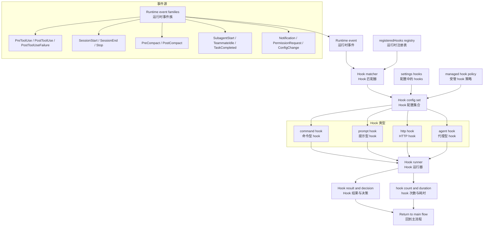
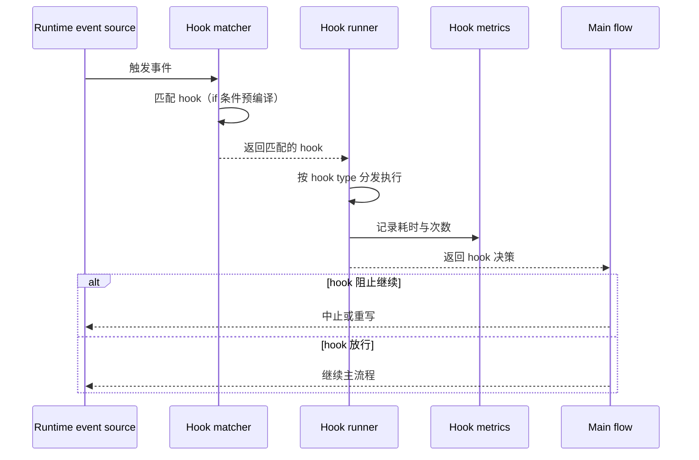

# 第 14 章：技能与 Hooks

Claude Code 的 Hook 系统是一个事件驱动自动化总线。4 种 hook 类型 × 20+ 事件类型，贯穿从工具调用到会话生命周期的全流程。Skills 是用户定义的 Prompt Command，通过 `.claude/skills/*.md` 文件或插件注。Hooks 在特定事件触发时执行—可以是 shell 命令、LLM prompt、HTTP POST 请求或验证 Agent。

---

## 14.1 Hooks：事件驱动自动化系统



### 四 Hook 类型，四种后端

| 类型 | 执行方式 | 示例 |
|------|---------|------|
| `command` | Shell 命令执行 | `PreToolUse` hook 运行脚本 |
| `prompt` | LLM prompt 注入 | `Stop` hook 告诉模型做什么 |
| `http` | HTTP POST 请求 | 通知外部服务 |
| `agent` | Agentic verifier | 验证操作安全性 |

这四类不共享同一种执行方式。Hook runner 必须按 type 分发到不同后端。

### 事件枚举：20+ 事件类型

Hook 事件远不止工具调用：

| 事件类别 | 事件 | 触发时机 |
|----------|------|---------|
| 工具类 | `PreToolUse` | 工具执行前 |
| | `PostToolUse` | 工具执行后 |
| | `PostToolUseFailure` | 工具执行失败 |
| 会话类 | `SessionStart` | 会话开始 |
| | `SessionEnd` | 会话结束 |
| | `Stop` | 轮次结束 |
| | `StopFailure` | 轮次结束失败 |
| 压缩类 | `PreCompact` | 自动压缩执行前 |
| | `PostCompact` | 自动压缩执行后 |
| 团队类 | `SubagentStart` | 子 Agent 启动 |
| | `SubagentStop` | 子 Agent 停止 |
| | `TeammateIdle` | 协作代理空闲 |
| | `TaskCompleted` | 任务完成 |
| 其他 | `Notification` | 通知产生 |
| | `PermissionRequest` | 权限请求 |
| | `ConfigChange` | 配置变更 |
| | `WorktreeCreate` | Git worktree 创建 |
| | `WorktreeRemove` | Git worktree 删除 |

**Hooks 贯穿多个子系统** — 它不只是 tool wrapper，而是横切 turn loop、team system、worktree、config 等多个模块。

---

## 14.2 Hook 配置与 Condition

Hook 支持条件触发 — `if` 字段基于工具名称和输入模式的匹配：

```yaml
hooks:
  - event: Stop
    if: Bash(git *)
    handler: git-commit.sh
  - event: PostToolUse
    if: FileEdit
    handler: validate-edit.sh
```

### 预编译匹配器

```typescript
// preparePermissionMatcher 为每个 hook 预编译匹配函数
const hookMatcher = preparePermissionMatcher(hook.if)
// 之后每次 hook 事件触发时，直接调用 matcher，不需要重新解析
if (hookMatcher(event)) { runHook(hook) }
```

预编译避免了每 hook 评估都重新解析。`HookMatcher` 在注册时就把规则字符串编译为匹配函数。

### Hook Registry 与 Metrics

运行时维护 hook 注册表和统计数据：

```typescript
// Hook registry
registerHookCallbacks(eventType: string, hooks: HookConfig[])
getRegisteredHooks(eventType: string): HookConfig[]
clearRegisteredHooks()
clearRegisteredPluginHooks()

// Hook metrics
getTurnHookCount(): number          // 当前轮次 hook 执行次数
getTurnHookDurationMs(): number     // 当前轮次 hook 总耗时
```

Hooks 在运行时是可注册、可枚举、可统计的，不是纯静态配置。

---

## 14.3 Settings 与 Policy 治理

配置层里与 hooks 直接相关的字段：

| 字段 | 作用 |
|------|------|
| `hooks` | 用户配置的 hook 列表 |
| `disableAllHooks` | 全局禁用所有 hooks |
| `allowManagedHooksOnly` | 只允许受管 hooks |
| `allowedHttpHookUrls` | HTTP hook 的 URL 白名单 |
| `httpHookAllowedEnvVars` | HTTP hook 可访问的环境变量白名单 |

Hook 系统不是"写了就会跑" — 还要经过 policy 和 URL/env allowlist 治理。

---

## 14.4 Skills 框架：用户定义的 Prompt Command

Skills 通过 `.claude/skills/*.md` 文件或插件注册。

### 加载优先级

1. **Bundled skills** — 内置技能（最低优先级）
2. **User skills** — `.claude/skills/` 目录
3. **Plugin skills** — 插件注册的技能

### Skill 发现预取

主循环在每个 turn 中异步预取 skill 发现：

```typescript
// query.ts (skill discovery prefetch)
const pendingSkillPrefetch = skillPrefetch?.startSkillDiscoveryPrefetch(
  null, messages, toolUseContext,
)
```

这使得 skill 发现不阻塞主循环 — 它在工具执行的同时进行，并在附件注入阶段消费结果。

### 技能变更检测

```typescript
void skillChangeDetector.initialize()
```

设置检测器在启动后监视技能目录的变更。这是热重载机制 — 技能目录变更不需要重启会话。

---

## 14.5 Hook 执行管线

### 四种执行后端

**Command hook** — 通过 shell 执行，输出捕获到 tool result：
```typescript
// execCommand - 通过子进程执行
const result = await spawnShell(hook.command, { cwd, env })
```

**Prompt hook** — 通过 LLM 注入，在 Stop 事件中给模型一段 prompt：
```typescript
// execPromptHook - 注入 prompt 给模型
return { type: 'prompt', text: hook.text }
```

**HTTP hook** — POST 请求外部 URL：
```typescript
// execHttpHook - POST 请求
// 受 allowedHttpHookUrls 白名单和 httpHookAllowedEnvVars 限制
const response = await fetch(url, { method: 'POST', body: JSON.stringify(event) })
```

**Agent hook** — 通过 Agent 验证器执行：
```typescript
// execAgentHook - 通过 Agent 验证
// 启动 sub-agent 来验证操作的安全性
return await runAgent({ agentType: verifier, prompt: hook.prompt })
```

### Hook 时序



---

## 14.6 Hook 的 SSRF 防护

HTTP hook 面临 SSRF（Server-Side Request Forgery）风险。`ssrfGuard.ts` 实现 URL 白名单和请求限制：

```typescript
// SSRF guard - 只允许白名单 URL
function ssrfGuard(url: string): boolean {
  return allowedHttpHookUrls.some(allowed =>
    url.startsWith(allowed)
  )
}
```

HTTP hook 只能请求白名单中的 URL，防止攻击者通过 hook 配置发起内部网络请求。

---

## 14.7 Hook 执行的性能与隔离

### Hook 超时保护

每个 hook 都有执行时间上限——command hook 通过子进程 timeout 控制，prompt hook 通过 LLM 调用的超时参数，HTTP hook 通过 fetch 超时。

### Hook 错误隔离

一个 hook 的崩溃不应该影响主流程。Hook runner 使用 `try/catch` 包裹每个 hook 调用，失败时记录日志并继续（除非 hook 标记为 required）。

### Hook 的异步执行

并非所有 hook 都阻塞主流程。`PostToolUse` hook 可以配置为异步执行（fire-and-forget），不等待结果返回。

---

## 14.8 Skill 与 Hook 的协同

Hook 和 Skill 虽然来自不同的子系统，但有协同工作的场景：

| 阶段 | Skill 的作用 | Hook 的作用 |
|------|------------|-----------|
| 输入 | 提供 prompt 模板，指导模型行为 | 拦截工具调用，验证操作合法性 |
| 执行 | 模型根据 Skill 描述生成调用 | PreToolUse 可approve/deny/modify输入 |
| 输出 | 影响模型回答的内容 | PostToolUse 可附加结果或停止会话 |

**Skill 作为输入扩展，Hook 作为执行拦截**——两者在不同阶段工作，但共同控制操作的合法性。

---

## 14.9 Hook 的 metrics 与可观测性

```typescript
// Hook metrics registry
getTurnHookCount(): number          // 当前轮次 hook 执行次数
getTurnHookDurationMs(): number     // 当前轮次 hook 总耗时
```

**hook count 的意义**——每个 hook 都是额外的延迟。如果一轮中 hook 总耗时超过 500ms，会显著影响用户感知。通过 `getTurnHookDurationMs()`，系统可以诊断性能瓶颈。

**hook 次数的限制**——某些内部构建使用 `CLAUDE_CODE_HOOK_LIMIT` 控制每轮最多执行多少个 hook，防止 hook 配置不当导致性能雪崩。
