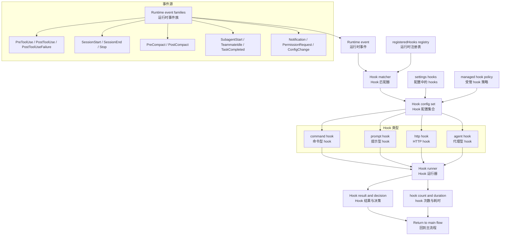
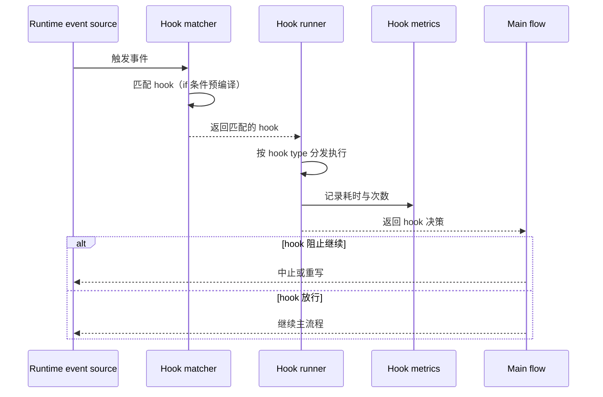

# 第 14 章：技能与 Hooks

Claude Code 的 Hook 系统是一个事件驱动自动化总线。4 种 hook 类型 × 20+ 事件类型，贯穿从工具调用到会话生命周期的全流程。Skills 是用户定义的 Prompt Command，通过 `.claude/skills/*.md` 文件或插件注。Hooks 在特定事件触发时执行—可以是 shell 命令、LLM prompt、HTTP POST 请求或验证 Agent。

---

## 14.1 Hooks：事件驱动自动化系统



### 四 Hook 类型，四种后端

| 类型 | 执行方式 | 示例 |
|------|---------|------|
| `command` | Shell 命令执行 | `PreToolUse` hook 运行脚本 |
| `prompt` | LLM prompt 注入 | `Stop` hook 告诉模型做什么 |
| `http` | HTTP POST 请求 | 通知外部服务 |
| `agent` | Agentic verifier | 验证操作安全性 |

这四类不共享同一种执行方式。Hook runner 必须按 type 分发到不同后端。

### 事件枚举：20+ 事件类型

Hook 事件远不止工具调用：

| 事件类别 | 事件 | 触发时机 |
|----------|------|---------|
| 工具类 | `PreToolUse` | 工具执行前 |
| | `PostToolUse` | 工具执行后 |
| | `PostToolUseFailure` | 工具执行失败 |
| 会话类 | `SessionStart` | 会话开始 |
| | `SessionEnd` | 会话结束 |
| | `Stop` | 轮次结束 |
| | `StopFailure` | 轮次结束失败 |
| 压缩类 | `PreCompact` | 自动压缩执行前 |
| | `PostCompact` | 自动压缩执行后 |
| 团队类 | `SubagentStart` | 子 Agent 启动 |
| | `SubagentStop` | 子 Agent 停止 |
| | `TeammateIdle` | 协作代理空闲 |
| | `TaskCompleted` | 任务完成 |
| 其他 | `Notification` | 通知产生 |
| | `PermissionRequest` | 权限请求 |
| | `ConfigChange` | 配置变更 |
| | `WorktreeCreate` | Git worktree 创建 |
| | `WorktreeRemove` | Git worktree 删除 |

**Hooks 贯穿多个子系统** — 它不只是 tool wrapper，而是横切 turn loop、team system、worktree、config 等多个模块。

---

## 14.2 Hook 配置与 Condition

Hook 支持条件触发 — `if` 字段基于工具名称和输入模式的匹配：

```yaml
hooks:
  - event: Stop
    if: Bash(git *)
    handler: git-commit.sh
  - event: PostToolUse
    if: FileEdit
    handler: validate-edit.sh
```

### 预编译匹配器

```typescript
// preparePermissionMatcher 为每个 hook 预编译匹配函数
const hookMatcher = preparePermissionMatcher(hook.if)
// 之后每次 hook 事件触发时，直接调用 matcher，不需要重新解析
if (hookMatcher(event)) { runHook(hook) }
```

预编译避免了每 hook 评估都重新解析。`HookMatcher` 在注册时就把规则字符串编译为匹配函数。

### Hook Registry 与 Metrics

运行时维护 hook 注册表和统计数据：

```typescript
// Hook registry
registerHookCallbacks(eventType: string, hooks: HookConfig[])
getRegisteredHooks(eventType: string): HookConfig[]
clearRegisteredHooks()
clearRegisteredPluginHooks()

// Hook metrics
getTurnHookCount(): number          // 当前轮次 hook 执行次数
getTurnHookDurationMs(): number     // 当前轮次 hook 总耗时
```

Hooks 在运行时是可注册、可枚举、可统计的，不是纯静态配置。

---

## 14.3 Settings 与 Policy 治理

配置层里与 hooks 直接相关的字段：

| 字段 | 作用 |
|------|------|
| `hooks` | 用户配置的 hook 列表 |
| `disableAllHooks` | 全局禁用所有 hooks |
| `allowManagedHooksOnly` | 只允许受管 hooks |
| `allowedHttpHookUrls` | HTTP hook 的 URL 白名单 |
| `httpHookAllowedEnvVars` | HTTP hook 可访问的环境变量白名单 |

Hook 系统不是"写了就会跑" — 还要经过 policy 和 URL/env allowlist 治理。

---

## 14.4 Skills 框架：用户定义的 Prompt Command

Skills 通过 `.claude/skills/*.md` 文件或插件注册。

### 加载优先级

1. **Bundled skills** — 内置技能（最低优先级）
2. **User skills** — `.claude/skills/` 目录
3. **Plugin skills** — 插件注册的技能

### Skill 发现预取

主循环在每个 turn 中异步预取 skill 发现：

```typescript
// query.ts (skill discovery prefetch)
const pendingSkillPrefetch = skillPrefetch?.startSkillDiscoveryPrefetch(
  null, messages, toolUseContext,
)
```

这使得 skill 发现不阻塞主循环 — 它在工具执行的同时进行，并在附件注入阶段消费结果。

### 技能变更检测

```typescript
void skillChangeDetector.initialize()
```

设置检测器在启动后监视技能目录的变更。这是热重载机制 — 技能目录变更不需要重启会话。

---

## 14.5 Hook 执行管线

### 四种执行后端

**Command hook** — 通过 shell 执行，输出捕获到 tool result：
```typescript
// execCommand - 通过子进程执行
const result = await spawnShell(hook.command, { cwd, env })
```

**Prompt hook** — 通过 LLM 注入，在 Stop 事件中给模型一段 prompt：
```typescript
// execPromptHook - 注入 prompt 给模型
return { type: 'prompt', text: hook.text }
```

**HTTP hook** — POST 请求外部 URL：
```typescript
// execHttpHook - POST 请求
// 受 allowedHttpHookUrls 白名单和 httpHookAllowedEnvVars 限制
const response = await fetch(url, { method: 'POST', body: JSON.stringify(event) })
```

**Agent hook** — 通过 Agent 验证器执行：
```typescript
// execAgentHook - 通过 Agent 验证
// 启动 sub-agent 来验证操作的安全性
return await runAgent({ agentType: verifier, prompt: hook.prompt })
```

### Hook 时序



---

## 14.6 Hook 的 SSRF 防护

HTTP hook 面临 SSRF（Server-Side Request Forgery）风险。`ssrfGuard.ts` 实现 URL 白名单和请求限制：

```typescript
// SSRF guard - 只允许白名单 URL
function ssrfGuard(url: string): boolean {
  return allowedHttpHookUrls.some(allowed =>
    url.startsWith(allowed)
  )
}
```

HTTP hook 只能请求白名单中的 URL，防止攻击者通过 hook 配置发起内部网络请求。

---

## 14.7 Hook 执行的性能与隔离

### Hook 超时保护

每个 hook 都有执行时间上限——command hook 通过子进程 timeout 控制，prompt hook 通过 LLM 调用的超时参数，HTTP hook 通过 fetch 超时。

### Hook 错误隔离

一个 hook 的崩溃不应该影响主流程。Hook runner 使用 `try/catch` 包裹每个 hook 调用，失败时记录日志并继续（除非 hook 标记为 required）。

### Hook 的异步执行

并非所有 hook 都阻塞主流程。`PostToolUse` hook 可以配置为异步执行（fire-and-forget），不等待结果返回。

---

## 14.8 Skill 与 Hook 的协同

Hook 和 Skill 虽然来自不同的子系统，但有协同工作的场景：

| 阶段 | Skill 的作用 | Hook 的作用 |
|------|------------|-----------|
| 输入 | 提供 prompt 模板，指导模型行为 | 拦截工具调用，验证操作合法性 |
| 执行 | 模型根据 Skill 描述生成调用 | PreToolUse 可approve/deny/modify输入 |
| 输出 | 影响模型回答的内容 | PostToolUse 可附加结果或停止会话 |

**Skill 作为输入扩展，Hook 作为执行拦截**——两者在不同阶段工作，但共同控制操作的合法性。

---

## 14.9 Hook 的 metrics 与可观测性

```typescript
// Hook metrics registry
getTurnHookCount(): number          // 当前轮次 hook 执行次数
getTurnHookDurationMs(): number     // 当前轮次 hook 总耗时
```

**hook count 的意义**——每个 hook 都是额外的延迟。如果一轮中 hook 总耗时超过 500ms，会显著影响用户感知。通过 `getTurnHookDurationMs()`，系统可以诊断性能瓶颈。

**hook 次数的限制**——某些内部构建使用 `CLAUDE_CODE_HOOK_LIMIT` 控制每轮最多执行多少个 hook，防止 hook 配置不当导致性能雪崩。

---

## 14.10 Prompt Command 的渲染与交互

Prompt Command 不只是简单的文本生成——它们支持 JSX 渲染和用户交互：

```typescript
// types/command.ts 简化视图
interface PromptCommand {
  type: 'prompt'
  getPromptForCommand(args: string[], ctx): Promise<string>
  // 可选的 JSX 渲染
  renderCommandPreview?(ctx): ReactNode   // 预览卡片
  renderCommandConfirmation?(ctx): ReactNode  // 确认对话框
  renderCommandResult?(ctx, result): ReactNode  // 结果展示
}
```

**命令预览**——`/cost` 等命令在提示框中显示预览卡片，用户输入前能看到命令会做什么。

**确认对话框**——`/clear`（清空会话）等破坏性命令需要确认对话框——这是 React 组件而非简单的 `y/n` 提示。

---

## 14.11 本地 JSX 命令

除了 Prompt Command，还有 Local JSX 命令：

```typescript
interface LocalJsxCommand {
  type: 'local-jsx'
  render(ctx): ReactNode
  execute(ctx): void
}
```

**Local JSX 的典型用例**——`/install-github-app` 显示 GitHub App 安装页面，`/show-setup` 显示初始化向导。这些命令不走 LLM——它们直接在本地渲染 React 组件。

### 命令发现优先级

命令的注册和发现有明确的优先级：

1. **Commander 子命令**：`claude mcp add`, `claude session list`（启动时注册）
2. **Slash 命令**：`/help`, `/clear`, `/resume`（COMMANDS 数组）
3. **Prompt 命令**：`/cost`, `/summary`（返回 prompt 字符串）
4. **动态命令**：Skills/插件命令（运行时发现）
5. **Local JSX 命令**：`/install-github-app`（本地组件）

每种类型的命令有不同的渲染方式和执行路径，但它们都通过统一的 `COMMANDS` 数组暴露，由命令解析层分发。

---

## 14.12 Hook if 条件预编译

Hook 的 `if` 条件在加载时预编译：

```yaml
hooks:
  - event: Stop
    if: Bash(git *)
    handler: git-commit.sh
```

`preparePermissionMatcher()` 为每个 hook 预编译匹配函数，避免每次 hook 评估都重新解析规则。匹配函数缓存了 bash 命令的 AST 解析结果。

```typescript
// hooks.ts
function preparePermissionMatcher(ifExpr: string): PermissionMatcher {
  // 将 if 表达式编译为匹配函数
  const rule = parseRuleContent(ifExpr)
  return (toolName, input) => matchRule(rule, toolName, input)
}
```

---

## 14.13 Skill 的目录结构

Skill 存储在 `.claude/skills/skill-name/SKILL.md` 中。加载器（`loadSkillsDir.ts:407-480`）：

```
.claude/skills/
  └── my-skill/
      └── SKILL.md          # 主要定义
```

SKILL.md 的前matter（YAML）包含：
- `name`, `description`, `when_to_use`, `version`
- `allowed-tools`（bash 类 Permission Rule 语法）
- `argument-hint`, `arguments`
- `model`, `disable-model-invocation`
- `user-invocable`（默认: true）
- `context: fork`（用于子 Agent 执行）
- `agent`（fork 时的 Agent 类型）
- `paths`（基于文件路径 globs 的条件可见性）
- `shell`（内联 shell 命令执行）
- `hooks`（hook 配置）

**命名空间**——目录结构自动创建冒号分隔的命名空间：
```
.claude/commands/ci/lint/SKILL.md → "ci:lint"
```

`buildNamespace()`（line 523-543）从基目录以下的子目录创建冒号连接的路径。

### 旧格式（已弃用）

`.claude/commands/` 目录支持两种格式：
1. 子目录中的 `SKILL.md`（推荐）
2. 单个 `.md` 文件（旧格式，不推荐）

旧格式中的 commands 默认 `user-invocable: true`，`loadedFrom` 标记为 `commands_DEPRECATED`。

---

## 14.14 Skill 执行流程：从 CLI 到 Prompt

**`createSkillCommand()`（`loadSkillsDir.ts:270-401`）** 构造 `Command` 对象，核心的 `getPromptForCommand` 函数（line 344）：

```mermaid
flowchart LR
    A[用户输入 /skill arg1 arg2] --> B[prepend baseDir]
    B --> C[substituteArguments 替换 $0, $1, $ARGUMENTS]
    C --> D[替换 ${CLAUDE_SKILL_DIR}]
    D --> E[替换 ${CLAUDE_SESSION_ID}]
    E --> F{是否 MCP skill?}
    F -->|否| G[执行内联 shell 命令]
    F -->|是| H[跳过 shell 执行]
    G --> I[返回最终 prompt]
    H --> I
```

**MCP 技能的隔离**——MCP 技能（`loadedFrom === 'mcp'`）绝不执行内联 shell 命令。它们的技能目录变量和 shell 执行都被禁用。这是最小的信任模型——MCP 技能来自外部源，不应具有本地 shell 访问权限。

---

## 14.15 Hook 的六源聚合

**`getHooksConfig()`（`hooks.ts:1492-1566`）** 从六个来源聚合 hooks：

1. Config Snapshot（来自设置文件——用户、项目、本地、策略）
2. Registered Hook Callbacks（SDK/插件回调）
3. Plugin Native Hooks
4. Session Hooks（来自 frontmatter agents/skills）
5. Session Function Hooks
6. 内联 hook 定义

---

## 14.16 Agent Hook：最多 50 轮的微型 Agent

**`execAgentHook.ts:1-339`** 产生一个"hook-agent"：

```typescript
// 1. 唯一 hookAgentId
// 2. 过滤工具: 所有父工具 - 禁止工具 (如 Agent, 防止子 Agent 产生)
//    + StructuredOutput 工具
// 3. 非交互 session，工具可用
// 4. 转录文件读取权限
// 5. Session 级别 StructuredOutput 强制
// 6. 最多 50 轮，到达上限时中止
// 7. 完成后 clearSessionHooks(hookAgentId) 清理
```

Agent hook 与常规 Agent 的区别：
- 工具集受限（父工具减去递归能力）
- 有 StructuredOutput 强制要求
- 最多 50 轮（而普通 Agent 可达 200 轮）
- 完成后自动清理

---

## 14.17 Prompt Hook：Haiku 级评估

**`execPromptHook.ts:1-211`**——用 Haiku（或指定模型）查询：

```typescript
// 1. 系统 prompt 指示返回 {ok: true} 或 {ok: false, reason: "..."}
// 2. 默认 30 秒超时
// 3. JSON schema 响应格式
// 4. 阻塞结果: ok: false 时阻止继续
```

这是"轻量级 LLM 判断"模式——不需要运行完整的 Agent，只需单次 Haiku 调用判断是否允许某个操作继续。

---

## 14.18 Skill 的热重载限制

热重载路径（`applySettingsChange.ts:1-93`）：
1. 设置文件 watcher 检测变化
2. `applySettingsChange()` 触——调用 `getInitialSettings()`（新鲜磁盘读取）
3. 调用 `updateHooksConfigSnapshot()`——重置缓存, 重新读取

**热重载的范围**：
- ✅ Hook 配置（所有设置文件来源）
- ✅ 来自磁盘的权限规则
- ✅ 影响 hook 执行的设置

**不热重载的（需重启）**：
- 捆绑技能（编译到二进制中）
- 插件 hook 注册（插件加载时注册）
- `getSkillDirCommands()` 缓存（虽然有 memoization 可清除）

---

## 14.19 FileChanged Hook：动态监视路径更新

**`fileChangedWatcher.ts:1-192`** 实现了文件变更监视：

- 在 CWD 变化后动态更新监视路径
- 支持通配符模式（`*.ts`, `src/**/*.tsx`）
- 使用 node 的 `fs.watch` API
- 当文件变化时触发 `FileChanged` 事件，携带变更的文件路径

这使得 hook 可以响应代码文件变化，如自动格式、自动测试等。

---

## 14.20 Hook 的配置变更通知

**`ConfigChange`** hook 在以下来源的配置文件发生变化时触发：
- `user_settings`：用户级别设置
- `project_settings`：项目级别设置
- `local_settings`：本地级别设置
- `policy_settings`：策略级别设置
- `skills`：技能目录

当 `ConfigChange` 触发后，所有匹配的 hook 都会执行。这允许 hook 响应权限、MCP 服务器、和其他全局设置的变化。

---

## 14.21 Command vs Skill：类型层级

```typescript
Command = CommandBase & (PromptCommand | LocalCommand | LocalJSXCommand)
```

| 类型 | `type` | 定义 | 示例 |
|------|--------|------|------|
| **PromptCommand** | `'prompt'` | `getPromptForCommand()` 函数，生成模型提示 | `/review-pr`, `/commit` |
| **LocalCommand** | `'local'` | CLI 侧 JavaScript 函数 `load()` → `call()` | `/help`, `/config` |
| **LocalJSXCommand** | `'local-jsx'` | React/Ink UI 组件渲染 | `/hooks`, `/status` |

**Skill 注册路径**——捆绑技能通过 `registerBundledSkill()` 注册（`bundledSkills.ts:53-100`），文件型技能通过 `loadSkillsFromSkillsDir()` 注册（`loadSkillsDir.ts`）。两者都产生 `type: 'prompt'` 命令。

**Skill 的 context 模式**：
- `context: 'inline'`——在当前对话中展开提示
- `context: 'fork'`——作为子 Agent 单独执行
- 默认 inline，除非明确指定 fork

---

## 14.22 Bundled Skills 初始化与特性门控

`skills/bundled/init.ts` 中，bundled skills 在启动时注册：

```typescript
const SKILLS_REGISTRY: SkillConfig[] = [
  { id: 'commit', name: 'commit', source: 'bundled', ... },
  { id: 'review-pr', name: 'review-pr', source: 'bundled', ... },
  { id: 'babysit-prs', name: 'babysit-prs', source: 'bundled', ... },
  // ... 约 10-15 个内置技能
]
```

**特性门控**——每个技能可能有一个 `featureGate` 字段：
```typescript
if (skill.featureGate && !growthbook.isOn(skill.featureGate)) {
  return null  // 跳过此技能
}
```

GrowthBook 通过 `tengu_skill_gating` 特性标记下发。这允许在没有 CLI 发布的情况下启用/禁用技能。

**安全技能**——某些技能在沙箱模式下被降级或禁用。`skills/sandboxFilter.ts` 根据 `isSandbox` 标志过滤。

---

## 14.23 Prompt 中的 Shell 命令执行

`skills/promptExpansion.ts`：slash 命令在提示中被展开为 shell 脚本：

```
/skill-name arg1 arg2  →  /bin/bash -c "node_modules/.bin/skill-runner --name skill-name -- arg1 arg2"
```

**BLOCK_PATTERN**——`/^\/[a-z][a-z0-9-]*(\s+.*)?$/i` 匹配整行为 slash 命令：
- 必须从行首开始
- `/` 后是小写字母，跟随字母/数字/连字符
- 可选参数（空格分隔）

**INLINE_PATTERN**——内联形式（行中间的 slash 命令）不被触发，避免误匹配文件路径或 URL。

**权限前置检查**——展开后，命令经过 `checkShellPermission()` 检查：
- 如果 Shell 工具被禁止，slash 命令被静默忽略
- 沙箱模式下的网络访问被降级

**MCP 隔离**——如果 MCP 服务器被拒绝，引用 MCP 工具的 slash 命令返回友好的错误消息而非崩溃。

---

## 14.24 Hook 事件系统（29 种）

`hooks/events.ts` 中定义了 29 种事件类型：

| 类别 | 事件 | 触发时机 |
|------|------|---------|
| Session | `session_start`, `session_end` | 会话生命周期 |
| Turn | `turn_start`, `turn_end` | 每轮交互 |
| Tool | `tool_start`, `tool_end`, `tool_denied` | 工具调用 |
| File | `file_created`, `file_modified`, `file_deleted` | 文件系统变更 |
| CWD | `cwd_changed` | 工作目录变更 |
| Config | `config_changed`, `settings_changed`, `skill_changed` | 配置变更 |
| Agent | `agent_spawned`, `agent_completed`, `agent_failed` | 子 Agent 生命周期 |
| Notification | `notification` | 用户通知 |
| Error | `error` | 异常捕获 |
| Context | `context_compressed` | 上下文压缩 |
| Hook | `hook_error`, `hook_timeout` | Hook 本身的故障 |

**事件元数据**——每个事件携带：
- `timestamp`: `Date.now()`
- `sessionId`: 全局 session UUID
- `turnId`: 当前 turn ID
- `cwd`: 当前工作目录
- `eventSource`: 触发事件的模块名

**Hook 调度器**——`hookDispatcher.ts`：
```
for (const hook of hooks) {
  if (hook.matches(event)) {
    queue.push(hook)  // 异步执行
  }
}
```

---

## 14.25 Pattern Matching 深入分析

`hooks/patterns.ts` 中，hook 模式匹配有三个层级：

**Level 1——事件类型匹配**：
```typescript
pattern: { event: 'tool_end' }
```
仅匹配特定事件类型。

**Level 2——工具名通配**：
```typescript
pattern: { event: 'tool_end', toolName: 'Bash' }
pattern: { event: 'file_modified', pathPattern: '**/*.ts' }
```
`pathPattern` 使用 `picomatch`（与 glob 相同的库）：
- `**/*.ts` 匹配任何 `.ts` 文件
- `**/*.test.ts` 匹配测试文件
- `node_modules/**` 排除 vendor

**Level 3——条件匹配**：
```typescript
pattern: { event: 'tool_end', toolName: 'Bash', exitCode: 0 }
```
仅当 Bash 命令成功时触发。`exitCode` 可以是数字或数组（多种退出码）。

**匹配优先级**：
1. 精确匹配（`toolName: "Bash"`）优先于通配符（`pathPattern: "**"`）
2. 多个 hook 可以匹配同一事件——它们都执行，顺序按注册顺序
3. `pattern.negate` 反向匹配（排除特定模式）

---

## 14.26 Session Hook 的 Map 架构

`hooks/sessionHooks.ts`：session hooks 使用 `Map<string, HookConfig[]>` 存储：

```typescript
const sessionHooks = new Map<string, HookConfig[]>([
  ['session_start', [hook1, hook2]],
  ['session_end', [hook3]],
])
```

**为什么用 Map 而不是数组**：
- O(1) 按事件类型查找（vs O(n) 线性搜索）
- 键保证插入顺序（`for...of` 遍历时）
- 动态添加/删除 hook 简单：`map.get(key).push(newHook)`

**Hook 生命周期**：
1. `loadSessionHooks()`：从 `.claude/settings.json` 和 `~/.claude/settings.json` 加载
2. `validateHookManifest()`：验证 hook 的 shell 和 pattern
3. `applySessionHook(event)`：匹配并执行

**Hook 超时**——每个 hook 有独立超时 `HOOK_EXECUTION_TIMEOUT_MS = 30000`（30 秒）。超时后，hook 子进程被 SIGKILL。

---

## 14.27 Hook 显示与优先级

`hooks/hookDisplay.ts`：hook 执行期间在 UI 中显示：

```
Running hook: log-tool-usage
  → hook.sh (session hook on tool_end)
```

**优先级规则**：
1. Bundled hooks（内置）：优先级 0（最先）
2. Project hooks（`.claude/hooks/`）：优先级 100
3. User hooks（`~/.claude/hooks/`）：优先级 200

同一优先级内按加载顺序执行。`priority` 字段在 `HookConfig` 中可覆盖默认值。

**并发控制**——同一事件类型的 hooks 不并发执行。它们在单队列中串行执行，防止竞争条件和终端输出交错。

**Hook 错误处理**——单个 hook 的错误不影响其他 hook。`runHookSafely()` 在 `try/catch` 中包装执行：
```typescript
try {
  await execFile(hook.shell, { timeout: HOOK_EXECUTION_TIMEOUT_MS })
} catch (err) {
  recordEvent('hook_error', { hook: hook.id, error: err.message })
}
```

---

## 14.28 HTTP Hook 与安全

**HTTP Hook**——某些 hook 不是 shell 脚本，而是 HTTP 端点调用：

```json
{
  "hooks": [{
    "id": "notify-slack",
    "event": "session_end",
    "http": {
      "url": "https://hooks.slack.com/services/...",
      "method": "POST",
      "headers": { "Content-Type": "application/json" },
      "body": "{"text": "Claude session ended"}"
    }
  }]
}
```

**SSRF 防护**——`hooks/httpHook.ts` 中的 `validateUrl()` 阻止：
- 本地地址：`127.0.0.0/8`, `::1`, `localhost`
- 私有网络：`10.0.0.0/8`, `172.16.0.0/12`, `192.168.0.0/16`
- 元数据：`169.254.169.254`（云元数据）
- 重定向到以上地址也被阻断

**超时和重试**——HTTP hooks 默认 10 秒超时。无自动重试——重试应在 hook 本身实现。

**认证头**——支持 `Authorization: Bearer $ENV_VAR` 语法，值从环境变量扩展。这允许在 hook 配置中使用令牌而不硬编码。

---

---

## 14.9 Workspace Trust 门控所有 Hook 执行

`hooks.ts`（267-296 行）——**集中式防御深度安全门**：

```typescript
export function shouldSkipHookDueToTrust(): boolean {
  const isInteractive = !getIsNonInteractiveSession()
  if (!isInteractive) return false  // SDK 模式隐含信任
  return !checkHasTrustDialogAccepted()
}
```

ALL hooks 在交互模式下需要工作区信任。在信任对话框接受前通过 `captureHooksConfigSnapshot()` 从磁盘加载的 hooks 不会执行。检查应用于四个执行路径：command hooks、callback hooks、StatusLine hooks 和 FileSuggestion hooks。

**非交互模式**（SDK/CI）——信任是隐含的，跳过检查。这是一个安全权衡：hooks 从用户项目目录加载的可执行代码，未经信任确认不能自动执行。

---

## 14.10 SessionHook Map 架构与零扇出优化

`sessionHooks.ts`（42-62 行）——使用 `Map<string, SessionStore>` 而非 Record：

```typescript
/**
 * Map（非 Record）使 .set/.delete 不改变容器 identity。
 *  mutate 函数原地修改 Map 并返回 prev 不变，
 *  让 store.ts 的 Object.is(next, prev) 短路跳过监听器通知。
 */
export type SessionHooksState = Map<string, SessionStore>
```

**为何关键**——并行 agent 在同一 tick 内触发 N 次 `addFunctionHook()` 时：
- Record + spread：O(N^2)（每次复制增长的 record + 触发 ~30 个 store 监听器）
- Map：`.set()` 是 O(1)，返回 `prev` 意味着零监听器触发

`addSessionHook()` 直接 mutate Map，`removeSessionHook()` 直接调用 `.delete()`。两者都返回 `prev` 不变，利用 store 的引用相等短路。

---

## 14.11 Async Hook 注册表与进程状态机

`AsyncHookRegistry.ts`（310 行）——异步 hook 生命周期状态机：

**`Map<string, PendingAsyncHook>`** 追踪：进程 ID、shell 命令、超时（默认 15 秒）、`responseAttachmentSent` 标志。

**`checkForAsyncHookResponses()`**——使用 `Promise.allSettled()` 并发处理所有待定 hooks，故障隔离——一个抛出异常的回调不会孤立已应用的副作用。

**行解析策略**——逐行解析 stdout 寻找 JSON 响应，区分：
- `{ "async": true }`——后台模式确认
- 非 async JSON——来自后台进程的同步响应

**SessionStart 特例**——异步 hook 完成时调用 `invalidateSessionEnvCache()` flush 会话设置期间积累的环境变量导出。

---

## 14.12 asyncRewake——通过退出码 2 唤醒模型

`hooks.ts`（184-265 行）——`asyncRewake` 是 `async` 的变体，完全绕过注册表：

**退出码 2 协议**——后台 hook 完成时若退出码为 2（阻塞错误）：
- 空闲时：作为 "task-notification" 入队唤醒模型
- 忙碌时：通过 `queued_command` 附件注入到当前查询中

**关键区别**——故意不调用 `shellCommand.background()`（因为那会调用 `taskOutput.spillToDisk()` 破坏内存中的 stdout/stderr 捕获）。

**取消语义**——硬取消（Escape）会通过 abort handler 杀死 hook，但新消息（interrupt）不会。这是专为需要在后台错误后唤醒模型但不阻塞前台的 hook 设计的机制。

---

## 14.13 once: 标志的自移除机制

`registerSkillHooks.ts`（65 行）——`once: true` 的 hook 在注册时绑定 `onHookSuccess` 回调：

```typescript
// 首次成功执行后
onHookSuccess: () => { removeSessionHook(hook) }
```

**`isHookEqual()` 比较语义**——比较 command/prompt/URL 内容 AND `if` 条件——**但不比较** `once` 或 `timeout` 字段。这意味着两个匹配器和命令相同但超时不同的 hook，在移除目的下被视为同一个 hook。

---

## 14.14 后采样 Hook 管道用于技能改进

`postSamplingHooks.ts`（71 行）和 `skillImprovement.ts`（268 行）——采样后侧通道管道：

**后采样钩子**——模型采样完成后、返回结果前运行的函数 `(REPLHookContext) => void`。每个钩子有独立 try/catch——错误记录但不使主流程失败。

**技能改进钩子**——批处理策略：仅每 `TURN_BATCH_SIZE = 5` 条用户消息运行一次，追踪 `lastAnalyzedCount` 和 `lastAnalyzedIndex` 仅分析新消息。

检测到改进时调用侧通道 LLM 重写 SKILL.md 文件（fire-and-forget，不阻塞对话）。需要**两个** GrowthBook 功能标志门控：`SKILL_IMPROVEMENT` AND `tengu_copper_panda`。

---

## 14.15 条件技能的 Gitignore 路径过滤

`loadSkillsDir.ts`（820-1058 行）——带 `paths:` frontmatter 的技能启动时存储在 `conditionalSkills` Map 中，不暴露给模型：

**激活触发**——文件操作（Read/Write/Edit）时 `activateConditionalSkillsForPaths()` 使用 `ignore` 库（gitignore 风格匹配）检查操作文件是否匹配技能路径模式。匹配时将技能从 `conditionalSkills` 移动到 `dynamicSkills`。

**安全过滤**——`discoverSkillDirsForPaths()` 向上遍历检查中间 `.claude/skills/` 目录，但使用 `git check-ignore` **静默跳过** gitignore 的目录——阻止 `node_modules/pkg/.claude/skills/` 静默加载。非 git 仓库时检查以退出码 128 开放失败。

**持久化激活集**——`activatedConditionalSkillNames` Set 在会话内缓存清除后仍保留。

---

## 14.16 打包技能引用文件提取与符号链接安全写入

`bundledSkills.ts`（53-221 行）——首次调用时将引用文件提取到磁盘：

**五重安全**：
1. 目录创建：`mkdir(..., { recursive: true, mode: 0o700 })`——仅所有者
2. 文件写标志：`O_WRONLY | O_CREAT | O_EXCL | O_NOFOLLOW`——`O_EXCL` 防止覆盖，`O_NOFOLLOW` 防符号链接
3. 路径遍历验证：`normalize()` 检查 `/` 和 `path.sep` 分割中的 `..`
4. 每进程 nonce：`getBundledSkillsRoot()` 防止预创建的符号链接/目录
5. 闭包局部备忘录化：`extractionPromise ??= extractBundledSkillFiles(...)`——并发调用者 await 同一个 promise

---

## 14.17 FileChanged Watcher 动态路径重配置

`fileChangedWatcher.ts`（192 行）——来自**两个源**的监控路径：

| 来源 | 内容 |
|------|------|
| 静态 | `matcher` 字段中的管道分隔文件名（如 `.envrc|.env`） |
| 动态 | hook 输出的 `hookSpecificOutput.watchPaths` |

**CWD 变更协议**——`onCwdChangedForHooks()`：
1. `clearCwdEnvFiles()` 清除旧上下文的导出变量
2. 重新评估 CwdChanged hooks
3. 用更新的路径重启 chokidar watcher

**`updateWatchPaths()` 早退优化**——排序新路径数组与旧排序数组逐元素比较，仅路径真正变化时重启 watcher。

**环境变量导出通知**——watcher 设置 env hook notifier 回调，hook 导出或无法导出环境变量时实时 UI 通知。

---

## 14.18 Hook 事件系统：缓冲投递与进度流

`hookEvents.ts`（193 行）——事件生产与消费分离：

**缓冲投递**——无处理程序注册时事件缓冲在 `pendingEvents[]` 数组中（`MAX_PENDING_EVENTS = 100` 上限——丢弃最旧事件）。注册后全部 flush。

**两级发射**——`ALWAYS_EMITTED_HOOK_EVENTS`（`['SessionStart', 'Setup']`）始终发射，其他事件需要 `allHookEventsEnabled = true`（SDK `includeHookEvents` 选项或 `CLAUDE_CODE_REMOTE` 模式时设置）。

**增量进度轮询**——`startHookProgressInterval()` 设置 `setInterval`（默认 1 秒），仅输出实际变化时重新发射（`output === lastEmittedOutput` 检测变）。`interval.unref()` 不阻止进程退出。

---

## 14.19 技能使用排名算法

`suggestions/skillUsageTracking.ts`（56 行）——指数衰减半衰期模型：

```typescript
score = usageCount * Math.max(Math.pow(0.5, daysSinceUse / 7), 0.1)
```

| 参数 | 值 | 说明 |
|------|----|------|
| 半衰期 | 7 天 | 使用频率影响每周减半 |
| 最小衰减系数 | 0.1 | 重度使用的老技能不会归零 |
| 去抖窗口 | 60 秒 | 进程级去抖避免每次调用都 I/O |

`lastWriteBySkill` Map 缓存避免快速连续调用时的锁+读+解析 I/O。

---
