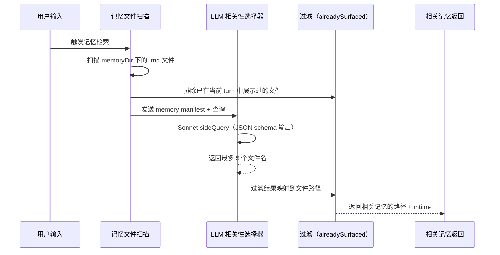

# 第 15 章：记忆系统

Claude Code 的记忆系统不是一个"上下文文件"，而是一个三层作用域、自动发现检索、LLM 驱动相关性选择的持久化知识管线。记忆不是主循环的临时变量——它先经过目录解析、文件发现、安全校验，再注入 prompt 组装阶段。MEMORY.md 是索引文件，`.claude/projects/` 是存储目录，`findRelevantMemories` 是检索管线。

---

## 15.1 记忆作用域与三层模型

| 作用域 | 路径 | 共享范围 | 持久化 |
|--------|------|---------|-------|
| `user` | `~/.claude/agent-memory/` | 所有项目 | 跨项目 |
| `project` | `<cwd>/.claude/agent-memory/` | 项目级（VCS 共享） | 随项目 |
| `local` | `<cwd>/.claude/agent-memory-local/` | 仅本机 | 仅本机 |

```mermaid
flowchart TD
    SETTINGS[autoMemoryEnabled<br/>autoMemoryDirectory] --> ENABLE[是否启用自动记忆]
    settings[autoDreamEnabled<br/>claudeMdExcludes] --> ENABLE

    ENABLE --> OVERRIDE[覆盖优先级<br/>CLAUDE_COWORK_MEMORY_PATH_OVERRIDE<br/>policy → flag → local → user]
    OVERRIDE --> ROOT[记忆根目录解析器]
    ENABLE --> ROOT

    ROOT --> PRIVATE[私有项目记忆根目录<br/>remoteOrLocal/projects/项目标识/memory]
    ROOT --> TEAM[团队记忆目录<br/>join(root, "team")]

    PRIVATE --> ENTRY[MEMORY.md 入口文件]
    TEAM --> TEAMENTRY[团队 MEMORY.md]
    TEAMENTRY --> TEAMSAFE[路径安全检查]
    ENTRY --> LOADPROMPT[构建记忆提示词注入]
    TEAMSAFE --> LOADPROMPT

    LOADPROMPT --> SCAN[扫描记忆文件<br/>getMemoryFiles / getLargeMemoryFiles]
    SCAN --> PROMPT[合并后的记忆提示词]
    PROMPT --> LOOP[回合循环注入]
```

### 配置控制而非固定路径

记忆系统受到配置控制：
- `autoMemoryEnabled` — 开关
- `autoMemoryDirectory` — 自定义目录
- `autoDreamEnabled` — dream 功能开关
- `claudeMdExcludes` — 排除文件模式

这不是"单个固定 MEMORY.md"，而是可配置、可扩展、多来源的记忆子系统。

---

## 15.2 记忆扫描与文件发现

```typescript
// memoryScan.ts
export async function scanMemoryFiles(
  memoryDir: string,
  signal: AbortSignal,
): Promise<MemoryHeader[]> {
  // 1. 递归扫描目录，过滤 .md 文件（排除 MEMORY.md 本身）
  const entries = await readdir(memoryDir, { recursive: true })
  const mdFiles = entries.filter(f => f.endsWith('.md') && basename(f) !== 'MEMORY.md')

  // 2. 单遍读取：只读前 30 行（frontmatter 区域）
  const headerResults = await Promise.allSettled(
    mdFiles.map(async (relativePath): Promise<MemoryHeader> => {
      const filePath = join(memoryDir, relativePath)
      const { content, mtimeMs } = await readFileInRange(filePath, 0, 30)
      const { frontmatter } = parseFrontmatter(content, filePath)
      return {
        filename: relativePath,
        filePath,
        mtimeMs,
        description: frontmatter.description || null,
        type: parseMemoryType(frontmatter.type),
      }
    })
  )

  // 3. 按 mtime 降序排序，最多 200 个文件
  return headerResults
    .filter(r => r.status === 'fulfilled')
    .map(r => r.value)
    .sort((a, b) => b.mtimeMs - a.mtimeMs)
    .slice(0, 200)
}
```

### 200 个文件限制

**为什么限制为 200 个**——防止记忆目录无限膨胀。如果用户积累了 1000+ 个记忆文件，扫描全部会浪费启动时间和 API 调用。200 个文件（每个只读前 30 行）的总 IO 量可控。

### 单遍读取优化

不先 `stat` 再读取——`readFileInRange` 内部 `stat` 一次，同时返回内容和 mtime。这比"先 stat 排序再读取"的 syscall 数量减半，在常见情况下（文件数 ≤ 200）表现最优。

---

## 15.3 记忆相关性选择：LLM 驱动的检索

记忆系统不是关键词匹配——它用 Sonnet 模型来判断哪些记忆文件与当前用户查询相关：

```typescript
// findRelevantMemories.ts
const SELECT_MEMORIES_SYSTEM_PROMPT = `You are selecting memories that will be useful to Claude Code...
- If you are unsure if a memory will be useful, then do not include it. Be selective and discerning.
- If there are no memories that would clearly be useful, return an empty list.
- If a list of recently-used tools is provided, do not select memories that are usage reference or API documentation for those tools.
  DO still select memories containing warnings, gotchas, or known issues about those tools.
`
```

### 检索管线



### Side Query：异步 LLM 调用

```typescript
const result = await sideQuery({
  model: getDefaultSonnetModel(),
  system: SELECT_MEMORIES_SYSTEM_PROMPT,
  skipSystemPromptPrefix: true,
  messages: [{ role: 'user', content: `Query: ${query}\n\nAvailable memories:\n${manifest}` }],
  max_tokens: 256,
  output_format: {
    type: 'json_schema',
    schema: {
      type: 'object',
      properties: { selected_memories: { type: 'array', items: { type: 'string' } } },
      required: ['selected_memories'],
      additionalProperties: false,
    },
  },
  querySource: 'memdir_relevance',
})
```

**为什么用 sideQuery 而非主循环**——sideQuery 是独立于主循环的异步 API 调用。它不消费主循环的 token 预算，不阻塞主循环的执行。记忆检索可以在后台并行进行。

### 工具去重：避免记忆噪音

系统提示词中有一条重要规则：

> "If recently-used tools are provided, do not select memories that are usage reference or API documentation for those tools (Claude Code is already exercising them). DO still select memories containing warnings, gotchas, or known issues about those tools."

这意味着如果模型正在使用 `git commit`，不会选择 git 的用法参考文档（因为模型已经在执行这个命令了）。但会选择 git 的已知问题和注意事项——这正是主动使用时最需要的。

---

## 15.4 Team Memory：路径安全校验

团队记忆是项目级共享的记忆，但路径安全是最高优先级的关注点。实现中有大量路径校验：

| 校验 | 防御的攻击 |
|------|-----------|
| null byte 检查 | 路径截断攻击（`file.txt\0`） |
| `..` 与 `/` traversal 检查 | 目录遍历攻击 |
| URL 编码后的 traversal 检查 | URL 编码绕过（`%2e%2e%2f`） |
| Unicode normalize 后的 traversal 检查 | Unicode 规范化攻击 |
| symlink loop 与 escaping 检查 | symlink 逃逸 |
| containment 校验 | 必须 containment 在 team memory 目录下 |

```typescript
// 路径安全校验（简化）
function isPathSafe(requestedPath: string, baseDir: string): boolean {
  const normalized = path.resolve(normalize(unicodeNormalize(requestedPath)))
  const resolvedBase = path.resolve(baseDir)
  return normalized.startsWith(resolvedBase)
}
```

如果不 normalize，攻击者可以通过 `/some/path/.claude/agent-memory/../../../etc/passwd` 绕过 `startsWith` 检查。

---

## 15.5 MEMORY.md 索引：200 行截断

`MEMORY.md` 是记忆系统的索引文件，被预加载到系统提示中。它包含每个记忆文件的指针和简介。

**200 行限制**——索引文件超过 200 行会被截断。这保证了记忆索引不会无限增长，成为启动瓶颈。

MEMORY.md 的格式约定：
```markdown
- [Title](file.md) — one-line hook
```

每行约 150 字符，200 行最多约 30K 字符。这作为系统提示中的一段记忆索引是可接受的 token 量。

---

## 15.6 Session Memory 与 Autocompact 的协同

Session Memory 在 autocompact 中作为优先路径：

```typescript
// autoCompact.ts:288-310
const sessionMemoryResult = await trySessionMemoryCompaction(
  messages, toolUseContext.agentId, recompactionInfo.autoCompactThreshold,
)
if (sessionMemoryResult) {
  // Session memory 压缩成功，跳过昂贵的 compactConversation
  return { wasCompacted: true, compactionResult: sessionMemoryResult }
}
```

Session memory 压缩利用之前存储在 `.claude/` 目录中的记忆文件作为摘要替代，不需要额外调用 LLM。这是比调用 API 做摘要更廉价的路径。

---

## 15.7 Agent Memory 操作

Agent 有独立的持久记忆系统——存储在 `.claude/agent-memory/` 目录下。Agent 在启动时加载记忆 prompt，在运行期间通过 Read/Write/Edit 工具操作记忆文件。

### 三层作用域

| 作用域 | 路径 | 共享范围 |
|-------|------|---------|
| `user` | `~/.claude/agent-memory/<agentType>/` | 所有项目 |
| `project` | `<cwd>/.claude/agent-memory/<agentType>/` | 项目级（VCS 共享） |
| `local` | `<cwd>/.claude/agent-memory-local/<agentType>/` | 仅本机 |

Agent memory 通过 `isAgentMemoryPath()` 对路径做 `normalize()` 检查，防止路径遍历。

## 15.8 记忆提示词构建与注入

每次 LLM 调用前，系统构建记忆提示词并注入到系统提示的顶部：

```typescript
// buildMemoryPrompt.ts（简化）
async function buildMemoryPrompt(
  memoryDir: string,
  relevantFiles: string[],
): Promise<string> {
  let prompt = '<memory index>
'
  for (const file of relevantFiles) {
    const { content } = await readFile(file)
    prompt += `## ${basename(file)}
${takeFrontMatter(content)}
`
  }
  return prompt + '</memory index>
'
}
```

**只读前 30 行**——因为 frontmatter 在文件前 30 行内。读入完整的 1000 行记忆文件会浪费 IO 和内存。

### 记忆注入位置

```
System Prompt:
  1. 核心指令
  2. 工具定义
  3. 记忆提示词（MEMORY.md 索引 + 相关记忆文件内容）  ← 注入点
  4. 会话历史（已压缩）

User: 查询
```

记忆注入在工具定义之后、会话历史之前。这确保模型先理解"我是谁、我能做什么"，再理解"我之前的上下文是什么"。

---

## 15.9 路径安全检查：Agent 记忆安全

`isAgentMemoryPath()` 对路径做 `normalize()` 检查，防止 `..` 路径遍历绕过：

```typescript
// agentMemory.ts:69-70
const normalizedPath = normalize(absolutePath)
// then check if it starts with memory base path
```

如果不 normalize，攻击者可以通过 `/some/path/.claude/agent-memory/../../../etc/passwd` 绕过 `startsWith` 检查。

**记忆路径的三范围**：
- 用户级：`~/.claude/agent-memory/<agentType>/`
- 项目级：`<cwd>/.claude/agent-memory/<agentType>/`
- 本地级：`<cwd>/.claude/agent-memory-local/<agentType>/`

Agent 在启动时加载记忆 prompt，在运行期间通过 Read/Write/Edit 工具操作记忆文件。

---

## 15.10 MEMORY.md 索引机制

`MEMORY.md` 是记忆目录的索引文件。它包含每个记忆文件的指针和简介：

```markdown
# Memory Index

- [User preferences](user_preferences.md) - Role, background, preferences
- [Feedback](feedback.md) - Collaboration feedback
- [Project decisions](project_decisions.md) - Current project decisions
- [References](references.md) - Links to external resources
```

预取时只读取这个文件来决定哪些记忆值得加载。不读取完整的 1000 行记忆文件，只读入 frontmatter。

**200 行限制**——索引文件超过 200 行会被截断。这保证了记忆索引不会无限增长，成为启动瓶颈。

---

## 15.11 发现与检索管线

每次用户输入时，系统异步预取相关记忆：

```
User input → startRelevantMemoryPrefetch() → parallel search
  ├── `.claude/projects/` under memory files  
  ├── MEMORY.md index
  └── Sort by relevance, return top N
```

**为什么异步**——记忆预取不应该阻塞主交互——它 fire-and-forget，与模块加载并行运行。

---

## 15.6 内存目录的路径解析

内存文件的存储位置不是随意的——它由多层环境变量和设置控制：

```typescript
// paths.ts:223-235
function getAutoMemPath(): string {
  // 1. 全路径覆盖（最高优先级）
  const override = process.env.CLAUDE_COWORK_MEMORY_PATH_OVERRIDE
  if (override) return override
  
  // 2. settings.json 中的 trusted 配置
  const settings = getAutoMemoryDirectoryFromSettings()  // 来源: policy/local/user
  if (settings) return settings
  
  // 3. 默认: 使用规范化 git root 确保 worktree 共享
  return path.join(getMemoryBaseDir(), 'projects', sanitizeGitRoot(cwd()), 'memory/')
}
```

**Git root 规范化的意义**——同一项目的不同 worktree 共享同一个内存目录。这防止了同一项目在不同目录分支中创建重复的内存文件。

### Agent Memory 的三级目录

Agent 有自己的内存目录，按类型隔离：

```typescript
// agentMemory.ts:52-65
// User scope: <memoryBase>/agent-memory/<agentType>/
// Project scope: <cwd>/.claude/agent-memory/<agentType>/
// Local scope: <cwd>/.claude/agent-memory-local/<agentType>/
```

Local scope 特别重要——它可以通过 `CLAUDE_CODE_REMOTE_MEMORY_DIR` 远程挂载，使得远程容器中也有 Agent 本地内存。

---

## 15.7 路径安全：深度防御

Claude Code 的内存系统使用**深度防御**策略——不止一层检查：

### validateMemoryPath() — 第一层

```typescript
// paths.ts:109-150
function validateMemoryPath(path: string): ValidationResult {
  // 拒绝相对路径（必须是绝对路径）
  if (!path.startsWith('/')) return { valid: false, reason: 'Relative path' }
  
  // 拒绝短路径（防止 root 级别写入）
  if (path.length < 3) return { valid: false, reason: 'Path too short' }
  
  // 拒绝 Windows 盘符根（C:）
  if (/^[A-Z]:\/i.test(path)) return { valid: false, reason: 'Windows drive' }
  
  // 拒绝 UNC 路径（\\server\share）
  if (path.startsWith('\\\\')) return { valid: false, reason: 'UNC path' }
  
  // 拒绝包含 null 字节的（防止截断攻击）
  if (path.includes('\0')) return { valid: false, reason: 'Null byte' }
  
  // 拒绝平凡 tilde 展开（~/、~/..、~/. — 会匹配整个 $HOME）
  if (/^~(\/\.\.?)?$/.test(path)) return { valid: false, reason: 'Trivial tilde' }
  
  // NFC 规范化
  return { valid: true, normalized: path.normalize('NFC') }
}
```

### isAutoMemPath() — 第二层

```typescript
// paths.ts:274-278
function isAutoMemPath(path: string): boolean {
  const normalized = normalize(path)  // 防止 .. 遍历绕过
  const autoMemDir = getAutoMemPath()
  return normalized.startsWith(autoMemDir)
}
```

`normalize()` 防止 `../` 遍历攻击。即使路径通过了 `validateMemoryPath()`，`normalize()` 会解析所有 `..`，然后检查是否仍在内存目录内。

### Team Memory Path 验证 — 第三层

Team memory 使用双重验证：

```typescript
// teamMemPaths.ts:228-256
async function validateTeamMemWritePath(key: string): Promise<string | null> {
  // 第一遍: 快速 resolve() 检测明显遍历
  const resolved = path.resolve(teamDir, key)
  if (!resolved.startsWith(teamDir)) return null  // 遍历攻击
  
  // 第二遍: 深层 symlink 解析
  const realpath = await realpathDeepestExisting(resolved)
  if (!realpath.startsWith(teamDir)) return null  // symlink 逃逸
  return key
}
```

**`realpathDeepestExisting()`** — 向上遍历目录树直到 realpath 成功，处理悬空符号链接（通过 lstat 检查）。这是正确的——即使目标文件不存在，也可以验证路径的前缀。

### Agent Memory 路径检测

```typescript
// agentMemory.ts:68-103
function isAgentMemoryPath(path: string): boolean {
  const normalized = normalize(path)
  return (
    normalized.startsWith(getUserScopeMemoryDir()) ||   // User scope
    normalized.startsWith(getProjectScopeMemoryDir()) ||  // Project scope
    normalized.startsWith(getLocalScopeMemoryDir())       // Local scope
  )
}
```

### Shell 命令针对内存路径的检测

```typescript
// memoryFileDetection.ts
function isShellCommandTargetingMemory(command: string): boolean {
  // 从 shell 命令中提取绝对路径并检查是否针对内存目录
  const paths = extractAbsolutePaths(command)
  return paths.some(p => isMemoryDirectory(p))
}
```

这使得 BashTool 在权限检查中可以识别：用户是否试图通过 shell 命令写入内存目录。

---

## 15.8 内存扫描与相关性检索

### scanMemoryFiles() — 单层读取

```typescript
// memoryScan.ts:35-77
function scanMemoryFiles(memoryDir: string): MemoryHeader[] {
  // 递归读取 .md 文件（排除 MEMORY.md）
  // 使用 readFileInRange() 单层读取前 30 行获取 frontmatter
  // 避免双重 stat（先 stat 大小再 read 的低效模式）
  // 按 mtime 倒序排列，最多 200 个文件
  return entries
    .sort((a, b) => b.mtimeMs - a.mtimeMs)
    .slice(0, 200)
}
```

**为何只读前 30 行**——frontmatter 通常在文件顶部 10-15 行。读取更多行会浪费 I/O。30 行是一个安全上限——即使格式不规范的 frontmatter 也不会超过这个范围。

### findRelevantMemories() — Sonnet 侧查询选择

```typescript
// findRelevantMemories.ts:39-75
async function findRelevantMemories(
  query: string,
  memories: MemoryHeader[],
  alreadySurfaced: Set<string>,
  recentlyUsedTools: Set<string>,
): Promise<SelectedMemory[]> {
  // 1. 格式化 manifest:
  //    - [type] filename.md (ISO-timestamp): description
  // 2. 过滤 alreadySurfaced 的路径
  // 3. 过滤最近使用工具的工具参考文档（正在使用中不需要参考）
  // 4. Sonnet 侧查询: 选择最多 5 个最相关的
  // 5. 只返回 Sonnet "确定" 有用的 memories
}
```

**为何用侧查询而非主模型**——主模型已经在处理用户的查询了。用同一上下文窗口的额外查询会增加主循环的成本。侧查询使用 Sonnet（更快更便宜），并且有独立的上下文窗口——与主查询隔离。

### 空列表是合法结果

```typescript
// 不强制选择——如果侧查询确定没有相关的，返回空
if (noRelevant) return []
```

这是 fail-safe 的——如果没有相关的内存，返回空的列表，主循环继续在无额外上下文的情况下运行。

---

## 15.9 内存老化与时间处理

```typescript
// memoryAge.ts
function memoryAgeDays(mtimeMs: number): number {
  const msSinceModified = Date.now() - mtimeMs
  return Math.floor(msSinceModified / (1000 * 60 * 60 * 24))
}

function memoryFreshnessText(mtimeMs: number): string {
  if (memoryAgeDays(mtimeMs) > 1) {
    return `This memory is ${memoryAge(mtimeMs)} old. ` +
      'Memories are point-in-time observations, not live state -- ' +
      'claims about code behavior or file:line citations may be outdated. ' +
      'Verify against current code before asserting as fact.'
  }
  return ''
}
```

**新鲜度警告的语义**——1 天以上的内存附带新鲜度警告。这是提醒模型：内存是**时间点观察**，不是当前状态。代码可能已经改变——在推荐之前验证当前文件。

---

## 15.10 内存提取的并发控制

### 互斥：主 Agent vs 后台提取器

```typescript
// extractMemories.ts:121-148
// 互斥逻辑:
if (mainAgentAlreadyWroteMemories) {
  // 主 Agent 已经写了内存 → 后台提取器跳过
  advanceCursor()
  return
}
```

**合并调用**（lines 557-563）：
```typescript
// 如果提取正在进行中，存储上下文以便拖尾运行
if (extractionInProgress) {
  stashContextForTrailingRun()
  return
}
```

这防止了两个提取器同时运行并覆盖彼此的结果。

### 工具限制：自动内存 CanUseTool

```typescript
// extractMemories.ts:171-222
function createAutoMemCanUseTool(): CanUseToolFn {
  // 允许: Read, Grep, Glob（无限制）
  // 允许: Bash（仅只读命令）
  // 允许: Edit/Write（仅限 isAutoMemPath() 内的路径）
  // 允许: REPL
  // 拒绝: 其他一切
}
```

后台提取器的工具访问权限比主 Agent 更严格——它只能读取和写入内存目录。这防止了提取器意外修改项目文件。

### 限流与最大轮次

```typescript
// extractMemories.ts
const throttledTurns = getFeatureValue('tengu_bramble_lintel', 1)  // 默认每 1 轮提取一次
const maxTurns = 5  // 防止验证兔子洞
```

### Agent Memory Snapshots

项目级内存通过快照共享：
```
快照路径: <cwd>/.claude/agent-memory-snapshots/<agentType>/snapshot.json
跟踪文件: .snapshot-synced.json（记录最后同步时间戳）

操作:
- initializeFromSnapshot(): 首次从快照复制内存文件到本地目录
- replaceFromSnapshot(): 替换本地内存（先删除孤立的 .md 文件）
```

---

## 15.11 会话内存：自动维护的对话笔记

会话内存作为**后采样钩子**运行：

```typescript
// sessionMemory.ts
registerPostSamplingHook(extractSessionMemory)
```

### 提取触发条件

```typescript
// shouldExtractMemory() — lines 134-181
// 初始化阈值: 上下文必须超过 minimumMessageTokensToInit (默认 10,000 tokens)
// 更新阈值: 自上次提取以来上下文增长必须超过 minimumTokensBetweenUpdate (默认 5,000 tokens)
// 工具调用阈值: 自上次更新以来至少有 toolCallsBetweenUpdates 次工具调用（默认 3）
// 或：最后一个助手轮没有工具调用 且 token 阈值满足（对话间断）
```

### 会话内存模板

```markdown
# Session Title
# Current State
# Task specification
# Files and Functions  # 关键文件和函数引用
# Workflow             # 工作流程和约定
# Errors & Corrections # 错误及修正
# Codebase and System Documentation
# Learnings
# Key results
# Worklog
```

### 会话内存压缩

```typescript
// sessionMemoryCompact.ts:514-630
function trySessionMemoryCompaction(): {
  // 使用会话内存内容而非传统的摘要
  // 保留 minTokens (10,000) + minTextBlockMessages (5) 在最后总结 ID 之后
  // 上限 maxTokens (40,000)
  // 超大内存部分在注入前被截断
}
```

---

## 15.8 CLAUDE.md 加载管线

`claudemd.ts`——四层指令文件加载（优先级从低到高，后加载的模型优先级更高）：

| 层级 | 路径 | 描述 |
|------|------|------|
| Managed | `/etc/claude-code/CLAUDE.md` | 全局策略，始终加载 |
| User | `~/.claude/CLAUDE.md` | 仅当 `isSettingSourceEnabled('userSettings')` |
| Project | `CLAUDE.md`、`.claude/CLAUDE.md`、`.claude/rules/*.md` | 从 CWD 向上遍历至根 |
| Local | `CLAUDE.local.md` | 仅当 `isSettingSourceEnabled('localSettings')` |

**`getMemoryFiles()`**（行 790，`lodash-es/memoize`）遍历从 CWD 向上到文件系统根：
```typescript
let currentDir = getOriginalCwd()
while (currentDir !== parse(currentDir).root) {
  dirs.push(currentDir)
  currentDir = dirname(currentDir)
}
```

目录从根向 CWD 处理（`dirs.reverse()`），这样靠近 CWD 的文件加载更晚，获得更高优先级。

其他目录来自 `/add-dir`，当环境变量 `CLAUDE_CODE_ADDITIONAL_DIRECTORIES_CLAUDE_MD` 为真时加载。

---

## 15.9 Auto-Memory 路径安全

`memdir/paths.ts`——严格的优先级链：

1. `CLAUDE_COWORK_MEMORY_PATH_OVERRIDE` 环境变量
2. `settings.json` 中的 `autoMemoryDirectory`（仅可信来源：policy/local/user；**projectSettings 被明确排除**——防止恶意仓库设置 `autoMemoryDirectory: "~/.ssh"`）
3. `<memoryBase>/projects/<sanitized-git-root>/memory/`——`findCanonicalGitRoot()` 使同一仓库的 worktree 共享同一 auto-memory 目录

**`validateMemoryPath()`** 五重拒绝检查：
```typescript
const normalized = normalize(candidate).replace(/[/\]+$/, '')
if (
  !isAbsolute(normalized) ||           // 拒绝相对路径
  normalized.length < 3 ||             // 拒绝根/近根
  /^[A-Za-z]:$/.test(normalized) ||    // 拒绝 Windows 驱动器根
  normalized.startsWith('\\') ||      // 拒绝 UNC 路径
  normalized.startsWith('//') ||
  normalized.includes('')            // 拒绝 null 字节
) {
  return undefined
}
return (normalized + sep).normalize('NFC')
```

**`isAutoMemPath()`**——由于 `getAutoMemPath()` 始终返回带一个 trailing `sep` 的路径，前缀攻击如 `/foo/memory-evil` 被分隔符阻止。

---

## 15.10 Team Memory 两层路径验证

`teamMemPaths.ts`——Team memory 使用**两遍防御**：

**Pass 1**——`resolve()` 的字符串级包含：
```typescript
const resolvedPath = resolve(filePath)
if (!resolvedPath.startsWith(teamDir)) {
  throw new PathTraversalError(...)
}
```

**Pass 2**——`realpathDeepestExisting()` 符号链接解析：
- 向上遍历目录树调用 `realpath()` 直到成功
- 对不存在的文件，弹出尾部并 realpath 父目录
- 通过 `lstat()` 检测悬空符号���接——`lstat` 在目标缺失的链接上成功但 `realpath` 失败
- 检测符号链接循环（ELOOP）
- 解析后 `isRealPathWithinTeamDir()` 使用 `startsWith(realTeamDir + sep)` 比较规范文件系统位置

**`sanitizePathKey()`**（行 22）阻止：null 字节、URL 编码遍历（`%2e%2e%2f`）、Unicode 规范化攻击（NFKC 全角点）、反斜杠、绝对路径键。

---

## 15.11 Memory 扫描与格式

`memoryScan.ts`——`scanMemoryFiles()`（行 35）：
- `readdir(memoryDir, { recursive: true })` 获取所有条目
- 过滤为 `.md` 文件，排除 `MEMORY.md`
- 单次遍历：`readFileInRange()` 读取前 30 行获取 frontmatter + 返回 mtimeMs
- 解析 frontmatter 的 `description` 和 `type` 字段
- 按最新排序，上限 200 文件
- 结果：`MemoryHeader[]` 含 filename、filePath、mtimeMs、description、type

`formatMemoryManifest()`（行 84）格式化行为：
```
- [user] user_preferences.md (2026-04-01T10:30:00Z): User prefers concise responses
```

---

## 15.12 Memory 相关性选择

`findRelevantMemories.ts`——`findRelevantMemories()` 委托给 `selectRelevantMemories()`，调用 `sideQuery()`（默认 Sonnet 模型，结构化 JSON 输出）：

```json
{ "selected_memories": ["file1.md", "file2.md"] }
```

每次查询最多选 5 条。过滤已出现的文件（`alreadySurfaced` 集合）。最近工具作为上下文传递给选择器以避免重新展示工具参考文档。

## 15.13 后台 Memory Extract**

`extractMemories/extractMemories.ts`——在每个查询循环结束时通过 `handleStopHooks` 触发：

**关闭作用域的状态**（`initExtractMemories()` 内部）：
- `lastMemoryMessageUuid`——游标追踪已处理的消息
- `inFlightExtractions`——待定提取的 Promise 集合
- `inProgress`——防止重叠运行
- `turnsSinceLastExtraction`——节流计数（通过 `tengu_bramble_lintel` 配置）

**与主 Agent 写入的互斥**（`hasMemoryWritesSince()`，行 121）——检测游标后针对 auto-memory 路径的任何 Write/Edit tool_use 块。如找到，跳过 forked agent 并推进游标超出范围——主 Agent 和后台 agent 每轮互斥。

**提取 fork 的工具权限**（`createAutoMemCanUseTool()`，行 171）：
- 允许：`FileReadTool`、`GrepTool`、`GlobTool`（无限制，只读）
- 允许：`BashTool` 仅对只读命令
- 允许：`FileEditTool`/`FileWriteTool` **仅**针对 auto-memory 目录内的路径
- 拒绝：其他所有（MCP、Agent、写能力 Bash、REPL）

---

## 15.14 Auto-Dream：记忆合并

`autoDream.ts`——夜间后台合并。门控检查（从最便宜到最贵）：
1. 时间门控：`lastConsolidatedAt` 以来的小时数 >= `minHours`（默认 24h）
2. 会话门控：mtime > `lastConsolidatedAt` 的会话目录数 >= `minSessions`（默认 5）
3. 锁：`tryAcquireConsolidationLock()`——文件锁防止并发合并
4. 扫描节流：扫描间最小 10 分钟

Dream agent 审查会话 ID（排除当前会话），通过 `buildConsolidationPrompt()` 构建提示，运行受限制的 forked agent，只能执行只读 Bash + auto-memory 目录内的 Edit/Write。

---

## 15.15 Session Memory（每会话笔记）

`SessionMemory/sessionMemory.ts`——与 auto-memory 不同的系统：

- `setupSessionMemoryFile()` 创建设目录 + 内存文件，权限 `0o600`
- `shouldExtractMemory()` 检查：初始化阈值、token 阈值、工具调用阈值、最后一次 assistant turn 无工具调用（自然对话断点）
- 使用 forked agent，`createMemoryFileCanUseTool()` 仅允许对该确切内存文件路径的 `FileEditTool`
- 成功后更新 `lastSummarizedMessageId` 追踪压缩边界

---

## 15.16 @ 包含指令

CLAUDE.md 加载系统支持 `@path` 包含指令：
- `@path`（相对）、`@./path`（显式相对）、`@~/path`（home）、`@/path`（绝对）
- 仅在叶子文本节点生效（不在代码块或代码字符串内）
- 通过 `marked` lexer tokenize 和 `extractIncludePathsFromTokens()` 实现
- 通过 `processedPaths` 集合和规范化路径比对防止循环引用
- 外部包含（原始 CWD 外的路径）受 `config.hasClaudeMdExternalIncludesApproved` 门控

---

## 15.17 条件规则

`.claude/rules/*.md` 中的文件可有 frontmatter `paths:` 字段：
```yaml
---
paths:
  - src/**/*.ts
  - test/**
---
```

`processConditionedMdRules()` 使用 `picomatch` 匹配目标文件路径与 glob 模式。仅加载匹配规则。

## 15.18 MEMORY.md 入口点截断

`memdir.ts`——常量：
- `ENTRYPOINT_NAME = 'MEMORY.md'`
- `MAX_ENTRYPOINT_LINES = 200`
- `MAX_ENTRYPOINT_BYTES = 25_000`

`truncateEntrypointContent()`（行 57）：
- 先截断到 200 行，再在最后一个换行处按 25,000 字节截断
- 附加一个命名哪个上限触发的警告

---
