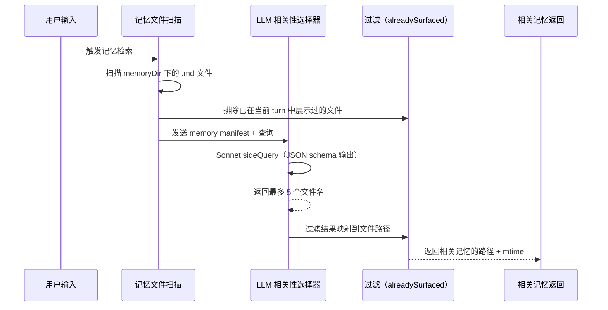

# 第 15 章：记忆系统

Claude Code 的记忆系统不是一个"上下文文件"，而是一个三层作用域、自动发现检索、LLM 驱动相关性选择的持久化知识管线。记忆不是主循环的临时变量——它先经过目录解析、文件发现、安全校验，再注入 prompt 组装阶段。MEMORY.md 是索引文件，`.claude/projects/` 是存储目录，`findRelevantMemories` 是检索管线。

---

## 15.1 记忆作用域与三层模型

| 作用域 | 路径 | 共享范围 | 持久化 |
|--------|------|---------|-------|
| `user` | `~/.claude/agent-memory/` | 所有项目 | 跨项目 |
| `project` | `<cwd>/.claude/agent-memory/` | 项目级（VCS 共享） | 随项目 |
| `local` | `<cwd>/.claude/agent-memory-local/` | 仅本机 | 仅本机 |

```mermaid
flowchart TD
    SETTINGS[autoMemoryEnabled<br/>autoMemoryDirectory] --> ENABLE[是否启用自动记忆]
    settings[autoDreamEnabled<br/>claudeMdExcludes] --> ENABLE

    ENABLE --> OVERRIDE[覆盖优先级<br/>CLAUDE_COWORK_MEMORY_PATH_OVERRIDE<br/>policy → flag → local → user]
    OVERRIDE --> ROOT[记忆根目录解析器]
    ENABLE --> ROOT

    ROOT --> PRIVATE[私有项目记忆根目录<br/>remoteOrLocal/projects/项目标识/memory]
    ROOT --> TEAM[团队记忆目录<br/>join(root, "team")]

    PRIVATE --> ENTRY[MEMORY.md 入口文件]
    TEAM --> TEAMENTRY[团队 MEMORY.md]
    TEAMENTRY --> TEAMSAFE[路径安全检查]
    ENTRY --> LOADPROMPT[构建记忆提示词注入]
    TEAMSAFE --> LOADPROMPT

    LOADPROMPT --> SCAN[扫描记忆文件<br/>getMemoryFiles / getLargeMemoryFiles]
    SCAN --> PROMPT[合并后的记忆提示词]
    PROMPT --> LOOP[回合循环注入]
```

### 配置控制而非固定路径

记忆系统受到配置控制：
- `autoMemoryEnabled` — 开关
- `autoMemoryDirectory` — 自定义目录
- `autoDreamEnabled` — dream 功能开关
- `claudeMdExcludes` — 排除文件模式

这不是"单个固定 MEMORY.md"，而是可配置、可扩展、多来源的记忆子系统。

---

## 15.2 记忆扫描与文件发现

```typescript
// memoryScan.ts
export async function scanMemoryFiles(
  memoryDir: string,
  signal: AbortSignal,
): Promise<MemoryHeader[]> {
  // 1. 递归扫描目录，过滤 .md 文件（排除 MEMORY.md 本身）
  const entries = await readdir(memoryDir, { recursive: true })
  const mdFiles = entries.filter(f => f.endsWith('.md') && basename(f) !== 'MEMORY.md')

  // 2. 单遍读取：只读前 30 行（frontmatter 区域）
  const headerResults = await Promise.allSettled(
    mdFiles.map(async (relativePath): Promise<MemoryHeader> => {
      const filePath = join(memoryDir, relativePath)
      const { content, mtimeMs } = await readFileInRange(filePath, 0, 30)
      const { frontmatter } = parseFrontmatter(content, filePath)
      return {
        filename: relativePath,
        filePath,
        mtimeMs,
        description: frontmatter.description || null,
        type: parseMemoryType(frontmatter.type),
      }
    })
  )

  // 3. 按 mtime 降序排序，最多 200 个文件
  return headerResults
    .filter(r => r.status === 'fulfilled')
    .map(r => r.value)
    .sort((a, b) => b.mtimeMs - a.mtimeMs)
    .slice(0, 200)
}
```

### 200 个文件限制

**为什么限制为 200 个**——防止记忆目录无限膨胀。如果用户积累了 1000+ 个记忆文件，扫描全部会浪费启动时间和 API 调用。200 个文件（每个只读前 30 行）的总 IO 量可控。

### 单遍读取优化

不先 `stat` 再读取——`readFileInRange` 内部 `stat` 一次，同时返回内容和 mtime。这比"先 stat 排序再读取"的 syscall 数量减半，在常见情况下（文件数 ≤ 200）表现最优。

---

## 15.3 记忆相关性选择：LLM 驱动的检索

记忆系统不是关键词匹配——它用 Sonnet 模型来判断哪些记忆文件与当前用户查询相关：

```typescript
// findRelevantMemories.ts
const SELECT_MEMORIES_SYSTEM_PROMPT = `You are selecting memories that will be useful to Claude Code...
- If you are unsure if a memory will be useful, then do not include it. Be selective and discerning.
- If there are no memories that would clearly be useful, return an empty list.
- If a list of recently-used tools is provided, do not select memories that are usage reference or API documentation for those tools.
  DO still select memories containing warnings, gotchas, or known issues about those tools.
`
```

### 检索管线



### Side Query：异步 LLM 调用

```typescript
const result = await sideQuery({
  model: getDefaultSonnetModel(),
  system: SELECT_MEMORIES_SYSTEM_PROMPT,
  skipSystemPromptPrefix: true,
  messages: [{ role: 'user', content: `Query: ${query}\n\nAvailable memories:\n${manifest}` }],
  max_tokens: 256,
  output_format: {
    type: 'json_schema',
    schema: {
      type: 'object',
      properties: { selected_memories: { type: 'array', items: { type: 'string' } } },
      required: ['selected_memories'],
      additionalProperties: false,
    },
  },
  querySource: 'memdir_relevance',
})
```

**为什么用 sideQuery 而非主循环**——sideQuery 是独立于主循环的异步 API 调用。它不消费主循环的 token 预算，不阻塞主循环的执行。记忆检索可以在后台并行进行。

### 工具去重：避免记忆噪音

系统提示词中有一条重要规则：

> "If recently-used tools are provided, do not select memories that are usage reference or API documentation for those tools (Claude Code is already exercising them). DO still select memories containing warnings, gotchas, or known issues about those tools."

这意味着如果模型正在使用 `git commit`，不会选择 git 的用法参考文档（因为模型已经在执行这个命令了）。但会选择 git 的已知问题和注意事项——这正是主动使用时最需要的。

---

## 15.4 Team Memory：路径安全校验

团队记忆是项目级共享的记忆，但路径安全是最高优先级的关注点。实现中有大量路径校验：

| 校验 | 防御的攻击 |
|------|-----------|
| null byte 检查 | 路径截断攻击（`file.txt\0`） |
| `..` 与 `/` traversal 检查 | 目录遍历攻击 |
| URL 编码后的 traversal 检查 | URL 编码绕过（`%2e%2e%2f`） |
| Unicode normalize 后的 traversal 检查 | Unicode 规范化攻击 |
| symlink loop 与 escaping 检查 | symlink 逃逸 |
| containment 校验 | 必须 containment 在 team memory 目录下 |

```typescript
// 路径安全校验（简化）
function isPathSafe(requestedPath: string, baseDir: string): boolean {
  const normalized = path.resolve(normalize(unicodeNormalize(requestedPath)))
  const resolvedBase = path.resolve(baseDir)
  return normalized.startsWith(resolvedBase)
}
```

如果不 normalize，攻击者可以通过 `/some/path/.claude/agent-memory/../../../etc/passwd` 绕过 `startsWith` 检查。

---

## 15.5 MEMORY.md 索引：200 行截断

`MEMORY.md` 是记忆系统的索引文件，被预加载到系统提示中。它包含每个记忆文件的指针和简介。

**200 行限制**——索引文件超过 200 行会被截断。这保证了记忆索引不会无限增长，成为启动瓶颈。

MEMORY.md 的格式约定：
```markdown
- [Title](file.md) — one-line hook
```

每行约 150 字符，200 行最多约 30K 字符。这作为系统提示中的一段记忆索引是可接受的 token 量。

---

## 15.6 Session Memory 与 Autocompact 的协同

Session Memory 在 autocompact 中作为优先路径：

```typescript
// autoCompact.ts:288-310
const sessionMemoryResult = await trySessionMemoryCompaction(
  messages, toolUseContext.agentId, recompactionInfo.autoCompactThreshold,
)
if (sessionMemoryResult) {
  // Session memory 压缩成功，跳过昂贵的 compactConversation
  return { wasCompacted: true, compactionResult: sessionMemoryResult }
}
```

Session memory 压缩利用之前存储在 `.claude/` 目录中的记忆文件作为摘要替代，不需要额外调用 LLM。这是比调用 API 做摘要更廉价的路径。

---

## 15.7 Agent Memory 操作

Agent 有独立的持久记忆系统——存储在 `.claude/agent-memory/` 目录下。Agent 在启动时加载记忆 prompt，在运行期间通过 Read/Write/Edit 工具操作记忆文件。

### 三层作用域

| 作用域 | 路径 | 共享范围 |
|-------|------|---------|
| `user` | `~/.claude/agent-memory/<agentType>/` | 所有项目 |
| `project` | `<cwd>/.claude/agent-memory/<agentType>/` | 项目级（VCS 共享） |
| `local` | `<cwd>/.claude/agent-memory-local/<agentType>/` | 仅本机 |

Agent memory 通过 `isAgentMemoryPath()` 对路径做 `normalize()` 检查，防止路径遍历。

## 15.8 记忆提示词构建与注入

每次 LLM 调用前，系统构建记忆提示词并注入到系统提示的顶部：

```typescript
// buildMemoryPrompt.ts（简化）
async function buildMemoryPrompt(
  memoryDir: string,
  relevantFiles: string[],
): Promise<string> {
  let prompt = '<memory index>
'
  for (const file of relevantFiles) {
    const { content } = await readFile(file)
    prompt += `## ${basename(file)}
${takeFrontMatter(content)}
`
  }
  return prompt + '</memory index>
'
}
```

**只读前 30 行**——因为 frontmatter 在文件前 30 行内。读入完整的 1000 行记忆文件会浪费 IO 和内存。

### 记忆注入位置

```
System Prompt:
  1. 核心指令
  2. 工具定义
  3. 记忆提示词（MEMORY.md 索引 + 相关记忆文件内容）  ← 注入点
  4. 会话历史（已压缩）

User: 查询
```

记忆注入在工具定义之后、会话历史之前。这确保模型先理解"我是谁、我能做什么"，再理解"我之前的上下文是什么"。
