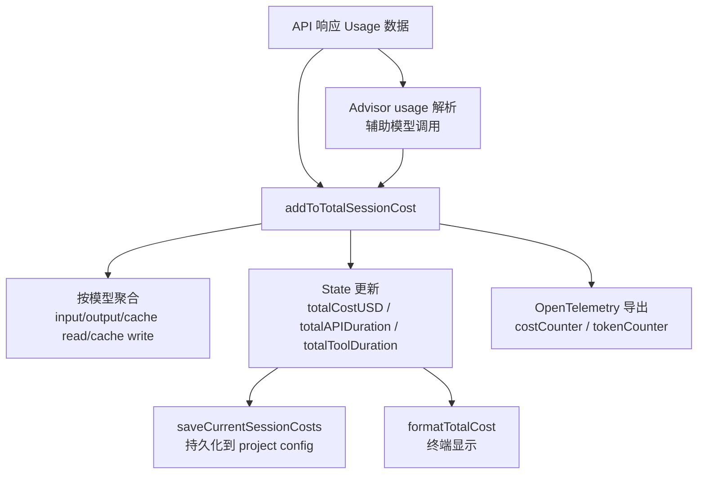

# 第 16 章：成本追踪与分析

Claude Code 的成本与可观测性系统贯穿整个会话生命周期。从每笔 API 调用的 token 计数、到按模型的用量聚合、到 token 预算的查询级控制、再到 API 429 限流的指数退避重试——这是一个多层防线系统，防止成本失控、会话阻塞和 API 滥用。

---

## 16.1 成本追踪管线



### State 中的计量字段

```typescript
// bootstrap/state.ts（计量层）
totalCostUSD: number                    // 累计成本（美元）
totalAPIDuration: number               // 累计 API 延迟
totalAPIDurationWithoutRetries: number  // 不计重试延迟
totalToolDuration: number               // 累计工具执行时间
totalLinesAdded: number                 // 代码新增行数
totalLinesRemoved: number               // 代码删除行数
totalInputTokens: number               // 总输入 token
totalOutputTokens: number              // 总输出 token
totalCacheReadInputTokens: number       // 缓存读取 token
totalCacheCreationInputTokens: number   // 缓存创建 token
totalWebSearchRequests: number          // Web 搜索请求次数
```

### 按模型的用量聚合

`cost-tracker.ts` 按模型名聚合 token 和成本：

```typescript
// cost-tracker.ts
interface ModelUsage {
  inputTokens: number
  outputTokens: number
  cacheReadInputTokens: number
  cacheCreationInputTokens: number
  webSearchRequests: number
  costUSD: number
  contextWindow: number        // 上下文窗口大小
  maxOutputTokens: number      // 最大输出 token 限制
}
```

每次 API 响应返回 `usage` 数据后，系统更新对应模型的聚合值：

```typescript
modelUsage.inputTokens += usage.input_tokens
modelUsage.outputTokens += usage.output_tokens
modelUsage.cacheReadInputTokens += usage.cache_read_input_tokens ?? 0
modelUsage.cacheCreationInputTokens += usage.cache_creation_input_tokens ?? 0
modelUsage.costUSD += cost
```

### Advisor 模型成本

主模型之外，Claude Code 还使用 Advisor 辅助模型（如分类器、摘要器）。Advisor 的成本被单独追踪并加入总成本：

```typescript
for (const advisorUsage of getAdvisorUsage(usage)) {
  const advisorCost = calculateUSDCost(advisorUsage.model, advisorUsage)
  totalCost += addToTotalSessionCost(advisorCost, advisorUsage, advisorUsage.model)
}
```

---

## 16.2 终端成本展示

会话结束时，终端以 dim 灰色显示汇总：

```
Total cost:            $0.42
Total duration (API):  1m 23s
Total duration (wall): 2m 45s
Total code changes:    127 lines added, 34 lines removed
Usage by model:
    claude-sonnet-4-5:  45,230 input, 12,876 output, 32,100 cache read, 8,450 cache write ($0.38)
    claude-haiku:        3,200 input, 1,100 output ($0.04)
```

格式化逻辑：
- 成本 > $0.5 时精确到 2 位小数
- 成本 ≤ $0.5 时精确到 4 位小数
- Token 数用千位分隔符格式化

---

## 16.3 Token 预算解析

用户可以在输入中指定 token 预算，系统解析后限制模型输出的 token 量：

```typescript
// tokenBudget.ts
const SHORTHAND_START_RE = /^\s*\+(\d+(?:\.\d+)?)\s*(k|m|b)\b/i   // "+500k" / "+2M"
const SHORTHAND_END_RE = /\s\+(\d+(?:\.\d+)?)\s*(k|m|b)\s*[.!?]?\s*$/i  // "... +500k."
const VERBOSE_RE = /\b(?:use|spend)\s+(\d+(?:\.\d+)?)\s*(k|m|b)\s*tokens?\b/i  // "use 2M tokens"
```

当预算耗尽时，注入 continuation 消息：

```typescript
export function getBudgetContinuationMessage(pct, turnTokens, budget): string {
  return `Stopped at ${pct}% of token target (${fmt(turnTokens)} / ${fmt(budget)}). Keep working — do not summarize.`
}
```

**"do not summarize" 的原因**——防止模型在预算耗尽时简单地总结之前的工作，而不是继续执行。用户指定预算是希望模型在预算范围内"继续工作"，而非"总结已经做了什么"。

### Token 估算：主循环中的预算决策

在 API 调用前，系统需要估算消息的 token 消耗来判断是否需要压缩：

```typescript
// services/tokenEstimation.ts
const TOKEN_COUNT_THINKING_BUDGET = 1024
const TOKEN_COUNT_MAX_TOKENS = 2048
```

token estimation 通过直接调用 API 的 `countTokens` 接口（Anthropic / Bedrock / Vertex 均有对应实现）。与简单字符计数相比，真实 token 估算精确 3-5 倍。

### 工具搜索字段剥离

`stripToolSearchFieldsFromMessages` 在发送 token 计数前剥离工具搜索特有字段——`tool_use` block 中的 `caller` 字段和 `tool_result` 中的 `tool_reference` 字段。这些是工具搜索 beta 特有的，普通 API 调用会拒绝。`withTokenCountVCR` 实现 token 计数的缓存——同一消息的 token 计数结果可复用。

---

## 16.4 API 限流与指数退避

`withRetry.ts` 是 API 调用的重试引擎。不是简单的指数退避——而是一个多错误类型的智能重试策略，覆盖从 429 到 529 到 OAuth 失效的完整错误谱。

### 重试策略矩阵

| 错误类型 | 重试行为 | 原因 |
|----------|---------|------|
| 429 Rate limit | 指数退避重试 | 临时容量限制 |
| 529 Overloaded | 最多 3 次重试，触发 fallback | 服务器过载 |
| 408 Timeout | 指数退避重试 | 请求超时 |
| 409 Lock timeout | 重试 | 并发锁 |
| 401 Auth expired | 刷新 token 后重试 | OAuth token 过期 |
| 403 Token revoked | 强制刷新 token | 其他进程刷新了 token |
| 5xx Server error | 重试 | 内部错误 |
| ECONNRESET/EPIPE | 禁用 keep-alive，重连 | 陈旧的连接 |

### 指数退避算法

```typescript
// withRetry.ts:530-548
export function getRetryDelay(
  attempt: number,
  retryAfterHeader?: string | null,
  maxDelayMs = 32000,
): number {
  if (retryAfterHeader) {
    const seconds = parseInt(retryAfterHeader, 10)
    if (!isNaN(seconds)) return seconds * 1000  // 优先使用 Retry-After header
  }
  const baseDelay = Math.min(BASE_DELAY_MS * Math.pow(2, attempt - 1), maxDelayMs)
  const jitter = Math.random() * 0.25 * baseDelay  // 25% 抖动
  return baseDelay + jitter
}
```

退避时间线：
```
第 1 次失败 → 500ms + jitter → retry
第 2 次失败 → 1s + jitter → retry
第 3 次失败 → 2s + jitter → retry
第 4 次失败 → 4s + jitter → retry
第 5 次失败 → 8s + jitter → retry
...
最大延迟 → 32s（默认）
```

默认最多重试 10 次。可通过 `CLAUDE_CODE_MAX_RETRIES` 环境变量覆盖。

### 529 错误：Fallback 机制

连续 3 次 529 错误后触发模型 fallback：

```typescript
const MAX_529_RETRIES = 3

if (consecutive529Errors >= MAX_529_RETRIES) {
  if (options.fallbackModel) {
    throw new FallbackTriggeredError(options.model, options.fallbackModel)
  }
  throw new CannotRetryError(new Error(REPEATED_529_ERROR_MESSAGE), retryContext)
}
```

### 快速模式冷却

Fast mode 遇到 429/529 时进入冷却期：

```typescript
const DEFAULT_FAST_MODE_FALLBACK_HOLD_MS = 30 * 60 * 1000  // 30 分钟
const SHORT_RETRY_THRESHOLD_MS = 20 * 1000                  // 20 秒
const MIN_COOLDOWN_MS = 10 * 60 * 1000                      // 10 分钟
```

**为什么区分快慢路径**——如果 `Retry-After: 15s`，等待 15 秒后重试可以保留 prompt cache（同一个 model name）。如果 `Retry-After: 5min`，切换到标准速度模型虽然 cache miss，但至少可以继续执行。

### 持久重试模式

`CLAUDE_CODE_UNATTENDED_RETRY=true` 时启用，chunk sleep 为 30 秒心跳块：

```typescript
const PERSISTENT_MAX_BACKOFF_MS = 5 * 60 * 1000    // 5 分钟最大退避
const PERSISTENT_RESET_CAP_MS = 6 * 60 * 60 * 1000 // 6 小时重置上限
const HEARTBEAT_INTERVAL_MS = 30_000                // 30 秒心跳
```

---

## 16.5 OpenTelemetry 与可观测性

```typescript
// bootstrap/state.ts 中的遥测层
meter: Meter
costCounter: BatchObservable
tokenCounter: BatchObservable
loggerProvider: LoggerProvider
tracerProvider: TracerProvider
```

### 关键事件

```typescript
logEvent('tengu_api_retry', { attempt, delayMs, error, status, provider })
logEvent('tengu_api_opus_fallback_triggered', { original_model, fallback_model })
logEvent('tengu_advisor_tool_token_usage', { advisor_model, cost_usd_micros })
```

---

## 16.6 会话成本持久化

```typescript
export function saveCurrentSessionCosts() {
  saveCurrentProjectConfig(current => ({
    ...current,
    lastCost: getTotalCostUSD(),
    lastModelUsage: Object.fromEntries(...),
    lastSessionId: getSessionId(),
  }))
}

export function restoreCostStateForSession(sessionId: string): boolean {
  const data = getStoredSessionCosts(sessionId)
  if (data) { setCostStateForRestore(data); return true }
  return false
}
```

用户重启会话时，之前的 token 消耗和成本不丢失——session ID 匹配时恢复之前的累计成本。

---

## 16.7 模型选择与成本权衡

### 按模型计费

Claude Code 不只是追踪总成本，还追踪每个模型的用量：

```typescript
// cost-tracker.ts
const modelUsage: Record<string, ModelUsage> = {
  'claude-sonnet-4-5': { inputTokens: 12000, outputTokens: 3500, costUSD: 0.38 },
  'claude-haiku': { inputTokens: 2000, outputTokens: 800, costUSD: 0.04 },
  'claude-opus': { inputTokens: 5000, outputTokens: 1500, costUSD: 0.85 },
}
```

**为什么需要按模型追踪**——不同模型单价不同。Sonnet ~$15/$10 per M tokens，Opus ~$75/$10 per M tokens。混合使用模型时，只追踪总成本不足以诊断"哪次调用最贵"。

### Advisor 模型成本

主模型之外，Claude Code 使用 Advisor 辅助模型：

| Advisor 用途 | 模型 | 成本占主模型比例 |
|------------|------|----------------|
| 分类器 | Haiku | ~2-5% |
| 摘要器 | Sonnet | ~5-15% |
| 记忆检索 | Sonnet | ~1-3% |
| Token 估算 | API countTokens | ~1% |

Advisor 成本通过独立的 `getAdvisorUsage()` 追踪并加入总成本。

---

## 16.8 429 限流与成本失控防护

`withRetry.ts` 的指数退避不只是"重试"——它也是成本失控的防线。

### 429 限流的含义

429 Rate Limit 意味着当前 API 调用频率超过账户配额。如果不退避直接重试，会进一步消耗 quota，产生级联失败。

### Fast Mode 冷却

快遇到 429/529 时进入冷却期：

```typescript
const DEFAULT_FAST_MODE_FALLBACK_HOLD_MS = 30 * 60 * 1000  // 30 分钟
```

冷却期间，快速模式暂停，回退到标准速度模型。这既保护了 API quota，也避免了在限流期间的无意义重试消耗。

---

## 16.9 成本显示的格式选择

```
$0.42        → 2 位小数（成本 > $0.5 时）
$0.0847      → 4 位小数（成本 ≤ $0.5 时）
45,230       → 千位分符（token 数）
```

**为什么低成本显示 4 位小数**——短会话（几秒的查询）成本可能只有 $0.01-0.05。2 位小数会显示 $0.01 或 $0.00，丢失精度。4 位小数让用户看到精确的成本变化趋势。
