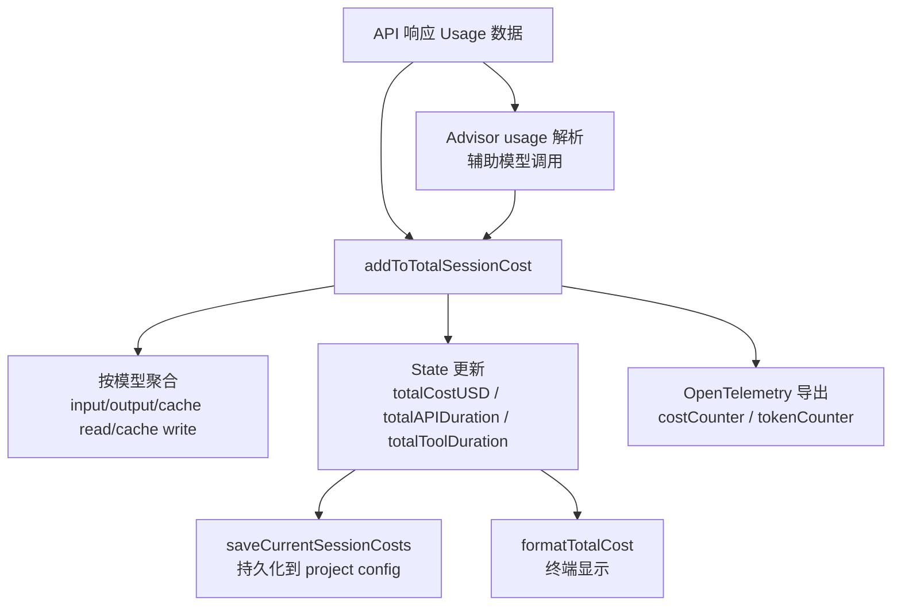

# 第 16 章：成本追踪与分析

Claude Code 的成本与可观测性系统贯穿整个会话生命周期。从每笔 API 调用的 token 计数、到按模型的用量聚合、到 token 预算的查询级控制、再到 API 429 限流的指数退避重试——这是一个多层防线系统，防止成本失控、会话阻塞和 API 滥用。

---

## 16.1 成本追踪管线



### State 中的计量字段

```typescript
// bootstrap/state.ts（计量层）
totalCostUSD: number                    // 累计成本（美元）
totalAPIDuration: number               // 累计 API 延迟
totalAPIDurationWithoutRetries: number  // 不计重试延迟
totalToolDuration: number               // 累计工具执行时间
totalLinesAdded: number                 // 代码新增行数
totalLinesRemoved: number               // 代码删除行数
totalInputTokens: number               // 总输入 token
totalOutputTokens: number              // 总输出 token
totalCacheReadInputTokens: number       // 缓存读取 token
totalCacheCreationInputTokens: number   // 缓存创建 token
totalWebSearchRequests: number          // Web 搜索请求次数
```

### 按模型的用量聚合

`cost-tracker.ts` 按模型名聚合 token 和成本：

```typescript
// cost-tracker.ts
interface ModelUsage {
  inputTokens: number
  outputTokens: number
  cacheReadInputTokens: number
  cacheCreationInputTokens: number
  webSearchRequests: number
  costUSD: number
  contextWindow: number        // 上下文窗口大小
  maxOutputTokens: number      // 最大输出 token 限制
}
```

每次 API 响应返回 `usage` 数据后，系统更新对应模型的聚合值：

```typescript
modelUsage.inputTokens += usage.input_tokens
modelUsage.outputTokens += usage.output_tokens
modelUsage.cacheReadInputTokens += usage.cache_read_input_tokens ?? 0
modelUsage.cacheCreationInputTokens += usage.cache_creation_input_tokens ?? 0
modelUsage.costUSD += cost
```

### Advisor 模型成本

主模型之外，Claude Code 还使用 Advisor 辅助模型（如分类器、摘要器）。Advisor 的成本被单独追踪并加入总成本：

```typescript
for (const advisorUsage of getAdvisorUsage(usage)) {
  const advisorCost = calculateUSDCost(advisorUsage.model, advisorUsage)
  totalCost += addToTotalSessionCost(advisorCost, advisorUsage, advisorUsage.model)
}
```

---

## 16.2 终端成本展示

会话结束时，终端以 dim 灰色显示汇总：

```
Total cost:            $0.42
Total duration (API):  1m 23s
Total duration (wall): 2m 45s
Total code changes:    127 lines added, 34 lines removed
Usage by model:
    claude-sonnet-4-5:  45,230 input, 12,876 output, 32,100 cache read, 8,450 cache write ($0.38)
    claude-haiku:        3,200 input, 1,100 output ($0.04)
```

格式化逻辑：
- 成本 > $0.5 时精确到 2 位小数
- 成本 ≤ $0.5 时精确到 4 位小数
- Token 数用千位分隔符格式化

---

## 16.3 Token 预算解析

用户可以在输入中指定 token 预算，系统解析后限制模型输出的 token 量：

```typescript
// tokenBudget.ts
const SHORTHAND_START_RE = /^\s*\+(\d+(?:\.\d+)?)\s*(k|m|b)\b/i   // "+500k" / "+2M"
const SHORTHAND_END_RE = /\s\+(\d+(?:\.\d+)?)\s*(k|m|b)\s*[.!?]?\s*$/i  // "... +500k."
const VERBOSE_RE = /\b(?:use|spend)\s+(\d+(?:\.\d+)?)\s*(k|m|b)\s*tokens?\b/i  // "use 2M tokens"
```

当预算耗尽时，注入 continuation 消息：

```typescript
export function getBudgetContinuationMessage(pct, turnTokens, budget): string {
  return `Stopped at ${pct}% of token target (${fmt(turnTokens)} / ${fmt(budget)}). Keep working — do not summarize.`
}
```

**"do not summarize" 的原因**——防止模型在预算耗尽时简单地总结之前的工作，而不是继续执行。用户指定预算是希望模型在预算范围内"继续工作"，而非"总结已经做了什么"。

### Token 估算：主循环中的预算决策

在 API 调用前，系统需要估算消息的 token 消耗来判断是否需要压缩：

```typescript
// services/tokenEstimation.ts
const TOKEN_COUNT_THINKING_BUDGET = 1024
const TOKEN_COUNT_MAX_TOKENS = 2048
```

token estimation 通过直接调用 API 的 `countTokens` 接口（Anthropic / Bedrock / Vertex 均有对应实现）。与简单字符计数相比，真实 token 估算精确 3-5 倍。

### 工具搜索字段剥离

`stripToolSearchFieldsFromMessages` 在发送 token 计数前剥离工具搜索特有字段——`tool_use` block 中的 `caller` 字段和 `tool_result` 中的 `tool_reference` 字段。这些是工具搜索 beta 特有的，普通 API 调用会拒绝。`withTokenCountVCR` 实现 token 计数的缓存——同一消息的 token 计数结果可复用。

---

## 16.4 API 限流与指数退避

`withRetry.ts` 是 API 调用的重试引擎。不是简单的指数退避——而是一个多错误类型的智能重试策略，覆盖从 429 到 529 到 OAuth 失效的完整错误谱。

### 重试策略矩阵

| 错误类型 | 重试行为 | 原因 |
|----------|---------|------|
| 429 Rate limit | 指数退避重试 | 临时容量限制 |
| 529 Overloaded | 最多 3 次重试，触发 fallback | 服务器过载 |
| 408 Timeout | 指数退避重试 | 请求超时 |
| 409 Lock timeout | 重试 | 并发锁 |
| 401 Auth expired | 刷新 token 后重试 | OAuth token 过期 |
| 403 Token revoked | 强制刷新 token | 其他进程刷新了 token |
| 5xx Server error | 重试 | 内部错误 |
| ECONNRESET/EPIPE | 禁用 keep-alive，重连 | 陈旧的连接 |

### 指数退避算法

```typescript
// withRetry.ts:530-548
export function getRetryDelay(
  attempt: number,
  retryAfterHeader?: string | null,
  maxDelayMs = 32000,
): number {
  if (retryAfterHeader) {
    const seconds = parseInt(retryAfterHeader, 10)
    if (!isNaN(seconds)) return seconds * 1000  // 优先使用 Retry-After header
  }
  const baseDelay = Math.min(BASE_DELAY_MS * Math.pow(2, attempt - 1), maxDelayMs)
  const jitter = Math.random() * 0.25 * baseDelay  // 25% 抖动
  return baseDelay + jitter
}
```

退避时间线：
```
第 1 次失败 → 500ms + jitter → retry
第 2 次失败 → 1s + jitter → retry
第 3 次失败 → 2s + jitter → retry
第 4 次失败 → 4s + jitter → retry
第 5 次失败 → 8s + jitter → retry
...
最大延迟 → 32s（默认）
```

默认最多重试 10 次。可通过 `CLAUDE_CODE_MAX_RETRIES` 环境变量覆盖。

### 529 错误：Fallback 机制

连续 3 次 529 错误后触发模型 fallback：

```typescript
const MAX_529_RETRIES = 3

if (consecutive529Errors >= MAX_529_RETRIES) {
  if (options.fallbackModel) {
    throw new FallbackTriggeredError(options.model, options.fallbackModel)
  }
  throw new CannotRetryError(new Error(REPEATED_529_ERROR_MESSAGE), retryContext)
}
```

### 快速模式冷却

Fast mode 遇到 429/529 时进入冷却期：

```typescript
const DEFAULT_FAST_MODE_FALLBACK_HOLD_MS = 30 * 60 * 1000  // 30 分钟
const SHORT_RETRY_THRESHOLD_MS = 20 * 1000                  // 20 秒
const MIN_COOLDOWN_MS = 10 * 60 * 1000                      // 10 分钟
```

**为什么区分快慢路径**——如果 `Retry-After: 15s`，等待 15 秒后重试可以保留 prompt cache（同一个 model name）。如果 `Retry-After: 5min`，切换到标准速度模型虽然 cache miss，但至少可以继续执行。

### 持久重试模式

`CLAUDE_CODE_UNATTENDED_RETRY=true` 时启用，chunk sleep 为 30 秒心跳块：

```typescript
const PERSISTENT_MAX_BACKOFF_MS = 5 * 60 * 1000    // 5 分钟最大退避
const PERSISTENT_RESET_CAP_MS = 6 * 60 * 60 * 1000 // 6 小时重置上限
const HEARTBEAT_INTERVAL_MS = 30_000                // 30 秒心跳
```

---

## 16.5 OpenTelemetry 与可观测性

```typescript
// bootstrap/state.ts 中的遥测层
meter: Meter
costCounter: BatchObservable
tokenCounter: BatchObservable
loggerProvider: LoggerProvider
tracerProvider: TracerProvider
```

### 关键事件

```typescript
logEvent('tengu_api_retry', { attempt, delayMs, error, status, provider })
logEvent('tengu_api_opus_fallback_triggered', { original_model, fallback_model })
logEvent('tengu_advisor_tool_token_usage', { advisor_model, cost_usd_micros })
```

---

## 16.6 会话成本持久化

```typescript
export function saveCurrentSessionCosts() {
  saveCurrentProjectConfig(current => ({
    ...current,
    lastCost: getTotalCostUSD(),
    lastModelUsage: Object.fromEntries(...),
    lastSessionId: getSessionId(),
  }))
}

export function restoreCostStateForSession(sessionId: string): boolean {
  const data = getStoredSessionCosts(sessionId)
  if (data) { setCostStateForRestore(data); return true }
  return false
}
```

用户重启会话时，之前的 token 消耗和成本不丢失——session ID 匹配时恢复之前的累计成本。

---

## 16.7 模型选择与成本权衡

### 按模型计费

Claude Code 不只是追踪总成本，还追踪每个模型的用量：

```typescript
// cost-tracker.ts
const modelUsage: Record<string, ModelUsage> = {
  'claude-sonnet-4-5': { inputTokens: 12000, outputTokens: 3500, costUSD: 0.38 },
  'claude-haiku': { inputTokens: 2000, outputTokens: 800, costUSD: 0.04 },
  'claude-opus': { inputTokens: 5000, outputTokens: 1500, costUSD: 0.85 },
}
```

**为什么需要按模型追踪**——不同模型单价不同。Sonnet ~$15/$10 per M tokens，Opus ~$75/$10 per M tokens。混合使用模型时，只追踪总成本不足以诊断"哪次调用最贵"。

### Advisor 模型成本

主模型之外，Claude Code 使用 Advisor 辅助模型：

| Advisor 用途 | 模型 | 成本占主模型比例 |
|------------|------|----------------|
| 分类器 | Haiku | ~2-5% |
| 摘要器 | Sonnet | ~5-15% |
| 记忆检索 | Sonnet | ~1-3% |
| Token 估算 | API countTokens | ~1% |

Advisor 成本通过独立的 `getAdvisorUsage()` 追踪并加入总成本。

---

## 16.8 429 限流与成本失控防护

`withRetry.ts` 的指数退避不只是"重试"——它也是成本失控的防线。

### 429 限流的含义

429 Rate Limit 意味着当前 API 调用频率超过账户配额。如果不退避直接重试，会进一步消耗 quota，产生级联失败。

### Fast Mode 冷却

快遇到 429/529 时进入冷却期：

```typescript
const DEFAULT_FAST_MODE_FALLBACK_HOLD_MS = 30 * 60 * 1000  // 30 分钟
```

冷却期间，快速模式暂停，回退到标准速度模型。这既保护了 API quota，也避免了在限流期间的无意义重试消耗。

---

## 16.9 成本显示的格式选择

```
$0.42        → 2 位小数（成本 > $0.5 时）
$0.0847      → 4 位小数（成本 ≤ $0.5 时）
45,230       → 千位分符（token 数）
```

**为什么低成本显示 4 位小数**——短会话（几秒的查询）成本可能只有 $0.01-0.05。2 位小数会显示 $0.01 或 $0.00，丢失精度。4 位小数让用户看到精确的成本变化趋势。

---

## 16.5 Telemetry 提供者初始化链

State 中的遥测字段以 `null` 初始化——`State` 不直接导入 OpenTelemetry SDK：

```typescript
// bootstrap/state.ts - 初始化为 null
const STATE: State = {
  meter: null,
  loggerProvider: null,
  tracerProvider: null,
  meterProvider: null,
  sessionCounter: null,
  // ... 8 个计数器全部 null
}
```

**依赖倒置**——`setMeter()` 通过参数注入：

```typescript
// state.ts:948-987
export function setMeter(
  meter: Meter,
  createCounter: (name: string, opts: CounterOptions) => AttributedCounter
): void {
  STATE.meter = meter
  STATE.sessionCounter = createCounter('sessions', { ... })
  STATE.locCounter = createCounter('lines_of_code', { ... })
  STATE.prCounter = createCounter('pull_request', { ... })
  STATE.commitCounter = createCounter('commit', { ... })
  STATE.costCounter = createCounter('cost', { ... })
  STATE.tokenCounter = createCounter('token', { ... })
  STATE.codeEditToolDecisionCounter = createCounter('code_edit_tool.decision', { ... })
  STATE.activeTimeCounter = createCounter('active_time', { ... })
}
```

**调用链**——`init.ts` 初始化所有 OTel 提供者并调用 `setMeter()`。这保证了 `state.ts` 作为导入 DAG 的叶子，不导入任何业务模块（包括 OTel setup 代码）。

---

## 16.6 Counter 的属性化语义

所有计数器都是 `AttributedCounter`——不仅计数，还携带标签：

```typescript
interface AttributedCounter {
  add(value: number, attributes: Record<string, string | number>): void
}
```

**常用属性**：

| 属性 | 值来源 | 用途 |
|------|--------|------|
| `model` | 当前使用的模型名 | 按模型分成本 |
| `client_type` | cli/sdk-ts/sdk-python/remote | 按客户端分使用情况 |
| `session_id` | STATE.sessionId | 会话级追踪 |
| `permission_mode` | default/auto/bypass | 权限模式使用统计 |
| `success` | true/false | 成功率追踪 |
| `error_type` | network/auth/ratelimit | 错误分类 |

**`costCounter` 的累加**——每次 API 调用后：
```typescript
STATE.costCounter?.add(costUSD, {
  model: currentModel,
  client_type: STATE.clientType,
  permission_mode: currentMode,
})
```

---

## 16.7 Stats Store：数值型观测

```typescript
interface StatsStore {
  observe(name: string, value: number): void
}
```

与 Counter 不同（只加不减），Stats Store 记录任意数值——持续时间、大小、比例等。

**观测点**：

| 指标 | 单位 | 来源 |
|------|------|------|
| API 延迟 | 毫秒 | 从请求到响应 |
| 工具执行时间 | 毫秒 | tool_use 到 tool_result |
| Hook 执行时间 | 毫秒 | PreToolUse 钩子 |
| 分类器延迟 | 毫秒 | 分类器 API 调用 |
| 启动时间 | 毫秒 | bootstrap 到 REPL |
| Yoga 计算耗时 | 毫秒 | 渲染管线 |
| 渲染帧率 | FPS | Ink 渲染 |
| 慢操作 | ms | 超过阈值的所有操作 |

**`slowOperations` 的追踪**——`State` 维护一个 `{ operation, durationMs, timestamp }` 数组。每次慢操作追加到这个数组。这是启动性能分析的数据源。

---

## 16.8 API 请求捕获

`State` 捕获最后的 API 请求和消息——这对于调试和成本分析至关重要：

```typescript
// State 类型
lastAPIRequest: Omit<BetaMessageStreamParams, 'messages'> | null
lastAPIRequestMessages: BetaMessageStreamParams['messages'] | null
lastClassifierRequests: unknown[] | null
lastMainRequestId: string | undefined
lastApiCompletionTimestamp: number | null
```

**用途**：
- `/cost` 命令：使用 `lastAPIRequest` 计算成本
- `/dump-system-prompt` 调试：使用 `lastAPIRequestMessages` 重建请求
- 分类器调试：`lastClassifierRequests` 追踪 auto 模式分类器的决定

**`pendingPostCompaction` 标志**——上下文压缩后，API 请求参数变化。这个标志表示"有未发出的后压缩请求等待发送"。

---

## 16.9 成本计算模型

成本追踪的精确性是一个工程挑战——不同模型的定价不同，同一模型的不同 token 类型（输入/输出/缓存/思维）的单价不同。

### `hasUnknownModelCost` 标志

```typescript
// 当模型不被识别时设置
if (!knownModels.includes(modelName)) {
  STATE.hasUnknownModelCost = true
}
```

**为何追踪未知模型成本**——如果使用自定义或非标准模型，成本计算可能不准确。这个标志阻止用户看到错误的成本数字——与其显示错误的数字，不如不显示。

### 模型使用追踪

```typescript
// State 中的 modelUsage
modelUsage: { [modelName: string]: ModelUsage }
```

`ModelUsage` 类型追踪每个模型的 token 使用情况：
- inputTokens：发送的输入 token 数
- outputTokens：收到的输出 token 数
- cachedReadTokens：缓存读取 token 数
- cachedWriteTokens：缓存写入 token 数
- costUSD：累计成本

### 启动 Profiler 与成本的联系

启动 Profiler 记录每个 checkpoint 的时间和内存：
```
cli_before_main_import: 0ms
cli_after_main_import: 135ms
cli_after_main_complete: 180ms
```

内存快照追踪每个 checkpoint 的 `process.memoryUsage()`——heapUsed、heapTotal、rss。这使得可以诊断模块加载期间内存分配模式。

---

## 16.10 模型覆盖与成本

```typescript
// State
mainLoopModelOverride: ModelSetting | undefined  // /model 命令设置
initialMainLoopModel: ModelSetting                // 启动时确定的模型
modelStrings: ModelStrings | null                 // 模型名到 ModelSetting 的映射
```

**模型覆盖链**：
```
CLI --model → initialMainLoopModel
/model 命令 → mainLoopModelOverride
API 降级 → fallbackModel（主模型不可用时）
```

每次模型切换，`modelUsage` 追踪新模型的使用情况。`mainLoopModelOverride` 允许用户在会话期间改变模型而不失去成本追踪。

### 回退模型

```typescript
// --fallback-model 选项
// 主模型不可用（rate limit, down）时回退
if (fallbackModel && fallbackModel === model) {
  exitWithError('Fallback model cannot be the same as the main model')
}
```

**为何不允许相同**——如果 fallback 和主模型相同，回退毫无意义。但更重要的是：如果主模型因过载被拒绝，回退到相同模型也会被拒绝。

---

## 16.11 遥测的隐私边界

如第 1 章所述，遥测在 `init()` 完成后、**信任对话框接受之后**才初始化。这是隐私边界的明确选择：

```
用户启动 → 信任对话框 → 用户同意 → 遥测初始化
```

**遥测发送的数据类型**：
- 命令执行统计（不发送命令内容）
- 工具调用频率（不发送工具输入/输出）
- 成本汇总（不发送 API 密钥或 token）
- 性能指标（延迟、帧率、内存）
- 错误模式（崩溃原因，不发送代码）
- 模型使用模式（哪个模型，不是哪个查询）

**不发送的内容**：
- 用户查询内容
- 文件内容
- 工具输入/输出内容
- API 密钥或认证信息
- 文件系统结构

---

## 16.12 Token 计数的三层实现

`tokenEstimation.ts` 中有三层 token 计数：

**Layer 1——API 基础计数**——`countMessagesTokensWithAPI()` 直接调用 Anthropic 的 beta `countTokens` 端点：
- First-party：调用 `anthropic.beta.messages.countTokens()`
- Bedrock：使用 `CountTokensCommand`（`@aws-sdk/client-bedrock-runtime`），**动态导入**延迟加载约 279KB 的 AWS SDK 代码
- Vertex：通过 `VERTEX_COUNT_TOKENS_ALLOWED_BETAS` 过滤 betas

当存在 thinking blocks 时，使用 `TOKEN_COUNT_THINKING_BUDGET = 1024` 和 `TOKEN_COUNT_MAX_TOKENS = 2048`。

**Layer 2——Haiku 回退计数**——`countTokensViaHaikuFallback()` 将消息发送到小型快速模型（默认 Haiku 4.5）：
- 组合 `input_tokens + cache_creation_input_tokens + cache_read_input_tokens`
- 作为 API 计数不可用的回退

**Layer 3——粗略估计**——`roughTokenCountEstimation()` 使用 bytes-per-token 比率：
- 文本：4 bytes/token（默认）
- JSON/JSONL：2 bytes/token
- `roughTokenCountEstimationForFileType()` 根据文件扩展名调整比率

图像/文档：基于 `width * height / 750` 计算约 2000 token。

---

## 16.13 模型定价层

`modelCost.ts:104-126`，`MODEL_COSTS` 将规范模型短名映射到 `ModelCosts`（每百万 token 美元）：

| 定价层 | 模型 | 输入 | 输出 | 缓存写入 | 缓存读取 |
|--------|------|------|------|---------|---------|
| `COST_TIER_3_15` | Sonnet 3.5-4.6 | $3 | $15 | $3.75 | $0.30 |
| `COST_TIER_15_75` | Opus 4/4.1 | $15 | $75 | $18.75 | $1.50 |
| `COST_TIER_5_25` | Opus 4.5, Opus 4.6 正常 | $5 | $25 | $6.25 | $0.50 |
| `COST_TIER_30_150` | Opus 4.6 快速 | $30 | $150 | $37.50 | $3.00 |
| `COST_HAIKU_35` | Haiku 3.5 | $0.80 | $4 | $1.00 | $0.08 |
| `COST_HAIKU_45` | Haiku 4.5 | $1 | $5 | $1.25 | $0.10 |
| Web search | 所有层 | — | — | — | $0.01/次 |

**未知模型处理**——当模型没有定价条目时，`trackUnknownModelCost()` 记录 `tengu_unknown_model_cost` 事件，回退到默认模型定价（或 `DEFAULT_UNKNOWN_MODEL_COST = COST_TIER_5_25`）。

**快速模式检测**——`getOpus46CostTier()` 检查 `usage.speed === 'fast'` 应用昂贵的快速层定价。

---

## 16.14 OpenTelemetry Span 层级

`sessionTracing.ts` 使用 AsyncLocalStorage（两个 ALS 存储 `interactionContext`、`toolContext`）传播上下文：

| Span 类型 | 描述 | 父级 |
|----------|------|------|
| `interaction` | 包装整个用户请求周期 | - |
| `llm_request` | API 请求到模型 | interaction |
| `tool` | 工具调用 | interaction |
| `tool.blocked_on_user` | 权限等待 | tool |
| `tool.execution` | 实际工具执行 | tool |
| `hook` | Hook 执行 | 相关 |

**孤立 Span TTL**——30 分钟（`STALE_SPAN_TTL_MS = 30 * 60 * 1000`）。清理期间强制关闭。

**LLM Span 派生指标**（`perfettoTracing.ts`）—`input_tokens + cache_creation_input_tokens + cache_read_input_tokens`。

---

## 16.15 延迟追踪与 TTFT

`claude.ts` 中的关键延迟测量点：

**TTFT（Time To First Token）**：当 `message_start` 事件到达时——`ttftMs = Date.now() - start`。

**Full request duration**：`durationMs = Date.now() - start`，`durationMsIncludingRetries = Date.now() - startIncludingRetries`。

**Checkpoint 粒度**——`queryCheckpoint()` 用于：`client_creation_start/end`，`response_headers_received`，`first_chunk_received`，`stream_completed`，`api_request_sent`。

**Streaming stall 检测**——`tengu_streaming_stall` 事件带 `stall_duration_ms`、`stall_count`、`total_stall_time_ms`。

**Stream idle watchdog**——`STREAM_IDLE_TIMEOUT_MS` 默认 90 秒，45 秒警告。超时的流回退到非流式重试。

---

## 16.16 Stats Store 的增量合并

`statsCache.ts`：磁盘缓存在 `~/.claude/stats-cache.json`。

**原子写入**——临时文件 + 重命名，防止损坏。内存锁防止并发缓存操作。

**版本迁移**——支持从 MIN_MIGRATABLE_VERSION (1) 到当前 STATS_CACHE_VERSION (3) 的迁移。

**增量合并**——`mergeCacheWithNewStats()` 每天增量合并：
- 按日期键合并 dailyActivity 和 dailyModelTokens
- modelUsage 累加
- 追踪 longestSession

**缓存失效**——只从 `lastComputedDate` 重新处理到昨天；今天的数据始终实时处理。今天的 stats 在读取时合并，不修改缓存。

---

## 16.17 错误分类

`errors.ts` 中 `classifyAPIError()` 分类：

| 分类 | 触发条件 |
|------|---------|
| `aborted` | 请求被中止 |
| `api_timeout` | 连接超时 |
| `repeated_529` | 重复的 529 过载错误 |
| `capacity_off_switch` | 紧急关闭开关 |
| `rate_limit` | HTTP 429 |
| `server_overload` | HTTP 529 |
| `context_window_exceeded` | 上下文窗口超过 |
| `max_output_tokens` | 最大输出 token 超 |
| 5xx | `server_error_NNN` |
| 403 | `forbidden` |
| 401 | `unauthorized` |

**重试体系**——`withRetry()` 包装器带手动重试逻辑（自动重试禁用，`maxRetries: 0`）。包括模型回退、快速模式切换、连续 529 错误追踪。

---

## 16.18 Analytics 事件采样

**事件采样**——每事件采样率从 GrowthBook 通过 `tengu_event_sampling_config` 特性门获取。采样发生在事件创建时——决定在创建后是否发送到后端。

**PII 剥离**——`_PROTO_*` 键在送到通用访问 sinks（Datadog）之前被剥离。`stripProtoFields()` 在 sink 级别防御性地剥离。

**Analytics 禁用条件**：
- `NODE_ENV === 'test'`
- 第三方提供者（Bedrock/Vertex/Foundry）
- `isTelemetryDisabled()`（隐私级别检查）

---

## 16.19 Perfetto 追踪

`perfettoTracing.ts`：使用 Chrome Trace Event Format 兼容 `ui.perfetto.dev`。

**Agent 层级追踪**——每个子 Agent 获取数字进程 ID（通过计数器分配）。父链接通过 `parent_agent` 元数据事件建立。

**事件上限和淘汰**——`MAX_EVENTS = 100,000`。超过时，最旧的一半被丢弃，带 `trace_truncated` 标记事件。淘汰每 60 秒运行一次。

**写入可靠性**——三层：periodic write（`beforeExit`），exit handler，同步回退（在 `process.on('exit')` 处理程序中调用，此时 async 被禁止）。

---

---

## 16.7 多窗口配额系统与 Overage 级联

`claudeAiLimits.ts`（515 行）实现了**多窗口配额层级**与**超额计费级联**：

```typescript
type RateLimitType =
  | 'five_hour'       // 会话窗口（Pro/Max 用户）
  | 'seven_day'       // 周聚合
  | 'seven_day_opus'  // Opus 独立限制
  | 'seven_day_sonnet' // Sonnet 独立限制
  | 'overage'         // 按量付费计费
```

**状态机转换**：`status` 在 `allowed` → `allowed_warning` → `rejected` 之间转换。当 `status === 'rejected'` 但 `overageStatus === 'allowed'` 时，系统无缝切换到**超额计费模式**——用户请求继续但成本更高。

`isUsingOverage` 计算逻辑：`status === 'rejected' && (overageStatus === 'allowed' || overageStatus === 'allowed_warning')`

**13 种拒绝原因枚举**（区分联合类型）：`out_of_credits`、`org_level_disabled_until`（消费上限触发）、`org_service_zero_credit_limit`、`member_zero_credit_limit`、`seat_tier_zero_credit_limit` 等。每种生成不同的用户面向消息。

---

## 16.8 双重模式早期预警系统

**模式 1——服务器阈值头**——读取 `anthropic-ratelimit-unified-{5h|7d}-surpassed-threshold` 响应头。服务器精确告知何时预警。

**模式 2——客户端时间相对计算**（无头时的回退）：

```typescript
const EARLY_WARNING_CONFIGS = [
  {
    rateLimitType: 'seven_day',
    thresholds: [
      { utilization: 0.75, timePct: 0.6 },   // 耗时 60% 但用量 75%
      { utilization: 0.5,  timePct: 0.35 },  // 耗时 35% 但用量 50%
      { utilization: 0.25, timePct: 0.15 },  // 耗时 15% 但用量 25%
    ],
  },
]
```

算法：`utilization >= t.utilization && timeProgress <= t.timePct`。`timeProgress = (now - windowStart) / (resetsAt - windowStart)`。当消耗速度在窗口用尽前不可持续时提前发出预警。

---

## 16.9 Mock 限速模拟引擎

`mockRateLimits.ts`（882 行，仅 `USER_TYPE === 'ant'` 内部可用）——20 种模拟场景的完整限速模拟器：

```typescript
type MockScenario =
  | 'normal' | 'session-limit-reached' | 'approaching-weekly-limit'
  | 'weekly-limit-reached' | 'overage-active' | 'overage-warning'
  | 'overage-exhausted' | 'out-of-credits' | 'org-zero-credit-limit'
  | 'org-spend-cap-hit' | 'member-zero-credit-limit'
  | 'seat-tier-zero-credit-limit' | 'opus-limit' | 'opus-warning'
  | 'sonnet-limit' | 'sonnet-warning'
  | 'fast-mode-limit' | 'fast-mode-short-limit'
  | 'extra-usage-required' | 'clear'
```

**`updateRepresentativeClaim()`**——当多窗口同时超限时，选择 `resetAt` 最远的作为"代表性声明"（与实际 API 行为一致）。动态计算 `Retry-After` 头，包括 overage 可用时删除 `Retry-After` 的情况。

---

## 16.10 Policy Limits 服务（ETag 缓存 + 故障开放）

`policyLimits/index.ts`（664 行）——组织级功能限制的独立限速相邻系统：

**ETag HTTP 缓存**（321-339 行）：`If-None-Match` 头 + 排序后限制的 SHA-256 校验和。

**故障开放语义**——`isPolicyAllowed()` 对未知的限制返回 `true`，网络故障不会意外阻断功能。

**HIPAA 例外：故障关闭**——`allow_product_feedback` 在 `ESSENTIAL_TRAFFIC_DENY_ON_MISS` 中。仅必要流量模式下缓存不可用时返回 `false`。

**深度 key 排序**——`sortKeysDeep()` 递归排序所有对象 key 再哈希，确保 API 响应字段顺序不影响校验和一致性。

---

## 16.11 StatsStore 的蓄水池采样算法

`context/stats.tsx`——**Algorithm R 蓄水池采样**（1024 容量）在有界内存中维护无界直方图数据：

```typescript
observe(name: string, value: number) {
  if (h.reservoir.length < RESERVOIR_SIZE) {
    h.reservoir.push(value)
  } else {
    const j = Math.floor(Math.random() * h.count)
    if (j < RESERVOIR_SIZE) {
      h.reservoir[j] = value  // 以 n/k 概率替换
    }
  }
}
```

`getAll()` 从蓄水池计算 **p50、p95、p99 百分位**。避免存储每次观测，同时保持统计代表性的分布数据用于仪表板/热力图展示。`process.on('exit')` 时将蓄水池 flush 到项目配置中的 `lastSessionMetrics`。

---

## 16.12 Stats Cache 原子写入与版本迁移

`utils/statsCache.ts`（435 行）：

**原子写入模式**：
```typescript
const tempPath = `${cachePath}.${randomBytes(8).toString('hex')}.tmp`
const handle = await open(tempPath, 'w', 0o600)
await handle.writeFile(content)
await handle.sync()           // fsync 在 rename 前
await fs.rename(tempPath, cachePath)
```

临时文件 + hex 随机后缀 + `fsync()` + 原子 rename + `0o600` 权限保障。

**版本迁移**——`MIN_MIGRATABLE_VERSION = 1` 到 `STATS_CACHE_VERSION = 3`。迁移保留历史聚合值（`dailyActivity`、`dailyModelTokens`、`totalSessions`），防止转录文件老化后的数据丢失。

**���存锁**——`withStatsCacheLock()` 通过 Promise 链式防止并发缓存操作。

---

## 16.13 Fast Mode Overge 拒绝（永久禁用）

`utils/fastMode.ts`（257-313 行）——fast mode 收到 429 且 overage 不可用时，**永久禁用 fast mode**：

```typescript
export function handleFastModeOverageRejection(reason: string | null): void {
  if (!isOutOfCreditsReason(reason)) {
    updateSettingsForSource('userSettings', { fastMode: undefined })
  }
  overageRejection.emit(message)
}
```

`isOutOfCreditsReason()` 区分临时的（`org_level_disabled_until`、`out_of_credits`）和永久禁用原因。组织临时消费上限不会永久禁用 fast mode——上限恢复后 fast mode 仍可用。

---

## 16.14 流式传输停顿检测

`services/api/claude.ts`（1934-2374 行）：

```typescript
const STALL_THRESHOLD_MS = 30_000
let stallCount = 0, totalStallTime = 0
let lastEventTime = null  // 首个块后才设置，避免 TTFB 计入停顿

for await (const part of stream) {
  if (lastEventTime !== null) {
    if (now - lastEventTime > STALL_THRESHOLD_MS) {
      stallCount++
      totalStallTime += now - lastEventTime
      logEvent('tengu_streaming_stall', { stall_duration_ms, stall_count })
    }
  }
  lastEventTime = now
}
```

**关键设计**：`lastEventTime` 初始为 `null`，首个块到达后才设置。TTFB（首字节时间）不计入停顿。流结束时若 `stallCount > 0`，发送 `tengu_streaming_stall_summary` 汇总事件。

**独立的流空闲看门狗**（1877-1927 行）：`STREAM_IDLE_TIMEOUT_MS` 默认 90 秒（`CLAUDE_STREAM_IDLE_TIMEOUT_MS` 可配置）。无块到达时中止流并回退到非流式重试。

---

## 16.15 529 错误的来源门控（前台 vs 后台）

`services/api/withRetry.ts`（62-89 行）——不是所有 529 都触发重试：

```typescript
const FOREGROUND_529_RETRY_SOURCES = new Set<QuerySource>([
  'repl_main_thread', 'sdk', 'agent:custom', 'agent:default',
  'agent:builtin', 'compact', 'hook_agent', 'hook_prompt',
  'verification_agent', 'side_question', 'auto_mode',
])

function shouldRetry529(querySource: QuerySource | undefined): boolean {
  return querySource === undefined || FOREGROUND_529_RETRY_SOURCES.has(querySource)
}
```

后台操作（摘要、标题、建议、分类器）在容量级联期间立即放弃，防止网关放大。注释说明："容量级联时每次重试是 3-10x 网关放大，用户从来看不到这些失败。" 新的查询源类型默认**不重试** 529——必须显式添加。

---

## 16.16 预种 529 计数器：流式到非流式回退连续性

`withRetry.ts`（136-142 行）——`RetryOptions` 中的计数器连续性机制：

```typescript
/**
 * 预种连续 529 计数器。当此重试环是流式 529 后的非流式回退时，
 * 流式 529 应计入 MAX_529_RETRIES，使 529 回退前总数一致，
 * 无论哪种请求模式触发了过载。
 */
initialConsecutive529Errors?: number
```

防止边界情况：3 次流式 529 触发非流式重试，如果新计数器为 0，529 预算翻倍为 6 次。

---

## 16.17 上下文溢出自修正（max_tokens 调整）

`withRetry.ts`（388-427 行）——API 返回 400 "input length and `max_tokens` exceed context limit" 时，重试环**从错误消息中解析实际 token 数**并重算安全的 `max_tokens`：

```typescript
const safetyBuffer = 1000
const availableContext = Math.max(0, contextLimit - inputTokens - safetyBuffer)
if (availableContext < FLOOR_OUTPUT_TOKENS) throw error  // FLOOR = 3000

const minRequired = (thinkingBudgetTokens ?? 0) + 1
const adjustedMaxTokens = Math.max(FLOOR_OUTPUT_TOKENS, availableContext, minRequired)
retryContext.maxTokensOverride = adjustedMaxTokens
```

"智能重试"——调整参数而非重复相同请求。1000 token 安全缓冲和 3000 最小输出下限防止可用空间太小导致的病理循环。

---

## 16.18 限速选项交互式菜单

`commands/rate-limit-options/rate-limit-options.tsx`（210 行）+ `components/messages/RateLimitMessage.tsx`（160 行）——限速时根据订阅类型、计费访问权限、overage 状态动态生成选项：

**自动打开逻辑**：
```typescript
const shouldAutoOpenRateLimitOptionsMenu =
  canSeeRateLimitOptionsUpsell &&
  !hasOpenedInteractiveMenu &&
  isCurrentlyRateLimited &&
  onOpenRateLimitOptions
```

仅自动打开一次（`hasOpenedInteractiveMenu` 追踪），且仅用户当前确认被限速时（不携带前一会话的陈旧限制）。

**条件选项生成**：非管理员团队/企业用户在组织消费上限耗尽时，"请求更多"选项完全隐藏（管理员无内容可分配）。非管理员未耗尽时看到"请求额外使用量"（发送给管理员）。管理员看到"添加资金继续使用额外用量"或"切换到额外用量"。

---
