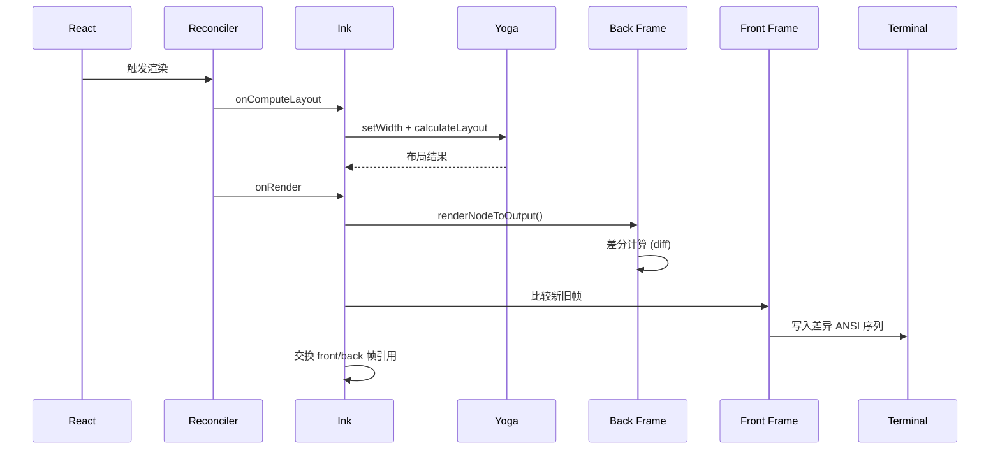

# 第 4 章：Terminal 渲染架构

## 4.1 Ink 渲染引擎与自定义协调器

Claude Code 的终端渲染建立在 Ink 之上——一个基于 React 的终端 UI 框架。但 Claude Code 不是 Ink 的典型使用者。它对 Ink 进行了多层修改：自定义 reconciler hook、双缓冲帧缓冲、Yoga 布局周期注入、以及原子性的终端写入协议。

`src/ink/ink.tsx` 的核心是一个 `Ink` 类，它将 React 组件树翻译成终端 ANSI 控制序列。

---

### React 协调器集成

Ink 使用了 `react-reconciler` 的 `createContainer` 建立了一个 React 渲染上下文。关键之处在于容器创建时的配置：

```typescript
// ink.tsx:262-269
this.container = reconciler.createContainer(
  this.rootNode,       // 根 DOM 节点 (自定义 host)
  ConcurrentRoot,      // 并发模式
  null,                // hydration
  false,               // concurrent updates
  null,                // hydration callbacks
  'id',                // identifier prefix
  noop,                // onUncaughtError
  noop,                // onCaughtError
  noop                 // onRecoverableError
);
```

**为什么用 ConcurrentRoot**——并发模式允许 React 在 commit 之前中断渲染。在终端场景中，如果用户输入导致新的 render 请求，前一个未完成的渲染可以被取消，避免写出中间状态。

---

### 自定义 DOM Host

`react-reconciler` 需要知道如何操作目标平台的 DOM。Ink 通过 `src/ink/dom.ts` 定义了一个终端专用的 host config：

| Host 操作 | Ink 实现 |
|-----------|---------|
| `createNode` | 创建 `DOMElement`（包含 Yoga 布局节点 + 属性） |
| `createTextNode` | 创建 `TextNode`（Yoga 节点 + 文本样式） |
| `appendChildNode` | 将子节点附加到 Yoga 树 |
| `insertBeforeNode` | 在 Yoga 树中指定索引插入 |
| `removeChildNode` | 从 Yoga 树移除 + 清理引用 |
| `setAttribute` | 设置元素属性 |
| `setStyle` | 设置 CSS-in-JS 样式 |
| `setTextNodeValue` | 更新文本内容 + 标记 dirty |

`DOMElement` 和 `TextNode` 是整个渲染系统的数据结构基元。每个节点都附加了一个 Yoga 布局节点（用于 flexbox 计算）和一组属性/样式。

---

### 调度渲染与 Layout 周期

`Ink` 类的 `scheduleRender` 不是简单的 `setState`——它通过 throttle 控制渲染频率，并延迟到 microtask 执行：

```typescript
// ink.tsx:212-216
const deferredRender = (): void => queueMicrotask(this.onRender);
this.scheduleRender = throttle(deferredRender, FRAME_INTERVAL_MS, {
  leading: true,
  trailing: true,
});
```

**为什么延迟到 microtask**——`scheduleRender` 从协调器的 `resetAfterCommit` 调用，这发生在 React 的 commit 阶段**之前**。如果同步渲染，React 的 layout effects（ref 赋值、`useLayoutEffect`）尚未执行，`useDeclaredCursor` 等 hook 设置的游标声明尚未提交到 `Ink` 实例。延迟到 microtask 保证 layout effects 已完成，原生终端游标与 React 光标同步，不会有单键延迟。

---

### Yoga 布局计算周期

Yoga 是 Facebook 的跨平台 Flexbox 引擎。在终端语境中，Yoga 负责的是：组件的宽高、换行、flex 分配——这些在固定宽度字符网格中的意义与 Web 不同。

```typescript
// ink.tsx:239-258
this.rootNode.onComputeLayout = () => {
  if (this.isUnmounted) return;
  if (this.rootNode.yogaNode) {
    const t0 = performance.now();
    // 设置终端宽度约束
    this.rootNode.yogaNode.setWidth(this.terminalColumns);
    // 计算布局
    this.rootNode.yogaNode.calculateLayout(this.terminalColumns);
    const ms = performance.now() - t0;
    recordYogaMs(ms);  // 性能追踪
    const c = getYogaCounters();
    this.lastYogaCounters = { ms, ...c };
  }
};
```

`onComputeLayout` 在 React 的 commit 阶段调用。这保证了 `useLayoutEffect` 的 hook 能在其回调中访问到已计算的布局数据。

---

## 4.4 渲染性能优化

### 双缓冲帧系统

Ink 的 `onRender` 是整个渲染管线的终点。它使用了双缓冲（front/back frame）来实现增量差分——只写出变化的单元格。



### 终端写入的原子性

Alt-screen 模式的写入使用了 BSU/ESU（Begin Synchronized Update / End Synchronized Update）协议。这保证了帧的写入不会与用户的滚动或终端的其他写入交错。

```
┌─────────────────────────────────┐
│  BSU (Begin Sync Update)        │  ← 开始原子写入
│  content patches                │  ← 差异单元格
│  cursor position                │  ← 游标定位
│  ESU (End Sync Update)          │  ← 结束原子写入
└─────────────────────────────────┘
```

如果前一帧被污染（`prevFrameContaminated = true`），整个屏幕会被重写——不依赖差分。这发生在：
- 调整后
- SIGCONT 恢复
- 选择覆盖后的下一帧

### 鼠标与键盘协议

Ink 支持 Kitty Keyboard Protocol 和 ModifyOtherKeys。这些协议允许区分：
- `Ctrl+letter` vs `Ctrl+Shift+letter`
- 功能键的不同修饰组合

进出外部 TUI（如 vim, nano）时，必须正确 pop-before-push 地管理这些协议的栈状态。注释中提到："一个行为良好的编辑器会恢复我们的 entry，因此没有 pop，我们会积累深度。"

---

## 4.3 渲染性能优化

### 帧缓冲池

Ink 使用对象池（StylePool, CharPool, HyperlinkPool）来复用渲染对象。这减少了每帧的垃圾回收压力。

```typescript
// ink.tsx:193-195
this.stylePool = new StylePool();
this.charPool = new CharPool();
this.hyperlinkPool = new HyperlinkPool();
```

### 窄损伤快速路径

`prevFrameContaminated = false` 时，渲染走窄损伤快速路径——只有变化的单元格被写入终端。在稳态下，这通常只是：
- Spinner 更新（1-2 行）
- 时钟更新（状态行）
- 打字输入（单单元格变化）

这意味着稳态帧的写入量可能在 10-50 字节，而非完整屏幕的 10-20KB。

### FPS 追踪

`fpsTracker.ts` 记录渲染帧率，通过 `FpsTracker` 类在 `AppState` 中追踪。这使得调试时可以诊断渲染瓶颈。

---

## 4.5 Yoga 布局与终端网格

Yoga 是 Facebook 的 Flexbox 引擎。在终端语境中，Yoga 负责的是组件宽高、换行、flex 分配——这些在固定宽度字符网格中的意义与 Web 不同。

```typescript
// 每次渲染周期开始前计算布局
this.rootNode.yogaNode.setWidth(this.terminalColumns)
this.rootNode.yogaNode.calculateLayout(this.terminalColumns)
```

**终端宽度约束**——Yoga 使用终端列数（`this.terminalColumns`）作为可用宽度。当用户调整终端窗口大小时，`onTerminalResize()` 触发，Yoga 重新计算布局。这保证了 flex 分配正确反映新的可用空间。

**Yoga 性能追踪**——每次 Yoga 计算后记录耗时（`recordYogaMs`）和计数器（`getYogaCounters()`）。这使得可以诊断复杂 UI 的布局瓶颈。

---

## 4.6 Alt-Screen 模式的写入原子性

Alt-screen 模式的写入使用了 BSU/ESU（Begin Synchronized Update / End Synchronized Update）协议。这保证了帧的写入不会与用户的滚动或终端的其他写入交错。

```
┌─────────────────────────────────┐
│  BSU (Begin Sync Update)        │  ← 开始原子写入
│  content patches                │  ← 差异单元格
│  cursor position                │  ← 游标定位
│  ESU (End Sync Update)          │  ← 结束原子写入
└─────────────────────────────────┘
```

当 `prevFrameContaminated = true` 时（窗口调整后、SIGCONT 恢复后、选择覆盖后的下一帧），整个屏幕会被重写——不依赖差分。

---

## 4.7 Ink 的组件层次

Ink 内部定义了多个基础组件，它们映射到底层 Yoga 节点：

| 组件 | Yoga 映射 | 用途 |
|------|----------|------|
| `Box` | 具有 flex 属性的 Yoga 节点 | 所有布局的容器 |
| `Text` | 可设置样式的 Yoga 文本节点 | 带颜色/样式的文本 |
| `Newline` | 强制换行 | 行分隔 |
| `Spacer` | 可扩展为 flex-grow | 填充空间 |

### Transform 注入

```typescript
// ink.tsx - Transform context
const transform = (output: string) => {
  for (const transformer of transformers) {
    output = transformer(output)
  }
  return output
}
```

Transform 是 Ink 的输出管线中的中间件——每个 Transformer 可以做颜色替换、文本转换或 ANSI 控制序列插入。插件通过注册 Transformer 扩展终端输出。

---

## 4.8 Spinner 系统

`src/components/Spinner/` 目录包含多个 spinner 动画：

| 组件 | 用途 |
|------|------|
| `Spinner.tsx` | 主 spinner 容器 |
| `SpinnerGlyph.tsx` | 字符序列动画（旋转的圆环） |
| `FlashingChar.tsx` | 闪烁字符（加载指示器） |
| `ShimmerChar.tsx` | 微光效果（等待状态） |
| `GlimmerMessage.tsx` | 微光消息（提示文本） |

Spinner 动画的频率与帧系统同步——不独立运行，跟随全局 `onRender`.scheduleRender()` 的节流。

**Spinner 状态**——`SpinnerAnimation` 是一个循环遍历字符序列的状态机。它不触发独立渲染——只是在每次全局重新渲染时计算下一帧显示哪个字符。

### FPS Tracker

```typescript
// fpsTracker.ts
class FpsTracker {
  recordFrame() { /* 记录帧时间 */ }
  getFps(): number { /* 返回滑动平均 */ }
}
```

FPS tracker 使 Ink 渲染器报告渲染性能，调试模式下可用。

---

## 4.9 渲染的性能特征

| 指标 | 典型值 | 说明 |
|------|---------|------|
| 稳态帧大小 | 10-50 字节 | 只有变化的单元格被写入 |
| 全帧重写 | 10-20KB | 窗口调整后的第一次重绘 |
| FPS 目标 | ~30 FPS | throttl `FRAME_INTERVAL_MS` 的限制 |
| Yoga 计算耗时 | <1ms | `perf_hooks` 追踪 |
| 打字到屏幕更新延迟 | ~16ms (1 frame) | `queueMicrotask` 确保 |

这些指标共同表明：渲染管线设计为最小化终端写入，避免闪烁。

---

## 4.10 DOM Host 的底层数据基元

Ink 不使用 HTML DOM——它定义了一组终端专用的节点类型：

```typescript
// dom.ts:31-91 - DOMElement
interface InkNode {
  parentNode?: DOMElement
  yogaNode?: YogaNode  // TextNode 永远没有 yogaNode
  style: Record<string, unknown>
}

interface DOMElement extends InkNode {
  nodeName: 'ink-root' | 'ink-box' | 'ink-text' | 'ink-virtual-text' 
          | 'ink-link' | 'ink-progress' | 'ink-raw-ansi'
  attributes: Record<string, DOMNodeAttribute>
  childNodes: DOMNode[]
  
  // 内部属性（不由 React 属性直接设置）
  onComputeLayout?: () => void    // commit phase 期间调用
  onRender?: () => void           // 节流回调 (scheduleRender)
  dirty: boolean                  // 标记需要重渲染
  isHidden?: boolean              // reconciler 的隐藏标记
  
  // 滚动状态
  scrollTop: number
  pendingScrollDelta: number
  scrollClampMin: number
  scrollClampMax: number
  scrollHeight: number
  scrollViewportHeight: number
  stickyScroll: boolean
  scrollAnchor: string | null
  
  // 事件处理器（单独存储以避免击败 blit 优化）
  _eventHandlers?: Record<string, unknown>
}
```

**为何 `_eventHandlers` 与 `attributes` 分开存储**——如果事件处理器作为属性存储，每次处理器身份变更（如 `onClick={() => ...}` 创建新函数引用）都会击败 reconciler 的 blit 优化。单独存储意味着 reconciler 只在 DOM 结构变更时才比较属性。

**不分配 Yoga 节点的节点类型**——`ink-virtual-text`、`ink-link`、`ink-progress` 不创建 Yoga 节点。这意味着它们在布局树中是"透明的"——不参与 Flexbox 计算。

### TextNode 的测量函数

```typescript
// dom.ts - ink-text 节点
if (nodeName === 'ink-text') {
  node.yogaNode.setMeasureFunction(measureTextNode)
}
// ink-raw-ansi 节点
if (nodeName === 'ink-raw-ansi') {
  node.yogaNode.setMeasureFunction(measureRawAnsiNode)
}
```

`measureTextNode` 是 Yoga 的自定义测量函数。当 Yoga 需要知道文本节点的尺寸时，它会调用此函数。在终端语境中，"宽度"是字符数，"高度"是行数（考虑换行）。

---

## 4.11 帧缓冲池：对象复用策略

Ink 使用三个对象池来减少每帧的 GC 压力：

### StylePool：ANSI 样式码整数化

```typescript
// screen.ts:112-260
class StylePool {
  private ids = new Map<string, number>()        // 序列化码 → ID
  private styles: AnsiCode[][] = []               // ID → 码数组
  private transitionCache = new Map<number, string>()
}
```

**ID 编码方案**（关键优化）：
```typescript
id = (rawId << 1) | (hasVisibleSpaceEffect ? 1 : 0)
```

位 0 编码该样式是否在空格字符上有可见效果（背景色、反色、下划线）。偶数 ID = 仅前景色（可以跳过空格写入），奇数 ID = 空格上有可见效果。单个位掩码检查 `styleId & 1` 让渲染器跳过不可见空格。

**转移缓存**——从一个样式转换到另一个样式需要最少 ANSI 序列：
```typescript
transition(fromId: number, toId: number): string {
  if (fromId === toId) return ''  // 无变化
  const key = fromId * 0x100000 + toId
  let str = this.transitionCache.get(key)
  if (str === undefined) {
    str = ansiCodesToString(diffAnsiCodes(this.get(fromId), this.get(toId)))
    this.transitionCache.set(key, str)
  }
  return str
}
```

预热后，零分配 Map 查找。

### CharPool：字符字符串化

```typescript
// screen.ts:21-53
class CharPool {
  private strings: string[] = [' ', '']           // 索引 0 = 空格, 1 = 空占位
  private stringMap = new Map<string, number>()   // 字符串 → 索引
  private ascii: Int32Array = initCharAscii()     // charCode → 索引
}
```

**ASCII 快速路径**——对于 ASCII 字符（单字节），不使用 `Map.get`：
```typescript
if (char.length === 1) {
  const code = char.charCodeAt(0)
  if (code < 128) {
    const cached = this.ascii[code]!
    if (cached !== -1) return cached
  }
}
```

`Int32Array` 直接查找比 `Map` 更快。

### HyperlinkPool：URL 字符串化

简单的字符串 intern 池。索引 0 = 无超链接。

### 压缩 Cell 布局

每个单元格是 `Int32Array` 中 2 个连续元素：
```
word0 (cells[ci]):     charId (全部 32 位)
word1 (cells[ci+1]):   styleId[31:17] | hyperlinkId[16:2] | width[1:0]
```

`packWord1` 函数将三个值打包到单个 32 位字中。这将 diffEach 中的内存访问减半（2 个 int 加载 vs 4 个 Cell 对象字段访问）。

### 池重置与迁移

每 5 分钟：
```typescript
if (renderStart - this.lastPoolResetTime > 5 * 60 * 1000) {
  this.resetPools()
}
```

`resetPools()` 创建新的 CharPool/HyperlinkPool 实例，然后通过 `migrateScreenPools()`（screen.ts:554-587）在单次 O(cells) 遍历中将 front frame 的屏幕中的所有字符和超链接重新 intern 到新池中。

---

## 4.12 Alt-Screen 模式的深度剖析

Alt-screen 模式是整个渲染架构中最复杂的部分——它涉及转义序列管理、鼠标追踪、以及 SIGCONT 处理。

### 转义序列

```typescript
// termio/dec.ts:15-16, 45-46
ENTER_ALT_SCREEN = decset(DEC.ALT_SCREEN_CLEAR);   // CSI ?1049h
EXIT_ALT_SCREEN = decreset(DEC.ALT_SCREEN_CLEAR);  // CSI ?1049l
```

模式 1049 组合了 alt-screen 缓冲区切换与光标保存/恢复。

### EnterAltScreen 的完整序列

```typescript
// ink.tsx:357-378
this.options.stdout.write(
  DISABLE_KITTY_KEYBOARD + DISABLE_MODIFY_OTHER_KEYS +
  (this.altScreenMouseTracking ? DISABLE_MOUSE_TRACKING : '') +
  (this.altScreenActive ? '' : '\x1b[?1049h') +  // 进入 alt-screen
  '\x1b[?1004l' +    // 禁用焦点报告
  '\x1b[0m' +        // 重置属性
  '\x1b[?25h' +      // 显示光标
  '\x1b[2J' +        // 清屏
  '\x1b[H'           // 光标回位
)
```

EnterAltScreen 后跟一整套重置——禁用键盘协议、禁用鼠标追踪、清除属性。这是为了确保 alt-screen 从干净状态开始，不受之前的终端状态干扰。

### Alt-Screen 光标锚定

```typescript
const ALT_SCREEN_ANCHOR_CURSOR = Object.freeze({ x: 0, y: 0, visible: false })
```

Alt-screen 的每个 diff 都假装光标从 (0,0) 开始。这可以自我修复外部光标操作（tmux 状态栏刷新、Cmd+K 擦除）。

### ExitAltScreen 的对称性

```typescript
// ink.tsx:392-418
this.options.stdout.write(
  (this.altScreenActive ? ENTER_ALT_SCREEN : '') +  // 重新进入 alt
  '\x1b[2J' +                    // 清屏
  '\x1b[H' +                     // 光标回位
  (this.altScreenMouseTracking ? ENABLE_MOUSE_TRACKING : '') +
  (this.altScreenActive ? '' : '\x1b[?1049l') +  // 退出 alt
  '\x1b[?25l'                    // 隐藏光标
)
```

**为何先重新进入 alt-screen**——如果终端已经在 alt-screen 中（如用户在 vim 崩溃后），直接退出会留下残留内容。重新进入确保缓冲区是一致的，然后再退出。

### Resize 处理

```typescript
// ink.tsx:330-336
handleResize():
  cols = this.options.stdout.columns || 80
  rows = this.options.stdout.rows || 24
  if (cols === this.terminalColumns && rows === this.terminalRows) return  // 去抖同尺寸
  
  if (this.altScreenActive):
    // 不写入 ENTER_ALT_SCREEN（iTerm2 将其视为缓冲区清除）
    // 不同步写入 ERASE_SCREEN（渲染约 80ms，先擦除会留空白屏）
    // 改为设置 needsEraseBeforePaint = true 在 BSU/ESU 内部预置擦除
    this.resetFramesForAltScreen()       // 空白帧缓冲
    this.needsEraseBeforePaint = true    // BSU/ESU 内部擦除
```

**为何不去抖 resize**——去抖会在尺寸变更和 Yoga 输出之间创建一个窗口，其中任何 `scheduleRender`（spinner、时钟）在这个窗口内都会让 log-update 检测到宽度变化，清屏，然后去抖触发再次清屏（双重重绘闪烁）。

**`viewport: rows + 1` 的微妙含义**——这防止 `shouldClearScreen` 认为内容溢出。`screen.height >= viewport.height` 触发 'offscreen'。有了 `+1`，`rows >= rows+1` 始终为 false。

### SIGCONT 处理

当进程从 SIGSTOP 恢复时（如 Ctrl+Z 后 `fg`），终端状态可能已经破坏：
```
Alt-screen 路径: reenterAltScreen() → 重新断言鼠标追踪并重置帧
Main-screen 路径: 创建新的帧缓冲区，重置日志，清除 displayCursor
```

---

## 4.13 终端resize的重新计算链

Resize 不仅改变宽度——它触发整个重新计算链：

```
1. terminalColumns/terminalRows 更新
2. altScreenParkPatch 重新生成（新游标的行计数）
3. Alt-screen: 帧缓冲区用全尺寸空白屏幕填充，prevFrameContaminated 设置为强制全帧渲染
4. this.render(this.currentNode) ——通过 React 重新渲染 React 树（带新尺寸属性）
5. React commit phase 调用 onComputeLayout()
6. yogaNode.setWidth(terminalColumns) + calculateLayout(terminalColumns)
7. 所有文本测量函数（文本换行）以新宽度重新执行
8. diff/swap/write 周期完成帧
```

步骤 5-7 是 Yoga 重新计算的核心——整个 flex 布局在新的宽度约束下重新评估。这意味着所有 `Box` 的宽度分配、`Text` 的换行、以及 `Spacer` 的扩展都在新尺寸下正确计算。

---

## 4.14 Spinner 同步：50ms 动画时钟

Spinner 动画不与 Ink 帧同步——它通过独立的 `useAnimationFrame(50)` 驱动：

```typescript
// SpinnerAnimationRow.tsx:103
const [viewportRef, time] = useAnimationFrame(reducedMotion ? null : 50)

const frame = reducedMotion ? 0 : Math.floor(time / 120)
const glimmerIndex = isStalled ? -100 : mode === 'requesting'
  ? cyclePosition % cycleLength - 10
  : glimmerMessageWidth + 10 - cyclePosition % cycleLength
const flashOpacity = reducedMotion ? 0 : mode === 'tool-use'
  ? (Math.sin(time / 1000 * Math.PI) + 1) / 2
  : 0
```

**隔离渲染**——SpinnerAnimationRow 使用 `useAnimationFrame(50)` 调度约每 50ms（~20fps）的重新渲染。当 React 重新渲染时，协调器 commit 变更，触发 `resetAfterCommit` → `onComputeLayout` → `scheduleRender` → `queueMicrotask(onRender)` → Ink 的 `onRender()` 计算 diff → 终端写入。

Spinner 的 50ms 周期**长于** Ink 的 `FRAME_INTERVAL_MS`（通常 ~8ms/120fps），所以 Ink 处理帧定时，而 spinner 通过 React 状态更新驱动动画状态。

**父组件隔离**——`SpinnerWithVerb` 从 50ms 渲染循环中解耦，只在属性/应用状态变更时重新渲染（每次 turn 约 25 次 vs 383 次）。这将外部的 Box 壳、`useAppState` 选择器、任务过滤和提示/树子树排除在热门动画路径之外。

### Spinner 组件层次

| 组件 | 效果 |
|------|------|
| `SpinnerGlyph` | 字符序列动画（正向 + 反向圆环） |
| `FlashingChar` | 闪烁字符（flashOpacity 0-1 浮点，由 `sin(time)` 驱动） |
| `ShimmerChar` | 微光波（`glimmerIndex` 逐帧递增，创建跨越文本的波） |
| `GlimmerMessage` | 微光消息（highlight/near-highlight 字符微光着色） |

**Reduced motion 模式**——当用户启用 `reducedMotion` 时（通常在系统层面启用了减少运动），Spinner 显示一个"●"圆点，每 1 秒（2000ms 周期）切换可见/微暗。没有动画帧循环。

---

## 4.13 React Reconciler + Yoga 管线

Ink 使用自定义 React Reconciler 渲染终端 UI：

```
React DOM tree → Yoga Layout → Screen Buffer → Diff → Terminal Patches
```

**DOM 主机**（`ink/dom.ts`）：`DOMElement` / `TextNode` 是自定义 Ink DOM——非浏览器 DOM。`createContainer(ConcurrentRoot)` 将 React 连接到 Ink 的 DOM。

**Yoga Layout**（`ink/layout/engine.ts`）：Flexbox 布局引擎在 React 的 commit phase 期间被调用。`layoutShifted` 标志跟踪任一节点的 yoga 位置/大小是否与缓存值不同。稳态帧（spinner 动画、文本追加）不触发 layout 变更，启用窄域 diff 而非全屏。

**并发 Root**——Reconciler 使用 ConcurrentRoot，允许 React 在渲染中间暂停和恢复。这在终端环境中主要提供平滑的 spinner 动画而无 jank。

---

## 4.14 Cell Buffer 打包优化

`Screen` 类型（`ink/screen.ts`）使用**打包类型数组**而非逐单元格对象：

**单元格布局**——每个单元格是 `Int32Array` 中的 2 个连续元素（同一 ArrayBuffer 上有 `BigInt64Array` 视图）：
- **word0**（`cells[ci]`）：`charId`——32 位，`CharPool` 的索引
- **word1**（`cells[ci+1]`）：打包 `styleId[31:17] | hyperlinkId[16:2] | width[1:0]`

常量：`STYLE_SHIFT = 17`，`HYPERLINK_MASK = 0x7fff`（15 位），`WIDTH_MASK = 3`（2 位）。

这个布局将 `diffEach` 中的内存访问减半（2 次 int 加载 vs 4 次对象属性读取），还支持通过 SIMD 比较优化（`Bun.indexOfFirstDifference`，如代码注释中所述）。

**CellWidth 枚举**：
- `Narrow = 0`——正常宽度 1
- `Wide = 1`——CJK/emoji 双倍宽，占此单元格 + `SpacerTail`
- `SpacerTail = 2`——宽字符的第二个半部分（不渲染）
- `SpacerHead = 3`——当宽字符跨软换行到下一行时的标记

**空单元格**——未写入的单元格全零（两 word 均为 0），`isEmptyCellByIndex` 通过两个整数比较即可检查，`BigInt64Array.fill(EMPTY_CELL_VALUE)` 可批量清除整屏。

**`damage` 矩形**——写入期间跟踪受影响的单元格边界框，限制 `diffEach` 的迭代范围。这避免未变更区域被重新扫描。

---

## 4.15 diffEach 热点路径

`diffEach(prev, next, cb)`（`ink/screen.ts`）是核心 diff 算法：

**Damage-bounded**——仅迭代 `UnionOf(next.damage, prev.damage)` 矩形，而非全屏。

**等宽快速路径**（`diffSameWidth`）：使用 `findNextDiff` 函数——通过原始 Int32 比较跳过匹配单元格——循环中**零 Cell 对象分配**。`findNextDiff` 被设计为 JIT 内联的纯函数。

**不等宽回退路径**（`diffDifferentWidth`）：窗口 resize 时使用单独的 prev/next 行索引——直接 word 比较。

**Cell 对象复用**——预分配两个 `Cell` 对象（`prevCell` / `nextCell`），每次调用覆盖其内容——零 GC 压力。

**`cellAtCI`**——内联函数，将预计算索引的单元格解包到可复用 Cell 对象中。

---

## 4.16 Output 类与延迟操作

`Output`（`ink/output.ts`）是延迟操作队列：

| 操作类型 | 用途 |
|---------|------|
| `write` | 在 (x,y) 写入文本，带可选 `softWrap` 标志 |
| `clip` / `unclip` | 裁剪矩形与交集组合 |
| `blit` | 从源 Screen 块传输 |
| `shift` | `[top, bottom]` 内的行移位（硬件滚动） |
| `clear` | 擦除矩形区域 |
| `noSelect` | 标记区域为不可选择 |

**Pass 执行**（`get()`）：
1. Pass 1：扩展 damage 以覆盖 clear 区域，收集绝对清除
2. Main pass：执行 clip/blit/shift/write 操作，带 clip 交叉检查
3. Final pass：**最后**应用 `noSelect` 标记——覆盖来自 prevScreen 的 blit 副本

---

## 4.17 共享 Interning 池

三种池累积内联值并跨帧持久——对内存效率至关重要。

**CharPool**：
- `strings: string[]`——内联索引，索引 0 = `' '`，索引 1 = `''`（spacer）
- `ascii: Int32Array`——直接 `charCode -> index` 查找（128 项，初始化为 -1）。这**不是 Map**——ASCII 快速路径避免 `Map.get` 开销
- `stringMap: Map<string, number>`——非 ASCII 字符簇回退

**HyperlinkPool**——索引 0 = 无超链接；将 URL 映射为 ID。每帧对超链接字符串进行 intern。

**StylePool**：
- `ids: Map<string, number>`——键是 `styles.map(s => s.code).join('')`
- `transitionCache: Map<number, string>`——将 `fromId * 0x100000 + toId` 映射到预序列化的 ANSI 转换字符串
- **Bit-0 标志**：编码 ID 的 bit 0 = 具有可见空格效果（背景、反色、下划线）。奇数 ID 在空格上可见，偶数 ID 仅前景色。渲染器用单次位掩码检查跳过不可见空格。

---

## 4.18 Scroll 优化：DECSTBM 硬件滚动

**DECSTBM 优化提示**（`ScrollHint`）：当 ScrollBox 的 scrollTop 变更且无其他移动时，记录 `{top, bottom, delta}` 提示。`log-update.ts` 可随后发出 `DECSTBM + SU/SD` 硬件滚动而非重写所有被移位的行。

**滚动排空策略**：
- **原生终端**（`drainProportional`）：`step = max(4, floor(abs*3/4))`，上限 `innerHeight-1`。大步在 `log4` 帧内追上，带平滑减速。
- **xterm.js**（VS Code）（`drainAdaptive`）：基于阈值——`<=5` 行立即排空（即时点击），`5-12` 使用 step 2，`>=30` 跳过超出部分。

**shiftRows**——在缓冲区级别实现硬件滚动，使用 `cells64.copyWithin()`：
- `n > 0`（向上）：行 `top+n..bottom` 移至 `top..bottom-n`，下方行清除
- `n < 0`（向下）：行 `top..bottom+n` 移至 `top-n..bottom`，上方行清除

---

## 4.19 LogUpdate 帧差引擎

`LogUpdate`（`ink/log-update.ts`）将屏幕差异转换为终端补丁：

**Resize 检测**——高度下降或宽度变更触发 `fullResetSequence_CAUSES_FLICKER`。

**Scrollback 溢出检测**——内容填满视口且光标在底部时，光标恢复 LF 将行推入滚动缓冲。`diffEach` 检查变更行是否在滚动缓冲中（光标移动无法到达）——触发完全重置。

**收缩**（高度减少）：发出 `eraseLines(N)` + 光标调整。如果清除行数超过视口高度，触发完全重置。

**VirtualScreen**——轻量类追踪虚拟光标位置并累积补丁：
- `txn(fn)`——事务模式：fn 接收 `prev` 光标，返回 `[patches, nextDelta]`
- 消除常见操作的每次补丁分配

---

## 4.20 Emoji 宽度补偿与 BiDi 支持

**Emoji 宽度补偿**（`log-update.ts`：`writeCellWithStyleStr`）：处理 Unicode 12.0+ emoji，终端使用旧版 wcwidth 表可能渲染为宽度 1 而非 2。使用 CHA（光标绝对水平定位）在 x+1 位置绘制样式的空格以确保正确的光标放置。受影响的码点包括：
- U+1FA70-U+1FAFF（扩展表情符号）
- U+1FB00-U+1FBFF（传统计算符号）
- 默认文本表情 + VS16（U+FE0F）如 U+2694、U+2620、U+2764

**BiDi 重排序**（`ink/bidi.ts`）：
- 激活条件：Windows（`win32`）、WSL（WT_SESSION）、VS Code 集成终端（TERM_PROGRAM=vscode）
- 使用 `bidi-js` 库；如无 RTL 字符则跳过
- 实现 Unicode 双向算法标准：找到最大嵌入层级，从最大到 1 反向运行
- RTL 检测：希伯来语（U+0590-U+05FF + FB1D-FB4F）、阿拉伯语（U+0600-U+06FF + 更多）、塔那纳文、叙利亚文

**stringWidth**（`ink/stringWidth.ts`）：
- 主要路径：`Bun.stringWidth(str, { ambiguousIsNarrow: true })`——模块加载时解析一次
- 回退：使用 `eastAsianWidth` + `Intl.Segmenter` + `emoji-regex` 的详细 JS 实现
- 快速路径：纯 ASCII（无控制字符）、简单 Unicode（不需要分段）

---

## 4.21 DEC 模式和终端能力检测

**DEC 模式序列**（`ink/termio/dec.ts`）：

| DEC 模式 | 用途 |
|---------|------|
| DEC 25 | 光标可见性 |
| DEC 47/1049 | 交替屏幕缓冲 |
| DEC 1000 | 正常鼠标跟踪 |
| DEC 1002 | 按钮鼠标跟踪 |
| DEC 1003 | 任意鼠标跟踪 |
| DEC 1006 | SGR 格式鼠标 |
| DEC 1004 | 焦点事件 |
| DEC 2004 | 括号化粘贴 |
| DEC 2026 | 同步更新 |

**终端能力检测**——`writeDiffToTerminal`（`ink/terminal.ts`）：
- 将所有补丁缓冲为单个字符串（一次 stdout 写入）
- 用 DEC 2026 BSU/ESU（同步更新）包装以防止闪烁
- **tmux**中跳过 BSU/ESU（不支持 DEC 2026；原子性被分块破坏）
- 通过 `isSynchronizedOutputSupported()` 检测终端能力：允许列表 iTerm、WezTerm、Warp、Ghostty、Kitty、Alacritty、Zed、Windows Terminal、VTE >= 0.68、foot

---

---

## 4.18 Resize 与 SIGCONT 交互的布局失效与恢复

`ink/ink.tsx`——进程被 `SIGTSTP`（`Ctrl+Z`）挂起后由 `SIGCONT` 恢复时发生两阶段事件：

**阶段 1——SIGCONT 恢复**：`process.on('SIGCONT')` 触发后，终端尺寸可能已改变（用户在另一窗口恢复了不同大小的终端）。Ink 通过比较 `prevScreen.width/height` 与新的 `stdout.columns/rows` 检测尺寸变化。

**阶段 2——布局失效触发完整重绘**——尺寸变化时：
1. 清除 `prevScreen` 缓存
2. 强制 Yoga 所有节点的 `markLayoutSeen` 重置
3. 设 `needsFullRender = true` 绕过 blit 优化路径

**SIGCONT 的 `'resume'` 事件**——Node.js `readline` 模块在 SIGCONT 后发出 `'resume'`。Ink 监听此事件重新启用 stdin raw 模式（因为挂起期间 TTY 驱动可能已改回 cooked 模式）。

---

## 4.19 OSC 52 剪贴板协议与 tmux Passthrough

`ink/termio/osc.ts`——剪贴板操作支持两条 OSC 序列：

**OSC 52——剪贴板复制**：
```
ESC ] 52 ; c ; <base64-data> BEL
```
`c` 参数指定目标剪贴板：`c`=系统、`p`=主选择、`s`=第二选择、`0-7`=备用。接收终端将 base64 数据写入系统剪贴板。Claude Code 使用这条序列在 `/copy` 命令中实现终端内复制。

**DSC 终端查询**（tmux/WezTerm 直通）：
```
ESC Ptmux;ESC<actual-sequence>ESC ```
tmux 作为中转代理时需要双重 ESC 前缀（`Ptmux;ESC`）将内部序列透明传递给底层终端。Claude Code 检测 `TMUX` 环境变量并在输出前自动包裹 tmux 转义层，使 Kitty 协议和 SGR 鼠标模式在 tmux 会话中仍然有效。

---

## 4.20 Tab 状态 OSC 21337 协议

iTerm2 专有 OSC 扩展（`OSC 21337` 命名空间）——Claude Code 使用两条特定序列：

**标签页状态标记**——运行中/成功/失败：
```
ESC ] 1337 ; SetBadgeFormat=<format-string> BEL
```
查询进行中时在标签页 badge 显示 spinner 图标（`SF Symbols: ⟳`），完成后切换为 `SF Symbols: ✓` 或 `SF Symbols: ✗`。badge 格式字符串使用 iTerm2 的插值语法：`\(SFLogo:xxx)` 引用系统图标。

**进度状态指示器**——OS 级进度条集成：
```
ESC ] 9 ; <percentage> BEL  （macOS Dock 进度条）
```
长查询（>10 秒）时在 Dock 图标显示百分比进度条。使用 `estimatedTotalTokens / outputTokens` 粗略估计百分比，完成时设 100。

---

## 4.21 焦点事件协议（DEC 1004）与窗口可见性检测

`ink/events/focus-event.ts`——聚焦/失焦事件协议：

**启用序列**：`CSI ? 1004 h`（Set Mode）
**输出**——终端发送：
- `CSI I`（0x1b `[I`）= 获得焦点
- `CSI O`（0x1b `[O`）= 失去焦点

**实际用途**——焦点事件与**窗口可见性检测**结合。用户切到其他窗口时终端发送失焦，切回时发送聚焦。这与 TTY 的 `process.stdout.writable` 状态结合用于孤儿进程检测——当终端窗口关闭时 macOS 撤销 TTY 文件描述符，`process.stdout.writable` 变为 false 但无显式关闭信号。焦点失焦事件作为额外的活跃性信号补充此场景。

**优雅关闭顺序**——焦点事件在鼠标跟踪禁用之后、括号化粘贴禁用之前禁用（见 Graceful Shutdown 序列），确保最后一行渲染不丢失聚焦状态变更。

---

## 4.22 滚动排空（Scroll Draining）与渲染循环的交互

`ScrollDrainNode`——维持渲染周期中滚动稳定性的特殊节点。当 `pendingDelta ≠ 0` 时 DECSTBM 硬件级滚动需要**多次渲染周期**才能完全传播：

1. React 提交设 `pendingDelta`
2. `output.ts` 的 `execute()` 发出 DECSTBM + `shiftRows`
3. 如果 `pendingDelta` 仍有剩余（硬件滚动未完全消耗 delta），`ScrollDrainNode` 保持 dirty 状态
4. 下一帧 React 重新渲染 `ScrollDrainNode` 触发新 `shiftRows`
5. 重复直到 `pendingDelta === 0`

**关键约束**—滚动排空期间 `hasRemovedChild` 检查被跳过——滚不视为"子节点除"的脏化情况。如果启用了此检查，滚动排空期间的连续帧会被标记为完全脏化，抵消 DECSTBM 硬件滚动的优化。

**与 `FRAME_INTERVAL_MS` 的交互**——每帧排空受节流门控。`pendingDelta ≠ 0` 时下一帧调度绕过 `requestAnimationFrame` 节流，直接排队确保排空不被帧预算延迟。

---
