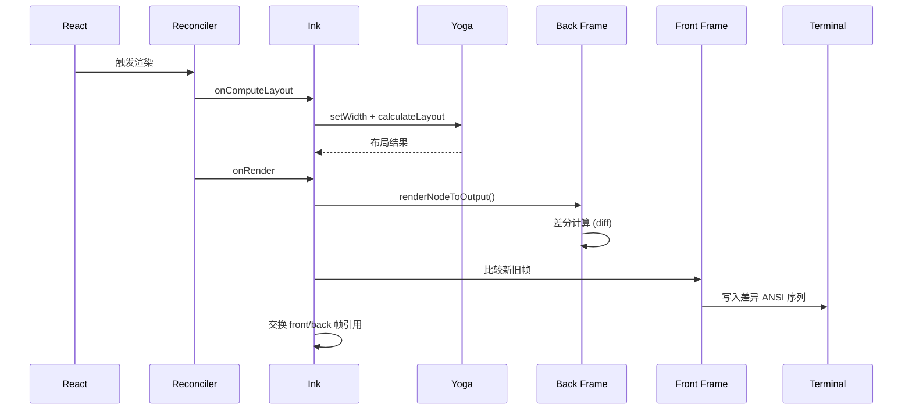

# 第 4 章：Terminal 渲染架构

## 4.1 Ink 渲染引擎与自定义协调器

Claude Code 的终端渲染建立在 Ink 之上——一个基于 React 的终端 UI 框架。但 Claude Code 不是 Ink 的典型使用者。它对 Ink 进行了多层修改：自定义 reconciler hook、双缓冲帧缓冲、Yoga 布局周期注入、以及原子性的终端写入协议。

`src/ink/ink.tsx` 的核心是一个 `Ink` 类，它将 React 组件树翻译成终端 ANSI 控制序列。

---

### React 协调器集成

Ink 使用了 `react-reconciler` 的 `createContainer` 建立了一个 React 渲染上下文。关键之处在于容器创建时的配置：

```typescript
// ink.tsx:262-269
this.container = reconciler.createContainer(
  this.rootNode,       // 根 DOM 节点 (自定义 host)
  ConcurrentRoot,      // 并发模式
  null,                // hydration
  false,               // concurrent updates
  null,                // hydration callbacks
  'id',                // identifier prefix
  noop,                // onUncaughtError
  noop,                // onCaughtError
  noop                 // onRecoverableError
);
```

**为什么用 ConcurrentRoot**——并发模式允许 React 在 commit 之前中断渲染。在终端场景中，如果用户输入导致新的 render 请求，前一个未完成的渲染可以被取消，避免写出中间状态。

---

### 自定义 DOM Host

`react-reconciler` 需要知道如何操作目标平台的 DOM。Ink 通过 `src/ink/dom.ts` 定义了一个终端专用的 host config：

| Host 操作 | Ink 实现 |
|-----------|---------|
| `createNode` | 创建 `DOMElement`（包含 Yoga 布局节点 + 属性） |
| `createTextNode` | 创建 `TextNode`（Yoga 节点 + 文本样式） |
| `appendChildNode` | 将子节点附加到 Yoga 树 |
| `insertBeforeNode` | 在 Yoga 树中指定索引插入 |
| `removeChildNode` | 从 Yoga 树移除 + 清理引用 |
| `setAttribute` | 设置元素属性 |
| `setStyle` | 设置 CSS-in-JS 样式 |
| `setTextNodeValue` | 更新文本内容 + 标记 dirty |

`DOMElement` 和 `TextNode` 是整个渲染系统的数据结构基元。每个节点都附加了一个 Yoga 布局节点（用于 flexbox 计算）和一组属性/样式。

---

### 调度渲染与 Layout 周期

`Ink` 类的 `scheduleRender` 不是简单的 `setState`——它通过 throttle 控制渲染频率，并延迟到 microtask 执行：

```typescript
// ink.tsx:212-216
const deferredRender = (): void => queueMicrotask(this.onRender);
this.scheduleRender = throttle(deferredRender, FRAME_INTERVAL_MS, {
  leading: true,
  trailing: true,
});
```

**为什么延迟到 microtask**——`scheduleRender` 从协调器的 `resetAfterCommit` 调用，这发生在 React 的 commit 阶段**之前**。如果同步渲染，React 的 layout effects（ref 赋值、`useLayoutEffect`）尚未执行，`useDeclaredCursor` 等 hook 设置的游标声明尚未提交到 `Ink` 实例。延迟到 microtask 保证 layout effects 已完成，原生终端游标与 React 光标同步，不会有单键延迟。

---

### Yoga 布局计算周期

Yoga 是 Facebook 的跨平台 Flexbox 引擎。在终端语境中，Yoga 负责的是：组件的宽高、换行、flex 分配——这些在固定宽度字符网格中的意义与 Web 不同。

```typescript
// ink.tsx:239-258
this.rootNode.onComputeLayout = () => {
  if (this.isUnmounted) return;
  if (this.rootNode.yogaNode) {
    const t0 = performance.now();
    // 设置终端宽度约束
    this.rootNode.yogaNode.setWidth(this.terminalColumns);
    // 计算布局
    this.rootNode.yogaNode.calculateLayout(this.terminalColumns);
    const ms = performance.now() - t0;
    recordYogaMs(ms);  // 性能追踪
    const c = getYogaCounters();
    this.lastYogaCounters = { ms, ...c };
  }
};
```

`onComputeLayout` 在 React 的 commit 阶段调用。这保证了 `useLayoutEffect` 的 hook 能在其回调中访问到已计算的布局数据。

---

### 渲染管线中的状态管理

渲染管线需要与全局状态系统协调。`Ink` 实例监听来自 `AppState` 的变更（会话状态、工具执行进度、消息更新），通过 React 的重渲染机制驱动终端更新。

**渲染触发的来源**：

| 来源 | 触发条件 | 渲染类型 |
|------|---------|---------|
| 用户输入 | 按键事件 | 即时（单单元格） |
| 流式响应 | API chunk | 渐进式（行内追加） |
| 工具执行 | tool_use/result | 完整行更新 |
| 状态变更 | spinner/clock/todo | 窄损伤差分 |

### 全局选项的渲染影响

`run()` 注册的全局选项超过 60 个，它们影响渲染的多种方式：
- `--bare` 模式：跳过 TUI，使用纯文本输出
- `--output-format` 标志：选择 JSON 流 vs ANSI 渲染
- `--debug` 模式：在状态行显示额外调试信息
- `--print` 模式：无渲染，纯打印输出后退出

---

## 4.2 终端 I/O 与 ANSI 处理

### 双缓冲帧系统

Ink 的 `onRender` 是整个渲染管线的终点。它使用了双缓冲（front/back frame）来实现增量差分——只写出变化的单元格。



### 终端写入的原子性

Alt-screen 模式的写入使用了 BSU/ESU（Begin Synchronized Update / End Synchronized Update）协议。这保证了帧的写入不会与用户的滚动或终端的其他写入交错。

```
┌─────────────────────────────────┐
│  BSU (Begin Sync Update)        │  ← 开始原子写入
│  content patches                │  ← 差异单元格
│  cursor position                │  ← 游标定位
│  ESU (End Sync Update)          │  ← 结束原子写入
└─────────────────────────────────┘
```

如果前一帧被污染（`prevFrameContaminated = true`），整个屏幕会被重写——不依赖差分。这发生在：
- 调整后
- SIGCONT 恢复
- 选择覆盖后的下一帧

### 鼠标与键盘协议

Ink 支持 Kitty Keyboard Protocol 和 ModifyOtherKeys。这些协议允许区分：
- `Ctrl+letter` vs `Ctrl+Shift+letter`
- 功能键的不同修饰组合

进出外部 TUI（如 vim, nano）时，必须正确 pop-before-push 地管理这些协议的栈状态。注释中提到："一个行为良好的编辑器会恢复我们的 entry，因此没有 pop，我们会积累深度。"

---

## 4.3 渲染性能优化

### 帧缓冲池

Ink 使用对象池（StylePool, CharPool, HyperlinkPool）来复用渲染对象。这减少了每帧的垃圾回收压力。

```typescript
// ink.tsx:193-195
this.stylePool = new StylePool();
this.charPool = new CharPool();
this.hyperlinkPool = new HyperlinkPool();
```

### 窄损伤快速路径

`prevFrameContaminated = false` 时，渲染走窄损伤快速路径——只有变化的单元格被写入终端。在稳态下，这通常只是：
- Spinner 更新（1-2 行）
- 时钟更新（状态行）
- 打字输入（单单元格变化）

这意味着稳态帧的写入量可能在 10-50 字节，而非完整屏幕的 10-20KB。

### FPS 追踪

`fpsTracker.ts` 记录渲染帧率，通过 `FpsTracker` 类在 `AppState` 中追踪。这使得调试时可以诊断渲染瓶颈。

---

## 4.4 渲染管线的状态协调

渲染管线需要与全局状态系统协调。`Ink` 实例监听来自 `AppState` 的变更（会状态、工具执行进度、消息更新），通过 React 的重渲染机制驱动终端更新。

### 渲染触发的来源

| 来源 | 触发条件 | 渲染类型 |
|------|---------|---------|
| 用户输入 | 按键事件 | 即时（单单元格） |
| 流式响应 | API chunk | 渐进式（行内追加） |
| 工具执行 | tool_use/result | 完整行更新 |
| 状态变更 | spinner/clock/todo | 窄损伤差分 |

### 全局选项的渲染影响

`run()` 注册的全局选项超过 60 个，它们影响渲染的多种方式：

| 选项 | 渲染影响 |
|------|---------|
| `--bare` | 跳过 TUI，使用纯文本输出 |
| `--output-format` | 选择 JSON 流 vs ANSI 渲染 |
| `--debug` | 在状态行显示额外调试信息 |
| `--print` | 无渲染，纯打印输出后退出 |

---

## 4.5 Yoga 布局与终端网格

Yoga 是 Facebook 的 Flexbox 引擎。在终端语境中，Yoga 负责的是组件宽高、换行、flex 分配——这些在固定宽度字符网格中的意义与 Web 不同。

```typescript
// 每次渲染周期开始前计算布局
this.rootNode.yogaNode.setWidth(this.terminalColumns)
this.rootNode.yogaNode.calculateLayout(this.terminalColumns)
```

**终端宽度约束**——Yoga 使用终端列数（`this.terminalColumns`）作为可用宽度。当用户调整终端窗口大小时，`onTerminalResize()` 触发，Yoga 重新计算布局。这保证了 flex 分配正确反映新的可用空间。

**Yoga 性能追踪**——每次 Yoga 计算后记录耗时（`recordYogaMs`）和计数器（`getYogaCounters()`）。这使得可以诊断复杂 UI 的布局瓶颈。

---

## 4.6 Alt-Screen 模式的写入原子性

Alt-screen 模式的写入使用了 BSU/ESU（Begin Synchronized Update / End Synchronized Update）协议。这保证了帧的写入不会与用户的滚动或终端的其他写入交错。

```
┌─────────────────────────────────┐
│  BSU (Begin Sync Update)        │  ← 开始原子写入
│  content patches                │  ← 差异单元格
│  cursor position                │  ← 游标定位
│  ESU (End Sync Update)          │  ← 结束原子写入
└─────────────────────────────────┘
```

当 `prevFrameContaminated = true` 时（窗口调整后、SIGCONT 恢复后、选择覆盖后的下一帧），整个屏幕会被重写——不依赖差分。
