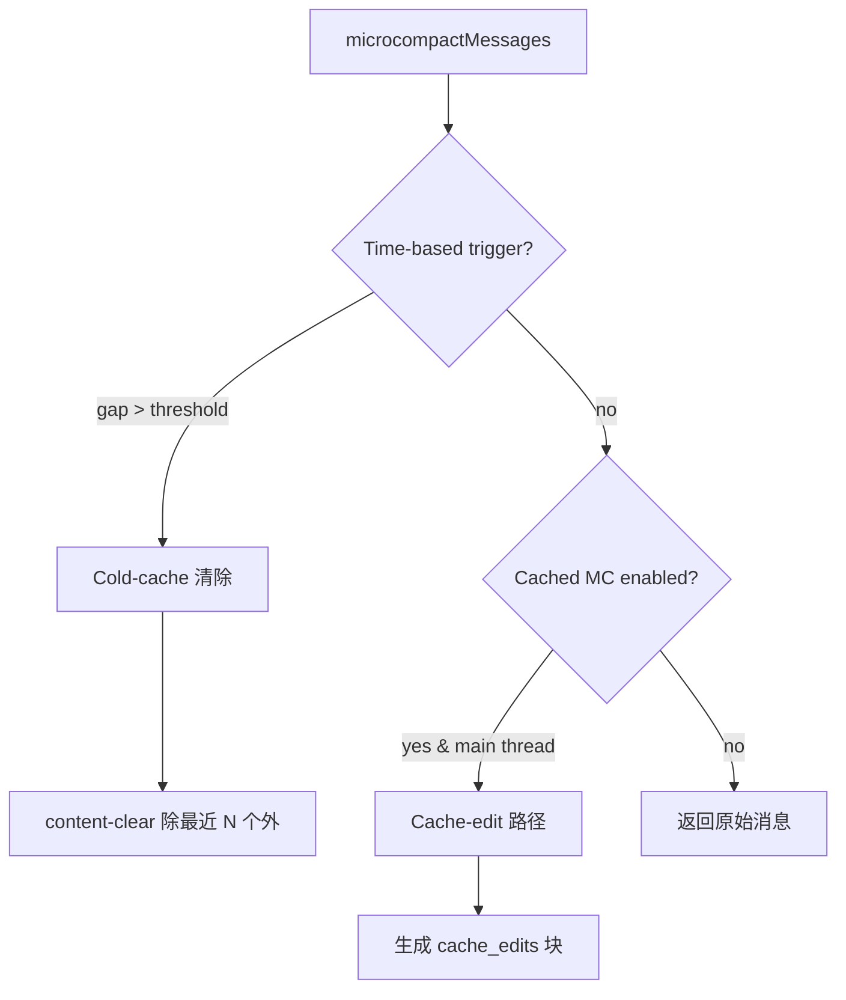

# 第 6 章：上下文压缩与记忆管理

Claude Code 的上下文管理不是一个"策略"，而是一个**四层联动系统**。每一层解决不同时间尺度的上下文压力问题，从单轮内的消息截断，到跨轮的完整对话摘要。

```
时间尺度：短 ────────────────────────────────── 长

           Snip (行级截断)
             ↓
           Microcompact (工具结果清除)
             ↓
           Context Collapse (细粒度回收)
             ↓
           Reactive Compact (413 应急)
             ↓
           Autocompact (整轮摘要压缩)
```

四层不是可选链——在运行时只有一层处于主导地位，由 feature flags 和模型能力决定。

---

## 6.1 Micro-Compact：单轮内的工具结果管理

Micro-Compact 是最轻量的压缩层。它不做语义摘要，只是策略性地"忘掉"工具的历史执行结果。`microCompact.ts`（约 530 行）包含三条路径：缓存编辑路径、时间驱动路径和回退路径。

### 三条路径的决策树



### 时间驱动路径（Time-Based MC）

当用户长时间未交互（间隙超过阈值），服务器 prompt cache 已经过期。此时发送完整历史不仅浪费网络，还浪费缓存写入成本。

```typescript
// microCompact.ts:422-443
export function evaluateTimeBasedTrigger(
  messages: Message[], querySource: QuerySource | undefined,
): { gapMinutes: number; config: TimeBasedMCConfig } | null {
  const config = getTimeBasedMCConfig()
  if (!config.enabled || !querySource || !isMainThreadSource(querySource)) return null
  const lastAssistant = messages.findLast(m => m.type === 'assistant')
  if (!lastAssistant) return null
  const gapMinutes = (Date.now() - new Date(lastAssistant.timestamp).getTime()) / 60_000
  if (!Number.isFinite(gapMinutes) || gapMinutes < config.gapThresholdMinutes) return null
  return { gapMinutes, config }
}
```

**为什么 floor at 1**——注释记录了一个经典的边界问题：`slice(-0)` 返回完整数组（`0` 和 `-0` 在 JavaScript 中索引等价），但清除所有工具结果会让模型失去工作上下文。

```typescript
// 始终保留最近的至少 1 个工具结果
const keepRecent = Math.max(1, config.keepRecent)
const keepSet = new Set(compactableIds.slice(-keepRecent))
const clearSet = new Set(compactableIds.filter(id => !keepSet.has(id)))
```

被清除的内容替换为 `[Old tool result content cleared]`，一个占位符占位，告诉模型"此处曾经有过信息"。这比直接删除工具 result（破坏 message 交替结构）更好——保持了 API 协议的完整性。

### 缓存编辑路径（Cached MC）

Cached MC 是更精巧的路径。它不是直接修改消息内容，而是告诉 API 层"在发送请求时，删除这些工具结果"。好处：prompt 的缓存前缀（之前已缓存的 tokens）不被失效——API 层在缓存前缀之后动态地移除工具结果，而不修改用户侧的消息数组。

```typescript
// microCompact.ts:305-395
async function cachedMicrocompactPath(messages, querySource): Promise<MicrocompactResult> {
  // 1. 收集可压缩的工具 ID
  const compactableToolIds = new Set(collectCompactableToolIds(messages))
  // 2. 注册新工具结果到全局状态
  for (const message of messages) {
    if (message.type === 'user' && Array.isArray(message.message.content)) {
      mod.registerToolResult(state, block.tool_use_id)
    }
  }
  // 3. 计算哪些工具需要删除（超出阈值）
  const toolsToDelete = mod.getToolResultsToDelete(state)
  // 4. 生成 cache_edits 块，附加到 API 请求
  const cacheEdits = mod.createCacheEditsBlock(state, toolsToDelete)
  // 5. 消息返回 unchanged —— cache_edits 由 API 层注入
  return { messages, compactionInfo: { pendingCacheEdits: { trigger: 'auto', ... } } }
}
```

**为什么只限主线程**——如果 forked agent（如 session_memory、prompt_suggestion）也在同一个全局 `cachedMCState` 中注册工具结果，主线程下次执行 cached MC 时会尝试删除不属于自己对话的工具 ID。API 返回错误。这是模块级全局状态跨线程污染的典型 bug。

### 可压缩工具的白名单

并非所有工具结果都可以被清除。只有"信息读取型"工具被认为是可替换的——如果模型需要，可以重新执行。写操作的工具结果（文件编辑、写入）需要保留，因为它们代表了状态的变更。

```typescript
// microCompact.ts:41-50
const COMPACTABLE_TOOLS = new Set<string>([
  FILE_READ_TOOL_NAME,   // 文件读取 → 可重新读取
  ...SHELL_TOOL_NAMES,   // 只读 Bash 命令 → 可重新执行
  GREP_TOOL_NAME,        // 搜索 → 可重新搜索
  GLOB_TOOL_NAME,        // 文件匹配 → 可重新匹配
  WEB_SEARCH_TOOL_NAME,  // 网络搜索 → 可重新搜索
  WEB_FETCH_TOOL_NAME,   // URL 获取 → 可重新获取
  FILE_EDIT_TOOL_NAME,   // 文件编辑 → 工具自身保留，但大结果可清理
  FILE_WRITE_TOOL_NAME,  // 文件写入 → 结果可清理
])
```

---

## 6.2 Autocompact：整轮摘要压缩

Autocompact 是在上下文占用率达到阈值时触发的整轮摘要压缩。与 micro-compact 的"工具结果清除"不同，autocompact 调用模型来生成之前对话的语义摘要。

### 阈值计算

```typescript
// autoCompact.ts:62-65
export const AUTOCOMPACT_BUFFER_TOKENS = 13_000        // 触发缓冲
export const WARNING_THRESHOLD_BUFFER_TOKENS = 20_000   // 警告缓冲
export const ERROR_THRESHOLD_BUFFER_TOKENS = 20_000     // 错误缓冲
export const MANUAL_COMPACT_BUFFER_TOKENS = 3_000       // 手动压缩缓冲
```

阈值不是固定的 token 数——而是基于模型上下文窗口的比例计算：

```typescript
// autoCompact.ts:72-91
export function getAutoCompactThreshold(model: string): number {
  const effectiveContextWindow = getEffectiveContextWindowSize(model)
  return effectiveContextWindow - AUTOCOMPACT_BUFFER_TOKENS
}
// 例如 200K 窗口：187K 触发 autocompact
```

`getEffectiveContextWindowSize` 预留了 20K 作为摘要输出的空间（基于 p99.99 的摘要输出为 17,387 tokens）。

### 互斥关系：四层压缩不能共存

最关键的架构设计是 **四层压缩的策略互斥**：

```typescript
// autoCompact.ts:178-223
// 当 REACTIVE_COMPACT 开启时：
if (feature('REACTIVE_COMPACT')) {
  if (getFeatureValue_CACHED_MAY_BE_STALE('tengu_cobalt_raccoon', false)) {
    return false  // 抑制 proactive autocompact
  }
}

// 当 CONTEXT_COLLAPSE 开启时：
if (feature('CONTEXT_COLLAPSE')) {
  if (isContextCollapseEnabled()) {
    return false  // 完全抑制 autocompact
  }
}
```

**为什么互斥**——如果不抑制，autocompact 会在 context collapse 之前触发（autocompact 在 93% 触发，collapse 在 90% 开始提交），两者竞争，autocompact 先赢，把 collapse 需要精细处理的上下文整轮抹掉。这是一种策略竞争——两个系统各自是正确的，但叠加后产生错误行为。

### 电路断路器

当上下文因不可恢复的原因超额时（如系统提示变更导致所有缓存失效），autocompact 每次都会失败。不限制会导致每轮浪费 1-2 次 API 调用。

```typescript
// autoCompact.ts:68-70
const MAX_CONSECUTIVE_AUTOCOMPACT_FAILURES = 3

// autoCompact.ts:260-264
if (tracking?.consecutiveFailures >= MAX_CONSECUTIVE_AUTOCOMPACT_FAILURES) {
  return { wasCompacted: false }  // 跳过后续重试
}
```

数据来源：BigQuery 记录有 1,279 个 session 出现了 50+ 连续失败（最多 3,272 次），在单日内消耗约 25 万次无效 API 调用。断路器将这个上限限制为 3。

### Session Memory 优先路径

Autocompact 首先尝试 session memory 压缩——如果用户启用了 session 记忆，先尝试将旧会话的记忆摘要替代完整消息：

```typescript
// autoCompact.ts:288-310
const sessionMemoryResult = await trySessionMemoryCompaction(
  messages, toolUseContext.agentId, recompactionInfo.autoCompactThreshold,
)
if (sessionMemoryResult) {
  // Session memory 压缩成功了，跳 over compactConversation
  return { wasCompacted: true, compactionResult: sessionMemoryResult }
}
// 否则回退到整轮摘要压缩
const compactionResult = await compactConversation(messages, ...)
```

**Session Memory 压缩 vs 整轮摘要**——Session memory 压缩利用之前存储在 `.claude/` 目录中的记忆文件作为摘要替代，不需要额外调用 LLM。如果记忆存在且覆盖对话的前半部分，可以直接剪掉这些消息。这是比调用 API 做摘要更廉价的路径。

---

## 6.3 Context Collapse：细粒度的上下文回收

Context Collapse 是四层中最精致的压缩策略。不同于 autocompact 的"全盘摘要"，context collapse 按时间衰减曲线逐步回收旧的工具调用对（tool_use + tool_result），保留最近的精细化上下文。

### 提交日志（Commit Log）架构

Context collapse 不直接修改消息数组。它维护一个模块级的提交日志，记录哪些消息对已被回收：

```
┌─────────────────────────────────────────────────┐
│  提交日志 (Commit Log)                          │
│                                                 │
│  Entry 0: [msg-1, msg-2] → "读取了文件..."      │  ← 最早，最先回收
│  Entry 1: [msg-5, msg-6] → "执行了 grep..."     │
│  Entry 2: [msg-9, msg-10] → "编辑了 src/foo"    │  ← 最近
│                                                 │
│  Commit 阈值: 90% 开始提交                       │
│  Blocking:  95% 强制提交                       │
└─────────────────────────────────────────────────┘
```

### 四层压缩的对比

| 维度 | Snip | Microcompact | Context Collapse | Autocompact |
|------|------|-------------|-----------------|------------|
| **时间粒度** | 行长（单消息内部） | 工具结果级别 | 工具调用对级别 | 整轮对话 |
| **触发时机** | 单消息 > 30 行无工具 | 30 连续工具调用 | 上下文 90% | 上下文 93% |
| **执行方式** | 文本截断 | 内容清除/缓存编辑 | 提交日志回收 | LLM 摘要 |
| **信息损失** | 截断部分文本 | 丢失工具结果 | 替换为摘要 | 丢失全部历史 |
| **API 调用** | 无 | 无 | 无 | 1 次 |
| **恢复能力** | 可重新读取文件 | 可重新执行工具 | 可重新执行 | 不可恢复 |

---

## 6.4 Reactive Compact：API 驱动的应急压缩

Reactive Compact 是唯一的"后置"策略——它不在请求前检查阈值，而在 API 返回 `prompt_too_long`（HTTP 413）后触发。

### 问题定义

即使四层策略都在运行，以下场景仍会导致 413：
- 系统提示变更（导致所有缓存失效，实际可用上下文骤降）
- 媒体内容超限（图片/PDF 内容无法通过 collapse 清除）
- 多张图片（image count × ~2000 tokens 可能超出窗口）

### 处理流程

```mermaid
sequenceDiagram
    participant Loop as queryLoop
    participant API as Claude API
    participant RC as Reactive Compact
    participant Collapse as Context Collapse

    Loop->>API: send request
    API-->>Loop: 413 prompt_too_long (withheld)

    Loop->>Collapse: recoverFromOverflow()
    Collapse-->>Loop: drained committed? 
    alt 有 staged entries 可 drain
        Loop->>Loop: new State → continue (collapse_drain_retry)
        Loop->>API: retry request
    else staged 为空或已 drain
        alt media size error
            Loop->>Loop: no recovery → surface error
        else
            Loop->>RC: tryReactiveCompact()
            alt compact 成功
                RC-->>Loop: compacted messages
                Loop->>Loop: new State → continue (reactive_compact_retry)
                Loop->>API: retry request
            else compact 已尝试过
                Loop->>Loop: surface withheld error
                Loop->>Loop: return { reason: 'prompt_too_long' }
            end
        end
    end
```

### 媒体恢复的特殊路径

```typescript
// query.ts:1079-1082
const isWithheldMedia =
  mediaRecoveryEnabled &&
  reactiveCompact?.isWithheldMediaSizeError(lastMessage)
```

媒体的恢复路径与普通 prompt-too-long 不同——collapse 不会清除图片内容（collapse 针对的是文本和工具结果）。因此媒体超限直接跳过 collapse drain，进入 reactive compact。如果 reactive compact 已经尝试过（`hasAttemptedReactiveCompact = true`），错误直接暴露——这是防止无限重试的关键 guard。

---

## 6.5 Prompt 构造与压缩后消息重建

### compactConversation：摘要压缩的引擎

`compact.ts` 是整个压缩系统的核心执行器。它调用另一个 LLM 实例来生成之前对话的摘要。

关键设计点：
- **Suppress user questions**——autocompact 模式下不询问用户意见
- **Cache-safe params**——压缩后的消息必须保证系统提示和工具上下文不变
- **Recompaction info**——记录每次 compact 的原因和上下文，用于诊断 compact 的链式触发

### 边界消息（Boundary Message）

每次压缩后，系统插入一个边界消息来标记压缩点：

```
User: 帮我分析一下这个代码库
Assistant: 好的，我先读取文件...
[tool: Read src/index.ts]
Assistant: 让我总结一下...

--- [Compact Boundary] ---
System: 之前的对话已被压缩。摘要如下：
"用户要求分析代码库，已读取了 src/index.ts，讨论了主要架构..."

Assistant: 继续分析...
```

边界消息的存在告诉模型"你之前的工作已经总结在这里，从这里继续"。这对防止模型"遗忘"之前的行动至关重要。

---

## 6.6 压缩后清理（Post-Compact Cleanup）

压缩不是只发生在消息级别。`runPostCompactCleanup` 清理多个模块的残留状态：

```typescript
// postCompactCleanup.ts
export function runPostCompactCleanup(querySource?: QuerySource) {
  resetContextCollapse()                // 重置 context collapse 的提交日志
  resetSessionStorage()                 // 清除会话存储的缓存
  resetCachedMCState()                  // 清除 cached microcompact 状态
  resetFileReadState()                  // 重置文件读取状态追踪
  // ...
}
```

**为何在压缩后而非压缩前**——压缩前的状态指的是旧对话的执行轨迹。如果压缩前重置，模型可能在压缩期间仍引用旧状态，导致状态不一致。压缩后重置保证了新旧状态在压缩边界处干净分隔。
