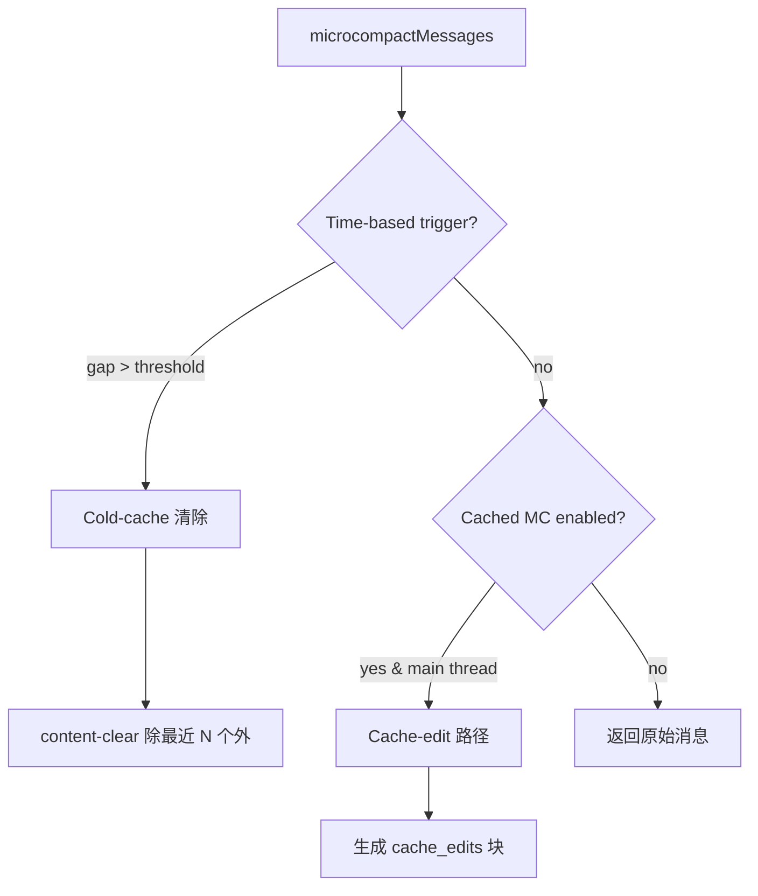

# 第 6 章：上下文压缩与记忆管理

Claude Code 的上下文管理不是一个"策略"，而是一个**四层联动系统**。每一层解决不同时间尺度的上下文压力问题，从单轮内的消息截断，到跨轮的完整对话摘要。

```
时间尺度：短 ────────────────────────────────── 长

           Snip (行级截断)
             ↓
           Microcompact (工具结果清除)
             ↓
           Context Collapse (细粒度回收)
             ↓
           Reactive Compact (413 应急)
             ↓
           Autocompact (整轮摘要压缩)
```

四层不是可选链——在运行时只有一层处于主导地位，由 feature flags 和模型能力决定。

---

## 6.1 Micro-Compact：单轮内的工具结果管理

Micro-Compact 是最轻量的压缩层。它不做语义摘要，只是策略性地"忘掉"工具的历史执行结果。`microCompact.ts`（约 530 行）包含三条路径：缓存编辑路径、时间驱动路径和回退路径。

### 三条路径的决策树



### 时间驱动路径（Time-Based MC）

当用户长时间未交互（间隙超过阈值），服务器 prompt cache 已经过期。此时发送完整历史不仅浪费网络，还浪费缓存写入成本。

```typescript
// microCompact.ts:422-443
export function evaluateTimeBasedTrigger(
  messages: Message[], querySource: QuerySource | undefined,
): { gapMinutes: number; config: TimeBasedMCConfig } | null {
  const config = getTimeBasedMCConfig()
  if (!config.enabled || !querySource || !isMainThreadSource(querySource)) return null
  const lastAssistant = messages.findLast(m => m.type === 'assistant')
  if (!lastAssistant) return null
  const gapMinutes = (Date.now() - new Date(lastAssistant.timestamp).getTime()) / 60_000
  if (!Number.isFinite(gapMinutes) || gapMinutes < config.gapThresholdMinutes) return null
  return { gapMinutes, config }
}
```

**为什么 floor at 1**——注释记录了一个经典的边界问题：`slice(-0)` 返回完整数组（`0` 和 `-0` 在 JavaScript 中索引等价），但清除所有工具结果会让模型失去工作上下文。

```typescript
// 始终保留最近的至少 1 个工具结果
const keepRecent = Math.max(1, config.keepRecent)
const keepSet = new Set(compactableIds.slice(-keepRecent))
const clearSet = new Set(compactableIds.filter(id => !keepSet.has(id)))
```

被清除的内容替换为 `[Old tool result content cleared]`，一个占位符占位，告诉模型"此处曾经有过信息"。这比直接删除工具 result（破坏 message 交替结构）更好——保持了 API 协议的完整性。

### 缓存编辑路径（Cached MC）

Cached MC 是更精巧的路径。它不是直接修改消息内容，而是告诉 API 层"在发送请求时，删除这些工具结果"。好处：prompt 的缓存前缀（之前已缓存的 tokens）不被失效——API 层在缓存前缀之后动态地移除工具结果，而不修改用户侧的消息数组。

```typescript
// microCompact.ts:305-395
async function cachedMicrocompactPath(messages, querySource): Promise<MicrocompactResult> {
  // 1. 收集可压缩的工具 ID
  const compactableToolIds = new Set(collectCompactableToolIds(messages))
  // 2. 注册新工具结果到全局状态
  for (const message of messages) {
    if (message.type === 'user' && Array.isArray(message.message.content)) {
      mod.registerToolResult(state, block.tool_use_id)
    }
  }
  // 3. 计算哪些工具需要删除（超出阈值）
  const toolsToDelete = mod.getToolResultsToDelete(state)
  // 4. 生成 cache_edits 块，附加到 API 请求
  const cacheEdits = mod.createCacheEditsBlock(state, toolsToDelete)
  // 5. 消息返回 unchanged —— cache_edits 由 API 层注入
  return { messages, compactionInfo: { pendingCacheEdits: { trigger: 'auto', ... } } }
}
```

**为什么只限主线程**——如果 forked agent（如 session_memory、prompt_suggestion）也在同一个全局 `cachedMCState` 中注册工具结果，主线程下次执行 cached MC 时会尝试删除不属于自己对话的工具 ID。API 返回错误。这是模块级全局状态跨线程污染的典型 bug。

### 可压缩工具的白名单

并非所有工具结果都可以被清除。只有"信息读取型"工具被认为是可替换的——如果模型需要，可以重新执行。写操作的工具结果（文件编辑、写入）需要保留，因为它们代表了状态的变更。

```typescript
// microCompact.ts:41-50
const COMPACTABLE_TOOLS = new Set<string>([
  FILE_READ_TOOL_NAME,   // 文件读取 → 可重新读取
  ...SHELL_TOOL_NAMES,   // 只读 Bash 命令 → 可重新执行
  GREP_TOOL_NAME,        // 搜索 → 可重新搜索
  GLOB_TOOL_NAME,        // 文件匹配 → 可重新匹配
  WEB_SEARCH_TOOL_NAME,  // 网络搜索 → 可重新搜索
  WEB_FETCH_TOOL_NAME,   // URL 获取 → 可重新获取
  FILE_EDIT_TOOL_NAME,   // 文件编辑 → 工具自身保留，但大结果可清理
  FILE_WRITE_TOOL_NAME,  // 文件写入 → 结果可清理
])
```

---

## 6.2 Autocompact：整轮摘要压缩

Autocompact 是在上下文占用率达到阈值时触发的整轮摘要压缩。与 micro-compact 的"工具结果清除"不同，autocompact 调用模型来生成之前对话的语义摘要。

### 阈值计算

```typescript
// autoCompact.ts:62-65
export const AUTOCOMPACT_BUFFER_TOKENS = 13_000        // 触发缓冲
export const WARNING_THRESHOLD_BUFFER_TOKENS = 20_000   // 警告缓冲
export const ERROR_THRESHOLD_BUFFER_TOKENS = 20_000     // 错误缓冲
export const MANUAL_COMPACT_BUFFER_TOKENS = 3_000       // 手动压缩缓冲
```

阈值不是固定的 token 数——而是基于模型上下文窗口的比例计算：

```typescript
// autoCompact.ts:72-91
export function getAutoCompactThreshold(model: string): number {
  const effectiveContextWindow = getEffectiveContextWindowSize(model)
  return effectiveContextWindow - AUTOCOMPACT_BUFFER_TOKENS
}
// 例如 200K 窗口：187K 触发 autocompact
```

`getEffectiveContextWindowSize` 预留了 20K 作为摘要输出的空间（基于 p99.99 的摘要输出为 17,387 tokens）。

### 互斥关系：四层压缩不能共存

最关键的架构设计是 **四层压缩的策略互斥**：

```typescript
// autoCompact.ts:178-223
// 当 REACTIVE_COMPACT 开启时：
if (feature('REACTIVE_COMPACT')) {
  if (getFeatureValue_CACHED_MAY_BE_STALE('tengu_cobalt_raccoon', false)) {
    return false  // 抑制 proactive autocompact
  }
}

// 当 CONTEXT_COLLAPSE 开启时：
if (feature('CONTEXT_COLLAPSE')) {
  if (isContextCollapseEnabled()) {
    return false  // 完全抑制 autocompact
  }
}
```

**为什么互斥**——如果不抑制，autocompact 会在 context collapse 之前触发（autocompact 在 93% 触发，collapse 在 90% 开始提交），两者竞争，autocompact 先赢，把 collapse 需要精细处理的上下文整轮抹掉。这是一种策略竞争——两个系统各自是正确的，但叠加后产生错误行为。

### 电路断路器

当上下文因不可恢复的原因超额时（如系统提示变更导致所有缓存失效），autocompact 每次都会失败。不限制会导致每轮浪费 1-2 次 API 调用。

```typescript
// autoCompact.ts:68-70
const MAX_CONSECUTIVE_AUTOCOMPACT_FAILURES = 3

// autoCompact.ts:260-264
if (tracking?.consecutiveFailures >= MAX_CONSECUTIVE_AUTOCOMPACT_FAILURES) {
  return { wasCompacted: false }  // 跳过后续重试
}
```

数据来源：BigQuery 记录有 1,279 个 session 出现了 50+ 连续失败（最多 3,272 次），在单日内消耗约 25 万次无效 API 调用。断路器将这个上限限制为 3。

### Session Memory 优先路径

Autocompact 首先尝试 session memory 压缩——如果用户启用了 session 记忆，先尝试将旧会话的记忆摘要替代完整消息：

```typescript
// autoCompact.ts:288-310
const sessionMemoryResult = await trySessionMemoryCompaction(
  messages, toolUseContext.agentId, recompactionInfo.autoCompactThreshold,
)
if (sessionMemoryResult) {
  // Session memory 压缩成功了，跳 over compactConversation
  return { wasCompacted: true, compactionResult: sessionMemoryResult }
}
// 否则回退到整轮摘要压缩
const compactionResult = await compactConversation(messages, ...)
```

**Session Memory 压缩 vs 整轮摘要**——Session memory 压缩利用之前存储在 `.claude/` 目录中的记忆文件作为摘要替代，不需要额外调用 LLM。如果记忆存在且覆盖对话的前半部分，可以直接剪掉这些消息。这是比调用 API 做摘要更廉价的路径。

---

## 6.3 Context Collapse：细粒度的上下文回收

Context Collapse 是四层中最精致的压缩策略。不同于 autocompact 的"全盘摘要"，context collapse 按时间衰减曲线逐步回收旧的工具调用对（tool_use + tool_result），保留最近的精细化上下文。

### 提交日志（Commit Log）架构

Context collapse 不直接修改消息数组。它维护一个模块级的提交日志，记录哪些消息对已被回收：

```
┌─────────────────────────────────────────────────┐
│  提交日志 (Commit Log)                          │
│                                                 │
│  Entry 0: [msg-1, msg-2] → "读取了文件..."      │  ← 最早，最先回收
│  Entry 1: [msg-5, msg-6] → "执行了 grep..."     │
│  Entry 2: [msg-9, msg-10] → "编辑了 src/foo"    │  ← 最近
│                                                 │
│  Commit 阈值: 90% 开始提交                       │
│  Blocking:  95% 强制提交                       │
└─────────────────────────────────────────────────┘
```

### 四层压缩的对比

| 维度 | Snip | Microcompact | Context Collapse | Autocompact |
|------|------|-------------|-----------------|------------|
| **时间粒度** | 行长（单消息内部） | 工具结果级别 | 工具调用对级别 | 整轮对话 |
| **触发时机** | 单消息 > 30 行无工具 | 30 连续工具调用 | 上下文 90% | 上下文 93% |
| **执行方式** | 文本截断 | 内容清除/缓存编辑 | 提交日志回收 | LLM 摘要 |
| **信息损失** | 截断部分文本 | 丢失工具结果 | 替换为摘要 | 丢失全部历史 |
| **API 调用** | 无 | 无 | 无 | 1 次 |
| **恢复能力** | 可重新读取文件 | 可重新执行工具 | 可重新执行 | 不可恢复 |

---

## 6.4 Reactive Compact：API 驱动的应急压缩

Reactive Compact 是唯一的"后置"策略——它不在请求前检查阈值，而在 API 返回 `prompt_too_long`（HTTP 413）后触发。

### 问题定义

即使四层策略都在运行，以下场景仍会导致 413：
- 系统提示变更（导致所有缓存失效，实际可用上下文骤降）
- 媒体内容超限（图片/PDF 内容无法通过 collapse 清除）
- 多张图片（image count × ~2000 tokens 可能超出窗口）

### 处理流程

```mermaid
sequenceDiagram
    participant Loop as queryLoop
    participant API as Claude API
    participant RC as Reactive Compact
    participant Collapse as Context Collapse

    Loop->>API: send request
    API-->>Loop: 413 prompt_too_long (withheld)

    Loop->>Collapse: recoverFromOverflow()
    Collapse-->>Loop: drained committed? 
    alt 有 staged entries 可 drain
        Loop->>Loop: new State → continue (collapse_drain_retry)
        Loop->>API: retry request
    else staged 为空或已 drain
        alt media size error
            Loop->>Loop: no recovery → surface error
        else
            Loop->>RC: tryReactiveCompact()
            alt compact 成功
                RC-->>Loop: compacted messages
                Loop->>Loop: new State → continue (reactive_compact_retry)
                Loop->>API: retry request
            else compact 已尝试过
                Loop->>Loop: surface withheld error
                Loop->>Loop: return { reason: 'prompt_too_long' }
            end
        end
    end
```

### 媒体恢复的特殊路径

```typescript
// query.ts:1079-1082
const isWithheldMedia =
  mediaRecoveryEnabled &&
  reactiveCompact?.isWithheldMediaSizeError(lastMessage)
```

媒体的恢复路径与普通 prompt-too-long 不同——collapse 不会清除图片内容（collapse 针对的是文本和工具结果）。因此媒体超限直接跳过 collapse drain，进入 reactive compact。如果 reactive compact 已经尝试过（`hasAttemptedReactiveCompact = true`），错误直接暴露——这是防止无限重试的关键 guard。

---

## 6.5 Prompt 构造与压缩后消息重建

### compactConversation：摘要压缩的引擎

`compact.ts` 是整个压缩系统的核心执行器。它调用另一个 LLM 实例来生成之前对话的摘要。

关键设计点：
- **Suppress user questions**——autocompact 模式下不询问用户意见
- **Cache-safe params**——压缩后的消息必须保证系统提示和工具上下文不变
- **Recompaction info**——记录每次 compact 的原因和上下文，用于诊断 compact 的链式触发

### 边界消息（Boundary Message）

每次压缩后，系统插入一个边界消息来标记压缩点：

```
User: 帮我分析一下这个代码库
Assistant: 好的，我先读取文件...
[tool: Read src/index.ts]
Assistant: 让我总结一下...

--- [Compact Boundary] ---
System: 之前的对话已被压缩。摘要如下：
"用户要求分析代码库，已读取了 src/index.ts，讨论了主要架构..."

Assistant: 继续分析...
```

边界消息的存在告诉模型"你之前的工作已经总结在这里，从这里继续"。这对防止模型"遗忘"之前的行动至关重要。

---

## 6.6 压缩后清理（Post-Compact Cleanup）

压缩不是只发生在消息级别。`runPostCompactCleanup` 清理多个模块的残留状态：

```typescript
// postCompactCleanup.ts
export function runPostCompactCleanup(querySource?: QuerySource) {
  resetContextCollapse()                // 重置 context collapse 的提交日志
  resetSessionStorage()                 // 清除会话存储的缓存
  resetCachedMCState()                  // 清除 cached microcompact 状态
  resetFileReadState()                  // 重置文件读取状态追踪
  // ...
}
```

**为何在压缩后而非压缩前**——压缩前的状态指的是旧对话的执行轨迹。如果压缩前重置，模型可能在压缩期间仍引用旧状态，导致状态不一致。压缩后重置保证了新旧状态在压缩边界处干净分隔。


---

## 6.5 压缩阈值的令牌计算

```typescript
// autoCompact.ts:33-49
const effectiveContextWindow = getContextWindowForModel(model) - reservedTokensForSummary
const reservedTokensForSummary = Math.min(getMaxOutputTokensForModel(model), 20000)
```

**20,000 的来源**——基于 p99.99 的压缩摘要输出为 17,387 tokens。取 20,000 是合理的上限——99.99% 的摘要不会超过这个大小。

### Auto-Compact 阈值

```typescript
// autoCompact.ts:72-91
const AUTOCOMPACT_BUFFER_TOKENS = 13_000
const autoCompactThreshold = effectiveContextWindow - AUTOCOMPACT_BUFFER_TOKENS
```

为何是 13,000——这不是随意选择的。上下文窗口中剩余的空间必须足够容纳：下一轮用户输入 + 模型的工具调用 + 工具结果。如果缓冲太小，模型可能在压缩触发后仍超出限制。13,000 确保了即使在最坏情况下（大量工具调用 + 大工具结果），也有足够的空间完成一轮。

### 警告阈值系统

```
Warning threshold  = threshold - 20,000
Error threshold     = threshold - 20,000
Blocking limit      = actualContextWindow - 3,000
```

**Blocking limit 的 3,000 tokens**——这是手动 `/compact` 的最低空间。即使 auto-compact 失败，用户仍可以通过手动压缩恢复。3,000 tokens 足以渲染 UI 和输入命令。

### 覆盖机制

| 环境变量 | 效果 |
|---------|------|
| `CLAUDE_CODE_AUTO_COMPACT_WINDOW` | 上限上下文窗口大小 |
| `CLAE_AUTO_COMPACT_PCT` | 基于百分比的覆盖 |
| `CLAUDE_CODE_BLOCKING_LIMIT` | 覆盖阻塞限制 |
| `DISABLE_COMPACT` | 禁用所有压缩（包括手动 `/compact`） |
| `DISABLE_AUTO_COMPACT` | 只禁用自动压缩 |

---

## 6.6 压缩算法：摘要、删除、保留

### 压缩摘要的结构

```typescript
// prompt.ts:61-77
// AI 被指令生成以下部分的结构化摘要:
// 1. Primary Request and Intent
// 2. Key Technical Concepts
// 3. Files and Code Sections
// 4. Errors and Fixes
// 5. Problem Solving
// 6. All user messages (non-tool)
// 7. Pending Tasks
// 8. Current Work
// 9. Optional Next Step
```

**`<analysis>` 和 `<summary>` 标签**——AI 被指令将分析草稿放入 `<analysis>` 标签（类似 draft scratchpad），最终摘要放入 `<summary>` 标签。`<analysis>` 块在 `formatCompactSummary()` 中被剥离——用户不会看到模型的推理过程。

### 被清除的内容

| 内容 | 清除方式 | 原因 |
|------|---------|------|
| 压缩边界前的所有消息 | 替换为 boundary + summary | 核心压缩语义 |
| 文件读取缓存 | `context.readFileState.clear()` | 旧的文件读取在摘要中已总结 |
| `loadedNestedMemoryPaths` | `.clear()` | 内存路径在摘要后无效 |

**为何不保留 Skill names**——注释明确指出：重新注入 `skill_listing`（约 4K tokens）在压缩后的 cache_creation 是纯浪费。Skill 名字被**保留**——不重置。

### 被保留/重新注入的内容

| 内容 | 机制 | Token 预算 |
|------|------|-----------|
| 最近访问的文件（最多 5 个） | FileReadTool 重新读取 | 50,000 总上限，每文件 5,000 |
| Plan 文件 | 如果存在则附加 | - |
| 已调用的技能 | 最近优先，每技能截断 | 总预算 25,000，每技能 5,000 |
| Async Agent 状态 | 运行中/已完成的 Agent | - |
| 工具/Agent/MCP 增量重新通告 | Delta attachments | - |
| SessionStart hooks | CLAUDE.md 等 | - |

**重新注入的必要性**——压缩后，模型失去了所有历史上下文。如果不重新注入这些内容，模型不知道之前的文件内容是什么、哪些技能已被调用、哪些 Agent 在运行。

---

## 6.7 三种压缩层级的层次结构

```
Layer 1: API 级上下文管理 (apiMicrocompact.ts)
  - 服务器端工具/thinking 清除，通过上下文管理 API
  - 无客户端消息变更
  - 使用 context management API 的 clear_thinking_20251015 策略

Layer 2: 微压缩 (microCompact.ts)
  - 缓存 MC: 延迟 cache_edit 块到 API 层（客户端消息不变）
  - 时间 MC: 直接清除旧工具结果内容（>1h 间隔）
  - 每次 API 调用前运行

Layer 3: 完整压缩 (compact.ts, autoCompact.ts, sessionMemoryCompact.ts)
  - Auto-compact: tokens >= effectiveContextWindow - 13,000 时触发
  - 手动 /compact: 用户发起
  - 会话内存压缩: 使用 CLAUDE.md 式会话内存作为摘要
  - Reactive compact: 由 API 提示-过长错误触发（feature-flagged）
```

### 时间微压缩（Time-Based Micro-Compact）

```typescript
// microCompact.ts:446-530
function maybeTimeBasedMicrocompact():
  // 当自最后一条助手消息以来的间隔超过 gapThresholdMinutes（默认 60 分钟）时触发
  // 此时服务器缓存已过期，清除旧工具结果可减少重写的字节数
  // 内容-改变最近 N 个可压缩工具之外的工具结果为
  // "[Old tool result content cleared]"
```

**为何 60 分钟**——Prompt cache 的 TTL 通常约 1 小时。如果用户离开会话超过 60 分钟，缓存无论如何都会过期。与其保留大量旧工具结果直到下一轮模型调用（它们会被包含在重写的前缀中），不如现在就清除它们。

### API 级 Thinking 管理

```typescript
// apiMicrocompact.ts:77-86
// 默认: 保留所有先前助手轮次中的 thinking 块 (keep: 'all')
// 缓存过期（>1h 空闲）: 只保留最后一个 thinking 轮次
// redact_thinking 激活时: 完全跳过（因为 redacted 块无模型可见内容）
```

**为何缓存过期时只保留最后一个 thinking**——Thinking 块可能非常大（数 K tokens）。如果缓存已过期，保留所有 thinking 只是浪费重写的 token。只保留最后一个 thinking 给模型一些连续的思维轨迹，同时最小化开销。

---

## 6.8 手动 `/compact` vs Auto-Compact 的行为差异

| 方面 | 手动 `/compact` | Auto-Compact |
|------|----------------|-------------|
| `suppressFollowUpQuestions` | `false`（摘要后继续对话） | `true`（不询问用户，自动继续） |
| `customInstructions` | 可由用户提供 | `undefined` |
| 错误通知 | 显示错误 | 抑制（不干扰用户） |
| 微压缩 | 在摘要前运行 | 在每轮查询开始时运行 |
| 断路器 | 无 | 连续 3 次失败后停止 |
| 前置 hooks | 运行 PreCompact hooks | 运行 PreCompact hooks |

### Auto-Compact 的断路器

```typescript
const MAX_CONSECUTIVE_AUTOCOMPACT_FAILURES = 3
```

连续 3 次 auto-compact 失败后，断路器触发——不再尝试自动压缩。这是防止压缩错误导致无限重试循环。用户仍然可以手动 `/compact`。

**什么是"失败"**——压缩 API 调用返回错误，或压缩提示过长无法恢复。如果 `DISABLE_COMPACT` 或 `DISABLE_AUTO_COMPACT` 设置，压缩根本不运行。

### Auto-Compact 的 `suppressFollowUpQuestions`

```typescript
// 自动压缩的摘要包括:
"Continue the conversation from where it left off without asking the user any further questions. Resume directly -- do not acknowledge the summary..."
```

这防止了压缩后模型输出"A summary of our conversation so far... What would you like to do next?"——这会打扰用户。用户看到的是一个无缝的压缩——模型自动继续工作而不提示。

---

## 6.9 压缩后的消息重建

### Compact Boundary Message

```typescript
// SystemCompactBoundaryMessage:
{
  type: 'system',
  subtype: 'compact_boundary',
  compactMetadata: {
    trigger: 'manual' | 'auto',
    preTokens: 压缩前token数,
    preCompactDiscoveredTools: [...],  // 压缩前发现的工具名
    logicalParentUuid: 指向最后一条消息
  }
}
```

**`preCompactDiscoveredTools` 的意义**——这是一个排序的工具名列表。压缩后，系统需要知道哪些工具在压缩前被加载过。有了这个列表，可以在后续 API 调用中包含正确的工具 schema。否则，如果 MCP 工具在压缩后被"丢失"，模型将无法再调用它们。

### Partial Compact（部分压缩）

```typescript
// compact.ts:772-1106
function partialCompactConversation(messages, pivotIndex, direction):
  // 'from' 方向: 透视点之后的消息做摘要，保留较早的
  // 'up_to' 方向: 透视点之前的消息做摘要，保留较晚的
```

**Partial Compact 的两种方向**——`'from'` 保留前缀（early messages），`'up_to'` 保留后缀（recent messages）。`'from'` 方向保留先前压缩的缓存，因为摘要放在后面。`'up_to'` 会使缓存无效，因为摘要在保留的消息之前。

### 压缩时的缓存共享

```typescript
// compact.ts:1150-1248 (tengu_compact_cache_prefix, 默认 true)
// runForkedAgent() with same cacheSafeParams:
// - system prompt, tools, model, messages prefix, thinking config
// - 不设置 maxOutputTokens（会导致 thinking config 不匹配，使缓存失效）
```

**为何不设置 maxOutputTokens**——这会 clamp `budget_tokens`，造成 thinking 配置与主对话不同。API 的缓存 key 基于配置参数——任何差异都会导致缓存 miss。

---

## 6.10 API 轮次分组与 Turn 结构保留

```typescript
// grouping.ts:22-63
// 消息按 message.id（API 响应 ID）分组
// 当新的助手响应出现（不同的 message.id）时发生边界分组
```

**为何不用 "human turn" 分组**——在 Agent 会话中，整个工作负载可能只有一个 human turn。按 API 轮次分组确保每个压缩边界对应一个完整的 model→tool→model 周期。

### 压缩时的 Thinking 块处理

```
完整压缩 (compactConversation):
  - 压缩 API 调用: thinking disabled ({ type: 'disabled' })
  - 被压缩的消息: thinking 块作为输入的一部分传递（不被剥离）
  - 摘要 AI 读取 thinking 作为上下文，但只输出纯文本 <summary>

微压缩 (apiMicrocompact):
  - 服务器端: clear_thinking_20251015 策略
  - 默认保留所有 thinking (keep: 'all')
  - 缓存过期时只保留最后一个 thinking 轮次

会话内存压缩 (sessionMemoryCompact):
  - adjustIndexToPreserveAPIInvariants() 特殊处理 thinking 块
  - 如果保留的助手消息与之前的助手消息共享 message.id
  - 调整索引以包含这些先前的消息（防止 thinking 块孤立）
```

**Thinking 块孤立的防范**——当 `normalizeMessagesForAPI` 通过 `message.id` 合并流式消息时，一个助手消息的 thinking 可能与另一个助手消息的文本在同一 ID 下。如果压缩不保留所有关联消息，thinking 块会成为孤立消息（没有配对的响应）。`adjustIndexToPreserveAPIInvariants()` 确保所有 `message.id` 关联的消息被作为一个单元保留。

---

## 6.9 压缩管线分层

Claude Code 实现了分层压缩策略——按成本从低到高执行：

| 层 | 策略 | 成本 | 缓存友好性 |
|---|------|------|----------|
| 1 | Session Memory Compaction | 无（复用已提取的事实） | — |
| 2 | Microcompaction（时间型） | 无（就地清除） | 重置缓存 |
| 3 | Microcompaction（Cached MC） | 无（cache_edits） | 保留缓存前缀 |
| 4 | Session Memory Compaction（full） | 1 次 Haiku 调用 | 部分 |
| 5 | Full Conversation Compaction | 1 次 Sonnet 调用 | 销毁 |
| 6 | Partial Compaction | 1 次 模型调用 | 取决于方向 |

**关键设计原则**——系统先尝试廉价路径（session memory），如果可行则直接返回，不触发昂贵的 LLM 压缩。

---

## 6.10 Full Conversation Compaction 细节

`compact.ts`（约 1400 行）是核心压缩函数：

**执行管线**：
1. **Pre-Compact Hooks**——`executePreCompactHooks()` 运行 `pre_compact` 生命周期 hook，可贡献自定义指令和用户可见消息
2. **生成摘要**——通过 forked agent 或流式回退：
   - **缓存共享路径（默认）**：`runForkedAgent`，`maxTurns: 1`——复用主对话缓存的 prompt 前缀（系统 prompt + 工具）。由特性标记 `tengu_compact_cache_prefix`（默认 `true`）门控
   - **流式回退**：`queryModelWithStreaming()`——缓存共享失败时使用
3. **剥离图像**——`stripImagesFromMessages()` 用 `[image]`/`[document]` 文本标记替换图像/文档块
4. **剥离 Reinjected Attachment**——`stripReinjectedAttachments()` 过滤 `skill_discovery`/`skill_listing` 附件
5. **Prompt 超长处理**——`truncateHeadForPTLRetry`——当压缩请求本身就超过限制时，逐步丢弃最旧的 API 轮组，最多重试 `MAX_PTL_RETRIES = 3` 次
6. **清除文件状态并重新附加**——最近的文件、plans、skills、MCP 工具、agent listing
7. **创建边界标记**——`createCompactBoundaryMessage('auto'|'manual', preCompactTokenCount, uuid)`
8. **SessionStart Hooks**——恢复 CLAUDE.md 和上下文文件
9. **Post-Compact Hooks**——后置清理

**压缩 Prompt**——两阶段结构：
- **NO_TOOLS_PREAMBLE**：强制执行"仅文本，无工具"
- **BASE_COMPACT_PROMPT**：9 个段落的详细摘要模板（请求、概念、文件、错误、解决、消息、任务、当前工作、下一步）

**Post-Compact 重建预算**：
- `POST_COMPACT_MAX_FILES_TO_RESTORE = 5`
- `POST_COMPACT_TOKEN_BUDGET = 50,000`
- `POST_COMPACT_MAX_TOKENS_PER_FILE = 5,000`
- `POST_COMPACT_SKILLS_TOKEN_BUDGET = 25,000`

`createPostCompactFileAttachments` 通过 `FileReadTool` 重新读取最近访问的文件，受文件数量和 token 预算约束。

---

## 6.11 Partial Compaction

`partialCompactConversation()` 支持两种方向模式：

**'from'（前缀保留）**——对 pivot 索引**之后**的消息进行摘要，保留之前的消息。保留消息的 prompt 缓存**不**被销毁。

**'up_to'（后缀保留）**——对 pivot 索引**之前**的消息进行摘要，保留之后的消息。提示摘要在保留消息**之前**，因此 prompt 缓存**被**销毁。

关键差异：`'up_to'` 必须从"保留"集中剥离旧的 compact 边界；`'from'` 则不需要。

---

## 6.12 Auto-Compact 与阈值

`autoCompact.ts` 中的自动压缩触发条件：

```
AUTOCOMPACT_BUFFER_TOKENS         = 13,000  // 距上下文窗口多远触发自动压缩
WARNING_THRESHOLD_BUFFER_TOKENS   = 20,000  // 何时显示 UI 警告
ERROR_THRESHOLD_BUFFER_TOKENS     = 20,000  // 错误级别警告
MANUAL_COMPACT_BUFFER_TOKENS      =  3,000  // 阻塞上限
MAX_OUTPUT_TOKENS_FOR_SUMMARY     = 20,000  // 为摘要输出预留
MAX_CONSECUTIVE_AUTOCOMPACT_FAILURES = 3    // 熔断
```

**有效上下文窗口**——`getEffectiveContextWindowSize(model)`：
- `contextWindow - reservedTokensForSummary`
- 预留 = `min(getMaxOutputTokensForModel(model), 20,000)`
- `CLAUDE_CODE_AUTO_COMPACT_WINDOW` 环境变量可限制有效上下文窗口
- `CLAUDE_CODE_MAX_CONTEXT_TOKENS` 可完全覆盖模型上下文窗口

**`shouldAutoCompact()`** 检查：
- `DISABLE_COMPACT`、`DISABLE_AUTO_COMPACT` 环境变量
- `userConfig.autoCompactEnabled`
- 递归守卫——跳过 `querySource === 'session_memory' | 'compact'`
- 特性标记 `REACTIVE_COMPACT` 和 `CONTEXT_COLLAPSE` 抑制自动压缩

**熔断**——`AutoCompactTrackingState.consecutiveFailures` 连续 3 次失败后，返回 `{ wasCompacted: false }` 并记录警告。成功后重置为 0。

---

## 6.13 Session Memory Compaction

`sessionMemoryCompact.ts` 是实验性方法——使用已累积的 session memory（提取的事实、模式、决策）**作为**摘要，而非请求模型生成：

**配置**（GrowthBook `tengu_sm_compact_config` 获取）：
- `minTokens = 10,000`——最小 token 数
- `minTextBlockMessages = 5`——最小文本块消息数
- `maxTokens = 40,000`——硬上限

**`calculateMessagesToKeepIndex()`**——从 `lastSummarizedIndex + 1`（最后摘要边界之后的消息）开始：
- 向后扩展直到**任一**条件满足：
  - `totalTokens >= minTokens (10,000)`**且**`textBlockMessageCount >= minTextBlockMessages (5)`
  - `totalTokens >= maxTokens (40,000)`
- 下限：不低于最后压缩边界

**`adjustIndexToPreserveAPIInvariants()`**——确保切片不拆分 tool_use/tool_result 对：
- 从 startIndex 向后扫描，检查 retained 范围内是否有 tool_result 匹配的 tool_use
- 同时检查具有相同 `message.id` 的 assistant 消息（保留共享流式 ID 的 thinking 块）

**特性门控**——需要 `tengu_session_memory`**和**`tengu_sm_compact` 同时启用。

---

## 6.14 Microcompaction

三种微压缩策略在管线中执行：

### 时间型 Microcompaction
`maybeTimeBasedMicrocompact()`——自上次 assistant 消息的空隙超过配置阈值时触发：
- GrowthBook `tengu_slate_heron` 配置，默认 `{ enabled: false, gapThresholdMinutes: 60, keepRecent: 5 }`
- 空隙超过 60 分钟时：
  - 收集所有"可压缩"的 tool result ID
  - 保留最后 `keepRecent = 5` 个可压缩 tool result
  - 将较旧的 tool result 内容替换为 `'[Old tool result content cleared]'`
- **直接突变消息内容**（缓存是冷的）

### Cached Microcompaction
`cachedMicrocompactPath()`——使用 Anthropic API `cache_edits` 特性：
- 模块级别追踪 tool result 状态（`cachedMCState`）
- 基于 GrowthBook 配置的 `triggerThreshold` 计数触发
- 生成 `CacheEditsBlock`，API 层用于**删除**特定 tool result 而**不**使缓存前缀无效
- **消息不变**——`cache_edits` 在 API 层添加
- 仅运行于主线程（`isMainThreadSource`）
- 特性标记：`CACHED_MICROCOMPACT`

### API Microcompaction
`apiMicrocompact.ts`——服务器端上下文管理配置生成器：
- `DEFAULT_MAX_INPUT_TOKENS = 180,000`
- `DEFAULT_TARGET_INPUT_TOKENS = 40,000`
- 当 thinking 存在时发出 `clear_thinking_20251015` 策略
- 当 API tool/result 清除启用时发出 `clear_tool_uses_20250919` 策略

### 入口
`microcompactMessages()`——管线入口：
1. 时间检查先执行（触发则短路）
2. Cached MC 路径用于 ant 构建、支持的模型、主线程
3. 回退到返回不变的消息

**可压缩工具列表**：Read、Bash、Npx、Shell、Grep、Glob、WebSearch、WebFetch、Edit、Write。

---

## 6.15 API 轮组与 Token 计数

**`groupMessagesByApiRound()`**（`grouping.ts`）——按 API 轮边界对消息分组：
- 当新的 assistant 响应开始时（不同的 `message.id`）触发边界
- 来自同一 API 响应的流式块共享一个 ID，因此边界只在真正的新轮次触发
- 被 `truncateHeadForPTLRetry` 使用来逐步丢弃最旧的轮组

**Token 计数**——`tokenCountWithEstimation()` 是上下文大小的**规范函数**：
- 找到最后一个有真实 API `usage` 数据的 assistant 消息
- 回溯经过兄弟分割（相同的 `message.id` 用于并行工具调用），包含所有交错的 tool_result
- 返回：`usageTotal(input + cache + output) + roughEstimate(messagesSinceLastAPI)`

**粗略估计**（`tokenEstimation.ts`）：
- 文本：`content.length / 4` bytes/token
- JSON/JSONL/JSONC：`2 bytes/token`
- 图像/文档：常量 `2000 tokens`
- `tool_use`：`name + JSON.stringify(input)`

---

## 6.16 PTL 重试与上下文分析

**Prompt-Too-Long 重试**——`truncateHeadForPTLRetry` 处理紧凑请求本身超出上下文窗口的情况：
1. 按 API 轮组对消息分组
2. 丢弃最旧的轮组
3. 重试，直到成功或达到 `MAX_PTL_RETRIES = 3`
4. 如果所有迭代都失败，返回错误

**上下文分析**——`analyzeContext(messages)` 遍历所有内容块生成 `TokenStats`：
- 每种工具类型的 token 数（toolRequests、toolResults 映射）
- 人类 vs assistant 消息 token
- 按类型的附件计数
- **重复文件读检测**——追踪相同文件路径的多次读，计算浪费的 token
- 通过 `tokenStatsToStatsigMetrics()` 转换为 Statsig/指标格式

## 6.17 Post-Compact 清理

`runPostCompactCleanup()` 在压缩后重置：
- `resetMicrocompactState()`——清除缓存的 MC 状态
- Context collapse 重置（如果特性启用，仅主线程）
- `getUserContext.cache.clear()`——使 CLAUDE.md 缓存无效
- `resetGetMemoryFilesCache('compact')`——重新武装文件观察器
- `clearSystemPromptSections()`
- `clearClassifierApprovals()`
- `clearSpeculativeChecks()`
- `clearBetaTracingState()`
- `sweepFileContentCache()`（归因）
- `clearSessionMessagesCache()`

**故意不重置**——`resetSentSkillNames()`——skill 内容应在压缩后存活。

---

## 6.18 Reactive Mode 与 Context Collapse

**Reactive Mode**——特性标记 `REACTIVE_COMPACT`/GrowthBook `tengu_cobalt_raccoon` 完全禁用主动式自动压缩，转而**等待** API 返回 `prompt-too-long` 错误，然后进行压缩并重试。这节省了正常会话的 API 开销，但代价是每次上下文超长时出现短暂的停顿。

**Context Collapse 模式**——特性标记 `CONTEXT_COLLAPSE` 引入连续摘要管理：不丢弃消息，而是在消息流中维护实时摘要。令牌警告 UI 委托给 `<CollapseLabel>`，显示实时的 `collapsed / total summarized`。

## 6.19 Away Summary

`generateAwaySummary()`——用户返回时生成的摘要：
- 取最后 30 条消息（`RECENT_MESSAGE_WINDOW = 30`）
- 使用 session memory 作为额外上下文
- 使用小型快速模型（Haiku），无工具，无流式
- 提示："写 1-3 个短句"描述任务和下一步

---
