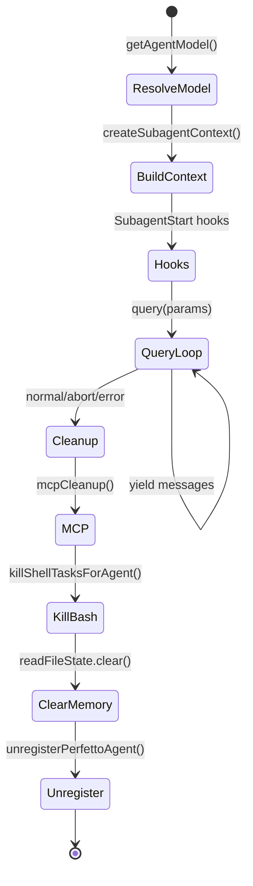

# 第 7 章：AgentTool 与 AgentSwarm

AgentTool 是 Claude Code 中最特殊的工具——它不是执行外部操作（文件、Bash、网络），而是启动另一个完整的 Claude Code Agent 实例。这使得 Claude Code 成为一个"Agent of Agents"系统：主循环内嵌递归查询引擎，递归引擎再内嵌查询引擎。

---

## 7.1 AgentTool 架构

### AgentTool 的工具性

在 Claude Code 的类型系统中，AgentTool 遵循 `Tool` 接口——它有 `name`、`call()`、`description()`，与 `BashTool`、`ReadTool` 并列。但从实现上看，`AgentTool.tsx` 的 `call()` 方法不是执行一个操作，而是调用 `runAgent()`（约 974 行），启动一个完整的 query loop。

```
┌──────────────────────────────────────────────────────┐
│                   Main Query Loop                     │
│                                                       │
│  ToolUse: Agent(generalPurposeAgent, "分析 src/")     │
│       │                                              │
│       ▼                                              │
│  ┌─────────────────────────────────────────────┐    │
│  │          runAgent()                          │    │
│  │                                               │    │
│  │  1. build agent context (tools, prompt)      │    │
│  │  2. createSubagentContext()                  │    │
│  │  3. for await (msg of query(params)) { }     │    │
│  │  4. cleanup (MCP, hooks, memory, todos)     │    │
│  │                                               │    │
│  │  ┌─────────────────────────────────────┐    │    │
│  │  │       Nested Query Loop             │    │    │
│  │  │                                      │    │    │
│  │  │  ToolUse: Bash("find -name *.ts")   │    │    │
│  │  │  ToolUse: Read("src/index.ts")      │    │    │
│  │  │  ...                                 │    │    │
│  │  └─────────────────────────────────────┘    │    │
│  └─────────────────────────────────────────────┘    │
│                                                       │
│  ToolUse: Agent(planAgent, "设计实现方案")           │
│       │                                              │
│       ▼  [fully isolated]                           │
│  ┌─────────────────────────────────────────────┐    │
│  │        runAgent()                           │    │
│  │        └→ query() → ...                     │    │
│  └─────────────────────────────────────────────┘    │
└───────────────────────────────────────────────────┘
```

### 六种内置 Agent

Claude Code 预装了多种内置 Agent，每种有不同的工具集、权限模式和模型选择：

| Agent | 用途 | 工具集 | 权限模式 | 模型 |
|-------|------|-------|---------|------|
| `generalPurposeAgent` | 通用子任务 | 全部 | 继承 | 继承 |
| `planAgent` | 规划与分析 | 只读（Read/Grep/Glob/Bash 只读） | 只读 | Sonnet |
| `exploreAgent` | 代码库探索 | 只读 | 只读 | Haiku |
| `verificationAgent` | 验证与测试 | Bash + Read | 自动允许 | Sonnet |
| `claudeCodeGuideAgent` | 文档查询 | 内置知识 | 只读 | Haiku |
| `fork` (实验性) | 上下文继承分叉 | 父级精确 | bubble | 继承 |

**为什么有不同的模型**——Explore 用 Haiku 是因为代码探索任务（"这个文件做什么？"）不需要 Opus 级别的推理，Haiku 的 TTFT（Time To First Token）低 3-5 倍，响应速度更贴合用户期望。Plan 用 Sonnet 是因为规划需要中等推理深度，但不涉及写入操作的风险。

---

## 7.2 Agent 执行与状态管理

### runAgent：Sub-Agent 的完整生命周期

`runAgent()` 是一个 860 行的 async generator 函数，负责 sub-agent 从生到死的全过程。

**生命周期阶段**：



### 状态隔离的三种层次

Sub-Agent 与父 Agent 之间的状态共享是一个精细的权衡。`createSubagentContext()` 接受三个 opt-in 标志：

```typescript
// runAgent.ts:700-708
const agentToolUseContext = createSubagentContext(toolUseContext, {
  options: agentOptions,
  agentId,
  agentType: agentDefinition.agentType,
  messages: initialMessages,
  shareSetAppState: !isAsync,        // 同步 Agent 共享 AppState
  shareSetResponseLength: true,      // 所有 Agent 共享响应指标
  shareAbortController: false,       // 始终不共享（async 有独立的 controller）
})
```

| 标志 | 同步 Agent | 异步 Agent | 原因 |
|------|-----------|-----------|------|
| `shareSetAppState` | `true` | `false` | 同步 Agent 共享 UI 状态（todo panel、设置），异步 Agent 隔离 |
| `shareSetResponseLength` | `true` | `true` | 所有 Agent 的输出都计入总响应长度 |
| `shareAbortController` | `false` | `false` | 同步共享父级，异步创建独立 controller |

**为什么同步 Agent 共享 AppState**——同步 Agent 在用户终端内运行，其 todo 写入、设置变更、hooks 注册需要直接反映在父 Agent 的 UI 中。如果隔离，用户看到的 todo panel 不会反映同步子 Agent 的操作。

### 权限模式的继承与覆盖

```typescript
// runAgent.ts:420-451
// Agent 可以覆盖父级的权限模式，但 bypassPermissions 和 acceptEdits 优先级更高
if (
  agentPermissionMode &&
  state.toolPermissionContext.mode !== 'bypassPermissions' &&
  state.toolPermissionContext.mode !== 'acceptEdits'
) {
  toolPermissionContext = { ...toolPermissionContext, mode: agentPermissionMode }
}
```

这是一个权限安全的决策：如果用户在 `bypassPermissions` 模式下启动 Claude Code（如 CI/CD），子 Agent 不能重新要求权限确认。

---

### 上下文传递的精确控制

Sub-Agent 不是简单复制父级的消息——它需要精确地裁剪：

```typescript
// runAgent.ts:370-373
const contextMessages: Message[] = forkContextMessages
  ? filterIncompleteToolCalls(forkContextMessages)
  : []
const initialMessages: Message[] = [...contextMessages, ...promptMessages]
```

**`filterIncompleteToolCalls`**——如果父级消息中包含 `tool_use` blocks 但对应的 `tool_result` 尚未完成（agent 在工具执行中被中断），这些不完整的消息对被过滤掉。否则 API 会返回错误，因为 `tool_use` 必须在下一个 assistant message 之前有对应的 `tool_result`。

### 文件状态缓存的克隆

每个 Sub-Agent 需要自己的 "已读取文件"追踪。如果共享父级的 `readFileState`，子 Agent 的读取会被父级的压缩逻辑误认为是"已读取"，从而被丢弃：

```typescript
// runAgent.ts:375-379
const agentReadFileState =
  forkContextMessages !== undefined
    ? cloneFileStateCache(toolUseContext.readFileState)  // 继承父级已读文件
    : createFileStateCacheWithSizeLimit(READ_FILE_STATE_CACHE_SIZE)  // 全新
```

Fork 场景（上下文继承）克隆父级的已读文件集合；普通 Agent 启动全新的缓存。

---

## 7.3 Agent Memory 机制

### 三层记忆作用域

Agent 持久化记忆支持三种作用域，对应不同的共享边界：

| 作用域 | 路径 | 共享范围 | 持久化 |
|-------|------|---------|-------|
| `user` | `~/.claude/agent-memory/<agentType>/` | 用户级（所有项目） | 跨项目 |
| `project` | `<cwd>/.claude/agent-memory/<agentType>/` | 项目级（团队通过 VCS 共享） | 随项目 |
| `local` | `<cwd>/.claude/agent-memory-local/<agentType>/` | 本地（不入库） | 仅本机 |

**安全考量**——`isAgentMemoryPath()` 对路径做 `normalize()` 检查，防止 `..` 路径遍历绕过：

```typescript
// agentMemory.ts:69-70
const normalizedPath = normalize(absolutePath)
// 然后检查是否以 memory base 开头
```

如果不 normalize，攻击者可以通过 `/some/path/.claude/agent-memory/../../../etc/passwd` 绕过 `startsWith` 检查。

---

## 7.4 Fork Subagent：上下文继承的并行执行

Fork Subagent 是 AgentTool 中最精致的功能。不同于普通 Agent 启动一个独立的 Agent，fork 继承父级的完整对话上下文，在后台并行执行。

### 字节级缓存共享

Fork 的核心设计挑战是：**如何让同一个 fork 的多个子实例（继承不同指令）最大化利用 prompt cache？**

```
Parent Assistant Message: [thinking blocks, tool_use_1, tool_use_2, ...tool_use_N]

Fork Child 1:
  Prefix: [...parent_messages, assistant(all_tool_uses), user(
    tool_result(tool_use_1): "Fork started",
    tool_result(tool_use_2): "Fork started",
    ...
    tool_result(tool_use_N): "Fork started",
    text: "<fork_tag>... Scope: 分析架构..."
  )]

Fork Child 2:
  Prefix: [SAME all prefix bytes up to the text block]
  text: "<fork_tag>... Scope: 检查测试覆盖率..."
```

关键决策是 placeholder 策略——每个 fork 子实例对所有 `tool_use` blocks 返回**相同的**占位符文本 `"Fork started — processing in background"`。这确保了所有 fork 子实例的 API 请求前缀是字节级的相同，共享同一个 cache read。只有最后的 text block 不同（指令不同），这是唯一的 cache miss。

```typescript
// forkSubagent.ts:90-93
const FORK_PLACEHOLDER_RESULT = 'Fork started — processing in background'

// 所有 tool_use 对应的 tool_result 都是这个相同的文本
const toolResultBlocks = toolUseBlocks.map(block => ({
  type: 'tool_result' as const,
  tool_use_id: block.id,
  content: [{ type: 'text' as const, text: FORK_PLACEHOLDER_RESULT }],
}))
```

### 递归 Fork 防护

Fork 子实例继承父级的完整工具池（包括 AgentTool）。如果不阻止，fork 子实例可以继续 fork 孙实例，产生无限递归。

```typescript
// forkSubagent.ts:78-89
export function isInForkChild(messages: MessageType[]): boolean {
  return messages.some(m => {
    if (m.type !== 'user') return false
    const content = m.message.content
    if (!Array.isArray(content)) return false
    return content.some(block =>
      block.type === 'text' &&
      block.text.includes(`<${FORK_BOILERPLATE_TAG}>`)
    )
  })
}
```

检测机制是扫描消息中的 `<fork_boilerplate>` 标签。如果找到，拒绝继续 fork。这是一个基于消息内容的检测，而非基于计数器——因为 autocompact 可能压缩历史消息并移除之前的计数器。

### 互斥的 Fork 与 Coordinator

```typescript
// forkSubagent.ts:32-39
export function isForkSubagentEnabled(): boolean {
  if (feature('FORK_SUBAGENT')) {
    if (isCoordinatorMode()) return false  // Coordinator 已有自己的并行模型
    if (getIsNonInteractiveSession()) return false
    return true
  }
  return false
}
```

Coordinator 模式和 Fork 是互斥的——Coordinator 已经承担了任务拆分和分派的角色，如果同时允许 fork，会产生两个并行调度器，导致任务竞争。

---

## 7.5 资源清理：finally 中的 9 个步骤

Sub-Agent 的 `finally` 块是 Claude Code 资源管理最密集的清理代码之一。每个遗留资源如果不释放，在长 session 中会积累为内存泄漏。

```typescript
// runAgent.ts:816-858 ( finally 块)
finally {
  await mcpCleanup()                          // 1. 关闭 Agent 专用的 MCP 连接
  clearSessionHooks(rootSetAppState, agentId) // 2. 注销 Agent 注册的 hooks
  cleanupAgentTracking(agentId)              // 3. 清理 prompt cache detector 追踪
  agentToolUseContext.readFileState.clear()  // 4. 释放克隆的文件状态缓存
  initialMessages.length = 0                 // 5. 释放 fork 上下文消息
  unregisterPerfettoAgent(agentId)           // 6. 从 Perfetto trace 解注册
  clearAgentTranscriptSubdir(agentId)        // 7. 清除 transcript 子目录映射
  rootSetAppState(prev => {                  // 8. 从 AppState.todos 中移除 Agent key
    const { [agentId]: _removed, ...todos } = prev.todos
    return { ...prev, todos }
  })
  killShellTasksForAgent(agentId, ...)       // 9. 终止 Agent 派生的后台 bash 任务
  killMonitorMcpTasksForAgent(agentId, ...) // 10. 终止 MCP monitor 任务
}
```

**数据来源**——注释描述了 whale session 的问题：每个 spawn agent 如果不在这里清理，都会在 AppState 中留下一个 key。数百个 agent 积累的内存泄漏可达数十 MB。

---

## 7.6 Agent 的模型解析与降级

### getAgentModel()

每个 Agent 在启动时通过 `getAgentModel()` 解析应该使用的模型：

```typescript
// runAgent.ts:300-350
function getAgentModel(agentType: string, parentModel: string): string {
  switch (agentType) {
    case 'explore': return getDefaultHaikuModel()  // 代码探索用 Haiku
    case 'plan': return getDefaultSonnetModel()    // 规划用 Sonnet
    case 'general': return parentModel              // 通用继承父级模型
    case 'verification': return getDefaultSonnetModel()
    default: return parentModel
  }
}
```

**模型选择的成本考量**——Explore 用 Haiku 是因为代码探索任务（"这个文件做什么？"）不需要 Opus 级别的推理，Haiku 的 TTFT 低 3-5 倍。

### Agent 模型的 Fallback

如果 Agent 的模型不可用（如 Haiku 模型 429），Agent 可以 fallback 到父级模型：

```typescript
if (modelUnavailable) {
  // Agent fallback: 使用父级模型
  return parentModel
}
```

---

## 7.7 Agent 的消息传递机制

### `yield*` generator 委托

```typescript
// query.ts:220
const terminal = yield* queryLoop(params, consumedCommandUuids)
```

**为何用 generator 而非回调**——`queryLoop` 是 async generator，通过 `yield*` 委托。调用方（CLI、SDK、Agent）通过迭代 generator 获取事件。这种模式统一了所有消费方——无论是终端渲染、SDK 输出还是父 Agent 的消息捕获。

### Agent 的 AbortController

每个 Agent 有自己的 `AbortController`：

```typescript
// 父级可以通过子 Agent 的 controller 中止执行
const agentAbortController = new AbortController()
parentController.signal.addEventListener('abort', () => {
  agentAbortController.abort()
})
```

这是安全设计——父级中止时，子 Agent 也必须停止。

---

## 7.8 Fork Subagent 的上下文继承

Fork Subagent 是 AgentTool 中最精致的功能。不同于普通 Agent 启动一个独立的 Agent，fork 继承父级的完整对话上下文，在后台并行执行。

### 字节级缓存共享

Fork 的核心设计挑战是：如何让同一个 fork 的多个子实例（继承不同指令）最大化利用 prompt cache？

**Placeholder 策略**——每个 fork 子实例对所有 `tool_use` blocks 返回相同的占位符文本：

```typescript
const FORK_PLACEHOLDER_RESULT = 'Fork started — processing in background'

// 所有 tool_use 对应的 tool_result 都是这个相同的文本
const toolResultBlocks = toolUseBlocks.map(block => ({
  type: 'tool_result' as const,
  tool_use_id: block.id,
  content: [{ type: 'text' as const, text: FORK_PLACEHOLDER_RESULT }],
}))
```

这确保了所有 fork 子实例的 API 请求前缀是字节级的相同，共享同一个 cache read。只有最后的 text block 不同（指令不同），这是唯一的 cache miss。

---

## 7.9 Agent 工具池的构建与过滤

**`filterToolsForAgent()`（`agentToolUtils.ts:70-116`）** 决定了每个 Agent 能获得哪些工具：

| 类别 | 禁止工具 | 原因 |
|------|---------|------|
| 所有 Agent | `TaskOutput, ExitPlanMode, EnterPlanMode, AskUserQuestion, TaskStop` | 任务系统/计划模式是主线程抽象 |
| 非 ant 用户 | 额外禁止 `Agent` | 防止嵌套递归 |
| 自定义 Agents | 额外 `CUSTOM_AGENT_DISALLOWED_TOOLS` | 安全约束 |
| 异步 Agents | 只允许 `ASYNC_AGENT_ALLOWED_TOOLS` 列表中的工具 | 防止异步递归 |

**Agent 工具池的隔离**——Agent 的工具从 `assembleToolPool()` 获取，使用 Agent 自己的权限模式（`selectedAgent.permissionMode ?? 'acceptEdits'`）。Agent 不受父级的工具限制——完全隔离。

**被禁工具的深层原因**（`constants/tools.ts:90-102`）：
- `AgentTool`：阻断以防递归
- `TaskOutputTool`：阻断以防递归
- `ExitPlanModeTool`：计划模式是主线程抽象
- `TaskStopTool`：需要访问主线程任务状态
- `TungstenTool`：使用单例虚拟终端，Agent 之间会冲突

---

## 7.10 AsyncLocalStorage：Agent 上下文隔离

**`agentContext.ts:24-110`** 使用 `AsyncLocalStorage<AgentContext>` 实现 Agent 隔离：

```typescript
const agentContextStorage = new AsyncLocalStorage<AgentContext>()

// 包装函数执行于 Agent 上下文中
runWithAgentContext(context, fn)
```

**为何需要 AsyncLocalStorage**——当 Agents 被后台化（Ctrl+B），多个 Agent 并发运行。`AppState` 是全局单例，会被覆盖。AsyncLocalStorage 保证每个异步执行链有独立的上下文：
- Agent A 的事件使用 Agent A 的上下文
- Agent B 的事件使用 Agent B 的上下文
- 即使两个 Agent 在同一 Node.js 进程

**同步 vs 异步 Agent 的包装**：
- 同步 Agent：`runWithAgentContext()` 包装整个消息循环
- 异步 Agent：`void` 触发分离执行，后台生命周期独立于父级

---

## 7.11 安全分类：Agent 返回结果的审计

**`classifyHandoffIfNeeded()`（`agentToolUtils.ts:389-481`）** 在 Agent 完成后、返回父级前执行安全分类：

```
1. 用 classifyYoloAction() 构建 Agent 动作记录
2. 分析是否有危险行为（文件删除、网络请求等）
3. 结果:
   - Blocked: 在最终消息前添加 "SECURITY WARNING"
   - Unavailable: 添加 "Note: 安全分类器不可用，请验证"
   - Allowed: 无修改
```

这是"信任但验证"模式——Agent 可以执行操作，但完成后需要审计。如果分类器不可用（如模型 API 限流），系统选择降级而非阻断。

---

## 7.12 Agent 的颜色管理

**`agentColorManager.ts`** 管理 8 种主题颜色：

每个 Agent 类型有固定的颜色。这用于：
- 终端终端状态行的视觉区分
- 消息气泡的着色
- 任务列表的标记

颜色是固定的（非动态），确保同一 Agent 类型的视觉一致性。

---

## 7.13 Agent 恢复：从转录重建状态

**`resumeAgent.ts:42-266`** 实现基于转录的 Agent 恢复：

```
1. getAgentTranscript() 加载持久化转录
2. readAgentMetadata() 获取 Agent 元数据
3. 过滤孤儿思考消息、未解决的工具使用、空白 assistant 消息
4. 重建内容替换状态
5. 如果是 worktree，验证是否仍然存在（优雅降级）
6. 作为异步 Agent 恢复，追加新的 prompt 到恢复的消息
```

**过滤逻辑的意义**——转录中可能有不完整的状态（如在工具调用中间被中断）。`filterIncompleteToolCalls()` 移除 `tool_use` 没有对应 `tool_result` 的消息对，使转录回到一致的状态。

---

## 7.14 Agent Teams：多 Agent 协作架构

**`agentSwarmsEnabled.ts:24-44`** 中 `isAgentSwarmsEnabled()` 是唯一的功能门：

| 条件 | 启用 |
|------|-----|
| ant 构建 (`USER_TYPE === 'ant'`) | 始终启用 |
| 外部构建 | 需要 `CLAUDE_CODE_EXPERIMENTAL_AGENT_TEAMS` 或 `--agent-teams` 且 GrowthBook `tengu_amber_flint` |

**Team 架构**（参见 `/Lesson/agent-team-architecture.md`）：

```
Team Leader (主 Agent)
  ├── TeamCreate / TeamDelete (团队生命周期管理)
  ├── Shared Task List (TaskCreate/Get/List/Update)
  ├── SendMessage Mailbox (Agent 间消息)
  └── Permission Bridge (权限转发)
```

**Team 成员的权限转发**（`swarmWorkerHandler.ts`）：
1. 首先尝试分类器自动审批（bash 命令）
2. 创建权限请求，注册回调，发送到 Leader
3. Leader 审批/拒绝，响应路由回 worker
4. Worker 在等待时显示 pending 指示器

**扁平 Team 约束**——`AgentTool.tsx:284-316`：`team_name` 和 `name` 同时提供时通过 `spawnTeammate()` 路由。但"the team roster is flat"——队友不能产生更多队友，只有主 Agent 可以管理团队。

---

## 7.15 Agent 的一次性优化

**`constants.ts:9-12`** 中 `ONE_SHOT_BUILTIN_AGENT_TYPES` 标记了 Explore 和 Plan 为一次性 Agent：

```typescript
// 一次性 Agent 返回时，跳过同步结果尾部
// (SendMessage 提示 + agentId + 使用数据)
// 每次调用节省约 135 字符
// 全集群规模: 每周 34M Explore 运行 × 135 chars ≈ 4.6GB 网络传输节省
```

**`AgentTool.tsx:1356`** 的检查：
```typescript
if (data.agentType && ONE_SHOT_BUILTIN_AGENT_TYPES.has(data.agentType) && !worktreeInfoText)
  // 跳过 SendMessage/resume 提示
```

这是一次典型的大规模优化——单点节省微小，但在全集群规模下显著。

---

## 7.16 确定性 Agent ID

**`agentId.ts`**—Agent ID 格式：`agentName@teamName`

```typescript
function formatAgentId(agentName: string, teamName: string): string {
  return `${agentName}@${teamName}`
}
```

**Agent 名不能包含 `@`**—它是分隔符。

**目的**：
1. **可重现性**——相同 Agent 在相同 Team 中总是相同 ID，支持崩溃重连
2. **人类可读**——ID 有意义，可调试
3. **可预测**——Team lead 可以计算 teammate 的 ID，无需查找

**Request ID 格式**：`{requestType}-{timestamp}@{agentId}`

例如：`shutdown-1702500000000@researcher@my-project`。

---

## 7.17 Agent 内存快照

`agentMemorySnapshot.ts:198 lines`：

| 作用域 | 路径 | VCS |
|--------|------|-----|
| User | `~/.claude/agent-memory/<agentType>/` | 共享 |
| Project | `<cwd>/.claude/agent-memory/<agentType>/` | 共享 |
| Local | `<cwd>/.claude/agent-memory-local/<agentType>/` | 不 VCS |

**快照路径**：`<cwd>/.claude/agent-memory-snapshots/<agentType>/snapshot.json`

`checkAgentMemorySnapshot()` 返回三种动作：
- `'none'`——无操作
- `'initialize'`——首次使用，从快照复制文件
- `'prompt-update'`——存在更新的快照

`initializeFromSnapshot()`：从快照复制所有非 `.json` 文件到本地内存。

`replaceFromSnapshot()`：先删除现有 `.md` 文件，然后复制。

`sanitizeAgentTypeForPath()`：用 `-` 替换冒号（用于 `my-plugin:my-agent` 等插件命名空间）。

---

## 7.18 Agent 的模型解决：Bedrock 区域前缀继承

`model/agent.ts:158 lines`：

**解决优先级**：
1. 环境变量 `CLAUDE_CODE_SUBAGENT_MODEL` 覆盖一切
2. 工具指定的模型
3. Agent 的 `model` 字段，默认 `'inherit'`
4. `'inherit'` → `getRuntimeMainLoopModel()`（父级的模型）

**Bedrock 区域前缀继承**——当使用 Bedrock API 时，父级的跨区域推理前缀（如 `"eu."`、`"us."`）被子 Agent 继承。这在 IAM 权限限定到特定区域时非常重要。如果 Agent 规格已经携带自己的区域前缀，则保留（防止数据驻留违规）。

**aliasMatchesParentTier()**——裸别名（`opus`、`sonnet`、`haiku`）匹配父级模型的层时，子 Agent 继承父级的确切模型字符串，而非提供者默认值。例如：Vertex 用户在 Opus 4.6 上生成 `model: opus` 的子 Agent——应该得 Opus 4.6，而非 `getDefaultOpusModel()` 返回的值。

**扩展别名**（`opus[1m]`、`best`、`opusplan`）不匹配。

---

## 7.19 Agent 工具解析的两阶段

`agentToolUtils.ts:70-225`：

**Phase 1——`filterToolsForAgent()`**——按层过滤：
1. MCP 工具（`mcp__*`）始终允许
2. `ALL_AGENT_DISALLOWED_TOOLS` 禁止所有 Agent
3. `CUSTOM_AGENT_DISALLOWED_TOOLS` 禁止非内置 Agent
4. `ASYNC_AGENT_ALLOWED_TOOLS` 是异步 Agent 的白名单

**Phase 2——`resolveAgentTools()`**：
- 支持通配符 `tools: ['*']`——返回过滤后的所有可用工具
- 支持显式白名单：解析每个 `toolSpec` 如 `"Read:*.md"`
- 特例：`Agent(worker,researcher)` 从冒号后的规则内容提取 `allowedAgentTypes`
- `isMainThread` 标志跳过过滤

---

## 7.20 Agent 颜色管理的范围

`agentColorManager.ts:66 lines`：

8 种颜色：`red, blue, green, yellow, purple, orange, pink, cyan`。

**主题键映射**——每个 Agent 颜色映射到带有 `_FOR_SUBAGENTS_ONLY` 后缀的主题键。这确保主题定义被作用域化——不会污染其他用途的 red/blue/etc. 主题颜色。

General-purpose Agent 获 `undefined`（无颜色）。颜色在 `loadAgentsDir.ts:368-372` 的 `getAgentDefinitionsWithOverrides()` 中分配。

---

## 7.21 Agent 任务追踪与通知

`LocalAgentTask.tsx:500+ lines`：

**进度追踪**——`createProgressTracker()` 初始化计数器，`updateProgressFromMessage()` 处理每个 assistant 消息，累积 toolUseCount、token 计数和 recentActivities（最大 5，FIFO）。

**通知**——`enqueueAgentNotification()` 是原子的——检查并设置 `notified` 标志防止重复。构建 `<task_notification>` XML 块：taskId、outputFile、status、summary、结果内容、使用统计和 worktree 信息。

**Kill 机制**——调用 `task.abortController.abort()`，设置 `status: 'killed'`，调用 `evictTaskOutput()` 清理磁盘文件。

**磁盘输出**——Async Agent 的输出文件初始化为 symlink，指向持久化位置。

**Token 追踪**——`ProgressTracker` 分别追踪 input/output token，避免双倍计数（API 的 `input_tokens` 是每轮累积的，`output_tokens` 是每轮的）。

---

---

## 7.22 Mailbox 通信系统

`teammateMailbox.ts`（1184 行）——swarm 中 Agent 间的通信协议：

**物理存储**：
- 收件箱：`~/.claude/teams/{team_name}/inboxes/{agent_name}.json`
- 锁：`${inboxPath}.lock` 使用 `proper-lockfile`
- 锁重试：10 次，退避 5-100ms

**消息结构**：
```typescript
type TeammateMessage = {
  from: string
  text: string
  timestamp: string
  read: boolean
  color?: string
  summary?: string  // 5-10 词预览
}
```

**API 函数**：
| 函数 | 用途 |
|------|------|
| `readMailbox()` | 读取所有消息 |
| `readUnreadMessages()` | 仅未读消息 |
| `writeToMailbox()` | 使用文件锁写入 |
| `markMessageAsReadByIndex()` | 按索引标记已读 |
| `markMessagesAsReadByPredicate()` | 按谓词选择性标记 |
| `clearMailbox()` | 重置为空 |

**结构化协议类型**（JSON 文本字段中）：
1. `idle_notification`——teammate 变为空闲（Stop hook 触发）
2. `permission_request` → `permission_response`——权限转发
3. `sandbox_permission_request` → `sandbox_permission_response`——沙箱网络访问
4. `shutdown_request` → `shutdown_approved/rejected`——优雅关闭
5. `plan_approval_request` → `plan_approval_response`——plan 模式批准
6. `task_assignment`——任务分配通知
7. `team_permission_update`——广播权限变更
8. `mode_set_request`——改变权限模式

`isStructuredProtocolMessage()` 识别 10 种应由 `useInboxPoller` 路由的消息类型，而非作为原始 LLM 上下文消费。

---

## 7.23 权限同步

`permissionSync.ts`（929 行）——双重系统：

**文件版（遗留）**——`~/.claude/teams/{teamName}/permissions/pending/{id}.json` 和 `resolved/{id}.json`：
- `writePermissionRequest(request)`——带目录锁写入 pending
- `readPendingPermissions(teamName?)`——读取所有 pending
- `resolvePermission(requestId, resolution)`——pending 移动到 resolved
- `cleanupOldResolutions()`——每小时清理，`maxAgeMs=3600000`

**Mailbox 版（当前）**——使用 `writeToMailbox()` 发送结构化 JSON：
- `sendPermissionRequestViaMailbox(request)`——发送到 leader 的收件箱
- `sendPermissionResponseViaMailbox(workerName, resolution, requestId)`
- `sendSandboxPermissionRequestViaMailbox(host, requestId, teamName?)`

**Swarm Worker 权限处理器**（`swarmWorkerHandler.ts`，160 行）：
1. 先对 bash 命令尝试分类器自动批准
2. 如分类器不批准，通过 mailbox 转发给 leader
3. **在发送请求前**注册回调（防止竞争条件）
4. 显示 pending 指示器（`pendingWorkerRequest`）
5. `new Promise<PermissionDecision>` 等待，带 abort 信号监听

---

## 7.24 Agent Resume 系统

`resumeAgent.ts`（266 行）——崩溃重连的 agent 恢复：

**`resumeAgentBackground()` 流程**：
1. 通过 `getAgentTranscript(agentId)` 和 `readAgentMetadata(agentId)` 加载转录和元数据
2. 过滤消息：`filterWhitespaceOnlyAssistantMessages` → `filterOrphanedThinkingOnlyMessages` → `filterUnresolvedToolUses`
3. 从转录的 replacements 重建 `contentReplacementState`
4. 验证 worktree 路径存在（如已删除则回退到父级 cwd）
5. 增加 worktree 的 mtime 防止陈旧 worktree 清理
6. 路由 agent：如为 `FORK_AGENT.agentType` 使用 fork agent 定义；否则从 activeAgents 查找
7. 重建系统提示用于 fork resume（如未缓存则重新调用 `getSystemPrompt()`）
8. 注册为异步 agent，启动生命周期

**同步 Agent 错误恢复**——如果迭代期间出错：
- 检查是否有任何 assistant 消息存在
- 如无消息，重新抛出到工具框架
- 如有部分消息，调用 `finalizeAgentTool()` 允许部分进度返回

---

## 7.25 Fork Subagent 字节级缓存复制

**`buildForkedMessages()`**（`forkSubagent.ts`，107-169 行）实现字节级复制的缓存前缀：

```
[...history, assistant(all_tool_uses), user(placeholder_results..., directive)]
```

**关键设计**：
- 克隆父级 assistant 消息（所有 tool_use 块）
- 用**相同占位符**构建 `tool_result` 块：`"Fork started — processing in background"`
- 在所有 tool_result 后追加每个子级的指令文本块
- 结果：**仅最后的文本块不同**——所有子级共享完全相同的 prompt 缓存

**Recursive Fork Guard**（`isInForkChild()`）：
- 扫描用户消息检查 `<fork_boilerplate>` 标签文本
- 同时检查 `toolUseContext.options.querySource === 'agent:builtin:fork'`（抗压缩——在 spawn 时在 context.options 设置）
- 如 querySource 检查失败则回退到消息扫描（autocompact 可能通过替换 fork-boilerplate 消息击败 querySource）

**Fork Prompt 指导**（关键摘录）：
- "Forks 很便宜，因为它们共享你的 prompt 缓存。不要在 fork 上设置 model"
- "Don't peek. 工具结果包含 outputFile 路径——不要 Read 或 tail 它"
- "Don't race. 启动后，你对 fork 发现的内容一无所知"

---

## 7.26 多 Agent 生成架构

`spawnMultiAgent.ts`（1094 行）——三种生成路径：

**路径 1：`handleSpawnInProcess()`**——同一 Node.js 进程通过 AsyncLocalStorage

**路径 2：`handleSpawnSplitPane()`**——tmux 分割窗口或 iTerm2 分割面板

**路径 3：`handleSpawnSeparateWindow()`**——swarm 会话中的独立 tmux 窗口

**后端检测与回退**（行 1040-1078）：
- 如 `isInProcessEnabled()`：直接进程内路径
- 否则：`detectAndGetBackend()`——如 auto 模式无可用后端，回退到进程内
- 无 it2 CLI 的 iTerm2 显示 `It2SetupPrompt` React 组件并等待用户决策

**Teammate 命令构建**：
- 二进制路径：原生构建使用 `process.execPath`，否则 `process.argv[1]` 或环境变量 `TEAMMATE_COMMAND_ENV_VAR`
- CLI 参数：`--agent-id`、`--agent-name`、`--team-name`、`--agent-color`、`--parent-session-id`
- 传播的标志：`--dangerously-skip-permissions`、`--permission-mode`、`--model`、`--settings`
- 环境：`buildInheritedEnvVars()` 传播 CLAUDECODE、API 提供者变量

**Team 文件结构**（`teamHelpers.ts`，684 行）：
```typescript
type TeamFile = {
  name: string
  leadAgentId: string
  leadSessionId?: string
  members: Array<{
    agentId: string
    name: string
    color?: string
    sessionId?: string
    tmuxPaneId: string
    backendType?: BackendType  // 'in-process' | 'tmux' | 'it2'
    isActive?: boolean
    mode?: PermissionMode
  }>
}
```

路径：`~/.claude/teams/{sanitized-team-name}/config.json`

---

## 7.27 Agent Claude.md 省略优化

`runAgent.ts` 中的优化：

**Claude.md 省略**（`tengu_slim_subagent_claudemd` 门控）：
- Explore/Plan agent 从用户上下文中省略 `claudeMd`
- 每次节省 5-15 Gtok/周（34M+ Explore spawns）

**gitStatus 省略**——Explore/Plan agent 省略过时的 `gitStatus`（最大 40KB）：
- 如需要 git 信息，它们自行运行 `git status`

**Agent 列表注入优化**（`shouldInjectAgentListInMessages()`）：
- 动态 agent 列表约占舰队 10.2% 的 cache_creation token
- 可通过 `CLAUDE_CODE_AGENT_LIST_IN_MESSAGES` 环境变量强制启用/禁用

---

## 7.28 Agent 超时与清理

**无显式 agent 超时**——Agent 运行直到完成、中止或错误。

**超时机制汇总表**：

| 机制 | 超时值 | 用途 |
|------|--------|------|
| AbortController | 无超时 | 同步/异步 agent 各有独立 AbortController |
| MCP Server 等待 | 30 秒（500ms 轮询） | 所需 MCP 服务器 pending 时等待 |
| 迭代器清理超时 | 1000ms | 同步 agent 后台化时的前景迭代器清理 |
| Mailbox 锁重试 | 10 次，退避 5-100ms | 文件锁获取 |
| Idle Notification Stop hook | 10000ms | teammate 空闲通知 |

**迭代器清理**——当同步 agent 后台化时：
```typescript
Promise.race([agentIterator.return(undefined), sleep(1000)])
```
1 秒超时防止无限挂起。

---
