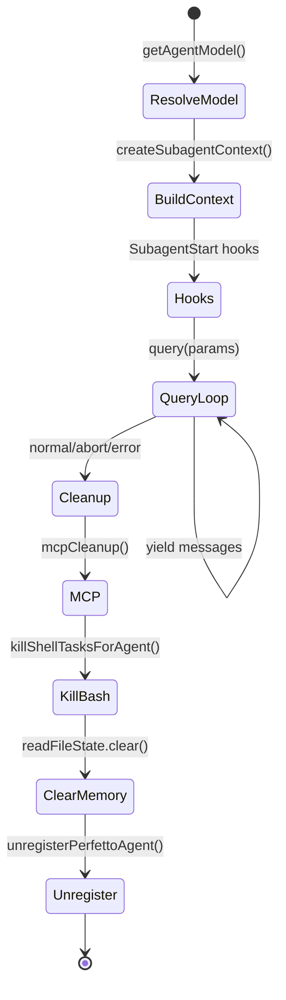

# 第 7 章：AgentTool 与 AgentSwarm

AgentTool 是 Claude Code 中最特殊的工具——它不是执行外部操作（文件、Bash、网络），而是启动另一个完整的 Claude Code Agent 实例。这使得 Claude Code 成为一个"Agent of Agents"系统：主循环内嵌递归查询引擎，递归引擎再内嵌查询引擎。

---

## 7.1 AgentTool 架构

### AgentTool 的工具性

在 Claude Code 的类型系统中，AgentTool 遵循 `Tool` 接口——它有 `name`、`call()`、`description()`，与 `BashTool`、`ReadTool` 并列。但从实现上看，`AgentTool.tsx` 的 `call()` 方法不是执行一个操作，而是调用 `runAgent()`（约 974 行），启动一个完整的 query loop。

```
┌──────────────────────────────────────────────────────┐
│                   Main Query Loop                     │
│                                                       │
│  ToolUse: Agent(generalPurposeAgent, "分析 src/")     │
│       │                                              │
│       ▼                                              │
│  ┌─────────────────────────────────────────────┐    │
│  │          runAgent()                          │    │
│  │                                               │    │
│  │  1. build agent context (tools, prompt)      │    │
│  │  2. createSubagentContext()                  │    │
│  │  3. for await (msg of query(params)) { }     │    │
│  │  4. cleanup (MCP, hooks, memory, todos)     │    │
│  │                                               │    │
│  │  ┌─────────────────────────────────────┐    │    │
│  │  │       Nested Query Loop             │    │    │
│  │  │                                      │    │    │
│  │  │  ToolUse: Bash("find -name *.ts")   │    │    │
│  │  │  ToolUse: Read("src/index.ts")      │    │    │
│  │  │  ...                                 │    │    │
│  │  └─────────────────────────────────────┘    │    │
│  └─────────────────────────────────────────────┘    │
│                                                       │
│  ToolUse: Agent(planAgent, "设计实现方案")           │
│       │                                              │
│       ▼  [fully isolated]                           │
│  ┌─────────────────────────────────────────────┐    │
│  │        runAgent()                           │    │
│  │        └→ query() → ...                     │    │
│  └─────────────────────────────────────────────┘    │
└───────────────────────────────────────────────────┘
```

### 六种内置 Agent

Claude Code 预装了多种内置 Agent，每种有不同的工具集、权限模式和模型选择：

| Agent | 用途 | 工具集 | 权限模式 | 模型 |
|-------|------|-------|---------|------|
| `generalPurposeAgent` | 通用子任务 | 全部 | 继承 | 继承 |
| `planAgent` | 规划与分析 | 只读（Read/Grep/Glob/Bash 只读） | 只读 | Sonnet |
| `exploreAgent` | 代码库探索 | 只读 | 只读 | Haiku |
| `verificationAgent` | 验证与测试 | Bash + Read | 自动允许 | Sonnet |
| `claudeCodeGuideAgent` | 文档查询 | 内置知识 | 只读 | Haiku |
| `fork` (实验性) | 上下文继承分叉 | 父级精确 | bubble | 继承 |

**为什么有不同的模型**——Explore 用 Haiku 是因为代码探索任务（"这个文件做什么？"）不需要 Opus 级别的推理，Haiku 的 TTFT（Time To First Token）低 3-5 倍，响应速度更贴合用户期望。Plan 用 Sonnet 是因为规划需要中等推理深度，但不涉及写入操作的风险。

---

## 7.2 Agent 执行与状态管理

### runAgent：Sub-Agent 的完整生命周期

`runAgent()` 是一个 860 行的 async generator 函数，负责 sub-agent 从生到死的全过程。

**生命周期阶段**：



### 状态隔离的三种层次

Sub-Agent 与父 Agent 之间的状态共享是一个精细的权衡。`createSubagentContext()` 接受三个 opt-in 标志：

```typescript
// runAgent.ts:700-708
const agentToolUseContext = createSubagentContext(toolUseContext, {
  options: agentOptions,
  agentId,
  agentType: agentDefinition.agentType,
  messages: initialMessages,
  shareSetAppState: !isAsync,        // 同步 Agent 共享 AppState
  shareSetResponseLength: true,      // 所有 Agent 共享响应指标
  shareAbortController: false,       // 始终不共享（async 有独立的 controller）
})
```

| 标志 | 同步 Agent | 异步 Agent | 原因 |
|------|-----------|-----------|------|
| `shareSetAppState` | `true` | `false` | 同步 Agent 共享 UI 状态（todo panel、设置），异步 Agent 隔离 |
| `shareSetResponseLength` | `true` | `true` | 所有 Agent 的输出都计入总响应长度 |
| `shareAbortController` | `false` | `false` | 同步共享父级，异步创建独立 controller |

**为什么同步 Agent 共享 AppState**——同步 Agent 在用户终端内运行，其 todo 写入、设置变更、hooks 注册需要直接反映在父 Agent 的 UI 中。如果隔离，用户看到的 todo panel 不会反映同步子 Agent 的操作。

### 权限模式的继承与覆盖

```typescript
// runAgent.ts:420-451
// Agent 可以覆盖父级的权限模式，但 bypassPermissions 和 acceptEdits 优先级更高
if (
  agentPermissionMode &&
  state.toolPermissionContext.mode !== 'bypassPermissions' &&
  state.toolPermissionContext.mode !== 'acceptEdits'
) {
  toolPermissionContext = { ...toolPermissionContext, mode: agentPermissionMode }
}
```

这是一个权限安全的决策：如果用户在 `bypassPermissions` 模式下启动 Claude Code（如 CI/CD），子 Agent 不能重新要求权限确认。

---

### 上下文传递的精确控制

Sub-Agent 不是简单复制父级的消息——它需要精确地裁剪：

```typescript
// runAgent.ts:370-373
const contextMessages: Message[] = forkContextMessages
  ? filterIncompleteToolCalls(forkContextMessages)
  : []
const initialMessages: Message[] = [...contextMessages, ...promptMessages]
```

**`filterIncompleteToolCalls`**——如果父级消息中包含 `tool_use` blocks 但对应的 `tool_result` 尚未完成（agent 在工具执行中被中断），这些不完整的消息对被过滤掉。否则 API 会返回错误，因为 `tool_use` 必须在下一个 assistant message 之前有对应的 `tool_result`。

### 文件状态缓存的克隆

每个 Sub-Agent 需要自己的 "已读取文件"追踪。如果共享父级的 `readFileState`，子 Agent 的读取会被父级的压缩逻辑误认为是"已读取"，从而被丢弃：

```typescript
// runAgent.ts:375-379
const agentReadFileState =
  forkContextMessages !== undefined
    ? cloneFileStateCache(toolUseContext.readFileState)  // 继承父级已读文件
    : createFileStateCacheWithSizeLimit(READ_FILE_STATE_CACHE_SIZE)  // 全新
```

Fork 场景（上下文继承）克隆父级的已读文件集合；普通 Agent 启动全新的缓存。

---

## 7.3 Agent Memory 机制

### 三层记忆作用域

Agent 持久化记忆支持三种作用域，对应不同的共享边界：

| 作用域 | 路径 | 共享范围 | 持久化 |
|-------|------|---------|-------|
| `user` | `~/.claude/agent-memory/<agentType>/` | 用户级（所有项目） | 跨项目 |
| `project` | `<cwd>/.claude/agent-memory/<agentType>/` | 项目级（团队通过 VCS 共享） | 随项目 |
| `local` | `<cwd>/.claude/agent-memory-local/<agentType>/` | 本地（不入库） | 仅本机 |

**安全考量**——`isAgentMemoryPath()` 对路径做 `normalize()` 检查，防止 `..` 路径遍历绕过：

```typescript
// agentMemory.ts:69-70
const normalizedPath = normalize(absolutePath)
// 然后检查是否以 memory base 开头
```

如果不 normalize，攻击者可以通过 `/some/path/.claude/agent-memory/../../../etc/passwd` 绕过 `startsWith` 检查。

---

## 7.4 Fork Subagent：上下文继承的并行执行

Fork Subagent 是 AgentTool 中最精致的功能。不同于普通 Agent 启动一个独立的 Agent，fork 继承父级的完整对话上下文，在后台并行执行。

### 字节级缓存共享

Fork 的核心设计挑战是：**如何让同一个 fork 的多个子实例（继承不同指令）最大化利用 prompt cache？**

```
Parent Assistant Message: [thinking blocks, tool_use_1, tool_use_2, ...tool_use_N]

Fork Child 1:
  Prefix: [...parent_messages, assistant(all_tool_uses), user(
    tool_result(tool_use_1): "Fork started",
    tool_result(tool_use_2): "Fork started",
    ...
    tool_result(tool_use_N): "Fork started",
    text: "<fork_tag>... Scope: 分析架构..."
  )]

Fork Child 2:
  Prefix: [SAME all prefix bytes up to the text block]
  text: "<fork_tag>... Scope: 检查测试覆盖率..."
```

关键决策是 placeholder 策略——每个 fork 子实例对所有 `tool_use` blocks 返回**相同的**占位符文本 `"Fork started — processing in background"`。这确保了所有 fork 子实例的 API 请求前缀是字节级的相同，共享同一个 cache read。只有最后的 text block 不同（指令不同），这是唯一的 cache miss。

```typescript
// forkSubagent.ts:90-93
const FORK_PLACEHOLDER_RESULT = 'Fork started — processing in background'

// 所有 tool_use 对应的 tool_result 都是这个相同的文本
const toolResultBlocks = toolUseBlocks.map(block => ({
  type: 'tool_result' as const,
  tool_use_id: block.id,
  content: [{ type: 'text' as const, text: FORK_PLACEHOLDER_RESULT }],
}))
```

### 递归 Fork 防护

Fork 子实例继承父级的完整工具池（包括 AgentTool）。如果不阻止，fork 子实例可以继续 fork 孙实例，产生无限递归。

```typescript
// forkSubagent.ts:78-89
export function isInForkChild(messages: MessageType[]): boolean {
  return messages.some(m => {
    if (m.type !== 'user') return false
    const content = m.message.content
    if (!Array.isArray(content)) return false
    return content.some(block =>
      block.type === 'text' &&
      block.text.includes(`<${FORK_BOILERPLATE_TAG}>`)
    )
  })
}
```

检测机制是扫描消息中的 `<fork_boilerplate>` 标签。如果找到，拒绝继续 fork。这是一个基于消息内容的检测，而非基于计数器——因为 autocompact 可能压缩历史消息并移除之前的计数器。

### 互斥的 Fork 与 Coordinator

```typescript
// forkSubagent.ts:32-39
export function isForkSubagentEnabled(): boolean {
  if (feature('FORK_SUBAGENT')) {
    if (isCoordinatorMode()) return false  // Coordinator 已有自己的并行模型
    if (getIsNonInteractiveSession()) return false
    return true
  }
  return false
}
```

Coordinator 模式和 Fork 是互斥的——Coordinator 已经承担了任务拆分和分派的角色，如果同时允许 fork，会产生两个并行调度器，导致任务竞争。

---

## 7.5 资源清理：finally 中的 9 个步骤

Sub-Agent 的 `finally` 块是 Claude Code 资源管理最密集的清理代码之一。每个遗留资源如果不释放，在长 session 中会积累为内存泄漏。

```typescript
// runAgent.ts:816-858 ( finally 块)
finally {
  await mcpCleanup()                          // 1. 关闭 Agent 专用的 MCP 连接
  clearSessionHooks(rootSetAppState, agentId) // 2. 注销 Agent 注册的 hooks
  cleanupAgentTracking(agentId)              // 3. 清理 prompt cache detector 追踪
  agentToolUseContext.readFileState.clear()  // 4. 释放克隆的文件状态缓存
  initialMessages.length = 0                 // 5. 释放 fork 上下文消息
  unregisterPerfettoAgent(agentId)           // 6. 从 Perfetto trace 解注册
  clearAgentTranscriptSubdir(agentId)        // 7. 清除 transcript 子目录映射
  rootSetAppState(prev => {                  // 8. 从 AppState.todos 中移除 Agent key
    const { [agentId]: _removed, ...todos } = prev.todos
    return { ...prev, todos }
  })
  killShellTasksForAgent(agentId, ...)       // 9. 终止 Agent 派生的后台 bash 任务
  killMonitorMcpTasksForAgent(agentId, ...) // 10. 终止 MCP monitor 任务
}
```

**数据来源**——注释描述了 whale session 的问题：每个 spawn agent 如果不在这里清理，都会在 AppState 中留下一个 key。数百个 agent 积累的内存泄漏可达数十 MB。

---

## 7.6 Agent 的模型解析与降级

### getAgentModel()

每个 Agent 在启动时通过 `getAgentModel()` 解析应该使用的模型：

```typescript
// runAgent.ts:300-350
function getAgentModel(agentType: string, parentModel: string): string {
  switch (agentType) {
    case 'explore': return getDefaultHaikuModel()  // 代码探索用 Haiku
    case 'plan': return getDefaultSonnetModel()    // 规划用 Sonnet
    case 'general': return parentModel              // 通用继承父级模型
    case 'verification': return getDefaultSonnetModel()
    default: return parentModel
  }
}
```

**模型选择的成本考量**——Explore 用 Haiku 是因为代码探索任务（"这个文件做什么？"）不需要 Opus 级别的推理，Haiku 的 TTFT 低 3-5 倍。

### Agent 模型的 Fallback

如果 Agent 的模型不可用（如 Haiku 模型 429），Agent 可以 fallback 到父级模型：

```typescript
if (modelUnavailable) {
  // Agent fallback: 使用父级模型
  return parentModel
}
```

---

## 7.7 Agent 的消息传递机制

### `yield*` generator 委托

```typescript
// query.ts:220
const terminal = yield* queryLoop(params, consumedCommandUuids)
```

**为何用 generator 而非回调**——`queryLoop` 是 async generator，通过 `yield*` 委托。调用方（CLI、SDK、Agent）通过迭代 generator 获取事件。这种模式统一了所有消费方——无论是终端渲染、SDK 输出还是父 Agent 的消息捕获。

### Agent 的 AbortController

每个 Agent 有自己的 `AbortController`：

```typescript
// 父级可以通过子 Agent 的 controller 中止执行
const agentAbortController = new AbortController()
parentController.signal.addEventListener('abort', () => {
  agentAbortController.abort()
})
```

这是安全设计——父级中止时，子 Agent 也必须停止。

---

## 7.8 Fork Subagent 的上下文继承

Fork Subagent 是 AgentTool 中最精致的功能。不同于普通 Agent 启动一个独立的 Agent，fork 继承父级的完整对话上下文，在后台并行执行。

### 字节级缓存共享

Fork 的核心设计挑战是：如何让同一个 fork 的多个子实例（继承不同指令）最大化利用 prompt cache？

**Placeholder 策略**——每个 fork 子实例对所有 `tool_use` blocks 返回相同的占位符文本：

```typescript
const FORK_PLACEHOLDER_RESULT = 'Fork started — processing in background'

// 所有 tool_use 对应的 tool_result 都是这个相同的文本
const toolResultBlocks = toolUseBlocks.map(block => ({
  type: 'tool_result' as const,
  tool_use_id: block.id,
  content: [{ type: 'text' as const, text: FORK_PLACEHOLDER_RESULT }],
}))
```

这确保了所有 fork 子实例的 API 请求前缀是字节级的相同，共享同一个 cache read。只有最后的 text block 不同（指令不同），这是唯一的 cache miss。
