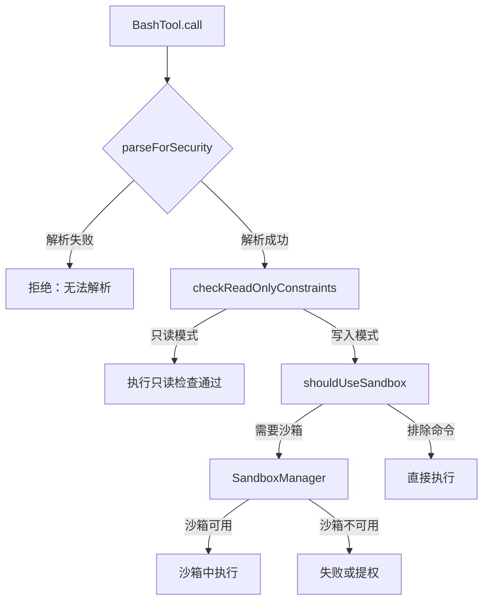
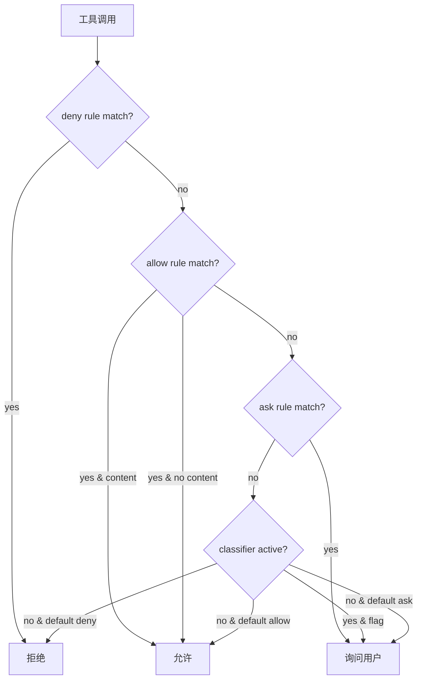
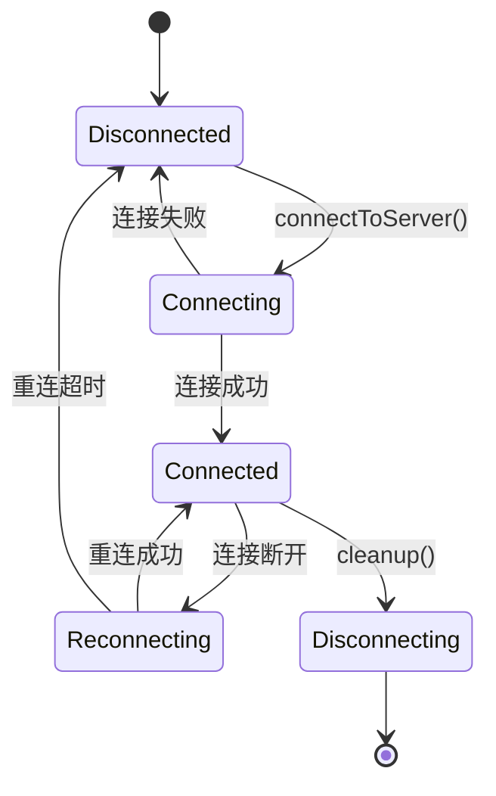

# 第 8 章：工具体系

## 8.1 Tool 抽象的完整性

在第七章中我们已经分析了 `Tool` 接口的整体设计。本章深入具体工具的实现，展示 Claude Code 如何将不同操作抽象为统一的工具协议。

## 8.2 BashTool 的深度剖析

BashTool 是 Claude Code 中最复杂、最危险的工具。它给予 LLM 执行任意 shell 命令的能力，同时也承担了整个系统中最多的安全检查层级。

### 权限验证层级



### read-only 验证层

```typescript
// BashTool.tsx:437-441
isReadOnly(input) {
  const compoundCommandHasCd = commandHasAnyCd(input.command)
  const result = checkReadOnlyConstraints(input, compoundCommandHasCd)
  return result.behavior === 'allow'
}
```

`checkReadOnlyConstraints` 不仅检查命令本身（如 `cat` 是只读的，`rm` 不是），还检查复合命令结构和输出重定向。`ls && echo done` 是只读的，但 `ls > output.txt` 不是——`>` 是写操作。

### Sed 内联编辑的特殊处理

BashTool 对 sed 内联编辑（`sed -i`）做了特殊处理——不让 sed 直接写文件，而是先模拟编辑结果，展示预览，用户确认后通过 `applySedEdit` 直接写内存中的内容：

```typescript
// BashTool.tsx:360-419
async function applySedEdit(simulatedEdit, toolUseContext, parentMessage) {
  // 读取原始文件内容
  const originalContent = await fs.readFile(absoluteFilePath, { encoding })
  // 追踪文件历史（支持撤销）
  if (fileHistoryEnabled() && parentMessage) {
    await fileHistoryTrackEdit(toolUseContext.updateFileHistoryState, absoluteFilePath, parentMessage.uuid)
  }
  // 检测原始行结尾格式，保持文件格式不变
  const endings = detectLineEndings(absoluteFilePath)
  writeTextContent(absoluteFilePath, newContent, encoding, endings)
  // 通知 VS Code 文件变更
  notifyVscodeFileUpdated(absoluteFilePath, originalContent, newContent)
}
```

**为什么不让 sed 直接执行**——如果 sed 直接执行，用户看到的预览和实际写入可能不一致（sed 的正则表达行为依赖具体实现）。通过"先模拟后执行"，用户可以 100% 确信预览即写入。这是一个 UI 信任决策而非技术限制。

### 自动后台执行

```typescript
// BashTool.tsx:57-58
const PROGRESS_THRESHOLD_MS = 2000          // 2 秒后显示进度
const ASSISTANT_BLOCKING_BUDGET_MS = 15_000  // 助手模式 15 秒后自动后台
```

在助手模式（assistant mode）下，阻塞性命令在前台运行 15 秒后自动后台化。这解决了 LLM 调用慢命令（如 `npm install` 或 `make build`）时的用户等待问题。

**`sleep` 的特殊排除**——`sleep` 被排除在自动后台之外，因为它通常是轮询循环的模式（`while ! ready; do sleep 5; done`），后台化后没有输出反馈给模型。

```typescript
// BashTool.tsx:220-221
const DISALLOWED_AUTO_BACKGROUND_COMMANDS = ['sleep']
```

### 工具输出存储

当工具输出超过 30K 字符时，BashTool 将完整输出持久化到文件：

```typescript
// BashTool.tsx (output schema)
persistedOutputPath: z.string().optional()  // 完整输出的文件路径
persistedOutputSize: z.number().optional()  // 完整输出的字节数
```

模型通过文件路径读取完整输出，而非直接在上下文中接收。这是另一种上下文压力控制策略——无限大的输出不会阻塞工具结果通道。

## 8.3 文件操作工具

文件操作工具是 Claude Code 的核心工作集。与 BashTool 的"命令执行即忘记"不同，文件工具维护着精细的文件状态追踪和历史记录。

### FileReadTool：自限定的读取工具

FileReadTool 的 `maxResultSizeChars` 被设为 `Infinity`——它不会将结果持久化到文件。

**为什么**——如果 FileReadTool 的结果被持久化到文件，模型会再次调用 FileReadTool 来读取持久化文件，形成 Read→持久化→读取→持久化... 的循环。通过设置 `Infinity`，工具自行管理结果大小（返回前 N 行/偏移量），不需要系统介入。

### FileEditTool：基于 diff 的编辑

FileEditTool 采用基于行级 diff 的编辑模式。它不允许整文件替换——只能指定旧字符串片段和新字符串片段。这是安全决策：精确替换降低了误写整个文件的风险。

## 8.4 GrepTool 与 ripgrep 集成

GrepTool 不依赖系统 `grep`——它绑定 ripgrep（`rg`），一个用 Rust 编写的更快搜索工具。这反映了整个代码库的工程哲学：Claude Code 的每个内部操作都选择性能最优的工具。

## 8.5 MCPTool：MCP 协议的桥接

MCPTool 是 MCP 服务器工具的内部表示。它通过 `MCPConnectionManager` 获取远程工具定义，并将其映射到 `Tool` 接口中。

MCP 工具的特殊性在于：
- 工具定义在运行期间获取（不是编译期定义）
- 权限检查需要服务器级和工具级的双重验证
- 输入 schema 由外部定义（JSON Schema），不是 Zod schema

---

# 第 9 章：权限系统

## 9.1 权限判定引擎

Claude Code 的权限系统建立在 6 个规则来源、3 种行为类型和多层分类器的基础上。

### 规则来源的优先级

```typescript
// permissions.ts:109-114
const PERMISSION_RULE_SOURCES = [
  ...SETTING_SOURCES,     // 用户设置、管理员设置等
  'cliArg',               // 命令行参数（--allowedTools）
  'command',              // 命令注册
  'session',              // 会话级别（运行时添加）
]
```

每个来源可以注册 allow/deny/ask 规则。规则按来源优先级依次评估。

### 规则语法解析

```
Bash                        → 工具级规则（所有 Bash 命令）
Bash(npm install)           → 内容级规则（只有 npm install）
Bash(git push:*)            → 前缀规则（git push: 开头的所有命令）
mcp__server1                → MCP 服务器级规则
mcp__server1__write_file    → MCP 工具级规则
```

解析器处理括号内的转义字符：

```typescript
// permissionRuleParser.ts:55-79
export function escapeRuleContent(content: string): string {
  return content
    .replace(/\\/g, '\\\\')  // 先转义反斜杠
    .replace(/\(/g, '\\(')   // 再转义括号
    .replace(/\)/g, '\\)')
}
```

**为什么反斜杠先转义**——如果先转义括号，`\(` 会被处理为 `\\(`，后续再处理反斜杠时会变成 `\\\(`，引入额外的反斜杠。

### Allow/Deny/Ask 三元判定

权限判定引擎执行 3 步评估：

1. **工具级检查**——整个工具是否在 allow/deny 列表中？
2. **内容级检查**——工具的具体输入是否匹配规则内容？
3. **分类器检查**——（如果启用）分类器是否要求此命令需要审批？



## 9.2 权限模式

Claude Code 支持多种权限模式：

| 模式 | 行为 | 使用场景 |
|------|------|---------|
| `default` | 每个写操作需要确认 | 默认 |
| `bypassPermissions` | 所有操作自动允许 | CI/CD，信任环境 |
| `acceptEdits` | 自动接受文件编辑 | 开发者工作流 |
| `auto` | 分类器自动判定 | 实验性 |

### 模式切换与 Kill Switch

```typescript
// bypassPermissionsKillswitch.ts
// 在受保护命名空间中，bypassPermissions 被禁用
if (isInProtectedNamespace(process.cwd())) {
  permissionMode = 'default'  // 强制回默认模式
}
```

## 9.3 Denial Tracking 与学习反馈

```typescript
// denialTracking.ts
const DENIAL_LIMITS = { maxFailures: number, windowMs: number }

function shouldFallbackToPrompting(state: DenialTrackingState): boolean {
  // 当同一命令的失败率达到阈值，切换为提示模式
  // 防止同一命令反复被拒的无限循环
}
```

当模型反复尝试同一被拒命令时，denial tracker 记录连续失败次数。达到上限后，系统注入一条消息告诉模型"你需要请求用户的许可"，而不是继续重试。

---

# 第 10 章：MCP 集成

## 10.1 MCP 连接管理

`MCPConnectionManager.tsx` 是 MCP 服务器的生命周期管理器，负责连接、断开、重连和资源清理。

### MCP 服务器配置格式

MCP 服务器支持多种定义方式：
- **命令式**：`command: "npx", args: ["-y", "@some-mcp-server"]`
- **STDIO 传输**：默认，通过 stdin/stdout 通信
- **SSE 传输**：Server-Sent Events，远程服务器
- **WebSocket 传输**：全双工通信

### 连接状态机



## 10.2 MCP 认证与 OAuth

MCP 服务器支持 OAuth 2.0 认证。`MCP/oauthPort.ts` 管理本地回调端口的生命周期。

### OAuth 流程

1. 用户请求连接需要认证的 MCP 服务器
2. Claude Code 打开浏览器到授权端点
3. 授权回调发送到本地 `oauthPort`（默认端口 54654）
4. Token 存储在 keychain 中
5. 后续请求自动附加 Authorization header

### Header 注入

```typescript
// headersHelper.ts
// 为每个 MCP 请求注入认证 header
async function getHeadersForConnection(connection: MCPConnection): Promise<Headers> {
  const token = await getOAuthToken(connection)
  if (token) {
    headers.set('Authorization', `Bearer ${token}`)
  }
}
```

## 10.3 MCP 工具注册与权限

MCP 工具注册到 Claude Code 时需要双重权限检查：

1. **服务器级**——是否允许连接此 MCP 服务器？（channel allowlist）
2. **工具级**——是否允许调用此工具？（常规 permission rules）

### Channel Allowlist Gate

```typescript
// channelAllowlist.ts
// dev-channel gating：检查每个条目的 dev 标志
function isChannelAllowed(channel: ChannelEntry): boolean {
  if (!channel.dev) return true  // 生产频道总是允许
  return isDevChannelEnabled()  // 开发频道需要特殊标志
}
```

---

# 第 11 章：Transport 与 SDK 协议

## 11.1 WebSocketTransport 与重连策略

WebSocketTransport 用于 Claude Code Remote（CCR）连接。它实现了 5 状态重连机：

| 状态 | 行为 |
|------|------|
| `CONNECTED` | 正常通信 |
| `DISCONNECTED` | 检测到断连，准备重连 |
| `RECONNECTING` | 指数退避重连中 |
| `RECONNECTED` | 重连成功，恢复通信 |
| `PERMANENTLY_CLOSED` | 不可恢复（关闭码 1002/4001/4003） |

### 指数退避参数

- base 延迟：1 秒
- 最大延迟：30 秒
- 总预算：600 秒（10 分钟）
- 睡眠检测：超过 60 秒不活跃判定为睡眠，重置退避计数器

## 11.2 HybridTransport：读写分离

`hybridTransport.ts` 实现了读/写分离的传输架构：

- **读端**：WebSocket，接收服务器事件
- **写端**：`SerialBatchEventUploader`，HTTP POST 批量上传

### SerialBatchEventUploader

序列化批量写入引擎保证事件的顺序性，即使 HTTP POST 可能返回乱序：

```
Event 1 → POST batch [1]    → ack
Event 2 → POST batch [2,3]  → ack  (事件 2,3 一起)
Event 4 → POST batch [4]    → ack
```

**内容 delta 缓冲**——100ms 积攒 delta 事件，避免每个字符都发送一次 HTTP 请求。

## 11.3 StructuredIO SDK 协议

StructuredIO 是 Claude Code SDK 的内部协议，基于 NDJSON（Newline-Delimited JSON）：

```json
{"type": "request", "id": 1, "method": "sendPrompt", "params": {"prompt": "分析代码"}}
{"type": "response", "id": 1, "result": "..."}
```

### 工具 ID 去重

SDK 使用 FIFO 1000 项的有界缓存来去重工具调用 ID，防止重复执行。

---

# 第 12 章：远程会话与 CCR

## 12.1 CCR 架构总览

Claude Code Remote（CCR）允许用户在远程容器中运行 Claude Code，通过本地终端控制。

### 5 步初始化链

1. Token 读取（从 keychain 或环境变量）
2. prctl 设置（进程标识）
3. CA 证书验证
4. WebSocket 中继连接
5. Token 清理（使用后立即清除）

### Proto 帧封装

CCR 使用自定义的 Proto 帧封装消息，最大块限制防止单帧过大。

## 12.2 远程会话管理

`RemoteSessionManager.ts` 管理远程会话的生命周期，包括权限桥接——本地终端的权限决定通过 WebSocket 传递到远程容器。

### 权限桥接

```
本地终端 [权限决定: 允许/拒绝] 
    ↓ WebSocket
远程容器 [执行/跳过操作]
```

权限始终在**本地**决定——远程容器没有权限判断逻辑，只执行或跳过由本地决定的操作。

---

# 第 13 章：插件系统

## 13.1 插件架构与生命周期

Claude Code 的插件系统基于 Channel 机制。插件分为两类：

- **内置插件**：代码库中定义，始终加载
- **外部插件**：通过 marketplace 安装，需要 GrowthBook allowlist 检查

### 插件注册流程

1. 插件安装（从 marketplace 或本地目录）
2. 验证 channel entry
3. 注册到 `STATE.allowedChannels`
4. 插件的 skills 和 tools 被发现
5. 插件生命周期跟随 channel 的 add/remove

## 13.2 Marketplace 与信任模型

Marketplace 中的插件经过验证（签名检查、来源验证）。第三方插件的信任模型是**最小信任**——只有 marketplace 验证过的插件才能加载，未经审核的插件被拒绝。

---

# 第 14 章：技能与 Hooks

## 14.1 Skills 框架

Skills 是用户定义的 Prompt Command——通过 `.claude/skills/*.md` 文件或插件注册。

### 加载优先级

1. **Bundled skills**：内置技能（最低优先级）
2. **User skills**：`.claude/skills/` 目录
3. **Plugin skills**：插件注册的技能

### Skill 发现预取

主循环在每个 turn 中异步预取 skill 发现：

```typescript
// query.ts (skill discovery prefetch)
const pendingSkillPrefetch = skillPrefetch?.startSkillDiscoveryPrefetch(
  null, messages, toolUseContext,
)
```

这使得 skill 发现不阻塞主循环——它在工具执行的同时进行，并在附件注入阶段消费结果。

## 14.2 Hook 系统

Hooks 是在特定事件点触发的回调函数。Claude Code 支持多种 hook 类型：

### Hook 分类

| 类型 | 触发时机 | 作用 |
|------|---------|------|
| `SessionStart` | 会话开始 | 初始化、通知 |
| `UserPromptSubmit` | 用户提示提交前 | 上下文增强 |
| `SubagentStart` | 子 Agent 启动前 | 注入额外上下文 |
| `PostSampling` | 模型响应后 | 验证、审计 |
| `Stop` | 轮次结束时 | lint、commit 检查 |

### Hook 的 if 条件

Hook 支持条件触发——基于工具名称和输入模式的匹配：

```yaml
hooks:
  - event: Stop
    if: Bash(git *)
    handler: git-commit.sh
```

`preparePermissionMatcher` 为每个 hook 预编译匹配函数，避免每次 hook 评估都重新解析。

---

# 第 15 章：记忆系统

## 15.1 记忆发现与检索

记忆系统（auto memory）存储在 `.claude/projects/` 目录下，由 Claude 自动管理。

### 记忆类型

| 类型 | 内容 | 示例 |
|------|------|------|
| `user` | 用户角色、偏好 | "用户是数据科学家" |
| `feedback` | 协作反馈 | "不需要总结，直接看 diff" |
| `project` | 项目级决策 | "merge freeze 从周四开始" |
| `reference` | 外部资源指针 | "Linear 项目 INGEST 追踪管道 bug" |

### 记忆检索管线

每次用户输入时，系统异步预取相关记忆：

```
用户输入 → startRelevantMemoryPrefetch() → 并行搜索
  ├── .claude/projects/ 下的 memory files
  ├── MEMORY.md 索引
  └── 按相关性排序，返回 top N
```

## 15.2 MEMORY.md 索引

`MEMORY.md` 是记忆目录的索引文件。它包含每个记忆文件的指针和简介，预取时只读取这个文件即可决定哪些记忆值得加载。

**200 行限制**——索引文件超过 200 行会被截断。这保证了记忆索引不会无限增长，成为启动瓶颈。

## 15.3 Agent Memory

Agent 有独立的持久记忆系统——存储在 `.claude/agent-memory/` 目录下。

### 三层作用域

| 作用域 | 路径 | 共享范围 |
|-------|------|---------|
| `user` | `~/.claude/agent-memory/` | 所有项目 |
| `project` | `<cwd>/.claude/agent-memory/` | 项目级（VCS 共享） |
| `local` | `<cwd>/.claude/agent-memory-local/` | 仅本机 |

Agent 在启动时加载记忆 prompt，在运行期间通过 Read/Write/Edit 工具操作记忆文件。

---

# 第 16 章：成本追踪与分析

## 16.1 成本追踪器

`State` 中的计量层追踪整个会话的成本：

```typescript
totalCostUSD: number           // 累计成本（美元）
totalAPIDuration: number       // 累计 API 延迟
totalToolDuration: number      // 累计工具执行时间
modelUsage: Record<string, {    // 按模型的用量
  inputTokens: number
  outputTokens: number
  cost: number
}>
```

## 16.2 Token 预算

Token Budget 是查询级别的控制机制。当 token 使用量超过阈值时，主循环可以：

1. **Continue**——注入 nudge message，要求模型收敛
2. **Stop**——终止查询，报告预算耗尽

```typescript
// autoCompact.ts:62-65
export const AUTOCOMPACT_BUFFER_TOKENS = 13_000        // 触发缓冲
export const WARNING_THRESHOLD_BUFFER_TOKENS = 20_000   // 警告缓冲
export const ERROR_THRESHOLD_BUFFER_TOKENS = 20_000     // 错误缓冲
export const MANUAL_COMPACT_BUFFER_TOKENS = 3_000       // 手动压缩缓冲
```

### Token 估算

在 API 调用前，系统用 `roughTokenCountEstimation` 估算消息的 token 消耗。估算比精确计数快 10 倍，且在模型推理完成前就提供足够的精度用于决策。

## 16.3 API 限流处理

API 429 限流通过 `withRetry.ts` 的指数退避处理：

```
第一次失败 → wait 1s + jitter → retry
第二次失败 → wait 2s + jitter → retry
第三次失败 → wait 4s + jitter → retry
...
最大等待 → 30s
```

`RetryableError` 是可重试错误的标记。不可重试的错误（如认证失败）直接抛出，不进入退避循环。

---

*全书完*
