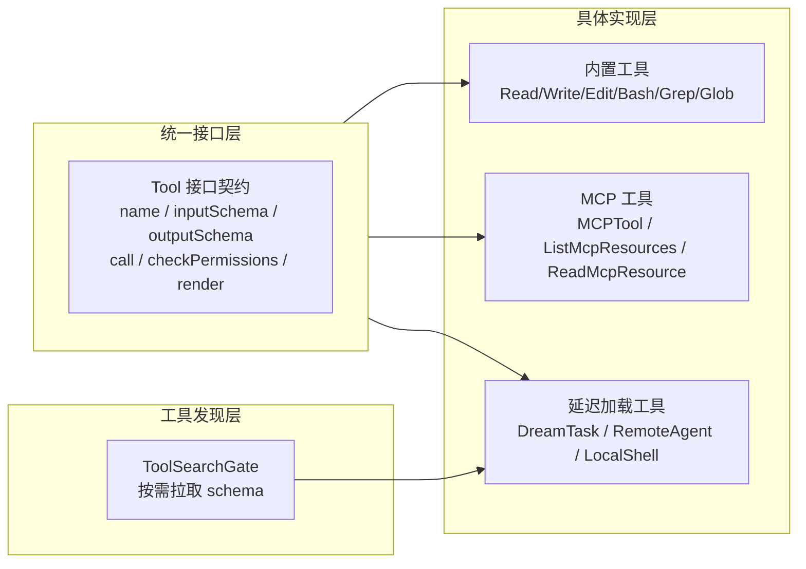
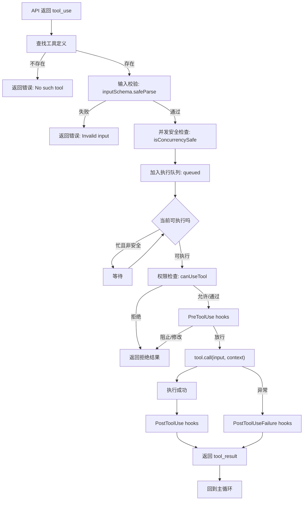

# 第 8 章：工具体系

Claude Code 的工具系统不是静态的工具清单，而是一个**三层协议栈**：统一接口层定义所有工具必须遵循的契约，具体实现层承载不同来源（内置、MCP、延迟加载）的实际能力，工具发现层处理按需暴露与 schema 完整化。每个工具调用在进入实际执行前还要经过 10 步管线：查找、校验、并发调度、权限审批、前置钩子、执行、后置钩子、结果格式化。

---

## 8.1 Tool 接口的完整性

`src/Tool.ts` 约 900 行。这不是接口膨胀——一个工具需要满足 12 个关注点的横切需求：

| 关注点 | 接口 | 运行时依赖方 |
|--------|------|-------------|
| 行为定义 | `call()`, `description()`, `prompt()` | 主循环、模型采样 |
| 类型安全 | `inputSchema: z.ZodType`, `outputSchema` | 工具调度、API 校验 |
| 权限控制 | `checkPermissions()`, `isReadOnly()`, `isDestructive()` | 权限引擎、只读验证 |
| 并发控制 | `isConcurrencySafe()` | StreamingToolExecutor、队列调度 |
| UI 渲染 | `renderToolUseMessage()`, `renderToolResultMessage()` | Ink 渲染引擎、transcript |
| 交互反馈 | `getActivityDescription()`, `getToolUseSummary()` | 终端状态行、进度展示 |
| 安全分类 | `toAutoClassifierInput()`, `isOpenWorld()` | 自动分类器 |
| 工具发现 | `searchHint()`, `shouldDefer()`, `alwaysLoad()` | ToolSearchGate、prompt 构造 |
| 错误展示 | `renderToolUseErrorMessage()`, `renderToolUseRejectedMessage()` | 错误处理 |
| 进度展示 | `renderToolUseProgressMessage()`, `renderToolUseQueuedMessage()` | UI 队列 |

**为何不是基类**——如果 `Tool` 是抽象类，每个子类被迫继承所有方法（包括空实现）。TypeScript 的结构化接口允许实现者只提供相关方法，`buildTool` 工厂填充默认值。这使得新增工具只需关注差异点——如 BashTool 只需要覆盖 `call()` 和 `isReadOnly()`，不需要提供 20+ 个方法的空壳。

### buildTool 工厂：fail-closed 默认值

```typescript
// Tool.ts:757-792
const TOOL_DEFAULTS = {
  isEnabled: () => true,
  isConcurrencySafe: (_input?: unknown) => false,  // 默认不安全
  isReadOnly: (_input?: unknown) => false,           // 默认是写操作
  isDestructive: (_input?: unknown) => false,
  checkPermissions: () => Promise.resolve({ behavior: 'allow' }),
  toAutoClassifierInput: () => '',
  userFacingName: () => '',
}

export function buildTool<D extends AnyToolDef>(def: D): BuiltTool<D> {
  return { ...TOOL_DEFAULTS, userFacingName: () => def.name, ...def } as BuiltTool<D>
}
```

**fail-closed 设计**——`isConcurrencySafe` 默认为 `false` 是安全决策。新工具开发者如果忘记设置，工具默认不并发执行（fail-closed），而非并发执行（fail-open）。同样 `isReadOnly` 默认为 `false`，降低安全漏洞风险——默认值偏向保守。

---

## 8.2 工具系统的三层结构



### 8.2.1 内置工具族

内置工具是主提示顶部直接暴露给模型的工具集合，分为 6 个子族：

| 子族 | 工具 | 特性 |
|------|------|------|
| 文件操作 | Read / Write / Edit / NotebookRead / NotebookEdit | 状态追踪、diff-based 编辑、文件历史 |
| 搜索 | Glob / Grep | ripgrep 绑定、并行文件匹配 |
| 执行 | Bash | 沙箱、只读验证、自动后台 |
| 代理与任务 | Agent / TaskCreate / TodoWrite / Skill | 子 Agent、任务系统、技能调用 |
| Web | WebFetch / WebSearch | URL 安全校验、搜索引擎集成 |
| 实用 | AskUserQuestion / ToolSearch | 用户交互、延迟工具发现 |

### 8.2.2 MCP 工具的特殊性

MCPTool 在接口上遵循 `Tool` 协议，但有几个本质差异：

```typescript
// MCPTool 默认覆盖
{
  isMcp: true,                         // 标记为 MCP 族
  isConcurrencySafe: () => false,      // MCP 工具默认不并发
  isReadOnly: () => false,             // 默认非只读
  checkPermissions: () => 'passthrough', // 权限由服务器级控制
}
```

MCP 工具的命名遵循 `mcp__<server>__<tool>` 模式，权限检查需要双重验证——服务器级 channel allowlist + 工具级 permission rules。

### 8.2.3 延迟加载与 ToolSearchGate

部分工具标记为 `shouldDefer: true`——它们不在初始工具列表中出现，而是只暴露名称。模型看到名称后，可以通过 `ToolSearch` 按需拉取完整 JSON Schema。

**为什么需要延迟加载**——如果不延迟，完整工具 schema（尤其 DreamTask、RemoteAgent 等复杂工具）会显著增大 prompt 体积。延迟加载使得 prompt 只包含工具名，不携带 schema，模型选择工具时才拉取完整定义。这是上下文压力控制策略。

ToolSearch 加载链：
1. 模型在 prompt 中看到 deferred tool 名称
2. 模型调用 `ToolSearch(query)`
3. ToolSearch 在 deferred registry 中匹配
4. 返回完整 function definition + JSONSchema
5. 工具进入可调用集合

---

## 8.3 工具调用 10 步管线

每个 `tool_use` block 在进入实际执行前需要经过 10 步管线：



### 步骤详解

**步骤 1：工具查找**——将 `tool_use.name` 映射到 `Tool` 实例。MCP 工具通过 `mcp__server__tool` 命名模式解析。

**步骤 2：输入校验**——`inputSchema.safeParse(input)`。Zod schema 校验在运行期执行，不是编译期。如果校验失败，错误直接返回给模型，不进入后续管线。

**步骤 3：并发调度**——`isConcurrencySafe()` 决定工具是否可以并行。安全工具（只读搜索）同时执行，不安全工具（写操作）独占执行。`StreamingToolExecutor` 维护 `TrackedTool` 状态机：`queued → executing → completed/yielded`。

**步骤 4：权限审批**——`canUseTool()` 执行 3 层判断：工具级 → 内容级 → 分类器。如果需要用户确认，`tool_use` 被挂起待审批。

**步骤 5：PreToolUse 钩子**——在真正执行前，匹配并执行 `PreToolUse` hooks。hook 可以 approve/deny/modify input。这是执行前最后一道闸门。

**步骤 6：实际执行**——`tool.call(input, context)`。不同工具走不同实现：Bash 走 shell 进程，FileRead 走 fs 读取，MCP 走 transport 远程调用。

**步骤 7~8：PostToolUse/PostToolUseFailure**——执行成功走 PostToolUse 钩子，失败走 PostToolUseFailure。两者都可以通过钩子改写结果或阻止继续。

**步骤 9：结果格式化**——tool_result 写回消息数组。结果必须与上一条 `tool_use` 的 `tool_use_id` 匹配——transcript validator 强制校验配对合法性。

**步骤 10：重回主循环**——结果回注后，主循环继续采样下一轮。

### tool_use_id：链路主键

```typescript
// 工具调用发起时生成唯一 ID
let w = crypto.randomUUID()
// 写入 tool_use_id，作为整条链路的主键
```

这个 ID 是 tool call loop 的 primary key——发起时写入、权限审批时回溯、结果返回时匹配。transcript validator 强制要求 `tool_result.tool_use_id` 与上一条 assistant 消息中的 `tool_use.id` 严格配对，否则 API 会拒绝。

---

## 8.4 StreamingToolExecutor：并发执行引擎

传统 `runTools` 是批处理——收集所有 `tool_use` blocks，按依赖顺序执行，完成后返回。StreamingToolExecutor 允许工具在流式到达时就执行：

```
传统: stream all tool_use → 排序 → 执行 1 → 执行 2 → 执行 3 → 返回结果
流式: stream tool_use_1 → 立即执行 1
      stream tool_use_2 → 立即执行 2（可与 1 并行）
      return 结果时先产出已经完成的
```

**延迟收益**——工具执行时间长（如 Bash 运行 `npm install` 需 10 秒）时，流式执行将端到端延迟从 `stream_duration + tool_duration` 降至 `max(stream_duration, tool_duration)`。

### TrackedTool 状态机

每个工具在 executor 中有明确状态：

```typescript
interface TrackedTool {
  state: 'queued' | 'executing' | 'completed' | 'yielded'
  tool_use_id: string
  result?: ToolResult
}
```

状态流转：`queued → executing → completed → yielded`。`yielded` 表示结果已产出给消费者，等待回收。

### 并发控制：安全工具并行，不安全工具独占

```typescript
function canExecuteTool(tool: TrackedTool, others: TrackedTool[]): boolean {
  if (tool.definition.isConcurrencySafe(tool.input)) {
    return true  // 安全工具总是可以并行
  }
  // 不安全工具需要独占——无其他工具在执行
  const othersExecuting = others.some(o => o.state === 'executing')
  return !othersExecuting
}
```

这是 fail-closed 的并发模型——默认不允许并行，除非工具明确声明 `isConcurrencySafe = true`。

---

## 8.5 BashTool 深度剖析

BashTool 是 Claude Code 中最复杂、最危险的内置工具。它给予 LLM 执行任意 shell 命令的能力，同时承担最多的安全检查。

### 权限验证层级

BashTool 的只读验证不是一个简单的正则匹配，而是多层解析：

```typescript
// BashTool.tsx:437-441
isReadOnly(input) {
  const compoundCommandHasCd = commandHasAnyCd(input.command)
  const result = checkReadOnlyConstraints(input, compoundCommandHasCd)
  return result.behavior === 'allow'
}
```

`checkReadOnlyConstraints` 不只检查命令本身（`cat` 是只读，`rm` 不是），还检查：
1. **复合命令结构**——`ls && echo done` 是只读的，但 `ls > output.txt` 不是（`>` 是写操作）
2. **输出重定向**——`>>`、`>`、`| tee` 都是写操作
3. **子 shell 传递**——`$(rm -rf /)` 在只读命令中嵌入写操作

### sed -i 内联编辑的特殊处理

BashTool 不让 sed 直接编辑文件——而是先模拟编辑结果，展示预览，用户确认后通过 `applySedEdit` 写内存内容：

```typescript
async function applySedEdit(simulatedEdit, toolUseContext, parentMessage) {
  const originalContent = await fs.readFile(absoluteFilePath, { encoding })
  if (fileHistoryEnabled() && parentMessage) {
    await fileHistoryTrackEdit(toolUseContext.updateFileHistoryState, absoluteFilePath, parentMessage.uuid)
  }
  const endings = detectLineEndings(absoluteFilePath)
  writeTextContent(absoluteFilePath, newContent, encoding, endings)
  notifyVscodeFileUpdated(absoluteFilePath, originalContent, newContent)
}
```

**这是 UI 信任决策而非技术限制**——如果 sed 直接执行，用户看到的预览和实际写入可能不一致。通过"先模拟后执行"，用户可以 100% 确信预览即写入。

### 自动后台执行

```typescript
const PROGRESS_THRESHOLD_MS = 2000           // 2 秒后显示进度
const ASSISTANT_BLOCKING_BUDGET_MS = 15_000  // 助手模式 15 秒后台化
const DISALLOWED_AUTO_BACKGROUND_COMMANDS = ['sleep']
```

助手模式下阻塞性命令 15 秒后自动后台化。`sleep` 被排除——它通常用于轮询循环（`while ! ready; do sleep 5; done`），后台化后模型收不到输出反馈。

### 工具输出持久化

当工具输出超过 30K 字符时，完整输出持久化到文件：

```typescript
persistedOutputPath: z.string().optional()   // 完整输出的文件路径
persistedOutputSize: z.number().optional()   // 完整输出的字节数
```

模型通过文件路径读取完整输出，而非在上下文中直接接收。这防止无限大输出阻塞工具结果通道。

---

## 8.6 文件操作工具

### FileReadTool：自限定策略

FileReadTool 的 `maxResultSizeChars` 设为 `Infinity`——它不会将结果持久化到文件。

**为什么**——如果 FileReadTool 的结果被持久化到文件，模型会再次调用 FileReadTool 读取持久化文件，形成 Read→持久化→读取→持久化的循环。通过设置 `Infinity`，工具自行管理结果大小（返回前 N 行/偏移量），不需要系统介入。

### FileEditTool：基于 diff 的编辑

FileEditTool 采用行级 diff 模式——不允许整文件替换，只能指定旧字符串和新字符串片段。这是安全决策：精确替换降低误写整个文件的风险。编辑后系统追踪文件历史，支持撤销操作。

### GrepTool：ripgrep 绑定

GrepTool 不依赖系统 `grep`，而是绑定 ripgrep（`rg`）。这反映了工程哲学：Claude Code 的每个内部操作都选择性能最优的底层工具。

---

## 8.7 工具系统的可观测性

工具系统暴露多个可观测点：

| 指标 | 来源 | 用途 |
|------|------|------|
| 工具调用计数 | `turnToolCount` | Turn 级别统计 |
| 工具执行耗时 | `turnToolDuration` | 性能分析 |
| 工具队列深度 | StreamingToolExecutor | 并发控制调试 |
| 工具拒绝率 | denialTracking | 安全审计 |

这些指标通过 OpenTelemetry 导出，支持运行时诊断和性能分析。

---

## 8.8 工具池组装

`assembleToolPool()` 将内置和 MCP 工具组合并排序，为 prompt 缓存稳定性：

```typescript
// tools.ts
function assembleToolPool(): Tools {
  return sortToolsByName(
    deduplicateTools(
      getBuiltInTools(),
      getMcpTools()
    )
  )
}
```

**按名称排序**——工具列表的顺序会影响 prompt 缓存的命中率。如果工具每次以不同顺序发送，prompt 前缀不一致，降低缓存利用率。

### 工具白名单

```typescript
// All agent excluded tools
ALL_AGENT_DISALLOWED_TOOLS = [
  'AskUserQuestion',    // sub-agents can't interact with users
  'Agent',              // no recursive agents
  // ...plan mode blocked tools
]
```

**不同 Agent 类型的工具白名单**：

| Agent 类型 | 允许的工具 | 说明 |
|-----------|-----------|------|
| Plan Agent | Read, Grep, Glob, Bash(readonly) | 只读工具 |
| Explore Agent | Read, Grep, Glob | 最严格只读 |
| Verification Agent | Bash, Read | 测试工具 |
| Async Agent | TaskCreate, TaskOutput, SendMessage | 异步独立 |

### 工具别名

BashTool 的 `aliases` 数组允许工具在不同上下文中以不同名称出现，同时保持相同的实现：

```
BashTool: { aliases: ['Terminal', 'Bash', 'Shell', 'bash', 'terminal'] }
```

### 内置工具总数

总内置工具目录：46 个，分布在 BashTool、FileReadTool、FileEditTool、AgentTool、ToolSearchTool 等。

---

## 8.9 ToolSearch：按需工具发现

部分工具标记为 `shouldDefer: true`——它们不在初始工具列表中出现。模型看到工具名后，需通过 `ToolSearch` 按需拉取完整定义。

**为什么需要延迟加载**——如果不延迟，完整工具 schema（尤其 DreamTask、RemoteAgent 等复杂工具）会显著增大 prompt 体积。延迟加载是上下文压力控制策略。

**ToolSearch 加载链**：
```
模型在 prompt 中看到 deferred tool 名称
  → 模型调用 ToolSearch(query)
    → ToolSearch 在 deferred registry 中匹配
      → 返回完整 function definition + JSONSchema
        → 工具进入可调用集合
```

**三个标记位**：
| 标记 | 默认值 | 用途 |
|------|--------|------|
| `shouldDefer` | false | 不在初始列表中出现 |
| `alwaysLoad` | false | 总是在初始列表中出现 |
| `searchHint` | undefined | ToolSearch 使用的匹配提示 |

---

## 8.10 工具结果截断与持久化

**当工具输出超过阈值时**，完整输出持久化到文件：

```typescript
persistedOutputPath: z.string().optional()    // 完整输出的文件路径
persistedOutputSize: z.number().optional()    // 完整输出的字节数
```

模型通过文件路径读取完整输出，而非在上下文中直接接收。这防止无限大输出阻塞工具结果通道。

**BashTool 的 30K 字符阈值**——这是经验值，平衡了上下文利用率和结果可用性。30K 字符约等于 10-15 个终端屏幕的内容。

---

## 8.11 TodoWrite：任务追踪工具

TodoWrite 是唯一不被任何 Agent 禁止的工具（除了异步 Agent）。它在 UI 中显示为进度条列表：

```typescript
interface TodoItem {
  content: string       // 任务描述
  status: 'pending' | 'in_progress' | 'completed' | 'error'
  activeForm?: string   // 运行时的显示文本
  id?: string           // 唯一标识
}
```

**Todo 的 UI 渲染**——TodoWrite 的变更反映在终端状态行的进度指示器中。`updateProgressFromMessage()` 提取 agent 消息中的 todo 状态并更新 AppState。

**Todo 的持久化**——todo 列表不持久化到磁盘，仅存在于内存中的 AppState。会话中断后 todo 丢失。这是"轻量状态"设计决策——不引入额外的磁盘 I/O。

---

## 8.12 工具的安全分类

**`toAutoClassifierInput()`**——每个工具将输入分类为自动分类器接受的格式：
```typescript
toAutoClassifierInput: (input) => string
```

返回的字符串送入 `classifyYoloAction()`，该函数分析工具调用是否危险。分类器用于：
1. **Auto 权限模式**——安全工具自动通过，危险工具需用户确认
2. **分类器降级**——当分类器不可用时（模型不支持），系统在 'ask' 和 'acceptEdits' 之间选择保守降级

**`isOpenWorld()`**——标记工具是否在"开放世界"中操作（如 Bash、Agent），用于安全模型的特殊处理。

---

## 8.13 NotebookRead/NotebookEdit：Jupyter 笔记本支持

NotebookRead 和 NotebookEdit 遵循与 Read/Write 相同的模式，但操作对象是 Jupyter notebook 的 `.ipynb` 文件：

| 特性 | 实现 |
|------|------|
| `NotebookRead` | 解析 `.ipynb` JSON，按 cell 类型返回 markdown/code |
| `NotebookEdit` | 指定 cell_id 进行替换（非 diff） |
| 状态追踪 | 通过 `notifyVscodeFileUpdated()` |
| 文件历史 | 支持撤销操作 |

---

## 8.14 工具执行超时与 Kill 语义

工具执行有 3 层超时：

| 层级 | 默认值 | 可配置 | 行为 |
|------|--------|--------|------|
| Bash 超时 | 无（无限运行） | 助手模式 15s 后台化 | 转后台继续 |
| Hook 超时 | 10 分钟 | `CLAUDE_CODE_HOOK_TIMEOUT_MS` | 中止 hook |
| MCP 请求超时 | 60 秒 | `MCP_REQUEST_TIMEOUT_MS` | 标记 failed |

**BashTool 的 Kill 语义**——当用户中断（Ctrl+C）或模型取消时：
1. 发送 SIGTERM 到进程组
2. 等待终止（带超时）
3. 未终止则发送 SIGKILL

**子进程组的处理**——Bash 的 `kill` 目标不只是单个 PID，而是进程组（`-pid`），确保管道中的子进程也被清理。

---

## 8.15 工具的版本化 Schema

工具的 `inputSchema` 使用 Zod 的 `z.ZodType`——在运行期验证，不是编译期。这意味着：
1. 工具调用前 `safeParse()` 验证输入
2. 验证失败时错误直接返回给模型
3. Zod schema 可以在不修改 TypeScript 类型的情况下演进

**Schema 演进策略**——添加可选字段（`.optional()`）是向后兼容的。移除字段需要确保旧版本调用仍然通过验证。

---

---

## 8.16 命令语义映射：退出码解释

`commandSemantics.ts:141 lines` 中 `COMMAND_SEMANTICS` map 为不同命令覆盖退出码解释：

| 命令 | 退出码 0 | 退出码 1 | 退出码 2+ |
|------|---------|---------|----------|
| `grep` / `rg` | 找到匹配 | 无匹配（**不是错误**） | 错误 |
| `find` | 成功 | 部分成功（某些目录无法访问） | 错误 |
| `diff` | 无差异 | 有差异（**不是错误**） | 错误 |
| `test` / `[` | 条件为真 | 条件为假 | 错误 |
| 默认 | 成功 | 错误 | 错误 |

这是关键的用户体验设计——`grep` 返回 1（无匹配）在默认语义下会被报告为错误，但通过命令语义覆盖，它被正确解释为有效结果。

---

## 8.17 工具渲染定制

每个工具通过 `renderToolUseMessage()` 和 `renderToolResultMessage()` 定制终端中的外观：

| 工具 | 渲染特性 |
|------|---------|
| Bash | 显示命令、工作状态、退出码 |
| Read/Write/Edit | 显示文件路径、行范围 |
| Grep/Glob | 显示搜索模式、匹配数 |
| Agent | 显示 Agent 类型、进度条 |
| MCP | 显示服务器名、工具名 |

**状态指示器**——工具执行中有三种状态：running（旋转指示器）、completed（勾选）、failed（X）。Spinner 动画与全局 `onRender` 节流同步。

---

## 8.18 GrepTool：ripgrep 绑定

GrepTool 不依赖系统 `grep`，而是绑定 ripgrep（`rg`）：

```
rg <pattern> [flags]
  --no-config              # 不使用用户 ripgrep 配置
  --max-columns 200        # 截断超长行
  --max-columns-preview    # 预览模式下的截断
  --line-buffered          # 行缓冲输出
  --color never            # 不输出 ANSI 颜色
```

**并行文件匹配**——ripgrep 自动并行遍历文件树。GrepTool 不需要手动分片——ripgrep 内部处理线程池。

**`.gitignore` 处理**——ripgrep 自动尊重 `.gitignore` 规则。GrepTool 不需要手动过滤——ripgrep 的 ignore 规则已经处理。

---

## 8.19 WebFetch 和 WebSearch  internals

**WebFetch**——URL 验证通过 `validateUrl()` 函数：
- 检查 URL 格式
- 阻止本地地址（SSRF 防护）
- 限制支持的协议（http/https）

**WebSearch**——集成搜索引擎：
- 默认搜索引擎通过配置
- 结果限制在合理 token 数
- 输出格式化为模型可读的文本

---

## 8.20 工具输入验证的 Zod 示例

工具的 `inputSchema` 使用 Zod 在运行期验证：

```typescript
// BashTool 的部分 schema
inputSchema: z.object({
  command: z.string()
    .min(1)
    .max(MAX_BASH_COMMAND_LENGTH),
  timeout: z.number()
    .min(0)
    .max(maxTimeoutMs)
    .optional(),
  description: z.string()
    .max(200)
    .optional(),
})
```

**验证捕捉的常见错误**：
- 空命令（`min(1)`）
- 过长命令（`max(MAX_BASH_COMMAND_LENGTH)`）
- 负超时（`min(0)`）
- 超长描述（`max(200)`）

验证失败时，错误通过 `error.format()` 返回给模型，模型可以修正输入。

---

## 8.21 BashTool 沙箱细节

**沙箱模式**——当 `CLAUDE_CODE_FORCE_SANDBOX=1` 时：
- 网络访问通过代理路由
- SSRF 防护应用到命令
- 文件系统操作受限

**被阻止的操作**：
- 直接网络访问（curl/wget 到本地地址）
- 修改系统配置
- 访问敏感文件（`/etc/shadow` 等）

**`CLAUDE_CODE_SUBPROCESS_ENV_SCRUB`**——当为真时，18 个敏感环境变量族从子进程环境中剥离（见 3.8 节）。这防止 BashTool 泄露父进程的凭据。

---

## 8.22 工具执行指标聚合

| 指标 | 来源 | 聚合方式 |
|------|------|---------|
| `turnToolCount` | 每次 turn 结束 | 计数 |
| `turnToolDuration` | 每次 turn 结束 | 持续时间累加 |
| 工具拒绝率 | denialTracking | 拒绝计数 / 总请求 |

**denialTracking**——在权限管线中，当工具被拒绝时记录。用于审计和安全审查。

**转级别的统计**——`addToTotalSessionCost()` 处理每个 API 响应的 `BetaUsage` 对象，提取 `input_tokens`、`output_tokens` 和各种缓存字段。

---

## 8.23 LSPTool：语言服务器协议集成

LSPTool 是完整的延迟工具（`shouldDefer: true`），通过语言服务器协议提供代码智能。

**文件路径**：
- `tools/LSPTool/LSPTool.ts`（861 行）
- `tools/LSPTool/schemas.ts`（215 行）
- `tools/LSPTool/formatters.ts`（593 行）

**9 种 LSP 操作**（判别联合 schema）：

| 操作 | LSP 方法 | 描述 |
|------|---------|------|
| `goToDefinition` | `textDocument/definition` | 跳转定义 |
| `findReferences` | `textDocument/references` | 查找引用（含声明） |
| `hover` | `textDocument/hover` | 悬停信息 |
| `documentSymbol` | `textDocument/documentSymbol` | 文档符号 |
| `workspaceSymbol` | `workspace/symbol` | 工作区符号 |
| `goToImplementation` | `textDocument/implementation` | 跳转实现 |
| `prepareCallHierarchy` | `textDocument/prepareCallHierarchy` | 调用层级准备 |
| `incomingCalls` | `callHierarchy/incomingCalls` | 入向调用 |
| `outgoingCalls` | `callHierarchy/outgoingCalls` | 出向调用 |

**关键架构细节**：
- `isLsp: true`、`isConcurrencySafe() → true`、`isReadOnly() → true`
- `maxResultSizeChars: 100,000`
- `MAX_LSP_FILE_SIZE_BYTES = 10,000,000`——文件超 10MB 时返回错误而非读取
- 通过 `getInitializationStatus()` / `waitForInitialization()` 等待 LSP 初始化
- 操作前通过 `manager.isFileOpen()` 确保文件已在 LSP 服务器中打开

**行号转换**——用户输入是 1-based（行 1，列 1），LSP 协议是 0-based。转换：`position = { line: input.line - 1, character: input.character - 1 }`。

**Git 忽略过滤**——`findReferences`、`goToDefinition` 等结果通过对 `.gitignore` 的 `git check-ignore` 批量过滤：
- `BATCH_SIZE = 50`——每批 50 个路径
- 超时 5000ms
- `filterGitIgnoredLocations` 提取 URI → 文件路径 → 用 `execFileNoThrowWithCwd('git', ['check-ignore', ...batch])` 检查

**两步操作**——`incomingCalls` 和 `outgoingCalls` 是两步序列：先 `prepareCallHierarchy` 获取 `CallHierarchyItem`，再调用 `callHierarchy/incomingCalls` 或 `/outgoingCalls`。

---

## 8.24 BashTool 安全系统：23 层检查

`bashSecurity.ts` 实现多层命令验证，有 23+ 个安全检查 ID：

```
INCOMPLETE_COMMANDS          = 1   # 不完整命令
JQ_SYSTEM_FUNCTION           = 2   # jq 系统函数
JQ_FILE_ARGUMENTS            = 3   # jq 文件参数
OBFUSCATED_FLAGS             = 4   # 混淆标志
SHELL_METACHARACTERS         = 5   # Shell 元字符
DANGEROUS_VARIABLES          = 6   # 危险变量
NEWLINES                     = 7   # 换行注入
DANGEROUS_PATTERNS_COMMAND_SUBSTITUTION = 8   # 命令替换
DANGEROUS_PATTERNS_INPUT_REDIRECTION    = 9   # 输入重定向
DANGEROUS_PATTERNS_OUTPUT_REDIRECTION   = 10  # 输出重定向
IFS_INJECTION              = 11  # IFS 注入
GIT_COMMIT_SUBSTITUTION    = 12  # Git 提交替换
PROC_ENVIRON_ACCESS        = 13  # /proc/environ 访问
MALFORMED_TOKEN_INJECTION  = 14  # 畸形 Token 注入
BACKSLASH_ESCAPED_WHITESPACE = 15  # 反斜线转义空白
BRACE_EXPANSION            = 16  # 花括号展开
CONTROL_CHARACTERS         = 17  # 控制字符
UNICODE_WHITESPACE         = 18  # Unicode 空白
MID_WORD_HASH              = 19  # 词中哈希
ZSH_DANGEROUS_COMMANDS     = 20  # Zsh 危险命令
BACKSLASH_ESCAPED_OPERATORS  = 21  # 反斜线转义操作符
COMMENT_QUOTE_DESYNC       = 22  # 注释引号不同步
QUOTED_NEWLINE             = 23  # 引号内换行
```

**被阻止的命令替换模式**：
- 进程替换：`<()`、`>()`、`=()`
- Zsh 等号展开：`=cmd`（绕过 `Bash(curl:*)` 拒绝规则——解析器看到 `=curl` 而非 `curl`）
- `$()` 命令替换、`${}` 参数替换、`$[]` 遗留算术
- Zsh 风格参数展开 `~[`、glob 限定符 `(e:`、`(+`
- `} always {`（Zsh try/always 结构）

**Zsh 危险命令列表（24 个）**：
`zmodload`、`emulate`、`sysopen`、`sysread`、`syswrite`、`sysseek`、`zpty`、`ztcp`、`zsocket`、`mapfile`、`zf_rm`、`zf_mv` 等。

**引号提取引擎**——`extractQuotedContent(command, isJq)` 解析命令，追踪单/双引号状态和转义序列，产生三个输出：`withDoubleQuotes`、`fullyUnquoted`、`unquotedKeepQuoteChars`（用于检测引号附近的 `#` 注入）。

**`stripSafeRedirections`**——在分析前移除 `2>&1`、`>/dev/null`、`<>/dev/null` 模式——带有尾部边界断言 `(?=\s|$)` 防止前缀匹配攻击（如 `/dev/nullo` 不匹配 `/dev/null`）。

---

## 8.25 工具结果截断系统

`truncate.ts`（179 行）实现 5 种截断变体：

| 函数 | 行为 |
|------|------|
| `truncateToWidth(text, maxWidth)` | 尾部截断+省略号，grapheme 安全 |
| `truncateStartToWidth(text, maxWidth)` | 首部截断+省略号（保留尾部） |
| `truncateToWidthNoEllipsis(text, maxWidth)` | 无省略号截断（调用者自行加分隔符） |
| `truncatePathMiddle(path, maxLength)` | 路径中间截断，保留目录和文件名 |
| `truncate(str, maxWidth, singleLine)` | 通用截断，可选单行模式 |

所有函数使用 `stringWidth()` 进行正确的 CJK/emoji/grapheme 簇宽度测量，以及 `getGraphemeSegmenter()` 避免破坏代理对。

**各工具的 maxResultSizeChars**：

| 大小 | 工具 |
|------|------|
| 10,000 | McpAuthTool |
| 20,000 | GrepTool |
| 30,000 | BashTool、PowerShellTool |
| 100,000（默认） | 大多数工具 |
| Infinity | FileReadTool |

---

## 8.26 SyntheticOutputTool：动态 Schema 验证

`SyntheticOutputTool.ts`（164 行）实现强大工作流——调用者传递 JSON schema，系统动态创建工具来验证 agent 输出：

```typescript
SYNTHETIC_OUTPUT_TOOL_NAME = 'StructuredOutput'
```

仅对 `isNonInteractiveSession: true` 启用。

**Ajv 验证**——使用 Ajv（`allErrors: true`）在运行期进行 JSON Schema 验证：
- `ajv.validateSchema(jsonSchema)` 验证 schema
- `ajv.compile(jsonSchema)` 生成验证函数
- 输出验证：`validateSchema(input)` 带错误格式化 `${e.instancePath}: ${e.message}`
- 错误消息限制 150 字符

**WeakMap 身份缓存**——`toolCache = new WeakMap<object, CreateResult>()`——按 schema 引用身份缓存工具实例，将 Ajv 开销从 ~110ms 降至约 4ms（80 次调用工作流）。

---

## 8.27 Task 系统工具套件

多个任务相关工具形成内聚子系统：

| 工具 | 功能 |
|------|------|
| TaskCreate | 创建异步任务 |
| TaskGet | 获取任务状态 |
| TaskList | 列出所有任务 |
| TaskUpdate | 更新任务进度 |
| TaskStop | 停止运行中的任务 |
| TaskOutput | 流式获取任务输出 |

所有工具 `maxResultSizeChars: 100,000`，均有 `renderToolUseMessage` 方法。

---

## 8.28 PowerShellTool：Windows 并行安全

PowerShellTool 是 BashTool 的 Windows 并行实现，有 12 个支持文件：

- `PowerShellTool.tsx`——主要工具实现
- `powershellSecurity.ts`——完整的安全分析系统
- `powershellPermissions.ts`——权限验证
- `readOnlyValidation.ts`——只读约束
- `pathValidation.ts`——路径验证
- `modeValidation.ts`——模式验证
- `commandSemantics.ts`——命令语义映射
- `gitSafety.ts`——Git 安全规则
- `commonParameters.ts`——通用 PowerShell 参数
- `clmTypes.ts`——CLM 类型定义
- `UI.tsx`——终端渲染
- `prompt.ts`——工具提示

与 BashTool 平行的安全层——命令解析、注入检测、路径验证、权限控制。

---

## 8.29 工具消息实用工具

`tools/utils.ts`：
- `tagMessagesWithToolUseID()`——用 `sourceToolUseID` 标记用户消息，防止 UI 复制
- `getToolUseIDFromParentMessage()`——通过名称匹配从 `AssistantMessage.message.content` 提取 tool_use 块 ID

**`writeFileSyncAndFlush_DEPRECATED`**——设置文件写入函数，在更新设置后调用。`markInternalWrite()` 在写入前标记，防止 chokidar 将自身写入误检测为外部变更。

---
