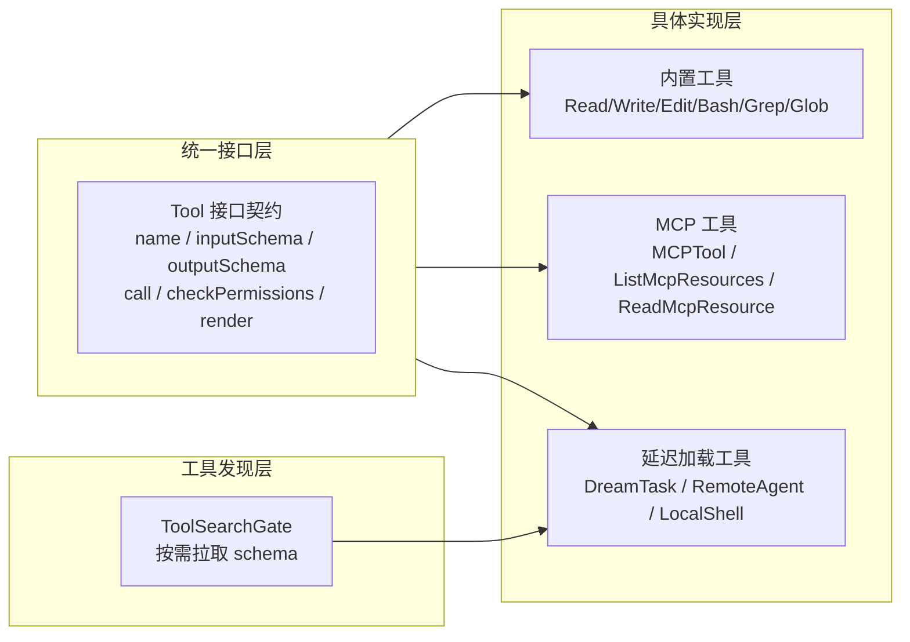
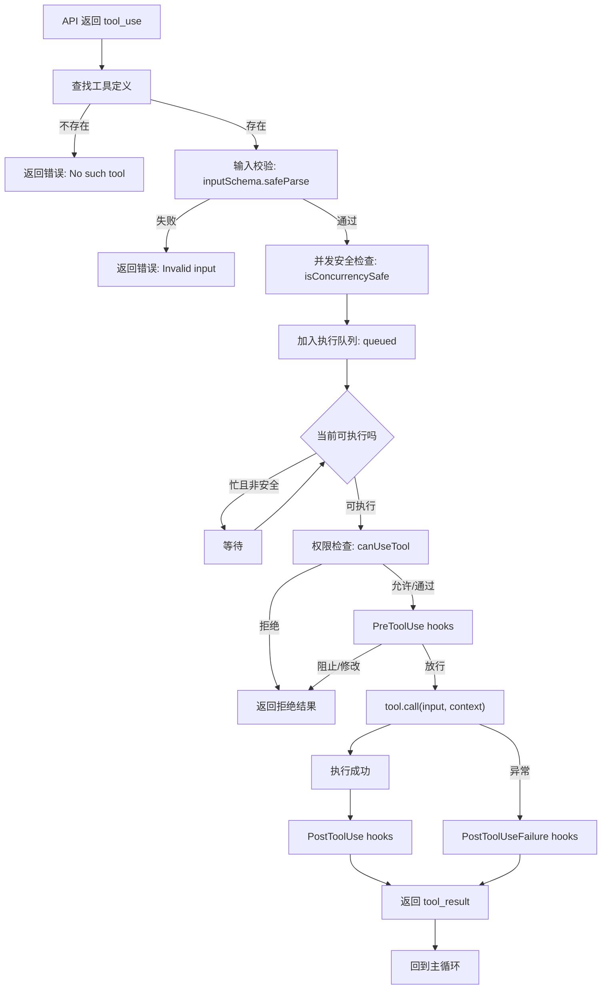

# 第 8 章：工具体系

Claude Code 的工具系统不是静态的工具清单，而是一个**三层协议栈**：统一接口层定义所有工具必须遵循的契约，具体实现层承载不同来源（内置、MCP、延迟加载）的实际能力，工具发现层处理按需暴露与 schema 完整化。每个工具调用在进入实际执行前还要经过 10 步管线：查找、校验、并发调度、权限审批、前置钩子、执行、后置钩子、结果格式化。

---

## 8.1 Tool 接口的完整性

`src/Tool.ts` 约 900 行。这不是接口膨胀——一个工具需要满足 12 个关注点的横切需求：

| 关注点 | 接口 | 运行时依赖方 |
|--------|------|-------------|
| 行为定义 | `call()`, `description()`, `prompt()` | 主循环、模型采样 |
| 类型安全 | `inputSchema: z.ZodType`, `outputSchema` | 工具调度、API 校验 |
| 权限控制 | `checkPermissions()`, `isReadOnly()`, `isDestructive()` | 权限引擎、只读验证 |
| 并发控制 | `isConcurrencySafe()` | StreamingToolExecutor、队列调度 |
| UI 渲染 | `renderToolUseMessage()`, `renderToolResultMessage()` | Ink 渲染引擎、transcript |
| 交互反馈 | `getActivityDescription()`, `getToolUseSummary()` | 终端状态行、进度展示 |
| 安全分类 | `toAutoClassifierInput()`, `isOpenWorld()` | 自动分类器 |
| 工具发现 | `searchHint()`, `shouldDefer()`, `alwaysLoad()` | ToolSearchGate、prompt 构造 |
| 错误展示 | `renderToolUseErrorMessage()`, `renderToolUseRejectedMessage()` | 错误处理 |
| 进度展示 | `renderToolUseProgressMessage()`, `renderToolUseQueuedMessage()` | UI 队列 |

**为何不是基类**——如果 `Tool` 是抽象类，每个子类被迫继承所有方法（包括空实现）。TypeScript 的结构化接口允许实现者只提供相关方法，`buildTool` 工厂填充默认值。这使得新增工具只需关注差异点——如 BashTool 只需要覆盖 `call()` 和 `isReadOnly()`，不需要提供 20+ 个方法的空壳。

### buildTool 工厂：fail-closed 默认值

```typescript
// Tool.ts:757-792
const TOOL_DEFAULTS = {
  isEnabled: () => true,
  isConcurrencySafe: (_input?: unknown) => false,  // 默认不安全
  isReadOnly: (_input?: unknown) => false,           // 默认是写操作
  isDestructive: (_input?: unknown) => false,
  checkPermissions: () => Promise.resolve({ behavior: 'allow' }),
  toAutoClassifierInput: () => '',
  userFacingName: () => '',
}

export function buildTool<D extends AnyToolDef>(def: D): BuiltTool<D> {
  return { ...TOOL_DEFAULTS, userFacingName: () => def.name, ...def } as BuiltTool<D>
}
```

**fail-closed 设计**——`isConcurrencySafe` 默认为 `false` 是安全决策。新工具开发者如果忘记设置，工具默认不并发执行（fail-closed），而非并发执行（fail-open）。同样 `isReadOnly` 默认为 `false`，降低安全漏洞风险——默认值偏向保守。

---

## 8.2 工具系统的三层结构



### 8.2.1 内置工具族

内置工具是主提示顶部直接暴露给模型的工具集合，分为 6 个子族：

| 子族 | 工具 | 特性 |
|------|------|------|
| 文件操作 | Read / Write / Edit / NotebookRead / NotebookEdit | 状态追踪、diff-based 编辑、文件历史 |
| 搜索 | Glob / Grep | ripgrep 绑定、并行文件匹配 |
| 执行 | Bash | 沙箱、只读验证、自动后台 |
| 代理与任务 | Agent / TaskCreate / TodoWrite / Skill | 子 Agent、任务系统、技能调用 |
| Web | WebFetch / WebSearch | URL 安全校验、搜索引擎集成 |
| 实用 | AskUserQuestion / ToolSearch | 用户交互、延迟工具发现 |

### 8.2.2 MCP 工具的特殊性

MCPTool 在接口上遵循 `Tool` 协议，但有几个本质差异：

```typescript
// MCPTool 默认覆盖
{
  isMcp: true,                         // 标记为 MCP 族
  isConcurrencySafe: () => false,      // MCP 工具默认不并发
  isReadOnly: () => false,             // 默认非只读
  checkPermissions: () => 'passthrough', // 权限由服务器级控制
}
```

MCP 工具的命名遵循 `mcp__<server>__<tool>` 模式，权限检查需要双重验证——服务器级 channel allowlist + 工具级 permission rules。

### 8.2.3 延迟加载与 ToolSearchGate

部分工具标记为 `shouldDefer: true`——它们不在初始工具列表中出现，而是只暴露名称。模型看到名称后，可以通过 `ToolSearch` 按需拉取完整 JSON Schema。

**为什么需要延迟加载**——如果不延迟，完整工具 schema（尤其 DreamTask、RemoteAgent 等复杂工具）会显著增大 prompt 体积。延迟加载使得 prompt 只包含工具名，不携带 schema，模型选择工具时才拉取完整定义。这是上下文压力控制策略。

ToolSearch 加载链：
1. 模型在 prompt 中看到 deferred tool 名称
2. 模型调用 `ToolSearch(query)`
3. ToolSearch 在 deferred registry 中匹配
4. 返回完整 function definition + JSONSchema
5. 工具进入可调用集合

---

## 8.3 工具调用 10 步管线

每个 `tool_use` block 在进入实际执行前需要经过 10 步管线：



### 步骤详解

**步骤 1：工具查找**——将 `tool_use.name` 映射到 `Tool` 实例。MCP 工具通过 `mcp__server__tool` 命名模式解析。

**步骤 2：输入校验**——`inputSchema.safeParse(input)`。Zod schema 校验在运行期执行，不是编译期。如果校验失败，错误直接返回给模型，不进入后续管线。

**步骤 3：并发调度**——`isConcurrencySafe()` 决定工具是否可以并行。安全工具（只读搜索）同时执行，不安全工具（写操作）独占执行。`StreamingToolExecutor` 维护 `TrackedTool` 状态机：`queued → executing → completed/yielded`。

**步骤 4：权限审批**——`canUseTool()` 执行 3 层判断：工具级 → 内容级 → 分类器。如果需要用户确认，`tool_use` 被挂起待审批。

**步骤 5：PreToolUse 钩子**——在真正执行前，匹配并执行 `PreToolUse` hooks。hook 可以 approve/deny/modify input。这是执行前最后一道闸门。

**步骤 6：实际执行**——`tool.call(input, context)`。不同工具走不同实现：Bash 走 shell 进程，FileRead 走 fs 读取，MCP 走 transport 远程调用。

**步骤 7~8：PostToolUse/PostToolUseFailure**——执行成功走 PostToolUse 钩子，失败走 PostToolUseFailure。两者都可以通过钩子改写结果或阻止继续。

**步骤 9：结果格式化**——tool_result 写回消息数组。结果必须与上一条 `tool_use` 的 `tool_use_id` 匹配——transcript validator 强制校验配对合法性。

**步骤 10：重回主循环**——结果回注后，主循环继续采样下一轮。

### tool_use_id：链路主键

```typescript
// 工具调用发起时生成唯一 ID
let w = crypto.randomUUID()
// 写入 tool_use_id，作为整条链路的主键
```

这个 ID 是 tool call loop 的 primary key——发起时写入、权限审批时回溯、结果返回时匹配。transcript validator 强制要求 `tool_result.tool_use_id` 与上一条 assistant 消息中的 `tool_use.id` 严格配对，否则 API 会拒绝。

---

## 8.4 StreamingToolExecutor：并发执行引擎

传统 `runTools` 是批处理——收集所有 `tool_use` blocks，按依赖顺序执行，完成后返回。StreamingToolExecutor 允许工具在流式到达时就执行：

```
传统: stream all tool_use → 排序 → 执行 1 → 执行 2 → 执行 3 → 返回结果
流式: stream tool_use_1 → 立即执行 1
      stream tool_use_2 → 立即执行 2（可与 1 并行）
      return 结果时先产出已经完成的
```

**延迟收益**——工具执行时间长（如 Bash 运行 `npm install` 需 10 秒）时，流式执行将端到端延迟从 `stream_duration + tool_duration` 降至 `max(stream_duration, tool_duration)`。

### TrackedTool 状态机

每个工具在 executor 中有明确状态：

```typescript
interface TrackedTool {
  state: 'queued' | 'executing' | 'completed' | 'yielded'
  tool_use_id: string
  result?: ToolResult
}
```

状态流转：`queued → executing → completed → yielded`。`yielded` 表示结果已产出给消费者，等待回收。

### 并发控制：安全工具并行，不安全工具独占

```typescript
function canExecuteTool(tool: TrackedTool, others: TrackedTool[]): boolean {
  if (tool.definition.isConcurrencySafe(tool.input)) {
    return true  // 安全工具总是可以并行
  }
  // 不安全工具需要独占——无其他工具在执行
  const othersExecuting = others.some(o => o.state === 'executing')
  return !othersExecuting
}
```

这是 fail-closed 的并发模型——默认不允许并行，除非工具明确声明 `isConcurrencySafe = true`。

---

## 8.5 BashTool 深度剖析

BashTool 是 Claude Code 中最复杂、最危险的内置工具。它给予 LLM 执行任意 shell 命令的能力，同时承担最多的安全检查。

### 权限验证层级

BashTool 的只读验证不是一个简单的正则匹配，而是多层解析：

```typescript
// BashTool.tsx:437-441
isReadOnly(input) {
  const compoundCommandHasCd = commandHasAnyCd(input.command)
  const result = checkReadOnlyConstraints(input, compoundCommandHasCd)
  return result.behavior === 'allow'
}
```

`checkReadOnlyConstraints` 不只检查命令本身（`cat` 是只读，`rm` 不是），还检查：
1. **复合命令结构**——`ls && echo done` 是只读的，但 `ls > output.txt` 不是（`>` 是写操作）
2. **输出重定向**——`>>`、`>`、`| tee` 都是写操作
3. **子 shell 传递**——`$(rm -rf /)` 在只读命令中嵌入写操作

### sed -i 内联编辑的特殊处理

BashTool 不让 sed 直接编辑文件——而是先模拟编辑结果，展示预览，用户确认后通过 `applySedEdit` 写内存内容：

```typescript
async function applySedEdit(simulatedEdit, toolUseContext, parentMessage) {
  const originalContent = await fs.readFile(absoluteFilePath, { encoding })
  if (fileHistoryEnabled() && parentMessage) {
    await fileHistoryTrackEdit(toolUseContext.updateFileHistoryState, absoluteFilePath, parentMessage.uuid)
  }
  const endings = detectLineEndings(absoluteFilePath)
  writeTextContent(absoluteFilePath, newContent, encoding, endings)
  notifyVscodeFileUpdated(absoluteFilePath, originalContent, newContent)
}
```

**这是 UI 信任决策而非技术限制**——如果 sed 直接执行，用户看到的预览和实际写入可能不一致。通过"先模拟后执行"，用户可以 100% 确信预览即写入。

### 自动后台执行

```typescript
const PROGRESS_THRESHOLD_MS = 2000           // 2 秒后显示进度
const ASSISTANT_BLOCKING_BUDGET_MS = 15_000  // 助手模式 15 秒后台化
const DISALLOWED_AUTO_BACKGROUND_COMMANDS = ['sleep']
```

助手模式下阻塞性命令 15 秒后自动后台化。`sleep` 被排除——它通常用于轮询循环（`while ! ready; do sleep 5; done`），后台化后模型收不到输出反馈。

### 工具输出持久化

当工具输出超过 30K 字符时，完整输出持久化到文件：

```typescript
persistedOutputPath: z.string().optional()   // 完整输出的文件路径
persistedOutputSize: z.number().optional()   // 完整输出的字节数
```

模型通过文件路径读取完整输出，而非在上下文中直接接收。这防止无限大输出阻塞工具结果通道。

---

## 8.6 文件操作工具

### FileReadTool：自限定策略

FileReadTool 的 `maxResultSizeChars` 设为 `Infinity`——它不会将结果持久化到文件。

**为什么**——如果 FileReadTool 的结果被持久化到文件，模型会再次调用 FileReadTool 读取持久化文件，形成 Read→持久化→读取→持久化的循环。通过设置 `Infinity`，工具自行管理结果大小（返回前 N 行/偏移量），不需要系统介入。

### FileEditTool：基于 diff 的编辑

FileEditTool 采用行级 diff 模式——不允许整文件替换，只能指定旧字符串和新字符串片段。这是安全决策：精确替换降低误写整个文件的风险。编辑后系统追踪文件历史，支持撤销操作。

### GrepTool：ripgrep 绑定

GrepTool 不依赖系统 `grep`，而是绑定 ripgrep（`rg`）。这反映了工程哲学：Claude Code 的每个内部操作都选择性能最优的底层工具。

---

## 8.7 工具系统的可观测性

工具系统暴露多个可观测点：

| 指标 | 来源 | 用途 |
|------|------|------|
| 工具调用计数 | `turnToolCount` | Turn 级别统计 |
| 工具执行耗时 | `turnToolDuration` | 性能分析 |
| 工具队列深度 | StreamingToolExecutor | 并发控制调试 |
| 工具拒绝率 | denialTracking | 安全审计 |

这些指标通过 OpenTelemetry 导出，支持运行时诊断和性能分析。
