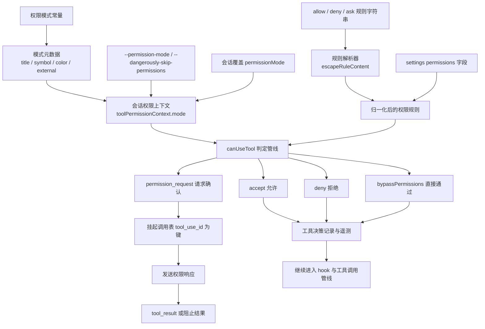
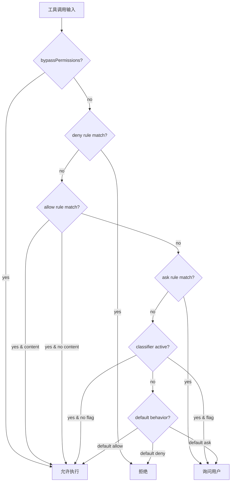
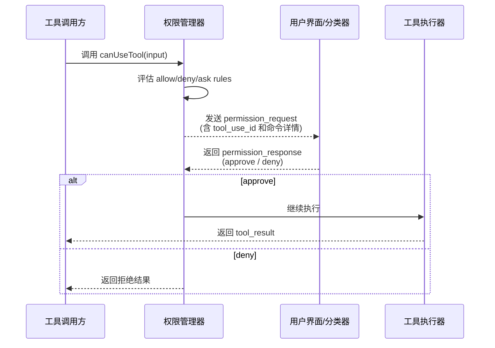

# 第 9 章：权限系统

Claude Code 的权限系统不是一个"弹窗确认"，而是一个**模式 × 规则 × 分类器**的三层策略引擎。6 个规则来源、3 种行为类型、多层分类器，贯穿从 CLI 参数到运行时会话的全生命周期。每一次工具执行前，权限判定管线都要完成从抽象规则语法到具体 allow/deny/ask 的完整评估链。

---

## 9.1 权限判定的三层架构



### 为什么是三层而不是一个 yes/no

源码里权限系统分为三层独立建模的维度：

1. **Permission Mode**——决定系统遇到危险操作时的默认行为倾向（放行、拒绝、询问、自动分类）
2. **Permission Rules**——具体的 allow/deny/ask 字符串规则，细化到工具内容级别
3. **Permission Request/Response**——交互链路，处理需要确认的 pending call

这意味着权限控制不是简单的 yes/no，而是一个完整策略系统。执行器不会绕过权限系统直接运行——权限判定先发生，工具执行后发生。

---

## 9.2 权限模式驱动

权限模式是系统级行为配置，决定默认遇到危险操作时的处理倾向：

| 模式 | 行为 | 使用场景 |
|------|------|---------|
| `default` | 每个写操作需要确认 | 默认交互模式 |
| `bypassPermissions` | 所有操作自动允许 | CI/CD、信任环境 |
| `acceptEdits` | 自动接受文件编辑 | 开发者工作流 |
| `plan` | 限制执行能力 | 只读规划模式 |
| `auto` | 分类器自动判定 | 实验性模式 |
| `dontAsk` | 自动通过（内部） | 内部使用 |

### bypassPermissions Kill Switch

```typescript
// bypassPermissionsKillswitch.ts
if (isInProtectedNamespace(process.cwd())) {
  permissionMode = 'default'  // 强制回默认模式
}
```

在受保护命名空间（如系统关键目录）中，即使用户启用了 `bypassPermissions`，权限模式也会被强制回 `default`。这是安全兜底策略——防止用户在危险目录中误关闭权限确认。

### 模式元数据系统

每个模式有独立的元数据定义：

```typescript
interface PermissionModeMeta {
  title: string        // 用户可见名称
  symbol: string       // UI 图标
  color: string        // 终端颜色编码
  external: boolean    // 是否对外暴露
}
```

元数据不仅用于展示，还被 UI、遥测、权限提示等系统读取。

---

## 9.3 规则来源的六层优先级

权限规则来自 6 个不同来源，按优先级从高到低评估：

```typescript
// permissions.ts:109-114
const PERMISSION_RULE_SOURCES = [
  ...SETTING_SOURCES,     // 用户设置、管理员设置、策略设置等
  'cliArg',               // 命令行参数（--allowedTools）
  'command',              // 命令注册时声明
  'session',              // 会话级别（运行时添加）
]
```

每个来源可以独立注册 allow/deny/ask 规则。高优先级来源覆盖低优先级。例如 CLI 参数的 `--allowedTools`（cliArg 来源）可以覆盖用户设置中的 deny 规则（如果管理员策略不阻止的话）。

### 规则语法解析

```
Bash                        → 工具级规则（所有 Bash 命令）
Bash(npm install)           → 内容级规则（只有 npm install）
Bash(git push:*)            → 前缀规则（git push: 开头的所有命令）
mcp__server1                → MCP 服务器级规则
mcp__server1__write_file    → MCP 工具级规则
```

解析器处理括号内的转义字符，顺序很重要：

```typescript
// permissionRuleParser.ts:55-79
export function escapeRuleContent(content: string): string {
  return content
    .replace(/\\/g, '\\\\')  // 先转义反斜杠
    .replace(/\(/g, '\\(')   // 再转义括号
    .replace(/\)/g, '\\)')
}
```

**反斜杠必须先转义**——如果先转义括号，`\(` 会被处理为 `\\(`，后续再处理反斜杠时变成 `\\\(`，引入额外的反斜杠。这是转义顺序的经典陷阱。

---

## 9.4 canUseTool 决策管线

`canUseTool()` 是权限判定的核心函数。它执行三步评估：



### 1. 工具级检查

首先检查整个工具是否在 deny 列表中。如果 `Bash` 被 deny，所有内容级 allow 规则都不会匹配——工具级 deny 优先于内容级 allow。

### 2. 内容级检查

如果工具级不匹配降级到内容级。`Bash(npm install)` 只匹配 `npm install` 命令，`Bash(git push:*)` 匹配所有以 `git push:` 开头的命令。

### 3. 分类器检查

如果前两层都没有结论且分类器活跃，分类器接管判断。分类器使用模型分析命令意图，返回 flag 表示是否需要人工确认。

### fallback 降级路径

```typescript
// permissions.ts（简化）
function toolMatchesRule(rule, toolName, toolInput) {
  if (rule.toolName === toolName) {
    // 内容级匹配
    if (rule.content) {
      return matchesContent(rule.content, toolInput)
    }
    // 工具级匹配（无 content）
    return true
  }
  return false
}
```

fallback 路径确保规则即使内容部分不匹配，工具级匹配仍然生效。

---

## 9.5 权限请求/响应交互链路

当判定为 `ask` 时，工具调用进入 pending 状态：



### tool_use_id 作为链路主键

pending 调用表以 `tool_use_id` 为键。这个 ID 在工具调用发起时生成，贯穿权限请求、响应、结果回写的完整路。

```typescript
// 发起工具调用时生成
const callId = crypto.randomUUID()
// 权限请求时用它回溯 pending call
// 返回 tool_result 时用它对上原始调用
```

### 权限请求的挂起与恢复

当工具需要权限时，主循环不会阻塞——它将 `tool_use` block 保留在消息中，等待 `permission_response`。收到响应后：
- approve：继续执行工具
- deny：返回拒绝结果，模型收到错误信息

---

## 9.6 Denial Tracking 与学习反馈

```typescript
// denialTracking.ts
interface DenialState {
  toolName: string
  content: string
  consecutiveDenials: number
  maxFailures: number
  windowMs: number
}
```

当模型反复尝试同一被拒命令时，denial tracker 记录连续失败次数。达到上限后，系统注入一条消息告诉模型"你需要请求用户的许可"，而不是继续重试。这是防止无限重试循环的机制。

### denial 追踪的窗口期

```typescript
function shouldFallbackToPrompting(state: DenialTrackingState): boolean {
  const recent = state.denials.filter(d =>
    d.toolName === state.currentTool &&
    d.timestamp > Date.now() - state.windowMs
  )
  return recent.length >= state.maxFailures
}
```

**为什么需要窗口期**——如果不设窗口一次历史上的拒绝会永久影响后续决策。窗口期确保只有近期的连续拒绝才触发 fallback。

---

## 9.7 MCP 权限的双重门控

MCP 工具需要双重权限验证：

1. **服务器级**——是否允许连接此 MCP 服务器？（channel allowlist gate）
2. **具级**——是否允许调用此工具？（常规 permission rules）

```typescript
// MCP 工具的权限覆盖
{
  isMcp: true,
  checkPermissions: () => 'passthrough', // 服务器级控制
}
```

MCP 工具的 `checkPermissions` 返回 `'passthrough'`，表示权限由 MCP 服务器自身控制，不经过 Claude Code 的常规权限引擎。但服务器级连接仍受 channel allowlist 门控——只有允许连接的服务器，其工具才可能被调用。

---

## 9.8 权限系统的遥测集成

每次权限判定都会记录决策遥测：

```typescript
interface ToolDecisionTelemetry {
  toolName: string
  decision: 'allowed' | 'denied' | 'asked'
  source: PermissionRuleSource
  duration: number
  turnCount: number
}
```

这些数据通过 OpenTelemetry 导出，支持安全审计、使用分析和性能诊断。

---

## 9.4 权限规则字符串解析

`permissionRuleParser.ts` 实现了从文本规则到内部数据结构的转换：

```
Bash                        → 工具级规则（所有 Bash 命令）
Bash(npm install)           → 内容级规则（只有 npm install）
Bash(git push:*)            → 前缀规则（以 git push: 开头的所有命令）
mcp__server1                → MCP 服务器级规则
mcp__server1__write_file    → MCP 工具级规则
```

### 转义处理

```typescript
// permissionRuleParser.ts:55-79
export function escapeRuleContent(content: string): string {
  return content
    .replace(/\/g, '\\')  // 先转义反斜杠
    .replace(/\(/g, '\(')   // 再转义括号
    .replace(/\)/g, '\)')
}
```

**为什么反斜杠先转义**——如果先转义括号，`\(` 会被处理为 `\(`，后续再处理反斜杠时会变成 `\\(`，引入额外的反斜杠。

### 规则优先级

规则按来源优先级依次评估。`canUseTool()` 执行 3 层判断：工具级 → 内容级 → 分类器。如果需要用户确认，`tool_use` 被挂起待审批。

---

## 9.5 Denial Tracking：防止无限重试循环

```typescript
// denialTracking.ts
const DENIAL_LIMITS = { maxFailures: number, windowMs: number }

function shouldFallbackToPrompting(state: DenialTrackingState): boolean {
  // 当同一命令的失败率达到阈值，切换为提示模式
  // 防止同一命令反复被拒的无限循环
}
```

当模型反复尝试同一被拒命令时，denial tracker 记录连续失败次数。达到上限后，系统注入一条消息告诉模型"你需要请求用户的许可"，而不是继续重试。

**这是一个防死循环机制**——如果模型持续尝试被拒绝的命令（如试图 `rm -rf /`），denial tracker 在 N 次拒绝后切换策略，不再让模型重试，而是提示"请请求许可"。
