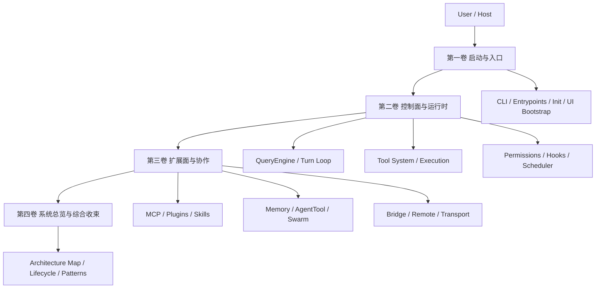

# 《Claude Code 源码解读书稿》

这不是对 `note/` 的简单搬运，而是一次从“逐站阅读”到“模块化成书”的重组。

原始语料仍然保留在 `note/`：它适合研究时逐站推进、逐文件咬合。`notebook/` 则承担另一种职责——把这些分散的阅读成果，重新组织成一套更接近源码解读书的结构：先给出总图，再分卷展开，最后回到系统级收束。

## 全书阅读方法

- 如果你想知道 **Claude Code 的整体骨架**，先看第四卷。
- 如果你想知道 **程序如何启动并进入 REPL**，从第一卷开始。
- 如果你想知道 **一次真实请求如何穿过配置、权限、工具与主循环**，重点看第二卷。
- 如果你想知道 **MCP、Plugin、Memory、Agent Team、Bridge、Transport 如何接入**，重点看第三卷。

## 推荐跳读路径

### 路径 A：先抓系统骨架
1. 第四卷前言
2. [第 11 章：核心架构总图](./part-4-system-synthesis/01-core-architecture-map.md)
3. [第 12 章：端到端请求生命周期](./part-4-system-synthesis/02-end-to-end-request-lifecycle.md)
4. 再回读第一、二、三卷各自前言

### 路径 B：先抓执行内核
1. [第 4 章：Config、Auth 与 Settings](./part-2-control-plane-and-runtime/01-config-auth-and-settings.md)
2. [第 5 章：QueryEngine 与 Turn Loop](./part-2-control-plane-and-runtime/02-query-engine-and-turn-loop.md)
3. [第 6 章：Tool 系统与执行管线](./part-2-control-plane-and-runtime/03-tool-system-and-execution.md)
4. [第 7 章：Permission、Hooks 与 Session Runtime](./part-2-control-plane-and-runtime/04-permissions-hooks-and-scheduler.md)

### 路径 C：先抓扩展与多智能体
1. [第 8 章：MCP、Plugin 与 Skills](./part-3-extension-and-collaboration/01-mcp-plugins-and-skills.md)
2. [第 9 章：Memory、AgentTool 与 Swarm](./part-3-extension-and-collaboration/02-memory-agent-and-swarm.md)
3. [第 10 章：Bridge、Remote 与 Transport](./part-3-extension-and-collaboration/03-bridge-remote-and-transport.md)
4. 最后回到第四卷看系统收束

## 全书总架构图

## 分卷目录

### 第一卷：启动与入口
- [前言](./part-1-startup-and-entry/00-preface.md)
- [第 1 章：进程入口与快速路径](./part-1-startup-and-entry/01-process-entry-and-fast-paths.md)
- [第 2 章：初始化装配与启动编排](./part-1-startup-and-entry/02-init-and-startup-assembly.md)
- [第 3 章：CLI、UI 与 Bootstrap State](./part-1-startup-and-entry/03-cli-ui-and-bootstrap-state.md)
- [本卷总结](./part-1-startup-and-entry/99-summary.md)

### 第二卷：控制面与运行时
- [前言](./part-2-control-plane-and-runtime/00-preface.md)
- [第 4 章：Config、Auth 与 Settings](./part-2-control-plane-and-runtime/01-config-auth-and-settings.md)
- [第 5 章：QueryEngine 与 Turn Loop](./part-2-control-plane-and-runtime/02-query-engine-and-turn-loop.md)
- [第 6 章：Tool 系统与执行管线](./part-2-control-plane-and-runtime/03-tool-system-and-execution.md)
- [第 7 章：Permission、Hooks 与 Session Runtime](./part-2-control-plane-and-runtime/04-permissions-hooks-and-scheduler.md)
- [本卷总结](./part-2-control-plane-and-runtime/99-summary.md)

### 第三卷：扩展面与协作
- [前言](./part-3-extension-and-collaboration/00-preface.md)
- [第 8 章：MCP、Plugin 与 Skills](./part-3-extension-and-collaboration/01-mcp-plugins-and-skills.md)
- [第 9 章：Memory、AgentTool 与 Swarm](./part-3-extension-and-collaboration/02-memory-agent-and-swarm.md)
- [第 10 章：Bridge、Remote 与 Transport](./part-3-extension-and-collaboration/03-bridge-remote-and-transport.md)
- [本卷总结](./part-3-extension-and-collaboration/99-summary.md)

### 第四卷：系统总览与综合收束
- [前言](./part-4-system-synthesis/00-preface.md)
- [第 11 章：核心架构总图](./part-4-system-synthesis/01-core-architecture-map.md)
- [第 12 章：端到端请求生命周期](./part-4-system-synthesis/02-end-to-end-request-lifecycle.md)
- [第 13 章：设计模式、覆盖矩阵与阅读地图](./part-4-system-synthesis/03-design-patterns-and-reading-guide.md)
- [本卷总结](./part-4-system-synthesis/99-summary.md)

### 附录
- [来源映射表](./appendix/source-map.md)

## 书稿的组织原则

1. **模块优先，不再按站点号直排。**
2. **原始语料不删除。** `note/` 保留原状，`notebook/` 负责重编排。
3. **前言与总结显式化。** 每一卷先回答“这一卷解决什么问题”，最后回答“这一卷留下了什么稳定认识”。
4. **图示只在关键处出现。**
   - 跨模块交互：`sequenceDiagram`
   - Agent 生命周期或对话流转：`stateDiagram-v2`
   - 核心结构关系：`graph`

## 图示索引

### 核心架构图
- [全书总架构图](#全书总架构图)
- [第一卷前言模块图](./part-1-startup-and-entry/00-preface.md)
- [第二卷前言模块图](./part-2-control-plane-and-runtime/00-preface.md)
- [第三卷前言模块图](./part-3-extension-and-collaboration/00-preface.md)
- [第四卷前言结构图](./part-4-system-synthesis/00-preface.md)
- [第 11 章：核心架构总图](./part-4-system-synthesis/01-core-architecture-map.md)

### 关键时序图
- [第 1 章：进程入口与快速路径](./part-1-startup-and-entry/01-process-entry-and-fast-paths.md)
- [第 2 章：初始化装配与启动编排](./part-1-startup-and-entry/02-init-and-startup-assembly.md)
- [第 5 章：QueryEngine 与 Turn Loop](./part-2-control-plane-and-runtime/02-query-engine-and-turn-loop.md)
- [第 6 章：Tool 系统与执行管线](./part-2-control-plane-and-runtime/03-tool-system-and-execution.md)
- [第 7 章：Permission、Hooks 与 Session Runtime](./part-2-control-plane-and-runtime/04-permissions-hooks-and-scheduler.md)
- [第 8 章：MCP、Plugin 与 Skills](./part-3-extension-and-collaboration/01-mcp-plugins-and-skills.md)
- [第 9 章：Memory、AgentTool 与 Swarm](./part-3-extension-and-collaboration/02-memory-agent-and-swarm.md)
- [第 10 章：Bridge、Remote 与 Transport](./part-3-extension-and-collaboration/03-bridge-remote-and-transport.md)
- [第 12 章：端到端请求生命周期](./part-4-system-synthesis/02-end-to-end-request-lifecycle.md)

### 状态机图
- [第 5 章：QueryEngine 与 Turn Loop](./part-2-control-plane-and-runtime/02-query-engine-and-turn-loop.md)
- [第 9 章：Memory、AgentTool 与 Swarm](./part-3-extension-and-collaboration/02-memory-agent-and-swarm.md)
- [第 12 章：端到端请求生命周期](./part-4-system-synthesis/02-end-to-end-request-lifecycle.md)

## 主要来源

- `note/read.md`
- `note/read-28.md` ~ `note/read-146.md`
- `note/read-143.md`
- `Lesson/*.md`
- `book/*.md`

更细的来源去向见附录：[来源映射表](./appendix/source-map.md)
