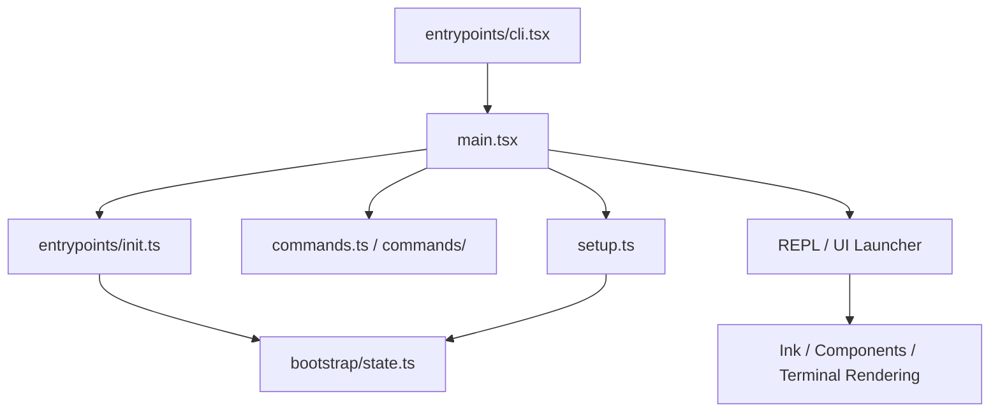

# 第一卷前言：启动与入口

如果把 Claude Code 看成一套多层系统，那么第一卷回答的不是“它会什么”，而是“它怎样活起来”。

这套系统最容易被误解的地方，在于人们往往只看到一个命令：`claude`。但源码真正展示的是一条更复杂的启动链：

- 进程先判断自己现在是什么宿主、要不要走特殊路径；
- 然后才进入 Commander 命令树与 `preAction` 初始化；
- 再往下，配置、认证、遥测、远程设置、MCP、插件、工作目录、tmux/worktree、UI 组件才逐渐装配；
- 最后才进入 REPL 或 headless 的实际运行面。

所以，“入口”不是一个文件，而是一条分层裁剪的启动秩序。

## 本卷要回答的 3 个问题

1. Claude Code 如何在大量运行模式之间做早分流，而不把启动成本拖到最坏？
2. `init()`、`main.tsx`、`setup.ts`、Bootstrap State 各自承担什么角色？
3. 为什么 UI 入口、REPL 和终端渲染，也应被视为启动架构的一部分？

## 本卷架构图

## 本卷章节安排

- 第 1 章：进程入口与快速路径
- 第 2 章：初始化装配与启动编排
- 第 3 章：CLI、UI 与 Bootstrap State

## 主要来源

- `note/read.md`
- `note/read-28.md` ~ `note/read-35.md`
- `note/read-142.md`
- `Lesson/cli-and-routing-architecture.md`
- `book/outline.md`
