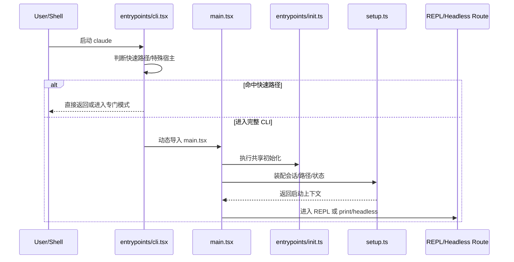

# 第 1 章：进程入口与快速路径

Claude Code 的入口设计，最重要的一点不是“有一个 CLI”，而是“它必须在极早阶段判断自己现在应该成为什么”。

这也是为什么 `entrypoints/cli.tsx` 在整个系统里极其关键：它不是普通的命令行包装器，而是一个启动路由器。某些路径命中后，根本不会加载完整 CLI 世界。

## 1.1 为什么入口要尽可能早分流

从 `note/read-143.md` 与 `book/outline.md` 的描述可以看出，Claude Code 需要处理多种完全不同的入口姿态：

- `--version` 这类零成本返回；
- `bridge`、`daemon`、`mcp`、`chrome` 这类专门模式；
- 正常 REPL / print / non-interactive 模式；
- 某些由环境变量或远程宿主决定的 SDK / remote 入口。

如果所有路径都先加载完整 `main.tsx`，再在内部二次分流，那么启动成本、模块耦合、依赖副作用都会迅速膨胀。

因此入口层的基本原则是：**未命中的路径不支付成本。**

## 1.2 快速路径不是优化细节，而是架构策略

在源码阅读笔记中，`cli.tsx` 被反复强调为“快速引导路由器”。这意味着：

- 某些分支只需打印版本，不需要渲染、不需要初始化 settings；
- 某些分支只拉起一个专门 worker，不需要整个 REPL；
- 某些分支是桥接宿主或 MCP server，本质上已经不是“普通 CLI 会话”。

这一设计背后真正要解决的问题是：

> 单一二进制怎样承载越来越多运行模式，而不把所有模式拖进同一个重量级入口里。

## 1.3 启动链时序图

## 1.4 入口层的几个关键判断

### 一，入口不是单一 CLI，而是多宿主分类层

`note/read.md` 对 `main.tsx` 的早期观察已经指出：Claude Code 不是只有一个命令行入口，它还可能承接 deep link、SDK、remote、SSH、assistant 等模式。

这意味着程序真正要先回答的是：

- 我现在服务谁？
- 这次会话是不是交互式？
- 我是否需要进入完整路由树？

### 二，动态导入不是代码风格，而是边界管理

从 `note/read-143.md` 与 `Lesson/cli-and-routing-architecture.md` 可以提炼出一个清晰原则：

- 入口文件必须尽量瘦；
- 不命中的模式不应该承担额外 import 成本；
- feature gate 不只是功能开关，也是在帮助入口保持可裁剪性。

### 三，真正的“完整 CLI 世界”要到 `main.tsx` 才成立

当 `cli.tsx` 决定进入完整模式后，`main.tsx` 才开始负责更重的工作：

- Commander 命令树
- preAction 初始化
- interactive / print / special mode 决策
- 共享运行时依赖的装配

因此，入口层不是应用本身，而是应用的**宿主选择器**。

## 1.5 入口分流为什么会反过来影响全书后面的结构

如果只是把入口层看成“启动前置”，就很容易低估它对后续系统形态的决定作用。实际上，后面几卷很多差异，往往在这里就已经被分出去了：

- 是否进入完整 CLI，决定了第二卷的 QueryEngine、Tool、Permission 链是否真的会被拉起；
- 是否命中 bridge、mcp、daemon 等特殊模式，决定了第三卷的扩展面是以哪种形态出现；
- 是否以 REPL、print、headless、remote attach 等方式进入，决定了第四卷看到的端到端生命周期长什么样。

也就是说，入口层并不只是“把人送进去”，而是在一开始就决定：这次会话接下来要走哪一张系统地图。

## 1.6 为什么“尽早分流”会成为全书反复出现的设计模式

第一章之所以重要，不只是因为它排在最前面，而是因为它暴露了 Claude Code 的一个全局设计倾向：**复杂系统必须尽早判断路径，避免所有成本都堆到同一入口**。

这条原则后面还会不断重现：

- 第二卷里，QueryEngine 会尽早区分文本收束与 tool_use 分支；
- Tool 执行会尽早进入权限与 hook 裁决；
- 第三卷里，MCP、Agent、Remote 也都会先被协议化或制度化，再真正进入运行时；
- 第四卷总结时，这会被重新提炼成 Claude Code 的核心设计模式之一。

所以入口层的价值，不只是解决启动速度，而是率先展示了整套系统如何控制复杂度。

## 1.7 本章小结

第一章想建立的认识只有一句话：

> Claude Code 的入口设计，不是“从命令行进程序”，而是“从很多可能的宿主形态里，尽快决定这次到底要活成哪一个系统”。

## 来源站点

- `note/read.md`
- `note/read-28.md` ~ `note/read-35.md`
- `note/read-142.md`
- `note/read-143.md`
