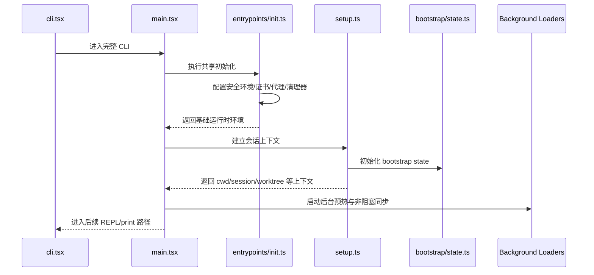
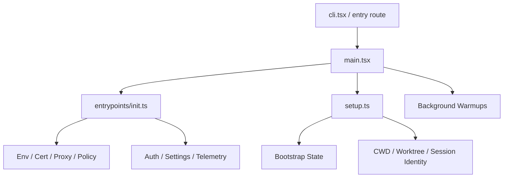

# 第 2 章：初始化装配与启动编排

如果说第一章回答的是“程序从哪里进来”，那么第二章回答的是“它怎样在真正开始工作前，把自己装配成一个可运行会话”。

Claude Code 的初始化不是一次函数调用，而是一串有先后约束的启动编排：配置读取、环境变量修正、认证准备、证书与代理、日志、遥测、远程托管设置、策略限制、MCP 与插件相关准备，这些步骤并不是平铺地堆在一起，而是被分成“必须先完成”和“可以后台继续”两类。

## 2.1 初始化的核心问题

从 `note/read.md`、`note/read-143.md` 与 `Lesson/full-system-architecture.md` 可以看出，启动阶段至少要同时解决三类问题：

1. **安全边界先落地**：例如安全环境变量、证书、代理、工作目录。
2. **共享依赖先可用**：例如 settings、auth、telemetry、policy。
3. **不阻塞首响**：能并行的预热必须尽量并行，能后台完成的任务不要卡住入口。

因此，初始化本质上是一种 **启动阶段的调度系统**。

## 2.2 启动链的真正难点：顺序

最值得注意的不是“要做很多事”，而是“这些事不能乱序”。

- 有些动作必须在任何命令前完成，例如共享 init 与 migrations；
- 有些动作只要尽早发起，不必阻塞，例如 remote managed settings 或部分预取；
- 有些动作会影响后续所有子进程行为，例如 CA cert、proxy 或环境变量注入；
- 还有些动作要等用户路径、会话模式、宿主类型明确后才能启动。

这也是为什么 `main.tsx`、`entrypoints/init.ts`、`setup.ts` 不能简单看成“功能分散的三个文件”，它们共同构成一条启动序列。

## 2.3 初始化时序图

## 2.4 初始化模块图

## 2.5 为什么 `preAction` 如此关键

`note/read.md` 对 `main.tsx` 的一个重要观察是：真正的 CLI 初始化并不是在 `main()` 顶部一次性完成，而是通过 Commander 的 `preAction` 组织。

这意味着 Claude Code 在概念上把启动分成了两层：

- **进程级准备**：让我先判断自己是什么、要不要进完整 CLI；
- **命令执行前准备**：既然你真的要执行某个命令，那我现在统一完成共享初始化。

这样做的价值是：

- 入口仍然可以保留很多快速路径；
- 一旦进入完整 CLI，所有命令又能共享同一套前置条件；
- 初始化逻辑不会散落到每个命令实现里。

## 2.6 `setup.ts` 的意义：让“启动”真正变成“会话”

很多系统做到 init 就停了，但 Claude Code 还多走了一步：它必须把一个进程启动，变成一个有身份、有路径、有状态边界的会话。

因此 `setup.ts` 这一层的价值，不是做更多杂事，而是把这些问题定下来：

- 当前 cwd 与 original cwd 的关系；
- 是否处于 worktree / tmux / remote / special host；
- hooks 和 session 相关上下文如何快照化；
- state 与后续 UI / runtime 如何共享基础身份。

## 2.7 为什么初始化阶段要区分“阻塞项”和“后台项”

从前面几卷的综合文档往回看，可以发现 Claude Code 的启动策略并不是“把能做的都先做完”，而是更细地分成两类：

- **阻塞项**：不做完，后续命令的安全性或正确性就不成立；
- **后台项**：越早开始越好，但没有必要拿它们阻塞首个可见响应。

这背后体现的是一种非常典型的大系统启动设计：**先确保制度边界成立，再追求体验上的完整预热**。

也正因为有这层分流，Claude Code 才能同时做到两件原本容易冲突的事：
- 启动时不显得笨重；
- 进入主循环后又已经拥有相对完整的运行条件。

## 2.8 初始化阶段真正建立的是“后续一切共享的地基”

如果把启动阶段只理解成“读配置”，就会低估它在全系统里的分量。实际上，后面各卷反复出现的很多能力，都要回头依赖这里先打下的地基：

- 第二卷里的 settings、auth、permission、hook，需要启动阶段先把来源与作用域定清；
- 第三卷里的 MCP、plugin、remote，需要启动阶段先把宿主环境、证书、网络与策略边界准备好；
- 第四卷里的端到端生命周期，也默认这些前置条件已经在入口处被统一安排。

所以初始化真正解决的不是“程序能不能跑起来”，而是“后面那么多控制面、执行面、扩展面，能不能站在同一块地面上运行”。

## 2.9 本章小结

第二章想建立的核心认识是：

> 初始化不是“把依赖都加载一遍”，而是在系统真正开始说话前，先替它安排好秩序、边界与后台并行关系。

## 来源站点

- `note/read.md`
- `note/read-28.md` ~ `note/read-35.md`
- `note/read-142.md`
- `note/read-143.md`
