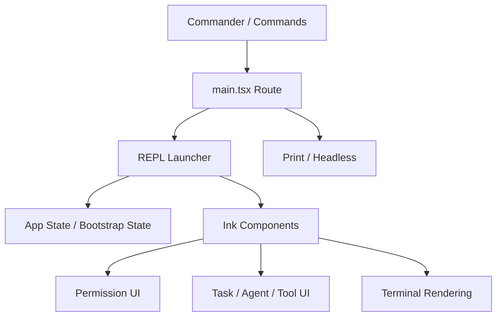

# 第 3 章：CLI、UI 与 Bootstrap State

当入口与初始化完成后，Claude Code 还差最后一层，才能真正进入“可交互系统”状态：它必须把命令系统、会话状态与终端界面缝合在一起。

因此这一章把三件看似分散的东西放在一起：

- CLI 命令系统
- Bootstrap State / 全局状态骨架
- REPL / UI / 终端渲染壳层

它们之所以应该并列，不是因为实现上相邻，而是因为这三者共同回答：**系统怎样把启动结果，转化为一个持续可见、可交互、可追踪的会话。**

## 3.1 为什么状态骨架必须提前成立

`note/read-145.md` 与 `note/read-131.md` 已经指出，`bootstrap/state.ts` 是整个代码库中最重要的底座文件之一。它的角色不是存“某些数据”，而是决定：

- 什么算全局状态；
- 哪些状态可被订阅；
- 会话身份如何跨 UI、runtime、tool、agent 传播；
- forked agent 与主会话之间哪些可共享、哪些必须隔离。

换句话说，REPL 看到的界面、工具看到的上下文、agent 看到的父状态，背后都依赖同一个状态核心。

## 3.2 命令系统与 UI 不是两套世界

阅读 `note/read.md`、`note/read-142.md` 后会发现，Claude Code 的 UI 并不是在 CLI 之外再单独起一套程序。恰恰相反：

- Commander 负责把请求送进合适的模式；
- `main.tsx` 与 `replLauncher` 决定是否进入交互式世界；
- Ink / components / hooks 再把运行时状态变成用户可见界面。

也就是说，命令系统并不是 UI 的前置脚本，而是 UI 的真正入口层。

## 3.3 启动后为什么还要看终端渲染

如果只从“功能”角度看，终端渲染像是末端细节；但从“系统”角度看，它决定了 Claude Code 这类 CLI 智能体产品最终怎样被感知。

- 会话状态如何变成屏幕上的消息流；
- 权限请求如何以交互框出现；
- 工具输出、任务状态、agent 状态如何被整理为可阅读形态；
- 大输出如何虚拟滚动、怎样避免重渲染抖动。

这些都说明：UI 不只是壳，而是运行时的一部分。

## 3.4 启动壳层架构图

## 3.5 本章小结

第三章想留下的稳定认识是：

> Claude Code 的“启动完成”并不意味着程序已经结束装配；真正的完成，是命令系统、状态骨架与终端界面共同成立之后，系统才第一次拥有了可持续运转的表面与内核。

## 来源站点

- `note/read.md`
- `note/read-131.md`
- `note/read-142.md`
- `note/read-145.md`
- `Lesson/README.md`
