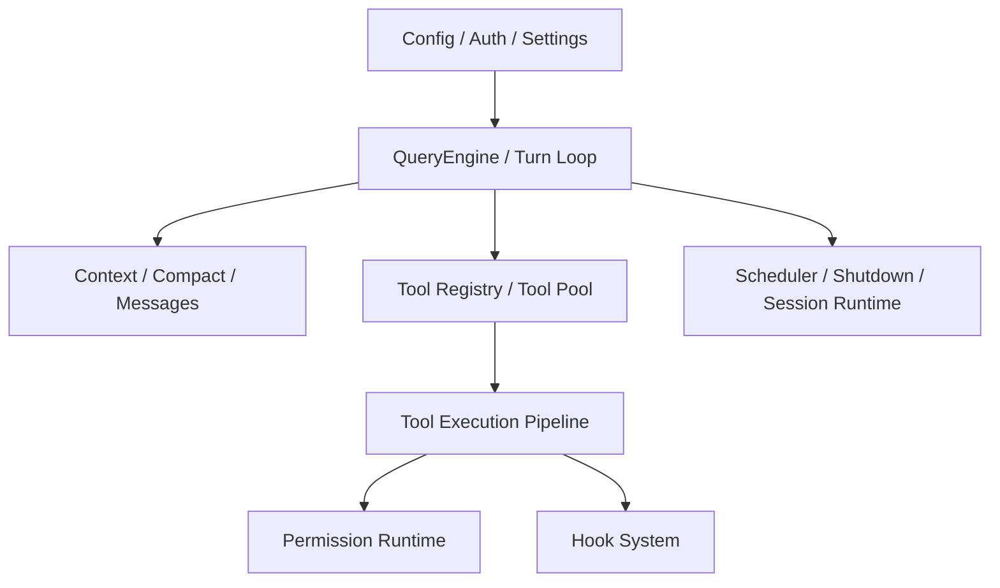

# 第二卷前言：控制面与运行时

如果第一卷回答的是“Claude Code 怎样活起来”，那么第二卷回答的是“它活起来之后，怎样稳定地运转”。

这一卷对应的是 Claude Code 真正的控制中枢：

- 配置、认证、settings 如何决定行为边界；
- QueryEngine 如何组织 turn；
- Tool 如何被发现、校验、执行并回写结果；
- Permission 与 Hook 如何像制度一样横切全局；
- Scheduler、Shutdown、Session Runtime 如何让长期运行的系统不失控。

## 本卷要回答的 3 个问题

1. 一轮请求是怎样被拆解并重新收束的？
2. 为什么 Tool、Permission、Hook 不应该被理解成彼此独立的功能点？
3. Claude Code 如何在开放执行能力的同时，仍然维持可验证边界？

## 本卷架构图

## 本卷章节安排

- 第 4 章：Config、Auth 与 Settings
- 第 5 章：QueryEngine 与 Turn Loop
- 第 6 章：Tool 系统与执行管线
- 第 7 章：Permission、Hooks 与 Session Runtime

## 主要来源

- `note/read-61.md` ~ `note/read-70.md`
- `note/read-98.md`
- `note/read-126.md`
- `note/read-130.md`
- `note/read-137.md`
- `note/read-139.md`
- `note/read-141.md`
